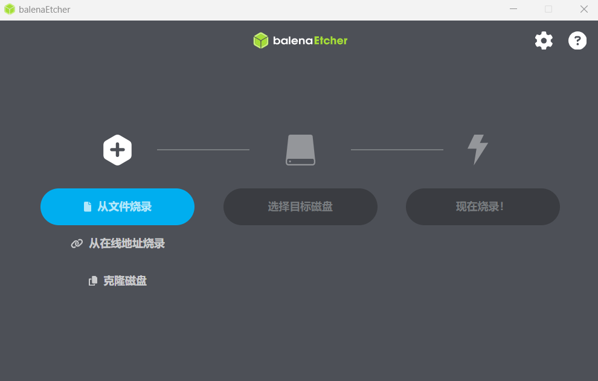
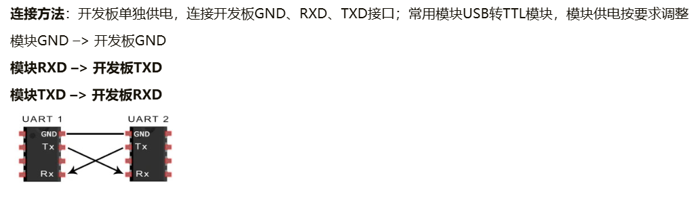

# bannanapi M4 ZERO 安装系统


<!--more-->

## 资料

开源硬件社区： [香蕉派(Banana Pi)开源硬件社区,单板计算机，开发板，路由器，物联网，创客教育](https://banana-pi.org.cn/)

开发者论坛： [banana pi single board computer open source project official forum BPI team - Banana Pi Open Source Hardware:SBC ,Router ,IoT, AI,Maker DIY](https://forum.banana-pi.org/)

Banana Pi BPI-M4 Zero： [Banana Pi BPI-M4 Zero | BananaPi Docs](https://docs.banana-pi.org/en/BPI-M4_Zero/BananaPi_BPI-M4_Zero)
[Getting Started BPI-M4 Zero | BananaPi Docs](https://docs.banana-pi.org/en/BPI-M4_Zero/GettingStarted_BPI-M4_Zero)

## 系统安装

### 烧录系统

参考：[Getting Started BPI-M4 Zero | BananaPi Docs](https://docs.banana-pi.org/en/BPI-M4_Zero/GettingStarted_BPI-M4_Zero)



### 启动

通过UART接口与开发板通信



### Install Image to eMMC

```
sudo bananapi-config
```

此时报错，找不到config命令，下载也找不到

```
Reading package lists... Done
Building dependency tree... Done
Reading state information... Done
E: Unable to locate package armbian-config
```

#### install the Linux system image on the eMMC.

minimal版本镜像默认没有安装bananapi-config命令，可以参考下面命令安装

```shell
wget https://banana-pi.org/bananapi-config_1.0.0_all.deb

sudo apt install iperf3 expect pv unzip build-essential html2text html2text software-properties-common

sudo dpkg -i /your-path/bananapi-config_1.0.0_all.deb

sudo bananapi-config
```

### **擦除 eMMC**


### Unable to locate package armbian-config 解决方案

**添加Armbian仓库**

```sh
echo "deb [arch=arm64] http://apt.armbian.com $(lsb_release -cs) main" | sudo tee /etc/apt/sources.list.d/armbian.list
sudo apt-key adv --keyserver keyserver.ubuntu.com --recv-keys 9F0E78D1
sudo apt update
```

```
Err:3 http://mirrors.sustech.edu.cn/armbian jammy InRelease
  The following signatures couldn't be verified because the public key is not available: NO_PUBKEY 93D6889F9F0E78D5
Reading package lists... Done
W: GPG error: http://mirrors.sustech.edu.cn/armbian jammy InRelease: The following signatures couldn't be verified because the public key is not available: NO_PUBKEY 93D6889F9F0E78D5
```

更新完如果报以上错误，说明apt-key有问题：

```sh
# 1、‌通过apt-key命令导入‌（适用于旧版Debian/Ubuntu）
sudo apt-key adv --keyserver keyserver.ubuntu.com --recv-keys 93D6889F9F0E78D5
```

```sh
# 2、‌通过gpg命令手动导入‌（通用方法）
gpg --keyserver keyserver.ubuntu.com --recv-keys 93D6889F9F0E78D5
gpg --export --armor 93D6889F9F0E78D5 | sudo apt-key add 
```


### 安装docker

```

sudo apt-key adv --keyserver keyserver.ubuntu.com --recv-keys 7EA0A9C3F273FCD8
```


