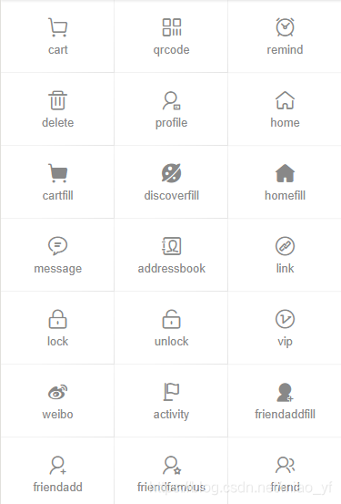
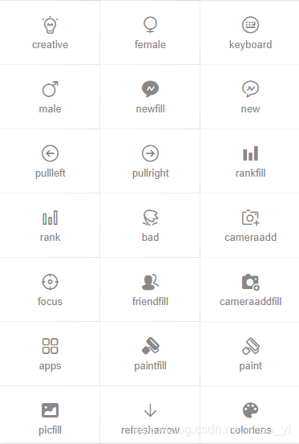
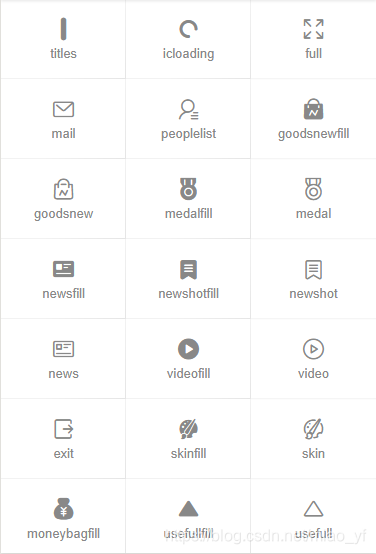
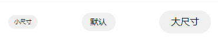
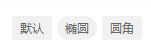

# ColorUI简易教程


<!--more-->

> 本文由 [简悦 SimpRead](http://ksria.com/simpread/) 转码， 原文地址 [blog.csdn.net](https://blog.csdn.net/miao_yf/article/details/102971767?spm=1001.2014.3001.5501)

**本教程配合[官方示例](https://github.com/weilanwl/ColorUI)食用更佳！！！**

**目录**

[TOC]


* * *

前言
==


ColorUI是一个css库！！！在你引入样式后可以根据class来调用组件 

* * *

快速上手
====

使用UniApp开发
----------

### 开始

[下载源码](https://github.com/weilanwl/ColorUI)解压获得`/Colorui-UniApp`文件夹，复制目录下的 `/colorui` 文件夹到你的项目根目录

`App.vue` 引入关键Css `main.css` `icon.css`

```
<style>
@import "colorui/main.css";
@import "colorui/icon.css";
@import "app.css"; /* 你的项目css */
....
</style>
```

### 使用自定义导航栏

导航栏作为常用组件有做简单封装，当然你也可以直接复制代码结构自己修改，达到个性化目的。

`App.vue` 获得系统信息

```
onLaunch: function() {
	uni.getSystemInfo({
		success: function(e) {
			// #ifndef MP
			Vue.prototype.StatusBar = e.statusBarHeight;
			if (e.platform == 'android') {
				Vue.prototype.CustomBar = e.statusBarHeight + 50;
			} else {
				Vue.prototype.CustomBar = e.statusBarHeight + 45;
			};
			// #endif
			// #ifdef MP-WEIXIN
			Vue.prototype.StatusBar = e.statusBarHeight;
			let custom = wx.getMenuButtonBoundingClientRect();
			Vue.prototype.Custom = custom;
			Vue.prototype.CustomBar = custom.bottom + custom.top - e.statusBarHeight;
			// #endif		
			// #ifdef MP-ALIPAY
			Vue.prototype.StatusBar = e.statusBarHeight;
			Vue.prototype.CustomBar = e.statusBarHeight + e.titleBarHeight;
			// #endif
		}
	})
},
```

`pages.json` 配置取消系统导航栏

```
"globalStyle": {
	"navigationStyle": "custom"
},
```

复制代码结构可以直接使用，注意全局变量的获取。

使用封装,在`main.js` 引入 `cu-custom` 组件。

```
import cuCustom from './colorui/components/cu-custom.vue'
Vue.component('cu-custom',cuCustom)
```

`page.vue` 页面可以直接调用了

```
<cu-custom bgColor="bg-gradual-blue" :isBack="true">
	<block slot="backText">返回</block>
	<block slot="content">导航栏</block>
</cu-custom>
```

<table><thead><tr><th>参数</th><th>作用</th><th>类型</th><th>默认值</th></tr></thead><tbody><tr><td>bgColor</td><td>背景颜色类名</td><td>String</td><td>''</td></tr><tr><td>isBack</td><td>是否开启返回</td><td>Boolean</td><td>false</td></tr><tr><td>bgImage</td><td>背景图片路径</td><td>String</td><td>''</td></tr></tbody></table><table><thead><tr><th>slot块</th><th>作用</th></tr></thead><tbody><tr><td>backText</td><td>返回时的文字</td></tr><tr><td>content</td><td>中间区域</td></tr><tr><td>right</td><td>右侧区域(小程序端可使用范围很窄！)</td></tr></tbody></table>

使用原生小程序开发
---------

### 从现有项目开始

[下载源码](https://github.com/weilanwl/ColorUI)解压获得`/demo`，复制目录下的 `/colorui` 文件夹到你的项目根目录

`App.wxss` 引入关键Css `main.wxss` `icon.wxss`

```
@import "colorui/main.wxss";
@import "colorui/icon.wxss";
@import "app.css"; /* 你的项目css */
....
```

### 从新项目开始

下载源码解压获得`/template`，复制`/template`并重命名为你的项目，导入到小程序开发工具既可以开始你的新项目了

### 使用自定义导航栏

导航栏作为常用组件有做简单封装，当然你也可以直接复制代码结构自己修改，达到个性化目的。

`App.js` 获得系统信息

```
 onLaunch: function() {
    wx.getSystemInfo({
      success: e => {
        this.globalData.StatusBar = e.statusBarHeight;
        let custom = wx.getMenuButtonBoundingClientRect();
        this.globalData.Custom = custom;  
        this.globalData.CustomBar = custom.bottom + custom.top - e.statusBarHeight;
      }
    })
},
```

`App.json` 配置取消系统导航栏,并全局引入组件

```
"window": {
	"navigationStyle": "custom"
},
"usingComponents": {
    "cu-custom":"/colorui/components/cu-custom"
}
```

`page.wxml` 页面可以直接调用了

```
<cu-custom bgColor="bg-gradual-pink" isBack="{{true}}">
	<view slot="backText">返回</view>
	<view slot="content">导航栏</view>
</cu-custom>
 
```

<table><thead><tr><th>参数</th><th>作用</th><th>类型</th><th>默认值</th></tr></thead><tbody><tr><td>bgColor</td><td>背景颜色类名</td><td>String</td><td>''</td></tr><tr><td>isBack</td><td>是否开启返回</td><td>Boolean</td><td>false</td></tr><tr><td>isCustom</td><td>是否开启左侧胶囊</td><td>Boolean</td><td>false</td></tr><tr><td>bgImage</td><td>背景图片路径</td><td>String</td><td>''</td></tr></tbody></table><table><thead><tr><th>slot块</th><th>作用</th></tr></thead><tbody><tr><td>backText</td><td>返回时的文字</td></tr><tr><td>content</td><td>中间区域</td></tr><tr><td>right</td><td>右侧区域(小程序端可使用范围很窄！)</td></tr></tbody></table>

* * *

组件
==

基础元素
----

### layout布局

**Flex布局**

> 父级添加class名flex

*   固定尺寸

> 通过添加class名basic-{{options}}来设置分栏大小，options可以取五个值，分别为xs、sm、df、lg、xl


```
<view class="padding bg-white">
	<view class="flex flex-wrap">
		<view class="basis-xs bg-grey margin-xs padding-sm radius">xs(20%)</view>
		<view class="basis-df"></view>
		<view class="basis-sm bg-grey margin-xs padding-sm radius">sm(40%)</view>
		<view class="basis-df"></view>
		<view class="basis-df bg-grey margin-xs padding-sm radius">df(50%)</view>
		<view class="basis-lg bg-grey margin-xs padding-sm radius">lg(60%)</view>
		<view class="basis-xl bg-grey margin-xs padding-sm radius">xl(80%)</view>
	</view>
</view>
```

*   比例布局

> 通过添加class名flex-{{options}}来设置分栏大小，options可以取值sub、twice、treble，分别代表占比1，2，3


```
<view class="padding bg-white">
	<view class="flex">
		<view class="flex-sub bg-grey padding-sm margin-xs radius">1</view>
		<view class="flex-sub bg-grey padding-sm margin-xs radius">1</view>
	</view>
	<view class="flex">
		<view class="flex-sub bg-grey padding-sm margin-xs radius">1</view>
		<view class="flex-twice bg-grey padding-sm margin-xs radius">2</view>
	</view>
	<view class="flex">
		<view class="flex-sub bg-grey padding-sm margin-xs radius">1</view>
		<view class="flex-twice bg-grey padding-sm margin-xs radius">2</view>
		<view class="flex-treble bg-grey padding-sm margin-xs radius">3</view>
	</view>
</view>
```

*   水平对齐（justify）

> 通过添加class名justify-{{options}}来设置盒子水平对齐方式，options可以取值start、end、center、between、around，效果可以参考flex布局布局中的容器属性justify-content（[Flex布局教程](http://www.ruanyifeng.com/blog/2015/07/flex-grammar.html?utm_source=tuicool%29)）


```
<view class="bg-white">
	<view class="flex solid-bottom padding justify-start">
		<view class="bg-grey padding-sm margin-xs radius">start</view>
		<view class="bg-grey padding-sm margin-xs radius">start</view>
	</view>
	<view class="flex solid-bottom padding justify-end">
		<view class="bg-grey padding-sm margin-xs radius">end</view>
		<view class="bg-grey padding-sm margin-xs radius">end</view>
	</view>
	<view class="flex solid-bottom padding justify-center">
		<view class="bg-grey padding-sm margin-xs radius">center</view>
		<view class="bg-grey padding-sm margin-xs radius">center</view>
	</view>
	<view class="flex solid-bottom padding justify-between">
		<view class="bg-grey padding-sm margin-xs radius">between</view>
		<view class="bg-grey padding-sm margin-xs radius">between</view>
	</view>
	<view class="flex solid-bottom padding justify-around">
		<view class="bg-grey padding-sm margin-xs radius">around</view>
		<view class="bg-grey padding-sm margin-xs radius">around</view>
	</view>
</view>
```

*   垂直对齐（align）

> 通过添加class名align-{{options}}来设置盒子垂直对齐方式，options可以取值start、end、center，效果可以参考flex布局布局中的容器属性align-item（[Flex布局教程](http://www.ruanyifeng.com/blog/2015/07/flex-grammar.html?utm_source=tuicool%29)）


```
<view class="bg-white">
	<view class="flex solid-bottom padding align-start">
		<view class="bg-grey padding-lg margin-xs radius">ColorUi</view>
		<view class="bg-grey padding-sm margin-xs radius">start</view>
	</view>
	<view class="flex solid-bottom padding align-end">
		<view class="bg-grey padding-lg margin-xs radius">ColorUi</view>
		<view class="bg-grey padding-sm margin-xs radius">end</view>
	</view>
	<view class="flex solid-bottom padding align-center">
		<view class="bg-grey padding-lg margin-xs radius">ColorUi</view>
		<view class="bg-grey padding-sm margin-xs radius">center</view>
	</view>
</view>
```

**Grid布局**

> 父级添加class名grid

*   等分列

> 通过添加class名col-{{options}}来实现栅格布局，options可以取值1、2、3、4、5


```
<view class="bg-white padding">
	<view class="grid margin-bottom text-center" v-for="(item,index) in 5" :key="index" :class="'col-' + (index+1)">
		<view class="padding" :class="indexs%2==0?'bg-cyan':'bg-blue'" v-for="(item,indexs) in (index+1)" :key="indexs">{{index+1}}</view>
	</view>
</view>
```

*   等高

> 通过添加class名grid-square设置盒子内容等高，添加col-{{options}}来设置分栏个数，options可以取值1、2、3、4、5，将盒子等分


```
<view class="bg-white padding">
	<view class="grid col-4 grid-square">
		<view class="bg-img" v-for="(item,index) in avatar" :key="index" :style="[{ backgroundImage:'url(' + avatar[index] + ')' }]"></view>
	</view>
</view>
 
----------------------------------------------------------------------------------------
 
data() {
	return {
		avatar: ['https://ossweb-img.qq.com/images/lol/web201310/skin/big10001.jpg',
			'https://ossweb-img.qq.com/images/lol/web201310/skin/big81005.jpg',
			'https://ossweb-img.qq.com/images/lol/web201310/skin/big25002.jpg',
			'https://ossweb-img.qq.com/images/lol/web201310/skin/big99008.jpg'
		],
	}
},
```

**布局相关class**

<table border="1" cellpadding="1" cellspacing="1"><thead><tr><th style="width:212px;">class</th><th style="width:328px;">说明</th><th style="width:416px;">可选值</th></tr></thead><tbody><tr><td style="width:212px;">flex</td><td style="width:328px;">flex布局必选值</td><td style="width:416px;">——</td></tr><tr><td style="width:212px;">basic-{{options}}</td><td style="width:328px;">设置分栏大小</td><td style="width:416px;">xs/sm/df/lg/xl</td></tr><tr><td style="width:212px;">flex-{{options}}</td><td style="width:328px;">以比例设置分栏大小</td><td style="width:416px;">sub/twice/treble</td></tr><tr><td style="width:212px;">justify-{{options}}</td><td style="width:328px;">水平对齐方式</td><td style="width:416px;">start/end/center/between/around</td></tr><tr><td style="width:212px;">align-{{options}}</td><td style="width:328px;">垂直对齐方式</td><td style="width:416px;">start/end/center</td></tr><tr><td style="width:212px;">grid</td><td style="width:328px;">grid布局必选值</td><td style="width:416px;">——</td></tr><tr><td style="width:212px;">col-{{options}}</td><td style="width:328px;">栅格布局</td><td style="width:416px;">1/2/3/4/5</td></tr><tr><td style="width:212px;">grid-square</td><td style="width:328px;">等高</td><td style="width:416px;">——</td></tr><tr><td style="width:212px;">fl</td><td style="width:328px;">左浮</td><td style="width:416px;">——</td></tr><tr><td style="width:212px;">fr</td><td style="width:328px;">右浮</td><td style="width:416px;">——</td></tr><tr><td style="width:212px;">margin-{{options}}</td><td style="width:328px;">外边距</td><td style="width:416px;">xs/sm/df/lg/xl</td></tr><tr><td style="width:212px;">padding-{{options}}</td><td style="width:328px;">内边距</td><td style="width:416px;">xs/sm/df/lg/xl</td></tr><tr><td style="width:212px;">margin-lr-{{options}}</td><td style="width:328px;">水平方向外边距</td><td style="width:416px;">xs/sm/df/lg/xl</td></tr><tr><td style="width:212px;">padding-lr-{{options}}</td><td style="width:328px;">水平方向内边距</td><td style="width:416px;">xs/sm/df/lg/xl</td></tr><tr><td style="width:212px;">margin-tb-{{options}}</td><td style="width:328px;">垂直方向外边距</td><td style="width:416px;">xs/sm/df/lg/xl</td></tr><tr><td style="width:212px;">padding-tb-{{options}}</td><td style="width:328px;">垂直方向内边距</td><td style="width:416px;">xs/sm/df/lg/xl</td></tr><tr><td style="width:212px;">margin-top-{{options}}</td><td style="width:328px;">上外边距</td><td style="width:416px;">xs/sm/df/lg/xl</td></tr><tr><td style="width:212px;">padding-top-{{options}}</td><td style="width:328px;">上内边距</td><td style="width:416px;">xs/sm/df/lg/xl</td></tr><tr><td style="width:212px;">margin-right-{{options}}</td><td style="width:328px;">右外边距</td><td style="width:416px;">xs/sm/df/lg/xl</td></tr><tr><td style="width:212px;">padding-right-{{options}}</td><td style="width:328px;">右内边距</td><td style="width:416px;">xs/sm/df/lg/xl</td></tr><tr><td style="width:212px;">margin-bottom-{{options}}</td><td style="width:328px;">下外边距</td><td style="width:416px;">xs/sm/df/lg/xl</td></tr><tr><td style="width:212px;">padding-bottom-{{options}}</td><td style="width:328px;">下内边距</td><td style="width:416px;">xs/sm/df/lg/xl</td></tr><tr><td style="width:212px;">margin-left-{{options}}</td><td style="width:328px;">左外边距</td><td style="width:416px;">xs/sm/df/lg/xl</td></tr><tr><td style="width:212px;">padding-left-{{options}}</td><td style="width:328px;">左内边距</td><td style="width:416px;"><p>xs/sm/df/lg/xl</p></td></tr></tbody></table>

 注：lr，left-right；tb，top-bottom； 

### Background背景 

**颜色背景** 

*   深色 

>  通过添加class名bg-{{options}}设置背景

 

```
<view class="grid col-3 padding-sm">
	<view class="padding-sm" v-for="(item,index) in ColorList" :key="index">
		<view class="padding radius text-center shadow-blur" :class="'bg-' + item.name">
			<view class="text-lg">{{item.title}}</view>
			<view class="margin-top-sm text-Abc">{{item.name}}</view>
		</view>
	</view>
</view>
```

*   浅色

>  通过添加class名bg-{{options}}设置背景颜色，添加class名light表示相应的浅色


```
<view class="grid col-3 bg-white padding-sm">
	<view class="padding-sm" v-for="(item,index) in ColorList" :key="index" v-if="index<12">
		<view class="padding radius text-center light" :class="'bg-' + item.name">
			<view class="text-lg">{{item.title}}</view>
			<view class="margin-top-sm text-Abc">{{item.name}}</view>
		</view>
	</view>
</view>
```

*    渐变

> 通过添加class名bg-gradual-{{options}}设置渐变背景颜色


```
<view class="grid col-2 padding-sm">
	<view class="padding-sm">
		<view class="bg-gradual-red padding radius text-center shadow-blur">
			<view class="text-lg">魅红</view>
			<view class="margin-top-sm text-Abc">#f43f3b - #ec008c</view>
		</view>
	</view>
	<view class="padding-sm">
		<view class="bg-gradual-orange padding radius text-center shadow-blur">
			<view class="text-lg">鎏金</view>
			<view class="margin-top-sm text-Abc">#ff9700 - #ed1c24</view>
		</view>
	</view>
	<view class="padding-sm">
		<view class="bg-gradual-green padding radius text-center shadow-blur">
			<view class="text-lg">翠柳</view>
			<view class="margin-top-sm text-Abc">#39b54a - #8dc63f</view>
		</view>
	</view>
	<view class="padding-sm">
		<view class="bg-gradual-blue padding radius text-center shadow-blur">
			<view class="text-lg">靛青</view>
			<view class="margin-top-sm text-Abc">#0081ff - #1cbbb4</view>
		</view>
	</view>
	<view class="padding-sm">
		<view class="bg-gradual-purple padding radius text-center shadow-blur">
			<view class="text-lg">惑紫</view>
			<view class="margin-top-sm text-Abc">#9000ff - #5e00ff</view>
		</view>
	</view>
	<view class="padding-sm">
		<view class="bg-gradual-pink padding radius text-center shadow-blur">
			<view class="text-lg">霞彩</view>
			<view class="margin-top-sm text-Abc">#ec008c - #6739b6</view>
		</view>
	</view>
</view>
```

 **图片背景**

*   透明背景（文字层）

> 通过bg-img设置图片背景，bg-mask设置透明遮罩层


```
<view class="bg-img bg-mask flex align-center" style="background-image: url('https://ossweb-img.qq.com/images/lol/web201310/skin/big10006.jpg');height: 414upx;">
	<view class="padding-xl text-white">
		<view class="padding-xs text-xxl text-bold">
			钢铁之翼
		</view>
		<view class="padding-xs text-lg">
			Only the guilty need fear me.
		</view>
	</view>
</view>
```

>  通过bg-shadeTop设置遮罩层上阴影，bg-shadeBottom设置遮罩层下阴影

```
<view class="grid col-2">
	<view class="bg-img padding-bottom-xl" style="background-image: url('https://ossweb-img.qq.com/images/lol/web201310/skin/big10007.jpg');height: 207upx;">
		<view class="bg-shadeTop padding padding-bottom-xl">
			上面开始
		</view>
	</view>
	<view class="bg-img padding-top-xl flex align-end" style="background-image: url('https://ossweb-img.qq.com/images/lol/web201310/skin/big10001.jpg');height: 207upx;">
		<view class="bg-shadeBottom padding padding-top-xl flex-sub">
			下面开始
		</view>
	</view>
</view>
```

 **背景相关class**

<table border="1" cellpadding="1" cellspacing="1"><thead><tr><th style="width:161px;">class</th><th style="width:293px;">说明</th><th style="width:395px;">可选值</th></tr></thead><tbody><tr><td style="width:161px;">bg-{{options}}</td><td style="width:293px;">设置背景色</td><td style="width:395px;"><p>red/orange/yellow/olive/green/cyan/blue/purple/mauve/pink/</p><p>brown/grey/gray/black/white</p></td></tr><tr><td style="width:161px;">light</td><td style="width:293px;">浅色背景，配合bg-{{options}}使用，取值前12个</td><td style="width:395px;">——</td></tr><tr><td style="width:161px;">bg-gradual-{{options}}</td><td style="width:293px;">渐变色背景</td><td style="width:395px;">red/orange/green/blue/purple/pink</td></tr><tr><td style="width:161px;">bg-img</td><td style="width:293px;">图片背景</td><td style="width:395px;">——</td></tr><tr><td style="width:161px;">bg-mask</td><td style="width:293px;">遮罩层</td><td style="width:395px;">——</td></tr><tr><td style="width:161px;">bg-shadeTop</td><td style="width:293px;">遮罩层上阴影</td><td style="width:395px;">——</td></tr><tr><td style="width:161px;">bg-shadeBottom</td><td style="width:293px;">遮罩层下阴影</td><td style="width:395px;">——</td></tr><tr><td style="width:161px;">shadow-blur</td><td style="width:293px;">外阴影</td><td style="width:395px;">——</td></tr></tbody></table>

### Text文字

**文字大小**

> 通过添加class名text-{{size}}设置文字大小，size取值xs、sm、df、lg、xl、xxl、sl、xsl


 


**文字颜色**

> 通过添加class名text-{{color}}设置文字颜色，color取值red、orange、yellow、olive、green、cyan、blue、purple、mauve、brown、grey、gray、black、white


```
<view class="grid col-5 padding-sm">
	<view class="padding-sm" v-for="(item,index) in ColorList" :key="index">
		<view class="text-center" :class="'text-' + item.name">
			{{item.title}}
		</view>
	</view>
</view>
```

**文字阴影**

> 通过添加class名text-shadow设置文字阴影


```
<view class="grid col-5 padding-sm">
	<view class="padding-sm" v-for="(item,index) in ColorList" :key="index">
		<view class="text-center text-shadow" :class="'text-' + item.name">
			<view class="cuIcon-ellipse text-xxl"></view>
		</view>
	</view>
</view>
```

**文字截断**

> 通过添加class名text-cut设置文字长度溢出显示省略号


```
<view class="padding bg-white">
	<view class="text-cut padding bg-grey radius" style="width:220px">我于杀戮之中绽放 ,亦如黎明中的花朵</view>
</view>
```

**文字对齐** 

> 通过添加class名text-{{position}}设置文字长度溢出显示省略号，position取值left、center、right


```
<view class="padding bg-white">
	<view class="text-left padding">我于杀戮之中绽放 ,亦如黎明中的花朵</view>
	<view class="text-center padding">我于杀戮之中绽放 ,亦如黎明中的花朵</view>
	<view class="text-right padding">我于杀戮之中绽放 ,亦如黎明中的花朵</view>
</view>
```

 **特殊文字**

> 通过添加class名text-price表示价格，会显示￥符号，text-Abc设置英文首字母大写，text-ABC设置英文大写，text-abc设置英文小写


```
<view class="padding text-center">
	<view class="padding-lr bg-white">
		<view class="solid-bottom padding">
			<text class="text-price">80.00</text>
		</view>
		<view class="padding">价格文本，利用伪元素添加"¥"符号</view>
	</view>
	<view class="padding-lr bg-white margin-top">
		<view class="solid-bottom padding">
			<text class="text-Abc">color Ui</text>
		</view>
		<view class="padding">英文单词首字母大写</view>
	</view>
	<view class="padding-lr bg-white margin-top">
		<view class="solid-bottom padding">
			<text class="text-ABC">color Ui</text>
		</view>
		<view class="padding">全部字母大写</view>
	</view>
	<view class="padding-lr bg-white margin-top">
		<view class="solid-bottom padding">
			<text class="text-abc">color Ui</text>
		</view>
		<view class="padding">全部字母小写</view>
	</view>
</view>
```

**文字相关class**


### Icon图标

> 通过添加class名cuIcon-{{iconName}}，直接设置图标



### Button按钮

> 按钮必选class cu-btn

**按钮形状**

> 通过添加class名设置按钮不同形状，默认只需要添加cu-btn，round为圆角，cuIcon为圆形用来包裹图标


```
<view class="padding flex flex-wrap justify-between align-center bg-white">
	<button class="cu-btn">默认</button>
	<button class="cu-btn round">圆角</button>
	<button class="cu-btn cuIcon">
		<text class="cuIcon-goodsfill"></text>
	</button>
</view>
```

**按钮尺寸**

> sm小尺寸，lg大尺寸



```
<view class="padding flex flex-wrap justify-between align-center bg-white">
	<button class="cu-btn round sm">小尺寸</button>
	<button class="cu-btn round">默认</button>
	<button class="cu-btn round lg">大尺寸</button>
</view>
```

**按钮颜色** 

> 添加背景class名就可以，用法参考背景组件的介绍

 

```
<view class="grid col-5 padding-sm">
	<view class="margin-tb-sm text-center" v-for="(item,index) in ColorList" :key="index">
		<button class="cu-btn round" :class="'bg-' + item.name ">{{item.title}}</button>
	</view>
</view>
```

**幽灵按钮**

> 通过line-{{color}}或者lines-{{color}}设置镂空的幽灵按钮


```
<view class="grid col-5 padding-sm">
	<view class="margin-tb-sm text-center" v-for="(item,index) in ColorList" :key="index" v-if="item.name!='white'">
		<button class="cu-btn round" :class="'line-' + item.name">{{item.title}}</button>
	</view>
</view>
```

**禁用按钮**

> 添加disabled禁用按钮


```
<view class="padding">
	<button class="cu-btn block bg-blue margin-tb-sm lg" disabled type="">无效状态</button>
	<button class="cu-btn block line-blue margin-tb-sm lg" disabled>无效状态</button>
</view>
```

 **自定义图标按钮**

> 可以直接在button标签class内添加图标名，或者在text等其他标签内添加class，其他标签要包裹在button标签内


```
<view class="padding-xl">
	<button class="cu-btn block line-orange lg cuIcon-upload"><text class="cuIcon-upload"></text> 图标</button>
	<button class="cu-btn block bg-blue margin-tb-sm lg"><text class="cuIcon-loading2 cuIconfont-spin"></text> 加载</button>
	<button class="cu-btn block bg-black margin-tb-sm lg" loading> 原生加载</button>
</view>
```

**按钮相关class**

<table border="1" cellpadding="1" cellspacing="1"><thead><tr><th>class</th><th>说明</th><th>可选值</th></tr></thead><tbody><tr><td>cu-btn</td><td>按钮必选值</td><td>——</td></tr><tr><td>round</td><td>圆角按钮</td><td>——</td></tr><tr><td>cuIcon</td><td>圆形</td><td>——</td></tr><tr><td>sm</td><td>小尺寸按钮</td><td>——</td></tr><tr><td>lg</td><td>大尺寸按钮</td><td>——</td></tr><tr><td>line-{{color}}</td><td>幽灵按钮，细边框</td><td>参考背景色</td></tr><tr><td>lines-{{color}}</td><td>幽灵按钮，粗边框</td><td>参考背景色</td></tr><tr><td>disabled</td><td>禁用</td><td>——</td></tr></tbody></table>

### Tag标签

> 标签必选class cu-tag 

**标签形状**

> 通过添加class名设置标签不同形状，默认只需要添加cu-tag，round为椭圆，radius为圆角



```
<view class="padding bg-white solid-bottom">
	<view class='cu-tag'>默认</view>
	<view class='cu-tag round'>椭圆</view>
	<view class='cu-tag radius'>圆角</view>
</view>
```

 **标签尺寸**

> sm小尺寸


```
<view class="padding bg-white">
	<view class='cu-tag radius sm'>小尺寸</view>
	<view class='cu-tag radius'>普通尺寸</view>
</view>
```

 **标签颜色**

> 添加背景class名就可以，用法参考背景组件的介绍


```
<view class='padding-sm flex flex-wrap'>
	<view class="padding-xs" v-for="(item,index) in ColorList" :key="index" v-if="item.name!='gray'">
		<view class='cu-tag' :class="'bg-' + item.name">{{item.title}}</view>
	</view>
	<view class="padding-xs" v-for="(item,index) in ColorList" :key="index" v-if="item.name!='gray' && item.name!='black' && item.name!='white'">
		<view class='cu-tag light' :class="'bg-' + item.name">{{item.title}}</view>
	</view>
</view>
```

**幽灵标签**

> 通过line-{{color}}设置镂空的幽灵按钮


```
<view class='padding-sm flex flex-wrap'>
	<view class="padding-xs" v-for="(item,index) in ColorList" :key="index" v-if="item.name!='white'">
		<view class='cu-tag' :class="'line-' + item.name">{{item.title}}</view>
	</view>
</view>
```

**胶囊样式**

> 通过cu-capsule设置为胶囊样式，内部设置自己想要的样式


```
<view class="padding">
	<view class="cu-capsule">
		<view class='cu-tag bg-red'><text class='cuIcon-likefill'></text></view>
		<view class="cu-tag line-red">12</view>
	</view>
	<view class="cu-capsule round">
		<view class='cu-tag bg-blue '><text class='cuIcon-likefill'></text></view>
		<view class="cu-tag line-blue">23</view>
	</view>
	<view class="cu-capsule round">
		<view class='cu-tag bg-blue '>说明</view>
		<view class="cu-tag line-blue">123</view>
	</view>
	<view class="cu-capsule radius">
		<view class='cu-tag bg-grey '><text class='cuIcon-likefill'></text></view>
		<view class="cu-tag line-grey">23</view>
	</view>
	<view class="cu-capsule radius">
		<view class='cu-tag bg-brown sm'><text class='cuIcon-likefill'></text></view>
		<view class="cu-tag line-brown sm">23</view>
	</view>
</view>
```

**数字标签**

>  通过badge设置角标

 

```
<view class="padding flex justify-between align-center">
	<view class='cu-avatar xl radius'>港<view class="cu-tag badge">99+</view></view>
	<view class='cu-avatar xl radius' style="background-image:url(https://ossweb-img.qq.com/images/lol/web201310/skin/big10001.jpg)">
		<view class='cu-tag badge'>9</view>
	</view>
	<view class='cu-avatar xl radius'>
		<view class='cu-tag badge'>99</view>
		<text class='cuIcon-people'></text>
	</view>
	<view class='cu-avatar xl radius'>
		<view class='cu-tag badge'>99+</view>
	</view>
</view>
```

**标签相关class**

<table border="1" cellpadding="1" cellspacing="1"><thead><tr><th>class</th><th>说明</th><th>可选值</th></tr></thead><tbody><tr><td>cu-tag</td><td>标签必选值</td><td>——</td></tr><tr><td>round</td><td>椭圆</td><td>——</td></tr><tr><td>radius</td><td>圆角</td><td>——</td></tr><tr><td>sm</td><td>小尺寸标签</td><td>——</td></tr><tr><td>line-{{color}}</td><td>幽灵标签</td><td>参考背景色</td></tr><tr><td>cu-capsule</td><td>胶囊标签</td><td>——</td></tr><tr><td>badge</td><td>数字角标</td><td>——</td></tr></tbody></table>

### Avatar头像

> 头像必选class cu-avatar

**头像形状**

> 通过round和radius设置头像形状


```
<view class="padding">
	<view class="cu-avatar round" style="background-image:url(https://ossweb-img.qq.com/images/lol/web201310/skin/big10001.jpg)"></view>
	<view class="cu-avatar radius margin-left" style="background-image:url(https://ossweb-img.qq.com/images/lol/web201310/skin/big81005.jpg);"></view>
</view>
```

**头像尺寸**

> 通过sm 、lg、xl设置不同大小的头像


```
<view class="padding">
	<view class="cu-avatar sm round margin-left" style="background-image:url(https://ossweb-img.qq.com/images/lol/web201310/skin/big10001.jpg)"></view>
	<view class="cu-avatar round margin-left" style="background-image:url(https://ossweb-img.qq.com/images/lol/web201310/skin/big81005.jpg);"></view>
	<view class="cu-avatar lg round margin-left" style="background-image:url(https://ossweb-img.qq.com/images/lol/web201310/skin/big25002.jpg);"></view>
	<view class="cu-avatar xl round margin-left" style="background-image:url(https://ossweb-img.qq.com/images/lol/web201310/skin/big99008.jpg);"></view>
</view>
<view class="padding">
	<view class="cu-avatar sm round margin-left bg-red"> 蔚</view>
	<view class="cu-avatar round margin-left bg-red">蓝</view>
	<view class="cu-avatar lg round margin-left bg-red"><text>wl</text></view>
	<view class="cu-avatar xl round margin-left bg-red">
		<text class="avatar-text">网络</text>
	</view>
</view>
```

**内嵌文字**

> 头像内部不仅仅是图片，也可以是自定义文字和图标等


```
<view class="padding">
	<view class="cu-avatar radius">
		<text class="cuIcon-people"></text>
	</view>
	<view class="cu-avatar radius margin-left">
		<text>港</text>
	</view>
</view>
```

 **头像颜色**

> 设置背景色即可


```
<view class="padding-sm">
	<view class="cu-avatar round lg margin-xs" :class="'bg-' + item.name" v-for="(item,index) in ColorList" :key="index">
		<text class="avatar-text">{{item.name}}</text>
	</view>
</view>
```

 **头像组**

> 设置了cu-avatar外部的盒子添加cu-avatar-group的class


```
<view class="padding">
	<view class="cu-avatar-group">
		<view class="cu-avatar round lg" v-for="(item,index) in avatar" :key="index" :style="[{ backgroundImage:'url(' + avatar[index] + ')' }]"></view>
	</view>
</view>
```

**头像标签**

> 在头像标签内部添加数字标签的角标即可


```
<view class="padding">
	<view class="cu-avatar round lg margin-left"  v-for="(item,index) in avatar" :key="index" :style="[{ backgroundImage:'url(' + avatar[index] + ')' }]">
		<view class="cu-tag badge" :class="index%2==0?'cuIcon-female bg-pink':'cuIcon-male bg-blue'"></view>
	</view>
</view>
```

**头像相关class**

<table border="1" cellpadding="1" cellspacing="1"><thead><tr><th>class</th><th>说明</th><th>可选值</th></tr></thead><tbody><tr><td>cu-avatar</td><td>头像必选值</td><td>——</td></tr><tr><td>cu-avatar-group</td><td>头像组，包裹cu-avatar</td><td>——</td></tr><tr><td>round</td><td>圆形</td><td>——</td></tr><tr><td>radius</td><td>圆角</td><td>——</td></tr><tr><td>sm</td><td>小尺寸头像</td><td>——</td></tr><tr><td>lg</td><td>大尺寸头像</td><td>——</td></tr><tr><td>xl</td><td>超大尺寸头像</td><td>——</td></tr></tbody></table>

### Progress进度条 

> 进度条必须值为cu-progress

**进度条形状**

> 进度条默认为方形，radius为圆角，round为圆形；代码中loading只是一个变量，初始值为false，页面初始化时赋值为true，即给进度条赋值，使进度条有一个动画效果。


```
<view class="padding bg-white">
	<view class="cu-progress">
		<view class="bg-red" style="width:61.8%">61.8%</view>
	</view>
	<view class="cu-progress radius margin-top">
		<view class="bg-red" :style="[{ width:loading?'61.8%':''}]">61.8%</view>
	</view>
	<view class="cu-progress round margin-top">
		<view class="bg-red" :style="[{ width:loading?'61.8%':''}]">61.8%</view>
	</view>
</view>
```

**进度条尺寸**

> sm为小尺寸，xs为超小尺寸 


```
<view class="padding bg-white">
	<view class="cu-progress round">
		<view class="bg-red" :style="[{ width:loading?'61.8%':''}]"></view>
	</view>
	<view class="cu-progress round margin-top sm">
		<view class="bg-red" :style="[{ width:loading?'61.8%':''}]"></view>
	</view>
	<view class="cu-progress round margin-top xs">
		<view class="bg-red" :style="[{ width:loading?'61.8%':''}]"></view>
	</view>
</view>
```

 **进度条颜色**

> 添加背景色即可


```
<view class="padding" :class="color=='white'?'bg-grey':'bg-white'">
	<view class="cu-progress round">
		<view :class="'bg-' + color" :style="[{ width:loading?'61.8%':''}]"></view>
	</view>
</view>
```

**进度条条纹**

> 添加striped设置条纹样式，active设置条纹动态效果


```
<view class="padding bg-white">
	<view class="cu-progress round sm striped active" >
		<view class="bg-green" :style="[{ width:loading?'60%':''}]"></view>
	</view>
	<view class="cu-progress round sm margin-top-sm striped" >
		<view class="bg-black" :style="[{ width:loading?'40%':''}]"></view>
	</view>
</view>
```

**进度条比例**

> 在给定class为cu-progress的标签内按需放置元素并进行分段设计即可


```
<view class="padding bg-white">
	<view class="cu-progress radius striped active">
		<view class="bg-red" :style="[{ width:loading?'30%':''}]">30%</view>
		<view class="bg-olive" :style="[{ width:loading?'45%':''}]">45%</view>
		<view class="bg-cyan" :style="[{ width:loading?'25%':''}]">25%</view>
	</view>
</view>
```

**进度条布局**

> 结合布局、图标等内容，可根据个人所需可以设置不同进度显示的样式


```
<view class="padding bg-white ">
	<view class="flex">
		<view class="cu-progress round">
			<view class="bg-green" :style="[{ width:loading?'100%':''}]"></view>
		</view>
		<text class="cuIcon-roundcheckfill text-green margin-left-sm"></text>
	</view>
	<view class="flex margin-top">
		<view class="cu-progress round">
			<view class="bg-green" :style="[{ width:loading?'80%':''}]"></view>
		</view>
		<text class="margin-left">80%</text>
	</view>
</view>
```

 **进度条相关class**

<table border="1" cellpadding="1" cellspacing="1"><thead><tr><th>class</th><th>说明</th><th>可选值</th></tr></thead><tbody><tr><td>cu-progress</td><td>进度条必选值</td><td>——</td></tr><tr><td>radius</td><td>圆角</td><td>——</td></tr><tr><td>round&nbsp;</td><td>圆形</td><td>——</td></tr><tr><td>sm</td><td>小尺寸</td><td>——</td></tr><tr><td>xs</td><td>超小尺寸</td><td>——</td></tr><tr><td>striped</td><td>条纹</td><td>——</td></tr><tr><td>active&nbsp;</td><td>结合striped使用，设置动态条纹效果</td><td>——</td></tr></tbody></table>

### Border&Shadow边框阴影 

> 默认shadow是根据背景色设置的阴影，shadow-lg为长阴影，但是我肉眼没看出来二者的区别，真是在下愚钝，shadow-warp为翘边阴影（在下愚钝，它翘一点？？？），shadow-blur根据背景图片设置的阴影，有点意思，挺好。关于边框border没什么好展开的，直接看下面表格class说明就好。


```
<view class="padding text-center">
	<view class="padding-xl radius shadow bg-white">默认阴影</view>
	<view class="padding-xl radius shadow bg-gradual-red margin-top">根据背景颜色而改变的阴影</view>
	<view class="padding-xl radius shadow shadow-lg bg-white margin-top">长阴影</view>
	<view class="padding-xl radius shadow shadow-lg bg-blue margin-top">长阴影</view>
	<view class="padding-xl radius shadow-warp bg-white margin-top">翘边阴影</view>
	<view class="padding-xl radius shadow-blur bg-red margin-top bg-img" style="background-image:url(https://ossweb-img.qq.com/images/lol/web201310/skin/big91005.jpg);">
		<view>根据背景图而改变的阴影</view>
	</view>
</view>
```

 **边框阴影相关class**

<table border="1" cellpadding="1" cellspacing="1"><thead><tr><th>class</th><th>说明</th><th>可选值</th></tr></thead><tbody><tr><td>solid/solids</td><td>实线四周边框，solid为细边框 ，solids为粗边框</td><td>——</td></tr><tr><td>solid/solids-{{options}}</td><td>不同方向的边框(上下左右)</td><td>top/right/bottom/left</td></tr><tr><td>shadow</td><td>默认阴影（根据背景色变化）</td><td>——</td></tr><tr><td>shadow-lg</td><td>长阴影</td><td>——</td></tr><tr><td>shadow-wrap</td><td>翘边阴影</td><td>——</td></tr><tr><td>shadow-blur</td><td>根据背景图片变化的阴影</td><td>&nbsp;</td></tr></tbody></table>

### Loading加载

> 加载必选值cu-load

**加载状态**

> loading正在加载中，over加载完成，erro加载失败


```
<view class="cu-load bg-blue loading"></view>
<view class="cu-load bg-blue over"></view>
<view class="cu-load bg-red erro"></view>
```

**弹框加载**

> 设置按钮，弹出弹框，显示加载状态，弹框模板设置load-modal


```
<view class="cu-bar bg-white margin-top">
	<view class="action">
		<text class="cuIcon-title text-blue"></text>弹框加载
	</view>
	<view class="action">
		<button class="cu-btn bg-green shadow" @tap="LoadModal">
			点我
		</button>
	</view>
</view>
<view class="cu-load load-modal" v-if="loadModal">
	<image src="/static/logo.png" mode="aspectFit"></image>
	<view class="gray-text">加载中...</view>
</view>
 
 
<script>
	export default {
		data() {
			return {
				loadModal: false
			};
		},
		methods: {
			LoadModal(e) {
				this.loadModal = true;
				setTimeout(() => {
					this.loadModal = false;
				}, 2000)
			}
		}
	}
</script>
```

 **进度条加载**

> 设置进度条加载时需要添加load-progress，变量loadProgress为加载进度条的进度，load-progress-bar代表加载中进度条样式，load-progress-spinner代表加载中旋转的圆圈样式


```
<view class="action">
	<button class="cu-btn bg-green shadow" @tap="LoadProgress">
		点我
	</button>
</view>
<view class="load-progress" :class="loadProgress!=0?'show':'hide'" style="top:100px">
	<view class="load-progress-bar bg-green" :style="[{transform: 'translate3d(-' + (100-loadProgress) + '%, 0px, 0px)'}]"></view>
	<view class="load-progress-spinner text-green"></view>
</view>
 
<script>
    export default{
        data(){
            return{
                loadProgress:0
            }
        },
        methods:{
            LoadProgress(e) {
				this.loadProgress = this.loadProgress + 3;
				if (this.loadProgress < 100) {
					setTimeout(() => {
						this.LoadProgress();
					}, 100)
				} else {
					this.loadProgress = 0;
				}
			}
        }
    }
</script>
```

**加载相关class**

<table border="1" cellpadding="1" cellspacing="1"><thead><tr><th>class</th><th>说明</th><th>可选值</th></tr></thead><tbody><tr><td>cu-load</td><td>加载必选值（除了进度条加载）</td><td>——</td></tr><tr><td>loading</td><td>加载中</td><td>——</td></tr><tr><td>over</td><td>加载完成</td><td>——</td></tr><tr><td>erro</td><td>加载失败</td><td>——</td></tr><tr><td>load-modal</td><td>弹框加载</td><td>——</td></tr><tr><td>load-progress</td><td>设置进度条加载</td><td>——</td></tr><tr><td>load-progress-bar</td><td>进度条加载样式</td><td>——</td></tr><tr><td>load-progress-spinner</td><td>旋转加载样式</td><td>——</td></tr><tr><td>hide</td><td>隐藏</td><td>——</td></tr><tr><td>show</td><td>显示</td><td>——</td></tr></tbody></table>

交互组件
----

这篇博客太长了，交互组件的介绍就另写一篇吧，[ColorUI组件库简易教程之交互组件](https://blog.csdn.net/miao_yf/article/details/103081988)

这只是个人的理解写的，有什么不足，望大佬指教，及时更正！
