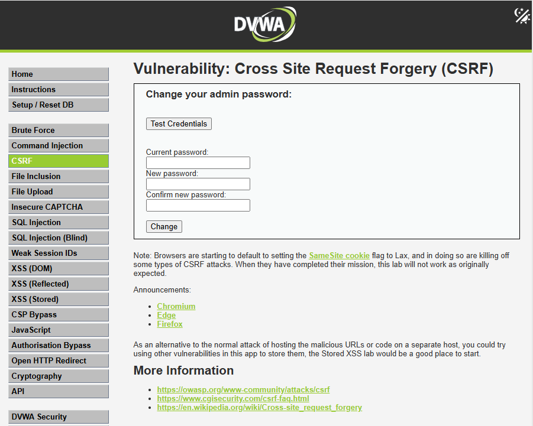
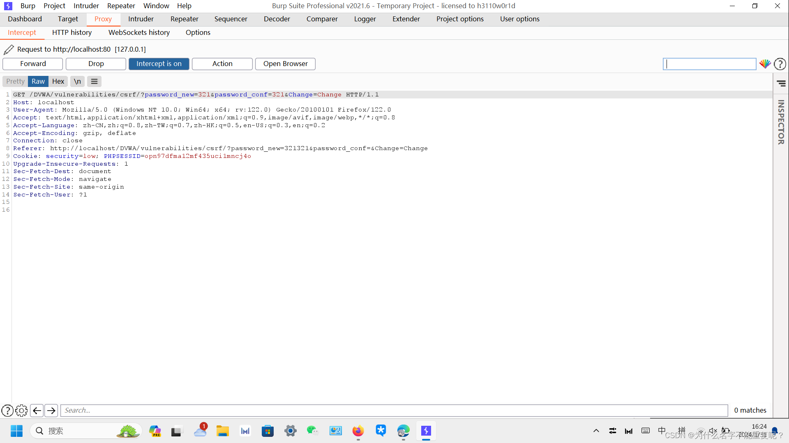
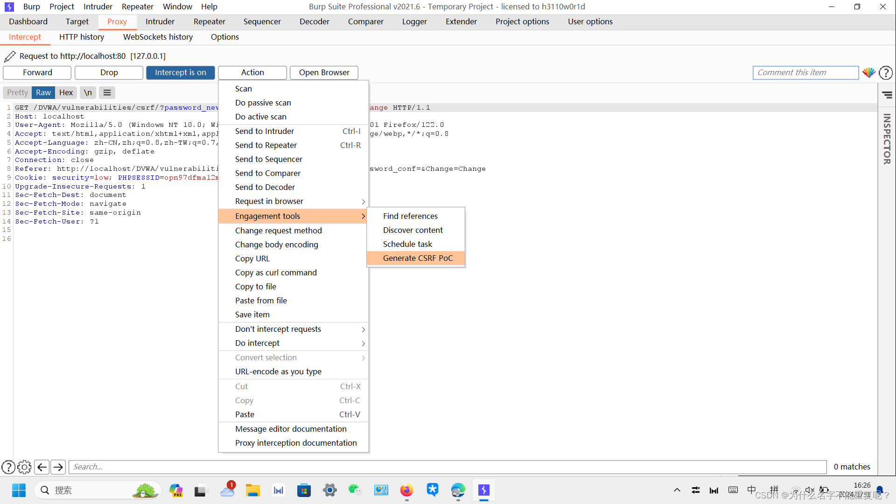
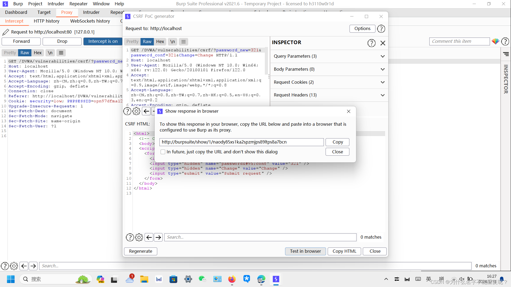
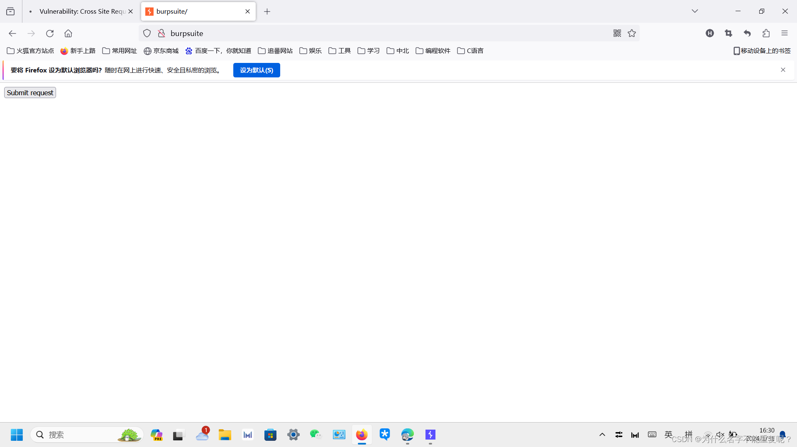

# CSRF-跨站请求伪造

<!--more-->

## 跨站请求伪造

跨站请求伪造（Cross-Site Request Forgery，CSRF）是一种网络攻击方式，它利用用户已经在某个网站进行过认证的身份，通过伪造请求来执行未经用户授权的操作。攻击者通过欺骗用户，使其在不知情的情况下执行某些敏感操作，例如修改密码、发表言论、转账等。
CSRF攻击的核心在于攻击者能够构造恶意请求，并引导用户在受害者已经登录的情况下访问包含恶意请求的页面。一旦用户点击了这个页面上的触发请求的按钮或链接，浏览器会自动携带受害者的认证信息发送请求，从而实现攻击者预期的操作。

### 防范措施

为了防范CSRF攻击，开发者可以采取以下措施：

#### 同源策略（Same Origin Policy）

浏览器的同源策略限制了一个页面只能请求同一域下的资源，从而减少了CSRF攻击的可能性。攻击者通常难以伪造出同一域的请求。

#### Anti-CSRF Token

在用户登录时生成一个唯一的令牌（CSRF Token），将其嵌入到每个表单或请求中。服务器在接收到请求时验证令牌的有效性，如果令牌不匹配，则拒绝该请求。这样即使攻击者伪造请求，也无法获取有效的CSRF Token。

#### Cookie设置

在Cookie中使用SameSite属性，限制第三方站点对Cookie的访问。设置为Strict或Lax可以在一定程度上减弱CSRF攻击。

#### 双重提交Cookie

将CSRF Token不仅存储在Cookie中，还通过表单的隐藏字段等方式在请求中传递，以增加令牌的安全性。

#### 检查Refere

 服务器可以检查请求的Referer头部，但这并不是绝对可靠的防御手段，因为Referer头部有时会被浏览器省略或伪造。

通过综合使用这些防御措施，开发者可以大大提高系统对CSRF攻击的抵抗能力。

### POC

 POC是“Proof of Concept”的缩写，指的是概念验证或概念证明。在计算机安全领域，POC通常指的是一个漏洞利用的实际示例，用来证明该漏洞确实存在，并且可以被利用。POC可以是一个简单的代码片段、一个演示页面、一个脚本或者一个程序，其目的是演示特定漏洞的影响或者危害性。
在安全研究中，研究人员通常会编写POC来展示一个新发现的漏洞，以便其他人能够理解漏洞的工作原理，并验证其在真实环境中的有效性。POC也经常用于向厂商报告漏洞，以便他们能够及时修复。
综上所述，POC是漏洞利用的实际示例，用于证明漏洞的存在和危害性。

### 攻击流程-DVWA模拟靶场

#### 随便输入将更改的密码进行抓包，得到

####  抓包后可以看到能进行构造的poc

#### 进行如图所示选项

#### 点击复制，将攻击url复制到一个 新界面中后打开。

点击按钮即可完成攻击

#### 直接放包后，用新密码即可完成登录。

