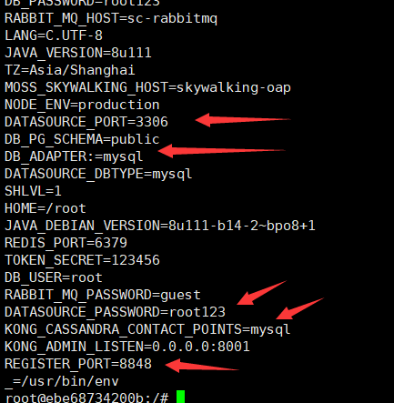

# Docker Compose之env_file应用


<!--more-->

实际开发生成环境中需要频繁修改代码或者环境变量的值（例如：服务器ip,数据库密码等），如果频繁去修改代码重新上线需要花费大量的事件，为了解决这一问题，今天用到了docker-compose中的env_file：

- 应用环境变量设置，不用修改代码，重新打包
- 代码之间解耦，提高可读性

应用环境：

- Spring Cloud
- docker

## 简介

springboot配置文件如下：

```yml
spring:
  cloud:
    bus:
      trace:
        enabled: true
  rabbitmq:
    host: ${RABBIT_MQ_HOST:localhost}
    port: ${RABBIT_MQ_PORT:5672}
    username: ${RABBIT_MQ_USERNAME:guest}
    password: ${RABBIT_MQ_PASSWORD:guest}
  redis:
    host: ${REDIS_HOST:localhost}
    port: ${REDIS_PORT:6379}
    lettuce:
      pool:
        max-active: 300
    #password: ${REDIS_PASSWORD:123456}
  datasource:
    driver-class-name: com.mysql.jdbc.Driver
    url: jdbc:${DATASOURCE_DBTYPE:mysql}://${DATASOURCE_HOST:localhost}:${DATASOURCE_PORT:3306}/sys_users?characterEncoding=UTF-8&useUnicode=true&useSSL=false
    username: ${DATASOURCE_USERNAME:root}
    password: ${DATASOURCE_PASSWORD:root123}
```

**${RABBIT_MQ_HOST:localhost}**的含义：如果MQ_HOST设置的有值，就用他；如果没有设置值，就用localhost默认值，这样写的好处是做到全局配置的统一性，避免改配置多处修改；

在开发环节为了调试方便，我们可以在application.yml文件中添加如下配置，

```yml
DATASOURCE_HOST: 191.168.1.105
DATASOURCE_PORT: 7000
DATASOURCE_PASSWORD: root123
DATASOURCE_USERNAME: root
```

但是当部署到生产环境这样写没有任何意义，当需要修改变量值，还是需要重新打包。

为此docker-compose提供了一种解决方案：从文件添加环境变量。可以是单个值或列表的多个值【env_file】：

```text
DATASOURCE_DBTYPE=sc-mysql
DATASOURCE_HOST=mysql
DATASOURCE_PORT=3306
DATASOURCE_USERNAME=root
DATASOURCE_PASSWORD=root123
DATASOURCE_DRIVER=com.mysql.jdbc.Driver
```

只需要在docker-compose文件中的某个service下添加：

```yml
    env_file: .env
```

或者：

```yml
env_file:
  - ./common.env
  - ./apps/web.env
  - /opt/secrets.env
```

通过以上配置就可以把相关的环境变量的值存进你的image

**ps:同一个变量多次赋值，以最后一次为准，覆盖前面的旧值**

## 场景应用：

利用docker-compose启动web服务，做到改变IP、密码等配置时不修改代码

### 1、信件env结尾的文件：

```
### 数据源mysql实例
DATASOURCE_DBTYPE=mysql
DATASOURCE_HOST=sc-mysql
DATASOURCE_PORT=3306
DATASOURCE_USERNAME=root
DATASOURCE_PASSWORD=root123
DATASOURCE_DRIVER=com.mysql.jdbc.Driver

### 分布式缓存
REDIS_HOST=redis
REDIS_PORT=6379
```

### 2、编写docker-compose文件添加env_file:

```yml
# docker-compose.person.yml
version: '3'
services:
  #人员信息服务
  person_info:
    image: java:8
    container_name: sc-person_info
    restart: always
    networks:
      - sc-net
    ports:
      - 9009:9009
    volumes:
      - "/home/hubu/dockerfiles/person_info:/data"

    command: ["java", "-jar", "/data/person.jar"]
    env_file: .env
```

### 3、上传服务器相关文件，生成镜像，运行容器：

```shell
# 还运行了其他docker-compose,-f指定文件
docker-compose -f docker-compose.yml -f docker-compose.person.yml -f docker-compose.auth.yml up -d

#关闭：
docker-compose -f docker-compose.yml -f docker-compose.person.yml -f docker-compose.auth.yml down
```

### 4、查看环境变量是否进入容器：

```shell
#通过docker logs 查看系统日志，如果没有错误就是正确的

docker exec -it sc-person_info /bin/bash
env
```



### 5、愉快地开始部署项目了！！！


### 6、日常小计

**限制内存(1.20版本以上)：**

```yml
version: '3'
networks:
  dockercompose_sc-net:
    external: true
services:
  #人员信息服务
  comp:
    image: java:8
    container_name: sc-comp
    restart: always
    networks:
      - "dockercompose_sc-net"
#    networks:
#      - sc-net
    ports:
      - 5002:9011
    volumes:
      - "/home/hubu/dockerfiles/comp:/data"
    deploy:
      resources:
        limits:
          cpus: '0.50'
          memory: 1G
    command: ["java", "-jar", "/data/comp.jar"]
    env_file: .env
```

运行加参数：

```shell
docker-compose --compatibility up -d
```

