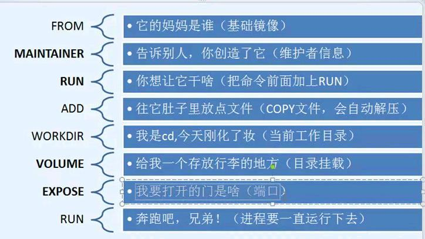

# Docker基础


# docker概述

从开发到上线，两套环境，版本不同导致软件不可用，开发与运维有差距！部署配置环境费时费力

原：jar-------redis,mysql,jdk,项目能不能带上环境安装打包？跨平台，隔离，


docker容器技术也是一种虚拟化技术

官网：https://www.docker.com/

文档：https://docs.docker.com/

仓库地址： https://hub.docker.com/


镜像（image）:模板，通过这个模板来创建容器服务，可创建多个容器（最终服务或者项目运行在容器中）

容器（container）：一个或一组应用，可以启动，停止，删除，基本命令

仓库（repository）：存放镜像（公有私有），docker hub(默认)  阿里云（国内镜像加速）


# 安装

## start

卸载旧版本

```shell
# 1、卸载旧版本
sudo yum remove docker \
                  docker-client \
                  docker-client-latest \
                  docker-common \
                  docker-latest \
                  docker-latest-logrotate \
                  docker-logrotate \
                  docker-engine
# 2、 需要的安装包
sudo yum install -y yum-utils
# 3、设置镜像仓库
sudo yum-config-manager \
    --add-repo \
    https://download.docker.com/linux/centos/docker-ce.repo	# 默认是国外的

sudo yum-config-manager \
    --add-repo \
    http://mirrors.aliyun.com/docker-ce/linux/centos/docker-ce.repo	# 默认是国外的 可换国内

yum makecache fast

# 4、安装相关的额
sudo yum install docker-ce docker-ce-cli containerd.io

# 5、启动
sudo systemctl start docker
docker version

# 6、测试
sudo docker run hello-World
```

查看镜像

```shell
docker images
```

阿里云镜像加速


```shell
sudo mkdir -p /etc/docker
sudo tee /etc/docker/daemon.json <<-'EOF'
{
  "registry-mirrors": ["https://ax7mfl6a.mirror.aliyuncs.com"]
}
EOF

sudo systemctl daemon-reload
sudo systemctl restart docker
```

## hello-world流程

sudo docker run hello-World-->本机寻找镜像--No-->仓库地址下载--->是否找到--->下载镜像到本地--->使用镜像创建容器运行


# docker常用命令

## 帮助命令

```shell
docker version	   # 显示版本信息
docker info        #系统信息，镜像、容器
docker 命令 --help
```

## 镜像命令

```shell
docker images

docker search mysql

docker pull mysql

docker pull mysql:5.7    #docker分层下载，节省空间
```

删除镜像docker rmi -f

```shell
docker rmi -f 容器id
docker rmi -f $(docker images -aq)  #删除所有镜像
```

## 容器命令

拉取镜像

```
docker pull centos
```

创建容器并启动

```shell
docker run [可选参数] image

# 参数设置
--name="name"    容器名称，tomcat01，tomcat02
-it				交互方式运行，
-d				后台运行
-p				指定荣放弃的端口 -p 8080:8080
	-p ip:主机端口：容器端口
	-p 主机端口：容器端口
	-p 容器端口
	容器端口
-P				随机指定端口


C:\Users\26505>docker pull centos
Using default tag: latest
latest: Pulling from library/centos
7a0437f04f83: Pulling fs layer
latest: Pulling from library/centos
7a0437f04f83: Pull complete
Digest: sha256:5528e8b1b1719d34604c87e11dcd1c0a20bedf46e83b5632cdeac91b8c04efc1
Status: Downloaded newer image for centos:latest
docker.io/library/centos:latest

C:\Users\26505>docker run -it centos /bin/bash
[root@177a03668b45 /]# exit
exit


C:\Users\26505>docker ps       #正在运行的容器
CONTAINER ID   IMAGE                    COMMAND                  CREATED       STATUS       PORTS                               NAMES
bc1f05966db8   mysql                    "docker-entrypoint.s…"   7 hours ago   Up 7 hours   33060/tcp, 0.0.0.0:3307->3306/tcp   mysql
741b6a4bccc2   docker/getting-started   "/docker-entrypoint.…"   7 hours ago   Up 7 hours   0.0.0.0:8080->80/tcp                docker-test

C:\Users\26505>docker ps -a     #历史容器
CONTAINER ID   IMAGE                    COMMAND                  CREATED         STATUS                     PORTS                               NAMES
177a03668b45   centos                   "/bin/bash"              4 minutes ago   Exited (0) 3 minutes ago                                       stoic_rosalind
bc1f05966db8   mysql                    "docker-entrypoint.s…"   7 hours ago     Up 7 hours                 33060/tcp, 0.0.0.0:3307->3306/tcp   mysql
741b6a4bccc2   docker/getting-started   "/docker-entrypoint.…"   7 hours ago     Up 7 hours                 0.0.0.0:8080->80/tcp                docker-test
70b02a4a1833   hello-world              "/hello"                 7 hours ago     Exited (0) 7 hours ago                                         stupefied_neumann

```

## 退出容器

```shell
exit #退出并停止容器
ctrl+P+Q  #退出终端不停止容器
```

## 删除容器			rm -f

```shell
docker rm  容器id    #不能删除正在运行的容器
docker rm -f $(docker pa -aq)      #删除全部容器
docker ps -a -q|xargs docker rm    #删除全部容器(管道)
```

## 启动停止容器

```shell
docker start id     #启动
docker restart id    #重启
docker stop id    #停止
docker kill id    #强制停止
```

## 常用的其他命令

### 后台启动

```shell
docker run -d centos

#问题 :docker ps 发现centos停止了
# 常见的坑，后台运行后，就必须有一个前台进程，docker发现没有应用，就自动停止了
#nginx 容器启动后，没有提供服务，就会立刻停止
```

### 日志命令

```shell
docker logs --help
docker logs -tf --tail 10 id   #查看后10条日志

docker logs -tf  id    #查看所有日志

docker run -d centos /bin/sh -C "while true ;do echo tanjindong;sleep 1;done"
```

### 查看容器中的进程信息

```shell
# top命令
docker top --help
docker top id
```

### 查看镜像源数据

```shell
# inspect
docker inspect id

C:\Users\26505>docker inspect 741b6a4bccc2
[
    {
        "Id": "741b6a4bccc29177c95e953ecf827855cba60c91694c46aba6c53ff21fdbbbf3",
        "Created": "2021-03-21T07:20:22.6575041Z",
        "Path": "/docker-entrypoint.sh",
        "Args": [
            "nginx",
            "-g",
            "daemon off;"
        ],
        "State": {
            "Status": "running",
            "Running": true,
            "Paused": false,
            "Restarting": false,
            "OOMKilled": false,
            "Dead": false,
            "Pid": 2067,
            "ExitCode": 0,
            "Error": "",
            "StartedAt": "2021-03-21T07:20:26.022246Z",
            "FinishedAt": "0001-01-01T00:00:00Z"
        },
        "Image": "sha256:3ba8f2ff0727d36bccad59f6344f7f3a101bcd9c70b984aa2dd006914c496cb8",
        "ResolvConfPath": "/var/lib/docker/containers/741b6a4bccc29177c95e953ecf827855cba60c91694c46aba6c53ff21fdbbbf3/resolv.conf",
        "HostnamePath": "/var/lib/docker/containers/741b6a4bccc29177c95e953ecf827855cba60c91694c46aba6c53ff21fdbbbf3/hostname",
        "HostsPath": "/var/lib/docker/containers/741b6a4bccc29177c95e953ecf827855cba60c91694c46aba6c53ff21fdbbbf3/hosts",
        "LogPath": "/var/lib/docker/containers/741b6a4bccc29177c95e953ecf827855cba60c91694c46aba6c53ff21fdbbbf3/741b6a4bccc29177c95e953ecf827855cba60c91694c46aba6c53ff21fdbbbf3-json.log",
        "Name": "/docker-test",
        "RestartCount": 0,
        "Driver": "overlay2",
        "Platform": "linux",
        "MountLabel": "",
        "ProcessLabel": "",
        "AppArmorProfile": "",
        "ExecIDs": [
            "4ac8b9a918d39e7560ebf5e35fad12ef83ed66cabc27035095870d4fe13ac56c"
        ],
        "HostConfig": {
            "Binds": null,
            "ContainerIDFile": "",
            "LogConfig": {
                "Type": "json-file",
                "Config": {}
            },
            "NetworkMode": "default",
            "PortBindings": {
                "80/tcp": [
                    {
                        "HostIp": "",
                        "HostPort": "8080"
                    }
                ]
            },
            "RestartPolicy": {
                "Name": "no",
                "MaximumRetryCount": 0
            },
            "AutoRemove": false,
            "VolumeDriver": "",
            "VolumesFrom": null,
            "CapAdd": null,
            "CapDrop": null,
            "CgroupnsMode": "host",
            "Dns": [],
            "DnsOptions": [],
            "DnsSearch": [],
            "ExtraHosts": null,
            "GroupAdd": null,
            "IpcMode": "private",
            "Cgroup": "",
            "Links": null,
            "OomScoreAdj": 0,
            "PidMode": "",
            "Privileged": false,
            "PublishAllPorts": false,
            "ReadonlyRootfs": false,
            "SecurityOpt": null,
            "UTSMode": "",
            "UsernsMode": "",
            "ShmSize": 67108864,
            "Runtime": "runc",
            "ConsoleSize": [
                31,
                120
            ],
            "Isolation": "",
            "CpuShares": 0,
            "Memory": 0,
            "NanoCpus": 0,
            "CgroupParent": "",
            "BlkioWeight": 0,
            "BlkioWeightDevice": [],
            "BlkioDeviceReadBps": null,
            "BlkioDeviceWriteBps": null,
            "BlkioDeviceReadIOps": null,
            "BlkioDeviceWriteIOps": null,
            "CpuPeriod": 0,
            "CpuQuota": 0,
            "CpuRealtimePeriod": 0,
            "CpuRealtimeRuntime": 0,
            "CpusetCpus": "",
            "CpusetMems": "",
            "Devices": [],
            "DeviceCgroupRules": null,
            "DeviceRequests": null,
            "KernelMemory": 0,
            "KernelMemoryTCP": 0,
            "MemoryReservation": 0,
            "MemorySwap": 0,
            "MemorySwappiness": null,
            "OomKillDisable": false,
            "PidsLimit": null,
            "Ulimits": null,
            "CpuCount": 0,
            "CpuPercent": 0,
            "IOMaximumIOps": 0,
            "IOMaximumBandwidth": 0,
            "MaskedPaths": [
                "/proc/asound",
                "/proc/acpi",
                "/proc/kcore",
                "/proc/keys",
                "/proc/latency_stats",
                "/proc/timer_list",
                "/proc/timer_stats",
                "/proc/sched_debug",
                "/proc/scsi",
                "/sys/firmware"
            ],
            "ReadonlyPaths": [
                "/proc/bus",
                "/proc/fs",
                "/proc/irq",
                "/proc/sys",
                "/proc/sysrq-trigger"
            ]
        },
        "GraphDriver": {
            "Data": {
                "LowerDir": "/var/lib/docker/overlay2/6d343bc9ad04de2e498e78ef2f579175c692ed808c08b393d1eb997f1dd5d84b-init/diff:/var/lib/docker/overlay2/214cc931af263a16f14aeb6d585e2dbee7150a57e19e84650bfdc32734a5846f/diff:/var/lib/docker/overlay2/47fae1cab0a2404c969f4cea1cfcb6b054b1bbdea8d8c6149c21848a77c816dc/diff:/var/lib/docker/overlay2/17096a2500c8f19f644b2554a0bd01af1b469f6f3b1b0d47718f826fe6c1e01e/diff:/var/lib/docker/overlay2/bbe4a1e6f6189b486a01f819c7fc91f2c558eb60e3eda0a16629e9b40cef3937/diff:/var/lib/docker/overlay2/98581fdc9425566ddfa8a8b96d8fe61544f2140e026d1df3cbdc507d38f582cd/diff:/var/lib/docker/overlay2/66a3d69a78eff1300e49d125d6a2ad49e2e9b48f826c802ae6e654b83db3016d/diff:/var/lib/docker/overlay2/8dafe228d5bec8620615e6252f815baeb01884e592865f8edac2f7fec8317da8/diff:/var/lib/docker/overlay2/d0ca3a53296feb329ea10d4f75f54b57bed2bdf53b67a24de0a1b6d726877d85/diff",
                "MergedDir": "/var/lib/docker/overlay2/6d343bc9ad04de2e498e78ef2f579175c692ed808c08b393d1eb997f1dd5d84b/merged",
                "UpperDir": "/var/lib/docker/overlay2/6d343bc9ad04de2e498e78ef2f579175c692ed808c08b393d1eb997f1dd5d84b/diff",
                "WorkDir": "/var/lib/docker/overlay2/6d343bc9ad04de2e498e78ef2f579175c692ed808c08b393d1eb997f1dd5d84b/work"
            },
            "Name": "overlay2"
        },
        "Mounts": [],
        "Config": {
            "Hostname": "741b6a4bccc2",
            "Domainname": "",
            "User": "",
            "AttachStdin": false,
            "AttachStdout": false,
            "AttachStderr": false,
            "ExposedPorts": {
                "80/tcp": {}
            },
            "Tty": false,
            "OpenStdin": false,
            "StdinOnce": false,
            "Env": [
                "PATH=/usr/local/sbin:/usr/local/bin:/usr/sbin:/usr/bin:/sbin:/bin",
                "NGINX_VERSION=1.19.8",
                "NJS_VERSION=0.5.2",
                "PKG_RELEASE=1"
            ],
            "Cmd": [
                "nginx",
                "-g",
                "daemon off;"
            ],
            "Image": "docker/getting-started",
            "Volumes": null,
            "WorkingDir": "",
            "Entrypoint": [
                "/docker-entrypoint.sh"
            ],
            "OnBuild": null,
            "Labels": {
                "maintainer": "NGINX Docker Maintainers \u003cdocker-maint@nginx.com\u003e"
            },
            "StopSignal": "SIGQUIT"
        },
        "NetworkSettings": {
            "Bridge": "",
            "SandboxID": "3e4495b89b66f8afb1c5813e2516159ff9f0b5c62f992a626bed5c052a44ba38",
            "HairpinMode": false,
            "LinkLocalIPv6Address": "",
            "LinkLocalIPv6PrefixLen": 0,
            "Ports": {
                "80/tcp": [
                    {
                        "HostIp": "0.0.0.0",
                        "HostPort": "8080"
                    }
                ]
            },
            "SandboxKey": "/var/run/docker/netns/3e4495b89b66",
            "SecondaryIPAddresses": null,
            "SecondaryIPv6Addresses": null,
            "EndpointID": "be48ed5413def317dbb9a26e958b6564a7b17429d3e90b40bbd3f7111219ff5d",
            "Gateway": "172.17.0.1",
            "GlobalIPv6Address": "",
            "GlobalIPv6PrefixLen": 0,
            "IPAddress": "172.17.0.2",
            "IPPrefixLen": 16,
            "IPv6Gateway": "",
            "MacAddress": "02:42:ac:11:00:02",
            "Networks": {
                "bridge": {
                    "IPAMConfig": null,
                    "Links": null,
                    "Aliases": null,
                    "NetworkID": "29f6254e1e67bce10d43afd48bf9ff2244c97ecfb6da309d47072f7a1dca00bd",
                    "EndpointID": "be48ed5413def317dbb9a26e958b6564a7b17429d3e90b40bbd3f7111219ff5d",
                    "Gateway": "172.17.0.1",
                    "IPAddress": "172.17.0.2",
                    "IPPrefixLen": 16,
                    "IPv6Gateway": "",
                    "GlobalIPv6Address": "",
                    "GlobalIPv6PrefixLen": 0,
                    "MacAddress": "02:42:ac:11:00:02",
                    "DriverOpts": null
                }
            }
        }
    }
]
```

### 进入当前正在运行的容器

```shell
docker exec -it 容器id bashshell
docker ps
# 方式一  进入容器之后开启一个新的终端(常用)
docker exec -it id /bin/bash

#方式二  进入执行的终端
docker attach 容器id
正在执行的代码。。。。。
```

### 从容器拷贝文件到主机 cp

```shell
docker cp id:/home/test.java /home
docker cp 容器id:容器目录 本机目录
```


## 作业一：部署nginx

```shell
docker pull nginx    #下载镜像
docker images
docker run -d --name nginx-01 -p 3344:80 nginx   #运行容器
curl localhost:3344    #测试
```


```shell
pi@raspberrypi:~ $ docker exec -it nginx-01 /bin/bash   #进入容器
root@9ddb6ad99473:/# whereis nginx
nginx: /usr/sbin/nginx /usr/lib/nginx /etc/nginx /usr/share/nginx
root@9ddb6ad99473:/# cd etc/nginx/
root@9ddb6ad99473:/etc/nginx# ls

conf.d	fastcgi_params	koi-utf  koi-win  mime.types  modules  nginx.conf  scgi_params	uwsgi_params  win-utf

pi@raspberrypi:~ $ docker stop nginx-01   #停止容器
nginx-01
pi@raspberrypi:~ $ docker ps
CONTAINER ID        IMAGE               COMMAND             CREATED             STATUS              PORTS               NAMES
#每次修改nginx配置，都需要进入容器，十分麻烦，映射路径，达到修改容器配置的目的，数据卷技术！！！！
```


## 作业二：部署tomcat

```shell
#官方使用
docker run -it --rm tomcat:9.0
#之前都是后台，停止了之后，容器还可以查到，docker run -it --rm用完即删，一般用来测试

#下载启动
docker pull tomcat
docker images
docker run -d --name tomcat-01 -p 3355:8080 tomcat   #运行  外部3355
```


but


原因：官方镜像最简化，所以找不到资源文件：


```shell
docker exec -it tomcat-01 /bin/bash    #进入容器

cp -r webapps.dist/* webapps
```


## 作业三：部署es+kibana

```shell
# elasticsearch暴露端口十分多
# ES 十分耗内存
# 数据一般挂载在安全目录
# --net somenetwork   ？网络配置
docker run -d --name elasticsearch --net somenetwork -p 9200:9200 -p 9300:9300 -e "discovery.type=single-node" elasticsearch:7.11.2

docker run -d --name elasticsearch -p 9200:9200 -p 9300:9300 -e "discovery.type=single-node" elasticsearch:7.11.2

C:\Users\26505>curl localhost:9200
{
  "name" : "2ab0292e5b49",
  "cluster_name" : "docker-cluster",
  "cluster_uuid" : "661wGGJlSRqiLH_ht2P48A",
  "version" : {
    "number" : "7.11.2",
    "build_flavor" : "default",
    "build_type" : "docker",
    "build_hash" : "3e5a16cfec50876d20ea77b075070932c6464c7d",
    "build_date" : "2021-03-06T05:54:38.141101Z",
    "build_snapshot" : false,
    "lucene_version" : "8.7.0",
    "minimum_wire_compatibility_version" : "6.8.0",
    "minimum_index_compatibility_version" : "6.0.0-beta1"
  },
  "tagline" : "You Know, for Search"
}
# 启动之后非常卡   how to 解决   docker stats 查看cpu状态
docker stats
```


```shell
# 解决一：增加内存限制，修改配置文件， -e 环境的配置修改
docker run -d --name elasticsearch -p 9201:9200 -p 9301:9300 -e "discovery.type=single-node" -e ES_JAVA_OPTS="-Xms64m -Xmx512m" elasticsearch:7.11.2
```


使用kibana连接ES：


## 可视化工具

- portainer(不是最佳选择，先用)

  ```shell
  # -v /var/run/docker.sock 挂载，里面数据挂载到本机
  # --privileged=true 授权，本机可访问
  docker run -d -p 8088:9000 \ --restart=always -v /var/run/docker.sock:/var/run/docker.sock --privileged=true portainer/portainer
  ```

  测试访问：8088

  

  


- Rancher（CI/CD）

  ```
  
  ```

  

# docker镜像原理

UFS 联合文件系统，分层轻量，分层下载，分层加载，多镜像共用 公共内核(bootfs) 


对于一个OS，rootfs可以很小，只需要包含基本的命令、工具和程序库就可以了，因为底层直接用host的kernel，自己只需要提供rootfs就可以了，由此可见，不同版本的Linux发行版，bootfs是相同的，只是rootfs不同罢了。

bootfs引导启动非常慢，rootfs库启动非常快，所以虚拟机启动分钟级别，docker启动秒级。

分层理解：


## 如何打包一个自己的镜像：commit

```shell
docker commit #提交容器
docker commit -m="提交描述信息" -a="作者" 容器id 目标镜像名:[tag] 

docker commit -a="jd" -m="add webapps" 7sssdvhfgs tomcat02:1.0
```


# 容器数据卷

如果数据都在容器中，容器删除之后，数据就会丢失，需求：数据可持久化，

MySQL，容器删除了，MySQL数据就没了，MySQL可以保存在本地吗？

数据共享技术，docker容器中产生的数据同步到本地，

卷技术，？目录挂载，将容器内的目录挂载在宿主机上，持久化与同步操作，容器间数据可以共享


```shell
# 方式一：使用-v挂载 docker run -d -v 主机目录:容器目录
docker run -it -v /home/ceshi:/home --name ubuntu01 ubuntu /bin/bash
docker inspect 容器id
```


```shell
docker stop 1bfb0a3ad95e    #停止docker 容器
sudo nano test.txt          #修改Host文件
docker start 1bfb0a3ad95e   #重新启动
# 进入容器查看文件变化
pi@raspberrypi:~ $ docker exec -it 1bfb0a3ad95e /bin/bash
root@1bfb0a3ad95e:/# cd /home
root@1bfb0a3ad95e:/home# ls
test  test.b  test.java  test.txt
root@1bfb0a3ad95e:/home# cat test/txt
cat: test/txt: No such file or directory
root@1bfb0a3ad95e:/home# cat test.txt
yasethbitgejk
nadeuioaguhno
arezln

# 容器内的数据依旧是同步的！！！！！！
# 通过-v挂载配置文件和资源文件，就不用进入容器修改，只用修改本地，容器自动同步
```

## 部署MySQL

mysql数据持久化问题

```shell
docker pull mysql:5.7
#需要配置密码    -e MYSQL_ROOT_PASSWORD=my-secret-pw
# docker run --name some-mysql -e MYSQL_ROOT_PASSWORD=my-secret-pw -d mysql:tag

docker run -d -p 3310:3306 --name mysql-test -v H:\myNotsBooks\docker\conf:/etc/mysql/conf.d -v H:\myNotsBooks\docker\data:/var/lib/mysql -e MYSQL_ROOT_PASSWORD=123456 mysql:5.7

```


链接成功：


数据挂载成功：（conf）


即使删除容器，本地的数据卷依旧没有丢失，这就达到了数据持久化

## 具名和匿名挂载

```shell
#匿名挂载
#  -v 容器内路径！
docker run -d -P --name nginx-test -v /etc/nginx nginx

# 查看所有卷volume的挂载情况
pi@raspberrypi:/home/ceshi $ docker run -d -P --name nginx-test -v /etc/nginx nginx
9f4ba2383cab2eedc09916c2191858b88673cc43ef85194b42eb67cb8c2bca54
pi@raspberrypi:/home/ceshi $ docker volume --help
Usage:	docker volume COMMAND
Manage volumes

Commands:
  create      Create a volume
  inspect     Display detailed information on one or more volumes
  ls          List volumes
  prune       Remove all unused local volumes
  rm          Remove one or more volumes

Run 'docker volume COMMAND --help' for more information on a command.
pi@raspberrypi:/home/ceshi $ docker volume ls
DRIVER              VOLUME NAME
local               27f1cec7789cd92096fc7177238808528b7201f2b7f2628c57fc4f350bff7c09 #匿名挂载
local               28ce6884130cf729f12f33decf67c96f0bab95032c193302553cd9050f8ff7e8
# -v 的时候只写了容器内部的路径


#具名挂载

pi@raspberrypi:~ $ docker run -d -P --name nginx-juming -v jumingfs:/etc/nginx nginx
70500d6c7b7f937a953990007fc0af3db4628df5687eead2081abdfaeb582b4f
pi@raspberrypi:~ $ docker volume ls
DRIVER              VOLUME NAME
local               27f1cec7789cd92096fc7177238808528b7201f2b7f2628c57fc4f350bff7c09
local               28ce6884130cf729f12f33decf67c96f0bab95032c193302553cd9050f8ff7e8
local               jumingfs
pi@raspberrypi:~ $ docker volume inspect nginx-juming
[]
Error: No such volume: nginx-juming
pi@raspberrypi:~ $ docker volume inspect jumingfs
[
    {
        "CreatedAt": "2021-03-25T11:06:02+08:00",
        "Driver": "local",
        "Labels": null,
        "Mountpoint": "/var/lib/docker/volumes/jumingfs/_data",
        "Name": "jumingfs",
        "Options": null,
        "Scope": "local"
    }
]


```


所有docker容器内的卷，没有指定目录的情况下都是在/var/lib/docker/volumes/jumingfs/_data


我们通过具名挂载可以方便找到我们的一个大卷，大多数情况下使用的是具名挂载


## 如何区分是具名挂载还是匿名挂载还是指定路径挂载

```shell
-v 容器内路径     #匿名挂载
-v 卷名:容器内路径   #具名挂载
-v /宿主机路径:容器内路径   #指定路径挂载
```

## 扩展

```shell
#设置容器权限，对挂载数据卷有限制
docker run -d -P --name nginx-juming -v jumingfs:/etc/nginx:ro nginx
docker run -d -P --name nginx-juming -v jumingfs:/etc/nginx:rw nginx
# ro 只能通过宿主机来操作，不能通过容器内部操作
# 默认rw: 可读可写
```

# Dockerfile:构建docker的文件

一段命令脚本

```shell
pi@raspberrypi:/home/docker-test-file-volume $ docker build -f ./dockerfile1 -t jd/centos:1.0 .   #构建镜像
Sending build context to Docker daemon  2.048kB
Step 1/4 : FROM ubuntu
 ---> 3324772e8bdf
Step 2/4 : VOLUME ["volume01","volume02"]
 ---> Running in e07670d15bd9
Removing intermediate container e07670d15bd9
 ---> 067080c3c46e
Step 3/4 : CMD echo "........end........"
 ---> Running in 0ac9ebb25a05
Removing intermediate container 0ac9ebb25a05
 ---> 5fa9a5e368ba
Step 4/4 : CMD /bin/bash
 ---> Running in 492dcb1825df
Removing intermediate container 492dcb1825df
 ---> e5bd1def5d82
Successfully built e5bd1def5d82
Successfully tagged jd/centos:1.0
pi@raspberrypi:/home/docker-test-file-volume $ docker images     #查看镜像
REPOSITORY            TAG                 IMAGE ID            CREATED             SIZE
jd/centos             1.0                 e5bd1def5d82        7 seconds ago       49.8MB
portainer/portainer   latest              9b438d60114e        6 days ago          62.4MB
nginx                 latest              4f718772a0b3        13 days ago         103MB
ubuntu                latest              3324772e8bdf        5 months ago        49.8MB
hello-world           latest              851163c78e4a        14 months ago       4.85kB
java                  8                   d23bdf5b1b1b        4 years ago         643MB
pi@raspberrypi:/home/docker-test-file-volume $ cat dockerfile1 
FROM ubuntu
VOLUME ["volume01","volume02"]				#匿名挂载
CMD echo "........end........"
CMD /bin/bash

```


```shell
docker inspect id    #查看卷挂载路径
```


## 多个docker同步数据

```shell
# 多个MySQL数据同步
# 启动三个容器
docker run -it --name docker01 jd/centos:1.0 
docker run -it --name docker02 --volumes-from docker01 jd/centos:1.0
docker run -it --name docker03 --volumes-from docker01 jd/centos:1.0
```


```shell
# 进入docker01创建文件
root@450d606a17a0:/# pi@raspberrypi:/ $ docker attach 0721edbafafb
root@0721edbafafb:/# ls
bin   dev  home  media  opt   root  sbin  sys  usr  volume01
boot  etc  lib   mnt    proc  run   srv   tmp  var  volume02
root@0721edbafafb:/# cd vo
bash: cd: vo: No such file or directory
root@0721edbafafb:/# cd volume01
root@0721edbafafb:/volume01# ls
root@0721edbafafb:/volume01# touch docker01.txt
touch: setting times of 'docker01.txt': Operation not permitted
root@0721edbafafb:/volume01# ls
docker01.txt

#进入docker02查看
pi@raspberrypi:/ $ docker attach 450d606a17a0
root@450d606a17a0:/# ls
bin   dev  home  media  opt   root  sbin  sys  usr  volume01
boot  etc  lib   mnt    proc  run   srv   tmp  var  volume02
root@450d606a17a0:/# cd volume01
root@450d606a17a0:/volume01# ls
docker01.txt
```

docker02	 volumesfrom   docker01


docker03	 volumesfrom   docker01 


如果把1删除了，2，3还在吗？？？  **发现还在，只要有一个容器使用，就依旧存在，共享备份机制，双向拷贝的概念**


```shell
# 多个mysql实现数据共享
docker run -d -p 3301:3306 --name mysql01 -v /etc/mysql/conf.d -v /var/lib/mysql -e MYSQL_ROOT_PASSWORD=123456 mysql:5.7

docker run -d -p 3302:3306 --name mysql02 --volumes-from mysql01 -e MYSQL_ROOT_PASSWORD=123456 mysql:5.7

#这个时候可以实现两个容器数据同步
```

结论：

容器之间配置信息的传递，数据卷容器的生命周期一直持续到没有容器使用为止，

但是一旦持久化挂载-v到本地，本地不会被删除！！！！

## dockerfile

命令参数脚本

1、编写一个dockerfile文件

2、docker build 一个镜像

3、docker run 运行容器

4、docker push 发布镜像（dockerhub,阿里云镜像）

查看一下官方这么做的：


```shell
FROM scratch

ADD centos-8-x86_64.tar.xz /

LABEL org.label-schema.schema-version="1.0"     
		org.label-schema.name="CentOS Base Image"     
		org.label-schema.vendor="CentOS"
        org.label-schema.license="GPLv2"
        org.label-schema.build-date="20201204"

CMD ["/bin/bash"]
```

## 构建过程



从上到下顺序执行，指令大写，每个指令就会创建一个新的镜像层


企业交付的标准！！！！！

## dockerfile指令

dockerHub  80% 来自FROM scratch

```shell
FROM    	 #基础镜像，一切从这里开始构建
MAINTAINER   #镜像是谁写的，姓名+邮箱
RUN      	 #构建镜像时需要运行的命令
ADD       	 #步骤，tomcat压缩包，添加内容
WORKDIR   	 #镜像的工作目录
VOLUME    	 #挂载卷
EXPOSE   	 #指定暴露端口原来-p
CMD       	 #指定这个容器启动的时候运行的命令，只有最后一个会失效，可被替代
ENTRYPOINT   #指定这个容器启动的时候运行的命令，可追加
ONBUILD      #当构建一个被继承dockerfile,触发指令
COPY         #类似ADD，拷贝文件到镜像
ENV      	 #构建的时候设置环境变量 -e
```

自己写一个dockerfile：：：：：：：：：

```shell
＃　entos-vim-ip
FROM centos
MAINTAINER 金东<2650523664@qq.com
ENV MYPATH /usr/local
WORKDIR $MYPATH

RUN yum -y install vim
RUN yum -y install net-tools

EXPOSE 80

CMD echo $MYPATH
CMD echo "------end-----"
CMD /bin/bash
```

```shell
docker build -f centos-vim-ip -t mycentos:1.0 .
```


```shell
docker images
docker run -it --name mycentostest mycentos:1.0     
# 现在vim 与 ifconfig命令都可以用了,官方不可用
```


```
docker history mycentos:1.0
```


### CMD与ENTRYPOINT区别

```shell
FROM centos
CMD ["ls","-a"]　　　
# 指定容器启动时运行的命令，只有最后一个生效，可被替代
```


```shell
H:\myNotsBooks\docker\dockerfile>docker run -it cmdtest -l
docker: Error response from daemon: OCI runtime create failed: container_linux.go:370: starting container process caused: exec: "-l": executable file not found in $PATH: unknown.
# cmd的清理下，-l代替了CMD ["ls","-a"],但是-l不是命令，所以报错
```

```shell
H:\myNotsBooks\docker\dockerfile>docker run -it cmdtest ls -al   #这就对了
total 56
drwxr-xr-x   1 root root 4096 Mar 25 14:21 .
drwxr-xr-x   1 root root 4096 Mar 25 14:21 ..
-rwxr-xr-x   1 root root    0 Mar 25 14:21 .dockerenv
lrwxrwxrwx   1 root root    7 Nov  3 15:22 bin -> usr/bin
drwxr-xr-x   5 root root  360 Mar 25 14:21 dev
drwxr-xr-x   1 root root 4096 Mar 25 14:21 etc
drwxr-xr-x   2 root root 4096 Nov  3 15:22 home
lrwxrwxrwx   1 root root    7 Nov  3 15:22 lib -> usr/lib
lrwxrwxrwx   1 root root    9 Nov  3 15:22 lib64 -> usr/lib64
drwx------   2 root root 4096 Dec  4 17:37 lost+found
drwxr-xr-x   2 root root 4096 Nov  3 15:22 media
drwxr-xr-x   2 root root 4096 Nov  3 15:22 mnt
drwxr-xr-x   2 root root 4096 Nov  3 15:22 opt
dr-xr-xr-x 196 root root    0 Mar 25 14:21 proc
dr-xr-x---   2 root root 4096 Dec  4 17:37 root
drwxr-xr-x  11 root root 4096 Dec  4 17:37 run
lrwxrwxrwx   1 root root    8 Nov  3 15:22 sbin -> usr/sbin
drwxr-xr-x   2 root root 4096 Nov  3 15:22 srv
dr-xr-xr-x  11 root root    0 Mar 25 14:21 sys
drwxrwxrwt   7 root root 4096 Dec  4 17:37 tmp
drwxr-xr-x  12 root root 4096 Dec  4 17:37 usr
drwxr-xr-x  20 root root 4096 Dec  4 17:37 var
```

```shell
#ENTRYPOINT  命令可追加
FROM centos
ENTRYPOINT ["ls","-a"]
```

```shell
docker build -f docker-entrypoint-test -t entrypointtest .
docker run -it entrypointtest

H:\myNotsBooks\docker\dockerfile\cmd  ENTRYPOINT>docker run -it entrypointtest
.   .dockerenv  dev  home  lib64       media  opt   root  sbin  sys  usr
..  bin         etc  lib   lost+found  mnt    proc  run   srv   tmp  var

H:\myNotsBooks\docker\dockerfile\cmd  ENTRYPOINT>docker run -it entrypointtest -l    #加-l不报错,加到a前面了
total 56
drwxr-xr-x   1 root root 4096 Mar 25 14:29 .
drwxr-xr-x   1 root root 4096 Mar 25 14:29 ..
-rwxr-xr-x   1 root root    0 Mar 25 14:29 .dockerenv
lrwxrwxrwx   1 root root    7 Nov  3 15:22 bin -> usr/bin
drwxr-xr-x   5 root root  360 Mar 25 14:29 dev
drwxr-xr-x   1 root root 4096 Mar 25 14:29 etc
drwxr-xr-x   2 root root 4096 Nov  3 15:22 home
lrwxrwxrwx   1 root root    7 Nov  3 15:22 lib -> usr/lib
lrwxrwxrwx   1 root root    9 Nov  3 15:22 lib64 -> usr/lib64
drwx------   2 root root 4096 Dec  4 17:37 lost+found
drwxr-xr-x   2 root root 4096 Nov  3 15:22 media
drwxr-xr-x   2 root root 4096 Nov  3 15:22 mnt
drwxr-xr-x   2 root root 4096 Nov  3 15:22 opt
dr-xr-xr-x 195 root root    0 Mar 25 14:29 proc
dr-xr-x---   2 root root 4096 Dec  4 17:37 root
drwxr-xr-x  11 root root 4096 Dec  4 17:37 run
lrwxrwxrwx   1 root root    8 Nov  3 15:22 sbin -> usr/sbin
drwxr-xr-x   2 root root 4096 Nov  3 15:22 srv
dr-xr-xr-x  11 root root    0 Mar 25 14:29 sys
drwxrwxrwt   7 root root 4096 Dec  4 17:37 tmp
drwxr-xr-x  12 root root 4096 Dec  4 17:37 usr
drwxr-xr-x  20 root root 4096 Dec  4 17:37 var
```


## 实战：tomcat镜像

1、准备镜像文件：tomcat jdk

2、编写dockerfile文件

```shell
FROM centos
MAINTAINER jd<2650523664@qq.com>

COPY readme.txt /usr/local/readme.txt

ADD apache-tomcat-9.0.44.tar.gz /usr/local/
ADD jdk-8u201-linux-x64.tar.gz /usr/local/

RUN yum -y install vim

ENV MYPATH /usr/local
WORKDIR  $MYPATH

ENV JAVA_HOME /usr/local/jdk1.8.0_201
ENV CLASSPATH $JAVA_HOME/lib/dt.jar:$JAVA_HOME/lib/tools.jar

ENV CATALINA_HOME /usr/local/apache-tomcat-9.0.44
ENV CATALINA_BASH /usr/local/apache-tomcat-9.0.44

ENV PATH $PATH:$JAVA_HOME/bin:$CATALINA_HOME/lib:$CATALINA_HOME/bin

EXPOSE 8080

CMD /usr/local/apache-tomcat-9.0.44/bin/startup.sh && tail -F /usr/local/apache-tomcat-9.0.44/bin/logs/catalina.out
```

3、构建镜像

```shell
docker build -t mytomcat .
# 构建镜像
```


4、启动镜像

```shell
docker run -d -p 9090:8080 --name testmytomcat -v /root/environment/tomcat-test-3-26/test:/usr/local/apache-tomcat-9.0.44/webapps/test -v /root/environment/tomcat-test-3-26/tomlogs:/usr/local/apache-tomcat-9.0.44/logs mytomcat
```

5、访问测试


6、发布项目（由于实现了卷挂载，所以我们就直接在本地写项目发布就可以了）

jps页面

```jsp
<html>
<head><title>Hello World</title></head>
<body>
Hello World!<br/>
<%
System.out.println("-----------start my tomcat-----");
%>
</body>
</html>
```

web.xml文件

```xml
<?xml version="1.0" encoding="UTF-8"?>
<web-app xmlns="http://xmlns.jcp.org/xml/ns/javaee"
  xmlns:xsi="http://www.w3.org/2001/XMLSchema-instance"
  xsi:schemaLocation="http://xmlns.jcp.org/xml/ns/javaee
                      http://xmlns.jcp.org/xml/ns/javaee/web-app_4_0.xsd"
  version="4.0"
  metadata-complete="true">
  </web-app>
```


## 发布镜像

### dockerHub镜像

1、注册账户：https://registry.hub.docker.com/

2、客户端提交镜像

```shell
[root@jd tomcat-test-3-26]# docker login --help

Usage:  docker login [OPTIONS] [SERVER]

Log in to a Docker registry.
If no server is specified, the default is defined by the daemon.

Options:
  -p, --password string   Password
      --password-stdin    Take the password from stdin
  -u, --username string   Username
```

```shell
[root@jd tomcat-test-3-26]# docker login -u hubu8023
Password: 
WARNING! Your password will be stored unencrypted in /root/.docker/config.json.
Configure a credential helper to remove this warning. See
https://docs.docker.com/engine/reference/commandline/login/#credentials-store

Login Succeeded
```

3、发布镜像

```shell
[root@jd ~]# docker tag 5599ee6a7e53 hubu8023/mytest:1.0
[root@jd ~]# docker push hubu8023/mytest:1.0
```


```shell
[root@jd ~]# docker tag hello-world:latest hubu8023/myhello:2.0    #增加标签
[root@jd ~]# docker push hubu8023/myhello:2.0					   #
The push refers to repository [docker.io/hubu8023/myhello]
f22b99068db9: Mounted from library/hello-world 
2.0: digest: sha256:1b26826f602946860c279fce658f31050cff2c596583af237d971f4629b57792 size: 525
```


### 阿里云镜像

1、登录阿里云https://cr.console.aliyun.com/cn-hangzhou/instance/repositories

2、找到容器镜像服务


3、创建命名空间


4、创建容器镜像


5、浏览页面信息

1. 登录阿里云Docker Registry

```shell
$ sudo docker login --username=18871955259东 registry.cn-hangzhou.aliyuncs.com
```

用于登录的用户名为阿里云账号全名，密码为开通服务时设置的密码。

您可以在访问凭证页面修改凭证密码。

2. 从Registry中拉取镜像

```shell
$ sudo docker pull registry.cn-hangzhou.aliyuncs.com/jda/testdockerjd:[镜像版本号]
```

3. 将镜像推送到Registry

```shell
$ sudo docker login --username=18871955259东 registry.cn-hangzhou.aliyuncs.com
$ sudo docker tag [ImageId] registry.cn-hangzhou.aliyuncs.com/jda/testdockerjd:[镜像版本号]
$ sudo docker push registry.cn-hangzhou.aliyuncs.com/jda/testdockerjd:[镜像版本号]
```

请根据实际镜像信息替换示例中的[ImageId]和[镜像版本号]参数。


小结：


# Docker网络

docker网络核心docker0:


两个容器之间如何访问？？？？？

```shell
docker run -d -P --name tomcat01 tomcat
```

```shell
[root@jd ~]# docker exec -it tomcat01 ip addr
1: lo: <LOOPBACK,UP,LOWER_UP> mtu 65536 qdisc noqueue state UNKNOWN group default qlen 1000
    link/loopback 00:00:00:00:00:00 brd 00:00:00:00:00:00
    inet 127.0.0.1/8 scope host lo
       valid_lft forever preferred_lft forever
18: eth0@if19: <BROADCAST,MULTICAST,UP,LOWER_UP> mtu 1500 qdisc noqueue state UP group default 
    link/ether 02:42:ac:11:00:02 brd ff:ff:ff:ff:ff:ff link-netnsid 0
    inet 172.17.0.2/16 brd 172.17.255.255 scope global eth0
       valid_lft forever preferred_lft forever
       
# 查看容器内网IP地址，发现容器启动的时候得到一个eth0@if19   IP地址，这是docker分配的！！！
```

现在能不能ping通容器？？？linux可以ping通容器内部


## 原理：

1、我们每启动一个docker容器，docker就会给容器分配一个IP，我们只要安装了docker，就会有一个网卡docker0(桥接模式--evth-pair)

2、再启动一个docker容器，发现又多了一对网卡：


```shell
# 容器的网卡都是成对出现的，
# evth-pair就是一对虚拟设备接口，他们都是成对出现的，一端连接协议，一端彼此相连
# 正因为有这个特性，evth-pair充当一个桥梁，连接各种虚拟网络设备，
```

3、测试两个tomcat能不能互通：


网络模型


结论：tomcat01和tomcat02 共用一个路由器docker0,

所有的容器不指定网络，都是docker0路由的，docker会给容器分配一个默认可用IP

255.255.0.1/16  : 能用IP;255\*255-0.0-255.255=255\*255-1-1

255.255.0.1/24  : 能用IP;255\*255-0.0-255.255=255-1-1


## --link(基本不用)

场景：微服务或者springboot中database.url配置怎么写？？IP一直变

项目不重启，数据库IP变了，我们希望可以通过名字来访问容器

```shelll
[root@jd ~]# docker exec -it tomcat02 ping tomcat01
ping: tomcat01: Name or service not known
```

```shell
# 实现tomcat03  ping  tomcat02
[root@jd ~]# docker run -d -P --name tomcat03 --link tomcat02 tomcat
7dd6fe9dbe2e5732dfa53d3d2b2e6f14eb7abaccbf2771c44ae03db2dcc4faaf
[root@jd ~]# docker exec -it tomcat03 ping tomcat02
PING tomcat02 (172.17.0.3) 56(84) bytes of data.
64 bytes from tomcat02 (172.17.0.3): icmp_seq=1 ttl=64 time=0.109 ms
64 bytes from tomcat02 (172.17.0.3): icmp_seq=2 ttl=64 time=0.079 ms
64 bytes from tomcat02 (172.17.0.3): icmp_seq=3 ttl=64 time=0.100 ms

# 反向tomcat02  不能ping  tomcat03
[root@jd ~]# docker exec -it tomcat02 ping tomcat03
ping: tomcat03: Name or service not known
```

探究inspect:

```shell
[root@jd ~]# docker network ls
NETWORK ID     NAME      DRIVER    SCOPE
c592ad97632c   bridge    bridge    local
c9c57d03a4a4   host      host      local
85a3888c406a   none      null      local
[root@jd ~]# docker network inspect c592ad97632c    #docker0网卡信息
```


```shell
docker inspect tomcat03
```


```shell
# 原理发现！！！！！！！！！！！！！！！！！！！！
# 查看tomcat03 hosts文件
 docker exec -it tomcat03 cat /etc/hosts
 
 [root@jd ~]# docker exec -it tomcat03 cat /etc/hosts
127.0.0.1	localhost
::1	localhost ip6-localhost ip6-loopback
fe00::0	ip6-localnet
ff00::0	ip6-mcastprefix
ff02::1	ip6-allnodes
ff02::2	ip6-allrouters
172.17.0.3	tomcat02 9dce1424d4fe        #9dce1424d4fe   tomcat02容器id
172.17.0.4	7dd6fe9dbe2e       #7dd6fe9dbe2e   tomcat03本机容器id
```

容器02：

```shell
[root@jd ~]# docker exec -it tomcat02 cat /etc/hosts
127.0.0.1	localhost
::1	localhost ip6-localhost ip6-loopback
fe00::0	ip6-localnet
ff00::0	ip6-mcastprefix
ff02::1	ip6-allnodes
ff02::2	ip6-allrouters
172.17.0.3	9dce1424d4fe

只要在这里增加容器03的网络配置就可以实现互通，
```

但是现在docker已经不建议使用--link技术了，自定义网络，不用docker0,

docker0问题：他不支持容器名链接访问！ ！


## 自定义网络

```shell
# 查看所有网络
[root@jd ~]# docker network ls
NETWORK ID     NAME      DRIVER    SCOPE
c592ad97632c   bridge    bridge    local
c9c57d03a4a4   host      host      local
85a3888c406a   none      null      local
```

**网络模式：**

bridge : 桥接模式（默认），自己创建也是使用bridge模式

none: 不配置网络，

host: 和Linux主机共享网络

container: 容器网络连通（用的少，局限性很大）

**测试**

```shell
# 原来启动容器，默认--net bridge   二这个就是我们的docker0 
docker run -d -P --name tomcat01 --net bridge tomcat
docker run -d -P --name tomcat01  tomcat

# docker0特点： 默认。域名不能访问，--link可以打通
# 因此我们需要自定义一个网络
[root@jd ~]# docker network --help

Usage:  docker network COMMAND

Manage networks

Commands:
  connect     Connect a container to a network
  create      Create a network
  disconnect  Disconnect a container from a network
  inspect     Display detailed information on one or more networks
  ls          List networks
  prune       Remove all unused networks
  rm          Remove one or more networks
  
  
docker network create --help
# --subnet子网地址   192.168.0.2--------192.168.255.255
# --gateway 网关，路由器地址
docker network create --driver bridge --subnet 192.168.0.0/16 --gateway 192.168.0.1 mytestnet
docker network ls
```


```shelll
[root@jd ~]# docker network inspect mytestnet
[
    {
        "Name": "mytestnet",
        "Id": "779b38cb0d482db5eb7156e0ba327da1740a86d71106438f27f22f6ceee2e82e",
        "Created": "2021-03-27T14:17:45.675341638+08:00",
        "Scope": "local",
        "Driver": "bridge",
        "EnableIPv6": false,
        "IPAM": {
            "Driver": "default",
            "Options": {},
            "Config": [
                {
                    "Subnet": "192.168.0.0/16",
                    "Gateway": "192.168.0.1"
                }
            ]
        },
        "Internal": false,
        "Attachable": false,
        "Ingress": false,
        "ConfigFrom": {
            "Network": ""
        },
        "ConfigOnly": false,
        "Containers": {},
        "Options": {},
        "Labels": {}
    }
]
```

**用自己创建的网络模式创建容器**

```shell
[root@jd ~]# docker run -d -P --name tomcat-net-01 --net mytestnet tomcat
56554c258e04f1ed4c300e26d337ca39c35087aa4d92f782e0a2b87138484b99
[root@jd ~]# docker run -d -P --name tomcat-net-02 --net mytestnet tomcat
1ccb18d09020622d029b4373c6d09f40259b5944ee27269ee0195ad8bd94269

[root@jd ~]# docker network inspect mytestnet
[
    {
        "Name": "mytestnet",
        "Id": "779b38cb0d482db5eb7156e0ba327da1740a86d71106438f27f22f6ceee2e82e",
        "Created": "2021-03-27T14:17:45.675341638+08:00",
        "Scope": "local",
        "Driver": "bridge",
        "EnableIPv6": false,
        "IPAM": {
            "Driver": "default",
            "Options": {},
            "Config": [
                {
                    "Subnet": "192.168.0.0/16",
                    "Gateway": "192.168.0.1"
                }
            ]
        },
        "Internal": false,
        "Attachable": false,
        "Ingress": false,
        "ConfigFrom": {
            "Network": ""
        },
        "ConfigOnly": false,
        "Containers": {
            "1ccb18d09020622d029b4373c6d09f40259b5944ee27269ee0195ad8bd942694": {
                "Name": "tomcat-net-02",
                "EndpointID": "fa949ca6e5a71662a6656b83ed483d812972e815e5f1fc8d1c4c1f33e714cadb",
                "MacAddress": "02:42:c0:a8:00:03",
                "IPv4Address": "192.168.0.3/16",
                "IPv6Address": ""
            },
            "56554c258e04f1ed4c300e26d337ca39c35087aa4d92f782e0a2b87138484b99": {
                "Name": "tomcat-net-01",
                "EndpointID": "5e2022a9c3c27a9d225d7b2d54f2ab16196fff5cfa9aa3f9a28be4e4d2a8f649",
                "MacAddress": "02:42:c0:a8:00:02",
                "IPv4Address": "192.168.0.2/16",
                "IPv6Address": ""
            }
        },
        "Options": {},
        "Labels": {}
    }
]
#此时tomcat-net-01与02就处于我们自己创建的网络模式中
```

**好处：**

```shell
[root@jd ~]# docker exec -it tomcat-net-01 ping tomcat-net-02
PING tomcat-net-02 (192.168.0.3) 56(84) bytes of data.
64 bytes from tomcat-net-02.mytestnet (192.168.0.3): icmp_seq=1 ttl=64 time=0.125 ms
64 bytes from tomcat-net-02.mytestnet (192.168.0.3): icmp_seq=2 ttl=64 time=0.085 ms
64 bytes from tomcat-net-02.mytestnet (192.168.0.3): icmp_seq=3 ttl=64 time=0.107 ms

[root@jd ~]# docker exec -it tomcat-net-02 ping tomcat-net-01
PING tomcat-net-01 (192.168.0.2) 56(84) bytes of data.
64 bytes from tomcat-net-01.mytestnet (192.168.0.2): icmp_seq=1 ttl=64 time=0.108 ms
64 bytes from tomcat-net-01.mytestnet (192.168.0.2): icmp_seq=2 ttl=64 time=0.098 ms

# 可以直接通过容器名称互通，不用使用--link
```

自定义网络已经维护好了对应关系，推荐使用自定义网络

redis集群，mysql集群使用不同的网络，保证集群的隔离性与数据安全 ，网络互相隔离


## 网络互通


**测试**

```shell
[root@jd ~]# docker run -d -P --name tomcat01 tomcat
999d0f449539783be990b3bb36f5036a4dc4419a8cfba1ffe9907e0bc08352d6
[root@jd ~]# docker run -d -P --name tomcat02 tomcat
5b6d4843a2fe7aede6cc377f4825dfb014bf035333ecf16d739576dc1a9b3237
[root@jd ~]# docker ps
CONTAINER ID   IMAGE     COMMAND             CREATED          STATUS          PORTS                     NAMES
5b6d4843a2fe   tomcat    "catalina.sh run"   6 seconds ago    Up 5 seconds    0.0.0.0:49160->8080/tcp   tomcat02
999d0f449539   tomcat    "catalina.sh run"   16 seconds ago   Up 16 seconds   0.0.0.0:49159->8080/tcp   tomcat01
1ccb18d09020   tomcat    "catalina.sh run"   15 minutes ago   Up 15 minutes   0.0.0.0:49158->8080/tcp   tomcat-net-02
56554c258e04   tomcat    "catalina.sh run"   15 minutes ago   Up 15 minutes   0.0.0.0:49157->8080/tcp   tomcat-net-01
```

```shell
[root@jd ~]# docker network connect mytestnet tomcat01
[root@jd ~]# docker network inspect mytestnet
```

连通之后就是将tomcat01放在了mytestnet网络下

其实就是一个容器两个IP


```shell
[root@jd ~]# docker exec -it tomcat-net-01 ping tomcat01
PING tomcat01 (192.168.0.4) 56(84) bytes of data.
64 bytes from tomcat01.mytestnet (192.168.0.4): icmp_seq=1 ttl=64 time=0.126 ms
64 bytes from tomcat01.mytestnet (192.168.0.4): icmp_seq=2 ttl=64 time=0.083 ms
64 bytes from tomcat01.mytestnet (192.168.0.4): icmp_seq=3 ttl=64 time=0.084 ms
```

tomcat02依旧不同

加入需要跨网络操作容器，就需要使用dockers network connect mytestnet tomcat-sjvbk

## 部署redis集群

分片+高可用+负载均衡


```shell
# 创建网络
 docker network create redis-net  --subnet 172.38.0.0/16
 docker network ls
 docker network inspect redis-net
 
 # 通过脚本创建6个redis
 for port in $(seq 1 6); \
do \
mkdir -p /mydata/redis/node-${port}/conf
touch /mydata/redis/node-${port}/conf/redis.conf
cat << EOF >/mydata/redis/node-${port}/conf/redis.conf
port 6379 
bind 0.0.0.0
cluster-enabled yes 
cluster-config-file nodes.conf
cluster-node-timeout 5000
cluster-announce-ip 172.38.0.1${port}
cluster-announce-port 6379
cluster-announce-bus-port 16379
appendonly yes
EOF
done

 for port in $(seq 1 6); \
 do \
 mkdir -p /mydata/redis/node-${port}/conf
 touch /mydata/redis/node-${port}/conf/redis.conf
 cat << EOF >/mydata/redis/node-${port}/conf/redis.conf
 port 6379
 bind 0.0.0.0
 cluster-enabled yes
 cluster-config-file nodes.conf
 cluster-node-timeout 5000
 cluster-announce-ip 172.38.0.1${port}
 cluster-announce-port 6379
 cluster-announce-bus-port 16379
 appendonly yes
 EOF
 done
 # 创建6个redis节点
 docker run -p 6371:6379 -p 16371:16379 --name redis-1 \
    -v /mydata/redis/node-1/data:/data \
    -v /mydata/redis/node-1/conf/redis.conf:/etc/redis/redis.conf \
    -d --net redis-net --ip 172.38.0.11 redis:5.0.9-alpine3.11 redis-server /etc/redis/redis.conf
    
docker run -p 6373:6379 -p 16373:16379 --name redis-3 \
    -v /mydata/redis/node-3/data:/data \
    -v /mydata/redis/node-3/conf/redis.conf:/etc/redis/redis.conf \
    -d --net redis-net --ip 172.38.0.13 redis:5.0.9-alpine3.11 redis-server /etc/redis/redis.conf
    
    
 # 通过脚本一次启动6个redis容器
docker run -p 637${port}:6379 -p 1637${port}:16379 --name redis-${port} \
-v /mydata/redis/node-${port}/data:/data \
-v /mydata/redis/node-${port}/conf/redis.conf:/etc/redis/redis.conf \
-d --net redis --ip 172.38.0.1${port} redis:5.0.9-alpine3.11 redis-server /etc/redis/redis.conf
done


docker ps 
```


```shell
# 交互模式进节点
docker exec -it redis-1 /bin/sh
# 创建redis集群
redis-cli --cluster create 172.38.0.11:6379 172.38.0.12:6379 \
172.38.0.13:6379 172.38.0.14:6379 172.38.0.15:6379 \
172.38.0.16:6379 --cluster-replicas 1
 # 输入yes
```

**测试**

```shell
redis-cli -c
cluster info
cluster nodes
```

```shell
/data # redis-cli -c
127.0.0.1:6379> cluster info
cluster_state:ok
cluster_slots_assigned:16384
cluster_slots_ok:16384
cluster_slots_pfail:0
cluster_slots_fail:0
cluster_known_nodes:6
cluster_size:3
cluster_current_epoch:7
cluster_my_epoch:1
cluster_stats_messages_ping_sent:866
cluster_stats_messages_pong_sent:847
cluster_stats_messages_fail_sent:5
cluster_stats_messages_auth-ack_sent:1
cluster_stats_messages_update_sent:1
cluster_stats_messages_sent:1720
cluster_stats_messages_ping_received:842
cluster_stats_messages_pong_received:833
cluster_stats_messages_meet_received:5
cluster_stats_messages_fail_received:1
cluster_stats_messages_auth-req_received:1
cluster_stats_messages_received:1682
127.0.0.1:6379> cluster nodes
9d043104052b4904cb3c6587ae09a72691953b02 172.38.0.13:6379@16379 slave     #从d6411ab58802fd1408e66c304760d1f31688321b 0 1616830729000 7 connected
62ae6caadcf0a38c0d5c3a26c1364026a926b7e9 172.38.0.15:6379@16379 slave     #从69169db2f42fb6d9015a23b7fe7cb13a8e6d62b1 0 1616830730548 5 connected
53634e5afa3791069ca0b97183be5bd1d4496bb4 172.38.0.16:6379@16379 slave    #从344c681321b27f5b53f59674fb21876889a92020 0 1616830730548 6 connected
344c681321b27f5b53f59674fb21876889a92020 172.38.0.12:6379@16379 master - 0 1616830730648 2 connected 5461-10922                                             #主
d6411ab58802fd1408e66c304760d1f31688321b 172.38.0.14:6379@16379 master - 0 1616830729000 7 connected 10923-16383                                             #主
69169db2f42fb6d9015a23b7fe7cb13a8e6d62b1 172.38.0.11:6379@16379 myself,master - 0 1616830730000 1 connected 0-5460                                             #主
127.0.0.1:6379> get a
-> Redirected to slot [15495] located at 172.38.0.14:6379
"b"
```


# springboot项目部署

1、构建项目

2、打包应用

3、编写dockerfile

```shell
FROM java:8
COPY *.jar /app/
CMD ["----server.port=8080------"]
EXPOSE 9980
ENTRYPOINT ["java","-jar","/app/posttimer.jar"]

```

4、构建镜像

```shell
docker build -t posttimer .
```

```shell
[root@jd posttimer]# docker build -t posttimer .
Sending build context to Docker daemon  56.69MB
Step 1/5 : FROM java:8
8: Pulling from library/java
5040bd298390: Pull complete 
fce5728aad85: Pull complete 
76610ec20bf5: Pull complete 
60170fec2151: Pull complete 
e98f73de8f0d: Pull complete 
11f7af24ed9c: Pull complete 
49e2d6393f32: Pull complete 
bb9cdec9c7f3: Pull complete 
Digest: sha256:c1ff613e8ba25833d2e1940da0940c3824f03f802c449f3d1815a66b7f8c0e9d
Status: Downloaded newer image for java:8
 ---> d23bdf5b1b1b
Step 2/5 : COPY *.jar /app/
 ---> deb7bc8ed7d6
Step 3/5 : CMD ["----server.port=8080------"]
 ---> Running in 61b77d110558
Removing intermediate container 61b77d110558
 ---> dac2db1fd803
Step 4/5 : EXPOSE 8080
 ---> Running in 9a32d38bc92e
Removing intermediate container 9a32d38bc92e
 ---> c46488ba2476
Step 5/5 : ENTRYPOINT ["java","-jar","/app/posttimer.jar"]
 ---> Running in 1771029f6567
Removing intermediate container 1771029f6567
 ---> aa3f26193b3e
Successfully built aa3f26193b3e
Successfully tagged posttimer:latest
```

```shell
docker run -d -P --name postWeb posttimer
```

win本机因为处于局域网，docker容器可以访问192.168.1.104树莓派，所以可以运行成功


5、发布运行

