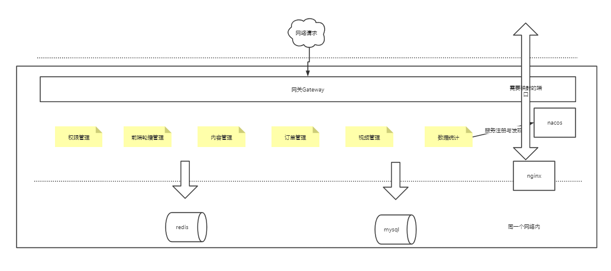

# Docker容器编排TIPS


<!--more-->


一个系统采用微服务的方式编写，根据业务分割，将系统分为权限管理，内容管理，订单管理，视频管理，数据统计等服务，每个服务以Docker容器的方式运行，底层的redis,mysql等基础性的组件也以容器的方式启动，所有容器在同一主机的同一网络内，在同一个虚拟网络内，每个服务占用一个接口，因此，各个服务之间是相互可以通信的，在系统运行时只需要开放网关接口，所有请求通过网关转发到具体服务，所以在运行期，所有非网关端口对外不可见，在一定程度上也保证了系统安全。

但是在系统运行时，可能出现系统Bug,此时需要访问一些内部组件或服务来查找原因，但是端口又不可见，停止容器，重新启动容器加端口映射并不是明智之举，解决完问题又需要把端口关闭，此时就需要在系统中加一个nginx;

在网络中加一个或者多个nginx,把需要的端口映射出来，不需要外部访问时把nginx关闭，就做到了端口安全，当需要访问内部服务是，只需要开启有对应端口映射的nginx,就能达到动态开启端口与关闭端口的目的。



docker-compose.xml配置

```xml
version: '3'
services:
  service-gateway:
    image: hubu8023/api_gateway:${TAG}
    container_name: service-gateway
    ports:
      - "8222:8222"
    restart: on-failure
    depends_on:
      - mysql
      - nacos
      - redis
    env_file:
      - .env
  service-cms:
    image: hubu8023/service_cms:${TAG}
    container_name: service-cms
    restart: on-failure
    depends_on:
      - mysql
      - nacos
      - redis
    env_file:
      - .env
  service-acl:
    image: hubu8023/service_acl:${TAG}
    container_name: service-acl
    restart: on-failure
    depends_on:
      - mysql
      - nacos
      - redis
    env_file:
      - .env
  service-edu:
    image: hubu8023/service_edu:${TAG}
    container_name: service-edu
    restart: on-failure
    depends_on:
      - mysql
      - nacos
      - redis
    env_file:
      - .env
  service-msm:
    image: hubu8023/service_msm:${TAG}
    container_name: service-msm
    restart: on-failure
    depends_on:
      - mysql
      - nacos
      - redis
    env_file:
      - .env
  service-order:
    image: hubu8023/service_order:${TAG}
    container_name: service-order
    restart: on-failure
    depends_on:
      - mysql
      - nacos
      - redis
    env_file:
      - .env
  service-oss:
    image: hubu8023/service_oss:${TAG}
    container_name: service-oss
    restart: on-failure
    depends_on:
      - mysql
      - nacos
      - redis
    env_file:
      - .env
  service-sta:
    image: hubu8023/service_sta:${TAG}
    container_name: service-sta
    restart: on-failure
    depends_on:
      - mysql
      - nacos
      - redis
    env_file:
      - .env
  service_usercenter:
    image: hubu8023/service_usercenter:${TAG}
    container_name: service_usercenter
    restart: on-failure
    depends_on:
      - mysql
      - nacos
      - redis
    env_file:
      - .env
  service-vod:
    image: hubu8023/service_vod:${TAG}
    container_name: service-vod
    restart: on-failure
    env_file:
      - .env


  nacos:
    image: nacos/nacos-server:1.1.3
    container_name: nacos-stand
    #    networks:
    #      - sc-net
    environment:
      - PREFER_HOST_MODE=hostname
      - MODE=standalone
    volumes:
      - E:/test/edu_dongyuan/nacos-server/logs/:/home/nacos/logs

#    restart: on-failure
  mysql:
    image: hubu8023/edu_mysql
    container_name: mysql
#    command: --default-authentication-plugin=mysql_native_password
#    restart: always
#    environment:
#      MYSQL_ROOT_PASSWORD: 123456
    volumes:
      - E:/test/edu_dongyuan/mysql01:/var/lib/mysql
  redis:
    hostname: redis
    image: redis
    container_name: redis
    restart: always
    volumes:
      - E:/test/edu_dongyuan/redis:/data

  nginx:
    image: hubu8023/proxy
    container_name: proxy_nginx
    ports:
      - "8848:8848"     # nacos 注册中心
      - "3310:3310"     # mysql 数据库
      - "6380:6380"     # redis
```

nginx Dockerfile

```xml
FROM nginx
ADD proxy.conf /etc/nginx/proxy.conf
ADD proxy.sh /etc/nginx/proxy.sh
ENTRYPOINT ["sh","/etc/nginx/proxy.sh"]
```

proxy.conf

nginx监听需要动态关闭的端口

```
user  nginx;
worker_processes  10;

error_log  /var/log/nginx/error.log warn;
pid        /var/run/nginx.pid;


events {
    worker_connections  50000;
}

stream {
    upstream mysql {
        server mysql:3306 max_fails=3 fail_timeout=30s;
    }

    server {
        listen 3310;
        proxy_connect_timeout 10s;
        proxy_timeout 120s;
        proxy_pass mysql;
    }


    upstream redis {
        server redis:6379 max_fails=3 fail_timeout=30s;
    }

    server {
        listen 6380;
        proxy_connect_timeout 10s;
        proxy_timeout 120s;
        proxy_pass redis;

    }

    upstream nacos {
        server nacos-stand:8848 max_fails=3 fail_timeout=30s;
    }

    server {
        listen 8848;
        proxy_connect_timeout 10s;
        proxy_timeout 120s;
        proxy_pass nacos;

    }
}
```

proxy.sh

nginx启动之后copy配置文件，然后重启生效

```
#! /bin/bash
cp /etc/nginx/proxy.conf /etc/nginx/nginx.conf
/usr/bin/iperf3 -s -D
cat /etc/nginx/nginx.conf
nginx -g "daemon off;"
```

