# Docker进阶


<!--more-->


# Docker Compose


Using [Compose](https://docs.docker.com/compose/) is basically a three-step process:

- Define your app’s environment with a **`Dockerfile`** so it can be reproduced anywhere.

- Define the services that make up your app in **`docker-compose.yml`** so they can be run together in an isolated environment.

- Run **`docker compose up`** and the [Docker compose command](https://docs.docker.com/compose/cli-command/) starts and runs your entire app. You can alternatively run **`docker-compose up`** using the docker-compose binary.

Compose是官方的开源项目，需要安装，

​	Dockerfile可以让程序在任何地方运行，但是现在有一个web服务，但是它又需要redis、MySQL、nginx等多个容器，一个一个启动就会十分麻烦。

Compose例子：

```yml
version: "3.9"  # optional since v1.27.0
services:
  web:
    build: .
    ports:
      - "5000:5000"
    volumes:
      - .:/code
      - logvolume01:/var/log
    links:
      - redis
  redis:
    image: redis
volumes:
  logvolume01: {}
```

## 安装[Compose](https://docs.docker.com/compose/install/)

1、下载：

```shell
sudo curl -L "https://github.com/docker/compose/releases/download/1.29.0/docker-compose-$(uname -s)-$(uname -m)" -o /usr/local/bin/docker-compose

sudo curl -L "https://get.daocloud.io/docker/compose/releases/download/1.29.0/docker-compose-$(uname -s)-$(uname -m)" -o /usr/local/bin/docker-compose
```

2、授权

```shell
sudo chmod +x /usr/local/bin/docker-compose
```

3、全局使用

```shell
[root@node4 /]# docker-compose version
docker-compose version 1.29.0, build 07737305
docker-py version: 5.0.0
CPython version: 3.7.10
OpenSSL version: OpenSSL 1.1.0l  10 Sep 2019
```

## [快速体验](https://docs.docker.com/compose/gettingstarted/)

### Step 1: 创建应用

Define the application dependencies.

1. Create a directory for the project(创建目录):

   ```
   $ mkdir composetest
   $ cd composetest
   ```

2. Create a file called `app.py` in your project directory and paste this in（创建python文件）:

   ```
   import time
   
   import redis
   from flask import Flask
   
   app = Flask(__name__)
   cache = redis.Redis(host='redis', port=6379)
   
   def get_hit_count():
       retries = 5
       while True:
           try:
               return cache.incr('hits')
           except redis.exceptions.ConnectionError as exc:
               if retries == 0:
                   raise exc
               retries -= 1
               time.sleep(0.5)
   
   @app.route('/')
   def hello():
       count = get_hit_count()
       return 'Hello World! I have been seen {} times.\n'.format(count)
   ```

   在这个例子中, `redis` 是应用网络中redis的容器名称. 使用端口, `6379`.

   > 注意get_hit_coun函数的编写方式。这个基本的重试循环允许我们在redis服务不可用时多次尝试请求。当应用程序上线时，这在启动时很有用，但如果在应用程序的生命周期内需要随时重新启动Redis服务，也会使我们的应用程序更有弹性。在集群中，这也有助于处理节点之间的瞬时连接中断。

3. 创建 `requirements.txt` 文件:

   ```
   flask
   redis
   ```

### Step 2: 编写Dockerfile

这一步将编写dockerfile并build image ,这个镜像包含了python所需要的环境

`Dockerfile` 文件:

```
FROM python:3.7-alpine
WORKDIR /code
ENV FLASK_APP=app.py
ENV FLASK_RUN_HOST=0.0.0.0
RUN apk add --no-cache gcc musl-dev linux-headers
COPY requirements.txt requirements.txt
RUN pip install -r requirements.txt
EXPOSE 5000
COPY . .
CMD ["flask", "run"]
```

This tells Docker to:

- Build an image starting with the Python 3.7 image.
- Set the working directory to `/code`.
- Set environment variables used by the `flask` command.
- Install gcc and other dependencies
- Copy `requirements.txt` and install the Python dependencies.
- Add metadata to the image to describe that the container is listening on port 5000
- Copy the current directory `.` in the project to the workdir `.` in the image.
- Set the default command for the container to `flask run`.

For more information on how to write Dockerfiles, see the [Docker user guide](https://docs.docker.com/develop/) and the [Dockerfile reference](https://docs.docker.com/engine/reference/builder/).

### Step 3: 在Compose文件中定义Service

创建 `docker-compose.yml` 文件:

```
version: "3.9"
services:
  web:
    build: .
    ports:
      - "5000:5000"
  redis:
    image: "redis:alpine"
```

这个Compose声明了两个service: `web` and `redis`.

```shell
[root@node4 composetest]# ll
总用量 16
-rw-r--r--. 1 root root 514 4月   9 16:48 app.py
-rw-r--r--. 1 root root 111 4月   9 17:00 docker-compose.yml
-rw-r--r--. 1 root root 252 4月   9 16:50 Dockerfile
-rw-r--r--. 1 root root  12 4月   9 16:49 requirements.txt
```

> ### Step 4: 用Compose启动多个容器
>

```shell
docker-compose up
```

```shell
[root@node4 ~]# docker ps
CONTAINER ID   IMAGE             COMMAND                  CREATED          STATUS          PORTS                    NAMES
9a28f238ee73   composetest_web   "flask run"              34 seconds ago   Up 32 seconds   0.0.0.0:5000->5000/tcp   composetest_web_1
e4cb9836d38d   redis:alpine      "docker-entrypoint.s…"   34 seconds ago   Up 32 seconds   6379/tcp                 composetest_redis_1
[root@node4 ~]# curl localhost:5000
Hello World! I have been seen 1 times.
[root@node4 ~]# curl localhost:5000
Hello World! I have been seen 2 times.
[root@node4 ~]# curl localhost:5000
Hello World! I have been seen 3 times.
[root@node4 ~]# curl localhost:5000
Hello World! I have been seen 4 times.
[root@node4 ~]# curl localhost:5000
Hello World! I have been seen 5 times.
```

```shell
[root@node4 ~]# docker network inspect composetest_default
[
    {
        "Name": "composetest_default",
        "Id": "25ec9a55f82b6ff2c9b190c911cf6a89ce998759b912c3f2dbf5c2849a6c89d5",
        "Created": "2021-04-09T17:01:45.524551071+08:00",
        "Scope": "local",
        "Driver": "bridge",
        "EnableIPv6": false,
        "IPAM": {
            "Driver": "default",
            "Options": null,
            "Config": [
                {
                    "Subnet": "172.18.0.0/16",
                    "Gateway": "172.18.0.1"
                }
            ]
        },
        "Internal": false,
        "Attachable": true,
        "Ingress": false,
        "ConfigFrom": {
            "Network": ""
        },
        "ConfigOnly": false,
        "Containers": {
            "9a28f238ee7334688d70f20a2838cbcea964bb3f1282b99b4c787b61370bd202": {
                "Name": "composetest_web_1",
                "EndpointID": "920c033116c19419b0e2807f75284d768436cb272735642b7e8257f9564d9e45",
                "MacAddress": "02:42:ac:12:00:03",
                "IPv4Address": "172.18.0.3/16",
                "IPv6Address": ""
            },
            "e4cb9836d38deb2d2dbd4211106dd2364ace9f97ab5e8827736fc7d39b5ba166": {
                "Name": "composetest_redis_1",
                "EndpointID": "7f359906cf87650c9ef25939d25c7cfe070ac1135855ff888f1b7a881682aa31",
                "MacAddress": "02:42:ac:12:00:02",
                "IPv4Address": "172.18.0.2/16",
                "IPv6Address": ""
            }
        },
        "Options": {},
        "Labels": {
            "com.docker.compose.network": "default",
            "com.docker.compose.project": "composetest",
            "com.docker.compose.version": "1.29.0"
        }
    }
]

```

流程：

- 创建网络
- 执行docker-compose.yml
- 启动服务

默认规则：

- 默认服务名（容器名）：文件夹名_服务名__num			num为副本数量，因为服务不可能只有一个，弹性扩容，高可用
- docker images 会自动pull所需images
- docker network ls 自动生成网络（同一个网络通过service名称连通）   composetest_自定义网络名称  

停止compose：

```shell
docker-compose down    ctrl+c
#一键停止所有容器
^CGracefully stopping... (press Ctrl+C again to force)
Stopping composetest_web_1   ... 
Stopping composetest_web_1   ... done
```

## yml文件编写规则

compose文件编写参考：https://docs.docker.com/compose/compose-file/compose-file-v3/

```yml
#第一层
version: ''  #向下兼容
#第二层
service:   #服务
	服务1:
		#服务配置
		images:
		build:
		network:
		...
	服务2:
		...
#第三层
volumes:
network:
config:
...
```

多看官方文档，开源项目的compose

## 部署[Woedpress](https://docs.docker.com/compose/wordpress/)项目

### 1、创建目录：

```shell
mkdir my_wordpress
 cd my_wordpress/
```

### 2、创建compose文件：

```yml
nano docker-compose.yml

version: "3.9"
    
services:
  db:
    image: mysql:5.7
    volumes:
      - db_data:/var/lib/mysql
    restart: always
    environment:
      MYSQL_ROOT_PASSWORD: somewordpress
      MYSQL_DATABASE: wordpress
      MYSQL_USER: wordpress
      MYSQL_PASSWORD: wordpress
    
  wordpress:
    depends_on:
      - db
    image: wordpress:latest
    ports:
      - "8000:80"
    restart: always
    environment:
      WORDPRESS_DB_HOST: db:3306
      WORDPRESS_DB_USER: wordpress
      WORDPRESS_DB_PASSWORD: wordpress
      WORDPRESS_DB_NAME: wordpress
volumes:
  db_data: {}
```

### 3、启动：

```shell
docker-compose up -d      #后台启动
```

```shell
[root@node4 my_wordpress]# docker ps 
CONTAINER ID   IMAGE              COMMAND                  CREATED              STATUS              PORTS                  NAMES
a56f5f6a9eb6   wordpress:latest   "docker-entrypoint.s…"   About a minute ago   Up About a minute   0.0.0.0:8000->80/tcp   my_wordpress_wordpress_1
63f261196b58   mysql:5.7          "docker-entrypoint.s…"   About a minute ago   Up About a minute   3306/tcp, 33060/tcp    my_wordpress_db_1
```

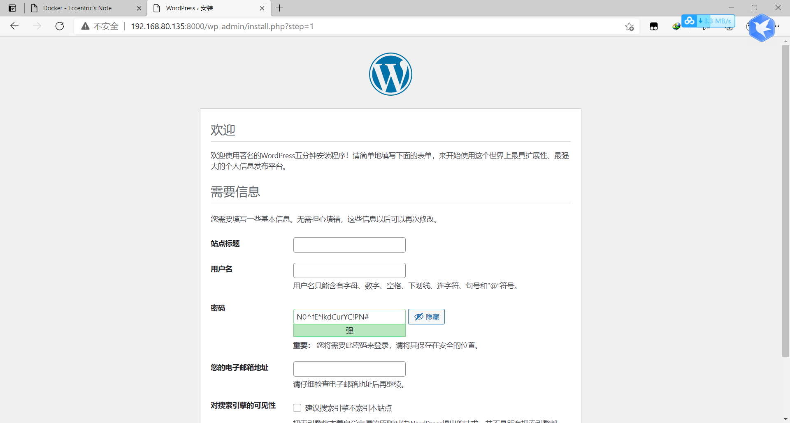

All are easy!!!!

## 实战：自己编写服务上线

### 1、编写自己的服务：

```java
package com.example.democompose.Controller;

import org.springframework.beans.factory.annotation.Autowired;
import org.springframework.data.redis.core.StringRedisTemplate;
import org.springframework.web.bind.annotation.GetMapping;
import org.springframework.web.bind.annotation.RestController;

@RestController
public class HelloController {
    @Autowired
    StringRedisTemplate redisTemplate;
    @GetMapping("/hello")
    public String hello(){
        Long views=redisTemplate.opsForValue().increment("views");
        return "hello,这是第"+views+"次访问";

    }
}

```

```properties
server.port=8080
spring.redis.host=redis
```

### 2、编写Dockerfile文件：

```shell
FROM java:8

COPY *.jar /app.jar

CMD ["--server.port=8080"]

EXPOSE 8888

ENTRYPOINT ["java","-jar","/app.jar"]
```

### 3、编写docker-compose.yml文件

```yml
version: '3.8'
services:
  myapp:
    build: .
    image: mytextappcompose
    depends_on:
      - redis
    ports:
      - "8080:8080"
  redis:
    image: "library/redis:alpine"
```

### 4、打jar包上传服务器

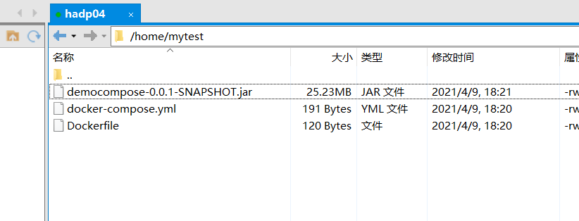

### 5、运行服务：

```shell
docker-compose up -d

docker-compose up --build     #重新构建
```


# Docker Swarm

## 搭建集群

集群-----4台服务器（一主三从）


4台机器安装Docker(Xshell窗口右键：发送键输入到所有会话):

```shell
sudo yum install -y yum-utils
# 3、设置镜像仓
sudo yum-config-manager \
    --add-repo \
    http://mirrors.aliyun.com/docker-ce/linux/centos/docker-ce.repo	# 默认是国外的 可换国内

yum makecache fast

# 4、安装相关的额
sudo yum install docker-ce docker-ce-cli containerd.io

# 5、启动
sudo systemctl start docker
docker version
```

```2
noe2	192.168.80.133
noe3	192.168.80.134
node4	192.168.80.135
test	192.168.80.136
```

### 初始化管理节点node2:

```shell
# 初始化一个manager节点
docker swarm init --advertise-addr 192.168.80.133

[root@node2 network-scripts]# docker swarm init --advertise-addr 192.168.80.133
Swarm initialized: current node (a5gz7qpsgbjolzgzg1tlaj8lh) is now a manager.

To add a worker to this swarm, run the following command:

    docker swarm join --token SWMTKN-1-4ga8o43bv28liq5q27e27deq5513t3efpl1nq7mlskyp3dulgn-e252fso8bl6zbrqtywqusrexd 192.168.80.133:2377

To add a manager to this swarm, run 'docker swarm join-token manager' and follow the instructions.
```

docker swarm join加入一个节点：

```shell
#获取令牌
docker swarm join-token manager		#管理节点
docker swarm join-token worker		#工作节点
```

### 初始化工作节点node3:

```shell
[root@node3 ~]# docker swarm join --token SWMTKN-1-4ga8o43bv28liq5q27e27deq5513t3efpl1nq7mlskyp3dulgn-e252fso8bl6zbrqtywqusrexd 192.168.80.133:2377
This node joined a swarm as a worker.
```

查看现有集群状态：

```shell
[root@node2 /]# docker node ls
ID                            HOSTNAME   STATUS    AVAILABILITY   MANAGER STATUS   ENGINE VERSION
a5gz7qpsgbjolzgzg1tlaj8lh *   node2      Ready     Active         Leader           20.10.5
e2hlgfd1v4xk7azjp27ce3fcy     node3      Ready     Active                          20.10.5
```

### 初始化工作节点node4:

```shell
[root@node2 /]# docker swarm join-token worker
To add a worker to this swarm, run the following command:

    docker swarm join --token SWMTKN-1-4ga8o43bv28liq5q27e27deq5513t3efpl1nq7mlskyp3dulgn-e252fso8bl6zbrqtywqusrexd 192.168.80.133:2377
    
[root@node2 /]# docker node ls
ID                            HOSTNAME   STATUS    AVAILABILITY   MANAGER STATUS   ENGINE VERSION
a5gz7qpsgbjolzgzg1tlaj8lh *   node2      Ready     Active         Leader           20.10.5
e2hlgfd1v4xk7azjp27ce3fcy     node3      Ready     Active                          20.10.5
6ne9u5knznm8ei0c5uz7znka9     node4      Ready     Active                          20.10.5
```

### 初始化管理节点test:

```shell
docker swarm join-token manager
docker node ls
```

```shell
[root@localhost ~]# docker swarm join --token SWMTKN-1-4ga8o43bv28liq5q27e27deq5513t3efpl1nq7mlskyp3dulgn-66whvjsogw3qsqozb79oprffr 192.168.80.133:2377
Error response from daemon: manager stopped: can't initialize raft node: rpc error: code = Unknown desc = could not connect to prospective new cluster member using its advertised address: rpc error: code = Unavailable desc = connection error: desc = "transport: Error while dialing dial tcp 192.168.80.136:2377: connect: no route to host"
```

试了好多次发现总是加入管理节点错误，一开始怀疑自己网络通信问题，后来网上无脑抄袭一致认为代理问题：

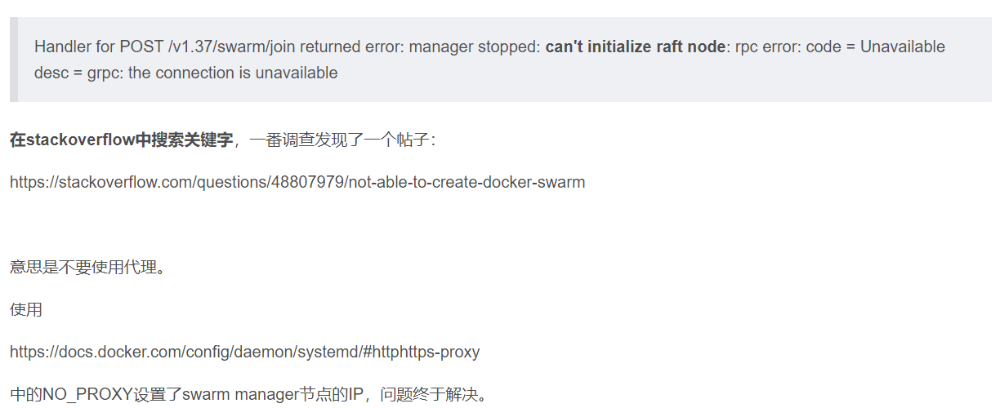

最终发现是自己新建的虚拟机test防火墙没有关:

```shell
#查看防火墙状态
systemctl status firewalld.service
#停止防火墙
systemctl stop firewalld.service
#永久停止
systemctl disable firewalld.service
```

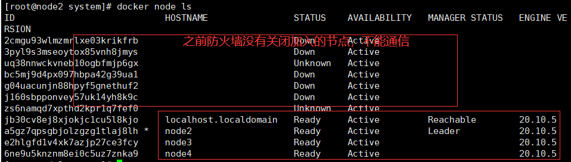

## Raft协议

现在：双主双从，假设一个节点挂了，其他节点是否可用？？

Raft协议：保证大多数节点存活集群才可用，至少大于1台，集群至少大于3台！！

实验：

#### 1、将node2管理节点停止，宕机，另外一个管理节点也不能用了

```
systemctl stop docker 
```

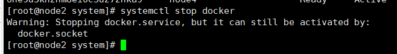

在test管理节点查看集群，发现不可用：

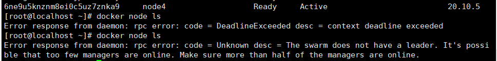

#### 2、重新启动node2:

```
systemctl start docker
```

发现leader节点变了：

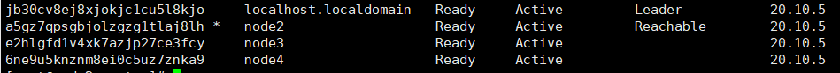

#### 3、工作节点node3离开：

```
docker swarm --help
docker swarm leave
```

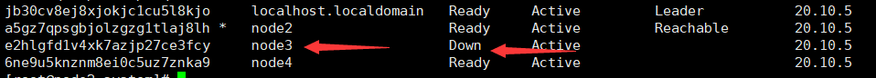

#### 4、三主一工作：

```shell
docker swarm join-token manager

jb30cv8ej8xjokjc1cu5l8kjo     localhost.localdomain   Ready     Active         Leader           20.10.5
a5gz7qpsgbjolzgzg1tlaj8lh *   node2                   Ready     Active         Reachable        20.10.5
nmhr2t2b5cgy4l64bcwl0mxjt     node3                   Ready     Active         Reachable        20.10.5
e2hlgfd1v4xk7azjp27ce3fcy     node3                   Down      Active                          20.10.5
6ne9u5knznm8ei0c5uz7znka9     node4                   Ready     Active                          20.10.5
```

现在就是3台作为管理节点：

#### 5、停掉Leader(test)：

现在Leader是test节点，停掉：

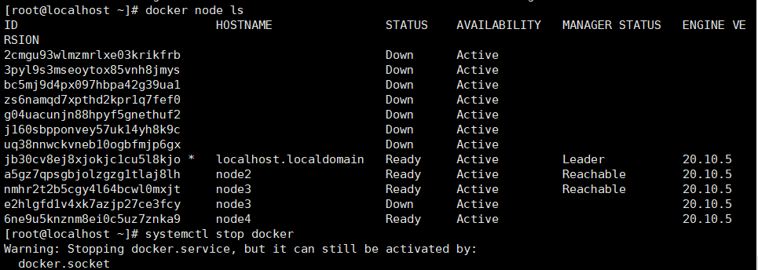

在node2查看集群状态,发现node3变成了leader，集群任然可用

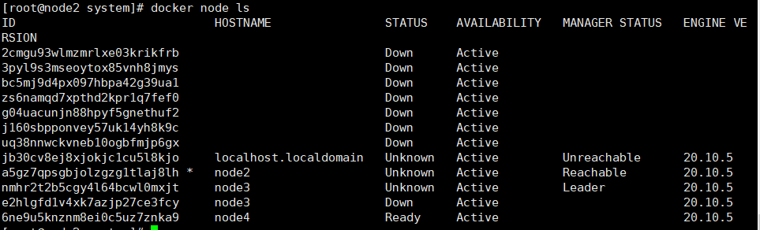

#### 6、大多数存活可用

现在只有两个管理节点（node2/node3），一个工作节点(node4)，如果再停止一个管理节点，那就无法使用了：

```shell
[root@node3 ~]# docker node ls
Error response from daemon: rpc error: code = Unknown desc = The swarm does not have a leader. It's possible that too few managers are online. Make sure more than half of the managers are online.
```


大多数管理节点存活才可用

## 集群部署应用、弹性、扩缩容

以后告别docker run

集群：高可用，web->redis(分布在三台不同主机上，服务副本，挂了一个没事，其他可用)

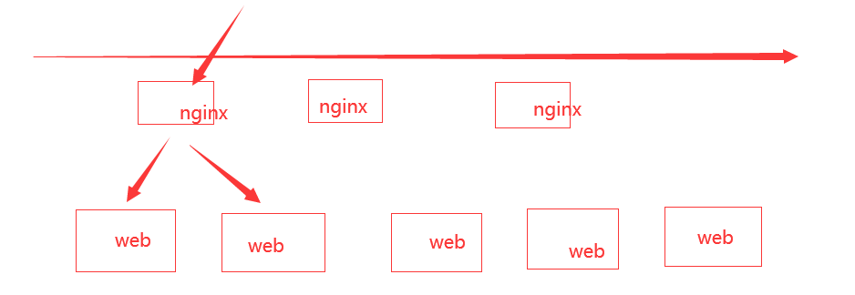

容器=》服务=》副本

```shell
docker run    # 容器启动，不具备扩缩容功能
docker service   #服务，具备扩缩容、滚动跟新、灰度发布
```

### 服务部署

```shell
#前提是swarm搭建好
#在node2中创建服务
docker service create -p 8888:80 --name mynginx nginx
docker service ls
docker service ps mynginx
docker service inspect mynginx

[root@node2 ~]# docker service ps mynginx
ID             NAME        IMAGE          NODE      DESIRED STATE   CURRENT STATE            ERROR     PORTS
ndtmy83nj0v3   mynginx.1   nginx:latest   node3     Running         Running 34 seconds ago             
[root@node2 ~]# docker service ls
ID             NAME      MODE         REPLICAS   IMAGE          PORTS
iv9jcn74r0uj   mynginx   replicated   1/1        nginx:latest   *:8888->80/tcp
# 服务副本只有一个，并且服务运行在node3主机上

[root@node3 ~]# docker ps
CONTAINER ID   IMAGE          COMMAND                  CREATED         STATUS         PORTS     NAMES
a92bf0b74b83   nginx:latest   "/docker-entrypoint.…"   4 minutes ago   Up 4 minutes   80/tcp    mynginx.1.ndtmy83nj0v3oathgaleiw37v
```

现在服务只随机创建了一个服务，在node3主机上，假如现在访问量加大，需要扩容：

```shell
# 创建3个副本
docker service update --replicas 3 mynginx

[root@node3 ~]# docker service update --replicas 3 mynginx
mynginx
overall progress: 3 out of 3 tasks 
1/3: running   [==================================================>] 
2/3: running   [==================================================>] 
3/3: running   [==================================================>] 
verify: Service converged 
[root@node3 ~]# docker service ls
ID             NAME      MODE         REPLICAS   IMAGE          PORTS
iv9jcn74r0uj   mynginx   replicated   3/3        nginx:latest   *:8888->80/tcp
[root@node3 ~]# docker service inspect mynginx
```

此时三个服务副本在node3、node4、test主机上

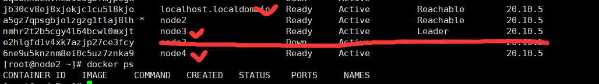

在集群中的任意一个节点都可访问，服务可以有多个副本来实现高可用：

但是现在通过node3IP无法访问服务，其他正常


### 大无语事件来了，有彩蛋:

```shell
#如果把副本数量讲到1个会怎么样？？降！！！

[root@node3 ~]# docker service update --replicas 1 mynginx
mynginx
overall progress: 1 out of 1 tasks 
1/1: running   [==================================================>] 
verify: Service converged 
#那就是只有这个一个副本？？？（bug）

[root@node3 ~]# docker ps
CONTAINER ID   IMAGE          COMMAND                  CREATED          STATUS          PORTS     NAMES
a92bf0b74b83   nginx:latest   "/docker-entrypoint.…"   40 minutes ago   Up 40 minutes   80/tcp    mynginx.1.ndtmy83nj0v3oathgaleiw37v
#发现还是访问不了，查看日志，发现他的日志启动一半，少了许多日志，那就重启

[root@node3 ~]# docker restart mynginx.1.ndtmy83nj0v3oathgaleiw37v
mynginx.1.ndtmy83nj0v3oathgaleiw37v
[root@node3 ~]# docker ps
CONTAINER ID   IMAGE          COMMAND                  CREATED          STATUS              PORTS     NAMES
a92bf0b74b83   nginx:latest   "/docker-entrypoint.…"   42 minutes ago   Up About a minute   80/tcp    mynginx.1.ndtmy83nj0v3oathgaleiw37v
[root@node3 ~]# docker service ls
ID             NAME      MODE         REPLICAS   IMAGE          PORTS
iv9jcn74r0uj   mynginx   replicated   1/1        nginx:latest   *:8888->80/tcp
```

但是我又发现，怎么会有两个：

```
[root@node2 ~]# docker ps
CONTAINER ID   IMAGE          COMMAND                  CREATED          STATUS          PORTS     NAMES
2bc639d336dd   nginx:latest   "/docker-entrypoint.…"   13 minutes ago   Up 13 minutes   80/tcp    mynginx.1.wgk7pwm0mm7zs6fawmb7p6otf

[root@node3 ~]# docker ps
CONTAINER ID   IMAGE          COMMAND                  CREATED          STATUS          PORTS     NAMES
a92bf0b74b83   nginx:latest   "/docker-entrypoint.…"   55 minutes ago   Up 14 minutes   80/tcp    mynginx.1.ndtmy83nj0v3oathgaleiw37v
```

我把其中一个关掉还是不能访问，此时通过mynginx信息发现如下错误：

```
[root@node2 ~]# docker service ps  mynginx
ID             NAME            IMAGE          NODE      DESIRED STATE   CURRENT STATE            ERROR                         PORTS
x8advkit107e   mynginx.1       nginx:latest   node4     Running         Running 6 minutes ago                                  
wgk7pwm0mm7z    \_ mynginx.1   nginx:latest   node2     Shutdown        Complete 6 minutes ago                                 
ndtmy83nj0v3    \_ mynginx.1   nginx:latest   node3     Shutdown        Failed 25 minutes ago    "task: non-zero exit (137)"
```

那就只能重来一遍：

```shell
docker service rm mynginx
docker service create -p 8888:80 --replicas 3 --name mynginxtest nginx
[root@node2 ~]# docker service ps  mynginxtest
ID             NAME            IMAGE          NODE                    DESIRED STATE   CURRENT STATE            ERROR     PORTS
fultv05jwsbm   mynginxtest.1   nginx:latest   localhost.localdomain   Running         Running 15 seconds ago             
yikbwlzinhd5   mynginxtest.2   nginx:latest   node3                   Running         Running 17 seconds ago             
f5cljf1f6d73   mynginxtest.3   nginx:latest   node2                   Running         Running 16 seconds ago
```

```shell
[root@node2 ~]# docker service ps mynginxtest
ID             NAME            IMAGE          NODE                    DESIRED STATE   CURRENT STATE           ERROR     PORTS
fultv05jwsbm   mynginxtest.1   nginx:latest   localhost.localdomain   Running         Running 7 minutes ago             
yikbwlzinhd5   mynginxtest.2   nginx:latest   node3                   Running         Running 7 minutes ago             
f5cljf1f6d73   mynginxtest.3   nginx:latest   node2                   Running         Running 7 minutes ago             
[root@node2 ~]# docker node ls
ID                            HOSTNAME                STATUS    AVAILABILITY   MANAGER STATUS   ENGINE VERSION
jb30cv8ej8xjokjc1cu5l8kjo     localhost.localdomain   Ready     Active         Reachable        20.10.5
a5gz7qpsgbjolzgzg1tlaj8lh *   node2                   Ready     Active         Reachable        20.10.5
nmhr2t2b5cgy4l64bcwl0mxjt     node3                   Ready     Active         Leader           20.10.5
6ne9u5knznm8ei0c5uz7znka9     node4                   Ready     Active                          20.10.5
```

**问题依旧存在(只有node3不能访问)，不搞了，等后续，欢迎留言？？？**

问题最终还是解决了？？？

```shell
#以为node3的防火墙没有关，或者是leader节点不能访问？
systemctl stop docker   #让他重新选举leader，发现还是可以访问leader，
systemctl status firewalld.service    #防火墙状态关闭
systemctl start docker    #重新启动又好了,玄学
```


副本服务与全局服务

```shell
docker service create --mode replicated --name mytom tomcat:7  #默认worker节点创建服务
docker service create --mode global --name mytom tomcat:7      #全局
```

减少副本：

```shell
docker service update --replicas 1 mynginx
```

扩缩容：

```shell
docker service scale mynginxtest=5
docker service update --replicas 5 mynginxtest
```

```shell
ID             NAME            IMAGE          NODE                    DESIRED STATE   CURRENT STATE                ERROR     PORTS
fultv05jwsbm   mynginxtest.1   nginx:latest   localhost.localdomain   Running         Running 12 minutes ago                 
yikbwlzinhd5   mynginxtest.2   nginx:latest   node3                   Running         Running 12 minutes ago                 
f5cljf1f6d73   mynginxtest.3   nginx:latest   node2                   Running         Running 12 minutes ago          
l4blkh6mq996   mynginxtest.4   nginx:latest   node4                   Running         Running about a minute             
kvn9nhtwymds   mynginxtest.5   nginx:latest   node4                   Running         Running about a minute 
```

## 总结

**swarm:**

​	集群的管理和编排，docker可以初始化一个swarm集群，其他节点可以加入（manager OR worker）

**node**：

​	就是一个docker节点，多个节点就组成了一个网络集群

**service**

​	就是一个任务，可以在管理节点或者工作节点运行，核心


​	

**swarm网络：overlay,ingress**

# Docker [Stack](https://docs.docker.com/engine/reference/commandline/stack/)

docker-compose:适合单机部署项目！

docker stack：集群部署项目(已经快被k8s替代了)

```shell
#单机部署
docker-compose up -d wordpress.yml
#集群部署
docker stack deploy wordpress.yml
```

# Docker Secret

安全，密码、证书配置：

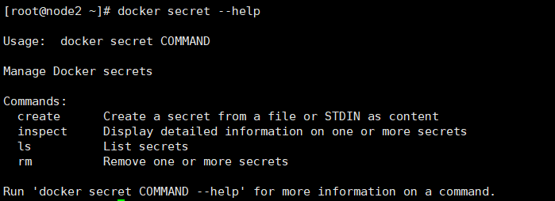

# Docker Config

配置：

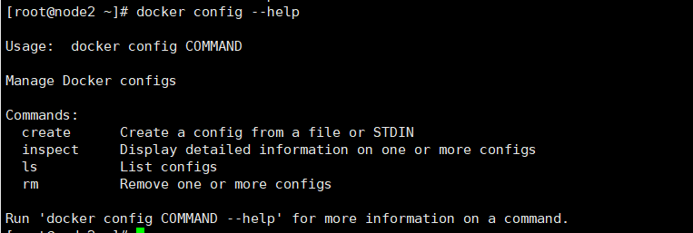

