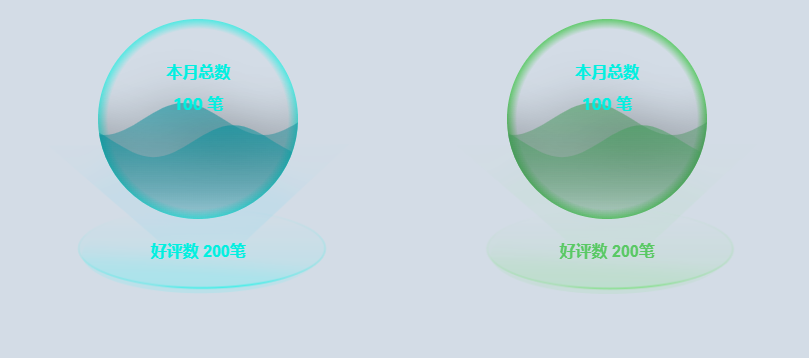

# Echarts之liquidFill球状图封装


<!--more-->

### 0、最终实现效果



### 1、组件代码

#### 1.1、Vue代码

```vue
<template>
  <div class="content content-item item" :style="'float: left;background-image: url(' + static_color.bgImage+')'">
    <div class="statistics-item-1">
      本月总数
      <p>
        {{ option.num }}
        <span>笔</span>
      </p>
    </div>
    <div class="echarts" :id="option.id"></div>
    <div class="statistics-item-2" :style="'color: ' + static_color.color">
      好评数
      <span :style="'color: ' + static_color.color"> {{ option.total }}笔 </span>
    </div>
  </div>
</template>
<script>
import * as echarts from 'echarts'
import 'echarts-liquidfill'

export default {
  name: 'thematicModelBizMonitor-8-si',
  props:{
    option:{
      type: Object
    },
    static_color:{
      type: Object
    }
  },
  mounted() {
    this.initEcharts()
  },
  methods: {
    initEcharts() {
      const echartsDom = document.getElementById(this.option.id)
      let liquidEchart = echarts.getInstanceByDom(echartsDom)
      if (liquidEchart == null) {
        liquidEchart = echarts.init(echartsDom)
      }
      liquidEchart.setOption(this.getOption())
    },
    getOption(){
      const data = this.option.num/this.option.total;
      const option = {
        // backgroundColor: 'white',
        series: [
          {
            type: 'liquidFill',
            radius: '80%',
            data: [data, data-0.111],
            backgroundStyle: {
              color: {
                type: 'radial',
                x: 0.5,
                y: 0.5,
                r: 0.5,
                colorStops: this.static_color.background_colorStops,
                globalCoord: false
              }
            },
            outline: {
              borderDistance: 0,
              itemStyle: {
                borderWidth: 0,
                borderColor: {
                  type: 'linear',
                  x: 0,
                  y: 0,
                  x2: 0,
                  y2: 1,
                  colorStops: this.static_color.outline_colorStops,
                  globalCoord: false
                }
              }
            },
            // color: ['rgba(37,237,240, 1)', 'rgba(37,200,220, 1)'],
            color: [
              {
                type: 'linear',
                x: 0,
                y: 0,
                x2: 0,
                y2: 1,
                colorStops: this.static_color.line_colorStops,
                globalCoord: false
              }
            ],
            label: {
              normal: {
                formatter: ''
              }
            }
          }
        ]
      }
      return option;
    }
  }
}
</script>
<style scoped>
.content {
  width: 100%;
  height: 350px;
  box-sizing: content-box;
  text-align: center;
  position: relative;
  display: block;
}
.content-item {
  width: 50%;
  height: 100%;
  position: relative;
}
.item{
  top: 0;
  background-position: 50% 150px;
  background-repeat: no-repeat;
  background-size: 300px 150px;
}
.echarts {
  width: 250px;
  height: 250px;
  margin: auto;
  display: block;
  /*//position: absolute;*/
}
.statistics-item-1 {
  position: absolute;
  z-index: 1;
  display: block;
  align-items: center;
  font-size: 16px;
  line-height: 16px;
  font-weight: 550;
  color: rgb(0, 240, 224);
  margin: 0 auto;
  margin-top: 50px;
  /*//width: 250px;*/
  /*//margin: auto;*/
  width: 100%;
  padding: 20px 0;
  font-family: PingFang SC;
  p {
    margin-bottom: 0;
    font-size: 30px;
    line-height: 50px;
    font-family: YouSheBiaoTiHei;
    font-weight: 400;
    display: flex;
    align-items: center;
    color: #ffffff;
    margin: auto;
    width: fit-content;
    span {
      padding-top: 10px;
      font-size: 20px;
      line-height: 20px;
      font-family: YouSheBiaoTiHei;
      font-weight: 400;
      color: #ffffff;
      margin-left: 9px;
    }
  }
}
.statistics-item-2 {
  position: absolute;
  align-items: center;
  font-size: 16px;
  line-height: 16px;
  color: #00f8ff;
  /*//margin-left: 36%;*/
  font-weight: 550;
  width: 100%;
  span {
    margin-bottom: 0;
    font-size: 20px;
    line-height: 20px;
    font-family: YouSheBiaoTiHei;
    font-weight: 400;
    /*display: flex;*/
    margin-left: 10px;
    align-items: center;
    color: #ffffff;
  }
}
</style>
```

#### 1.2、js常量类

```js
export const color_blue = {
  color: "rgb(0,240,224)",
  bgImage: require("@/assets/images/pay/liquidfill/wave_bg_blue.png"),
  background_colorStops: [
    {
      offset: 0,
      color: 'rgba(0,240,224, 0)'
    },
    {
      offset: 0.9,
      color: 'rgba(0,240,224, 0)'
    },
    {
      offset: 1,
      color: 'rgba(0,240,224, 0.6)'
    }
  ],
  outline_colorStops: [
    {
      offset: 0,
      color: 'rgba(50,115,256, 1)'
    },
    {
      offset: 0.5,
      color: 'rgba(50,115,233, .75)'
    },
    {
      offset: 1,
      color: 'rgba(50,115,233, 1)'
    }
  ],
  line_colorStops: [
    {
      offset: 0,
      color: 'rgba(2,145,157, 0.6)'
    },
    {
      offset: 0.5,
      color: 'rgba(2,145,157, 0.3)'
    },
    {
      offset: 1,
      color: 'rgba(2,145,157, 0.1)'
    }
  ]
};
export const color_green = {
  color: "rgb(89,201,100)",
  bgImage: require("@/assets/images/pay/liquidfill/wave_bg_green.png"),
  background_colorStops: [
    {
      offset: 0,
      color: 'rgba(89,201,100, 0)'
    },
    {
      offset: 0.9,
      color: 'rgba(89,201,100, 0)'
    },
    {
      offset: 1,
      color: 'rgba(89,201,100, 0.9)'
    }
  ],
  outline_colorStops: [
    {
      offset: 0,
      color: 'rgba(50,115,256, 1)'
    },
    {
      offset: 0.5,
      color: 'rgba(50,115,233, .75)'
    },
    {
      offset: 1,
      color: 'rgba(50,115,233, 1)'
    }
  ],
  line_colorStops: [
    {
      offset: 0,
      color: 'rgba(68,158,93, 0.6)'
    },
    {
      offset: 0.5,
      color: 'rgba(68,158,93, 0.3)'
    },
    {
      offset: 1,
      color: 'rgba(68,158,93, 0.1)'
    }
  ]
}

```

### 2、如何使用

```vue
<template>
	<div class="grid-content bg-purple">
          <liquidfill-echart
            :option="liquidOption"
            :static_color="color1"
          />
          <liquidfill-echart
            :option="liquidOption2"
            :static_color="color2"
          />
        </div>
</template>
<script>
import LiquidfillEchart from "@/components/3DEcharts/liquidfill/liquidfillEchart.vue";
import { color_blue,color_green } from "@/components/3DEcharts/liquidfill/liquidConst"
export default {
  name: 'staticpay',
  components: { LiquidfillEchart},
  data() {
    return {
      liquidOption:{
        id: "liquid",
        num: 100,
        total: 200,
      },
      liquidOption2:{
        id: "liquid2",
        num: 100,
        total: 200,
      },
      color1: color_blue,
      color2: color_green,
    }
  },
  mounted() {
    console.log(cubeConst.colors)
  },
  methods: {
  }
}
</script>
```


