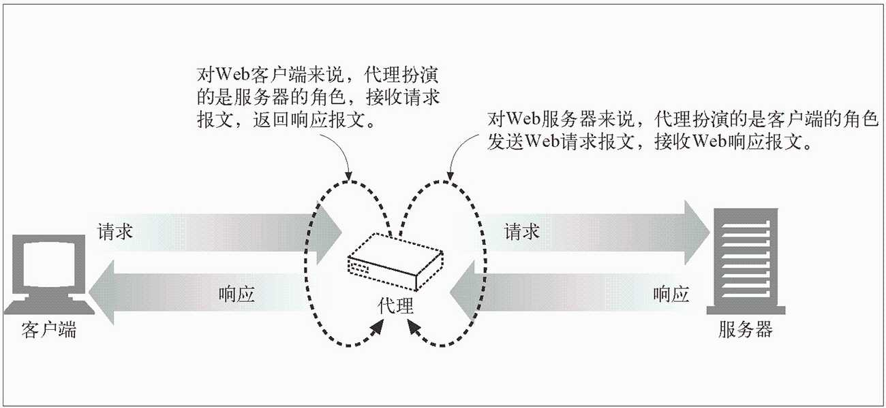
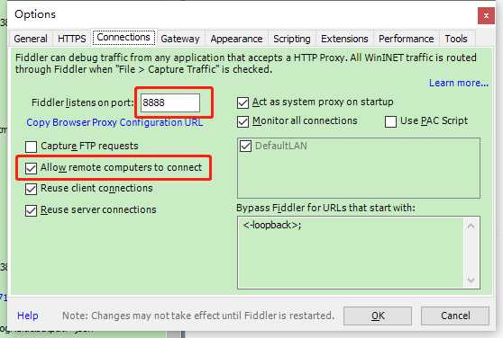
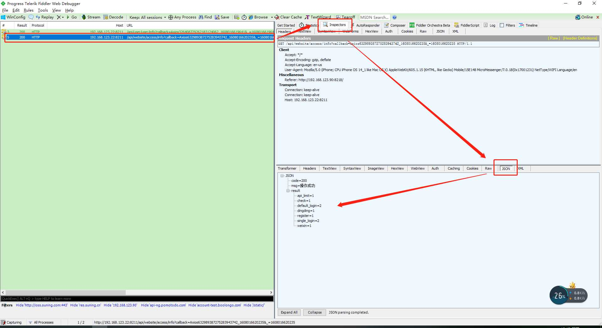
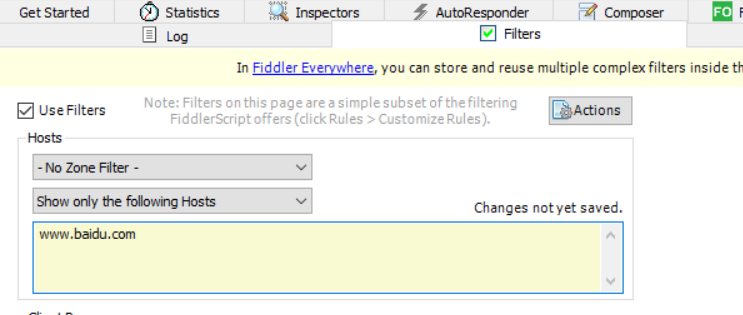

# Fiddler如何实现抓包


## fiddler简介

Fiddler 是一款强大的抓包工具，原理是以 web 代理服务器的形式进行工作的:



下载地址： [Fiddler 下载](https://www.telerik.com/download/fiddler)

## 配置

### 允许监听https

Fiddler 如果抓取 https 协议会话需要进一步配置，在 Tools ->Options 菜单下，选择HTTPS标签并配置如下：

步骤：

1. `Tools` -> `Options` -> `HTTPS` -> 勾选 `Decrypt HTTPS traffic`
2. 点击 `Actions` -> `Trust Root Certificate` -> 选择 `Yes`


### 允许远程连接

手机抓取需要配置远程连接，在 Tools ->Options 菜单下，选择Connections标签并配置如下：

监听端口 8888 并允许远程连接



## 手机配置

需要电脑与手机处于同一网段（例如同一局域网）

### 下载证书

打开手机浏览器，输入 http://【fiddler电脑IP地址】:【fiddler设置的端口号】，例如 http://192.168.123.100:8888 可以下载证书并安装。在打开的页面中，点击 FiddlerRoot certificate 下载证书，点击允许 


### 安装证书

有的手机可以直接点击已下载的文件进行安装，有的手机则不行。

如果不能直接安装证书，我们可以通过以下方法来安装证书。

1.Android：安装证书。由于安装系统众多，设置的方法不尽相同，下面几个方法以供参考。

方法一：手机——设置——搜索【证书】二字——选择：安装证书或者证书管理：点击安装证书，在你的众多文件里面去选择刚刚下载的fiddler的证书，点击安装

**（注：选择安装的文件后，需要输入手机的锁屏密码。Android一定要有锁屏密码才能安装证书）**


### 配置代理

配置手机无线信号的代理

设置——无线网络（WLAN）——WLAN——长按已连接的WiFi 去修改网络——在高级选项里面——选择【手动代理】——出现以下界面，按图所示操作即可。


此时操作浏览器或APP，在 fiddler 中可以看到完成的请求和响应数据：




## 其他

### 数据筛选

点击右侧 `Filters` -> 勾选 `Use Filters`


`Hosts` 下面，第一个选项：空间过滤；第二个选项：主机名过滤


**空间过滤** ：区分内网跟外网
`No Zone Filter`：不通过空间进行过滤
`show only Intranet Hosts`: 内网
`show only Internet Hosts`: 外网

主机名过滤 ：
No Host Filter：不通过主机名过滤
Hide the following Hosts：隐藏下边输入的主机名的请求
Show only the following Hosts：只显示下边输入的主机名的请求
Flag the following Hosts：标记下边输入的要过来的主机名的请求，黑色粗体标记
筛选指定主机名：

-No Host Filter- 选择 Show only the following Hosts
输入框输入要筛选的主机名：如 www.baidu.com，多个 Host 时用分号分隔，输入框为黄色代表未保存
Actions -> Run Filterset now：马上执行过滤


**其他过滤方法** ：


### 展示接口的响应时间

1、直接点击接口查看接口响应时间


2、新增一列展示接口响应时间

Rules` -> `Customize Rules…` -> 搜索：`class Handlers

```js
// 显示每行请求的服务端耗时时间
public static BindUIColumn("Time Taken", 80)
function CalcTimingCol(oS: Session){
  var sResult = "0";
  if ((oS.Timers.ServerDoneResponse > oS.Timers.ClientDoneRequest)) {
    sResult = (oS.Timers.ServerDoneResponse - oS.Timers.ClientDoneRequest).TotalMilliseconds.ToString("N0");
  }
  return sResult + "ms";
}
```

保存，重新打开 fiddler 就能看到每个请求的耗时了。单位毫秒

### http请求的host参数为 Tunnel to

`fiddler` 做代理转发 `https` 请求时，就会产生：`CONNECT Tunnels`，可以不管它。


### 开启 Fiddler 后 Postman 无法发起请求

Postman**关闭 SSL 设置** ：`Settings` -> `General` -> 关闭：`SSL certificate verification`


### 图标含义

[官方文档](https://docs.telerik.com/fiddler/knowledge-base/uiguide)


