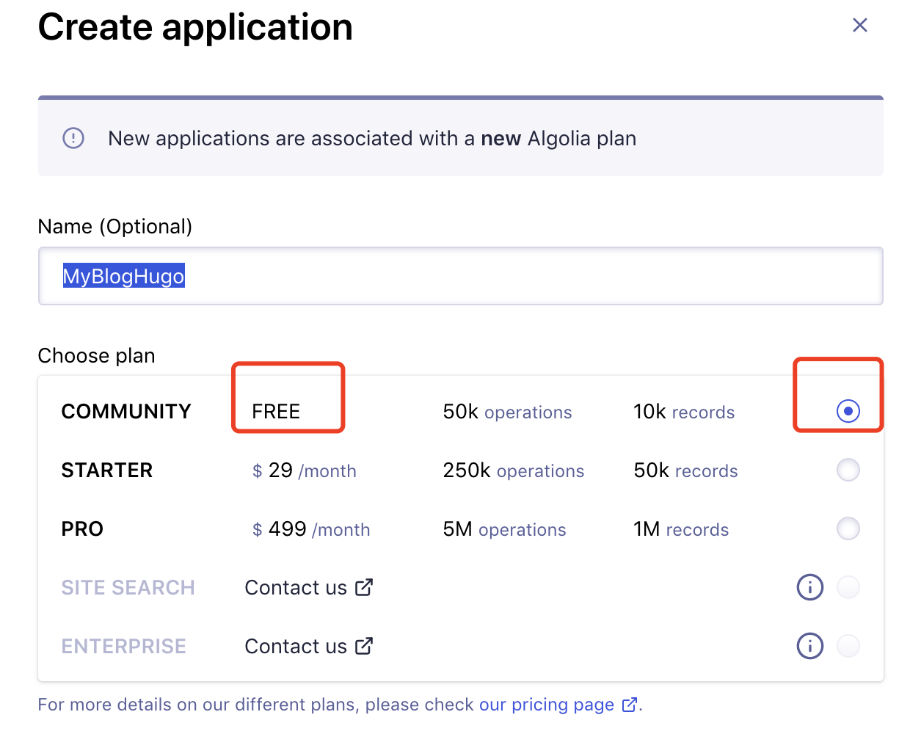
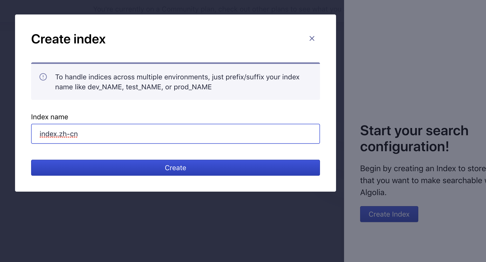
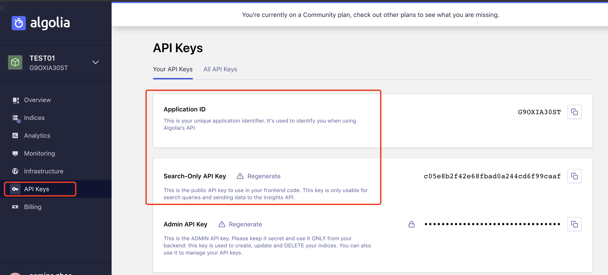
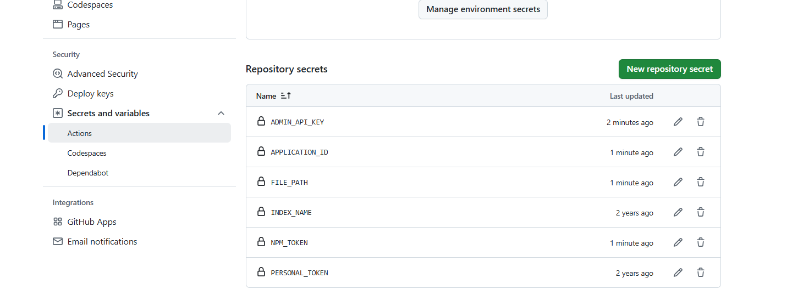
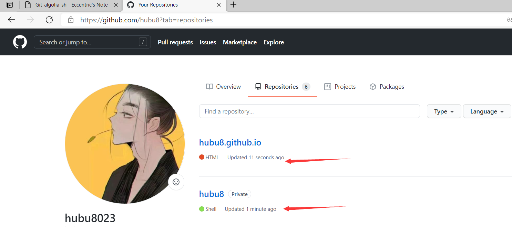
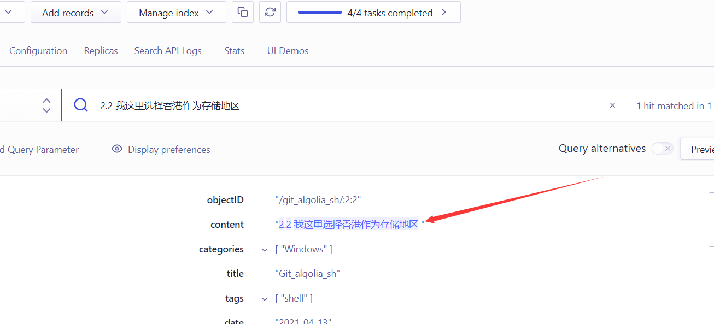

# Git_algolia_sh git_bat升级版本


<!--more-->

## 1 config.toml 配置

首先我们配置好 config.toml 的 algolia 的配置

```
 [params.search]
    enable = true
    # 搜索引擎的类型 ("lunr", "algolia")
    type = "algolia"
    # 文章内容最长索引长度
    contentLength = 4000
    # 搜索框的占位提示语
    placeholder = ""
    #  最大结果数目
    maxResultLength = 10
    #  结果内容片段长度
    snippetLength = 50
    #  搜索结果中高亮部分的 HTML 标签
    highlightTag = "em"
    #  是否在搜索索引中使用基于 baseURL 的绝对路径
    absoluteURL = false
    [params.search.algolia]
      index = "hugo"
      appID = "CT9HNMDY0J"
      searchKey = "你的搜索密钥"
```

## 2 Algolia 配置

### 2.1 登录 [Algolia 官网](https://www.algolia.com/) ，注册账号，创建 Application 名为 “test01”作为举例，默认选择 “FREE” 即可，这里自定义名称



### 2.2 我这里选择香港作为存储地区

### 2.3 创建index，要与config.toml 的配置 index 一样



### 2.4 将 API Keys 里面补充到 config.toml 里面



## 3 使用 [atomic-algolia](https://github.com/chrisdmacrae/atomic-algolia) 来完成自动更新索引

### 3.1 首先安装 npm，这里不介绍

### 3.2 安装 atomic-algolia

```shell
npm -g install atomic-algolia --save
```

### 3.3 创建 .env 文件存放 algolia 配置

```
ALGOLIA_APP_ID="CT9HNMDY0J"
ALGOLIA_ADMIN_KEY="你的超级管理员密钥，上传json"
ALGOLIA_INDEX_NAME="hugo"
ALGOLIA_INDEX_FILE="public/index.json"
```

### 3.4 可能影响环境变量的githu设置




### 3.5 修改根目录下的 `package.json` 文件（没有就新建），在 `scripts` 下添加 `"algolia": "atomic-algolia"`

```json
{
  "scripts": {
    "test": "echo \"Error: no test specified\" && exit 1",
    "algolia": "atomic-algolia"
  }
}

```

### 3.6 上传索引的命令 你可以本地执行 `npm run algolia` 查看运行效果

## 4 定制化脚本

```shell
#!/bin/sh

# If a command fails then the deploy stops
set -e

start_local_hugo_server(){
	hugo server --disableFastRender
}

update_algolia(){

	pwd	
	npm run algolia
	printf "\033[0;32m已经更新到 algolia ！！！\033[0m\n"
	sleep 10
}

pushMyBlogHugo(){
	printf "\033[0;32mDeploying updates to GitHub "https://github.com/hubu8/hubu8"\033[0m\n"
	git pull
	# Add changes to git.
	git add .

	# Commit changes.
	msg="change MyBlogHugo site $(date)"

	if [ "$#" -gt 1 ]; then
		msg="$2"
	fi
	git commit -m "$msg"

	# Push source and build repos.
	git push origin master
	sleep 10
}

push_public(){
	printf "\033[0;32mDeploying updates to GitHub "https://github.com/hubu8/hubu8.github.io"\033[0m\n"
		# Build the project.
	hugo  # if using a theme, replace with `hugo -t <YOURTHEME>`

	# Go To Public folder
	cd public
	pwd
	git pull
	# Add changes to git.
	git add .
	
	# Commit changes.
	msg="rebuilding site $(date)"

	if [  "$#" -gt 1 ]; then
		msg="$2"
	fi

	git commit -m "$msg"

	# Push source and build repos.
	git push 

	sleep 10
}

case $1 in
	1)
		start_local_hugo_server
    ;;
	2)
		pushMyBlogHugo	$*	
    ;;
    3)
		push_public $*		
    ;;
	4)
		update_algolia		
    ;;
	5)
		hugo serve -e production
	;;
	6)
		hugo server --source=themes/LoveIt/exampleSite
	;;
esac

```

脚本解析：

> sh deploy.sh 1：启动 hugo 作为本地调试使用，实时将文章的内容更新到站点，不需要重启也能边修改边观看效果。
>
> sh deploy.sh 2：将 MyHugoBlog 上传到 Github 存储库。
>
> sh deploy.sh 3：将 public 静态文件站点上传到Github Pages 存储库。
>
> sh deploy.sh 4：更新 algolia 的索引.
>
> sh deploy.sh 5：主要是用来调试 cdn，评论系统等，所以要用 production 变量来启动。
>
> sh deploy.sh 6：查看官方例子，方便调试。


仓库代码检验：



 algolia 的索引:



