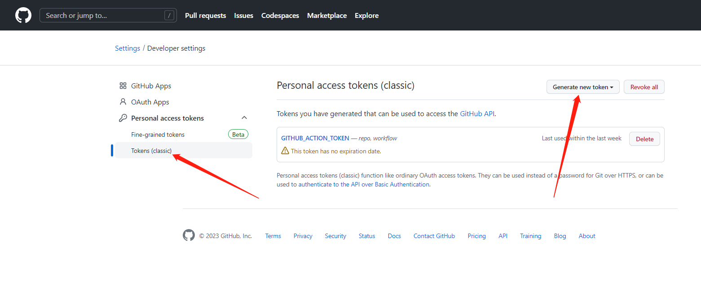
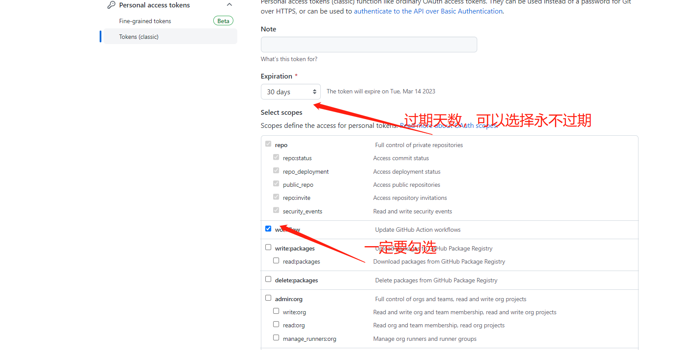
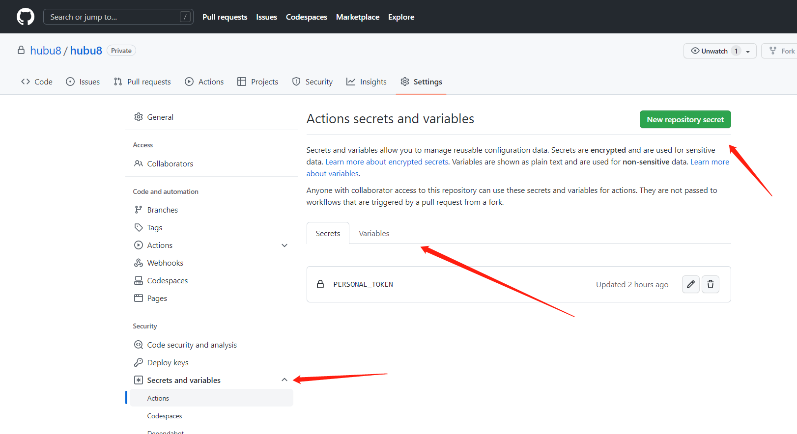

# github action实现自动编译发布githubPages


<!--more-->

### 为什么要配置自动发布

基于前面的方案中，一次更新过程如下：

1. 在本地写好md文章
2. 用hugo发布到public/目录下
3. 复制到本地仓库(也可以将git本地仓库配置到public/目录下，但因为我同时也在用git管理md，这么做会将两个项目的git纠缠在一起，不够清爽，违背我的审美)
4. 再推到远程仓库

这样做的弊端是：

1. 本地必须管理两个git仓库，一个是hugo-md源码库，另一个是生成的静态网页库，增加了更新文章的复杂度；
2. 发布必须先发一个本地，然后手动上传，也增加了出错的风险。

一个理想的状态是，我只负责写文，和将好的md提交到git备份，然后就可以坐等网站内容更新了。github官方提供的GitHub Action正可以满足这个需求。

这样的需求下，整个Github Action只需要做两件事：

1. 编译，生成静态文件
2. 部署，把静态文件移动到合适的位置
   - 比如放到某个云服务器上
   - 或者放到 Github Pages

然后我们再通过`git push`来触发Github Action就可以了。

### 准备

需要我们在github上准备两个仓库：

- 一个是存放博客源码的私有仓库
- 另一个是Github Pages公开库

### 主要流程

1. 配置私有库的Github Action
2. 配置合适的token

### 具体实现

#### 配置私有库的Github Action

- 在hugo博客根目录下，创建放置Github Action配置文件的目录 `.github/workflows`；
- 在 `.github/workflows`目录下，创建一个yml文件，这就是Github Action需要的一个工作流的配置，如果需要多个工作流可以创建多个yml文件；
   Hugo的官方文档[Build Hugo With GitHub Action](https://links.jianshu.com/go?to=https%3A%2F%2Fgohugo.io%2Fhosting-and-deployment%2Fhosting-on-github%2F%23build-hugo-with-github-action) 中也推荐采用GitHub Actions作为持续集成部署方案，并提供了yml文件示例:


```yml
name: github pages

on:
  push:
    branches:
      - main  # Set a branch to deploy
  pull_request:

jobs:
  deploy:
    runs-on: ubuntu-22.04
    steps:
      - uses: actions/checkout@v3
        with:
          submodules: true  # Fetch Hugo themes (true OR recursive)
          fetch-depth: 0    # Fetch all history for .GitInfo and .Lastmod

      - name: Setup Hugo
        uses: peaceiris/actions-hugo@v2
        with:
          hugo-version: 'latest'
          # extended: true

      - name: Build
        run: hugo --minify

      - name: Deploy
        uses: peaceiris/actions-gh-pages@v3
        if: github.ref == 'refs/heads/main'
        with:
          github_token: ${{ secrets.GITHUB_TOKEN }}
          publish_dir: ./public
```

整个 Action 一个包含 4 个步骤：

1. 拉取代码
2. 准备 hugo 环境
3. 使用 hugo 编译生成静态文件
4. 把生成的静态文件发布到 Github Pages

可以根据自己的情况修改配置参数，最好和本地配置一致，可以避免版本不同造成的问题。我改了以下几处：

- jobs.build-deploy.runs-on改为ubuntu-20.04（为了和本地版本一致）
- jobs.build-deploy.steps.uses.with.hugo-version改为 "0.88.1" （为了和本地版本一致）
- token改用personal_token（github_token不支持外部库，我们采用的两个仓库的方案不能使用github_token）
- 增加cname配置自己的自定义域名

最终我的yml配置文件是这样的：


```yml
name: build and deploy to pages
on:
  push:
    branches:
      - master
jobs:
  build-deploy:
#    runs-on: ubuntu-20.04
    runs-on: ubuntu-20.04
    steps:
      - name: Check out source
        uses: actions/checkout@v2
        with:
          submodules: recursive    # Fetch Hugo themes (true OR recursive)

      - name: Setup hugo
        uses: peaceiris/actions-hugo@v2
        with:
#          hugo-version: "latest" # 可以修改为你使用的 Hugo 版本
          hugo-version: "0.99.1" #
          extended: true # 设置是否需要 extended 版本

      - name: Build
        run: hugo

      - name: Deploy
        uses: peaceiris/actions-gh-pages@v3
        with:
          personal_token: ${{ secrets.PERSONAL_TOKEN }} # 另外还支持 deploy_token 和 github_token
          external_repository: hubu8/hubu8.github.io # 修改为你的 GitHub Pages 仓库
          publish_dir: ./public
#          keep_files: false
          publish_branch: master
          # 如果使用自定义域名，还需要添加下面一行配置
          # cname: www.goodfun.me
```

#### 设置参数PERSONAL_TOKEN

GITHUB_TOKEN 是一个**特殊访问令牌**,您可以使用它代表 GitHub Actions 进行身份验证



在用户设置中最下面找到Developer setting，在token中增加自己的token



随后点击generate token按钮之后会出现token,此时需要复制下来，后面会用到，不然重新打开界面是看不到的。

#### 设置Action的serects




