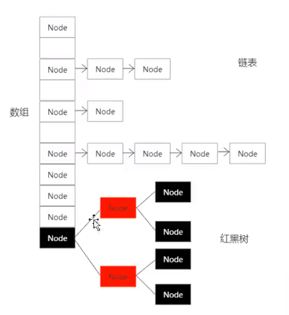
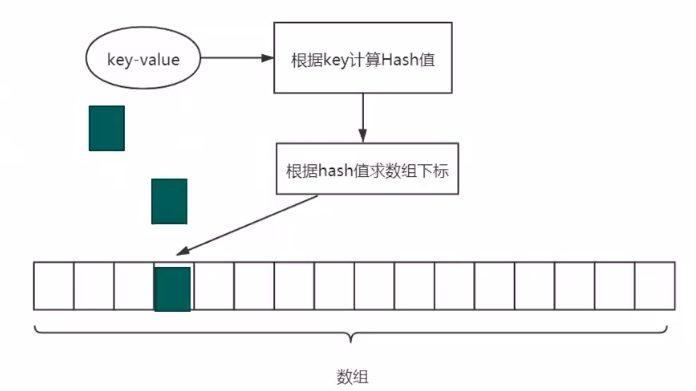
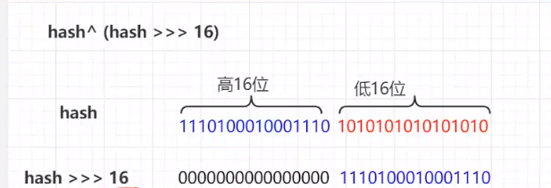
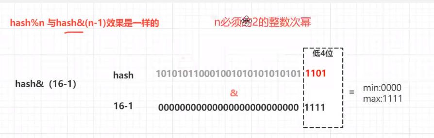

# HashMap


<!--more-->



数据结构：数组+链表+红黑树（JDK8）

算法：

- Hash算法
- 数组定位
- Hash冲突
- 扩容
- 多线程安全

# 1、JDK8为什么加入了红黑树？

- 单纯为了效率？

- HashMap导致Dos?

  - 线程安全的场景下

  - CVE-2011-4859

  - Tomcat邮件组的讨论    max

    黑客构造W+的Hash值相等的键key来构造请求参数，那么就造成了Hash冲突，会构成一个W+的链表，而链表的查询效率是十分低的，占用大量的CPU时间，无法响应用户请求。

    ```java
    		Map<String,String> hashMap=new HashMap<String, String>();
            List<String> list= Arrays.asList("Aa","BB","C#");
            for(String string:list){
                System.out.println(string.hashCode());
                hashMap.put(string,string);
            }
            Iterator<String> iterator = hashMap.keySet().iterator();
            while (iterator.hasNext()) {
                System.out.println(iterator.next());
            }
    ```

    ```
    2112
    2112
    2112
    Aa
    BB
    C#
    ```

- 为什么是红黑树？

  红黑树、二叉树、二叉排序树、平衡二叉树，而平衡二叉树的查询效率最高；

  构建平衡二叉树十分消耗性能，涉及二叉树旋转平衡，所以采用折中的方案：红黑树中只有有一个原则：max<=2*min;

# 2、HashMap出现Dos，表现形式：CPU 100%，怎么解决？

JVM的性能排查，jstack,top,jmap,arthas《JVM性能调优》

# 3、Hash Map中的算法



## Hash算法的流程

```java
static final int hash(Object key) {
        int h;
        return key == null ? 0 : (h = key.hashCode()) ^ h >>> 16;
    }

public native int hashCode();
```




