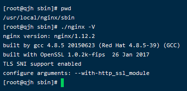

# Https配置


<!--more-->

## 第一步：Nginx的ssl模块安装

在配置ssl证书之前，要确保你的nginx已经安装了ssl模块，一般情况下自己安装的nginx都是不存在ssl模块的。

这里先检查下自己是否存在ssl模块：

进入到你的nginx安装目录下面，我的目录是在（**/usr/local/nginx**），如果你的nginx安装步骤和上面的文章一致的话，那你的目录和我应该是一致的

进入到目录的sbin目录下，输入

```shell
#注意这里是大写的V，小写的只显示版本号
./nginx -V  
```



如果出现 (configure arguments: --with-http_ssl_module), 则已安装（下面的步骤可以跳过，直接进行**第二步**）。

一般情况下都是不存在ssl模块的，接下来进入到你的解压缩后的nginx目录，注意这里不是nginx安装目录，是解压缩后的目录，我的是在（/root/nginx），进入目录后，输入

```bash
./configure --prefix=/usr/local/nginx --with-http_stub_status_module --with-http_ssl_module
```

接下来执行

```bash
make
#切记不要执行make install，否则会重新安装nginx
```

上述操作执行完成以后，你的目录下会出现objs文件夹，文件夹内存在nginx文件，如图：


接下来使用新的nginx文件替换掉之前安装目录sbin下的nginx，注意这里的替换的时候可以先将之前的文件备份下，停掉nginx服务

```bash
./nginx -s stop #停止nginx服务

#替换之前的nginx
cp /root/nginx/objs/nginx /usr/local/nginx/sbin
```

成功之后，进入到nginx安装目录下，查看ssl时候成功

```bash
#注意这里是大写的V，小写的只显示版本号
./nginx -V  
#可以看到这里出现了configure arguments: --with-http_ssl_module   证明已经安装成功
```


提示：这里替换后在执行 -V命令如果提示权限不足，先给这个nginx文件提升下权限


我是用的是finalshell连接工具，直接右键就可以修改权限了，当然，也可以通过指令修改，如下：

```bash
chmod 111 nginx
```

## 第二步：配置ssl证书

解压缩下载好的证书（证书一般是pem文件和key文件，这里名字可以随便改）

将下载好的证书上上传到服务器，我将证书放在了root目录下的card文件夹

```bash
#在root目录下创建card文件夹
cd /root
mkdir card
```


## 第三步：进行nginx.conf配置

进入nginx.conf文件下

```bash
cd /usr/locla/nginx/conf
#修改nginx.conf文件
vim nginx.conf
```

打开之后文件内容如图


可以将没用的东西都删除掉，删除的时候注意，括号要对应起来。

然后进行配置，输入：

```bash

user  nginx;
worker_processes  1;

error_log  /var/log/nginx/error.log warn;
pid        /var/run/nginx.pid;


events {
    worker_connections  1024;
}


http {
    include       /etc/nginx/mime.types;
    default_type  application/octet-stream;

    log_format  main  '$remote_addr - $remote_user [$time_local] "$request" '
                      '$status $body_bytes_sent "$http_referer" '
                      '"$http_user_agent" "$http_x_forwarded_for"';

    access_log  /var/log/nginx/access.log  main;

    sendfile        on;
    #tcp_nopush     on;

    keepalive_timeout  65;

    #gzip  on;

    include /etc/nginx/conf.d/*.conf;


server {
  #监听443端口
    listen 443 ssl;
    #你的域名
    server_name wchat.eccentric.top; 
    
    #ssl证书的pem文件路径
    ssl_certificate  /etc/nginx/cart/5663981_wchat.eccentric.top.pem;
    #ssl证书的key文件路径
    ssl_certificate_key /etc/nginx/cart/5663981_wchat.eccentric.top.key;
    location / {
     proxy_pass  http://120.77.216.116:9981;
    }
}

server {
    listen 80;
    server_name wchat.eccentric.top;
    #将请求转成https
    rewrite ^(.*)$ https://$host$1 permanent;
}

}
```

> 注意：这里需要在安全组中开放443端口。

## 第四步：重启nginx

ok，如果上述步骤都完成了，没有问题，接下来只需要重启nginx服务即可。

进入sbin目录下，输入

```bash
./nginx -s reload
./nginx -s stop
./nginx 
```


ps：

1. docker安装nginx配置反向代理，一定要映射80和443端口；
2. 服务器安全组开放80和443端口；
3. docker或者nginx配置完要重启

