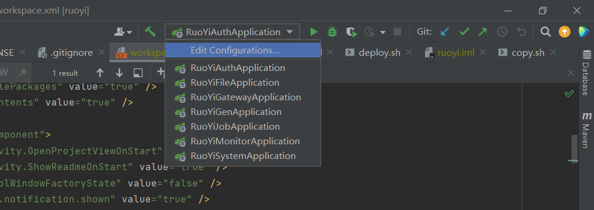
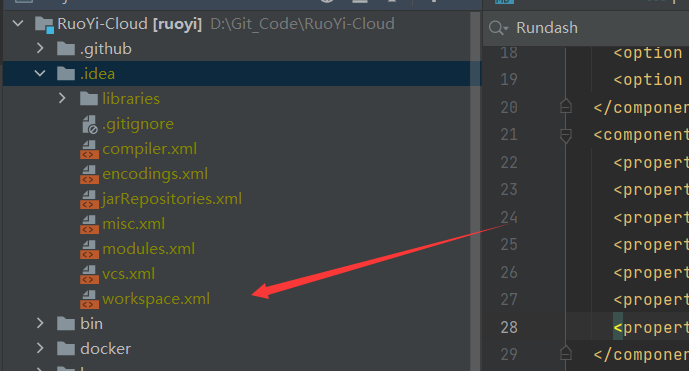
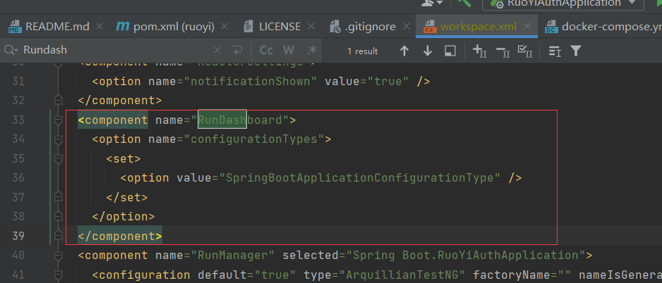
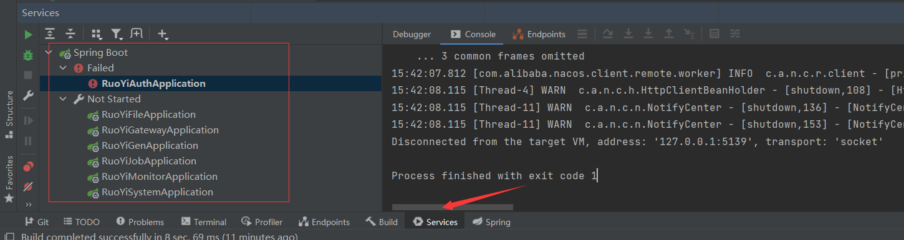

# Idea批量运行微服务项目


<!--more-->

### 问题：idea微服务项目启动spring boot项目需要多次启动



如果微服务过多，启动的时候会点击多次，而且一旦某一个服务启动失败，无法看到启动失败的项目，在开发阶段增加开发人员的工作量；那么有没有一键启动所有项目的工具呢？

### 解决方案

IDEA本身就支持多项目一键启动，那么如何实现

#### 1、在.idea文件夹下找到workspace.[xml](https://so.csdn.net/so/search?q=xml&spm=1001.2101.3001.7020)文件



#### 2、在project标签添加配置

```xml
  <component name="RunDashboard">
    <option name="configurationTypes">
      <set>
        <option value="SpringBootApplicationConfigurationType" />
      </set>
    </option>
  </component>
```

注意是在project标签内部：



#### 3、批量启动项目



第一次启动可能会看不到这个界面，此时只需要随意启动一个spring boot服务，这个界面就出来了，下次启动项目就可以实现批量重启，并且可以看到启动失败的项目，快速定位问题
