# ipv6网络使用

<!--more-->

互联网协议（Internet Protocol，IP）是一个负责在网络上传输数据包的协议。从其第一个版本发布以来，IP 已经经历了多个版本的发展。当前最常用的两个版本是 IPv4 和 IPv6。

## IPv4

IPv4是Internet Protocol version 4的缩写，中文翻译为互联网通信协议第四版，通常简称为网际协议版本4。

IPv4使用32位（4字节）地址，因此地址空间中只有 4,294,967,296（即2^32） 个地址。

IPv4地址可被写作任何表示一个32位整数值的形式，但为了方便人类阅读和分析，它通常被写作点分十进制的形式，即四个字节被分开用十进制写出，中间用点分隔。

**通常IPv4地址的地址格式为 nnn.nnn.nnn.nnn，就像下面这样：**

`172.16.254.1`

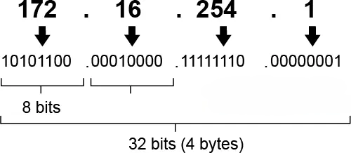

## IPv6

IPv6是Internet Protocol version 6的缩写，中文翻译为互联网通信协议（TCP/IP协议）第6版，通常简称为网际协议版6。IPv6具有比IPv4大得多的编码地址空间，用它来取代IPv4主要是为了解决IPv4地址枯竭问题，同时它也在其他方面对于IPv4有许多改进。

其实，IPv6并不是新技术，从IPv6最早的工作组成立1992年到现在，已过去27年。在互联网技术的发展历程中，IPv6年龄甚至有些太大了。

IPv6的“6”表示的是TCP/IP协议的第六个版本，IPv4的“4”表示的是TCP/IP协议的第四个版本。其实除了这两个版本，当然还有其它版本，TCP/IP协议其实从IPv1开始，到现在IPv10都已经出现了，这些不同版本之间并没有关联，也不是简单IP地址长度的长短。

IPv6地址由八组、每组四位16进制数字组成，每组之间由"："来分隔。

**看个简单的例子：**

> 2610:00f8:0c34:67f9:0200:83ff:fe94:4c36，每个“：”前后都是4位16进制的数字，共分隔成8组。

**如下图所示：**

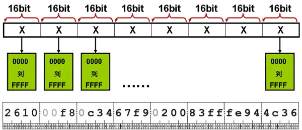

**小知识：**如何查看手机或者电脑的网络是否支持IPv6呢？

可以在你手机或者电脑上的浏览器中打开：[Ipv6-test.com](https://link.juejin.cn/?target=http%3A%2F%2Fwww.52im.net%2FIpv6-test.com)，就像下图这样：

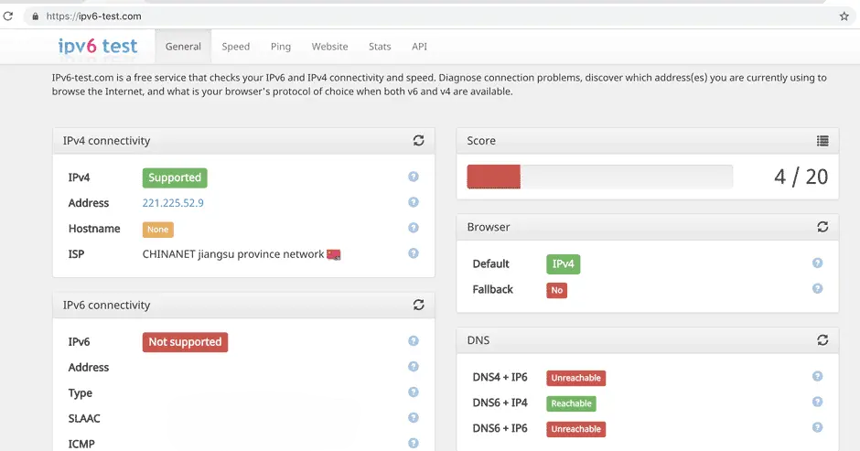

### 为什么要使用IPv6？

最主要的原因，就是地址数量不够用了。

IPv4迄今为止已经使用了30多年。最早期的时候，互联网只是设计给美国军方用的，根本没有考虑到它会变得如此庞大，成为全球网络。

尤其是进入21世纪后，随着计算机和智能手机的迅速普及，互联网开始爆发性发展，越来越多的上网设备出现，越来越多的人开始连接互联网。这就意味着，需要越来越多的IP地址。

IPv4的地址总数是2的32次方，也就是约42.9亿个。而全球的网民总数早已超过这个数目。

所以说，IPv4地址池接近枯竭，根本无法满足互联网发展的需要。人们迫切需要更高版本的IP协议，更大数量的IP地址池。（有点像固定电话号码升位。）

### IPv6会带给我们什么？

首先，最重要的一点，就是前面所说的地址池扩容。IPv4的地址池是约42.9亿，IPv6能达到多少呢？

**数量如下：**

> 340282366920938463463374607431768211456个…

不用数了，太多了… 简单说，是2的128次方。

| 协议类型 | 数量  |
| -------- | ----- |
| IPV4     | 2^32  |
| IPV6     | 2^128 |

这个数量，即使是给地球上每一颗沙子都分配一个IP，也是妥妥够用的。

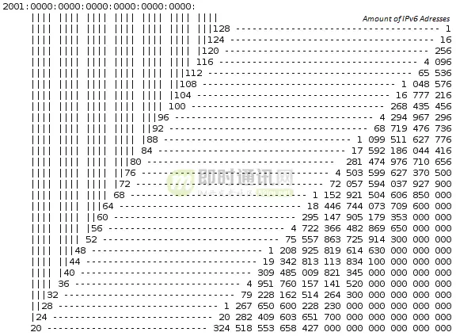

这个数量值是怎么得来的呢？还是它的地址位长决定的。

如果以二进制来写，IPv6的地址是128位。不过，这样写显然不太方便（一行都写不下）。所以，通常用十六进制来写，也就缩短成32位（32位会分为8组，每组4位）。

**下面就是一个标准、合法的IPv6地址示例：**

> 2001:0db8:85a3:08d3:1319:8a2e:0370:7344

**注意：**IPv6的地址是可以简写的，每项数字前导的0可以省略。

**例如，下面这个地址：**

> 2001:0DB8:02de:0000:0000:0000:0000:0e13

**粉红的“0”就可以省略，变成：**

> 2001: DB8:2de:0:0:0:0:e13

**如果有一组或连续几组都是0，那么可以简写成“::”，也就是：**

> 2001: DB8:2de::e13

**注意：**一个IPv6地址，只能有一个“::”。

**为什么？很简单，你看下面这四个地址，如果所有0全都缩写，会变成什么样？**

> 2001:0000:0000:0000:0000:25de:0000:cade
>
> 2001: 0000: 0000:0000:25de:0000:0000:cade
>
> 2001: 0000: 0000:25de:0000:0000:0000:cade
>
> 2001: 0000: 25de:0000:0000:0000:0000:cade

是的，都是2001::25de::cade，冲突了。所以，这个地址是非法的，不允许存在的。

关于IPv6还有很多技术细节，因篇幅原因，不再赘述。

**除了地址数量之外，IPv6还有很多优点，例如：**

> 1）IPv6使用更小的路由表。使得路由器转发数据包的速度更快；
>
> 2）IPv6增加了增强的组播支持以及对流的控制，对多媒体应用很有利，对服务质量（QoS）控制也很有利；
>
> 3）IPv6加入了对自动配置的支持。这是对DHCP协议的改进和扩展，使得网络（尤其是局域网）的管理更加方便和快捷；
>
> 4）IPv6具有更高的安全性。用户可以对网络层的数据进行加密并对IP报文进行校验，极大地增强了网络的安全性；
>
> 5）IPv6具有更好的扩容能力。如果新的技术或应用需要时，IPV6允许协议进行扩充；
>
> 6）IPv6具有更好的头部格式。IPV6使用新的头部格式，就简化和加速了路由选择过程，提高了效率；
>
> ……

### IPv6的优点这么多，为什么之前普及却这么慢？

IPv6优点这么多，为什么它问世已经20年了，还是没有完全替代IPv4呢？这里面的水就很深了。。。说白了，主要还是和利益有关。

#### NAT这类技术，让IPv4得以续命

如果按照本世纪初专家们的预测，我们IPv4的地址早已枯竭几万次了。但是，一直挺到现在，大家仍然还在用IPv4，对老百姓来说，并没有因为地址不够而无法上网。

这是为什么呢？ 就是因为除了IPv6之外，我们还有一些技术，可以变相地缓解地址不足。

例如NAT（Network Address Translation，网络地址转换）。

NAT是什么意思？当我们在家里或公司上网时，你的电脑肯定有一个类似192.168.0.1的地址，这种地址属于私网地址，不属于公共的互联网地址。

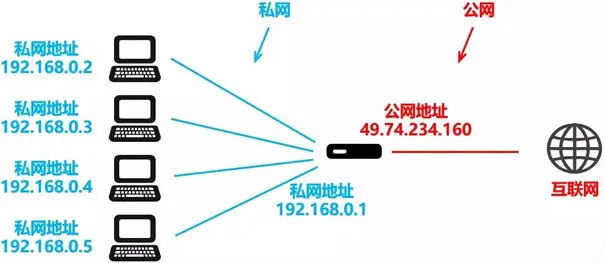

每一个小的局域网，都会使用一个网段的私网地址，在与外界连接时，再变换成公网地址。这样一来，几十个或几百个电脑，都只需要一个公网地址。

甚至还可以私网套私网，NAT套NAT，一层一层套。这样一来，大大节约了公网IP地址数量。正因为如此，才让我们“续命”到了今天，不至于无法上网。

但是，NAT这种方式也有很多缺点，虽然私网地址访问互联网地址方便，但互联网地址访问私网地址就困难了。很多服务，都会受到限制，你只能通过复杂的设置才能解决，也会影响网络的处理效率。

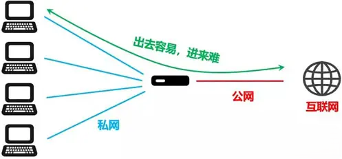

#### 升级IPv6涉及运营商的利益

物以稀为贵，地址越稀缺，就越值钱。掌握地址的人，就越开心。谁开心？运营商和ISP（互联网服务提供商）。

他们就像是经销商，从上游（互联网域名与号码分配机构，即ICANN）申请到IP地址，再卖给下游用户。稀缺没关系，反正，他一定能赚取更多的差价。

如果大家去找运营商或ISP买带宽，或者租赁云服务，带公共地址的，一定比不带公共地址的贵很多很多。

除了地址可以赚钱之外，如果升级支持IPv6，对运营商和ISP来说，也意味着很大的资金投入。现在新设备基本都是支持的，但毕竟还是有一些老设备，如果在使用寿命到期之前就换，就是亏钱。

所以，运营商和ISP都没有动力去启用IPv6。

至于设备商或手机电脑厂商，出于提前考虑，早已普遍支持了IPv6，意见并不是很大，也决定不了什么。必竟，提供基础设施服务的运营商们更强势。

## 如何访问ipv6

### 路由器配置ipv6

各家路由器配置不一样，请参照具体设置

核心是开启上层设备的ipv6

需要关闭路由器防火墙

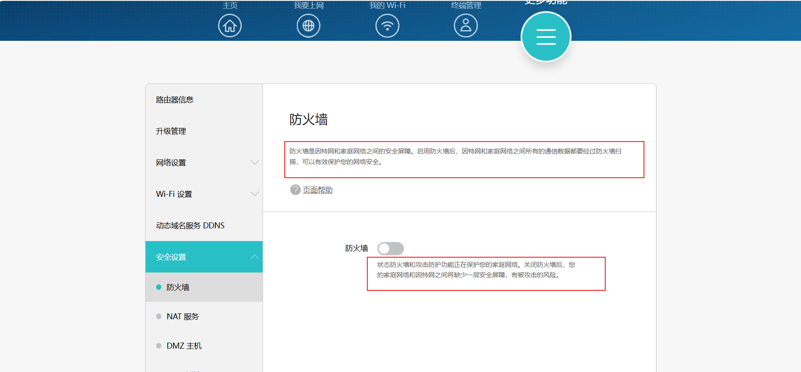

### 电脑配置ipv6

1. 插入网线，并在电脑端开启IPv6协议

（1）打开网络和internet设置

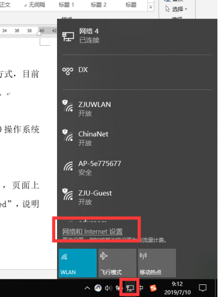

（2） 点击以太网——更改适配器选项

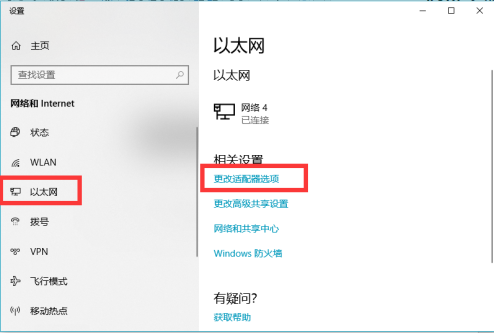

（3） 右键点击本地连接——属性

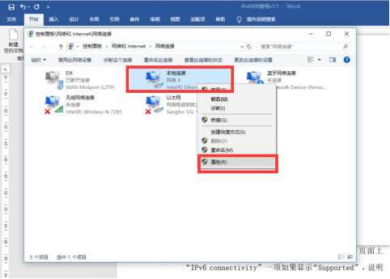

（4） 勾选Internet协议版本6（TCP/IPv6）,如果没有该选项则表明本设备不支持IPv6协议

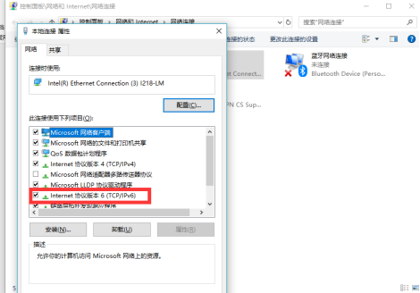

（5） 双击Internet协议版本6（TCP/IPv6），进入配置界面，选择自动获取IPv6地址和自动获得DNS服务器地址

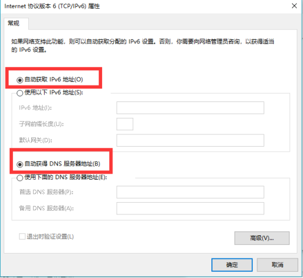

经以上配置，cmd的ipconfig中有ipv6地址和临时ipv6地址，可以通过命令关闭临时ipv6地址

`netsh interface ipv6 set privacy state=disable`

若想开启：

`netsh interface ipv6 set privacy state=enable`

### 测试

##### 电脑测试test-ipv6.com

http://test-ipv6.com/

##### 手机流量ping电脑ipv6

如果ping不通，尝试

- 手机只用流量去ping
- 光猫防火墙开放ipv6
- 电脑系统防火墙开放ipv6

如果都不行，需要开启telnet修改光猫

### 外部访问

以某个服务为例

`http://[240e:30e8:30e8:30e8:30e8:30e8:30e8:1569]:8080/doc.html`

URL需用方括号包裹地址（如`https://[::1]`）‌

