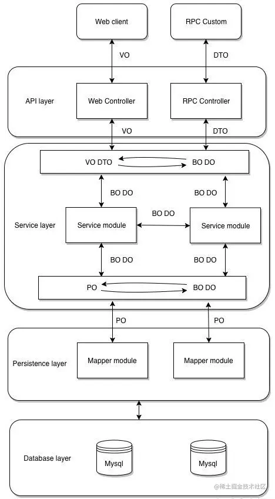

# 【Java】一图看懂Java中的PO,BO,VO,DTO,POJO,DAO,DO

<!--more-->

### PO（Persistant Object - 持久化对象）

> 该概念随着ORM产生，可以看成是与数据库中的表相映射的Java对象。通常就是对应数据库中某个表中的一条记录。PO仅仅用于表示数据，没有任何数据操作。通常遵守Java Bean的规范，拥有 getter/setter方法。

- **PO的生命周期**：是向数据库中添加新数据时创建，删除数据库中数据时削除的。并且它只能存活在一个数据库连接中，断开连接即被销毁。

- **PO的作用**：可以把数据表中一条记录作为一个对象处理，可以方便的转为其它对象。PO是有状态的，每个属性代表其当前的状态。使用它，可以使我们的程序与物理数据解耦，并且可以简化对象数据与物理数据之间的转换。

- PO的特点

  ：

  - PO的属性是跟数据库表的字段一一对应的
  - PO对象需要实现序列化接口
  - 一个POJO持久化后就是PO

### BO（Business Object - 业务对象）

> BO用于表示一个业务对象，它包括了业务逻辑，常常封装了对DAO和RPC等的调用，可以进行PO与VO/DTO之间的转换。
>
> BO通常位于业务层，要区别于直接对外提供服务的服务层：BO提供了基本业务单元的基本业务操作，在设计上属于被服务层业务流程调用的对象，一个业务流程可能需要调用多个BO来完成。

### DO（Domain Object - 领域对象）

> 领域对象就是从现实世界中抽象出来的有形或无形的业务实体。通常位于业务层中。

### VO（Value Object/View Object - 值对象/视图对象）

> Value Object，值对象，也称为业务对象，是存活在业务层的，是业务逻辑使用的，它存活的目的就是为数据提供一个生存的地方（实际上跟DO有点类似）。
>
> VO的属性是根据当前业务的不同而不同的，也就是说，它的每一个属性都一一对应当前业务逻辑所需要的数据的名称。
>
> VO通常用于业务层之间的数据传递，其仅仅包含数据。但应是抽象出的业务对象。根据业务的需要，其可以和表对应或者不。用new关键字创建，由GC进行回收。

------

> View Object，视图对象，用于展示层，它的作用是把某个指定页面（或组件）的所有数据封装起来，对应整个界面的值

### DTO（Data Transfer Object - 数据传输对象）

> DTO概念来源于J2EE的设计模式，原来的目的是为了EJB的分布式应用提供粗粒度的数据实体，以减少分布式调用的次数，从而提高分布式调用的性能和降低网络负载。
>
> DTO用于表示一个数据传输对象，通常用于不同服务或服务不同分层之间的数据传输。
>
> DTO与VO与类似，但也有一些不同，这个不同主要是设计理念上的，比如API服务需要使用的是DTO，而用于展示层页面的使用的是VO。例如，为了展示方便，在VO的性别字段存的是男和女，而在DTO中存的是1或者2这样的代码。

### DAO（Data Access Object - 数据访问对象）

> DAO是SUN公司的一个标准J2EE设计模式，这个模式中有个接口就是 DAO，负责持久层的操作并为业务层提供接口。此对象用于访问数据库。通常和PO结合使用。
>
> DAO中包含了各种数据库的操作方法。通过它的方法结合PO对数据库进行CRUD的操作。

### POJO（Plain Ordinary Java Object - 简单无规则Java对象）

> POJO表示一个简单Java对象。PO、VO、DTO都是典型的POJO。
