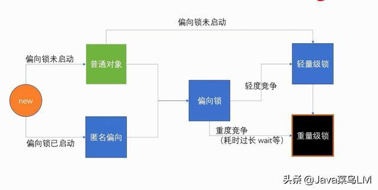

# Java并发

<!--more-->

## Java如何开启线程？怎么保证线程安全？

线程与进程的区别：进程是操作系统进行资源分配的最小单元，线程是操作系统进行任务分配的最小单元，线程隶属于进程。

如何开启线程？

1. **基础Thread类**，重写run方法(start方法开启线程内部调用run、如果直接调用run就是方法的调用，不会开启线程)
2. **实现Runable接口**，实现run方法()
3. 实现Callable接口，实现call方法，通过FutureTask创建一个线程，获取到线程的返回结果，
4. 通过线程池开启线程

如何保证线程安全？（多个线程对同一个资源进行操作）加锁

1. JVM提供的锁，也就是Synchronized关键字，
2. JDK提供的各种锁LOCK

### Volatile与Synchronized有什么区别？Volatile能不能保证线程安全？DCL（Double Check Lock）单例为什么要加Volatile？

DCL:

1. Synchronized关键字用来加锁，Volatile只是保持变量的线程可见性，通常适用于一个线程写，多个线程读的场景
2. 不能。Volatile只能保证线程可见性，不能保证原子性，
3. Volatile防止指令重排（Integer i=8 1、分配内存，2、对象初始化、3、建立指针）防止高并发状态下，指令重排造成线程安全问题。

### java线程锁机制是怎样的，偏向锁、轻量级锁、重量级锁有什么区别？锁机制是如何升级的？

1. Java的锁机制就是在对象的Markword中记录一个锁的状态，偏向锁、轻量级锁、重量级锁对应不同的锁标志位状态
2. Java的锁机制就是根据资源竞争的激烈程度不断进行锁升级的过程。
3. 

### 谈谈你对AQS的理解，AQS如何实现可重入锁？

AQS（AbstractQueueSynchronizer）是一个Java线程同步的框架，是JDK中许多锁工具的核心实现框架。

在AQS中，维护了一个信号量state和一个线程组成的双向链表队列，其中，这个线程队列是用来给线程排队的，state就是一个信号量，用来控制线程排队或者放行的。在不同的场景下有不同的定义 。

在可重入锁这个场景下，state就用来表示加锁的次数，0表示无锁，每加一次锁，state+1，释放锁-1

