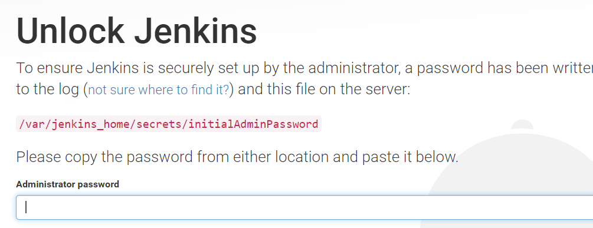
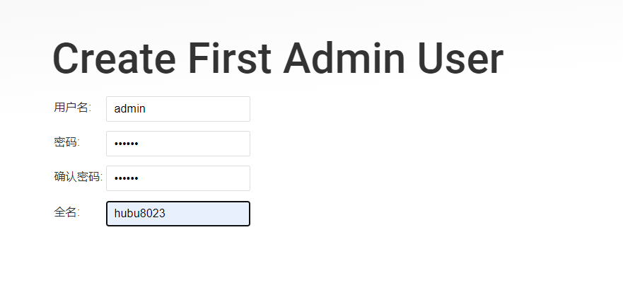

# jenkins安装


# 安装Jenkins

预先安装docker、docker-compose环境

拉取Jenkins镜像，运行容器：

```shell
docker run --name myjenkins -p 9980:8080 -p 50000:50000 -v /var/jenkins_home jenkins：2.60.3
```

映射端口为本地9980映射内部8080端口，50000映射50000端口。

学习Jenkins的DockerFile：

```shell
FROM openjdk:8-jdk

RUN apt-get update && apt-get install -y git curl && rm -rf /var/lib/apt/lists/*

ARG user=jenkins
ARG group=jenkins
ARG uid=1000
ARG gid=1000
ARG http_port=8080
ARG agent_port=50000

ENV JENKINS_HOME /var/jenkins_home
ENV JENKINS_SLAVE_AGENT_PORT ${agent_port}

# Jenkins is run with user `jenkins`, uid = 1000
# If you bind mount a volume from the host or a data container, 
# ensure you use the same uid
RUN groupadd -g ${gid} ${group} \
    && useradd -d "$JENKINS_HOME" -u ${uid} -g ${gid} -m -s /bin/bash ${user}

# Jenkins home directory is a volume, so configuration and build history 
# can be persisted and survive image upgrades
VOLUME /var/jenkins_home

# `/usr/share/jenkins/ref/` contains all reference configuration we want 
# to set on a fresh new installation. Use it to bundle additional plugins 
# or config file with your custom jenkins Docker image.
RUN mkdir -p /usr/share/jenkins/ref/init.groovy.d

ENV TINI_VERSION 0.14.0
ENV TINI_SHA 6c41ec7d33e857d4779f14d9c74924cab0c7973485d2972419a3b7c7620ff5fd

# Use tini as subreaper in Docker container to adopt zombie processes 
RUN curl -fsSL https://github.com/krallin/tini/releases/download/v${TINI_VERSION}/tini-static-amd64 -o /bin/tini && chmod +x /bin/tini \
  && echo "$TINI_SHA  /bin/tini" | sha256sum -c -

COPY init.groovy /usr/share/jenkins/ref/init.groovy.d/tcp-slave-agent-port.groovy

# jenkins version being bundled in this docker image
ARG JENKINS_VERSION
ENV JENKINS_VERSION ${JENKINS_VERSION:-2.60.3}

# jenkins.war checksum, download will be validated using it
ARG JENKINS_SHA=2d71b8f87c8417f9303a73d52901a59678ee6c0eefcf7325efed6035ff39372a

# Can be used to customize where jenkins.war get downloaded from
ARG JENKINS_URL=https://repo.jenkins-ci.org/public/org/jenkins-ci/main/jenkins-war/${JENKINS_VERSION}/jenkins-war-${JENKINS_VERSION}.war

# could use ADD but this one does not check Last-Modified header neither does it allow to control checksum 
# see https://github.com/docker/docker/issues/8331
RUN curl -fsSL ${JENKINS_URL} -o /usr/share/jenkins/jenkins.war \
  && echo "${JENKINS_SHA}  /usr/share/jenkins/jenkins.war" | sha256sum -c -

ENV JENKINS_UC https://updates.jenkins.io
ENV JENKINS_UC_EXPERIMENTAL=https://updates.jenkins.io/experimental
RUN chown -R ${user} "$JENKINS_HOME" /usr/share/jenkins/ref

# for main web interface:
EXPOSE ${http_port}

# will be used by attached slave agents:
EXPOSE ${agent_port}

ENV COPY_REFERENCE_FILE_LOG $JENKINS_HOME/copy_reference_file.log

USER ${user}

COPY jenkins-support /usr/local/bin/jenkins-support
COPY jenkins.sh /usr/local/bin/jenkins.sh
ENTRYPOINT ["/bin/tini", "--", "/usr/local/bin/jenkins.sh"]

# from a derived Dockerfile, can use `RUN plugins.sh active.txt` to setup /usr/share/jenkins/ref/plugins from a support bundle
COPY plugins.sh /usr/local/bin/plugins.sh
COPY install-plugins.sh /usr/local/bin/install-plugins.sh
```


## 初始化

初始化过程中会提示出密码：

```shell
*************************************************************
*************************************************************
*************************************************************

Jenkins initial setup is required. An admin user has been created and a password generated.
Please use the following password to proceed to installation:

a8e55644a46a468497388c8f771e9923

This may also be found at: /var/jenkins_home/secrets/initialAdminPassword
```

如果-d后台运行，那么前台不会出现日志，此时，密码会记录再日志中，访问Jenkins：localhost:9980，发现密码提示：



```shell
C:\Users\26505>docker exec -it myjenkins /bin/bash
jenkins@22ef3b5b9610:/$ cat /var/jenkins_home/secrets/initialAdminPassword
a8e55644a46a468497388c8f771e9923
```

然后输入密码，进入配置：下载插件过程中不下载任何插件，进入配置超级管理员用户密码：



http://updates.jenkins-ci.org/update-center.json

