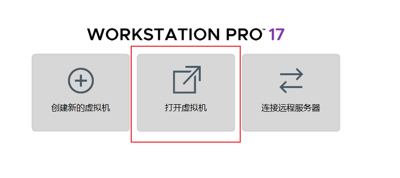

# Kali简介与安装


<!--more-->

## Kali简介

[kali官网](https://www.kali.org/_)

Kali是一个Linux操作系统，系统中包含了很多实用渗透和审计工具，大多数做安全测试的开源工具都被囊括在内。

### 安装平台


### 镜像下载


在Windows安装虚拟机并在虚拟机安装kali

[Kali inside VMware (Guest VM) | Kali Linux Documentation](https://www.kali.org/docs/virtualization/install-vmware-guest-vm/)

### 工具文档

[Kali Tools | Kali Linux Tools](https://www.kali.org/tools/)

### 官方论坛

[Kali Linux Forum](https://forums.kali.org/)

## VMware Workstation

VMware Workstation简称VM，是一款功能强大的桌面虚拟计算机软件，提供用户可在单一的桌面上同时运行不同的操作系统，和进行开发、测试、部署新的应用程序的最佳解决方案.

https://www.vmware.com/

‌**Workstation Pro**‌：需购买商业许可证，适用于企业开发、测试及多系统部署场景.

**VMware Workstation (Player)**： 个人用户可免费使用非商业版本，适合学习或简单应用场景.

ZF3R0-FHED2-M80TY-8QYGC-NPKYF

YF390-0HF8P-M81RQ-2DXQE-M2UT6

ZF71R-DMX85-08DQY-8YMNC-PPHV8

### 安装kali

打开官网已经配置好的虚拟机文件:xxxxxx.vmx



### 汉化

1、打开终端输入命令：

```sh
sudo dpkg-reconfigure locales
```

2、在弹出的对话框选择中文


### 切换桌面

Kali中提供了2个版本的桌面，分别是Xfce和GNOME，Xfce是默认的桌面，如果不喜欢可以切换到Gnome桌面

`apt install kali-desktop-gnome`

中国开源：

`deb http://mirrors.ustc.edu.cn/kali kali-rolling main non-free contrib`

官方源：

`deb http://http.kali.org/kali kali-rolling main non-free contrib`

`
deb-src http://http.kali.org/kali kali-rolling main non-free contrib`
