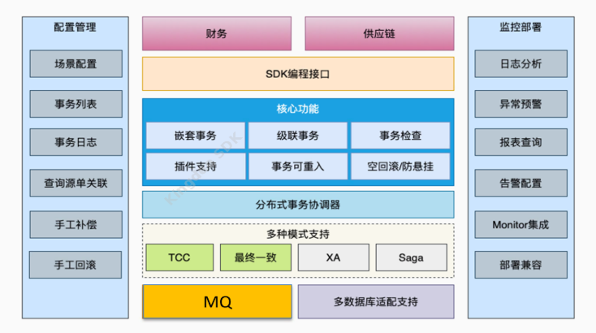

# kd-分布式事务


## 1. 简介

### 1.1 什么是分布式事务

  分布式事务就是指事务的参与者、支持事务的服务器、资源服务器以及事务管理器分别位于不同的分布式系统的不同节点之上。通俗的说就是某个操作中的事务跨了多个库，或者是跨了多个服务节点而产生了分布式事务，所以一般来讲就是分库分表或者微服务化导致了分布式事务的产生。而本地事务的所有操作都是在某一个库中进行。

### 1.2 CAP定理，Base理论

CAP 原则又称 CAP 定理，指的是分布式系统的几个特性:

- **一致性（Consistency）**
  在分布式系统中的所有数据备份，在同一时刻是否同样的值。（等同于所有节点访问同一份最新的数据副本）
- **可用性（Availability）**
  在集群中一部分节点故障后，集群整体是否还能响应客户端的读写请求。（对数据更新具备高可用性）
- **分区容错性（Partition tolerance）** -
  大多数分布式系统都分布在多个子网络。每个子网络就叫做一个区（partition）。 分区容错的意思是，区间通信可能失败。比如，一台服务器放在中国，另一台服务 器放在美国，这就是两个区，它们之间可能无法通信。

**CAP 原则指的是**，这三个要素最多只能同时实现两点，不可能三者兼顾。

**Base理论**是对 CAP 理论的延伸，思想是即使无法做到强一致性（CAP 的一致性就是强一致性），但可以采用适当的采取弱一致性，即最终一致性。

- **基本可用（Basically Available）**
  基本可用是指分布式系统在出现故障的时候，允许损失部分可用性（例如响应时间、 功能上的可用性），允许损失部分可用性。需要注意的是，基本可用绝不等价于系统不可用。响应时间上的损失：正常情况下搜索引擎需要在 0.5 秒之内返回给用户相应的 查询结果，但由于出现故障（比如系统部分机房发生断电或断网故障），查询 结果的响应时间增加到了 1~2 秒。功能上的损失：购物网站在购物高峰（如双十一）时，为了保护系统的稳定性， 部分消费者可能会被引导到一个降级页面。
- **软性状态（ Soft State）**
  是指允许系统中的数据存在中间状态，并认为该中间状态的存在不会影响系统的整体可用性，即允许系统不同节点的数据副本之间进行数据同步的过程存在延时。
- **最终一致性（ Eventual Consistency）**
  同一数据的不同副本的状态，可以不需要实时一致，但一定要保证经过一定时间后仍然是一致的。

  BASE理论是对CAP中的一致性和可用性进行一个权衡的结果，理论的核心思想就是：我们无法做到强一致，但每个应用都可以根据自身的业务特点，采用适当的方式来使系统达到最终一致性（Eventual consistency）。

### 1.3 分布式事务的几种解决方案

基于CAP定理和Base理论，目前常用的解决方案有以下几种:

- **两阶段提交/XA方案**
- **TCC方案**
- **三阶段提交方案**
- **本地消息表**
- **可靠消息最终一致**
- **最大努力通知**

目前流行的分布式事务框架Seata,LCN,Saga等。

### 1.4 苍穹分布式事务KDTX的特点

- **弱一致**
  最终一致模式实现数据弱一致性，适合苍穹里大部分的分布式事务场景
- **强一致**
  TCC模式实现数据强一致性，解决某些对数据一致性很高的场景需求
- **很简单**
  使用最终一致模式，现有的业务代码改造量很小，非常容易上手
- **高性能**
  接入了KDTX之后保证了数据一致性的同时，原有的业务TPS几乎不变
- **可监控**
  当出现数据不一致时系统会马上介入并告警，并提供监控

## 2. KDTX详细介绍

苍穹平台提供的分布式事务解决方案,简称KDTX(（Kingdee Distributed Transaction）。

### 2.1 KDTX产生背景

- **应用内跨库调用**
- **跨应用调用**
- **应用内跨事务调用**

### 2.2 系统架构图



### 2.3 支持的模式

#### 2.3.1 最终一致模式

  最终一致模式可以保证跨数据库或跨节点更新时的数据一致。它会以1个更新操作为基准，注册多个其它更新操作，最终保证所有更新都成功，实现分布式事务的弱一致性。最终一致模式非常适合这样的场景： 对本身的业务做更新，同时还要更新外部系统的数据，而这些外部更新稍微晚点完成也可以接受，但最终必须要都能成功。**苍穹里的大部分分布式事务场景应该优先考虑使用最终一致。最终一致模式内部使用MQ或者微服务调用实现事务协调，默认使用MQ。使用微服务调用时，也可以设置使用同步或者异步模式。使用MQ模式或者微服务模式，性能会更佳。**

**使用限制**：(有以下情况不建议使用)

**1**.如果出现异常，有一些更新的数据要回滚，而不是让系统重试直到成功；

**2**.不能接受异步执行，所有逻辑必须同步完成，实时等待执行结果。

- **正常提交流程:**

在第一次调用register注册最终一致服务的时候，会开启一个新的分布式事务，创建全局唯一的xid所有通过register注册的信息暂时不会执行，而是先记录到本地数据库的表中t_dtx_local_tx_log如果一切顺利，本地事务成功提交，会自动触发提交分布式事务到事务协调器事务协调器收到提交后，会根据register的调用顺序逐个执行最终一致服务，直到全部完成。如果本地事务回滚了，会怎么处理？

- **回滚流程:**


当本地事务事务被回滚时，由于register的信息没有真正执行，所以相当于什么都没做，数据是一致。同时，如果已经开启是分布式事务，则会通知协调器回滚。如果在执行过程中，任何一个环节出现问题，包括宕机、程序bug、网络异常、数据库访问超时等情况，KDTX是怎么保证数据最终还是一致的？可以阅读**手动事务补偿**部分。使用最终一致模式之前，需要在业务数据库中创建本地事务表。

#### 2.3.2 TCC模式

TCC通过两阶段提交来保证分布式环境下的数据强一致:

**第一阶段** : TRY锁定/预留资源;

**第二阶段** :COMFIRM/CANCEL提交或回滚资源。

**适用场景** :

  TCC最大的特点是提供“后悔”的能力。最终一致模式在数据不一致时会尝试重试，让流程接着往下走，直到最后都成功。假设有个分布式事务的场景，其中一个环节是扣减库存，当库存为0并且不允许负库存时抛出异常，这样即使重试100次也不可能成功，最合理的做法是把前面数据回滚到原来的状态。这种情况你需要TCC。所以TCC适合这些场景：涉及库存，金额等余额更新类的数据操作；数据一旦异常，必须要回滚，使用重试无法解决的场景。

**工作原理** : TCC实现的是业务层面的两阶段提交:

**第一阶段**：TRY - 锁定/预留的资源，比如库存锁定或预占;

**第二阶段**：CONFIRM - 若TRY阶段的资源全部锁定成功，则调用所有的CONFIRM提交资源，如扣减库存生效;CANCEL - TRY阶段只要有任何异常，则调用已执行过TRY对应的CANCEL，回滚资源，比如预占库存回退。

**TCC模式使用限制** :

**1**.只有TRY阶段异常才会回滚，一旦进入CONFIRM阶段，则不能再回滚，系统会重试直到最后成功；

**2**.相对最终一致模式，TCC对业务的入侵更大，这也是想保证数据强一致的代价；

**3**.TCC也是异步执行，有可能转人工补偿，无法实时反馈执行结果。

- **标准TCC:**
标准TCC模式中，每个对数据的更新操作都需要分离到TCC服务中。下面这个图展示了标准的TCC模式，事务正常提交的流程:


**第1步**会在首次TRY的时候自动调用，像懒加载一样可以提交系统效率；

**第3步**需要显式的提交，因为标准TCC模式下跟本地事务是没有绑定的。

- **TCC try异常回滚:**


- **插件中的TCC事务:**

  在标准的TCC模式中，有一点无法做到的是：集成在苍穹插件流程里的数据更新操作（比如单据审核）无法或者很难分离到TCC服务中，使用TCCGlobalSession类在插件中操作TCC可以解决这个问题。下面的图展示了在插件使用TCC的工作流程:


**1**.这里保障了3个数据更新的强一致性：审核，采购单，库存。而标准的TCC只能保障后面2个；

**2**.这种用法分布式事务和插件的本地事务会绑定在一起，所以第3步是自动提交的，不需要显式提交；

**3**.在业务库中也需要建一张TCC的本地事务表。


## 3. 开发步骤

[金蝶云苍穹开发者门户](https://dev.kingdee.com/open/detail/sdk/2077750765081867264)

框架限制性很大，不详细展示，可查看官网

## 4. 底层解析

### 最终一致模式

如果要使用最终一致模式的分布式事务，则需要继承[EventualConsistencyService](https://dev.kingdee.com/sdk/Cosmic V7.0.1/javadoc/kd/bos/kdtx/sdk/api/EventualConsistencyService.html)这个抽象类。

```java
public class AlphaECService extends EventualConsistencyService {
    /**
     * @param param 注册时的业务参数
     * @param lastReturn 上一个服务的返回结果
     */
    @Override
    public DtxResponse execute(Object param, Object lastReturn) throws Exception {
        CommonParam commonParam = (CommonParam) param;
        String foobar = commonParam.getString("foobar");

        // 执行业务逻辑
        
        return null;
    }
}

//1.业务的异常务必要抛出，否则协调器会认为逻辑执行成功，并完成事务提交；
//2.业务执行的逻辑必须要实现幂等。
```

#### EventualConsistencyService 事务接口

```java
package kd.bos.kdtx.sdk.api;

import static kd.bos.kdtx.sdk.api.TCCAdapterService.Section.TRY;

import java.util.ArrayList;
import java.util.HashSet;
import java.util.List;
import java.util.Set;
import kd.bos.context.KdtxRequestContext;
import kd.bos.db.DB;
import kd.bos.db.DBRoute;
import kd.bos.db.tx.TX;
import kd.bos.db.tx.TXHandle;
import kd.bos.id.ID;
import kd.bos.kdtx.common.config.DtxConfig;
import kd.bos.kdtx.common.constant.GlobalTxStatus;
import kd.bos.kdtx.common.exception.TCCTryException;
import kd.bos.kdtx.common.invoke.DtxResponse;
import kd.bos.kdtx.sdk.entity.DtxTCCLog;
import kd.bos.kdtx.sdk.exception.tcc.TCCLoadDataException;
import kd.bos.kdtx.sdk.exception.tcc.TCCLogInsertException;
import kd.bos.kdtx.sdk.exception.tcc.TCCLogUpdateException;
import kd.bos.kdtx.sdk.exception.tcc.TCCSaveDataException;
import kd.bos.logging.Log;
import kd.bos.logging.LogFactory;
import kd.bos.util.StringUtils;
import kd.sdk.annotation.SdkInternal;
import kd.sdk.annotation.SdkPublic;

/**
 * TCC服务适配器:
 * 1. 实现空回滚
 * 2. 防止悬挂
 * 3. 一定程度上解决幂等问题
 * @author rd_xiaojia_xu
 */
@SdkPublic
public abstract class TCCAdapterService implements TCCService {
    private static Log logger = LogFactory.getLog(TCCAdapterService.class);

    // try是java语言的保留字，这里使用首字母大写的Try

    /**
     * TCC模式try阶段:锁定资源
     * @param param 参数
     * @throws Exception 异常
     */
    public abstract void Try(Object param) throws Exception;

    /**
     * TCC模式confir阶段：提交事务
     * @param param 参数
     * @param lastReturn 上个分支事务返回结果
     * @return 事务confirm结果
     * @throws Exception 异常
     */
    public abstract DtxResponse confirm(Object param, Object lastReturn) throws Exception;

    /**
     * TCC模式cancel阶段：回滚事务
     * @param param
     * @throws Exception
     */
    public abstract void cancel(Object param) throws Exception;

    /**
     * 锁定资源
     * @param param 参数
     * @throws Exception 异常
     */
    @Override
    @SdkInternal
    public final void doTry(Object param) throws Exception {
        // 检查该分支事务状态
        if(!isPreparing()){
            String message = "branch status is not PREPARING, can not try!";
            logger.error(message);
            throw new TCCTryException(message);
        }

        try(TXHandle tx = TX.requiresNew()){
            try{
                Try(param);
            }
            catch (Exception e){
                tx.markRollback();
                logger.error("TCC Try execute error!", e);
                throw e;
            }
        }
    }

    /**
     * 提交事务
     * @param param 参数
     * @param lastReturn 上个分支事务执行返回结果
     * @return 事务confirm结果
     * @throws Exception 异常
     */
    @Override
    @SdkInternal
    public final DtxResponse doConfirm(Object param, Object lastReturn) throws Exception {
        DtxResponse dtxResponse;

        try(TXHandle tx = TX.requiresNew()){
            try{
                dtxResponse = confirm(param, lastReturn);
            }
            catch (Exception e){
                tx.markRollback();
                logger.error("TCC Confirm execute error!", e);
                throw e;
            }
        }

        // 删除暂存数据
        deleteData();

        return dtxResponse;
    }

    /**
     * 回滚事务，解锁资源
     * @param param 参数
     * @throws Exception 异常
     */
    @Override
    @SdkInternal
    public final void doCancel(Object param) throws Exception {
        try(TXHandle tx = TX.requiresNew()){
            try{
                cancel(param);
            }
            catch (Exception e){
                tx.markRollback();
                logger.error("TCC Confirm execute error!", e);
                throw e;
            }
        }

        // 删除暂存数据
        deleteData();
    }

    /**
     * 保存数据
     *
     * try阶段保存临时数据，confirm/cancel取出使用
     * 限制：默认最多不能超过1000条（可配置）
     *
     * @param appendDataSet 保存数据列表
     *
     * @throws TCCSaveDataException 保存数据异常
     *
     * */
    protected void saveData(Set<String> appendDataSet) throws TCCSaveDataException {
        if(appendDataSet == null || appendDataSet.size() == 0){
            throw new TCCSaveDataException("dataList is empty.");
        }

        // 检查是否超过限制
        int saveDataSize = countSaveData();
        int appendDataSize = appendDataSet.size();

        if(saveDataSize + appendDataSize > DtxConfig.getTCCSaveDataLimit()){
            throw new TCCSaveDataException("size of dataList > max limit.");
        }

        // 每个字符的长度不能超过500
        for(String appendData: appendDataSet){
            if(StringUtils.isEmpty(appendData)){
               continue;
            }

            if(appendData.length() > 500){
                String errorMsg = "append data contains string which length over 500";
                logger.error(errorMsg);
                throw new TCCSaveDataException(errorMsg);
            }
        }

        save(appendDataSet);
    }

    /**
     * 保存数据
     *
     * @param data 保存的数据
     *
     * @throws TCCSaveDataException 保存数据异常
     *
     * */
    protected void saveData(String data) throws TCCSaveDataException {
        Set<String> set = new HashSet<>(1);
        set.add(data);
        saveData(set);
    }

    /**
     *  根据事务id和分支事务id查询业务数据
     * @return 业务数据
     * @throws TCCLoadDataException
     */
    protected Set<String> loadData() throws TCCLoadDataException {
        String sql = "SELECT fdata "
                     + "FROM t_cbs_dtx_tcc_branchdata "
                    + "WHERE "
                        + "fxid = ? AND fbranch_id = ? AND ftype = '0'";

            Object[] params = {
                KdtxRequestContext.get().getXid(),
                KdtxRequestContext.get().getBranchId()
            };

            return DB.query(
                        DBRoute.base,
                        sql,
                        params,
                        rs -> {
                            Set<String> set = new HashSet<>(16);
                            while (rs.next()) {
                                set.add(rs.getString(1));
                            }

                            if(set.size() == 0){
                                return null;
                            }

                            return set;
                        });
    }

    private void insertLog(Section section){
        try {
            String sql = "INSERT INTO t_cbs_dtx_tcc_section("
                            + "fid,"
                            + "fxid,"
                            + "fbranch_id,"
                            + "fsection,"
                            + "fcreate_time) "
                      + "VALUES ("
                            + "?,"
                            + "?,"
                            + "?,"
                            + "?,"
                            + "now())";

            Object[] params = {
                ID.genLongId(),
                KdtxRequestContext.get().getXid(),
                KdtxRequestContext.get().getBranchId(),
                section.getCode(),
            };

            DB.execute(DBRoute.base, sql, params);
        }
        catch (Exception e){
            String msg = "tcc log insert error.";
            logger.error(msg + " branch id: " + KdtxRequestContext.get().getBranchId(), e);
            throw new TCCLogInsertException(msg, e);
        }
    }
    private DtxTCCLog query(){
        String sql = "SELECT "
                        + "fid,"
                        + "fxid,"
                        + "fbranch_id,"
                        + "fsection,"
                        + "fcreate_time,"
                        + "fupdate_time "
                     + "FROM t_cbs_dtx_tcc_section "
                    + "WHERE fxid = ? AND fbranch_id = ?";

        Object[] params = {
            KdtxRequestContext.get().getXid(),
            KdtxRequestContext.get().getBranchId()
        };

        return DB.query(
                DBRoute.base,
                sql,
                params,
                rs -> {
                    DtxTCCLog dtxTCCLog = new DtxTCCLog();
                    while (rs.next()) {
                        dtxTCCLog.setFid(rs.getLong(1));
                        dtxTCCLog.setXid(rs.getString(2));
                        dtxTCCLog.setBranchId(rs.getString(3));
                        dtxTCCLog.setSection(rs.getString(4));
                        dtxTCCLog.setCreateTime(rs.getTimestamp(5));
                        dtxTCCLog.setUpdateTime(rs.getTimestamp(6));
                    }
                    return dtxTCCLog;
                });
    }

    private boolean isExistBranch(){
        String sql =
            "SELECT "
                + "COUNT(fid) "
            + "FROM "
                + "t_cbs_dtx_branch "
           + "WHERE "
                + "fxid = ? AND fbranch_id = ?";

        return DB.query(
            DBRoute.base,
            sql,
            getQueryParams(),
            rs -> {
                if(rs.next()){
                    int count = rs.getInt(1);
                    if(count == 1){
                        return true;
                    }
                }
                return false;
            });
    }

    private int updateLog(Section section){
        int updateRows;

        try {
            String sql =
                    "UPDATE t_cbs_dtx_tcc_section "
                     + "SET "
                        + "fsection = ?, "
                        + "fupdate_time = NOW() "
                  + " WHERE "
                        + "fxid = ? AND "
                        + "fbranch_id = ? AND "
                        + "fsection = ?";

            Object[] params = {
                section.getCode(),
                KdtxRequestContext.get().getXid(),
                KdtxRequestContext.get().getBranchId(),
                TRY.getCode()
            };

            updateRows = DB.update(DBRoute.base, sql, params);
        }
        catch (Exception e){
            String msg = "tcc log update error.";
            logger.error(msg + " branch id: " + KdtxRequestContext.get().getBranchId(), e);
            throw new TCCLogUpdateException(msg, e);
        }

        return updateRows;
    }


    /**
     * 执行阶段枚举
     */
    public enum Section{

        TRY("0"),
        CONFIRM("1"),
        CANCEL("2");

        private String code;

        Section(String code) {
            this.code = code;
        }

        public String getCode() {
            return code;
        }
    }

    private Object[] getQueryParams(){
        Object[] params = {
                KdtxRequestContext.get().getXid(),
                KdtxRequestContext.get().getBranchId()
        };

        return params;
    }

    private int countSaveData(){
        String sql = "SELECT count(fid) "
                     + "FROM t_cbs_dtx_tcc_branchdata "
                    + "WHERE "
                        + "fxid = ? AND fbranch_id = ?";

        KdtxRequestContext context = KdtxRequestContext.get();
        Object[] params = {context.getXid(), context.getBranchId()};

        return DB.query(DBRoute.base, sql, params,
            rs -> {
                if (rs.next()) {
                    return rs.getInt(1);
                }
                return 0;
            });
    }

    private void save(Set<String> dataSet){
        try(TXHandle tx = TX.requiresNew()) {
            try {
                String sql =
                    "INSERT INTO "
                        + "t_cbs_dtx_tcc_branchdata"
                        + "(fid, fxid, fbranch_id, fdata, ftype, fcreate_time) "
                    + "VALUES(?, ?, ?, ?, '0', now())";  // type=0: 字符类型

                List<Object[]> params = new ArrayList<>(dataSet.size());
                for (String data : dataSet) {
                    Object[] param = {
                        ID.genLongId(),
                        KdtxRequestContext.get().getXid(),
                        KdtxRequestContext.get().getBranchId(),
                        data
                    };
                    params.add(param);
                }

                DB.executeBatch(DBRoute.base, sql, params);
            }
            catch (Exception e){
                logger.error("TCC save data Exception.", e);
                tx.markRollback();
                throw e;
            }
        }
    }

    private void deleteData(){
        try(TXHandle tx = TX.requiresNew()) {
            try {
                String sql =
                    "DELETE FROM t_cbs_dtx_tcc_branchdata "
                        + "WHERE "
                            + "fxid = ? AND fbranch_id = ?";
                Object[] param = {
                    KdtxRequestContext.get().getXid(),
                    KdtxRequestContext.get().getBranchId()
                };

                DB.execute(DBRoute.base, sql, param);
            }
            catch (Exception e){
                logger.error("TCC delete data Exception.", e);
                tx.markRollback();
            }
        }
    }

    private boolean isPreparing(){
        String sql =
            "SELECT fstatus "
            + "FROM t_cbs_dtx_branch "
           + "WHERE fxid = ? AND "
                 + "fbranch_id = ?";

        return DB.query(
            DBRoute.base,
            sql,
            getQueryParams(),
            rs -> {
                if(rs.next()){
                    int status = Integer.parseInt(rs.getString(1));
                    if(status == GlobalTxStatus.PREPARING.getCode()){
                        return true;
                    }
                }
                return false;
            });
    }
}
```


### TCC模式


