# kd-分布式锁


## 单体式锁

### synchronized

同步代码块

```java
Object obj = new Object();
synchronized(obj){
    //需要被同步的代码块
}

synchronized(this){}
//上面两种锁的都是对象

synchronize(TheClass.class){

}
//这种锁住的是一个类
```

同步方法

```java
public synchronized void testThread()
{
    //需要被同步的代码块
}

```

### 同步锁 ReentrantLock

**JDK 1.7之后引入的JUC包中的重要工具类，让线程同步变得如此丝滑**

```java
class A
{
    private final ReentrantLock lock=new ReentrantLock();
    public void method()
    {
        lock.lock();
        try{
                //需要被同步的代码块
            }catch(Exception e){
                e.printStackTrace();
            }finally{
                lock.unlock();
        }
    }
}
```

上面两种都是单体锁，跨JVM的情况下不好使，如果需要解决分布式服务下的资源竞争问题，需要引入分布式锁。

## 分布式锁

常见的分布式锁实现方式：

1. 基于数据库的实现‌

‌**唯一索引/行锁方案**‌：通过数据库表（如`lock_table`）的`lock_key`字段设置唯一约束，插入成功代表加锁，删除代表释放。‌‌‌**SELECT FOR UPDATE方案**‌：利用数据库行锁机制，事务中通过`SELECT FOR UPDATE`锁定数据行，事务结束自动释放锁。‌‌

​	‌2. 基于Redis的实现

‌**SETNX+EXPIRE方案**‌：通过`SETNX`命令（key不存在时设置值）和`EXPIRE`设置超时时间，UUID标识锁所有者确保安全释放。‌‌‌**Redisson框架方案**‌：解决原生Redis方案的超时问题，通过看门狗机制自动续期锁，红锁（RedLock）算法应对主从切换场景。‌‌

​	‌3. 基于Zookeeper的实现‌

‌**临时顺序节点方案**‌：在Zookeeper的`lock`节点下创建临时顺序子节点，判断是否为最小节点获取锁，并通过监听机制实现排队。‌‌‌‌

## 某系统分布式锁实现方案：

```java
import kd.bos.dlock.DLock;
//创建锁
DLock lock = DLock.create("key", "desc");
// 获取锁
boolean islock = lock.tryLock(1000L);
if(islock){
	try{
        //here I can do something only I can do...
    } finally{
        // 释放锁
        lock.unlock();
    }
}else{
    // 获取锁失败
}

```

### 通过工厂方法配置不同的分布式锁实现方案：

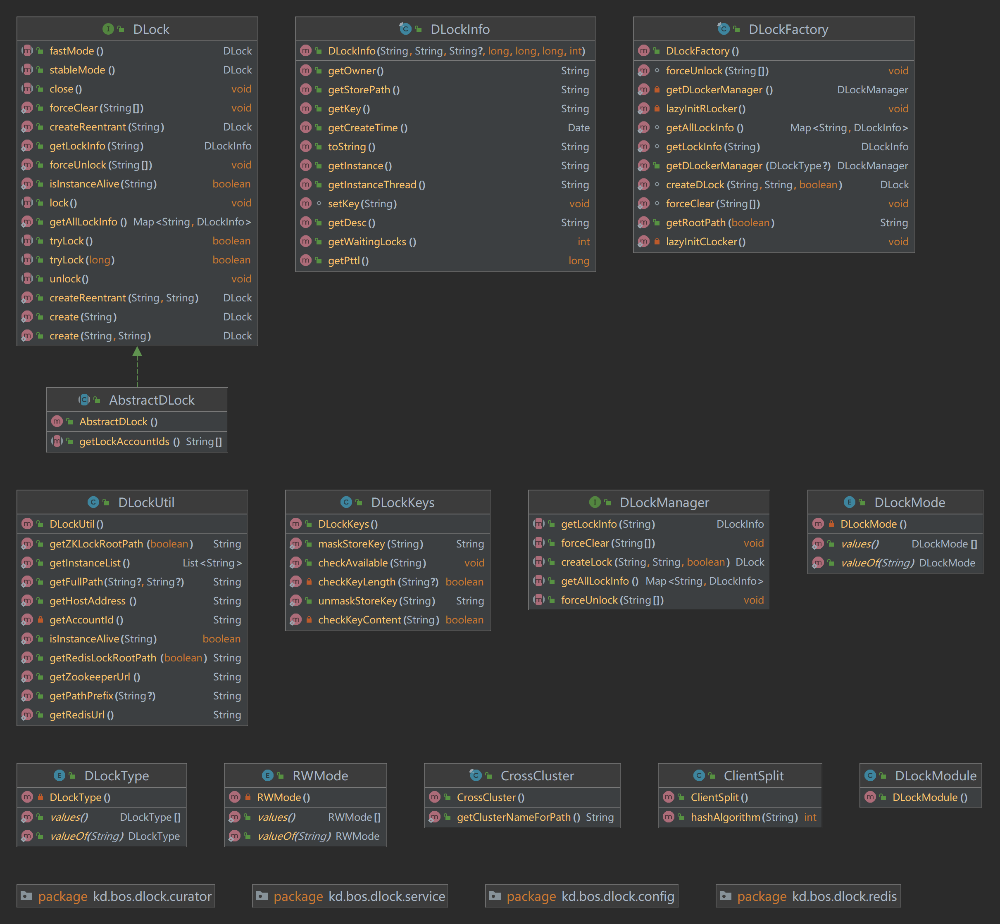

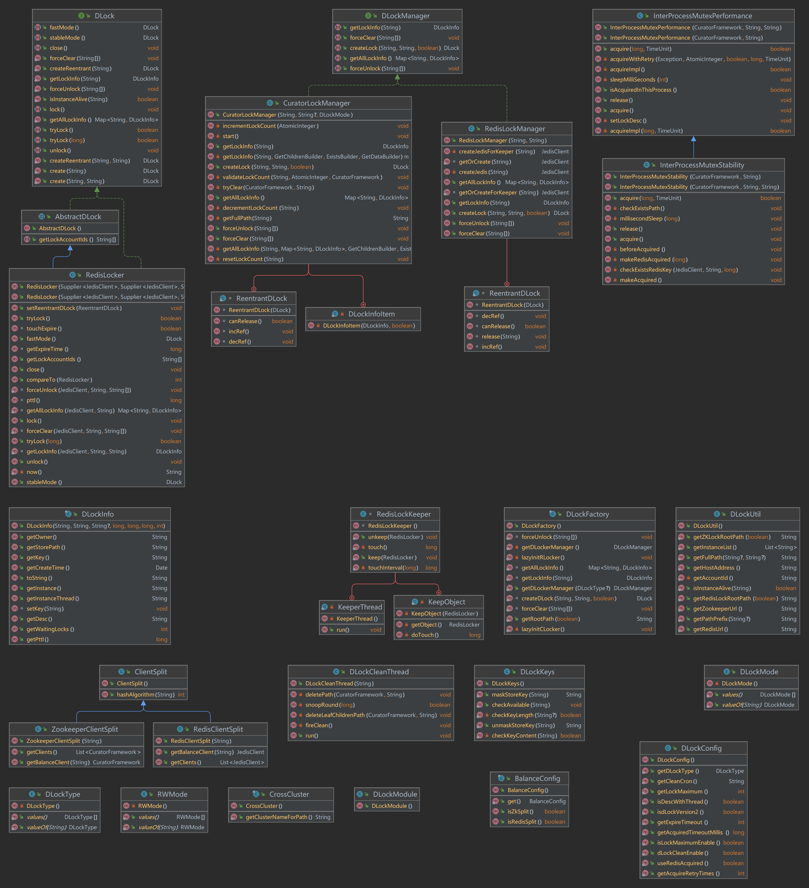

DLockConfig 分布式锁配置类

```java
package kd.bos.dlock.config;

import kd.bos.dlock.DLockType;
import kd.bos.util.ConfigurationUtil;

public class DLockConfig {
    public static final String DLOCK_STORE_ZOOKEEPER = "DLock.zookeeper";
    public static final String DLOCK_STORE_ZOOKEEPERS = "DLock.zookeepers";
    public static final String DLOCK_PERFORMANCE = "DLock.performance";
    private static final String DLOCK_TYPE = "DLock.type";
    private static DLockType dlockType;
    public static final String REDIS_CACHE_URL_KEY = "redis.serversForCache";
    public static final String REDIS_DLOCK_URL_KEY = "DLock.redis";
    public static final String REDIS_DLOCK_URLS_KEY = "DLock.redises";
    private static final String DLOCK_VERSION2 = "DLock.version2";
    private static final String DLOCK_CLEAN_ENABLE = "DLock.clean.enable";
    private static final String DLOCK_CLEAN_CRON = "DLock.clean.cron";
    private static final String DLOCK_USE_REDIS_ACQUIRED = "DLock.useRedisAcquired";
    private static final String DLOCK_EXPIRE_TIMEOUT = "DLock.expireTimeout";
    private static final String DLOCK_ACQUIRED_TIMEOUT = "DLock.acquiredTimeoutMillis";
    private static final String DLOCK_LOCK_MAXIMUM = "DLock.lockMaximum";
    private static final String DLOCK_LOCK_MAXIMUM_ENABLE = "DLock.lockMaximum.enable";
    private static final String DLOCK_DESC_WITH_THREAD = "dlock.monitor.descWithThread";
    private static final String DLOCK_ACQUIRE_RETRY_TIMES = "DLock.acquireRetryTimes";
    private static boolean dLockVersion2;
    private static boolean dLockCleanEnable;
    private static String dLockCleanCron;
    private static boolean useRedisAcquired;
    private static int expireTimeout;
    private static long acquiredTimeoutMillis;
    private static boolean lockMaxLimitEnable;
    private static int lockMaximum;
    private static boolean descWithThread;
    private static int acquireRetryTimes;

    public DLockConfig() {
    }

    public static DLockType getDLockType() {
        return dlockType;
    }

    public static boolean isdLockVersion2() {
        return dLockVersion2;
    }

    public static boolean dLockCleanEnable() {
        return dLockCleanEnable;
    }

    public static String getCleanCron() {
        return dLockCleanCron;
    }

    public static boolean useRedisAcquired() {
        return useRedisAcquired;
    }

    public static int getExpireTimeout() {
        return expireTimeout * 1000;
    }

    public static long getAcquiredTimeoutMillis() {
        return acquiredTimeoutMillis;
    }

    public static int getLockMaximum() {
        return lockMaximum;
    }

    public static boolean isLockMaximumEnable() {
        return lockMaxLimitEnable;
    }

    public static boolean isDescWithThread() {
        return descWithThread;
    }

    public static int getAcquireRetryTimes() {
        return acquireRetryTimes;
    }

    static {
        dlockType = DLockType.zookeeper;
        dLockVersion2 = true;
        dLockCleanEnable = true;
        dLockCleanCron = "0 0 5 5,10,15,20,25 * ?";
        useRedisAcquired = true;
        expireTimeout = 14400;
        acquiredTimeoutMillis = 30000L;
        lockMaxLimitEnable = true;
        lockMaximum = 500;
        descWithThread = false;
        acquireRetryTimes = 3;
        ConfigurationUtil.observeString("DLock.type", dlockType.name(), (v) -> {
            try {
                dlockType = DLockType.valueOf(v);
            } catch (Exception var2) {
                dlockType = DLockType.zookeeper;
            }

        });
        ConfigurationUtil.observeBoolean("DLock.version2", dLockVersion2, (v) -> {
            dLockVersion2 = v;
        });
        ConfigurationUtil.observeBoolean("DLock.clean.enable", dLockCleanEnable, (v) -> {
            dLockCleanEnable = v;
        });
        ConfigurationUtil.observeString("DLock.clean.cron", dLockCleanCron, (v) -> {
            dLockCleanCron = v;
        });
        ConfigurationUtil.observeBoolean("DLock.useRedisAcquired", useRedisAcquired, (v) -> {
            useRedisAcquired = v;
        });
        ConfigurationUtil.observeInteger("DLock.expireTimeout", expireTimeout, (v) -> {
            expireTimeout = v;
        });
        ConfigurationUtil.observeLong("DLock.acquiredTimeoutMillis", acquiredTimeoutMillis, (v) -> {
            acquiredTimeoutMillis = v;
        });
        ConfigurationUtil.observeInteger("DLock.lockMaximum", lockMaximum, (v) -> {
            lockMaximum = v;
        });
        ConfigurationUtil.observeBoolean("dlock.monitor.descWithThread", descWithThread, (v) -> {
            descWithThread = v;
        });
        ConfigurationUtil.observeBoolean("DLock.lockMaximum.enable", lockMaxLimitEnable, (v) -> {
            lockMaxLimitEnable = v;
        });
        ConfigurationUtil.observeInteger("DLock.acquireRetryTimes", acquireRetryTimes, (v) -> {
            acquireRetryTimes = v;
        });
    }
}
```

DLockFactory 分布式锁工厂类

​	getRootPath： 获取ZK地址

​	getDLockerManager： 获取分布式锁实现类

​	lazyInitRLocker：懒加载

​	lazyInitCLocker

```java
package kd.bos.dlock;

import java.util.HashMap;
import java.util.Map;
import java.util.Map.Entry;

import kd.bos.dlock.config.DLockConfig;
import kd.bos.dlock.curator.CuratorLockManager;
import kd.bos.dlock.redis.RedisLockManager;
import kd.bos.exception.KDExceptionKit;
import kd.bos.api.TimeoutChecker;

/**
 * @author rd_zhengfang_zheng
 */
public final class DLockFactory {
    public static final String DLOCK_PREFIX = "/__dlock__";
    public static final String DLOCK_PREFIX2 = "/dlock/";

    private static volatile CuratorLockManager clocker;
    private static volatile RedisLockManager rlocker;

    public static String getRootPath(boolean zk) {
        if (zk) {
            return DLockUtil.getZKLockRootPath(DLockConfig.isdLockVersion2());
        } else {
            return DLockUtil.getRedisLockRootPath(DLockConfig.isdLockVersion2());
        }
    }

    private static DLockManager getDLockerManager() {
        return getDLockerManager(DLockConfig.getDLockType());
    }

    public static DLockManager getDLockerManager(DLockType dlockType) {
        if (dlockType == DLockType.redis) {
            lazyInitRLocker();
            return rlocker;
        }
        lazyInitCLocker();
        return clocker;
    }

    private static void lazyInitRLocker() {
        if (rlocker != null) {
            return;
        }
        synchronized (DLockFactory.class) {
            if (rlocker == null) {
                String rootPath;
                if (CrossCluster.getClusterNameForPath() != null) {
                    rootPath = getRootPath(false);
                } else {
                    if (DLockConfig.isdLockVersion2()) {
                        rootPath = DLOCK_PREFIX2;
                    } else {
                        rootPath = DLOCK_PREFIX;
                    }
                }

                String url = DLockUtil.getRedisUrl();
                rlocker = new RedisLockManager(url.trim(), rootPath);
            }
        }
    }

    private static void lazyInitCLocker() {
        if (clocker != null) {
            return;
        }
        synchronized (DLockFactory.class) {
            if (clocker == null) {
                String zookeeper = DLockUtil.getZookeeperUrl();
                String rootPath = getRootPath(true);
                try {
                    DLockMode mode = Boolean.getBoolean(DLockConfig.DLOCK_PERFORMANCE) ? DLockMode.performance
                            : DLockMode.stability;
                    clocker = new CuratorLockManager(zookeeper, rootPath, mode);
                } catch (Exception e) {
                    throw KDExceptionKit.wrapRuntimeException(e);
                }
            }
        }
    }


    static DLock createDLock(String lockPath, String lockDesc, boolean reentrant) {
        TimeoutChecker.checkIfSetup();
        DLockKeys.checkAvailable(lockPath);
        lockPath = DLockKeys.maskStoreKey(lockPath);
        return getDLockerManager().createLock(lockPath, lockDesc, reentrant);
    }

    static Map<String, DLockInfo> getAllLockInfo() {
        Map<String, DLockInfo> map = getDLockerManager().getAllLockInfo();
        if (!map.isEmpty()) {
            Map<String, DLockInfo> ret = new HashMap<>(map.size());
            for (Entry<String, DLockInfo> entry : map.entrySet()) {
                DLockInfo lock = entry.getValue();
                String key = DLockKeys.unmaskStoreKey(entry.getKey());
                lock.setKey(key);
                ret.put(key, lock);
            }
            map = ret;
        }
        return map;
    }

    static DLockInfo getLockInfo(String key) {
        String storeKey = DLockKeys.maskStoreKey(key);
        DLockInfo ret = getDLockerManager().getLockInfo(storeKey);
        if (ret != null) {
            ret.setKey(key);
        }
        return ret;
    }

    static void forceUnlock(String... keys) {
        for (int i = 0; i < keys.length; i++) {
            keys[i] = DLockKeys.maskStoreKey(keys[i]);
        }
        getDLockerManager().forceUnlock(keys);
    }

    static void forceClear(String... keys) {
        for (int i = 0; i < keys.length; i++) {
            keys[i] = DLockKeys.maskStoreKey(keys[i]);
        }
        getDLockerManager().forceClear(keys);
    }
}
```

DLock 接口

```java
package kd.bos.dlock;

import java.util.Map;

import kd.bos.exception.KDException;
import kd.sdk.annotation.SdkInternal;
import kd.sdk.annotation.SdkPublic;

/**
 * 分布式锁接口
 *
 * <p>
 * 基本用法:
 *
 * <pre>
 * {@code
 *  try (DLock lock = DLock.create("key", "desc")) {
 *      lock.lock();
 *      // ...
 *  }
 * }
 * </pre>
 *
 * @author zzf
 */

@SdkPublic
public interface DLock extends AutoCloseable {

    /**
     * 获取锁，一直等待，直到获取。
     */
    void lock();

    /**
     * 尝试获取锁，不等待，获取到返回true(无锁竞争的情况下必为true)，否则返回false。
     */
    boolean tryLock();

    /**
     * 尝试获取锁，在timeoutMillis毫秒内获取到，返回true，否则返回false。
     *
     * @param timeoutMillis
     * @return true|false
     */
    boolean tryLock(long timeoutMillis);

    /**
     * 释放锁
     */
    void unlock();

    /**
     * 等同unlock
     */
    @SdkInternal
    void close();

    /**
     * 等同DLockMode.performance(DLock.performance=true), 快速模式: 出现异常自动解锁。
     */
    @SdkInternal
    DLock fastMode();

    /**
     * 等同DLockMode.stability(DLock.performance=false), 稳定模式: 出现异常手工解锁。
     */
    @SdkInternal
    DLock stableMode();

    ///////////////////////////////////////////////////////////////////////////////////////////////

    /**
     * 分布式锁对象，不可重入。
     *
     * @param key 分布式锁的key值
     * @return 分布式锁对象
     */
    static DLock create(String key) {
        return create(key, null);
    }

    /**
     * 分布式锁对象，不可重入。
     *
     * @param key  分布式锁的key值
     * @param desc 描述信息
     * @return 分布式锁对象
     */
    static DLock create(String key, String desc) {
        return DLockFactory.createDLock(key, desc, false);
    }

    /**
     * 分布式锁对象，可重入(仅在本jvm范围内)。
     *
     * @param key 分布式锁的key值
     * @return 分布式锁对象
     */
    static DLock createReentrant(String key) {
        return createReentrant(key, null);
    }

    /**
     * 分布式锁对象，可重入(仅在本jvm范围内)。
     *
     * @param key  分布式锁的key值
     * @param desc 描述信息
     * @return 分布式锁对象
     */
    static DLock createReentrant(String key, String desc) {
        return DLockFactory.createDLock(key, desc, true);
    }

    /**
     * 获取所有锁信息
     */
    @SdkInternal
    static Map<String, DLockInfo> getAllLockInfo() {
        return DLockFactory.getAllLockInfo();
    }

    /**
     * 获取key对应的锁信息，不存在则返回null。
     *
     * @param key key值
     * @return 锁信息
     */
    @SdkInternal
    static DLockInfo getLockInfo(String key) {
        return DLockFactory.getLockInfo(key);
    }

    /**
     * 强制解锁
     */
    @SdkInternal
    static void forceUnlock(String... keys) {
        DLockFactory.forceUnlock(keys);
    }

    /**
     * 强制清除锁(包括在等待的)
     */
    @SdkInternal
    static void forceClear(String... keys) {
        DLockFactory.forceClear(keys);
    }

    /**
     * 标识为instance的服务节点是否还活着，返回true代表存活，false代表失效
     *
     * @return true|false
     */
    @SdkInternal
    static boolean isInstanceAlive(String instance) throws KDException {
        return DLockUtil.isInstanceAlive(instance);
    }
}
```


### 方案一：zookeeper 默认方案

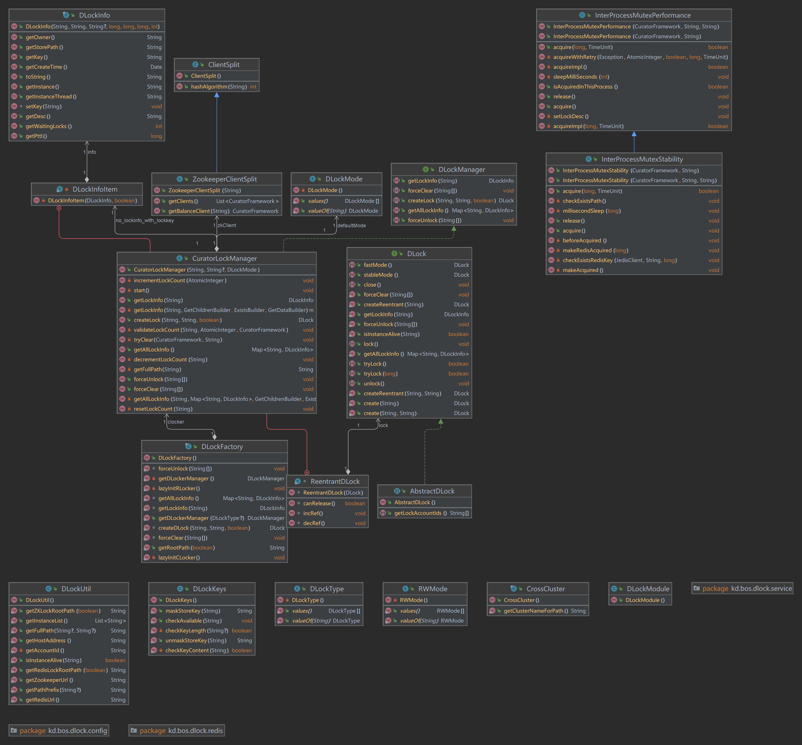

#### CuratorLockManager zookpeer分布式锁管理实现主入口

​	分布式锁管理器类，实现了 DLockManager 接口，并提供了创建、获取、释放和强制解锁等分布式锁相关功能。

**核心作用**

1. 实现分布式锁管理
  通过封装 Apache Curator 提供的分布式协调能力（如临时节点、顺序节点等），提供统一的分布式锁接口。
  支持两种模式：
  performance: 使用性能优先的锁机制（对应 InterProcessMutexPerformance）。
  stability: 使用稳定性优先的锁机制（对应 InterProcessMutexStability）。
2. 支持可重入锁
  利用 ThreadLocal<Map<String, ReentrantDLock>> thReentrantDLock 实现线程级别的锁重入。
  每个锁路径对应一个 ReentrantDLock，记录引用次数，避免重复加锁导致死锁。
3. 自动清理无效锁
  在 unlock() 和 tryClear() 方法中尝试删除无子节点的锁路径（包括 /locks、/leases 等），防止锁残留。
  结合 ZooKeeper 的事务操作保证原子性。
4. 支持锁信息查询与审计
  提供 getAllLockInfo() 和 getLockInfo() 方法获取当前所有锁的状态信息（如持有者、等待数、创建时间等）。
  集成日志、追踪（Tracer）、审计（Audit）模块，便于调试和监控锁使用情况。
5. 异常处理与自动恢复
  对于可能抛出的异常（如 ZooKeeper 连接中断、节点不存在等），进行捕获并包装为统一的 KDException。
  在 validateLockCount() 中检测锁数量异常时会尝试重置锁计数，提升健壮性。
6. 支持强制解锁与清除锁
  提供 forceUnlock() 和 forceClear() 方法，用于管理员或运维工具手动干预锁状态，解决死锁或遗留锁问题。
  可选地通过 Redis 缓存记录锁信息以加速判断和清理。
7. 性能优化与并发控制
  使用 ConcurrentHashMap 存储锁计数，避免多线程竞争。
  使用 synchronized 控制锁计数的增减，确保线程安全。
  通过 ThreadLocal 减少锁对象的创建开销。

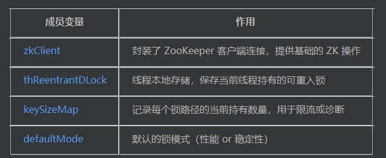

```java
package kd.bos.dlock.curator;

import java.util.Comparator;
import java.util.HashMap;
import java.util.List;
import java.util.Map;
import java.util.Set;
import java.util.TreeSet;
import java.util.concurrent.ConcurrentHashMap;
import java.util.concurrent.TimeUnit;
import java.util.concurrent.atomic.AtomicInteger;
import java.util.stream.Collectors;
import kd.bos.audit.Audit;
import kd.bos.audit.Auditable;
import kd.bos.bundle.Resources;
import kd.bos.dlock.AbstractDLock;
import kd.bos.dlock.DLock;
import kd.bos.dlock.DLockInfo;
import kd.bos.dlock.DLockManager;
import kd.bos.dlock.DLockMode;
import kd.bos.dlock.DLockUtil;
import kd.bos.dlock.config.DLockConfig;
import kd.bos.exception.BosErrorCode;
import kd.bos.exception.KDException;
import kd.bos.exception.KDExceptionKit;
import kd.bos.instance.Instance;
import kd.bos.redis.JedisClient;
import kd.bos.redis.RedisFactory;
import kd.bos.trace.TraceSpan;
import kd.bos.trace.Tracer;
import kd.bos.trace.tracer.MemSpanTrace;
import kd.bos.util.DisCardUtil;
import org.apache.curator.framework.CuratorFramework;
import org.apache.curator.framework.api.BackgroundVersionable;
import org.apache.curator.framework.api.ChildrenDeletable;
import org.apache.curator.framework.api.ExistsBuilder;
import org.apache.curator.framework.api.GetChildrenBuilder;
import org.apache.curator.framework.api.GetDataBuilder;
import org.apache.curator.framework.api.transaction.CuratorOp;
import org.apache.curator.framework.recipes.locks.InterProcessLock;
import org.apache.zookeeper.KeeperException;
import org.apache.zookeeper.data.Stat;
import org.slf4j.Logger;
import org.slf4j.LoggerFactory;

public class CuratorLockManager implements DLockManager {
  private static final Logger log = LoggerFactory.getLogger(CuratorLockManager.class);
  
  private static final String TRACER_NAME = "DLock";
  
  private static final String AUDIT_NAME = "dlock_cost";
  
  private static final String LEASE_PARENT = "leases";
  
  private static final String LOCK_PARENT = "locks";
  
  private static final String LOCK_ACQUIRED = "acquired";
  
  private static final String REDIS_URL = InterProcessMutexStability.REDIS_URL;
  
  private static final DLockInfoItem no_lockinfo_with_lockkey = new DLockInfoItem(null, true);
  
  private static final DLockInfoItem no_lockinfo_without_lockkey = new DLockInfoItem(null, false);
  
  private static final ThreadLocal<Map<String, ReentrantDLock>> thReentrantDLock = ThreadLocal.withInitial(() -> new HashMap<>());
  
  private DLockMode defaultMode;
  
  private ZookeeperClientSplit zkClient;
  
  private String connectString;
  
  private final String rootPath;
  
  private static volatile Map<String, AtomicInteger> keySizeMap = new ConcurrentHashMap<>();
  
  private static class DLockInfoItem {
    private DLockInfo info;
    
    private boolean isLockKey;
    
    private DLockInfoItem(DLockInfo info, boolean isLockKey) {
      this.info = info;
      this.isLockKey = isLockKey;
    }
  }
  
  public CuratorLockManager(String connectString, String rootPath, DLockMode defaultMode) throws KDException 	{
    this.connectString = connectString;
    this.rootPath = (rootPath == null) ? "" : rootPath.trim();
    this.defaultMode = defaultMode;
    start();
  }
  
  private void start() throws KDException {
    this.zkClient = new ZookeeperClientSplit(this.connectString);
  }
  
  static class ReentrantDLock {
    private DLock lock;
    
    private int ref;
    
    ReentrantDLock(DLock lock) {
      this.lock = lock;
      this.ref = 0;
    }
    
    void incRef() {
      this.ref++;
    }
    
    void decRef() {
      this.ref--;
    }
    
    boolean canRelease() {
      return (this.ref <= 0);
    }
  }
  
  private String getFullPath(String lockPath) {
    return DLockUtil.getFullPath(this.rootPath, lockPath.trim());
  }
  
  public DLock createLock(final String lockPath, final String lockDesc, final boolean reentrant) {
    final CuratorFramework client = this.zkClient.getBalanceClient(lockPath);
    final String fullPath = getFullPath(lockPath);
    if (reentrant) {
      ReentrantDLock rlock = (ReentrantDLock)((Map)thReentrantDLock.get()).get(fullPath);
      if (rlock != null)
        return rlock.lock; 
    } 
    final AtomicInteger count = keySizeMap.computeIfAbsent(fullPath, k -> new AtomicInteger(0));
    incrementLockCount(count);
    AbstractDLock abstractDLock = new AbstractDLock() {
        private static final String TRACER_ACQUIRE_NAME = "acquire";
        
        private static final String TRACER_PATH_TAG_NAME = "path";
        
        private boolean acquired = false;
        
        private boolean lockOccurException = false;
        
        private boolean calledUnlock = false;
        
        private DLockMode lockMode = CuratorLockManager.this.defaultMode;
        
        private InterProcessLock mutex;
        
        public String[] getLockAccountIds() {
          GetChildrenBuilder getChildren = client.getChildren();
          try {
            String path = CuratorLockManager.this.rootPath.substring(0, CuratorLockManager.this.rootPath.lastIndexOf('/'));
            List<String> accountIds = (List<String>)getChildren.forPath(path);
            if (!accountIds.isEmpty()) {
              Set<String> ret;
              if (DLockConfig.isdLockVersion2()) {
                ret = (Set<String>)accountIds.stream().collect(Collectors.toSet());
              } else {
                ret = getPrefixAccountIds("__dlock__", accountIds);
              } 
              if (ret.isEmpty())
                return empty_strings; 
              return ret.<String>toArray(new String[ret.size()]);
            } 
          } catch (Exception e) {
            DisCardUtil.discard();
          } 
          return empty_strings;
        }
        
        private Set<String> getPrefixAccountIds(String prefix, List<String> accountIds) {
          Set<String> ret = new TreeSet<>();
          for (String key : accountIds) {
            if (key.startsWith(prefix))
              ret.add(key.substring(prefix.length())); 
          } 
          return ret;
        }
        
        private InterProcessLock getMutex(boolean ensureCreate) {
          if (this.mutex == null) {
            if (ensureCreate) {
              switch (this.lockMode) {
                case performance:
                  this.mutex = new InterProcessMutexPerformance(client, fullPath, lockDesc);
                  return this.mutex;
                case stability:
                  this.mutex = new InterProcessMutexStability(client, fullPath, lockDesc);
                  return this.mutex;
              } 
              throw new UnsupportedOperationException("Unsupproted mode: " + this.lockMode);
            } 
            throw new IllegalStateException(Resources.getString("bos-dlock", "CuratorLockManager_0", new Object[0]));
          } 
          return this.mutex;
        }
        
        public void lock() {
          try {
            CuratorLockManager.this.validateLockCount(fullPath, count, client);
            CuratorLockManager.log.info("acquire lock " + lockPath + "...");
            if (reentrant) {
              CuratorLockManager.ReentrantDLock rd = (CuratorLockManager.ReentrantDLock)((Map)CuratorLockManager.thReentrantDLock.get()).get(fullPath);
              if (rd.ref <= 0)
                tryAcquire(); 
              rd.incRef();
            } else {
              tryAcquire();
            } 
            CuratorLockManager.log.info("acquired lock " + lockPath);
          } catch (Exception e) {
            CuratorLockManager.log.error("acquire lock failed: " + fullPath, e);
            this.lockOccurException = true;
            CuratorLockManager.this.decrementLockCount(fullPath);
            throw KDExceptionKit.wrapRuntimeException(e);
          } 
        }
        
        private void tryAcquire() throws Exception {
          try(TraceSpan ts = Tracer.create("DLock", "acquire"); 
              MemSpanTrace mst = MemSpanTrace.create("DLock", "acquire"); 
              Auditable audit = Audit.audit("dlock_cost", new Object[] { this.val$lockPath })) {
            mst.addTag("path", lockPath);
            ts.addTag("path", lockPath);
            getMutex(true).acquire();
            this.acquired = true;
          } 
        }
        
        public boolean tryLock(long timeoutMillis) {
          try {
            CuratorLockManager.this.validateLockCount(fullPath, count, client);
            CuratorLockManager.log.info("acquire lock " + lockPath + "...");
            if (reentrant) {
              CuratorLockManager.ReentrantDLock rd = (CuratorLockManager.ReentrantDLock)((Map)CuratorLockManager.thReentrantDLock.get()).get(fullPath);
              if (rd.ref > 0) {
                rd.incRef();
                CuratorLockManager.log.info("acquired lock " + lockPath);
                return true;
              } 
              if (getMutex(true).acquire(timeoutMillis, TimeUnit.MILLISECONDS)) {
                this.acquired = true;
                rd.incRef();
                CuratorLockManager.log.info("acquired lock " + lockPath);
                return true;
              } 
            } else if (getMutex(true).acquire(timeoutMillis, TimeUnit.MILLISECONDS)) {
              this.acquired = true;
              CuratorLockManager.log.info("acquired lock " + lockPath);
              return true;
            } 
          } catch (Exception e) {
            CuratorLockManager.log.error("acquire lock failed: " + fullPath, e);
            this.lockOccurException = true;
            CuratorLockManager.this.decrementLockCount(fullPath);
            throw KDExceptionKit.wrapRuntimeException(e);
          } 
          return false;
        }
        
        public boolean tryLock() {
          return tryLock(1L);
        }
        
        public void unlock() {
          if (!this.lockOccurException && !this.calledUnlock)
            CuratorLockManager.this.decrementLockCount(fullPath); 
          this.calledUnlock = true;
          if (!this.acquired)
            return; 
          try {
            CuratorLockManager.log.info("release lock " + lockPath + "...");
            if (reentrant) {
              CuratorLockManager.ReentrantDLock rd = (CuratorLockManager.ReentrantDLock)((Map)CuratorLockManager.thReentrantDLock.get()).get(fullPath);
              if (rd == null)
                throw new IllegalStateException(
                    Resources.getString("bos-dlock", "CuratorLockManager_1", new Object[0])); 
              rd.decRef();
              if (rd.canRelease()) {
                getMutex(false).release();
                this.mutex = null;
                this.acquired = false;
                ((Map)CuratorLockManager.thReentrantDLock.get()).remove(fullPath);
                CuratorLockManager.this.tryClear(client, fullPath);
              } 
            } else {
              getMutex(false).release();
              this.mutex = null;
              this.acquired = false;
              CuratorLockManager.this.tryClear(client, fullPath);
            } 
          } catch (Exception e) {
            CuratorLockManager.log.error("unlock failed: " + fullPath, e);
            throw KDExceptionKit.wrapRuntimeException(e);
          } 
        }
        
        public void close() {
          unlock();
        }
        
        public DLock fastMode() {
          this.lockMode = DLockMode.performance;
          return (DLock)this;
        }
        
        public DLock stableMode() {
          this.lockMode = DLockMode.stability;
          return (DLock)this;
        }
      };
    if (reentrant)
      ((Map<String, ReentrantDLock>)thReentrantDLock.get()).put(fullPath, new ReentrantDLock((DLock)abstractDLock)); 
    return (DLock)abstractDLock;
  }
  
  private void validateLockCount(String fullPath, AtomicInteger currentNum, CuratorFramework client) throws Exception {
    if (DLockConfig.isLockMaximumEnable() && DLockConfig.getLockMaximum() < currentNum.get()) {
      Stat stat = (Stat)client.checkExists().forPath(fullPath + "/locks");
      if (stat == null) {
        TimeUnit.SECONDS.sleep(2L);
        stat = (Stat)client.checkExists().forPath(fullPath + "/locks");
      } 
      if (stat != null && stat.getNumChildren() > DLockConfig.getLockMaximum())
        throw new KDException(BosErrorCode.dlock, new Object[] { String.format("Acquire the lock error, the number of locks cannot exceed the maximum.\n Instance=%s, lockKey=%s, maximum=%s", new Object[] { Instance.getInstanceId(), fullPath, Integer.valueOf(DLockConfig.getLockMaximum()) }) }); 
      log.warn(String.format("Something wrong occurred in the lock path :%s, maybe the lock was not close correctly.Resetting concurrent lock count.", new Object[] { fullPath }));
      resetLockCount(fullPath);
    } 
  }
  
  private synchronized void incrementLockCount(AtomicInteger count) {
    count.getAndIncrement();
  }
  
  private synchronized void decrementLockCount(String fullPath) {
    AtomicInteger lockCount = keySizeMap.get(fullPath);
    if (lockCount != null && lockCount.decrementAndGet() <= 0)
      keySizeMap.remove(fullPath); 
  }
  
  private synchronized void resetLockCount(String fullPath) {
    AtomicInteger lockCount = keySizeMap.get(fullPath);
    if (lockCount != null)
      lockCount.set(0); 
  }
  
  private void tryClear(CuratorFramework client, String fullPath) {
    try {
      client.transaction().forOperations(new CuratorOp[] { (CuratorOp)client.transactionOp().delete().forPath(fullPath + '/' + "locks"), (CuratorOp)client
            .transactionOp().delete().forPath(fullPath + '/' + "leases"), (CuratorOp)client
            .transactionOp().delete().forPath(fullPath) });
    } catch (org.apache.zookeeper.KeeperException.NotEmptyException|org.apache.zookeeper.KeeperException.NoNodeException e) {
      DisCardUtil.discard();
    } catch (Exception e) {
      DisCardUtil.discard();
    } 
  }
  
  public Map<String, DLockInfo> getAllLockInfo() {
    Map<String, DLockInfo> ret = new HashMap<>();
    try {
      for (CuratorFramework client : this.zkClient.getClients()) {
        GetChildrenBuilder getChildren = client.getChildren();
        ExistsBuilder checkExists = client.checkExists();
        GetDataBuilder getData = client.getData();
        String path = getFullPath("");
        path = path.substring(0, path.length() - 1);
        for (String key : getChildren.forPath(path))
          getAllLockInfo(key, ret, getChildren, checkExists, getData); 
      } 
    } catch (Exception e) {
      DisCardUtil.discard();
    } 
    return ret;
  }
  
  private void getAllLockInfo(String longKey, Map<String, DLockInfo> map, GetChildrenBuilder getChildren, ExistsBuilder checkExists, GetDataBuilder getData) {
    DLockInfoItem di = getLockInfo(longKey, getChildren, checkExists, getData);
    if (di.info != null) {
      map.put(longKey, di.info);
    } else if (!di.isLockKey) {
      try {
        for (String key : getChildren.forPath(getFullPath(longKey))) {
          String subKey = longKey + '/' + key;
          getAllLockInfo(subKey, map, getChildren, checkExists, getData);
        } 
      } catch (Exception e) {
        DisCardUtil.discard();
      } 
    } 
  }
  
  public DLockInfo getLockInfo(String key) {
    return (getLockInfo(key, this.zkClient.getBalanceClient(key).getChildren(), this.zkClient
        .getBalanceClient(key).checkExists(), this.zkClient.getBalanceClient(key).getData())).info;
  }
  
  private DLockInfoItem getLockInfo(String key, GetChildrenBuilder getChildren, ExistsBuilder checkExists, GetDataBuilder getData) {
    try {
      String value = null;
      long ephemeralOwner = 0L;
      long ctime = 0L;
      int waitingLocks = 0;
      String leasesPath = getFullPath(key + '/' + "leases");
      Stat leasesStat = (Stat)checkExists.forPath(leasesPath);
      if (leasesStat == null)
        return no_lockinfo_without_lockkey; 
      if (leasesStat.getNumChildren() <= 0)
        return no_lockinfo_with_lockkey; 
      List<String> lockIds = (List<String>)getChildren.forPath(leasesPath);
      List<String> sortedLockIds = (List<String>)lockIds.stream().sorted(Comparator.comparing(o -> o.substring(o.indexOf("-lease-") + 7))).collect(Collectors.toList());
      for (String lockId : sortedLockIds) {
        String lockIdPath = leasesPath + '/' + lockId;
        if (value == null)
          value = new String((byte[])getData.forPath(lockIdPath), "UTF-8"); 
        Stat idStat = (Stat)checkExists.forPath(lockIdPath);
        if (ctime == 0L || ctime > idStat.getCtime()) {
          ctime = idStat.getCtime();
          ephemeralOwner = idStat.getEphemeralOwner();
        } 
      } 
      String locksPath = getFullPath(key + '/' + "locks");
      Stat locksStat = (Stat)checkExists.forPath(locksPath);
      if (locksStat != null)
        waitingLocks += locksStat.getNumChildren(); 
      return new DLockInfoItem(new DLockInfo(key, getFullPath(""), value, ephemeralOwner, ctime, 0L, waitingLocks), true);
    } catch (Exception e) {
      DisCardUtil.discard();
      return no_lockinfo_without_lockkey;
    } 
  }
  
  public void forceUnlock(String... keys) {
    if (keys == null || keys.length <= 0)
      return; 
    try {
      for (String key : keys) {
        CuratorFramework client = this.zkClient.getBalanceClient(key);
        BackgroundVersionable deletingChildrenIfNeeded = ((ChildrenDeletable)client.delete().guaranteed()).deletingChildrenIfNeeded();
        GetChildrenBuilder getChildren = client.getChildren();
        String path = getFullPath(key);
        try {
          if (DLockConfig.useRedisAcquired()) {
            try (JedisClient jedisClient = RedisFactory.getJedisClient(REDIS_URL)) {
              jedisClient.del(path + '/' + "acquired");
            } 
          } else {
            deletingChildrenIfNeeded.forPath(path + '/' + "acquired");
          } 
        } catch (Exception e) {
          DisCardUtil.discard();
        } 
        try {
          List<String> leasePaths = (List<String>)getChildren.forPath(path + '/' + "leases");
          if (!leasePaths.isEmpty()) {
            log.info("unlock path :" + path);
            List<String> sortedList = (List<String>)leasePaths.stream().sorted(Comparator.comparing(o -> o.substring(o.indexOf("-lease-") + 7))).collect(Collectors.toList());
            String deleteLeasePath = sortedList.get(0);
            deletingChildrenIfNeeded.forPath(path + '/' + "leases" + '/' + deleteLeasePath);
          } 
          AtomicInteger count = keySizeMap.get(path);
          if (count != null)
            decrementLockCount(path); 
        } catch (org.apache.zookeeper.KeeperException.NoNodeException e) {
          DisCardUtil.discard();
        } 
      } 
    } catch (Exception e) {
      throw KDExceptionKit.wrapRuntimeException(e);
    } 
  }
  
  public void forceClear(String... keys) {
    if (keys == null || keys.length <= 0)
      return; 
    try {
      for (String key : keys) {
        BackgroundVersionable deletingChildrenIfNeeded = ((ChildrenDeletable)this.zkClient.getBalanceClient(key).delete().guaranteed()).deletingChildrenIfNeeded();
        String path = getFullPath(key);
        try {
          log.info("clear lock path :" + path);
          deletingChildrenIfNeeded.forPath(path);
          keySizeMap.remove(path);
          if (DLockConfig.useRedisAcquired())
            try (JedisClient jedisClient = RedisFactory.getJedisClient(REDIS_URL)) {
              jedisClient.del(path + '/' + "acquired");
            }  
        } catch (Exception e) {
          DisCardUtil.discard();
        } 
      } 
    } catch (Exception e) {
      throw KDExceptionKit.wrapRuntimeException(e);
    } 
  }
}

```

#### InterProcessMutexPerformance 【性能优先】 

zk断连下可能导致两个或以上的客户端获得锁

InterProcessMutexPerformance 是一个基于 Apache Curator 实现的高性能分布式锁机制，继承自 InterProcessLock 接口。它主要用于在分布式系统中协调多个节点对共享资源的访问，特别适用于高并发、低延迟场景

**核心作用**

1. 实现高性能分布式锁
  使用 InterProcessSemaphoreV2 提供的信号量机制来实现分布式锁。
  支持公平锁机制（通过顺序节点），确保多个客户端竞争时按请求顺序获取锁。
  锁路径下创建 /leases 子节点作为租约记录持有者信息。
2. 支持可重入与描述信息
  每个锁会记录持有者的描述信息（IP + 线程 + 自定义描述），便于调试和追踪。
  描述信息存储在 ZooKeeper 节点的数据中，方便后续查询或监控。
3. 异常处理与自动重试
  对于可能出现的临时性异常（如 NoNodeException），提供重试机制（默认重试次数由 DLockConfig.getAcquireRetryTimes() 控制）。
  防止因网络波动或服务短暂不可用导致的锁获取失败。
4. 封装底层 ZK 操作
  使用 CuratorFramework 封装 ZooKeeper 的原生 API，简化开发。
  使用 ZKPaths.makePath 构建标准路径结构，避免路径拼接错误。
  使用 watcherRemoveClient 移除监听器，防止内存泄漏。
5. 线程安全与状态管理
  使用 volatile Lease lease 保证锁状态在多线程间的可见性。
  在 acquire() 和 release() 中维护锁的生命周期，确保正确释放资源。
6. 兼容性设计
  继承自 InterProcessLock 接口，符合统一的分布式锁接口规范。
  与 CuratorLockManager 配合使用，支持配置切换为稳定性优先的锁（即 InterProcessMutexStability）。

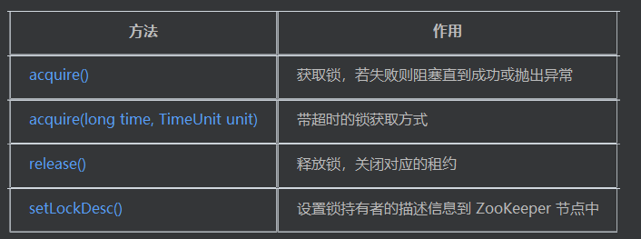

```java
package kd.bos.dlock.curator;

import com.google.common.base.Preconditions;
import java.io.IOException;
import java.io.UnsupportedEncodingException;
import java.util.concurrent.TimeUnit;
import java.util.concurrent.atomic.AtomicInteger;
import kd.bos.dlock.DLockUtil;
import kd.bos.dlock.config.DLockConfig;
import kd.bos.exception.BosErrorCode;
import kd.bos.exception.KDException;
import kd.bos.util.DisCardUtil;
import org.apache.curator.framework.CuratorFramework;
import org.apache.curator.framework.WatcherRemoveCuratorFramework;
import org.apache.curator.framework.recipes.locks.InterProcessLock;
import org.apache.curator.framework.recipes.locks.InterProcessSemaphoreV2;
import org.apache.curator.framework.recipes.locks.Lease;
import org.apache.curator.utils.ZKPaths;
import org.slf4j.Logger;
import org.slf4j.LoggerFactory;

public class InterProcessMutexPerformance implements InterProcessLock {
  private static final Logger logger = LoggerFactory.getLogger(InterProcessMutexPerformance.class);
  
  private static final String LEASE_PARENT = "leases";
  
  protected final InterProcessSemaphoreV2 semaphore;
  
  protected final CuratorFramework client;
  
  private final WatcherRemoveCuratorFramework watcherRemoveClient;
  
  private volatile Lease lease;
  
  private final String leasesPath;
  
  private byte[] valueBytes;
  
  public InterProcessMutexPerformance(CuratorFramework client, String path) {
    this(client, path, null);
  }
  
  public InterProcessMutexPerformance(CuratorFramework client, String path, String value) {
    this.client = client;
    this.watcherRemoveClient = client.newWatcherRemoveCuratorFramework();
    this.semaphore = new InterProcessSemaphoreV2((CuratorFramework)this.watcherRemoveClient, path, 1);
    value = DLockUtil.getHostAddress() + '#' + Thread.currentThread() + '#' + ((value == null) ? "" : value);
    try {
      this.valueBytes = value.getBytes("UTF-8");
    } catch (UnsupportedEncodingException e) {
      throw new RuntimeException(e);
    } 
    this.leasesPath = ZKPaths.makePath(path, "leases");
  }
  
  private void setLockDesc() throws Exception {
    this.client.setData().forPath(this.leasesPath + '/' + this.lease.getNodeName(), this.valueBytes);
  }
  
  public void acquire() throws KDException {
    AtomicInteger retryTimes = new AtomicInteger(0);
    try {
      acquireImpl();
    } catch (Exception e) {
      acquireWithRetry(e, retryTimes, false, -1L, null);
    } 
  }
  
  public boolean acquire(long time, TimeUnit unit) throws KDException {
    AtomicInteger retryTimes = new AtomicInteger(0);
    try {
      return acquireImpl(time, unit);
    } catch (Exception e) {
      return acquireWithRetry(e, retryTimes, true, time, unit);
    } 
  }
  
  private boolean acquireImpl() throws Exception {
    try {
      this.lease = this.semaphore.acquire();
    } catch (Exception e) {
      throw e;
    } 
    try {
      setLockDesc();
    } catch (Exception e) {
      try {
        this.lease.close();
      } catch (IOException e1) {
        DisCardUtil.discard();
      } 
      throw e;
    } 
    return true;
  }
  
  private boolean acquireImpl(long time, TimeUnit unit) throws Exception {
    Lease acquiredLease = null;
    try {
      acquiredLease = this.semaphore.acquire(time, unit);
    } catch (Exception e) {
      throw e;
    } 
    if (acquiredLease == null)
      return false; 
    this.lease = acquiredLease;
    try {
      setLockDesc();
    } catch (Exception e) {
      try {
        this.lease.close();
      } catch (IOException e1) {
        DisCardUtil.discard();
      } 
      throw e;
    } 
    return true;
  }
  
  private boolean acquireWithRetry(Exception e, AtomicInteger retryTimes, boolean withTime, long time, TimeUnit unit) {
    if (!(e instanceof org.apache.zookeeper.KeeperException.NoNodeException))
      throw new KDException(BosErrorCode.dlock, e.getMessage(), e); 
    if (retryTimes.getAndIncrement() < DLockConfig.getAcquireRetryTimes())
      try {
        logger.info(String.format("retry acquire lock %s times for path %s", new Object[] { Integer.valueOf(retryTimes.get()), this.leasesPath }));
        sleepMilliSeconds(100);
        if (withTime)
          return acquireImpl(time, unit); 
        return acquireImpl();
      } catch (Exception e1) {
        return acquireWithRetry(e, retryTimes, withTime, time, unit);
      }  
    logger.info(String.format("retry acquire lock %s times failed for path %s", new Object[] { Integer.valueOf(retryTimes.get()), this.leasesPath }));
    throw new KDException(BosErrorCode.dlock, e.getMessage(), e);
  }
  
  private void sleepMilliSeconds(int milliSeconds) {
    try {
      TimeUnit.MILLISECONDS.sleep(milliSeconds);
    } catch (InterruptedException interruptedException) {
      throw new KDException(BosErrorCode.dlock, interruptedException.getMessage(), interruptedException);
    } 
  }
  
  public void release() throws KDException {
    try {
      Lease lease = this.lease;
      Preconditions.checkState((lease != null), "Not acquired");
      this.lease = null;
      lease.close();
      this.watcherRemoveClient.removeWatchers();
    } catch (Exception e) {
      throw new KDException(BosErrorCode.dlock, e.getMessage(), e);
    } 
  }
  
  public boolean isAcquiredInThisProcess() {
    return (this.lease != null);
  }
}

```

#### InterProcessMutexStability 【稳定性优先】 

锁增加持久化节点存储，防止zk session丢失，从而幻象节点丢失，导致多个客户端获取锁。

**核心作用**

1. 增强锁的稳定性
在获取锁后额外创建 /acquired 节点或使用 Redis 缓存记录持有者信息，确保即使 ZooKeeper 连接中断也能保留锁状态。
避免因短暂网络问题导致锁被错误释放或多个节点同时获取锁的问题。
2. 支持双写机制（ZooKeeper + Redis）
可配置使用 Redis 记录锁信息（通过 DLockConfig.useRedisAcquired()）：
若启用 Redis，则在获取锁时写入 Redis；
若未启用，则仍使用 ZooKeeper 的临时节点机制。
提高锁状态的持久性和可查询性。
3. 异常处理与锁存活检测
获取锁前检查已有锁是否属于已下线实例：
若存在且原持有者实例已宕机，则删除无效锁。
若原持有者仍在运行，则等待超时或抛出异常提示用户手动干预。
确保不会出现多个节点同时持有同一把锁的情况。
4. 重试机制与自动等待
在获取锁失败时，根据配置等待一段时间并重试。
支持设置最大等待时间，避免无限期阻塞。
5. 兼容 InterProcessLock 接口规范
继承自 InterProcessMutexPerformance，复用其基础锁逻辑。
扩展了 acquire() 和 release() 方法，添加稳定性保障逻辑。
与 CuratorLockManager 集成良好，支持动态切换为性能优先模式。
6. 日志追踪与调试信息
使用 Tracer 记录获取锁的调用链路，便于排查性能瓶颈。
日志记录详细的操作过程和异常信息，便于运维人员诊断问题。

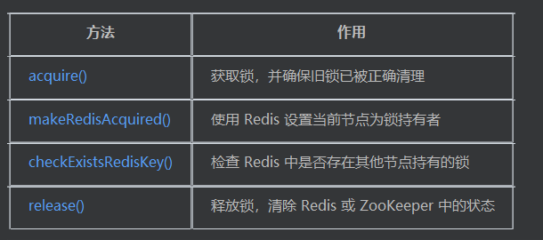

```java
package kd.bos.dlock.curator;

import java.nio.charset.StandardCharsets;
import java.util.Arrays;
import java.util.concurrent.TimeUnit;
import kd.bos.bundle.Resources;
import kd.bos.dlock.DLockUtil;
import kd.bos.dlock.config.DLockConfig;
import kd.bos.exception.BosErrorCode;
import kd.bos.exception.KDException;
import kd.bos.instance.Instance;
import kd.bos.redis.JedisClient;
import kd.bos.redis.RedisFactory;
import kd.bos.trace.TraceSpan;
import kd.bos.trace.Tracer;
import kd.bos.util.ConfigurationUtil;
import kd.bos.util.DisCardUtil;
import org.apache.curator.framework.CuratorFramework;
import org.apache.curator.framework.api.ChildrenDeletable;
import org.apache.zookeeper.KeeperException;
import org.slf4j.Logger;
import org.slf4j.LoggerFactory;

public class InterProcessMutexStability extends InterProcessMutexPerformance {
  public static final String LOCK_ACQUIRED = "acquired";
  
  public static final String DLOCK_PROJECT_NAME = "bos-dlock";
  
  public static final String REDIS_URL = ConfigurationUtil.getString("redis.serversForSession");
  
  private static final String ACQUIRED_INSTANCE = Instance.getInstanceId();
  
  private static final byte[] ACQUIRED_INSTANCE_BYTES = ACQUIRED_INSTANCE.getBytes(StandardCharsets.UTF_8);
  
  private static final Logger log = LoggerFactory.getLogger(InterProcessMutexStability.class);
  
  private final String path;
  
  private final String pathAcquired;
  
  private boolean acquired = false;
  
  private final boolean useRedisAcquired;
  
  public InterProcessMutexStability(CuratorFramework client, String path) {
    this(client, path, null);
  }
  
  public InterProcessMutexStability(CuratorFramework client, String path, String value) {
    super(client, path, value);
    this.path = path;
    this.pathAcquired = path + '/' + "acquired";
    this.useRedisAcquired = DLockConfig.useRedisAcquired();
  }
  
  public void acquire() throws KDException {
    long endTime = System.currentTimeMillis() + DLockConfig.getAcquiredTimeoutMillis();
    beforeAcquired();
    super.acquire();
    if (this.useRedisAcquired) {
      makeRedisAcquired(endTime);
    } else {
      makeAcquired();
    } 
  }
  
  public boolean acquire(long time, TimeUnit unit) throws KDException {
    long endTime = System.currentTimeMillis() + TimeUnit.MILLISECONDS.convert(time, unit);
    beforeAcquired();
    boolean b = super.acquire(time, unit);
    if (b)
      if (this.useRedisAcquired) {
        makeRedisAcquired(endTime);
      } else {
        makeAcquired();
      }  
    return b;
  }
  
  private void beforeAcquired() {
    if (this.acquired)
      throw new IllegalStateException("Has acquired"); 
  }
  
  private void makeAcquired() throws KDException {
    try {
      this.acquired = true;
      if (this.client.checkExists().forPath(this.pathAcquired) != null)
        checkExistsPath(); 
      this.client.create().forPath(this.pathAcquired, ACQUIRED_INSTANCE_BYTES);
    } catch (Exception e) {
      try {
        release();
      } catch (Exception e1) {
        DisCardUtil.discard();
      } 
      throw new KDException(BosErrorCode.dlock, e.getMessage(), e);
    } 
  }
  
  private void makeRedisAcquired(long endTime) {
    this.acquired = true;
    try(TraceSpan span = Tracer.create("RedisSessionableCache", "DLockMakeAcquired"); 
        JedisClient jedisClient = RedisFactory.getJedisClient(REDIS_URL)) {
      String instanceData = jedisClient.get(this.pathAcquired);
      if (instanceData != null)
        checkExistsRedisKey(jedisClient, instanceData, endTime); 
      jedisClient.setex(this.pathAcquired, DLockConfig.getExpireTimeout(), ACQUIRED_INSTANCE);
    } catch (Exception e) {
      try {
        release();
      } catch (Exception e1) {
        DisCardUtil.discard();
      } 
      throw new KDException(BosErrorCode.dlock, e.getMessage(), e);
    } 
  }
  
  private void checkExistsRedisKey(JedisClient jedisClient, String instanceData, long endTime) throws Exception {
    boolean neednotReleaseEphemeral = false;
    boolean noException = false;
    try {
      if (ACQUIRED_INSTANCE.equals(instanceData)) {
        long wait = endTime - System.currentTimeMillis();
        if (wait >= 0L) {
          millisecondSleep(wait);
          if (!jedisClient.exists(this.pathAcquired).booleanValue()) {
            neednotReleaseEphemeral = true;
            noException = true;
          } 
        } 
      } else if (!DLockUtil.isInstanceAlive(instanceData)) {
        neednotReleaseEphemeral = true;
        noException = true;
        jedisClient.del(this.pathAcquired);
      } else {
        long wait = endTime - System.currentTimeMillis();
        if (wait >= 0L) {
          millisecondSleep(wait);
          if (!jedisClient.exists(this.pathAcquired).booleanValue()) {
            neednotReleaseEphemeral = true;
            noException = true;
          } 
        } 
      } 
      if (!noException)
        throw new RuntimeException(Resources.get("bos-dlock", "InterProcessMutexStability_3", ", new Object[] { instanceData, this.path, ACQUIRED_INSTANCE })); 
    } finally {
      if (!neednotReleaseEphemeral)
        super.release(); 
    } 
  }
  
  private void millisecondSleep(long wait) throws InterruptedException {
    Thread.sleep(wait);
  }
  
  private void checkExistsPath() throws Exception {
    boolean neednotReleaseEphemeral = false;
    try {
      byte[] data = (byte[])this.client.getData().forPath(this.pathAcquired);
      if (Arrays.equals(data, ACQUIRED_INSTANCE_BYTES))
        throw new RuntimeException(
            Resources.get("bos-dlock", "InterProcessMutexStability_0", ", new Object[] { ACQUIRED_INSTANCE, this.path })); 
      String ownerInstanceId = new String(data, StandardCharsets.UTF_8);
      if (DLockUtil.isInstanceAlive(ownerInstanceId))
        throw new RuntimeException(Resources.getString("bos-dlock", "InterProcessMutexStability_3", new Object[] { ownerInstanceId, this.path, ACQUIRED_INSTANCE })); 
      neednotReleaseEphemeral = true;
      this.client.delete().forPath(this.pathAcquired);
    } finally {
      if (!neednotReleaseEphemeral)
        super.release(); 
    } 
  }
  
  public void release() throws KDException {
    if (!this.acquired)
      throw new IllegalStateException("Not acquired"); 
    if (this.useRedisAcquired) {
      try (JedisClient jedisClient = RedisFactory.getJedisClient(REDIS_URL)) {
        jedisClient.del(this.pathAcquired);
      } catch (Exception e) {
        throw new KDException(BosErrorCode.dlock, e.getMessage(), e);
      } finally {
        this.acquired = false;
        super.release();
      } 
    } else {
      try {
        ((ChildrenDeletable)this.client.delete().guaranteed()).forPath(this.pathAcquired);
      } catch (org.apache.zookeeper.KeeperException.NoNodeException e) {
        log.warn("release exception:{}", e.getMessage());
      } catch (Exception e) {
        throw new KDException(BosErrorCode.dlock, e.getMessage(), e);
      } finally {
        this.acquired = false;
        super.release();
      } 
    } 
  }
}

```
### 方案二：Redis

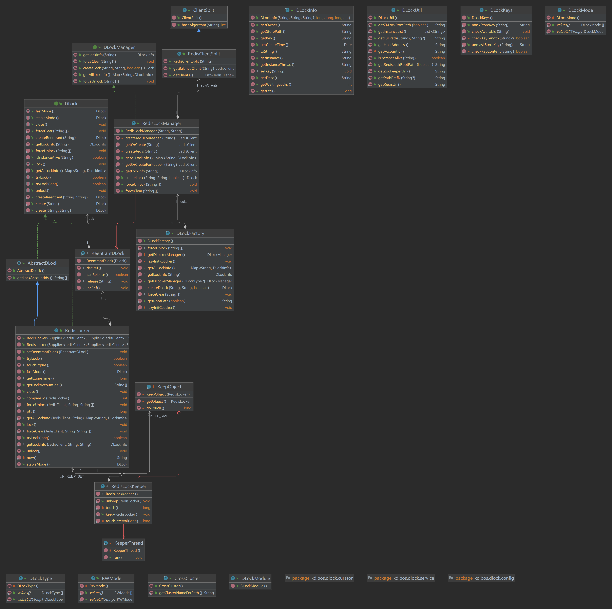

#### RedisLockManager redis分布式锁管理实现入口

一个用于统一创建和管理 RedisLocker 实例的 分布式锁管理器，它实现了 DLockManager 接口。该类在分布式系统中承担着“工厂 + 管理者”的角色，主要负责为不同业务场景提供可重入或非可重入的 Redis 分布式锁，并对这些锁进行统一的生命周期管理和资源协调

**核心作用：**

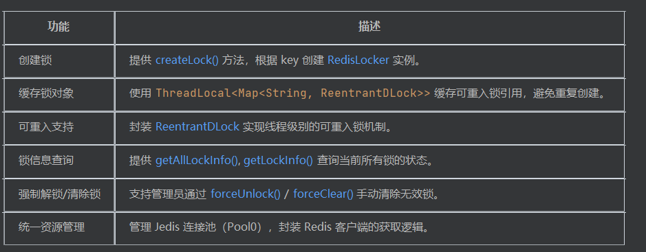

**核心字段**

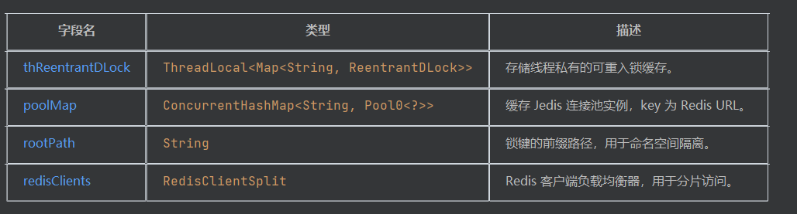

**核心方法：**

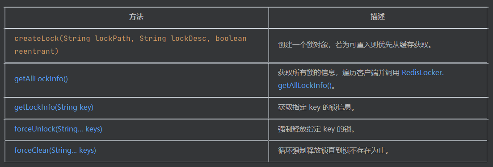

**内部类：ReentrantDLock**
	这是一个封装了引用计数的可重入锁包装类：
				incRef() / decRef()：增加/减少引用计数。
				canRelease()：判断是否可以释放锁。
				release()：从线程本地缓存中移除锁。

**与RedisLocker的区别**

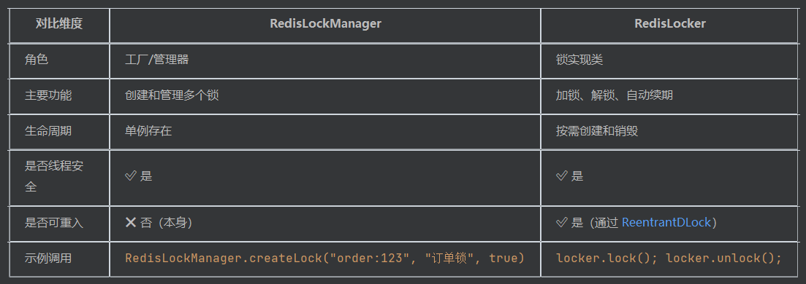

```java
package kd.bos.dlock.redis;

import java.util.HashMap;
import java.util.List;
import java.util.Map;
import java.util.concurrent.ConcurrentHashMap;
import kd.bos.bundle.Resources;
import kd.bos.dlock.DLock;
import kd.bos.dlock.DLockInfo;
import kd.bos.dlock.DLockManager;
import kd.bos.dlock.DLockUtil;
import kd.bos.encrypt.Encrypters;
import kd.bos.exception.BosErrorCode;
import kd.bos.exception.KDException;
import kd.bos.redis.JedisClient;
import kd.bos.redis.RedisTracker;
import kd.bos.redis.pool.Pool0;
import kd.bos.redis.pool.Pool0BuilderImpl;
import kd.bos.redis.wrapper.Wrapper;

public class RedisLockManager implements DLockManager {
  private static final ThreadLocal<Map<String, ReentrantDLock>> thReentrantDLock = ThreadLocal.withInitial(() -> new HashMap<>());
  
  private static ConcurrentHashMap<String, Pool0<?>> poolMap = new ConcurrentHashMap<>();
  
  private final String rootPath;
  
  private final RedisClientSplit redisClients;
  
  static JedisClient getOrCreate(String url) {
    Pool0<?> pool = poolMap.computeIfAbsent(url, key -> {
          try {
            return Pool0BuilderImpl.getPool(Encrypters.decode(key));
          } catch (Exception e) {
            throw new KDException(e, BosErrorCode.bOS, new Object[] { Resources.getString("bos-dlock", "RedisLockManager_0", new Object[0]) });
          } 
        });
    try {
      Object resource = pool.getResource();
      return (JedisClient)RedisTracker.track(Wrapper.wrap(resource));
    } catch (Exception e) {
      String msg = "Get JedisClient error: " + e.getMessage() + ",trackMessage:" + RedisTracker.getTrackMessage();
      throw new KDException(e, BosErrorCode.bOS, new Object[] { msg });
    } 
  }
  
  static JedisClient getOrCreateForKeeper(String url) {
    return getOrCreate(url);
  }
  
  static class ReentrantDLock {
    private DLock lock;
    
    private int ref;
    
    ReentrantDLock(DLock lock) {
      this.lock = lock;
      this.ref = 0;
    }
    
    void incRef() {
      this.ref++;
    }
    
    void decRef() {
      this.ref--;
    }
    
    boolean canRelease() {
      return (this.ref <= 0);
    }
    
    void release(String lockKey) {
      ((Map)RedisLockManager.thReentrantDLock.get()).remove(lockKey);
    }
  }
  
  public RedisLockManager(String url, String rootPath) {
    this.rootPath = rootPath;
    this.redisClients = new RedisClientSplit(url);
  }
  
  private JedisClient createJedis(String lockPath) {
    return this.redisClients.getBalanceClient(lockPath);
  }
  
  private JedisClient createJedisForKeeper(String lockPath) {
    return this.redisClients.getBalanceClient(lockPath);
  }
  
  public DLock createLock(String lockPath, String lockDesc, boolean reentrant) {
    if (reentrant) {
      String str = DLockUtil.getFullPath(this.rootPath, lockPath);
      ReentrantDLock rd = (ReentrantDLock)((Map)thReentrantDLock.get()).get(str);
      if (rd != null)
        return rd.lock; 
    } 
    RedisLocker locker = new RedisLocker(() -> createJedis(lockPath), () -> createJedisForKeeper(lockPath), lockPath, lockDesc, this.rootPath);
    String fullPath = DLockUtil.getFullPath(this.rootPath, lockPath);
    if (reentrant) {
      ReentrantDLock rd = new ReentrantDLock(locker);
      locker.setReentrantDLock(rd);
      ((Map<String, ReentrantDLock>)thReentrantDLock.get()).put(fullPath, rd);
    } 
    return locker;
  }
  
  public Map<String, DLockInfo> getAllLockInfo() {
    Map<String, DLockInfo> map = new HashMap<>();
    List<JedisClient> clients = this.redisClients.getClients();
    for (int i = 0; i < clients.size(); i++) {
      try (JedisClient jedis = (JedisClient)clients.get(i)) {
        RedisLocker.getAllLockInfo(jedis, this.rootPath).forEach((key, dlockInfo) -> (DLockInfo)map.putIfAbsent(key, dlockInfo));
      } catch (Exception e) {
        throw new KDException(BosErrorCode.jedisException, "dlock key:" + this.rootPath + " to getAllLockInfo failed", e);
      } 
    } 
    return map;
  }
  
  public DLockInfo getLockInfo(String key) {
    try (JedisClient jedis = this.redisClients.getBalanceClient(key)) {
      return RedisLocker.getLockInfo(jedis, key, this.rootPath);
    } 
  }
  
  public void forceUnlock(String... keys) {
    for (String key : keys) {
      try (JedisClient jedis = this.redisClients.getBalanceClient(key)) {
        RedisLocker.forceUnlock(jedis, this.rootPath, new String[] { key });
      } 
    } 
  }
  
  public void forceClear(String... keys) {
    for (String key : keys) {
      try (JedisClient jedis = this.redisClients.getBalanceClient(key)) {
        RedisLocker.forceClear(jedis, this.rootPath, keys);
      } 
    } 
  }
}

```

#### RedisLocker Redis锁核心实现类

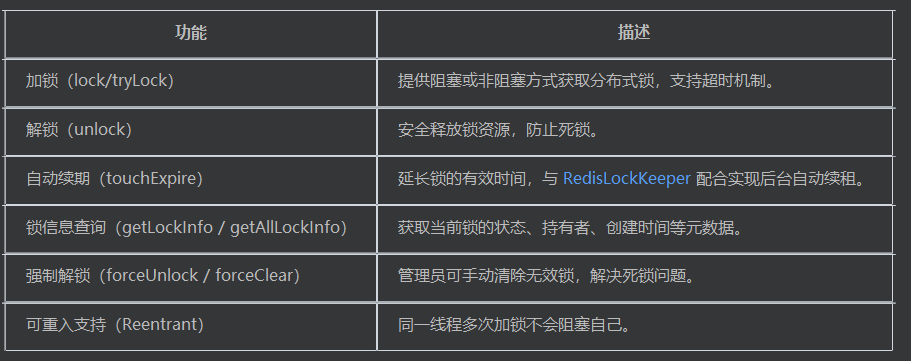

**关键特性**

1. Redis Lua 脚本保证原子性
   使用 Redis 的 EVAL 命令执行 Lua 脚本，确保加锁、解锁、续期等操作具备原子性，避免并发问题：

   ​	加锁脚本（LOCK_SET_SCRIPT）
   ​	解锁脚本（UNLOCK_SCRIPT）
   ​	强制解锁脚本（FORCE_UNLOCK_SCRIPT）

2. 锁信息结构化存储
  每个锁以 Hash 类型存储在 Redis 中，字段包括：

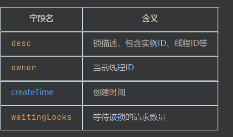

3. 自动续期机制（touchExpire）

   `boolean touchExpire()`

​	用于延长锁的过期时间，被 RedisLockKeeper 调用实现后台自动续租。
4. 锁存活检测（isInstanceAlive）
通过检查锁持有者的实例状态，判断是否为“僵尸锁”，从而进行清理。
5. 可重入支持（Reentrant）
通过 RedisLockManager.ReentrantDLock 封装引用计数，实现线程级别的可重入锁语义。

```java
package kd.bos.dlock.redis;

import java.text.ParseException;
import java.text.SimpleDateFormat;
import java.util.Date;
import java.util.HashMap;
import java.util.Map;
import java.util.Objects;
import java.util.Set;
import java.util.TreeSet;
import java.util.function.Supplier;
import kd.bos.dlock.AbstractDLock;
import kd.bos.dlock.DLock;
import kd.bos.dlock.DLockInfo;
import kd.bos.dlock.DLockUtil;
import kd.bos.instance.Instance;
import kd.bos.redis.JedisClient;
import kd.bos.util.DisCardUtil;
import org.slf4j.Logger;
import org.slf4j.LoggerFactory;

public class RedisLocker extends AbstractDLock implements DLock, Comparable<RedisLocker> {
  private static final Logger log = LoggerFactory.getLogger(RedisLocker.class);
  
  private static final String ACQUIRED_INSTANCE = Instance.getInstanceId();
  
  static final long defaultExpireTime = 300000L;
  
  private static final String FIELD_DESC = "desc";
  
  private static final String FIELD_OWNER = "owner";
  
  private static final String FIELD_WAITING_LOCKS = "waitingLocks";
  
  private static final String FIELD_CREATE_TIME = "createTime";
  
  private static final String LOCK_SET_SCRIPT = "redis.call('pexpire', KEYS[1], ARGV[1]); redis.call('hset', KEYS[1], 'desc', ARGV[2]); redis.call('hset', KEYS[1], 'createTime', ARGV[3]); redis.call('hset', KEYS[1], 'owner', ARGV[4]); local waitLock = tonumber(redis.call('hget', KEYS[1] ,'waitingLocks')); if waitLock ~= nil and waitLock > 0 then   redis.call('hincrBy', KEYS[1], 'waitingLocks', -1); end;";
  
  private static final String UNLOCK_SCRIPT = "local waitingLocks=tonumber(redis.call('hget', KEYS[1] ,'waitingLocks')); local field = ARGV[1];local threadId=redis.call('hget', KEYS[1], 'owner');if threadId~=nil and threadId==field then if waitingLocks==nil or waitingLocks<= 0 then redis.call('del', KEYS[1]) else redis.call('hdel', KEYS[1], 'desc') end;end;";
  
  private static final String FORCE_UNLOCK_SCRIPT = "local waitingLocks=tonumber(redis.call('hget', KEYS[1] ,'waitingLocks')); if waitingLocks==nil or waitingLocks<= 0 then redis.call('del', KEYS[1]) else redis.call('hdel', KEYS[1], 'desc') end";
  
  private static final String RELEASE_NOT_LIVE_SCRIPT = "local field = ARGV[1];local instanceId = redis.call('hget', KEYS[1], KEYS[2]); if instanceId ~= nil and instanceId ~= ' ' then local index = string.find(instanceId, '#');instanceId = index and string.sub(instanceId, 1, index -1) or instanceId;if instanceId==field then redis.call('HDEL', KEYS[1], KEYS[2]); local waitLock = tonumber(redis.call('hget', KEYS[1] ,'waitingLocks'));if waitLock ~= nil and waitLock > 0 then redis.call('hincrBy', KEYS[1], 'waitingLocks', -1);end;end;end;";
  
  private static final String WAITING_LOCKS_WAITING_DECR = "local waitLock = tonumber(redis.call('hget', KEYS[1] ,'waitingLocks'));if waitLock ~= nil and waitLock > 0 then  redis.call('hincrBy', KEYS[1], 'waitingLocks', -1);end;";
  
  private static final long MIN_EXPIRE_TIME = 30000L;
  
  private static final long MAX_RETRY_INTERVAL = 1000L;
  
  private static final ThreadLocal<SimpleDateFormat> TH_SDF = ThreadLocal.withInitial(() -> new SimpleDateFormat("yyyy-MM-dd HH:mm:ss.SSS"));
  
  private long expireTime;
  
  private Supplier<JedisClient> jedisCreator;
  
  private Supplier<JedisClient> keeperAloneJedis;
  
  private String lockKey;
  
  private String lockDesc;
  
  private static String now() {
    return ((SimpleDateFormat)TH_SDF.get()).format(new Date());
  }
  
  private volatile boolean acquired = false;
  
  private final Object unlockObj = new Object();
  
  private RedisLockManager.ReentrantDLock rd;
  
  private final String rootPath;
  
  public RedisLocker(Supplier<JedisClient> jedisCreator, Supplier<JedisClient> keeperAloneJedis, String lockKey, String lockDesc, String keyPrefix) {
    this(jedisCreator, keeperAloneJedis, lockKey, lockDesc, keyPrefix, 300000L);
  }
  
  public RedisLocker(Supplier<JedisClient> jedisCreator, Supplier<JedisClient> keeperAloneJedis, String lockKey, String lockDesc, String keyPrefix, long expireTime) {
    if (expireTime < 30000L)
      expireTime = 30000L; 
    Objects.requireNonNull(lockKey, "Lock key can not be null.");
    this.jedisCreator = jedisCreator;
    this.keeperAloneJedis = keeperAloneJedis;
    this.rootPath = keyPrefix;
    this.lockKey = DLockUtil.getFullPath(keyPrefix, lockKey);
    this.lockDesc = ACQUIRED_INSTANCE + '#' + DLockUtil.getHostAddress() + '#' + Thread.currentThread() + '#' + ((lockDesc == null) ? "" : lockDesc);
    this.expireTime = expireTime;
  }
  
  public String[] getLockAccountIds() {
    try (JedisClient jedis = (JedisClient)this.jedisCreator.get()) {
      Set<String> accountIds = jedis.keys(this.rootPath + "*");
      if (accountIds.isEmpty())
        return empty_strings; 
      Set<String> ret = new TreeSet<>();
      for (String key : accountIds) {
        key = key.substring(this.rootPath.length());
        int i = key.indexOf('/');
        if (i != -1)
          ret.add(key.substring(0, i)); 
      } 
      if (ret.isEmpty())
        return empty_strings; 
      return ret.<String>toArray(new String[ret.size()]);
    } 
  }
  
  public void setReentrantDLock(RedisLockManager.ReentrantDLock rd) {
    this.rd = rd;
  }
  
  boolean touchExpire() {
    try (JedisClient jedis = (JedisClient)this.keeperAloneJedis.get()) {
      return (1L == jedis.pexpire(this.lockKey, this.expireTime).longValue());
    } 
  }
  
  long pttl() {
    try (JedisClient jedis = (JedisClient)this.jedisCreator.get()) {
      return jedis.pttl(this.lockKey).longValue();
    } 
  }
  
  long getExpireTime() {
    return this.expireTime;
  }
  
  public void lock() {
    tryLock(Long.MAX_VALUE);
  }
  
  public boolean tryLock() {
    return tryLock(1L);
  }
  
  public boolean tryLock(long msTimeout) {
    boolean reentry = false;
    if (this.rd != null) {
      reentry = true;
      if (this.rd.canRelease()) {
        this.rd.incRef();
      } else {
        this.rd.incRef();
        return true;
      } 
    } 
    if (this.acquired)
      throw new IllegalStateException("Has acquired"); 
    log.info("acquire lock " + this.lockKey + "..." + (reentry ? " reentryDLock" : ""));
    JedisClient jedis = this.jedisCreator.get();
    try {
      jedis.hincrBy(this.lockKey, "waitingLocks", 1L);
      long sleep = Math.min(msTimeout, 1000L);
      long ts = System.currentTimeMillis();
      while (jedis.hsetnx(this.lockKey, "desc", ACQUIRED_INSTANCE).longValue() != 1L) {
        String instanceId = jedis.hget(this.lockKey, "desc");
        if (instanceId != null) {
          int i = instanceId.indexOf('#');
          if (i != -1)
            instanceId = instanceId.substring(0, i); 
          if (!ACQUIRED_INSTANCE.equals(instanceId)) {
            log.info(String.format("check lock %s instance %s if alive before...", new Object[] { this.lockKey, instanceId }));
            if (!DLockUtil.isInstanceAlive(instanceId)) {
              log.info(String.format("del lock %s during instance %s dead...", new Object[] { this.lockKey, instanceId }));
              jedis.eval("local field = ARGV[1];local instanceId = redis.call('hget', KEYS[1], KEYS[2]); if instanceId ~= nil and instanceId ~= ' ' then local index = string.find(instanceId, '#');instanceId = index and string.sub(instanceId, 1, index -1) or instanceId;if instanceId==field then redis.call('HDEL', KEYS[1], KEYS[2]); local waitLock = tonumber(redis.call('hget', KEYS[1] ,'waitingLocks'));if waitLock ~= nil and waitLock > 0 then redis.call('hincrBy', KEYS[1], 'waitingLocks', -1);end;end;end;", 2, new String[] { this.lockKey, "desc", instanceId });
              continue;
            } 
            log.info(String.format("check lock %s instance %s still alive...", new Object[] { this.lockKey, instanceId }));
          } 
        } 
        if (sleep > 0L)
          try {
            jedis.close();
            Thread.sleep(sleep);
            jedis = this.jedisCreator.get();
          } catch (InterruptedException e) {
            throw new RuntimeException(e);
          }  
        if (System.currentTimeMillis() - ts >= msTimeout) {
          jedis.eval("local waitLock = tonumber(redis.call('hget', KEYS[1] ,'waitingLocks'));if waitLock ~= nil and waitLock > 0 then  redis.call('hincrBy', KEYS[1], 'waitingLocks', -1);end;", 1, new String[] { this.lockKey });
          return false;
        } 
      } 
      this.acquired = true;
      jedis.eval("redis.call('pexpire', KEYS[1], ARGV[1]); redis.call('hset', KEYS[1], 'desc', ARGV[2]); redis.call('hset', KEYS[1], 'createTime', ARGV[3]); redis.call('hset', KEYS[1], 'owner', ARGV[4]); local waitLock = tonumber(redis.call('hget', KEYS[1] ,'waitingLocks')); if waitLock ~= nil and waitLock > 0 then   redis.call('hincrBy', KEYS[1], 'waitingLocks', -1); end;", 1, new String[] { this.lockKey, String.valueOf(this.expireTime), this.lockDesc, now(), 
            String.valueOf(Thread.currentThread().getId()) });
      log.info("acquired lock " + this.lockKey + (reentry ? " reentryDLock" : ""));
    } catch (Exception e) {
      log.info("acquire lock failed " + this.lockKey + (reentry ? " reentryDLock" : ""));
      throw e;
    } finally {
      if (jedis != null)
        jedis.close(); 
    } 
    RedisLockKeeper.keep(this);
    return true;
  }
  
  public void unlock() {
    if (!this.acquired)
      return; 
    log.info("release lock " + this.lockKey + "...");
    if (this.rd != null) {
      this.rd.decRef();
      if (!this.rd.canRelease())
        return; 
      this.rd.release(this.lockKey);
    } 
    if (this.acquired)
      synchronized (this.unlockObj) {
        try (JedisClient jedis = (JedisClient)this.jedisCreator.get()) {
          if (this.acquired) {
            this.acquired = false;
            jedis.eval("local waitingLocks=tonumber(redis.call('hget', KEYS[1] ,'waitingLocks')); local field = ARGV[1];local threadId=redis.call('hget', KEYS[1], 'owner');if threadId~=nil and threadId==field then if waitingLocks==nil or waitingLocks<= 0 then redis.call('del', KEYS[1]) else redis.call('hdel', KEYS[1], 'desc') end;end;", 1, new String[] { this.lockKey, String.valueOf(Thread.currentThread().getId()) });
            RedisLockKeeper.unkeep(this);
          } 
        } catch (Exception e) {
          log.info("release lock failed " + this.lockKey + "...");
          throw e;
        } 
      }  
  }
  
  public void close() {
    unlock();
  }
  
  public DLock fastMode() {
    return this;
  }
  
  public DLock stableMode() {
    return this;
  }
  
  public int compareTo(RedisLocker o) {
    return this.lockKey.compareTo(o.lockKey);
  }
  
  static DLockInfo getLockInfo(JedisClient jedis, String lockKey, String keyPrefix) {
    String fullLockKey = DLockUtil.getFullPath(keyPrefix, lockKey);
    Map<String, String> map = jedis.hgetAll(fullLockKey);
    if (!map.isEmpty()) {
      String createTime = map.get("createTime");
      String desc = map.get("desc");
      String owner = map.get("owner");
      String waitingLocks = map.get("waitingLocks");
      long n_owner = (owner == null) ? 0L : Long.parseLong(owner);
      long n_createTime = 0L;
      try {
        n_createTime = (createTime == null) ? 0L : ((SimpleDateFormat)TH_SDF.get()).parse(createTime).getTime();
      } catch (ParseException e) {
        DisCardUtil.discard();
      } 
      int n_waitingLocks = (waitingLocks == null) ? 0 : Integer.parseInt(waitingLocks);
      long pttl = jedis.pttl(fullLockKey).longValue();
      return new DLockInfo(lockKey, fullLockKey, desc, n_owner, n_createTime, pttl, n_waitingLocks);
    } 
    return null;
  }
  
  static Map<String, DLockInfo> getAllLockInfo(JedisClient jedis, String keyPrefix) {
    String prefix = DLockUtil.getPathPrefix(keyPrefix);
    int len = prefix.length();
    Map<String, DLockInfo> map = new HashMap<>();
    for (String fullLockKey : jedis.keys(prefix + "*")) {
      String lockKey = fullLockKey.substring(len);
      DLockInfo lock = getLockInfo(jedis, lockKey, keyPrefix);
      if (lock != null)
        map.put(lockKey, lock); 
    } 
    return map;
  }
  
  static void forceUnlock(JedisClient jedis, String rootPath, String... keys) {
    for (String key : keys) {
      String fullLockKey = DLockUtil.getFullPath(rootPath, key);
      log.info("unlock path :" + fullLockKey);
      jedis.eval("local waitingLocks=tonumber(redis.call('hget', KEYS[1] ,'waitingLocks')); if waitingLocks==nil or waitingLocks<= 0 then redis.call('del', KEYS[1]) else redis.call('hdel', KEYS[1], 'desc') end", 1, new String[] { fullLockKey });
    } 
  }
  
  static void forceClear(JedisClient jedis, String rootPath, String... keys) {
    for (String key : keys) {
      log.info("clear lock path :" + keys);
      forceUnlock(jedis, rootPath, new String[] { key });
      while (getLockInfo(jedis, key, rootPath) != null) {
        forceUnlock(jedis, rootPath, new String[] { key });
      } 
    } 
  }
}

```
#### RedisLockKeeper 

​	RedisLocker.tryLock() -> RedisLockKeeper.keep(this);

​	是用于维护 Redis 分布式锁（RedisLocker）的自动续租机制，确保在锁未释放前其不会因超时而失效。

**主要功能：**

- 自动续锁（Touch） 定期调用 RedisLocker.touchExpire() 方法延长锁的有效期。
- 管理待续锁对象 使用 KEEP_MAP 存储需要续期的锁对象，使用弱引用避免内存泄漏。
- 并发安全与线程守护 启动一个后台守护线程 KeeperThread 持续执行续锁任务。

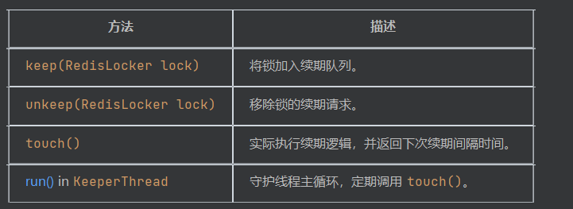

**设计亮点**

- 使用 WeakReference 避免内存泄漏：锁对象回收后会自动从 KEEP_MAP 中清除。
- 线程安全集合：ConcurrentHashMap 和 ConcurrentSkipListSet 支持高并发访问。
- 自适应续期间隔：根据锁的剩余有效期动态调整续期频率

```java
package kd.bos.dlock.redis;

import java.lang.ref.WeakReference;
import java.util.ArrayList;
import java.util.Map;
import java.util.Set;
import java.util.concurrent.ConcurrentHashMap;
import java.util.concurrent.ConcurrentSkipListSet;
import kd.bos.util.DisCardUtil;

class RedisLockKeeper {
  private static final long DEFAULT_TOUCH_INTERVAL = touchInterval(300000L);
  
  private static final Map<KeepObject, Long> KEEP_MAP = new ConcurrentHashMap<>();
  
  private static final Set<RedisLocker> UN_KEEP_SET = new ConcurrentSkipListSet<>();
  
  private static final Object TOUCH_LOCK = new Object();
  
  private static class KeepObject {
    private long lastTouchTS;
    
    private long expireTimeTS;
    
    private long touchIntervalTS;
    
    private WeakReference<RedisLocker> lockRef;
    
    private KeepObject(RedisLocker lock) {
      this.lockRef = new WeakReference<>(lock);
      this.expireTimeTS = lock.getExpireTime();
      this.lastTouchTS = System.currentTimeMillis();
      this.touchIntervalTS = RedisLockKeeper.touchInterval(this.expireTimeTS);
    }
    
    private RedisLocker getObject() {
      return this.lockRef.get();
    }
    
    private long doTouch() {
      if (System.currentTimeMillis() - this.lastTouchTS >= this.touchIntervalTS) {
        RedisLocker dlock = this.lockRef.get();
        if (dlock == null)
          return 1L; 
        if (dlock.touchExpire()) {
          this.lastTouchTS = System.currentTimeMillis();
        } else {
          this.lockRef.clear();
          return 1L;
        } 
      } 
      return this.touchIntervalTS;
    }
  }
  
  private static class KeeperThread extends Thread {
    private KeeperThread() {
      setDaemon(true);
      setName(RedisLockKeeper.class.getSimpleName());
    }
    
    public void run() {
      while (true) {
        try {
          long last = RedisLockKeeper.touch();
          synchronized (RedisLockKeeper.TOUCH_LOCK) {
            if (last > 0L) {
              RedisLockKeeper.TOUCH_LOCK.wait(last);
            } else {
              RedisLockKeeper.TOUCH_LOCK.wait(RedisLockKeeper.DEFAULT_TOUCH_INTERVAL);
            } 
          } 
        } catch (Exception e) {
          DisCardUtil.discard();
        } 
      } 
    }
  }
  
  static {
    (new KeeperThread()).start();
  }
  
  private static long touchInterval(long timeout) {
    return timeout / 2L;
  }
  
  private static long touch() {
    long minTS = -1L;
    for (KeepObject obj : new ArrayList(KEEP_MAP.keySet())) {
      RedisLocker lock = obj.getObject();
      if (lock == null || UN_KEEP_SET.remove(lock)) {
        KEEP_MAP.remove(obj);
        continue;
      } 
      try {
        long ts = obj.doTouch();
        if (minTS == -1L || minTS > ts)
          minTS = ts; 
      } catch (Exception e) {
        DisCardUtil.discard();
      } 
    } 
    return minTS;
  }
  
  public static void keep(RedisLocker lock) {
    KEEP_MAP.put(new KeepObject(lock), Long.valueOf(1L));
    synchronized (TOUCH_LOCK) {
      TOUCH_LOCK.notify();
    } 
  }
  
  public static void unkeep(RedisLocker lock) {
    UN_KEEP_SET.add(lock);
    if (KEEP_MAP.size() < 100)
      synchronized (TOUCH_LOCK) {
        TOUCH_LOCK.notify();
      }  
  }
}

```

