# kd-隐私中心-数据脱敏与数据加密


<!--more-->

## 产品概述

### 产品介绍

《中华人民共和国个人信息保护法》自2021年11月1日起施行，需要针对软件中涉及个人隐私的数据进行脱敏处理，确保产品符合国家个保法规。 苍穹业务产品包含大量隐私数据，从数据安全管理周期来看，需要对数据从存储、查询、显示、匿名化（退出）等阶段涉及到的敏感数据进行加密、脱敏等处理，业务产品单独处理会面临管控难度大、开发成本大、灵活度差等问题。

### 产品结构图

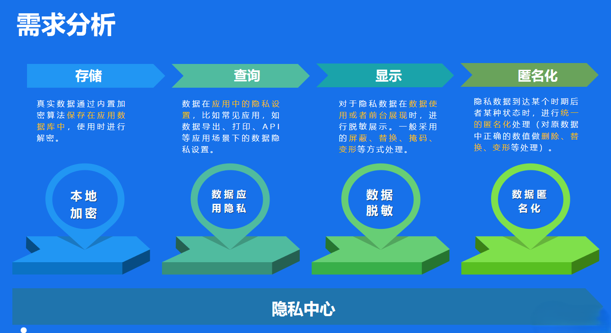

### 名词解释

| 名词     | 说明                                                         |
| -------- | ------------------------------------------------------------ |
| 数据脱敏 | 数据脱敏（Data Masking），顾名思义，是屏蔽敏感数据，对某些敏感信息（比如，身份证号、手机号、卡号、客户姓名、客户地址、邮箱地址、薪资等等 ）通过脱敏规则进行数据的变形，实现隐私数据的可靠保护。业界常见的脱敏规则有，替换、重排、加密、截断、掩码。 |
| 数据加密 | 数据加密，是利用密码技术对信息进行加密，实现信息隐蔽，从而起到保护信息的安全的作用。 |

### 功能清单

| 功能         | 说明                                                         | 备注                                                   |
| ------------ | ------------------------------------------------------------ | ------------------------------------------------------ |
| 数据安全标签 | 为了更好的管理安全隐私数据，而对业务对象的字段进行的标签化管理，一般常用的数据安全标签可分为个人隐私数据、个人敏感数据等等。 | 一般按照应用或者数据安全领域隔离，方便隐私方案统一设置 |
| 隐私方案配置 | 为数据安全标签中各字段设置具体的加密方式、脱敏策略、权限控制以及解密控制，隐私方案在运行期设置，在运行期立即生效。 | 可能触发历史数据加密迁移                               |
| 数据处理     | 对后台异步加密任务的处理情况进行实时监控。                   |                                                        |
| 全局控制     | 对隐私方案进行的全局设置。                                   | 全局参数控制脱敏与加密                                 |
| 加密方案     | 提供对加密算法和密钥的统一管理和配置能力。                   |                                                        |

流程图如下：


graph LR;
    A[元数据字段集合] --> B(数据安全标签)
    B --> C(隐私方案)
    C -->|存在旧数据| D(数据处理)
    E(加密方案) --> C
    F(脱敏规则) --> C


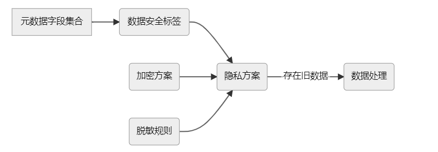


#### 数据安全标签

数据安全标签是为更好的管理安全隐私数据，而对业务对象的字段进行的标签化管理。一般常用的隐私标签可分为个人隐私数据、个人敏感数据等等，在配置隐私方案前必须先维护数据标签。

**注意事项** 

（1）安全数据标签已经被隐私方案引用，则不能删除安全数据标签。

（2）标签中的字段已经被隐私方案引用并且字段已经设置加密或脱敏规则，则不能删除该字段。

（3）同一个字段只能被一个标签引用。

#### **隐私方案**

隐私方案能够为数据安全标签中各字段设置具体的加密方式、脱敏策略、权限控制以及解密控制。隐私方案在运行期设置，在运行期立即生效。

**注意事项** 

（1）数据安全标签不能被多个隐私方案引用。

（2）隐私方案如果已经存在加密的数据是不允许删除的。

（3）如果隐私方案正在做加解密处理的字段，状态设置为发布中，无法对方案进行修改。

（4）多个字段使用了一个相同物理表，此时如果一个字段已经配置加密方案，则其他字段的加密方案按照物理表的字段已配置的加密方案默认填充。

（5）当字段需要进行加密处理，存在历史数据迁移情况，会提示产生新的数据处理任务。

（6）当修改字段的加密方式，存在历史数据从加密方式替换的情况，会提示产生新的数据处理任务。

#### 数据处理

在我们对数据进行加密时，一般会遇到三种操作场景：1、字段加密；2、算法替换；3、秘钥替换；此时系统会对数据库中数据进行数据加密或者数据解密、再加密这些复杂的工序，为了保证系统的稳定，平台将此复杂的数据处理工序做成后台异步任务，并且支持实时监控任务处理情况。

 **注意事项**

（1）任务状态为进行中时相应的实体单据将锁定，无法访问。

（2）数据完成加密迁移后，系统会自动生成一个加密数据表存放加密数据，表名为：原表名_py。加密完成后，原表的明文数据会清空。

#### 加密方案

对于算法以及密钥的管理，在不同场景有者不同需求，有些场景需要有独立的加密算法与密钥（如HR薪资模块期望有自己独立的加密算法与密钥），有些场景会定期更换密钥，所以隐私中心提供了统一的加密方案配置功能。

**注意事项**

（1）使用状态将控制隐私方案中可选择的加密方式，禁用已经被引用的加密方案，不影响现有数据的加密方案。

（2）加密算法平台默认支持AES 128和SM4 128，可以自定义扩展其他加密算法。

（3）在自定义加密算法时，平台JDK版本支持128位，所以您扩展的更多位数的加密算法可能在加密方案中选择不到，这时您需要升级JDK或者在当前版本替换相应的JAR包。

#### 脱敏权限

在日常业务中，由于不同岗位的权限范围有所不同，因此对于数据的脱敏展示也需要根据权限来进行划分。如付款业务中，出于个人隐私考虑，流程相关人员是不允许查看申请人的银行账号的，但在付款时，出纳人员是可以查看银行账号的。对于这样场景，我们就需要我们的脱敏控制支持按人员、按角色进行脱敏权限的设置。目前版本仅支持按人员设置脱敏权限。

**注意事项**

（1）权限控制作用于表单、导出、打印。列表中如果开启权限控制，列字段固定为脱敏状态，无论是否配置授权人都不可显示出明文。

#### 脱敏规则

对于数据脱敏已经提供预置几种脱敏方式，比如身份证，姓名，电话号码的通用规则，而面对不同的业务场景仍然有特殊规则要求难以满足，因此为了提升隐私中心功能能力，为实施开发人员，提供自定义脱敏规则功能。

## 数据脱敏

### 数据处理流程

```java
public class DesensitizeStrategyFactory {

    private static final Log log = LogFactory.getLog("DesensitizeStrategyFactory");
    
    private static Map<String, IDesensitizeStrategy> defaultMap = new ConcurrentHashMap<>(8);

    private static final String PRIVACY_DESENSITIZE_STRATEGY_REGION = "PRIVACY_DESENSITIZE_STRATEGY_REGION";

    static {
        initDefaultStrategy();
    }

    private static void initDefaultStrategy() {
        register(new LengthDesenStrategy());
        register(new HeadTailDesenStrategy());
        register(new FixLengthDesenStrategy());
        register(new TelephoneDesenStrategy());
        register(new NameDesenStrategy());
        register(new IdCardDesenStrategy());
        register(new BankAcctDesenStrategy());
    }

    /**
     * 从数据表加载
     */
    private static void initDB() {
        //加载所有的脱敏方案至内存
        List<String> numberList = new ArrayList<>(10);
        try (DataSet dataSet = QueryServiceHelper.queryDataSet("loadDesensitizationRules", "privacy_desen_rules", "id,number,ruletype,matchrules,replacement",
                new QFilter[]{new QFilter("number", QCP.not_equals, "NO")}, null)) {
            Map<String, IDesensitizeStrategy> strategyMap = new HashMap<>(16);
            while (dataSet.hasNext()) {
                Row data = dataSet.next();
                String number = data.getString("number");
                IDesensitizeStrategy strategy = defaultMap.get(number);
                
                if (strategy == null && IPrivacyConst.GLOBAL.DESENSITIZATION_RULE_REGULAR.equals(data.getString("ruletype"))) {
                    //如果正则表达式， 则将当前脱敏策略加载到内存中
                    strategy = new RegularDesenStrategy(data.getString("matchrules"), data.getString("replacement"));
                    numberList.add(number);
                }
                //脱敏策略的值可能为number或id，需要把初始脱敏策略也用id设置到内存中，否则会找不到策略
                strategyMap.put(data.getString("id"), strategy);
            }
            getLocalCache().put("allDesensitizationRules", strategyMap);
        }
        log.info("kd.bos.privacy.service.DesensitizeStrategyFactory.initDB(), data={}", numberList);
    }

    /**
     * 重新加载脱敏规则
     */
    public static void reload() {
        getLocalCache().clear();
        log.info("kd.bos.privacy.service.DesensitizeStrategyFactory.reload()");
        initDB();
    }

    public static void register(IDesensitizeStrategy strategy) {
        defaultMap.put(strategy.getStrategyName(), strategy);
    }

    public static IDesensitizeStrategy unregister(String name) {
        return defaultMap.remove(name);
    }

    public static IDesensitizeStrategy getStrategy(String name) {
        IDesensitizeStrategy strategy = defaultMap.get(name);
        
        if (strategy == null) {
            Map<String, IDesensitizeStrategy> strategyMap = (Map<String, IDesensitizeStrategy>) getLocalCache().get("allDesensitizationRules");
            if (strategyMap == null) {
                //未从缓存加载到策略，则需要重新加载缓存获取
                initDB();
                strategyMap = (Map<String, IDesensitizeStrategy>) getLocalCache().get("allDesensitizationRules");
            }
            strategy = strategyMap.get(name);
        }
        return strategy;
    }

    private static LocalMemoryCache getLocalCache() {
        CacheConfigInfo info = new CacheConfigInfo();
        // 缓存超时时间30分钟
        info.setTimeout(1800);
        // 最大缓存
        info.setMaxItemSize(500);
        return CacheFactory.getCommonCacheFactory()
                .$getOrCreateLocalMemoryCache(RequestContext.getOrCreate().getAccountId(), PRIVACY_DESENSITIZE_STRATEGY_REGION, info);
    }


}
```

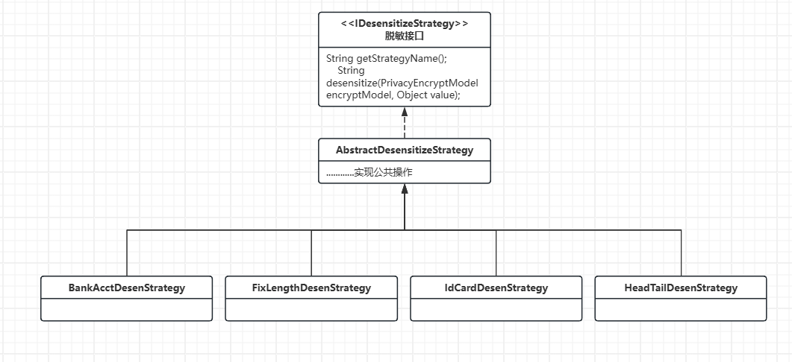

使用了‌**工厂模式**‌和‌**策略模式**‌的组合设计

#### **工厂模式（Factory Pattern）**‌

- ‌**体现**‌：通过`DesensitizeStrategyFactory`集中管理所有脱敏策略的创建和获取，隐藏具体实现类的实例化过程。
  - ‌**解耦**‌：调用方无需关心策略的具体实现（如`RegularDesenStrategy`的构造参数）。
  - ‌**扩展性**‌：新增策略时只需注册到工厂（如`register(new EmailDesenStrategy())`），无需修改客户端代码。

------

#### **策略模式（Strategy Pattern）**‌

- ‌**体现**‌：通过`IDesensitizeStrategy`接口定义统一的脱敏行为，不同策略（如`TelephoneDesenStrategy`、`IdCardDesenStrategy`）实现各自算法。
  - ‌**灵活替换**‌：运行时动态切换策略（如从数据库加载正则表达式规则）。
  - ‌**单一职责**‌：每种策略只处理一类数据的脱敏逻辑（如手机号、身份证号）。

------

#### **组合优势**‌

- ‌**配置化能力**‌：结合数据库动态加载规则（`initDB()`），实现业务规则与代码分离。
- ‌**性能优化**‌：通过`ConcurrentHashMap`缓存策略实例，避免重复创建对象。
- ‌**标准化接口**‌：所有策略遵循`IDesensitizeStrategy`，便于统一管理和监控。

### 脱敏规则

本质上是一个正则表达式

## 数据加密

### 设计模式

在运行时元数据上，将需要加密的字段的属性转换为隐私属性，并设置对应的隐私服务实现，在数据查询和保存阶段，通过对应数据的隐私实现加密或者解密数据。

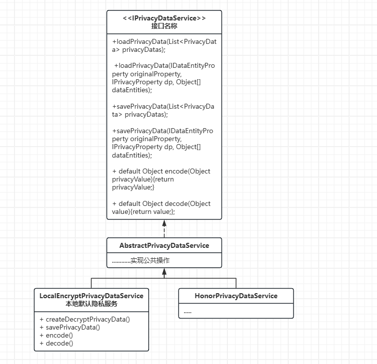

### 数据处理流程


#### **数据查询入口 BusinessDataServiceHelper**

```java
public Object[] read(ReadWhere where) {
    assert where != null;

    // 读取数据到表模型上

    QuickDataSet dataSet = readToDataSet(this.getDatabase(), this.getDataEntityTypeMap().getDbTable(), where);

    // 表模型转化为对象模型
    Object[] entities = dataSetToEntities(dataSet);

    privacyDataToEntities(entities, this.getDataEntityTypeMap());

    handlePrivacyDataEntities(entities, this.getDataEntityTypeMap());

    // 填充实体的快照数据
    SetEntitySnapshot(entities, dataSet);

    return entities;
}
```

#### privacyDataToEntities	处理数据解密

```java
private void privacyDataToEntities(Object[] dataEntities, DataEntityTypeMap dataEntityTypeMap) {
    IDataEntityType dt = dataEntityTypeMap.getDataEntityType();
    for (ComplexPropertyMap cpxPropMap : dataEntityTypeMap.getComplexProperties()) {
        List<Object> list = new ArrayList<>(16);
        IDataEntityProperty cpxPropType = cpxPropMap.getDataEntityProperty();
        for (Object obj : dataEntities) {
            list.add(cpxPropType.getValue(obj));
        }
        privacyDataToEntities(list.toArray(new Object[list.size()]), cpxPropMap.getComplexPropertyTypeMap());
    }
    for (CollectionPropertyMap colPropMap : dataEntityTypeMap.getCollectionProperties()) {
        ICollectionProperty colp = colPropMap.getDataEntityProperty();
        for (Object obj : dataEntities) {
            List<?> list = (List<?>) colp.getValue(obj);
            privacyDataToEntities(list.toArray(new Object[list.size()]),
                                  colPropMap.getCollectionItemPropertyTypeMap());
        }
    }
    List<IPrivacyProperty> privacyProperties = new ArrayList<>(16);
    for (SimplePropertyMap splMap : dataEntityTypeMap.getSimpleProperties()) {
        // 具体的隐私属性应该是在某个位置设置过
        IDataEntityProperty sp = splMap.getDataEntityProperty();
        if (sp instanceof IPrivacyProperty) {
            privacyProperties.add((IPrivacyProperty) sp);
        }
    }
    DataEntityPropertyCollection properties = dt.getProperties();
    Map<String, IDataEntityProperty> simpleProperties = new HashMap<>(16);
    for (IDataEntityProperty prop : properties) {
        if (prop instanceof ISimpleProperty) {
            simpleProperties.put(prop.getName(), prop);
        }
    }
    // 该实体类对应的所有隐私属性
    for (IPrivacyProperty privacyProperty : privacyProperties) {
        String controlFieldKey = privacyProperty.getOriginalPropKey();
        IDataEntityProperty originalProperty = simpleProperties.get(controlFieldKey);
        IPrivacyDataService pds = privacyProperty.getPrivacyDataService();
        if (pds != null) {
            // 加载解密隐私数据
            pds.loadPrivacyData(originalProperty, privacyProperty, dataEntities);
        }
    }
}

```
**AbstractPrivacyDataService  隐私服务类 处理数据加密**

```java
package kd.bos.dataentity.privacy;

import java.util.ArrayList;
import java.util.List;

import kd.bos.dataentity.metadata.IDataEntityProperty;
import kd.bos.dataentity.utils.StringUtils;

public class AbstractPrivacyDataService implements IPrivacyDataService {

    
    public void loadPrivacyData(IDataEntityProperty originalProperty, IPrivacyProperty dp, Object[] dataEntities) {

        List<PrivacyMappingData> mappingDatas = new ArrayList<PrivacyMappingData>();
        List<PrivacyData> privacyDatas = new ArrayList<PrivacyData>();
        for (int i = 0; i < dataEntities.length; i++) {
            Object dataEntity = dataEntities[i];
            if (dataEntity != null) {
                PrivacyMappingData mappingData = new PrivacyMappingData();
                String privacyStr = (String) dp.getValueFast(dataEntity);
                if(StringUtils.isNotBlank(privacyStr)) {
                    mappingData.setPrivacyProp(dp);
                    mappingData.setRowDataEntity(dataEntity);
                    mappingDatas.add(mappingData);
                    PrivacyData pd = createDecryptPrivacyData(originalProperty,privacyStr);
                    privacyDatas.add(pd);
                }
            }
        }
        loadPrivacyData(privacyDatas);
        for (int i = 0; i < mappingDatas.size(); i++) {
//              mappingData.setOriginalValue(val);
            PrivacyMappingData privacyMappingData = mappingDatas.get(i);
            Object dataEntity = privacyMappingData.getRowDataEntity();
            PrivacyData privacyData = privacyDatas.get(i);
            originalProperty.setValue(dataEntity, privacyData.getValue());
        }
    }

    public void savePrivacyData(IDataEntityProperty originalProperty, IPrivacyProperty dp, Object[] dataEntities) {
            List<PrivacyMappingData> mappingDatas = new ArrayList<PrivacyMappingData>();
            List<PrivacyData> privacyDatas = new ArrayList<PrivacyData>();
            for (int i = 0; i < dataEntities.length; i++) {
                Object dataEntity = dataEntities[i];
                if (dataEntity != null) {
                    PrivacyMappingData mappingData = new PrivacyMappingData();
                    Object val = originalProperty.getValueFast(dataEntity);
                    mappingData.setOriginalValue(val);
                    mappingData.setPrivacyProp(dp);
                    mappingData.setRowDataEntity(dataEntity);
                    mappingDatas.add(mappingData);
                    PrivacyData pd = createEncryptPrivacyData(originalProperty,val);
                    privacyDatas.add(pd);
                }
            }
            //保存隐私数据
            savePrivacyData(privacyDatas);
            //隐私信息反写实体
            for (int i = 0; i < mappingDatas.size(); i++) {
                PrivacyMappingData privacyMappingData = mappingDatas.get(i);
                Object dataEntity = privacyMappingData.getRowDataEntity();
                PrivacyData privacyData = privacyDatas.get(i);
                privacyMappingData.getPrivacyProp().setValue(dataEntity, privacyData.toString());
            }
    }

    protected PrivacyData createDecryptPrivacyData(IDataEntityProperty originProp ,String privacyDataStr) {
        PrivacyData privacyData = new PrivacyData();
        privacyData.toPrivacyData(privacyDataStr);
        return privacyData;
    }

    protected PrivacyData createEncryptPrivacyData(IDataEntityProperty originProp,Object val) {
        PrivacyData privacyData = new PrivacyData();
        privacyData.setValue(val.toString());
        return privacyData;
    }

    public void loadPrivacyData(List<PrivacyData> privacyDatas) {
    }

    public void savePrivacyData(List<PrivacyData> privacyDatas) {
    }
}
```

**LocalEncryptPrivacyDataService	加密服务具体实现**

```java
package kd.bos.privacy.localencrypt;

import java.util.List;
import kd.bos.dataentity.metadata.IDataEntityProperty;
import kd.bos.dataentity.privacy.AbstractPrivacyDataService;
import kd.bos.dataentity.privacy.PrivacyData;
import kd.bos.dataentity.utils.StringUtils;
import kd.bos.db.DB;

public class LocalEncryptPrivacyDataService extends AbstractPrivacyDataService {

    @Override
    protected PrivacyData createDecryptPrivacyData(IDataEntityProperty originProp, String privacyDataStr) {
        LocalEncryptPrivacyData privacyData = new LocalEncryptPrivacyData();
        privacyData.toPrivacyData(privacyDataStr);
        return privacyData;
    }

    @Override
    protected PrivacyData createEncryptPrivacyData(IDataEntityProperty originProp, Object val) {
        LocalEncryptPrivacyData pd = new LocalEncryptPrivacyData();
        pd.setValue(val == null ? null : val.toString());
        return pd;
    }

    @Override
    public void loadPrivacyData(List<PrivacyData> privacyDatas) {

    }

    @Override
    public void savePrivacyData(List<PrivacyData> privacyDatas) {

        String[] ids = DB.genStringIds("", privacyDatas.size());
        for (int i = 0; i < privacyDatas.size(); i++) {
            LocalEncryptPrivacyData pd = (LocalEncryptPrivacyData) privacyDatas.get(i);
            String val = pd.getValue();
            pd.setPId(ids[i]);
//            pd.setEncryptValue(Encrypters.encode(val));
        }
    }

    @Override
    public Object encode(Object privacyValue) {
        LocalEncryptPrivacyData pd = new LocalEncryptPrivacyData();
        String value = privacyValue == null ? null : privacyValue.toString();
        pd.setValue(value);
        return value;
    }

    @Override
    public Object decode(Object value) {
        LocalEncryptPrivacyData privacyData = new LocalEncryptPrivacyData();
        //兼容
        if (StringUtils.isBlank(value)) {
            privacyData.setValue(null);
        } else {
            privacyData.toPrivacyData(value.toString());
        }

        return privacyData.getValue();
    }
    
}
```


#### handlePrivacyDataEntities	隐私中心处理（兼容分表以及异常数据）

```java
private void handlePrivacyDataEntities(Object[] dataEntities, DataEntityTypeMap dataEntityTypeMap) {
    if (!PrivacyDataCenterManager.isEnable() || dataEntities == null || dataEntities.length == 0) {
        return;
    }
    PrivacyDataCenterManager.getQueryService().read(this.dbRoute, dataEntityTypeMap, dataEntities);
}
```

PrivacyDataQueryService

```java
@Override
public void read(DBRoute dbRoute, Object dataEntityTypeMap, Object[] dataEntities) {
    if (!(dbRoute instanceof DBRoute) || !(dataEntityTypeMap instanceof DataEntityTypeMap) || dataEntities == null) {
        return;
    }
    try {
        this.handlePrivacyDataEntities(dbRoute, (DataEntityTypeMap) dataEntityTypeMap, dataEntities);
    } catch (Exception e) {
        //异常需要统一处理
        throw new RuntimeException(e);
    }
}

/**
     * 隐私中心处理
     *
     * @param dataEntities
     * @param dataEntityTypeMap
     * @throws Exception
     */
    private void handlePrivacyDataEntities(DBRoute dbRoute, DataEntityTypeMap dataEntityTypeMap, Object[] dataEntities) throws Exception {
        IDataEntityType dt = dataEntityTypeMap.getDataEntityType();

        for (ComplexPropertyMap cpxPropMap : dataEntityTypeMap.getComplexProperties()) {
            List<Object> list = new ArrayList<>(16);
            IDataEntityProperty cpxPropType = cpxPropMap.getDataEntityProperty();
            for (Object obj : dataEntities) {
                list.add(cpxPropType.getValue(obj));
            }
            handlePrivacyDataEntities(dbRoute, cpxPropMap.getComplexPropertyTypeMap(), list.toArray(new Object[list.size()]));

        }

        for (CollectionPropertyMap colPropMap : dataEntityTypeMap.getCollectionProperties()) {
            ICollectionProperty colp = colPropMap.getDataEntityProperty();
            if ((colp instanceof DynamicLocaleProperty)) {
                //localeProps.add((DynamicLocaleProperty)colp);
            } else {
                for (Object obj : dataEntities) {
                    List<?> list = (List<?>) colp.getValue(obj);
                    handlePrivacyDataEntities(dbRoute, colPropMap.getCollectionItemPropertyTypeMap(),
                            list.toArray(new Object[list.size()]));
                }
            }

        }
        if (dataEntityTypeMap.getDbTable() == null) {
            return;
        }
        String tableName = dt.getAlias();
        //兼容拆分表的情况
        for (Tuple<String, DbMetadataColumn[]> tuple : dataEntityTypeMap.getDbTable().getColumnsByTableGroup()) {
            String t;
            if (StringUtils.isEmpty(tuple.item1)) {
                t = tableName;
            } else {
                t = tableName + "_" + tuple.item1;
            }
            _handlePrivacyDataEntities(dbRoute, dataEntityTypeMap, dataEntities, dt, t);
        }
    }

    @SuppressWarnings("java:S2259")
    private void _handlePrivacyDataEntities(DBRoute dbRoute, DataEntityTypeMap dataEntityTypeMap, Object[] dataEntities, IDataEntityType dt, String tableName) throws Exception {
        Set<String> encryptFields = PrivacyCenterUtils.getEncryptFields(tableName);
        if (encryptFields == null || encryptFields.isEmpty()) {
            return;
        }

        Map<String, DynamicSimpleProperty> fieldsNames = new HashMap<>(6);
        //取出所有id
        ISimpleProperty pkProp = dt.getPrimaryKey();

        for (IDataEntityProperty prop : dataEntityTypeMap.getDataEntityType().getProperties()) {
            String fieldName = null;
            if (prop instanceof DynamicSimpleProperty) {
                fieldName = prop.getAlias();
                if (StringUtils.isNotEmpty(fieldName)) {
                    fieldName = fieldName.toLowerCase(Locale.ENGLISH);
                    if (encryptFields.contains(fieldName)) {
                        fieldsNames.put(fieldName, (DynamicSimpleProperty) prop);
                    }
                }
            }
        }

        if (fieldsNames.isEmpty()) {
            return;
        }

        List<Object> ids = new ArrayList<>(6);
        for (Object obj : dataEntities) {
            ids.add(pkProp.getValueFast(obj));
        }

        //localeId为all，默认查询所有多语言字段
        Map<String, Map<String, MuiltLocaleResultModel>> clearVals = getPrivacyDataValues(dbRoute, tableName,
                ids, fieldsNames);
        for (Object obj : dataEntities) {
            DynamicObject dynamicObject = ((DynamicObject) obj);
            //处理dirty状态。
            dynamicObject.beginInit();
            Map<String, MuiltLocaleResultModel> values = clearVals.get(String.valueOf(pkProp.getValueFast(dynamicObject)));
            if (values != null) {
                for (Map.Entry<String, MuiltLocaleResultModel> entry : values.entrySet()) {
                    IDataEntityProperty sp = fieldsNames.get(entry.getKey());
                    MuiltLocaleResultModel model = entry.getValue();
                    Map<String, Object> fieldValue = model.getFieldValue();
                    Object finalVal;
                    if (sp instanceof ILocaleProperty) {
                            ILocaleString ormLocaleValue = new LocaleString();
                            for (Map.Entry<String, Object> mapEntry : fieldValue.entrySet()) {
                                ormLocaleValue.put(mapEntry.getKey(), String.valueOf(mapEntry.getValue()));
                        }
                        finalVal = ormLocaleValue;
                    } else {
                        finalVal = fieldValue.get("default");
                    }
                    sp.setValueFast(dynamicObject,finalVal);
                    if(sp instanceof ILocaleProperty) {
                        // 多语言字段如果原本有空数据，塞加密的数据包时会触发LocaleDynamicObjectCollection.removeIfEmpty导致脏标志不对。
                        dynamicObject.getDataEntityState().setRemovedItems(false);
                    }
                }
            }
            dynamicObject.endInit();
        }
    }
```


### 加密算法

​	分组加密（英语：Block cipher），又称分块加密或块密码，是一种对称密钥算法。它将明文分成多个等长的模块（block），使用确定的算法和对称密钥对每组分别加密解密。

​	对称加密、加密算法主要可以分为两种，一个是非对称加密算法，另一个就是对称加密算法。对称加密简单来说就是有一个明文，通过一个密钥加密之后得到一个密文，这个密文可以通过相同的密要解密得出和原来相同的明文

#### AES-256

AES（Advanced Encryption Standard）是一种对称加密算法，它在密码学中被广泛应用。AES取代了原先的DES（Data Encryption Standard），成为新一代的加密标准。AES算法使用相同的密钥来进行加密和解密，因此被称为对称加密算法。它采用了替代和混淆的技术，通过对输入数据进行一系列的变换和代换，最终得到加密后的输出。

##### 工作原理

**SubBytes**

在SubBytes阶段，AES算法使用一个固定的S盒（Substitution Box），将输入的每一个字节替换成另一个字节。S盒中的每一个字节都经过了一系列的代换和混淆操作，使得替换后的输出具有非线性和随机性。

**ShiftRows**

ShiftRows阶段对输入的状态矩阵进行行移位操作。每一行都向左移动不同的位数，这样可以增加算法的混淆度，使得密文更加难以分析和破解。

**MixColumns**

MixColumns阶段对状态矩阵中的列进行混淆操作。这个步骤涉及到一系列的线性变换，使得输入数据更加分散和随机，增加了算法的安全性。

**AddRoundKey**

AddRoundKey阶段将轮密钥和当前状态矩阵进行按位异或操作。每一轮的轮密钥都是从主密钥中生成的，通过对轮密钥和状态矩阵进行异或操作，实现了密钥的混淆和扩散。

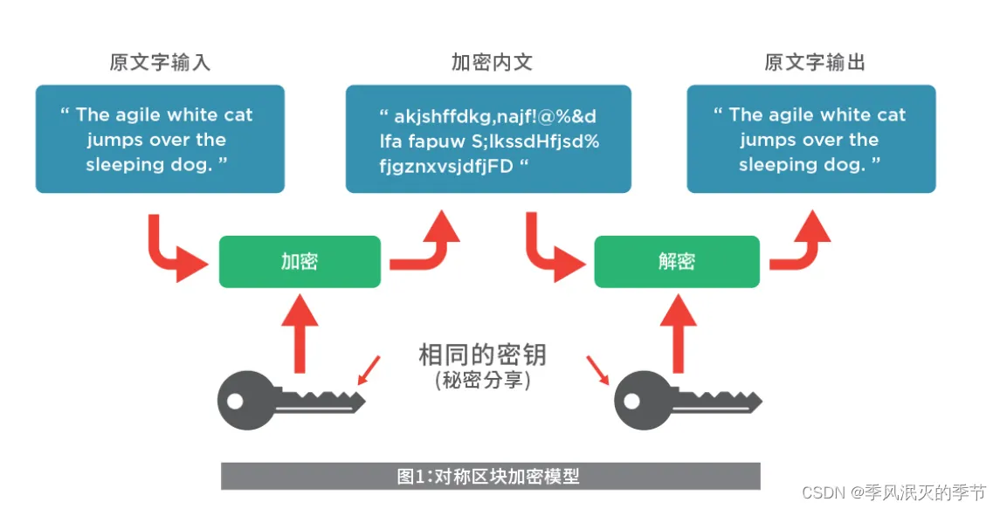

##### 应用场景

AES算法在各个领域都有广泛的应用，包括但不限于：

- **数据加密**: AES被广泛应用于保护敏感数据的加密，如个人信息、银行数据、密码等。
- **网络通信**: 在网络通信中，AES用于加密数据传输，保护通信内容不被窃听或篡改。
- **存储加密**: AES可以用于对存储在磁盘或数据库中的数据进行加密，以防止未经授权的访问。

##### 在Java中使用AES

在Java中，可以使用`Cipher`类来执行AES加密和解密操作。以下是一个简单的示例代码：

```java
import javax.crypto.Cipher;
import javax.crypto.spec.SecretKeySpec;
import java.util.Base64;
public class AESEncryption {
    public static void main(String[] args) throws Exception {
        String originalText = "Hello, AES!";
        String key = "0123456789abcdef"; // 密钥长度必须为16字节（128位）、24字节（192位）或32字节（256位）
        // 加密数据
        byte[] encryptedBytes = encrypt(originalText, key);
        System.out.println("Encrypted: " + Base64.getEncoder().encodeToString(encryptedBytes));
        // 解密数据
        String decryptedText = decrypt(encryptedBytes, key);
        System.out.println("Decrypted: " + decryptedText);
    }
    // 加密方法
    private static byte[] encrypt(String originalText, String key) throws Exception {
        SecretKeySpec secretKey = new SecretKeySpec(key.getBytes(), "AES");
        Cipher cipher = Cipher.getInstance("AES");
        cipher.init(Cipher.ENCRYPT_MODE, secretKey);
        return cipher.doFinal(originalText.getBytes());
    }
    // 解密方法
    private static String decrypt(byte[] encryptedBytes, String key) throws Exception {
        SecretKeySpec secretKey = new SecretKeySpec(key.getBytes(), "AES");
        Cipher cipher = Cipher.getInstance("AES");
        cipher.init(Cipher.DECRYPT_MODE, secretKey);
        byte[] decryptedBytes = cipher.doFinal(encryptedBytes);
        return new String(decryptedBytes);
    }
}
```

##### 注意事项和最佳实践

- **密钥安全**: 密钥的安全性对于保护加密数据至关重要。确保密钥的安全存储和管理，避免在不安全的环境中存储密钥。
- **填充方式**: AES算法通常需要指定填充方式。常用的填充方式包括PKCS5Padding和NoPadding。确保在加密和解密时使用相同的填充方式。
- **初始化向量**: 在某些模式下，如CBC模式，需要使用初始化向量（IV）来增加加密的随机性。确保在加密时使用随机生成的IV，并在解密时正确地传递IV。

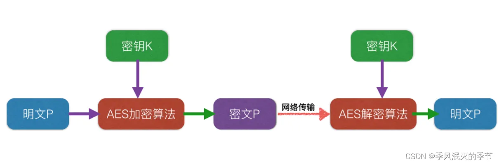

#### SM4

SMS4算法是在国内广泛使用的WAPI无线网络标准中使用的加密算法，是一种32轮的迭代非平衡Feistel结构的分组加密算法，其密钥长度和分组长度均为128。SMS4算法的加解密过程中使用的算法是完全相同的，唯一不同点在于该算法的解密密钥是由它的加密密钥进行逆序变换后得到的。

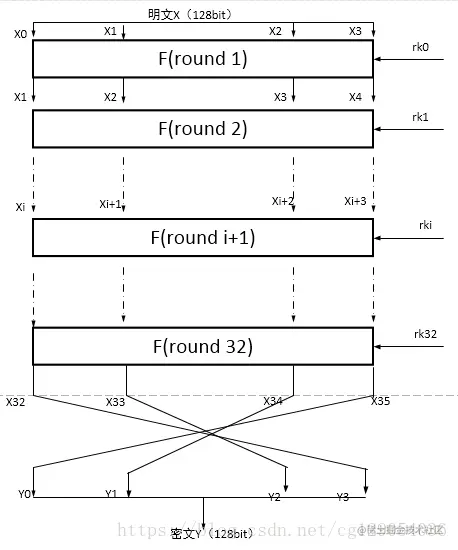

明文加上128bit的秘钥，进过多轮变换，最后输出是加密的反序，解密时只是将轮密钥的使用顺序进行逆向进行。

##### 工作原理

**轮函数F**

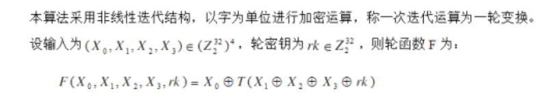

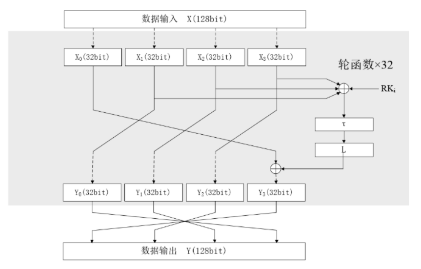

SM4的轮函数将输入部分看做了4个32bit长度的数据，每轮的后3个部分都向左移动32bit的数据长度，这三组数据异或后进入非线性部分τ和线性部分L，运算后的结果与第一组数据异或置于最右面。如此循环往复32轮，也就是数据一共左移了8个周期，将其中的混乱因素不断扩散至每个bit位中

**T函数**

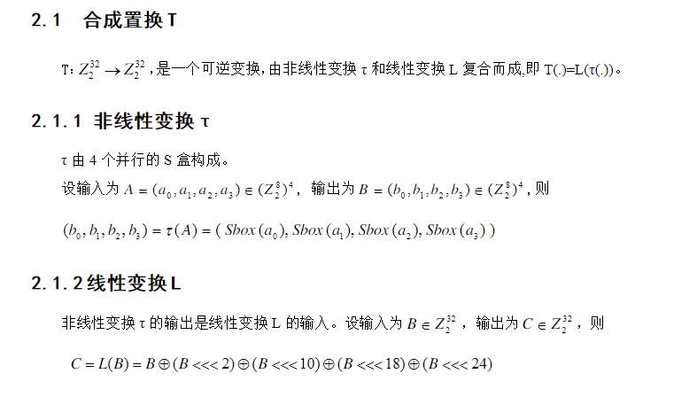

S盒如下：

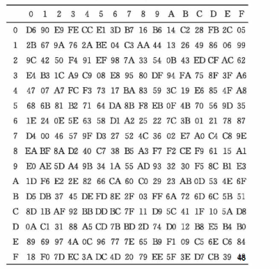

使用规则：

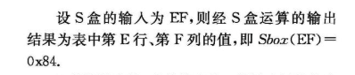

**秘钥扩展算法**

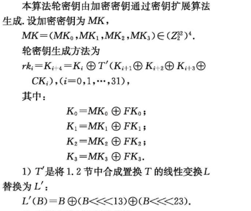

##### 应用场景

SM4常用于政府系统的数据传输加密，我们使用前端向后端传递信息，或者分布式场景下不同模块之间的调用，可以使用此算法。对参数的数据进行加密，然后后台对加密的数据进行解密再存储到数据库中，保证数据传输过程中，不受泄露。

##### SM4算法java的实现

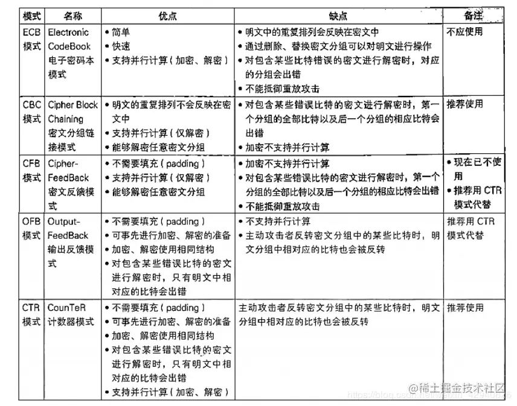

外部依赖

```xml
<dependency>
    <groupId>org.bouncycastle</groupId>
    <artifactId>bcprov-jdk15on</artifactId>
    <version>1.69</version>
</dependency>
```


```java
import org.bouncycastle.jce.provider.BouncyCastleProvider;
import org.bouncycastle.pqc.math.linearalgebra.ByteUtils;
import javax.crypto.Cipher;
import javax.crypto.KeyGenerator;
import javax.crypto.spec.SecretKeySpec;
import java.security.Key;
import java.security.SecureRandom;
import java.security.Security;
import java.util.Arrays;


public class Sm4Utils{
    private static final String ENCODING = "UTF-8";
    public static final String ALGORIGTHM_NAME = "SM4";
    public static final String ALGORITHM_NAME_ECB_PADDING = "SM4/ECB/PKCS7Padding";
    public static final int DEFAULT_KEY_SIZE = 128;

    /**
     *  @Description:生成ecb秘钥
     */
    private static Cipher generateEcbCipher(String algorithmName, int mode, byte[] key) throws Exception {
        Security.addProvider(new BouncyCastleProvider());
        Cipher cipher = Cipher.getInstance(algorithmName,BouncyCastleProvider.PROVIDER_NAME);
        Key sm4Key = new SecretKeySpec(key, ALGORIGTHM_NAME);
        cipher.init(mode, sm4Key);
        return cipher;
    }

    /**
     *  @Description:自动生成密钥
     */
    public static byte[] generateKey() throws Exception {
        return generateKey(DEFAULT_KEY_SIZE);
    }

    public static byte[] generateKey(int keySize) throws Exception {
        KeyGenerator kg = KeyGenerator.getInstance(ALGORIGTHM_NAME, BouncyCastleProvider.PROVIDER_NAME);
        kg.init(keySize, new SecureRandom());
        return kg.generateKey().getEncoded();
    }

    /**
     *  @Description:加密
     */
    public static String encryptEcb(String hexKey, String paramStr, String charset) throws Exception {
        String cipherText = "";
        if (null != paramStr && !"".equals(paramStr)) {
            byte[] keyData = ByteUtils.fromHexString(hexKey);
            charset = charset.trim();
            if (charset.length() <= 0) {
                charset = ENCODING;
            }
            byte[] srcData = paramStr.getBytes(charset);
            byte[] cipherArray = encrypt_Ecb_Padding(keyData, srcData);
            cipherText = ByteUtils.toHexString(cipherArray);
        }
        return cipherText;
    }

    /**
     *  @Description:加密模式之ecb
     */
    public static byte[] encrypt_Ecb_Padding(byte[] key, byte[] data) throws Exception {
        Cipher cipher = generateEcbCipher(ALGORITHM_NAME_ECB_PADDING, Cipher.ENCRYPT_MODE, key);
        byte[] bs = cipher.doFinal(data);
        return bs;
    }
    /**
     *  @Description:sm4解密
     */
    public static String decryptEcb(String hexKey, String cipherText, String charset) throws Exception {
        String decryptStr = "";
        byte[] keyData = ByteUtils.fromHexString(hexKey);
        byte[] cipherData = ByteUtils.fromHexString(cipherText);
        byte[] srcData = decrypt_Ecb_Padding(keyData, cipherData);
        charset = charset.trim();
        if (charset.length() <= 0) {
            charset = ENCODING;
        }
        decryptStr = new String(srcData, charset);
        return decryptStr;
    }

    /**
     *  @Description:ecb解密
     */
    public static byte[] decrypt_Ecb_Padding(byte[] key, byte[] cipherText) throws Exception {
        Cipher cipher = generateEcbCipher(ALGORITHM_NAME_ECB_PADDING, Cipher.DECRYPT_MODE, key);
        return cipher.doFinal(cipherText);
    }

    /**
     *  @Description:密码校验
     */
    public static boolean verifyEcb(String hexKey,String cipherText,String paramStr) throws Exception {
        boolean flag = false;
        byte[] keyData = ByteUtils.fromHexString(hexKey);
        byte[] cipherData = ByteUtils.fromHexString(cipherText);
        byte[] decryptData = decrypt_Ecb_Padding(keyData,cipherData);
        byte[] srcData = paramStr.getBytes(ENCODING);
        flag = Arrays.equals(decryptData,srcData);
        return flag;
    }
}
```

```java
import java.util.HashMap;
import java.util.Map;
import java.util.Random;
import java.util.concurrent.LinkedBlockingQueue;
import java.util.concurrent.ThreadPoolExecutor;
import java.util.concurrent.TimeUnit;

public class Test {
    private static final String ENCODING = "UTF-8";
    /**
     *  @Description:测试类
     */
    public static void main(String[] args) {

        ThreadPoolExecutor executor = new ThreadPoolExecutor(20,100,10, TimeUnit.SECONDS,new LinkedBlockingQueue<Runnable>());
        Map map=new HashMap<>();
        for (int i=0;i<1;i++){
            int finalI = i;
            executor.submit(()->{
                System.out.println(Thread.currentThread().getName());
                int number = new Random().nextInt(100);
                try {
                    long start,end;
                    start = System.currentTimeMillis();
                    String json = "{\"name\":\"color\",\"sex\":\"man\"}"+number;
                    // 自定义的32位16进制密钥
                    String key = "888368581322491ace9q79348a2757d1";
                    String cipher = Sm4Utils.encryptEcb(key, json,ENCODING);
                    System.out.println("加密之后:"+cipher);
                    Thread.sleep(100);
                    json = Sm4Utils.decryptEcb(key, cipher,ENCODING);
                    System.out.println("解密:"+json);
                    System.out.println(Sm4Utils.verifyEcb(key, cipher, json));
                    System.out.println("密码校验:"+json);

                    end = System.currentTimeMillis();
                    System.out.println(finalI+"Run Time:" + (end - start) + "(ms)");
                    map.put(finalI,json);
                } catch (Exception e) {
                    e.printStackTrace();
                }
            });
        }
    }
}
```


