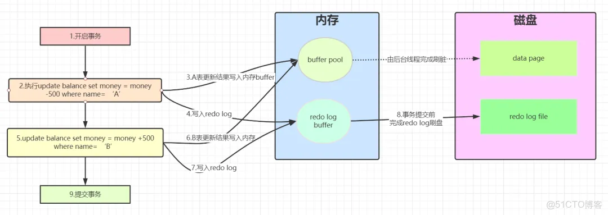
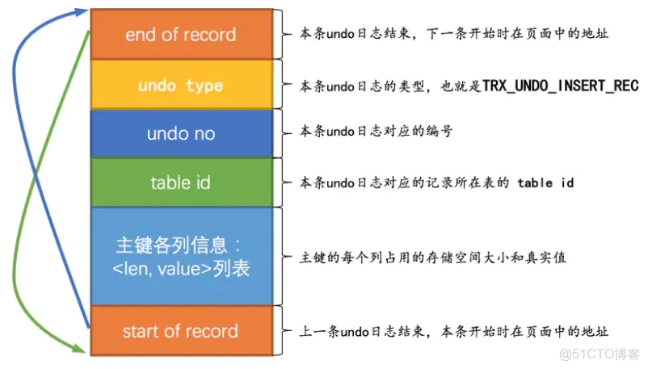
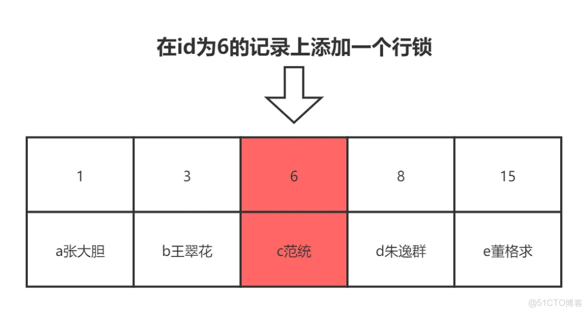
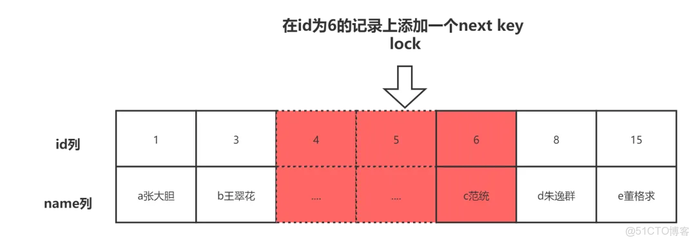
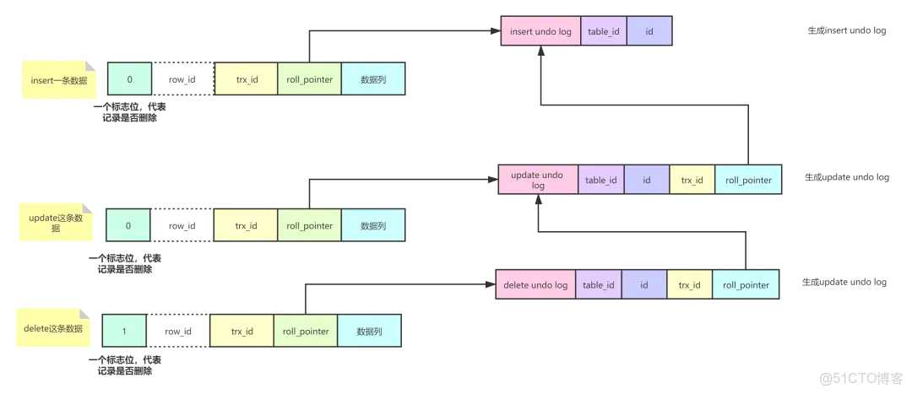
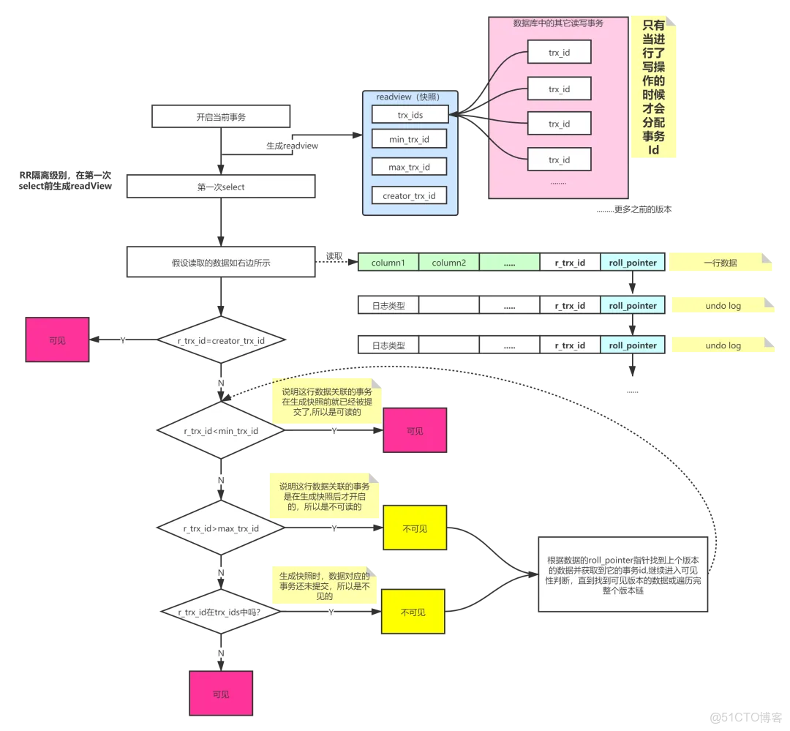

# Mysql事务处理原理


<!--more-->

# 初识事务

## 为什么需要事务？

这里又要掏出那个烂大街的银行转账案例了，以A、B两个账户的转账为例，假设现在要从A账户向B账户中转入1000员，当进行转账时，需要先从银行账户A中取出钱，然后再存入银行账户B中，`SQL`样本如下：

```sql
// 第一步：A账户余额减少减少1000  
update balance set money = money -500 where name= ‘A’;
// 第二步：B账户余额增加1000  
update balance set money = money +500 where name= ‘B’;
```

如果在完成了第1步的时候突然宕机了，A的钱减少了而B的钱没有增加，那A岂不是白白丢了1000元，这时候就需要用到我们的事务了，开启事务后`SQL`样本如下：

```sql
// 第一步：开始事务
start transaction;
// 第二步：A账户余额减少减少1000  
update balance set money = money -500 where name= ‘A’;
// 第三步：B账户余额增加1000  
update balance set money = money +500 where name= ‘B’;
// 第四步：提交事务
commit;
```

## 什么是事务

事务（Transaction）是访问和更新数据库的程序执行单元；事务中可能包含一个或多个sql语句，这些语句要么都执行成功，要么全部执行失败。

## 事务的四大特性（ACID）

- 原子性（Atomicity，或称不可分割性）

**「一个事务必须被视为一个不可分割的最小工作单元，整个事务中所有的操作要么全部提交成功，要么全部失败回滚，对于一个事务来说，不可能只执行其中的一部分操作，这就是事务的原子性」**

- 一致性（Consistency）

**「数据库总是从一个一致性的状态转换到另外一个一致性的状态，在事务开始之前和之后，数据库的完整性约束没有被破坏。在前面的例子中，事务结束前后A、B账户总额始终保持不变」**

- 隔离性（Isolation）

**「隔离性是指，事务内部的操作与其他事务是隔离的，并发执行的各个事务之间不能互相干扰。严格的隔离性，对应了事务隔离级别中的Serializable (可串行化)，但实际应用中出于性能方面的考虑很少会使用可串行化。」**

- 持久性（Durability）

**「持久性是指事务一旦提交，它对数据库的改变就应该是永久性的。接下来的其他操作或故障不应该对其有任何影响。」**

## 事务的隔离级别

在前文中我们介绍了隔离性，但实际上隔离性比想象的要复杂的多。在SQL标准中定义了四种隔离级别，每一种隔离级别都规定了一个事务所做的修改，哪些在事务内和事务间是可见的，哪些是不可见的，较低级别的隔离通常可以执行跟高的并发，系统的开销也更低

### 未提交读（READ UNCOMMITTED）

在这个隔离级别下，事务的修改即使没有提交，对其他事务也是可见的。事务可以读取未提交的数据，这也被称之为`脏读`。这个级别会带来很多问题，从性能上来说，`READ UNCOMMITTED`不会比其他的级别好太多，但是却会带来很多问题，除非真的有非常必要的理由，在实际应用中一般很少使用。

### 提交读（REDA COMMITED）

大多数数据系统的默认隔离级别都是`REDA COMMITED`（MySql不是），`REDA COMMITED`满足前面提到的隔离性的简单定义：一个事务开始时，只能看到已经提交的事务所做的修改。换句话说，一个事物从开始直到提交前，所做的修改对其他事务不可见。这个级别有时候也叫做`不可重复读`，因为执行两次相同的查询可能会得到不同的结果。

### 可重复读（REPEATABLE READ）

`REPEATABLE READ`解决了`脏读`以及`不可重复度的问题`。该级别保证了同一个事务多次读取同样记录的结果是一致的。但是理论上，可重复度还是无法解决另外一个`幻读`的问题。所谓幻读，指的是当某个事务在读取某个范围内的记录时，另外一个事务又在该范围内插入了新的记录，当之前的事务再次读取该范围的记录时，就会产生幻行。

不可重复读跟幻读的区别在于，**「前者是数据发生了变化，后者是数据的行数发生了变化」**。

### 可串行化（SERIALIZABLE）

`SERIALIZABLE`是最高的隔离级别，它通过强制事务串行执行，避免前面说的幻读。简单来说`SERIALIZABLE`会在读取的每一行数据上都加锁，所以可能会导致大量的超时和锁争用的问题。实际应用中也很少使用这个隔离级别，只有在非常需要确保数据一致性而且可以接受没有并发的情况下，才考虑此级别。

## 保存点

我们可以在事务执行的过程中定义保存点，在回滚时直接指定回滚到指定的保存点而不是事务开始之初，有点像我们玩游戏的时候可以存档而不是每次都要重新再来

定义保存点的语法如下：

```ini
SAVEPOINT 保存点名称;
```

当我们想回滚到某个保存点时，可以使用下边这个语句（下边语句中的单词`WORK`和`SAVEPOINT`是可有可无的）：

```css
ROLLBACK [WORK] TO [SAVEPOINT] 保存点名称;
```

# MySQL中的事务跟原理

## MySQL中的事务

1. **「MySQL中不是所有的存储引擎都支持事务」**，例如`MyISAM`就不支持事务，实际上支持事务的只有`InnoDB`跟`NDB Cluster`，**「本文关于事务的分析都是基于`InnoDB`」**
2. **「MySQL默认采用的是自动提交的方式」**，也就是说如果不是显示的开始一个事务，则系统会自动向数据库提交结果。在当前连接中，还可以通过设置AUTOCONNIT变量来启用或者禁用自动提交模式。

- 开启自动提交功能

```ini
SET AUTOCOMMIT = 1;
```

MySQL中默认情况下的自动提交功能是已经开启的。

- 关闭自动提交功能。

```ini
SET AUTOCOMMIT = 0;
```

关闭自动提交功能后，只用当执行COMMIT命令后，MySQL才将数据表中的资料提交到数据库中。如果执行ROLLBACK命令，数据将会被回滚。如果不提交事务，而终止MySQL会话，数据库将会自动执行回滚操作。

1. **「MySQL的默认隔离级别是可重复读（REPEATABLE READ）」**。

## 事务的实现原理

我们要探究`MySQL`中事务的实现原理，实际上就是要弄明天它的`ACID`特性是如何实现的，在这里有必要先说明的是，**「`ACID`中的一致性是事务的最终目标，前面提到的原子性、持久性和隔离性，都是为了保证数据库状态的一致性」**。所以我们要分析的就是`MySQL`的原子性、持久性和隔离性的实现原理，在分析事务的实现原理之前我们需要补充一些`InnoDB`的相关知识

1. `InnoDB`是一个将表中的数据存储到磁盘上的存储引擎，所以即使关机后重启我们的数据还是存在的。而真正**「处理数据的过程是发生在内存中的」**，**「所以需要把磁盘中的数据加载到内存中，如果是处理写入或修改请求的话，还需要把内存中的内容刷新到磁盘上」**。而我们知道读写磁盘的速度非常慢，和内存读写差了几个数量级，所以当我们想从表中获取某些记录时，`InnoDB`存储引擎需要一条一条的把记录从磁盘上读出来么？不，那样会慢死，`InnoDB`采取的方式是：**「将数据划分为若干个页，以页作为磁盘和内存之间交互的基本单位，InnoDB中页的大小一般为 \*16\* KB。也就是在一般情况下，一次最少从磁盘中读取16KB的内容到内存中，一次最少把内存中的16KB内容刷新到磁盘中。」**
2. 我们还需要对MySQL中的日志有一定了解。MySQL的日志有很多种，如二进制日志（bin log）、错误日志、查询日志、慢查询日志等，此外InnoDB存储引擎还提供了两种事务日志：**「redo log(重做日志)和undo log(回滚日志)。其中redo log用于保证事务持久性；undo log则是事务原子性和隔离性实现的基础。」**
3. InnoDB作为MySQL的存储引擎，数据是存放在磁盘中的，但如果每次读写数据都需要磁盘IO，效率会很低。为此，InnoDB提供了**「缓存(Buffer Pool)」**，Buffer Pool中包含了磁盘中部分数据页的映射，作为访问数据库的缓冲：**「当从数据库读取数据时，会首先从Buffer Pool中读取，如果Buffer Pool中没有，则从磁盘读取后放入Buffer Pool；当向数据库写入数据时，会首先写入Buffer Pool，Buffer Pool中修改的数据会定期刷新到磁盘中（这一过程称为刷脏）。」**
4. `InnoDB`存储引擎文件主要可以分为两类，表空间文件及重做日志文件（redo log file）,表空间文件又可以细分为两类，共享表空间跟独立表空间。**「undo log位于共享表空间中的undo段中」**，每个表空间都被划分成了若干个页面，**「凡是页面的读写都在buffer pool中进行，这意味着undo log也需要先写入到buffer pool，所以undo log的生成也需要持久化，也就是说undo log的生成需要记录对应的redo log」**。(注意：不是所有的undo log的生成都会产生对应的redo log，对于操作临时表生成的undo log并不会生成对应的undo log，因为修改临时表而产生的`undo日志`只需要在系统运行过程中有效，如果系统奔溃了，那么在重启时也不需要恢复这些`undo`日志所在的页面，所以在写针对临时表的`Undo页面`时，并不需要记录相应的`redo日志`。)

### 持久性实现原理

​		通过前面的补充知识我们知道InnoDB引入了`Buffer Pool`来优化读写的性能，但是虽然`Buffer Pool`优化了性能，但同时也带来了新的问题：**「如果MySQL宕机，而此时Buffer Pool中修改的数据还没有刷新到磁盘，就会导致数据的丢失，事务的持久性无法保证」**。

​		基于此，`redo log`就诞生了，**「redo log是物理日志，记录的是数据库中数据库中物理页的情况」**，redo log包括两部分：一是内存中的日志缓冲(redo log buffer)，该部分日志是易失性的；二是磁盘上的重做日志文件(redo log file)，该部分日志是持久的。在概念上，innodb通过**「force log at commit」**机制实现事务的持久性，即在事务提交的时候，必须先将该事务的所有事务日志写入到磁盘上的redo log file和undo log file中进行持久化。

​		看到这里可能有的小伙伴又会有疑问了，既然redo log也需要在事务提交时将日志写入磁盘，为什么它比直接将Buffer Pool中修改的数据写入磁盘(即刷脏)要快呢？主要有以下两方面的原因：

（1）刷脏是随机IO，因为每次修改的数据位置随机，但写redo log是追加操作，属于顺序IO。

（2）刷脏是以数据页（Page）为单位的，MySQL默认页大小是16KB，一个Page上一个小修改都要整页写入；而redo log中只包含真正需要写入的部分，无效IO大大减少。

这里我以文章开头的例子进行说明`redo log`为何能保证持久性：

```sql
// 第一步：开始事务
start transaction;
// 第二步：A账户余额减少减少1000  
update balance set money = money -500 where name= ‘A’;
// 第三步：B账户余额增加1000  
update balance set money = money +500 where name= ‘B’;
// 第四步：提交事务
commit;
```



redo

> ❝
>
> 这里需要对redo log的刷盘补充一点内容：
>
> MySQL支持用户自定义在commit时如何将log buffer中的日志刷log file中。这种控制通过变量 innodb_flush_log_at_trx_commit 的值来决定。该变量有3种值：0、1、2，**「默认为1」**。但注意，这个变量只是控制commit动作是否刷新log buffer到磁盘。
>
> - 当设置为1的时候，事务每次提交都会将log buffer中的日志写入os buffer并调用fsync()函数刷到log file on disk中。这种方式即使系统崩溃也不会丢失任何数据，但是因为每次提交都写入磁盘，IO的性能较差。
> - 当设置为0的时候，事务提交时不会将log buffer中日志写入到os buffer（内核缓冲区），而是每秒写入os buffer并调用fsync()写入到log file on disk中。也就是说设置为0时是(大约)每秒刷新写入到磁盘中的，当系统崩溃，会丢失1秒钟的数据。
> - 当设置为2的时候，每次提交都仅写入到os buffer，然后是每秒调用fsync()将os buffer中的日志写入到log file on disk。
>
> **「可以看到设置为0或者2时，都有可能丢失1s的数据」**
>
> ❞

### 原子性实现原理

前面提到了，所谓原子性就是指整个事务是一个不可分隔的整体，组成事务的一组SQL要么全部成功，要么全部失败，要达到这个目的就意味着当某一个SQL执行失败时，我们要能够撤销掉其它SQL的执行结果，在MySQL中这是依赖`undo log(回滚日志)`来实现。

undo log属于**「逻辑日志」**（*前面提到的redo log属于物理日志，记录的是数据页的情况*），我们可以这么认为，**「当delete一条记录时，undo log中会记录一条对应的insert记录，反之亦然，当update一条记录时，它记录一条对应相反的update记录。」**

但执行发生异常时，会根据undo log中的记录进行回滚。undo log主要分为两种

1. insert undo log
2. update undo log

**「insert undo log是指在insert 操作中产生的undo log」**，因为insert操作的记录，只对事务本身可见，对其他事务不可见。故该undo log可以在事务提交后直接删除，不需要进行purge操作。

**「而update undo log记录的是对\*delete 和update\*操作产生的undo log」**，该undo log可能需要提供MVCC机制，因此不能再事务提交时就进行删除。提交时放入undo log链表，等待purge线程进行最后的删除。

> ❝
>
> 补充：purge线程两个主要作用是：清理undo页和清除page里面带有Delete_Bit标识的数据行。在InnoDB中，事务中的Delete操作实际上并不是真正的删除掉数据行，而是一种Delete Mark操作，在记录上标识Delete_Bit，而不删除记录。是一种"假删除",只是做了个标记，真正的删除工作需要后台purge线程去完成。
>
> ❞

这里我们就来看看insert undo log的结构，如下：



insert undo

在上图中，`undo type`记录的是undo log的类型，对于`insert undo log`，该值始终为11（`TRX_UNDO_INSERT_REC`），`undo no`在一个事务中是从`0`开始递增的，也就是说只要事务没提交，每生成一条`undo日志`，那么该条日志的`undo no`就增1。table id记录undo log所对应的表对象。如果记录中的主键只包含一个列，那么在类型为`TRX_UNDO_INSERT_REC`的`undo日志`中只需要把该列占用的存储空间大小和真实值记录下来，如果记录中的主键包含多个列（复合主键），那么每个列占用的存储空间大小和对应的真实值都需要记录下来（图中的`len`就代表列占用的存储空间大小，`value`就代表列的真实值），**「在回滚时只需要根据主键找到对应的列然后删除即可」**。end of record记录了下一条undo log在页面中开始的地址，start of record记录了本条undo log在页面中开始的地址。

对undo log有一定了解后，我们再回头看看文章开头的例子，分析下为什么undo log能保证原子性

```csharp
// 第一步：开始事务
start transaction;
// 第二步：A账户余额减少减少1000  
update balance set money = money -500 where name= ‘A’;
// 第三步：B账户余额增加1000  
update balance set money = money +500 where name= ‘B’;
// 第四步：提交事务
commit;
```


undo redo

考虑到排版，这里我只画了一条语句的流程图，第二条也是一样的，每次更新或者插入前，先记录undo，再修改内存中数据，再记录redo。

### 隔离性实现原理

我们知道，一个事务中的读操作是不会影响到另外一个事务的，所以在讨论隔离性我们主要分为两种情况

1. 一个事务中的写操作，对另外一个事务中写操作的影响
2. 一个事务中的写操作，对另外一个事务中读操作的影响

写操作之间的隔离是通过锁来实现的，MySQL中的锁机制要详细来讲是很复杂的，要讲明白整个锁需要从索引开始介绍，限于笔者能力及文章篇幅，本文只对MySQL中的锁机制做一个简单的介绍

#### MySQL中的锁机制（InnoDB）

##### 读锁跟写锁

1. 读锁`又称为`共享锁`，简称S锁，顾名思义，共享锁就是多个事务对于同一数据可以共享一把锁，**「都能访问到数据，但是只能读不能修改。」**
2. 写锁`又称为`排他锁`，简称X锁，顾名思义，排他锁就是不能与其他所并存，如一个事务获取了一个数据行的排他锁，其他事务就不能再获取该行的其他锁，包括共享锁和排他锁，但是获取排他锁的事务是可以对数据就行读取和修改。

##### 行锁跟表锁

1. 表锁在操作数据时会锁定整张表，并发性能较差；
2. 行锁则只锁定需要操作的数据，并发性能好。
3. 但是由于加锁本身需要消耗资源(获得锁、检查锁、释放锁等都需要消耗资源)，因此在锁定数据较多情况下使用表锁可以节省大量资源。MySQL中不同的存储引擎支持的锁是不一样的，例如MyIsam只支持表锁，而InnoDB同时支持表锁和行锁，且出于性能考虑，绝大多数情况下使用的都是行锁。

##### 意向锁

1. 意向锁分为两种，意向读锁（IS）跟意向写锁（IX）
2. 意向锁是表级别的锁
3. 为什么需要意向锁呢？思考一个问题：如果我们想对某个表加一个表锁，那么在加锁之前我们需要去检查表中的每一行记录是否已经被单独加了行锁，这样的话岂不是意味着我们需要去遍历表中所有的记录依次进行检查，遍历是不可能的，这辈子都不可能遍历的，基于效率的考虑，我们可以在每次给行记录加锁时先给当前表加一个意向锁，如果我们要对行加读锁（S）的话，那么就先给表加一个意向读锁（IS），如果要对行加写锁（X）的话，那么先给表加一个意向写锁（IX），这样当我们需要给整个表加锁的时候就可以通过先判断表上是否已经存在了意向锁来决定是否可以上锁了，避免遍历，提高了效率。
4. 意向锁跟普通的读锁写锁间的兼容性如下：

|      | IS     | IX     | S      | X      |
| ---- | ------ | ------ | ------ | ------ |
| IS   | 兼容   | 兼容   | 兼容   | 不兼容 |
| IX   | 兼容   | 兼容   | 不兼容 | 不兼容 |
| S    | 兼容   | 不兼容 | 兼容   | 不兼容 |
| X    | 不兼容 | 不兼容 | 不兼容 | 不兼容 |

注：IS（意向读锁/意向共享锁），  IX（意向写锁/意向排他锁），  S（读锁/共享锁），X（写锁/排他锁）

从上图中可以看出，意向锁之间都是兼容的，这是因为意向锁的作用仅仅是来快速判断是否可以直接上表锁。

------

***「接下来介绍的这几种锁都属于行锁」***，为了更好的理解这几种锁，我们先创建一个表

```sql
CREATE TABLE `user` (
  `id` int(11) NOT NULL AUTO_INCREMENT,
  `name` varchar(10) NOT NULL,
  PRIMARY KEY (`id`),
) ENGINE=InnoDB AUTO_INCREMENT=7 DEFAULT CHARSET=utf8;
```

其中id为主键，没有建其余的索引，插入如下数据

```sql
INSERT INTO `test`.`user`(`id`, `name`) VALUES (1, 'a张大胆');
INSERT INTO `test`.`user`(`id`, `name`) VALUES (3, 'b王翠花');
INSERT INTO `test`.`user`(`id`, `name`) VALUES (6, 'c范统');
INSERT INTO `test`.`user`(`id`, `name`) VALUES (8, 'd朱逸群');
INSERT INTO `test`.`user`(`id`, `name`) VALUES (15, 'e董格求');
```

##### Record Lock（记录锁）

1. 锁定单条记录
2. 也分为S锁跟X锁

如果我们对id为3的记录添加一个行锁，对应如下（图中每一列代表数据库中的一行记录）：



行锁

##### Gap Lock（间隙锁）

1. 锁定一个范围，但是不包含记录本身
2. 间隙锁的主要作用在于防止幻读的发生，虽然也有S锁跟X锁的区分，但是它们的作用都是相同的，而且如果你对一条记录加了`间隙锁`（不论是`共享间隙锁`还是`独占间隙锁`），并不会限制其他事务对这条记录加`记录锁`或者继续加`间隙锁`，再强调一遍，`间隙锁`的作用仅仅是为了防止幻读的发生。

假设我们要对id为6的记录添加间隙锁，那么此时锁定的区域如下所示

其中虚线框代表的是要锁定的间隙，其实就是当前需要加间隙锁的记录跟上一条记录之间的范围，但是间隙锁不会锁定当前记录，如图所示，id=6的记录并没有被加锁。（图中虚线框表锁间隙，没有插入真实的记录）


间隙锁

##### Next-Key Lock（Gap Lock+Record Lock）

假设我们要对id为6的记录添加`Next-Key Lock`，那么此时锁定的区域如下所示



next key lock

跟间隙锁最大的区别在于，`Next-Key Lock`除了锁定间隙之外还要锁定当前记录

> ❝
>
> 通过锁实现了写、写操作之间的隔离性，实际上我们也可以通过加锁来实现读、写之间的隔离性，但是这样带来一个问题，读、写需要串行执行这样会大大降低效率，所以MySQL中实现读写之间的隔离性是通过MVCC+锁来实现的，对于读采用快照都，对于写使用加锁！
>
> ❞

#### MVCC（多版本并发控制）

##### 版本链

在介绍`MVCC`之前我们需要对MySQL中的行记录格式有一定了解，其实除了我们在数据库中定义的列之外，每一行中还包含了几个隐藏列，分别是

- row_id：行记录的唯一标志
- transaction_id：事务ID
- roll_pointer：回滚指针

**「row_id是行记录的唯一标志，这一列不是必须的。」**

MySQL会优先使用用户自定义主键作为主键，如果用户没有定义主键，则选取一个`Unique`键作为主键，如果表中连`Unique`键都没有定义的话，则`InnoDB`会为表默认添加一个名为`row_id`的隐藏列作为主键。也就是说只有在表中既没有定义主键，也没有申明唯一索引的情况MySQL才会添加这个隐藏列。

**「transaction_id代表的是事务的ID」**。当一个事务对某个表执行了增、删、改操作，那么`InnoDB`存储引擎就会给它分配一个独一无二的`事务id`，分配方式如下：

- 对于只读事务来说，只有在它第一次对某个用户创建的**「临时表执行增、删、改操作」**时才会为这个事务分配一个`事务id`，否则的话是不分配`事务id`的。

- 对于读写事务来说，只有在它**「第一次对某个表（包括用户创建的临时表）执行增、删、改操作」**时才会为这个事务分配一个`事务id`，否则的话也是不分配`事务id`的。

  有的时候虽然我们开启了一个读写事务，但是在这个事务中全是查询语句，并没有执行增、删、改的语句，那也就意味着这个事务并不会被分配一个`事务id`。

**「roll_pointer表示回滚指针，指向该记录对应的undo log」**。前文已经提到过了，undo log记录了对应记录在修改前的状态，通过`roll_pointer`我们就可以找到对应的undo log，然后根据undo log进行回滚。

> ❝
>
> 在之前介绍undo log的时候我们只介绍了insert undo log的数据格式，实际上除了insert undo log还有update undo log，而`update undo log`中也包含`roll_pointer`跟`transaction_id`。`update undo log`中的`roll_pointer`指针其实就是保存的被更新的记录中的`roll_pointer`指针
>
> ❞

**「除了这些隐藏列以外，实际上每条记录的记录头信息中还会存储一个标志位，标志该记录是否删除。」**

我们以实际的例子来说明上面三个隐藏列的作用，还是以之前的表为例，现在对其执行如下SQL：

```sql
# 开启事务
START TRANSACTION;
# 插入一条数据
INSERT INTO `test`.`user`(`id`, `name`) VALUES (16, 'e杜子騰');
# 更新插入的数据
UPDATE `test`.`user` SET name = "史珍香" WHERE id = 16;
# 删除数据
DELETE from  `test`.`user` WHERE id = 16;
```

我们通过画图来看看上面这段SQL在执行的过程中都做了什么



SQL执行流程图

从上图中我们可以看到，每对记录进行一次增、删、改时，都会生成一条对应的undo log，并且被修改后的记录中的`roll pointer`指针指向了这条undo log，同时如果不是新增操作，那么生成的undo log中也会保存一个`roll pointer`，其值是从被修改的数据中复制过来了，在我们上边的例子中update undo log的`roll pointer`就复制了insert进去的数据中的`roll pointer`指针的值。

另外我们会发现，根据当前记录中的`roll pointer`指针，我们可以找到一个有undo log组成的链表，这个undo log链表其实就是这条记录的`版本链`。

##### ReadView（快照）

对于使用`READ UNCOMMITTED`隔离级别的事务来说，由于可以读到未提交事务修改过的记录，所以直接读取记录的最新版本就好了；

对于使用`SERIALIZABLE`隔离级别的事务来说，MySQL规定使用加锁的方式来访问记录；

对于使用`READ COMMITTED`和`REPEATABLE READ`隔离级别的事务来说，都必须保证读到已经提交了的事务修改过的记录，也就是说假如另一个事务已经修改了记录但是尚未提交，是不能直接读取最新版本的记录的，核心问题就是：**「需要判断一下版本链中的哪个版本是当前事务可见的」**。

为了解决这个问题，MySQL提出了一个`ReadView`（快照）的概念，**「在Select操作前会为当前事务生成一个快照，然后根据快照中记录的信息来判断当前记录是否对事务是可见的，如果不可见那么沿着版本链继续往上找，直至找到一个可见的记录。」**

**「ReadView」**（快照）中包含了下面几个关键属性：

- `m_ids`：表示在生成`ReadView`时当前系统中活跃的读写事务的`事务id`列表。

- `min_trx_id`：表示在生成`ReadView`时当前系统中活跃的读写事务中最小的`事务id`，也就是`m_ids`中的最小值。

- `max_trx_id`：表示生成`ReadView`时系统中应该分配给下一个事务的`id`值。

  > ❝
  >
  > 小贴士： 注意max_trx_id并不是m_ids中的最大值，事务id是递增分配的。比方说现在有id为1，2，3这三个事务，之后id为3的事务提交了。那么一个新的读事务在生成ReadView时，m_ids就包括1和2，min_trx_id的值就是1，max_trx_id的值就是4。
  >
  > ❞

- `creator_trx_id`：表示生成该`ReadView`的事务的`事务id`。

  > ❝
  >
  > 小贴士： 我们前边说过，只有在对表中的记录做改动时（执行INSERT、DELETE、UPDATE这些语句时）才会为事务分配事务id，否则在一个只读事务中的事务id值都默认为0。
  >
  > ❞

当生成快照后，会通过下面这个流程来判断该记录对当前事务是否可见



MVCC

1. 从上图中我们可以看到，在根据当前数据库中运行中的读写事务id，会去生成一个ReadView。
2. 然后根据要读取的数据记录中的事务id（方便区别，记为`r_trx_id`）跟ReadView中保存的几个属性做如下判断

- 如果被访问版本的`r_trx_id`属性值与`ReadView`中的`creator_trx_id`值相同，意味着当前事务在访问它自己修改过的记录，所以该版本可以被当前事务访问。
- 如果被访问版本的`r_trx_id`属性值小于`ReadView`中的`min_trx_id`值，表明生成该版本的事务在当前事务生成`ReadView`前已经提交，所以该版本可以被当前事务访问。
- 如果被访问版本的`r_trx_id`属性值大于或等于`ReadView`中的`max_trx_id`值，表明生成该版本的事务在当前事务生成`ReadView`后才开启，所以该版本不可以被当前事务访问。
- 如果被访问版本的`r_trx_id`属性值在`ReadView`的`min_trx_id`和`max_trx_id`之间，那就需要判断一下`r_trx_id`属性值是不是在`m_ids`列表中，如果在，说明创建`ReadView`时生成该版本的事务还是活跃的，该版本不可以被访问；如果不在，说明创建`ReadView`时生成该版本的事务已经被提交，该版本可以被访问。
- 如果某个版本的数据对当前事务不可见的话，那就顺着版本链找到下一个版本的数据，继续按照上边的步骤判断可见性，依此类推，直到版本链中的最后一个版本。如果最后一个版本也不可见的话，那么就意味着该条记录对该事务完全不可见，查询结果就不包含该记录。

实际上，提交读跟可重复读在实现上最大的差异就在于

1. 提交读每次select都会生成一个快照
2. 可重复读只有在第一次会生成一个快照
