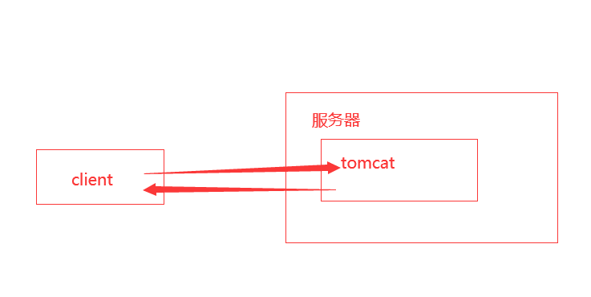
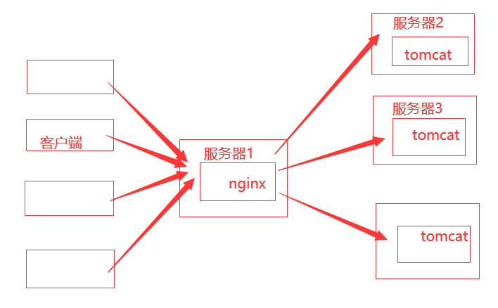
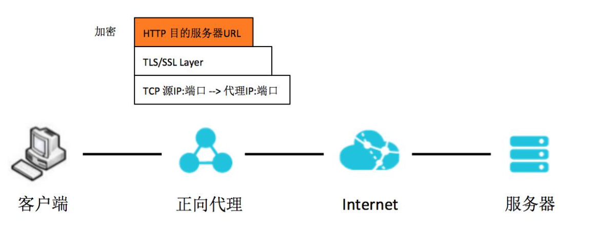
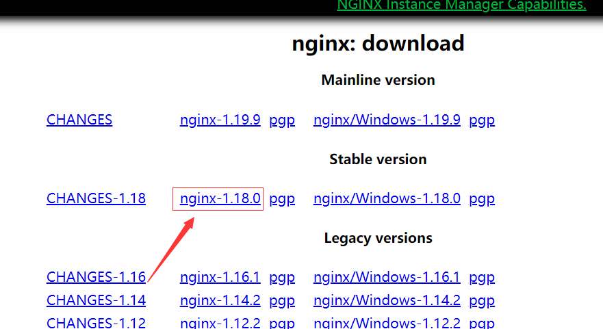
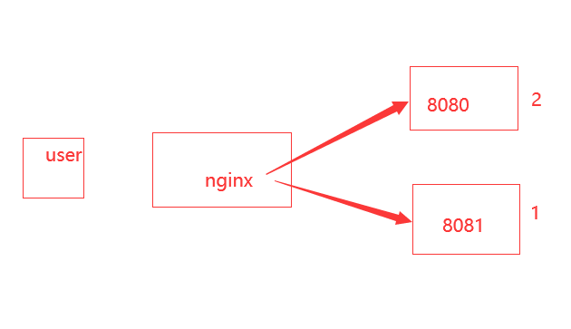

# Nginx基础入门


<!--more-->

## nginx

项目最初上线的时候并发量小、用户使用少，所以在低并发的情况下，一个Jar包、一个tomcat服务器就够了



但是用户多了，并发量就增大了，这时候一台服务器就不能满足需求，于是可以横向扩展服务器，这时候几个项目启动在不同的服务器上，由于session不共享，就需要一个代理服务器，通过代理服务器请求转发：




我们希望这个代理服务器可以帮助我们接受用户请求，然后按照规则转发在不同服务器上，这个过程用户是无感知的，用户并不知道哪台服务器在返回结果，还希望它可以按照服务器性能提供不同的权重选择

## 什么是nginx

Nginx("engine x")是一款是由俄罗斯的程序设计师Igor Sysoev所开发**高性能的 Web和 反向代理 服务器**，也是一个 IMAP/POP3/SMTP 代理服务器。

在高连接并发的情况下，Nginx是Apache服务器不错的替代品。

 nginx相对于apache的优点： 轻量级，同样起web 服务，比apache 占用更少的内存及资源 ，抗并发，nginx 处理请求是异步非阻塞的，而apache 则是阻塞型的，在高并发下nginx 能保持低资源低消耗高性能，高度模块化的设计，编写模块相对简单 ，社区活跃，各种高性能模块出品迅速。

官方数据统计表明能够支持50000个并发量。

## nginx作用

http代理，反向代理：作为web服务器最常用的功能之一，尤其是反向代理。

### 正向代理：



例如我们用的VPN，相当于一个中介跳转；正向代理代理的是客户端，反向代理代理的是服务器。

### 反向代理：


### 负载均衡：

nginx提供两种负载均衡策略：内置策略和扩展策略；内置策略为轮询、加权轮询，ip hash;扩展策略就是天马行空，任意的定制

**轮询：**


**加权轮询：**


**ip hash:**


**动静分离：**

动静分离，通过中间将动静分离和静态请求进行分离；
通过中间件将动态请求和静态请求分离，可以建上不必要的请求消耗，同时能减少请求的延时。
通过中间件将动态请求和静态请求分离，逻辑图如下 :


动静分离只有好处：动静分离后，即使动态服务不可用，但静态资源不会受到影响。

## nginx安装：

官网地址：http://nginx.org/en/download.html

### Windows下安装：

1、官网下载稳定版本，下载即运行，不用任何安装

2、命令行输入nginx.exe,双击运行一闪而过看不到效果，浏览查看80端口：


### linux下安装：

1、官网下载稳定版本，上传到服务器：



2、解压安装：

```shell
#解压
tar -zxvf nginx-1.18.0.tar.gz
#执行配置
./configure
#执行make命令：
make
make install 
```

第三步报错：

```shell
./configure: error: the HTTP rewrite module requires the PCRE library.
You can either disable the module by using --without-http_rewrite_module
option, or install the PCRE library into the system, or build the PCRE library
statically from the source with nginx by using --with-pcre=<path> option.
```

```shell
#执行命令  安装pcre-devel
yum -y install pcre-devel
```

依旧报错：

```
./configure: error: the HTTP gzip module requires the zlib library.
You can either disable the module by using --without-http_gzip_module
option, or install the zlib library into the system, or build the zlib library
statically from the source with nginx by using --with-zlib=<path> option.
```

```shell
#安装zlib
wget http://www.zlib.net/zlib-1.2.11.tar.gz
tar -xzvf zlib-1.2.11.tar.gz
cd zlib-1.2.11
./configure
make
make install
```

3、查看是否安装成功：

```shell
[root@jd nginx-1.18.0]# whereis nginx
nginx: /usr/local/nginx
[root@jd nginx-1.18.0]# cd /usr/local/nginx/
[root@jd nginx]# ls
conf  html  logs  sbin
[root@jd nginx]# ./sbin/nginx 
[root@jd nginx]# curl localhost
<!DOCTYPE html>
<html>
<head>
<title>Welcome to nginx!</title>
<style>
    body {
        width: 35em;
        margin: 0 auto;
        font-family: Tahoma, Verdana, Arial, sans-serif;
    }
</style>
</head>
<body>
<h1>Welcome to nginx!</h1>
<p>If you see this page, the nginx web server is successfully installed and
working. Further configuration is required.</p>

<p>For online documentation and support please refer to
<a href="http://nginx.org/">nginx.org</a>.<br/>
Commercial support is available at
<a href="http://nginx.com/">nginx.com</a>.</p>

<p><em>Thank you for using nginx.</em></p>
</body>
</html>
```

4、nginx常用命令：

```shell
cd /usr/local/nginx/sbin/
./nginx   #启动
./nginx -s stop   #停止
./nginx -s quit   #安全退出
./nginx -s reload  #重新加载配置文件
ps aux|grep nginx   #查看nginx进程
```

## nginx配置使用：

应用场景：现在有多台配置不一样的服务器，根据服务器性能设置不同的权重轮询：



配置实例：8000代表一台服务器，8001代表一台服务器，加权轮询1：3

```conf
upstream eccentric{
		server 127.0.0.1:8000 weight=1;
		server 127.0.0.1:8001 weight=3;
	}
    server {
        listen       7999;
        server_name  localhost;

        #charset koi8-r;

        #access_log  logs/host.access.log  main;

        location /hello {
            root   html;
            index  index.html index.htm;
			proxy_pass http://eccentric;
        }
		#访问后台管理系统/admin
		location /admin {
            root   html;
            index  index.html index.htm;
			
        }

        #error_page  404              /404.html;

        # redirect server error pages to the static page /50x.html
        #
        error_page   500 502 503 504  /50x.html;
        location = /50x.html {
            root   html;
        }

        # proxy the PHP scripts to Apache listening on 127.0.0.1:80
        #
        #location ~ \.php$ {
        #    proxy_pass   http://127.0.0.1;
        #}

        # pass the PHP scripts to FastCGI server listening on 127.0.0.1:9000
        #
        #location ~ \.php$ {
        #    root           html;
        #    fastcgi_pass   127.0.0.1:9000;
        #    fastcgi_index  index.php;
        #    fastcgi_param  SCRIPT_FILENAME  /scripts$fastcgi_script_name;
        #    include        fastcgi_params;
        #}

        # deny access to .htaccess files, if Apache's document root
        # concurs with nginx's one
        #
        #location ~ /\.ht {
        #    deny  all;
        #}
    }
```

本地模拟两个服务器：

```
java -jar democompose-0.0.1-SNAPSHOT.jar --server.port=8000
java -jar democompose-0.0.1-SNAPSHOT.jar --server.port=8001
```

本地访问localhost:7999:


两台服务器接受到的请求次数：


**Windows双击运行nginx.exe带来的问题，没有办法通过命令行关闭，nginx80端口一直被占用：**

```shell
#查看占用80端口的进程
netstat -ano | findstr ":80 "
#查看对应进程的应用
tasklist /fi "PID eq 752"
#杀死进程
taskkill /pid 752 /f
```


```xml

#user  nobody;
worker_processes  1;

#error_log  logs/error.log;
#error_log  logs/error.log  notice;
#error_log  logs/error.log  info;

#pid        logs/nginx.pid;


events {
    worker_connections  1024;
}


http {
    include       mime.types;
    default_type  application/octet-stream;

    #log_format  main  '$remote_addr - $remote_user [$time_local] "$request" '
    #                  '$status $body_bytes_sent "$http_referer" '
    #                  '"$http_user_agent" "$http_x_forwarded_for"';

    #access_log  logs/access.log  main;

    sendfile        on;
    #tcp_nopush     on;

    #keepalive_timeout  0;
    keepalive_timeout  65;

    #gzip  on;


	upstream eccentric{
		server 127.0.0.1:8000 weight=1;
		server 127.0.0.1:8001 weight=3;
	}
    server {
        listen       7999;
        server_name  localhost;

        #charset koi8-r;

        #access_log  logs/host.access.log  main;

        location /hello {
            root   html;
            index  index.html index.htm;
			proxy_pass http://eccentric;
        }
		#访问后台管理系统/admin
		location /admin {
            root   html;
            index  index.html index.htm;
			
        }

        #error_page  404              /404.html;

        # redirect server error pages to the static page /50x.html
        #
        error_page   500 502 503 504  /50x.html;
        location = /50x.html {
            root   html;
        }

        # proxy the PHP scripts to Apache listening on 127.0.0.1:80
        #
        #location ~ \.php$ {
        #    proxy_pass   http://127.0.0.1;
        #}

        # pass the PHP scripts to FastCGI server listening on 127.0.0.1:9000
        #
        #location ~ \.php$ {
        #    root           html;
        #    fastcgi_pass   127.0.0.1:9000;
        #    fastcgi_index  index.php;
        #    fastcgi_param  SCRIPT_FILENAME  /scripts$fastcgi_script_name;
        #    include        fastcgi_params;
        #}

        # deny access to .htaccess files, if Apache's document root
        # concurs with nginx's one
        #
        #location ~ /\.ht {
        #    deny  all;
        #}
    }


    # another virtual host using mix of IP-, name-, and port-based configuration
    #
    #server {
    #    listen       8000;
    #    listen       somename:8080;
    #    server_name  somename  alias  another.alias;

    #    location / {
    #        root   html;
    #        index  index.html index.htm;
    #    }
    #}


    # HTTPS server
    #
    #server {
    #    listen       443 ssl;
    #    server_name  localhost;

    #    ssl_certificate      cert.pem;
    #    ssl_certificate_key  cert.key;

    #    ssl_session_cache    shared:SSL:1m;
    #    ssl_session_timeout  5m;

    #    ssl_ciphers  HIGH:!aNULL:!MD5;
    #    ssl_prefer_server_ciphers  on;

    #    location / {
    #        root   html;
    #        index  index.html index.htm;
    #    }
    #}

}

```


