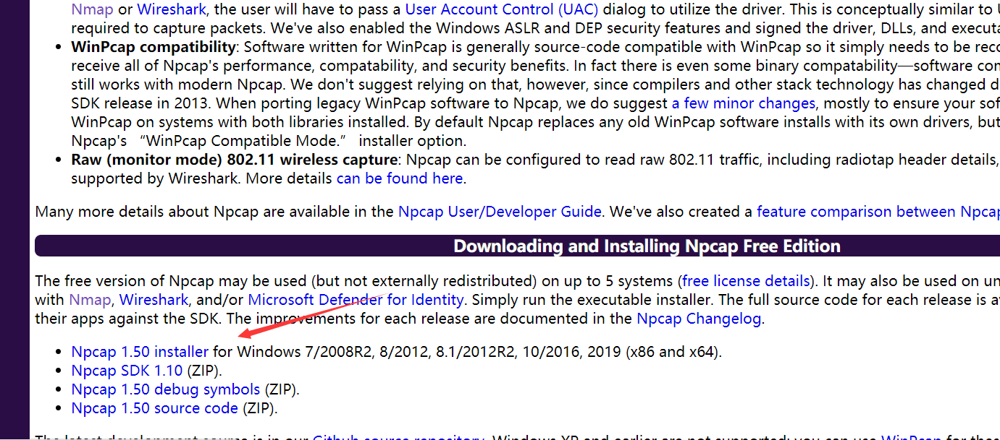
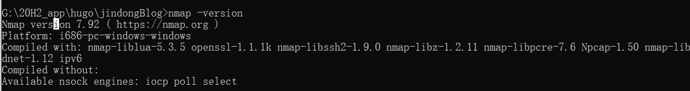

# Nmap


<!--more-->

# 下载nmap

https://nmap.org/download.html

安装完成后可能需要npcap的依赖，不懂为啥，安装了就对了https://nmap.org/npcap/



查看version



# 使用

Nmap可以完成以下任务：

> - 主机探测
> - 端口扫描
> - 版本检测
> - 系统检测
> - 支持探测脚本的编写

> - Nmap在实际中应用场合如下：
> - 通过对设备或者防火墙的探测来审计它的安全性
> - 探测目标主机所开放的端口
> - 通过识别新的服务器审计网络的安全性
> - 探测网络上的主机

端口扫描工具，即借助工具，试图了解所扫描IP提供的计算机网络服务类型（网络服务均与端口号相关），从而发现攻击弱点，常见服务对应端口号：

| 服务                                         | 端口号 |
| -------------------------------------------- | ------ |
| HTTP                                         | 80     |
| HTTPS                                        | 443    |
| Telnet                                       | 23     |
| FTP                                          | 21     |
| SSH（安全登录）、SCP（文件传输）、端口重定向 | 22     |
| SMTP                                         | 25     |
| POP3                                         | 110    |
| WebLogic                                     | 7001   |
| TOMCAT                                       | 8080   |
| WIN2003远程登录                              | 3389   |
| Oracle数据库                                 | 1521   |
| MS SQL* SEVER数据库sever                     | 1433   |
| MySQL 数据库sever                            | 3306   |

## 1、简单使用    nmap (*ip)

nmap默认发送一个ARP的PING数据包，来探测目标主机1-10000范围内所开放的所有端口

命令语法：

```shell
nmap <*target ip address*>
nmap 192.168.1.1
```

```
Starting Nmap 7.92 ( https://nmap.org ) at 2021-08-10 16:14 中国标准时间
Nmap scan report for 10.168.9.50
Host is up (0.0051s latency).
Not shown: 994 closed tcp ports (reset)
PORT     STATE SERVICE
22/tcp   open  ssh
80/tcp   open  http
8000/tcp open  http-alt
8002/tcp open  teradataordbms
8008/tcp open  http
9000/tcp open  cslistener
MAC Address: D4:5D:64:B8:DC:4E (Asustek Computer)

Nmap done: 1 IP address (1 host up) scanned in 1.50 seconds
```

## 2、nmap -vv (*ip)

nmap简单扫描，并对结果返回详细的描述输出

```shell
nmap -vv (*ip)
```


```shell
G:\20H2_app\hugo\jindongBlog>nmap -vv 10.168.9.50
Starting Nmap 7.92 ( https://nmap.org ) at 2021-08-10 16:16 中国标准时间
Initiating ARP Ping Scan at 16:16
Scanning 10.168.9.50 [1 port]
Completed ARP Ping Scan at 16:16, 0.13s elapsed (1 total hosts)
Initiating Parallel DNS resolution of 1 host. at 16:16
Completed Parallel DNS resolution of 1 host. at 16:16, 0.02s elapsed
Initiating SYN Stealth Scan at 16:16
Scanning 10.168.9.50 [1000 ports]
Discovered open port 22/tcp on 10.168.9.50
Discovered open port 80/tcp on 10.168.9.50
Discovered open port 8002/tcp on 10.168.9.50
Discovered open port 8000/tcp on 10.168.9.50
Discovered open port 9000/tcp on 10.168.9.50
Discovered open port 8008/tcp on 10.168.9.50
Completed SYN Stealth Scan at 16:16, 0.74s elapsed (1000 total ports)
Nmap scan report for 10.168.9.50
Host is up, received arp-response (0.0052s latency).
Scanned at 2021-08-10 16:16:57 中国标准时间 for 1s
Not shown: 994 closed tcp ports (reset)
PORT     STATE SERVICE        REASON
22/tcp   open  ssh            syn-ack ttl 64
80/tcp   open  http           syn-ack ttl 63
8000/tcp open  http-alt       syn-ack ttl 62
8002/tcp open  teradataordbms syn-ack ttl 62
8008/tcp open  http           syn-ack ttl 63
9000/tcp open  cslistener     syn-ack ttl 62
MAC Address: D4:5D:64:B8:DC:4E (Asustek Computer)

Read data files from: C:\Program Files (x86)\Nmap
Nmap done: 1 IP address (1 host up) scanned in 1.64 seconds
           Raw packets sent: 1001 (44.028KB) | Rcvd: 1001 (40.052KB)
```

## 3、自定义端口 nmap -p10000-20000 (*ip)

命令语法：nmap -p(range) <*target IP*>

介绍：（range）为要扫描的端口范围，端口大小不能超过65535

例子：扫描目标主机的50-80号端口

nmap -p50-80 10.0.0.55

```shell
C:\Users\26505>nmap -p1-1000 127.0.0.1
Starting Nmap 7.92 ( https://nmap.org ) at 2021-08-10 16:27 中国标准时间
Nmap scan report for kubernetes.docker.internal (127.0.0.1)
Host is up (0.00039s latency).
Not shown: 995 closed tcp ports (reset)
PORT    STATE    SERVICE
135/tcp open     msrpc
137/tcp filtered netbios-ns
445/tcp open     microsoft-ds
902/tcp open     iss-realsecure
912/tcp open     apex-mesh

Nmap done: 1 IP address (1 host up) scanned in 2.05 seconds
```


## 4、指定端口 nmap -p80,443 (*ip)

命令语法：nmap -p(port1,port2,…) <*target IP*>

介绍：port1,port2…为想要扫描的端口号

例子：扫描目标主机的80，443，801端口

nmap -p80,443,801 10.0.0.55

```shell
C:\Users\26505>nmap -p22,443 22.14.144.124
Starting Nmap 7.92 ( https://nmap.org ) at 2021-08-10 16:30 中国标准时间
Nmap scan report for 22.14.144.124
Host is up (0.063s latency).

PORT    STATE    SERVICE
22/tcp  filtered ssh
443/tcp open     https

Nmap done: 1 IP address (1 host up) scanned in 2.55 seconds
```

## 5、nmap -sP (*ip)

nmap可以利用类似windows/linux系统下的ping 方式进行扫描

命令语法： nmap -sP <*target ip*>

例子：nmap sP 10.1.112.89

```shell
C:\Users\26505>nmap -sP www.baidu.com
Starting Nmap 7.92 ( https://nmap.org ) at 2021-08-10 16:34 中国标准时间
Nmap scan report for www.baidu.com (180.101.49.11)
Host is up (0.059s latency).
Other addresses for www.baidu.com (not scanned): 180.101.49.12
Nmap done: 1 IP address (1 host up) scanned in 0.92 seconds
```

## 6、nmap 路由跟踪

路由器追踪功能，能够帮助网络管理员了解网络通行情况，同时也是网络管理人员很好的辅助工具，通过路由器追踪可以轻松的查处从我们电脑所在地到目的地之间所经常的网络节点，并可以看到通过各个结点所花费的时间

命令语法：
nmap –traceroute <*target IP*>

例子:namp –traceroute 8.8.8.8(geogle dns服务器ip)

```shell
C:\Users\26505>nmap -traceroute 8.8.8.8
Starting Nmap 7.92 ( https://nmap.org ) at 2021-08-10 16:35 中国标准时间
Nmap scan report for dns.google (8.8.8.8)
Host is up (0.081s latency).
Not shown: 999 filtered tcp ports (no-response)
PORT   STATE SERVICE
53/tcp open  domain

TRACEROUTE (using port 53/tcp)
HOP RTT       ADDRESS
1   2.00 ms   192.168.191.225
2   ...
3   40.00 ms  172.19.2.29
4   ...
5   21.00 ms  221.228.22.29
6   ... 11
12  66.00 ms  108.170.241.1
13  70.00 ms  142.251.64.173
14  103.00 ms dns.google (8.8.8.8)

Nmap done: 1 IP address (1 host up) scanned in 18.61 seconds
```

## 7、nmap设置扫描一个网段下的ip

命令语法：
nmap -sP <*network address*> <*/CIDR*>

介绍：CIDR为设置的子网掩码（/24,/16,/8等）

例子：nmap -sP 10.1.1.0 /24

## 8、nmap 操作系统类型的探测

命令语法：
nmap -0 <*target IP*>

例子：nmap -O(大写的o) 10.1.112.89

```shell
C:\Users\26505>nmap -O 10.168.9.191
Starting Nmap 7.92 ( https://nmap.org ) at 2021-08-10 16:42 中国标准时间
Nmap scan report for hp-jd.lan (10.168.9.191)
Host is up (0.00083s latency).
Not shown: 978 closed tcp ports (reset)
PORT      STATE SERVICE
135/tcp   open  msrpc
139/tcp   open  netbios-ssn
445/tcp   open  microsoft-ds
902/tcp   open  iss-realsecure
912/tcp   open  apex-mesh
1055/tcp  open  ansyslmd
1060/tcp  open  polestar
1087/tcp  open  cplscrambler-in
1117/tcp  open  ardus-mtrns
3301/tcp  open  unknown
3306/tcp  open  mysql
5357/tcp  open  wsdapi
7001/tcp  open  afs3-callback
7002/tcp  open  afs3-prserver
8001/tcp  open  vcom-tunnel
8002/tcp  open  teradataordbms
8080/tcp  open  http-proxy
9000/tcp  open  cslistener
9002/tcp  open  dynamid
9090/tcp  open  zeus-admin
15000/tcp open  hydap
50000/tcp open  ibm-db2
Device type: general purpose
Running: Microsoft Windows 10
OS CPE: cpe:/o:microsoft:windows_10
OS details: Microsoft Windows 10 1809 - 1909
Network Distance: 0 hops

OS detection performed. Please report any incorrect results at https://nmap.org/submit/ .
Nmap done: 1 IP address (1 host up) scanned in 2.18 seconds
```


## 9、nmap万能开关

包含了1-10000端口ping扫描，操作系统扫描，脚本扫描，路由跟踪，服务探测

命令语法：
nmap -A <*target ip*>

例子：nmap -A 10.1.112.89

```
C:\Users\26505>nmap -A 10.168.9.50
Starting Nmap 7.92 ( https://nmap.org ) at 2021-08-10 16:44 中国标准时间
Service scan Timing: About 83.33% done; ETC: 16:45 (0:00:16 remaining)
Nmap scan report for 10.168.9.50
Host is up (0.0041s latency).
Not shown: 994 closed tcp ports (reset)
PORT     STATE SERVICE         VERSION
22/tcp   open  ssh             OpenSSH 8.0 (protocol 2.0)
| ssh-hostkey:
|   3072 2e:13:05:c8:dc:42:ba:3e:6b:43:f0:16:04:42:08:cc (RSA)
|   256 77:59:df:1b:99:b2:bd:01:e6:db:45:9d:5b:84:e3:e5 (ECDSA)
|_  256 49:ee:8f:ac:cd:f0:79:f8:cd:06:ba:45:ac:2a:9f:8d (ED25519)
80/tcp   open  http            nginx
| http-title: Site doesn't have a title (text/html).
|_Requested resource was /wcm/edrms
8000/tcp open  nagios-nsca     Nagios NSCA
|_http-title: Site doesn't have a title (text/plain; charset=utf-8).
8002/tcp open  teradataordbms?
| fingerprint-strings:
|   FourOhFourRequest, GetRequest:
|     HTTP/1.1 404
|     Content-Type: text/html;charset=utf-8
|     Content-Language: en
|     Content-Length: 431
|     Date: Tue, 10 Aug 2021 08:44:29 GMT
|     Connection: close
|     <!doctype html><html lang="en"><head><title>HTTP Status 404
|     Found</title><style type="text/css">body {font-family:Tahoma,Arial,sans-serif;} h1, h2, h3, b {color:white;background-color:#525D76;} h1 {font-size:22px;} h2 {font-size:16px;} h3 {font-size:14px;} p {font-size:12px;} a {color:black;} .line {height:1px;background-color:#525D76;border:none;}</style></head><body><h1>HTTP Status 404
|     Found</h1></body></html>
|   HTTPOptions:
|     HTTP/1.1 404
|     Content-Type: text/html;charset=utf-8
|     Content-Language: en
|     Content-Length: 431
|     Date: Tue, 10 Aug 2021 08:44:34 GMT
|     Connection: close
|     <!doctype html><html lang="en"><head><title>HTTP Status 404
|     Found</title><style type="text/css">body {font-family:Tahoma,Arial,sans-serif;} h1, h2, h3, b {color:white;background-color:#525D76;} h1 {font-size:22px;} h2 {font-size:16px;} h3 {font-size:14px;} p {font-size:12px;} a {color:black;} .line {height:1px;background-color:#525D76;border:none;}</style></head><body><h1>HTTP Status 404
|_    Found</h1></body></html>
8008/tcp open  http            nginx 1.19.10
|_http-title: moblieProject
|_http-server-header: nginx/1.19.10
9000/tcp open  cslistener?
| fingerprint-strings:
|   GenericLines:
|     HTTP/1.1 400 Bad Request
|     Content-Type: text/plain; charset=utf-8
|     Connection: close
|     Request
|   GetRequest, HTTPOptions:
|     HTTP/1.0 200 OK
|     Accept-Ranges: bytes
|     Cache-Control: max-age=31536000
|     Content-Length: 23032
|     Content-Type: text/html; charset=utf-8
|     Last-Modified: Fri, 26 Jul 2019 02:11:28 GMT
|     X-Content-Type-Options: nosniff
|     X-Xss-Protection: 1; mode=block
|     Date: Tue, 10 Aug 2021 08:44:29 GMT
|     <!DOCTYPE html><html lang="en" ng-app="portainer">
|     <head>
|     <meta charset="utf-8">
|     <title>Portainer</title>
|     <meta name="description" content="">
|     <meta name="author" content="Portainer.io">
|     <!-- HTML5 shim, for IE6-8 support of HTML5 elements -->
|     <!--[if lt IE 9]>
|     <script src="//html5shim.googlecode.com/svn/trunk/html5.js"></script>
|     <![endif]-->
|     <!-- Fav and touch icons -->
|     <link rel="apple-touch-icon" sizes="180x180" href="dc4d092847be46242d8c013d1bc7c494.png">
|     <link rel="icon" type="image/png" sizes="32x32" href="5ba13dcb526292ae707310a54e103cd1.png">
|_    <link rel="icon" type="image/
2 services unrecognized despite returning data. If you know the service/version, please submit the following fingerprints at https://nmap.org/cgi-bin/submit.cgi?new-service :
==============NEXT SERVICE FINGERPRINT (SUBMIT INDIVIDUALLY)==============
SF-Port8002-TCP:V=7.92%I=7%D=8/10%Time=61123C6D%P=i686-pc-windows-windows%
SF:r(GetRequest,24A,"HTTP/1\.1\x20404\x20\r\nContent-Type:\x20text/html;ch
SF:arset=utf-8\r\nContent-Language:\x20en\r\nContent-Length:\x20431\r\nDat
SF:e:\x20Tue,\x2010\x20Aug\x202021\x2008:44:29\x20GMT\r\nConnection:\x20cl
SF:ose\r\n\r\n<!doctype\x20html><html\x20lang=\"en\"><head><title>HTTP\x20
SF:Status\x20404\x20\xe2\x80\x93\x20Not\x20Found</title><style\x20type=\"t
SF:ext/css\">body\x20{font-family:Tahoma,Arial,sans-serif;}\x20h1,\x20h2,\
SF:x20h3,\x20b\x20{color:white;background-color:#525D76;}\x20h1\x20{font-s
SF:ize:22px;}\x20h2\x20{font-size:16px;}\x20h3\x20{font-size:14px;}\x20p\x
SF:20{font-size:12px;}\x20a\x20{color:black;}\x20\.line\x20{height:1px;bac
SF:kground-color:#525D76;border:none;}</style></head><body><h1>HTTP\x20Sta
SF:tus\x20404\x20\xe2\x80\x93\x20Not\x20Found</h1></body></html>")%r(FourO
SF:hFourRequest,24A,"HTTP/1\.1\x20404\x20\r\nContent-Type:\x20text/html;ch
SF:arset=utf-8\r\nContent-Language:\x20en\r\nContent-Length:\x20431\r\nDat
SF:e:\x20Tue,\x2010\x20Aug\x202021\x2008:44:29\x20GMT\r\nConnection:\x20cl
SF:ose\r\n\r\n<!doctype\x20html><html\x20lang=\"en\"><head><title>HTTP\x20
SF:Status\x20404\x20\xe2\x80\x93\x20Not\x20Found</title><style\x20type=\"t
SF:ext/css\">body\x20{font-family:Tahoma,Arial,sans-serif;}\x20h1,\x20h2,\
SF:x20h3,\x20b\x20{color:white;background-color:#525D76;}\x20h1\x20{font-s
SF:ize:22px;}\x20h2\x20{font-size:16px;}\x20h3\x20{font-size:14px;}\x20p\x
SF:20{font-size:12px;}\x20a\x20{color:black;}\x20\.line\x20{height:1px;bac
SF:kground-color:#525D76;border:none;}</style></head><body><h1>HTTP\x20Sta
SF:tus\x20404\x20\xe2\x80\x93\x20Not\x20Found</h1></body></html>")%r(HTTPO
SF:ptions,24A,"HTTP/1\.1\x20404\x20\r\nContent-Type:\x20text/html;charset=
SF:utf-8\r\nContent-Language:\x20en\r\nContent-Length:\x20431\r\nDate:\x20
SF:Tue,\x2010\x20Aug\x202021\x2008:44:34\x20GMT\r\nConnection:\x20close\r\
SF:n\r\n<!doctype\x20html><html\x20lang=\"en\"><head><title>HTTP\x20Status
SF:\x20404\x20\xe2\x80\x93\x20Not\x20Found</title><style\x20type=\"text/cs
SF:s\">body\x20{font-family:Tahoma,Arial,sans-serif;}\x20h1,\x20h2,\x20h3,
SF:\x20b\x20{color:white;background-color:#525D76;}\x20h1\x20{font-size:22
SF:px;}\x20h2\x20{font-size:16px;}\x20h3\x20{font-size:14px;}\x20p\x20{fon
SF:t-size:12px;}\x20a\x20{color:black;}\x20\.line\x20{height:1px;backgroun
SF:d-color:#525D76;border:none;}</style></head><body><h1>HTTP\x20Status\x2
SF:0404\x20\xe2\x80\x93\x20Not\x20Found</h1></body></html>");
==============NEXT SERVICE FINGERPRINT (SUBMIT INDIVIDUALLY)==============
SF-Port9000-TCP:V=7.92%I=7%D=8/10%Time=61123C6D%P=i686-pc-windows-windows%
SF:r(GenericLines,67,"HTTP/1\.1\x20400\x20Bad\x20Request\r\nContent-Type:\
SF:x20text/plain;\x20charset=utf-8\r\nConnection:\x20close\r\n\r\n400\x20B
SF:ad\x20Request")%r(GetRequest,32B0,"HTTP/1\.0\x20200\x20OK\r\nAccept-Ran
SF:ges:\x20bytes\r\nCache-Control:\x20max-age=31536000\r\nContent-Length:\
SF:x2023032\r\nContent-Type:\x20text/html;\x20charset=utf-8\r\nLast-Modifi
SF:ed:\x20Fri,\x2026\x20Jul\x202019\x2002:11:28\x20GMT\r\nX-Content-Type-O
SF:ptions:\x20nosniff\r\nX-Xss-Protection:\x201;\x20mode=block\r\nDate:\x2
SF:0Tue,\x2010\x20Aug\x202021\x2008:44:29\x20GMT\r\n\r\n<!DOCTYPE\x20html>
SF:<html\x20lang=\"en\"\x20ng-app=\"portainer\">\n<head>\n\x20\x20<meta\x2
SF:0charset=\"utf-8\">\n\x20\x20<title>Portainer</title>\n\x20\x20<meta\x2
SF:0name=\"description\"\x20content=\"\">\n\x20\x20<meta\x20name=\"author\
SF:"\x20content=\"Portainer\.io\">\n\n\n\x20\x20<!--\x20HTML5\x20shim,\x20
SF:for\x20IE6-8\x20support\x20of\x20HTML5\x20elements\x20-->\n\x20\x20<!--
SF:\[if\x20lt\x20IE\x209\]>\n\x20\x20<script\x20src=\"//html5shim\.googlec
SF:ode\.com/svn/trunk/html5\.js\"></script>\n\x20\x20<!\[endif\]-->\n\n\n\
SF:x20\x20<!--\x20Fav\x20and\x20touch\x20icons\x20-->\n\x20\x20<link\x20re
SF:l=\"apple-touch-icon\"\x20sizes=\"180x180\"\x20href=\"dc4d092847be46242
SF:d8c013d1bc7c494\.png\">\n\x20\x20<link\x20rel=\"icon\"\x20type=\"image/
SF:png\"\x20sizes=\"32x32\"\x20href=\"5ba13dcb526292ae707310a54e103cd1\.pn
SF:g\">\n\x20\x20<link\x20rel=\"icon\"\x20type=\"image/")%r(HTTPOptions,1C
SF:A8,"HTTP/1\.0\x20200\x20OK\r\nAccept-Ranges:\x20bytes\r\nCache-Control:
SF:\x20max-age=31536000\r\nContent-Length:\x2023032\r\nContent-Type:\x20te
SF:xt/html;\x20charset=utf-8\r\nLast-Modified:\x20Fri,\x2026\x20Jul\x20201
SF:9\x2002:11:28\x20GMT\r\nX-Content-Type-Options:\x20nosniff\r\nX-Xss-Pro
SF:tection:\x201;\x20mode=block\r\nDate:\x20Tue,\x2010\x20Aug\x202021\x200
SF:8:44:29\x20GMT\r\n\r\n<!DOCTYPE\x20html><html\x20lang=\"en\"\x20ng-app=
SF:\"portainer\">\n<head>\n\x20\x20<meta\x20charset=\"utf-8\">\n\x20\x20<t
SF:itle>Portainer</title>\n\x20\x20<meta\x20name=\"description\"\x20conten
SF:t=\"\">\n\x20\x20<meta\x20name=\"author\"\x20content=\"Portainer\.io\">
SF:\n\n\n\x20\x20<!--\x20HTML5\x20shim,\x20for\x20IE6-8\x20support\x20of\x
SF:20HTML5\x20elements\x20-->\n\x20\x20<!--\[if\x20lt\x20IE\x209\]>\n\x20\
SF:x20<script\x20src=\"//html5shim\.googlecode\.com/svn/trunk/html5\.js\">
SF:</script>\n\x20\x20<!\[endif\]-->\n\n\n\x20\x20<!--\x20Fav\x20and\x20to
SF:uch\x20icons\x20-->\n\x20\x20<link\x20rel=\"apple-touch-icon\"\x20sizes
SF:=\"180x180\"\x20href=\"dc4d092847be46242d8c013d1bc7c494\.png\">\n\x20\x
SF:20<link\x20rel=\"icon\"\x20type=\"image/png\"\x20sizes=\"32x32\"\x20hre
SF:f=\"5ba13dcb526292ae707310a54e103cd1\.png\">\n\x20\x20<link\x20rel=\"ic
SF:on\"\x20type=\"image/");
MAC Address: D4:5D:64:B8:DC:4E (Asustek Computer)
Device type: general purpose
Running: Linux 3.X|4.X
OS CPE: cpe:/o:linux:linux_kernel:3 cpe:/o:linux:linux_kernel:4
OS details: Linux 3.2 - 4.9
Network Distance: 1 hop

TRACEROUTE
HOP RTT     ADDRESS
1   4.06 ms 10.168.9.50

OS and Service detection performed. Please report any incorrect results at https://nmap.org/submit/ .
Nmap done: 1 IP address (1 host up) scanned in 94.94 seconds
```


## 10、nmap命令混合式扫描

可以做到类似参数-A所完成的功能，但又能细化我们的需求要求

命令语法：
nmap -vv -p1-100 -O <*target ip*>

例子：
nmap -vv -p1-100 -O 10.1.112.89

```shell
G:\20H2_app\hugo\jindongBlog>nmap -vv -p0-1000 10.168.9.50
Starting Nmap 7.92 ( https://nmap.org ) at 2021-08-10 16:45 中国标准时间
Initiating ARP Ping Scan at 16:45
Scanning 10.168.9.50 [1 port]
Completed ARP Ping Scan at 16:45, 0.12s elapsed (1 total hosts)
Initiating Parallel DNS resolution of 1 host. at 16:45
Completed Parallel DNS resolution of 1 host. at 16:45, 0.01s elapsed
Initiating SYN Stealth Scan at 16:45
Scanning 10.168.9.50 [1001 ports]
Discovered open port 22/tcp on 10.168.9.50
Discovered open port 80/tcp on 10.168.9.50
Completed SYN Stealth Scan at 16:45, 0.57s elapsed (1001 total ports)
Nmap scan report for 10.168.9.50
Host is up, received arp-response (0.0057s latency).
Scanned at 2021-08-10 16:45:02 中国标准时间 for 1s
Not shown: 999 closed tcp ports (reset)
PORT   STATE SERVICE REASON
22/tcp open  ssh     syn-ack ttl 64
80/tcp open  http    syn-ack ttl 63
MAC Address: D4:5D:64:B8:DC:4E (Asustek Computer)

Read data files from: C:\Program Files (x86)\Nmap
Nmap done: 1 IP address (1 host up) scanned in 1.43 seconds
           Raw packets sent: 1002 (44.072KB) | Rcvd: 1002 (40.076KB)
```


