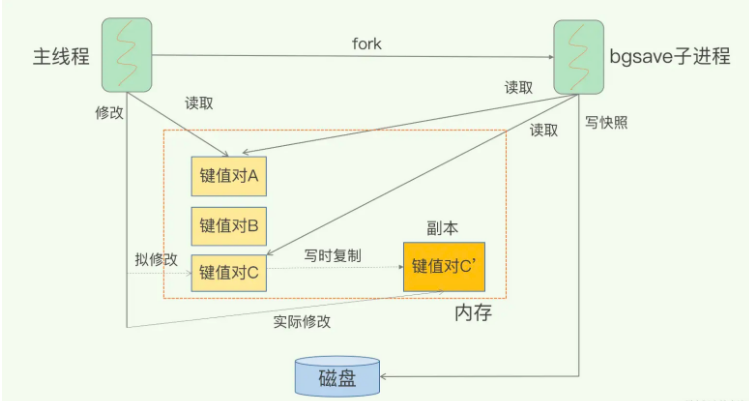
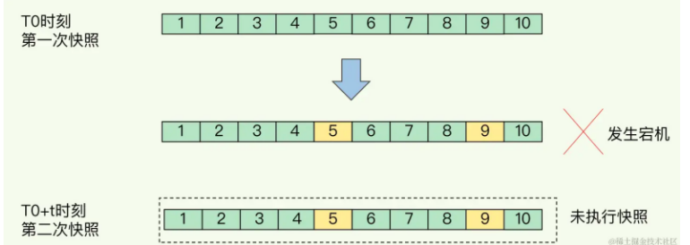
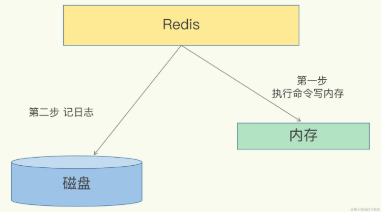
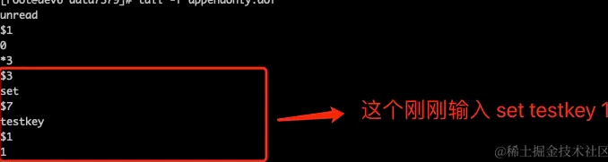
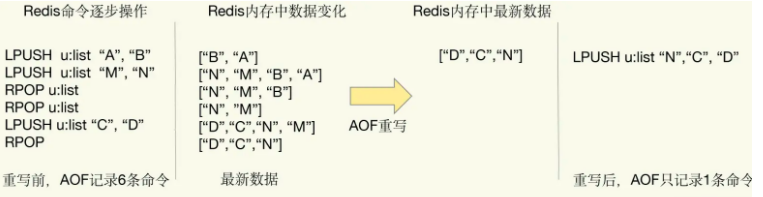
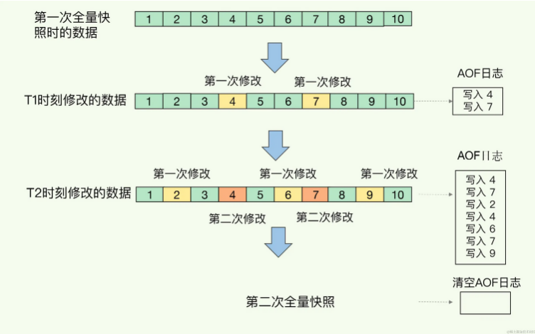

# Redis宕机了，如何恢复数据


<!--more-->

# 背景

有个同学阿里二面，面试官问：**redis宕机了，如何恢复数据？** 这位同学当时一脸懵，不知道如何回答。

分析分析这个问题，redis宕机，要想恢复数据，首先redis的数据有没有做持久化，用的是哪种策略，这种策略的机制是什么，有趣点是什么，以及你们是从什么方面考虑用着中机制的

其实面试官就是想考察，你们业务中redis的持久化策略，以及你对持久化策略有没有了解过，还是就直接使用，不管数据会回丢失，反正丢失了都是运维的锅，那你这样基本上GG了

# 为什么要做持久化

Redis是个基于内存的数据库。那服务一旦宕机，内存中的数据将全部丢失。通常的解决方案是从后端数据库恢复这些数据，但后端数据库有性能瓶颈，如果是大数据量的恢复，

1. 会对数据库带来巨大的压力，严重可能导致mysql宕机
2. 数据库的性能不如Redis。导致程序响应慢。所以对Redis来说，实现数据的持久化，避免从后端数据库中恢复数据，是至关重要的。

# 持久化策略

[官方](https://link.juejin.cn?target=https%3A%2F%2Fredis.io%2Fdocs%2Fmanagement%2Fpersistence%2F)支持的持久化有四种，如下：

1. RDB（Redis 数据库）：RDB 持久性以指定的时间间隔执行数据集的时间点快照。
2. AOF（仅追加文件）：AOF 持久性记录服务器接收到的每个写操作。然后可以在服务器启动时再次重播这些操作，从而重建原始数据集。命令使用与 Redis 协议本身相同的格式进行记录。
3. RDB + AOF：您还可以在同一个实例中组合 AOF 和 RDB。
4. 无持久性：您可以完全禁用持久性。这种策略，一般很少有人使用吧

下面我们对这几种策略，进行详细梳理下

## RDB

RDB 就是 Redis DataBase 的缩写，中文名为快照/内存快照，RDB持久化是把当前进程数据生成快照保存到磁盘上的过程，由于是某一时刻的快照，那么快照中的值要早于或者等于内存中的值。

默认情况下，Redis 将数据集的快照保存在磁盘上名为 **dump.rdb** 的二进制文件中。

Redis 提供了两个命令来生成 RDB 文件，分别是 save 和 bgsave。

- save：在主线程中执行，会导致阻塞；
- bgsave：创建一个子进程，专门用于写入 RDB 文件，避免了主线程的阻塞，这也是 Redis RDB 文件生成的默认配置。

一般通过 bgsave 命令来执行全量快照，这既提供了数据的可靠性保证，也避免了对 Redis 的性能影响。

### redis.conf中配置RDB

**内存快照**虽然可以通过技术人员手动执行SAVE或BGSAVE命令来进行，但生产环境下多数情况都会设置其周期性执行条件。

```bash
bash复制代码# 周期性执行条件的设置格式为
save <seconds> <changes>

# 默认的设置为：
save 900 1
save 300 10
save 60 10000

# 以下设置方式为关闭RDB快照功能
save ""
```

以上三项默认信息设置代表的意义是：

- 如果900秒内有1条Key信息发生变化，则进行快照；
- 如果300秒内有10条Key信息发生变化，则进行快照；
- 如果60秒内有10000条Key信息发生变化，则进行快照。

### Copy-On-Write, COW

**redis在执行bgsave生成快照的期间**，**将内存中的数据同步到硬盘的过程可能就会持续比较长的时间，而实际情况是这段时间Redis服务一般都会收到数据写操作请求。那么如何保证快照的完整性呢？**

可能会说，为了保证快照完整性，redis只能处理读操作，不能修改正在执行快照的数据。你想如果这样？为了快照而暂停写操作，同时候你的业务会受到很大的影响，是不可接受的，那有其他方案吗？

Redis 就会借助操作系统提供的写时复制技术（Copy-On-Write, COW），在执行快照的同时，正常处理写操作。
 bgsave 子进程是由主线程 fork 生成的，可以共享主线程的所有内存数据。bgsave 子进程运行后，开始读取主线程的内存数据，并把它们写入 RDB 文件。

此时，如果主线程对这些数据也都是读操作（例如图中的键值对 A），那么，主线程和 bgsave 子进程相互不影响。但是，如果主线程要修改一块数据（例如图中的键值对 C），那么，这块数据就会被复制一份，生成该数据的副本（键值对 C’）。然后，主线程在这个数据副本上进行修改。同时，bgsave 子进程可以继续把原来的数据（键值对 C）写入 RDB 文件。



写时复制机制保证快照期间数据可修改

这既保证了快照的完整性，也允许主线程同时对数据进行修改，避免了对正常业务的影响。

### 快照的频率如何把握

对于快照来说，所谓“连拍”就是指连续地做快照。这样一来，快照的间隔时间变得很短，即使某一时刻发生宕机了，因为上一时刻快照刚执行，丢失的数据也不会太多。但是，这其中的快照间隔时间就很关键了。如下图：



为了尽可能保证在宕机的情况下，保证数据尽量不丢失，比如：**一秒一次快照，那丢失的数据也是一秒**。这看上去很美好，其实为带来很大的问题，**如果频繁地执行全量快照，也会带来两方面的开销**

- 一方面，频繁将全量数据写入磁盘，会给磁盘带来很大压力，多个快照竞争有限的磁盘带宽，前一个快照还没有做完，后一个又开始做了，容易造成恶性循环。
- 另一方面，bgsave 子进程需要通过 fork 操作从主线程创建出来。虽然，子进程在创建后不会再阻塞主线程，但是，fork 这个创建过程本身会阻塞主线程，而且主线程的内存越大，阻塞时间越长。如果频繁 fork 出 bgsave 子进程，这就会频繁**阻塞主线程**了

那这个频率怎么控制呢？**这需要根据业务自身的情况，决定快照的频率**。比如笔者：我们目前的使用的策略是，关闭系统的自动快照功能，就是 设置 **save "" ,** 定时凌晨连接redis，手动执行bgsave，进行快照生成。可能有人说，如果执行这样的策略，数据丢失就是一天的，对，你说的对，但是我们的业务丢失一天的数据也没关系，这是业务能容忍的 ，在生产的情况下，redis的稳定性相当高，基本上不会宕机，出现宕机的情况，也是因为服务器自身的问题，导致机器重启，redis产生数据丢失。

### 优缺点

**优点**

- RDB文件是某个时间节点的快照，默认使用LZF算法进行压缩，压缩后的文件体积远远小于内存大小，适用于备份、全量复制等场景；
- Redis加载RDB文件恢复数据要远远快于AOF方式；

**缺点**

- RDB方式实时性不够，无法做到秒级的持久化；
- 每次调用bgsave都需要fork子进程，fork子进程属于重量级操作，频繁执行成本较高；
- RDB文件是二进制的，没有可读性，AOF文件在了解其结构的情况下可以手动修改或者补全；

总结：rdb数据恢复速度非常快，就是无法做到秒级的持久化

那有其他方式做到秒级的持久化吗？Aof

## AOF

AOF 持久性记录服务器接收到的每个写操作。然后可以在服务器启动时再次重播这些操作，从而重建原始数据集。命令使用与 Redis 协议本身相同的格式进行记录

Redis 是先执行命令，把数据写入内存，然后才记录日志



### AOF日志内容

我们以 Redis 收到“set testkey 1”命令后记录的日志为例，看看 AOF 日志的内容，



日志格式说明 `*3表示当前命令有三个部分，每部分都是由$+数字开头，后面紧跟着具体的命令、键或值。这里，数字表示这部分中的命令、键或值一共有多少字节。例如，$3 set表示这部分有 3 个字节，也就是set命令`

### redis.conf中配置AOF

默认情况下，Redis是没有开启AOF的，可以通过配置redis.conf文件来开启AOF持久化，关于AOF的配置如下：

```yaml
yaml复制代码# appendonly参数开启AOF持久化
appendonly no

# AOF持久化的文件名，默认是appendonly.aof
appendfilename "appendonly.aof"

# AOF文件的保存位置和RDB文件的位置相同，都是通过dir参数设置的
dir ./

# 同步策略
# appendfsync always
appendfsync everysec
# appendfsync no

# aof重写期间是否同步
no-appendfsync-on-rewrite no

# 重写触发配置
auto-aof-rewrite-percentage 100
auto-aof-rewrite-min-size 64mb

# 加载aof出错如何处理
aof-load-truncated yes

# 文件重写策略
aof-rewrite-incremental-fsync yes
```

### 写回策略

AOF 机制给我们提供了三个选择，也就是 AOF 配置项 appendfsync 的三个可选值。

- Always，同步写回：每个写命令执行完，立马同步地将日志写回磁盘；
- Everysec，每秒写回：每个写命令执行完，只是先把日志写到 AOF 文件的内存缓冲区，每隔一秒把缓冲区中的内容写入磁盘；
- **No**，操作系统控制的写回：每个写命令执行完，只是先把日志写到 AOF 文件的内存缓冲区，由操作系统决定何时将缓冲区内容写回磁盘。

针对避免主线程阻塞和减少数据丢失问题，这三种写回策略都无法做到两全其美。我们来分析下其中的原因。

- “同步写回”可以做到基本不丢数据，但是它在每一个写命令后都有一个慢速的落盘操作，不可避免地会影响主线程性能；
- 虽然“操作系统控制的写回”在写完缓冲区后，就可以继续执行后续的命令，但是落盘的时机已经不在 Redis 手中了，只要 AOF 记录没有写回磁盘，一旦宕机对应的数据就丢失了；
- “每秒写回”采用一秒写回一次的频率，避免了“同步写回”的性能开销，虽然减少了对系统性能的影响，但是如果发生宕机，上一秒内未落盘的命令操作仍然会丢失。所以，这只能算是，在避免影响主线程性能和避免数据丢失两者间取了个折中。

我把这三种策略的写回时机，以及优缺点汇总在了一张表格里，以方便你随时查看。

| 配置项   | 写回时机           | 优点                     | 缺点                             |
| -------- | ------------------ | ------------------------ | -------------------------------- |
| Always   | 同步写回           | 可靠性高，数据基本不丢失 | 每个写命令都要落盘，性能影响较大 |
| Everysec | 每秒写回           | 性能适中                 | 宕机时丢失1秒内的数据            |
| NO       | 操作系统控制的写回 | 性能好                   | 宕机时丢失数据较多               |

 根据系统对高性能和高可靠性的要求，来选择使用哪种写回策略了。总结一下就是：

- 想要获得高性能，就选择 No 策略；
- 如果想要得到高可靠性保证，就选择 Always 策略；
- 如果允许数据有一点丢失，又希望性能别受太大影响的话，那么就选择 Everysec 策略。

虽然AOF策略，能保证秒级数据丢失，但是随着redis的长时间运行，aof文件会越来越大，如果宕机，进行数据恢复的时候速度是特别慢，影响业务，那有什么好的发案处理吗？**aof日志重写**

### AOF日志重写

AOF 文件是以追加的方式，逐一记录接收到的写命令的。当一个键值对被多条写命令反复修改时，AOF 文件会记录相应的多条命令。但是，在重写的时候，是根据这个键值对当前的最新状态，为它生成对应的写入命令。这样一来，一个键值对在重写日志中只用一条命令就行了，而且，在日志恢复时，只用执行这条命令，就可以直接完成这个键值对的写入了。
 重写机制具有“多变一”功能。所谓的“多变一”，也就是说，旧日志文件中的多条命令，在重写后的新日志中变成了一条命令，例如：



我们对列表先后做了 6 次修改操作后，列表的最后状态是[“D”, “C”, “N”]，此时，只用 LPUSH u:list “N”, “C”, “D”这一条命令就能实现该数据的恢复，这就节省了五条命令的空间。对于被修改过成百上千次的键值对来说，重写能节省的空间当然就更大了。

不过，虽然 AOF 重写后，日志文件会缩小，但是，要把整个数据库的最新数据的操作日志都写回磁盘，仍然是一个非常耗时的过程。那这个过程，会阻塞主线程吗

### **AOF重写会阻塞吗**

AOF重写过程是由后台进程bgrewriteaof来完成的。主线程fork出后台的bgrewriteaof子进程，fork会把主线程的内存拷贝一份给bgrewriteaof子进程，这里面就包含了数据库的最新数据。然后，bgrewriteaof子进程就可以在不影响主线程的情况下，逐一把拷贝的数据写成操作，记入重写日志。

### 优缺点

**优点**

数据能做到秒级丢失，也就是说使用了aof这种机制，能做到最多丢失一秒的数据

**缺点**

恢复数据比较慢，虽然aof日志重写，可以减小文件，但是速度还是很慢

那有没有一种机制，能做到秒级丢失，恢复速度又比较快呢？**RDB和AOF混合方式**

## **RDB和AOF混合方式**

Redis 4.0 中提出了一个混合使用 AOF 日志和内存快照的方法。简单来说，内存快照以一定的频率执行，在两次快照之间，使用 AOF 日志记录这期间的所有命令操作。

这样一来，快照不用很频繁地执行，这就避免了频繁 fork 对主线程的影响。而且，AOF 日志也只用记录两次快照间的操作，也就是说，不需要记录所有操作了，因此，就不会出现文件过大的情况了，也可以避免重写开销。

如下图所示，T1 和 T2 时刻的修改，用 AOF 日志记录，等到第二次做全量快照时，就可以清空 AOF 日志，因为此时的修改都已经记录到快照中了，恢复时就不再用日志了。



内存快照和AOF混合使用

这个方法既能享受到 RDB 文件快速恢复的好处，又能享受到 AOF 只记录操作命令的简单优势，颇有点“鱼和熊掌可以兼得”的感觉，建议你在实践中用起来。

# 总结

Rdb、Aof两种持久化机制各有优缺点，需要根据自己的实际业务来衡量，到底使用哪种机制，最能满足当下业务，我的建议

- 数据不能丢失时，内存快照和 AOF 的混合使用是一个很好的选择；
- 如果允许分钟级别的数据丢失，可以只使用 RDB；
- 如果只用 AOF，优先使用 everysec 的配置选项，因为它在可靠性和性能之间取了一个平衡。


作者：柯柏技术笔记

链接：https://juejin.cn/post/7342480215533404170

来源：稀土掘金

著作权归作者所有。商业转载请联系作者获得授权，非商业转载请注明出处。
