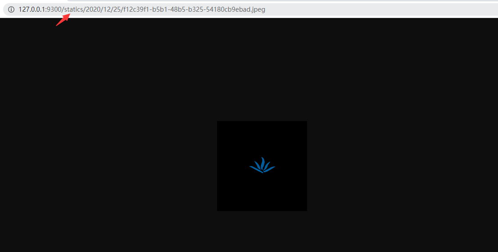
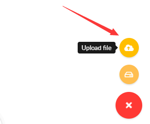
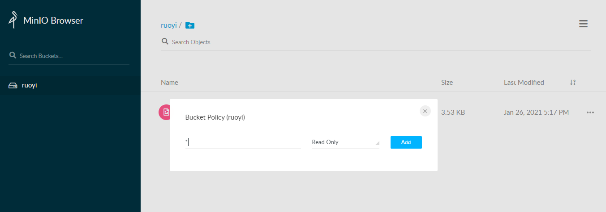

# Ruoyi框架之分布式文件


<!--more-->

# 分布式文件

## [#](http://doc.ruoyi.vip/ruoyi-cloud/cloud/file.html#基本介绍)基本介绍

- 什么是分布式文件

分布式文件系统是指文件系统管理的物理存储资源不一定直接连接在本地节点上，而是通过计算机网络与节点相连。

- 为什么要使用分布式文件

分布式文件系统是面对互联网的需求而产生，互联网时代对海量数据如何存储？靠简单的增加硬盘的个数已经满足不了我们的要求，因为硬盘传输速度有限但是数据在急剧增长，另外我们还要要做好数据备份、数据安全等。

`ruoyi-file`目前支持三种存储方式，`本地存储`、`MinIO存储`、`FastDfs存储`，可以在`ruoyi-file-dev.yml`配置。

## [#](http://doc.ruoyi.vip/ruoyi-cloud/cloud/file.html#本地存储)本地存储

1、文件配置

```yml
# 本地文件上传    
file:
    # 访问地址
    domain: http://127.0.0.1:9300
	# 本地存放的路径地址
    path: D:/ruoyi/uploadPath
	# 映射地址
    prefix: /statics
```

2、继承`WebMvcConfigurer`，重写`addResourceHandlers`，在`registry`里面配置访问路径和映射到的服务器本地路径。

```java
package com.ruoyi.file.config;

import java.io.File;
import org.springframework.beans.factory.annotation.Value;
import org.springframework.context.annotation.Configuration;
import org.springframework.web.servlet.config.annotation.ResourceHandlerRegistry;
import org.springframework.web.servlet.config.annotation.WebMvcConfigurer;

/**
 * 通用映射配置
 * 
 * @author ruoyi
 */
@Configuration
public class ResourcesConfig implements WebMvcConfigurer
{
    /**
     * 上传文件存储在本地的根路径
     */
    @Value("${file.path}")
    private String localFilePath;

    /**
     * 资源映射路径 前缀
     */
    @Value("${file.prefix}")
    public String localFilePrefix;

    @Override
    public void addResourceHandlers(ResourceHandlerRegistry registry)
    {
        /** 本地文件上传路径 */
        registry.addResourceHandler(localFilePrefix + "/**")
                .addResourceLocations("file:" + localFilePath + File.separator);
    }
}
```

3、启动`ruoyi-file`应用，访问`statics`会被映射到本地项目`D:/ruoyi/uploadPath`下的目录里面。



## [#](http://doc.ruoyi.vip/ruoyi-cloud/cloud/file.html#minio存储)MinIO存储

### [#](http://doc.ruoyi.vip/ruoyi-cloud/cloud/file.html#下载方式)下载方式

- Windows平台安装包下载

可以从`https://min.io/download#/windows`下载`minio.exe`可执行的文件。

Windows下载后新建一个目录存放`minio`文件，例如`D:\minioData`，直接在`cmd`下运行`minio.exe server D:\minioData`。

启动成功以后如下图，最后红色字提示修改`access Key`和`Secret Key`


提示

如果觉得官网下载慢，可以使用我分享的网盘地址: https://pan.baidu.com/s/1E9J52g6uW_VFWY34fHL6zA 提取码: vneh

- 打开控制台

```
minio`提供了一个可视化的管理控制平台，安装好之后，在浏览器中输入([http://localhost:9000/ (opens new window)](http://localhost:9000/))就可以访问了，默认的用户名和密码都是`minioadmin
```


### [#](http://doc.ruoyi.vip/ruoyi-cloud/cloud/file.html#如何使用)如何使用

配置文件

```yml
# Minio配置
minio:
  url: http://127.0.0.1:9000
  # 账号
  accessKey: minioadmin
  # 密码
  secretKey: minioadmin
  # MinIO桶名字
  bucketName: ruoyi
```

- 创建桶

在后台管理界面选择`+号`创建你的`Create Bucket`，可以理解为一个文件夹用来存放图片。桶创建成功之后就可以上传图片了。


- 上传图片

在后台管理界面选择`+号`上传你的`Upload file`，上传你自己的图片。在文件列表的右边就可以看到图片了。



### [#](http://doc.ruoyi.vip/ruoyi-cloud/cloud/file.html#访问策略)访问策略

设置`* ReadOnly`则所有用户通过文件路径即可访问，私有桶则不必设置访问策略。



启动`ruoyi-file`应用，在浏览器中打开([http://127.0.0.1:9000/ruoyi/ruoyi.png (opens new window)](http://127.0.0.1:9000/ruoyi/ruoyi.png))就可以访问图片了。

## [#](http://doc.ruoyi.vip/ruoyi-cloud/cloud/file.html#fastdfs存储)FastDfs存储

文件存储、文件同步、文件上传、文件下载等，解决了文件大容量存储和高性能访问问题。

### [#](http://doc.ruoyi.vip/ruoyi-cloud/cloud/file.html#下载方式-2)下载方式

创建目录`mkdir /home/fastdfs`

1)、下载安装libfastcommon

1、下载libfastcommon v1.0.7

```bash
wget https://github.com/happyfish100/libfastcommon/archive/V1.0.7.tar.gz
```

2、解压libfastcommon v1.0.7

```bash
tar -xvf V1.0.7.tar.gz`
cd libfastcommon-1.0.7
```

3、编译、安装

```bash
./make.sh
./make.sh install
```

4、创建软链接

```bash
ln -s /usr/lib64/libfastcommon.so /usr/local/lib/libfastcommon.so
ln -s /usr/lib64/libfastcommon.so /usr/lib/libfastcommon.so
ln -s /usr/lib64/libfdfsclient.so /usr/local/lib/libfdfsclient.so
ln -s /usr/lib64/libfdfsclient.so /usr/lib/libfdfsclient.so
```

2)、下载安装FastDFS

1、下载FastDFS

```bash
wget https://github.com/happyfish100/fastdfs/archive/V5.05.tar.gz
```

2、解压FastDFS

```bash
tar -xvf V5.05.tar.gz
cd fastdfs-5.05
```

3、编译、安装

```bash
./make.sh
./make.sh install
```

3)、配置 Tracker 服务

上述安装成功后，在/etc/目录下会有一个fdfs的目录，进入它。会看到三个.sample后缀的文件，这是作者给我们的示例文件， 我们需要把其中的tracker.conf.sample文件改为tracker.conf配置文件并修改它：

```bash
cp tracker.conf.sample tracker.conf
vi tracker.conf
```

编辑tracker.conf

```bash
# 配置文件是否不生效，false 为生效
disabled=false
# 提供服务的端口
port=22122
# Tracker 数据和日志目录地址
base_path=//home/data/fastdfs
# HTTP 服务端口
http.server_port=80
```

创建tracker基础数据目录，即base_path对应的目录

```bash
mkdir -p /home/data/fastdfs
```

使用ln -s 建立软链接

```bash
ln -s /usr/bin/fdfs_trackerd /usr/local/bin
ln -s /usr/bin/stop.sh /usr/local/bin
ln -s /usr/bin/restart.sh /usr/local/bin
```

启动服务

```bash
service fdfs_trackerd start
service fdfs_trackerd stop
service fdfs_trackerd restart
```

查看监听

```bash
netstat -unltp|grep fdfs
```

如果看到22122端口正常被监听后，这时候说明Tracker服务启动成功啦！

`tracker server`目录及文件结构 `Tracker`服务启动成功后，会在`base_path`下创建`data`、`logs`两个目录。目录结构如下：

```text
${base_path}
  |__data
  |   |__storage_groups.dat：存储分组信息
  |   |__storage_servers.dat：存储服务器列表
  |__logs
  |   |__trackerd.log： tracker server 日志文件 
```

4)、配置 Storage 服务

进入`/etc/fdfs`目录，复制`FastDFS`存储器样例配置文件`storage.conf.sample`，并重命名为`storage.conf`

```bash
# cd /etc/fdfs
# cp storage.conf.sample storage.conf
# vi storage.conf
```

编辑storage.conf

```bash
# 配置文件是否不生效，false 为生效
disabled=false
# 指定此 storage server 所在 组(卷)
group_name=group1
# storage server 服务端口
port=23000
# 心跳间隔时间，单位为秒 (这里是指主动向 tracker server 发送心跳)
heart_beat_interval=30
# Storage 数据和日志目录地址(根目录必须存在，子目录会自动生成)
base_path=/home/data/fastdfs/storage
# 存放文件时 storage server 支持多个路径。这里配置存放文件的基路径数目，通常只配一个目录。
store_path_count=1
# 逐一配置 store_path_count 个路径，索引号基于 0。
# 如果不配置 store_path0，那它就和 base_path 对应的路径一样。
store_path0=/home/data/fastdfs/storage
# FastDFS 存储文件时，采用了两级目录。这里配置存放文件的目录个数。 
# 如果本参数只为 N（如： 256），那么 storage server 在初次运行时，会在 store_path 下自动创建 N * N 个存放文件的子目录。
subdir_count_per_path=256
# tracker_server 的列表 ，会主动连接 tracker_server
# 有多个 tracker server 时，每个 tracker server 写一行 公网访问需要配置公网IP
tracker_server=192.168.1.190:22122
# 允许系统同步的时间段 (默认是全天) 。一般用于避免高峰同步产生一些问题而设定。
sync_start_time=00:00
sync_end_time=23:59
```

创建storaged基础数据目录，即base_path对应的目录

```bash
mkdir -p /home/data/fastdfs/storage
```

使用ln -s 建立软链接

```bash
ln -s /usr/bin/fdfs_storaged /usr/local/bin
```

启动服务

```bash
service fdfs_storaged start
service fdfs_storaged stop
service fdfs_storaged restart
```

查看监听

```bash
netstat -unltp|grep fdfs
```

启动`Storage`前确保`Tracker`是启动的。初次启动成功，会在`/home/data/fastdfs/storage`目录下创建`data`、`logs`两个目录。 如果看到`23000端口`正常被监听后，这时候说明`Storage`服务启动成功啦！

查看`Storage`和`Tracker`是否在通信

```bash
/usr/bin/fdfs_monitor /etc/fdfs/storage.conf
```

### [#](http://doc.ruoyi.vip/ruoyi-cloud/cloud/file.html#配置nginx)配置Nginx

1、下载安装Nginx和fastdfs-nginx-module 安装以下的开发库:

```bash
yum install readline-devel pcre-devel openssl-devel -y
```

2、下载fastdfs-nginx-module-1.20.tar

```bash
tar -xvf fastdfs-nginx-module-1.20.tar
```

3、编辑fastdfs-nginx-module-1.20/src/config文件修改

```bash
vi fastdfs-nginx-module-1.20/src/config
ngx_module_incs="/usr/include/fastdfs /usr/include/fastcommon/"
CORE_INCS="$CORE_INCS /usr/include/fastdfs /usr/include/fastcommon/"
```

4、配置nginx安装，加入fastdfs-nginx-module模块（需要先安装好nginx）

```bash
./configure --add-module=../fastdfs-nginx-module-master/src/
```

5、编译、安装

```bash
make && make install
```

6、查看Nginx的模块

```bash
./nginx -v
```

7、复制fastdfs-nginx-module源码中的配置文件到/etc/fdfs目录，并修改

```bash
cd /home/FastDFS/fastdfs-nginx-module-1.20/src
cp mod_fastdfs.conf /etc/fdfs/
```

```bash
# 连接超时时间
connect_timeout=10
# Tracker Server
tracker_server=192.168.1.190:22122
# StorageServer 默认端口
storage_server_port=23000
# 如果文件ID的uri中包含/group**，则要设置为true
url_have_group_name = true
# Storage 配置的store_path0路径，必须和storage.conf中的一致
store_path0=/home/data/fastdfs/storage
```

8、复制FastDFS的部分配置文件到/etc/fdfs目录

```bash
cd /home/FastDFS/fastdfs-5.11/conf
cp http.conf /etc/fdfs/
cp mime.types /etc/fdfs/
```

9、配置nginx，修改nginx.conf：

```bash
location ~/group([0-9])/M00 {
    ngx_fastdfs_module;
}
```

10、启动Nginx：

```bash
./nginx
ngx_http_fastdfs_set pid=11256
```

### [#](http://doc.ruoyi.vip/ruoyi-cloud/cloud/file.html#如何使用-2)如何使用

1、配置文件

```yml
# FastDFS配置
fdfs:
  domain: http://8.129.231.12
  soTimeout: 3000
  connectTimeout: 2000
  trackerList: 8.129.231.12:22122
```

启动`ruoyi-file`应用，调用`upload`上传接口后会返回一个地址，在浏览器中打开`http://8.129.231.12/group1/M00/00/00/xxxx.png`就可以访问图片了。

## [#](http://doc.ruoyi.vip/ruoyi-cloud/cloud/file.html#切换存储方式)切换存储方式

目前默认采用的是本地存储，可以通过注解`@Primary`指定需要使用的文件接口。

@Primary：意思是在众多相同的bean中，优先使用用@Primary注解的bean。

1.在多数据源的时候，使用@Primary注解用于指定其中一个作为主数据源，即如果数据库操作没有指明使用哪个数据源的时候，默认使用主数据源，这个时候我们就使用到了@primary这个注解。

```java
@Primary
@Service
public class LocalSysFileServiceImpl implements ISysFileService
{
    .....
}
```

**本地文件存储**：`LocalSysFileServiceImpl.java`

**Minio 文件存储**：`MinioSysFileServiceImpl.java`

**FastDFS文件存储**：`FastDfsSysFileServiceImpl.java`

