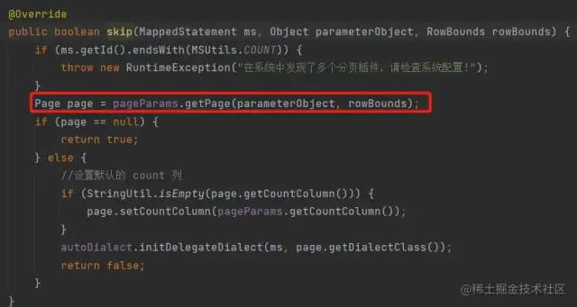

# ruoyi框架之分页解析


<!--more-->

# ruoyi框架分页原理

## 分页实现

- 前端采用基于`bootstrap`的轻量级表格插件[bootstrap-table(opens new window)](https://github.com/wenzhixin/bootstrap-table)
- 后端采用基于`mybatis`的轻量级分页插件[pageHelper(opens new window)](https://github.com/pagehelper/Mybatis-PageHelper)

提示

前后端分页实现流程

### [#](http://doc.ruoyi.vip/ruoyi/document/htsc.html#前端调用实现)前端调用实现

1、前端定义分页流程

```javascript
// 一般在查询参数中定义分页变量
queryParams: {
  pageNum: 1,
  pageSize: 10
},

// 页面添加分页组件，传入分页变量
<pagination
  v-show="total>0"
  :total="total"
  :page.sync="queryParams.pageNum"
  :limit.sync="queryParams.pageSize"
  @pagination="getList"
/>

// 调用后台方法，传入参数 获取结果
listUser(this.queryParams).then(response => {
    this.userList = response.rows;
    this.total = response.total;
  }
);
```

### [#](http://doc.ruoyi.vip/ruoyi/document/htsc.html#后台逻辑实现)后台逻辑实现

```java
@PostMapping("/list")
@ResponseBody
public TableDataInfo list(User user)
{
    startPage();  // 此方法配合前端完成自动分页
    List<User> list = userService.selectUserList(user);
    return getDataTable(list);
}
```

- 常见坑点1：`selectPostById`莫名其妙的分页。例如下面这段代码

```java
startPage();
List<User> list;
if(user != null){
    list = userService.selectUserList(user);
} else {
    list = new ArrayList<User>();
}
Post post = postService.selectPostById(1L);
return getDataTable(list);
```

原因分析：这种情况下由于`user`存在`null`的情况，就会导致`pageHelper`生产了一个分页参数，但是没有被消费，这个参数就会一直保留在这个线程上。 当这个线程再次被使用时，就可能导致不该分页的方法去消费这个分页参数，这就产生了莫名其妙的分页。
上面这个代码，应该写成下面这个样子才能保证安全。

```java
List<User> list;
if(user != null){
	startPage();
	list = userService.selectUserList(user);
} else {
	list = new ArrayList<User>();
}
Post post = postService.selectPostById(1L);
return getDataTable(list);
```

- 常见坑点2：添加了`startPage`方法。也没有正常分页。例如下面这段代码

```java
startPage();
Post post = postService.selectPostById(1L);
List<User> list = userService.selectUserList(user);
return getDataTable(list);
```

原因分析：只对该语句以后的第一个查询`（Select）`语句得到的数据进行分页。
上面这个代码，应该写成下面这个样子才能正常分页。

```java
Post post = postService.selectPostById(1L);
startPage();
List<User> list = userService.selectUserList(user);
return getDataTable(list);
```

注意

如果改为其他数据库需修改配置`application.yml`文件中的属性`helperDialect=你的数据库`

## 实现原理

1、所有的controller继承自BaseController,而在BaseController中实现了分页方法

```java
public class BaseController
{
    /**
     * 设置请求分页数据
     */
    protected void startPage()
    {
        PageUtils.startPage();
    }
}
```

2、在PageUtils中设置分页参数

```java
public class PageUtils extends PageHelper
{
    /**
     * 设置请求分页数据
     */
    public static void startPage()
    {
        PageDomain pageDomain = TableSupport.buildPageRequest();
        Integer pageNum = pageDomain.getPageNum();
        Integer pageSize = pageDomain.getPageSize();
        String orderBy = SqlUtil.escapeOrderBySql(pageDomain.getOrderBy());
        Boolean reasonable = pageDomain.getReasonable();
        PageHelper.startPage(pageNum, pageSize, orderBy).setReasonable(reasonable);
    }

    /**
     * 清理分页的线程变量
     */
    public static void clearPage()
    {
        PageHelper.clearPage();
    }
}
```

3、TableSupport中获取对应的分页参数

```java
public class TableSupport
{
    /**
     * 当前记录起始索引
     */
    public static final String PAGE_NUM = "pageNum";

    /**
     * 每页显示记录数
     */
    public static final String PAGE_SIZE = "pageSize";

    /**
     * 排序列
     */
    public static final String ORDER_BY_COLUMN = "orderByColumn";

    /**
     * 排序的方向 "desc" 或者 "asc".
     */
    public static final String IS_ASC = "isAsc";

    /**
     * 分页参数合理化
     */
    public static final String REASONABLE = "reasonable";

    /**
     * 封装分页对象
     */
    public static PageDomain getPageDomain()
    {
        PageDomain pageDomain = new PageDomain();
        //分页默认第一页
        pageDomain.setPageNum(Convert.toInt(ServletUtils.getParameter(PAGE_NUM), 1));
        //页大小10
        pageDomain.setPageSize(Convert.toInt(ServletUtils.getParameter(PAGE_SIZE), 10));
        //排序列
        pageDomain.setOrderByColumn(ServletUtils.getParameter(ORDER_BY_COLUMN));
        //升序降序
        pageDomain.setIsAsc(ServletUtils.getParameter(IS_ASC));
        //分页对象合理化
        pageDomain.setReasonable(ServletUtils.getParameterToBool(REASONABLE));
        return pageDomain;
    }

    public static PageDomain buildPageRequest()
    {
        return getPageDomain();
    }
}
```

4、解析PageHelper.startPage(pageNum, pageSize, orderBy).setReasonable(reasonable);

- pageNum：页数
- pageSize：每页数据量
- orderBy：排序
- reasonable：分页合理化，对于不合理的分页参数自动处理，比如传递pageNum是小于0，会默认设置为1.

继续跟踪，连续点击startpage构造方法到达如下位置：

```java
/**
 * 开始分页
 *
 * @param pageNum      页码
 * @param pageSize     每页显示数量
 * @param count        是否进行count查询
 * @param reasonable   分页合理化,null时用默认配置
 * @param pageSizeZero true且pageSize=0时返回全部结果，false时分页,null时用默认配置
 */
public static <E> Page<E> startPage(int pageNum, int pageSize, boolean count, Boolean reasonable, Boolean pageSizeZero) {
    Page<E> page = new Page<E>(pageNum, pageSize, count);
    page.setReasonable(reasonable);
    page.setPageSizeZero(pageSizeZero);
    // 1、获取本地分页
    Page<E> oldPage = getLocalPage();
    if (oldPage != null && oldPage.isOrderByOnly()) {
        page.setOrderBy(oldPage.getOrderBy());
    }
     // 2、设置本地分页
    setLocalPage(page);
    return page;
}
```

到达终点位置了，分别是：`getLocalPage()`和`setLocalPage(page)`，分别来看下：

getLocalPage()

进入方法：

```java
/**
 * 获取 Page 参数
 *
 * @return
 */
public static <T> Page<T> getLocalPage() {
    return LOCAL_PAGE.get();
}
```

看看常量`LOCAL_PAGE`是个什么路数？

```java
protected static final ThreadLocal<Page> LOCAL_PAGE = new ThreadLocal<Page>();
```

好家伙，是`ThreadLocal`，学过java基础的都知道吧，独属于每个线程的本地缓存对象。

当一个请求来的时候，会获取持有当前请求的线程的ThreadLocal，调用`LOCAL_PAGE.get()`，查看当前线程是否有未执行的分页配置。

setLocalPage(page)

此方法显而易见，设置线程的分页配置：

```java
protected static void setLocalPage(Page page) {
    LOCAL_PAGE.set(page);
}
```

## mybatis使用pageHelper分析

我们需要关注的就是mybatis在何时使用的这个ThreadLocal，也就是何时将分页餐数获取到的。

前面提到过，通过PageHelper的`startPage()`方法进行page缓存的设置，当程序执行sql接口mapper的方法时，就会被拦截器`PageInterceptor`拦截到。

PageHelper其实就是mybatis的分页插件，其实现原理就是通过拦截器的方式，pageHelper通`PageInterceptor`实现分页效果，我们只关注`intercept`方法：

```java
@Override
public Object intercept(Invocation invocation) throws Throwable {
    try {
        Object[] args = invocation.getArgs();
        MappedStatement ms = (MappedStatement) args[0];
        Object parameter = args[1];
        RowBounds rowBounds = (RowBounds) args[2];
        ResultHandler resultHandler = (ResultHandler) args[3];
        Executor executor = (Executor) invocation.getTarget();
        CacheKey cacheKey;
        BoundSql boundSql;
        // 由于逻辑关系，只会进入一次
        if (args.length == 4) {
            //4 个参数时
            boundSql = ms.getBoundSql(parameter);
            cacheKey = executor.createCacheKey(ms, parameter, rowBounds, boundSql);
        } else {
            //6 个参数时
            cacheKey = (CacheKey) args[4];
            boundSql = (BoundSql) args[5];
        }
        checkDialectExists();
        //对 boundSql 的拦截处理
        if (dialect instanceof BoundSqlInterceptor.Chain) {
            boundSql = ((BoundSqlInterceptor.Chain) dialect).doBoundSql(BoundSqlInterceptor.Type.ORIGINAL, boundSql, cacheKey);
        }
        List resultList;
        //调用方法判断是否需要进行分页，如果不需要，直接返回结果
        if (!dialect.skip(ms, parameter, rowBounds)) {
            //判断是否需要进行 count 查询
            if (dialect.beforeCount(ms, parameter, rowBounds)) {
                //查询总数
                Long count = count(executor, ms, parameter, rowBounds, null, boundSql);
                //处理查询总数，返回 true 时继续分页查询，false 时直接返回
                if (!dialect.afterCount(count, parameter, rowBounds)) {
                    //当查询总数为 0 时，直接返回空的结果
                    return dialect.afterPage(new ArrayList(), parameter, rowBounds);
                }
            }
            resultList = ExecutorUtil.pageQuery(dialect, executor,
                    ms, parameter, rowBounds, resultHandler, boundSql, cacheKey);
        } else {
            //rowBounds用参数值，不使用分页插件处理时，仍然支持默认的内存分页
            resultList = executor.query(ms, parameter, rowBounds, resultHandler, cacheKey, boundSql);
        }
        return dialect.afterPage(resultList, parameter, rowBounds);
    } finally {
        if(dialect != null){
            dialect.afterAll();
        }
    }
}
```

如上所示是intecept的全部代码，我们下面只关注几个终点位置：

### **设置分页：dialect.skip(ms, parameter, rowBounds)**

此处的`skip方法`进行设置分页参数，内部调用方法：

```go
Page page = pageParams.getPage(parameterObject, rowBounds);
```

继续跟踪`getPage()`，发现此方法的第一行就获取了ThreadLocal的值：

```go
Page page = PageHelper.getLocalPage();
```

### **统计数量：dialect.beforeCount(ms, parameter, rowBounds)**

我们都知道，分页需要获取记录总数，所以，这个拦截器会在分页前先进行count操作。

如果count为0，则直接返回，不进行分页：

```java
//处理查询总数，返回 true 时继续分页查询，false 时直接返回
if (!dialect.afterCount(count, parameter, rowBounds)) {
    //当查询总数为 0 时，直接返回空的结果
    return dialect.afterPage(new ArrayList(), parameter, rowBounds);
}
```

afterPage其实是对分页结果的封装方法，即使不分页，也会执行，只不过返回空列表。

### **分页：ExecutorUtil.pageQuery**

在处理完count方法后，就是真正的进行分页了：

```java
resultList = ExecutorUtil.pageQuery(dialect, executor,
        ms, parameter, rowBounds, resultHandler, boundSql, cacheKey);
```

此方法在执行分页之前，会判断是否执行分页，依据就是前面我们通过ThreadLocal的获取的page。

当然，不分页的查询，以及新增和更新不会走到这个方法当中。

### **非分页：executor.query**

而是会走到下面的这个分支：

```java
resultList = executor.query(ms, parameter, rowBounds, resultHandler, cacheKey, boundSql);
```

**我们可以思考一下，如果ThreadLoad在使用后没有被清除，当执行非分页的方法时，那么就会将Limit拼接到sql后面。**

为什么不分也得也会拼接？我们回头看下前面提到的`dialect.skip(ms, parameter, rowBounds)`:



图片

如上所示，只要page被获取到了，那么这个sql，就会走前面提到的`ExecutorUtil.pageQuery`分页逻辑，最终导致出现不可预料的情况。

其实PageHelper对于分页后的ThreaLocal是有清除处理的。

### **清除TheadLocal**

在intercept方法的最后，会在sql方法执行完成后，清理page缓存：

```java
finally {
    if(dialect != null){
        dialect.afterAll();
    }
}
```

看看这个`afterAll()`方法:

```java
@Override
public void afterAll() {
    //这个方法即使不分页也会被执行，所以要判断 null
    AbstractHelperDialect delegate = autoDialect.getDelegate();
    if (delegate != null) {
        delegate.afterAll();
        autoDialect.clearDelegate();
    }
    clearPage();
}
```

只关注 `clearPage()`：

```java
/**
 * 移除本地变量
 */

public static void clearPage() {
    LOCAL_PAGE.remove();
}
```

## **小结**

到此为止，关于PageHelper的使用方式就讲解完了。

整体看下来，似乎不会存在什么问题，但是我们可以考虑集中极端情况：

- 如果使用了`startPage()`，但是没有执行对应的sql，那么就表明，当前线程ThreadLocal被设置了分页参数，可是没有被使用，当下一个使用此线程的请求来时，就会出现问题。
- 如果程序在执行sql前，发生异常了，就没办法执行finally当中的`clearPage()`方法，也会造成线程的ThreadLocal被污染。

所以，官方给我们的建议，在**使用PageHelper进行分页时，执行sql的代码要紧跟startPage()方法**。

除此之外，我们可以**手动调用`clearPage()`方法**，在存在问题的方法之前。

需要注意：**不要分页的方法前手动调用clearPage，将会导致你的分页出现问题**。
