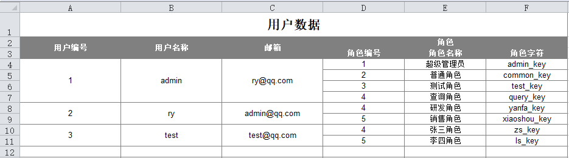

# Ruoyi框架之导入导出


<!--more-->

## 导入导出

在实际开发中经常需要使用导入导出功能来加快数据的操作。在项目中可以使用注解来完成此项功能。 在需要被导入导出的实体类属性添加`@Excel`注解，目前支持参数如下：

### [#](http://doc.ruoyi.vip/ruoyi-cloud/document/htsc.html#注解参数说明)注解参数说明

| 参数                  | 类型     | 默认值                        | 描述                                                |
| --------------------- | -------- | ----------------------------- | --------------------------------------------------- |
| sort                  | int      | Integer.MAX_VALUE             | 导出时在excel中排序，值越小越靠前                   |
| name                  | String   | 空                            | 导出到Excel中的名字                                 |
| dateFormat            | String   | 空                            | 日期格式, 如: yyyy-MM-dd                            |
| readConverterExp      | String   | 空                            | 读取内容转表达式 (如: 0=男,1=女,2=未知)             |
| separator             | String   | ,                             | 分隔符，读取字符串组内容                            |
| scale                 | int      | -1                            | BigDecimal 精度 默认:-1(默认不开启BigDecimal格式化) |
| roundingMode          | int      | BigDecimal.ROUND_HALF_EVEN    | BigDecimal 舍入规则 默认:BigDecimal.ROUND_HALF_EVEN |
| celltype              | Enum     | Type.STRING                   | 导出类型（0数字 1字符串 2图片）                     |
| height                | String   | 14                            | 导出时在excel中每个列的高度 单位为字符              |
| width                 | String   | 16                            | 导出时在excel中每个列的宽 单位为字符                |
| suffix                | String   | 空                            | 文字后缀,如% 90 变成90%                             |
| defaultValue          | String   | 空                            | 当值为空时,字段的默认值                             |
| prompt                | String   | 空                            | 提示信息                                            |
| combo                 | String   | Null                          | 设置只能选择不能输入的列内容                        |
| headerBackgroundColor | Enum     | IndexedColors.GREY_50_PERCENT | 导出列头背景色IndexedColors.XXXX                    |
| headerColor           | Enum     | IndexedColors.WHITE           | 导出列头字体颜色IndexedColors.XXXX                  |
| backgroundColor       | Enum     | IndexedColors.WHITE           | 导出单元格背景色IndexedColors.XXXX                  |
| color                 | Enum     | IndexedColors.BLACK           | 导出单元格字体颜色IndexedColors.XXXX                |
| targetAttr            | String   | 空                            | 另一个类中的属性名称,支持多级获取,以小数点隔开      |
| isStatistics          | boolean  | false                         | 是否自动统计数据,在最后追加一行统计数据总和         |
| type                  | Enum     | Type.ALL                      | 字段类型（0：导出导入；1：仅导出；2：仅导入）       |
| align                 | Enum     | HorizontalAlignment.CENTER    | 导出对齐方式HorizontalAlignment.XXXX                |
| handler               | Class    | ExcelHandlerAdapter.class     | 自定义数据处理器                                    |
| args                  | String[] | {}                            | 自定义数据处理器参数                                |

### [#](http://doc.ruoyi.vip/ruoyi-cloud/document/htsc.html#导出实现流程)导出实现流程

1、前端调用方法（参考如下）

```javascript
// 查询参数 queryParams
queryParams: {
  pageNum: 1,
  pageSize: 10,
  userName: undefined
},

/** 导出按钮操作 */
handleExport() {
  this.download('system/xxxx/export', {
	...this.queryParams
  }, `post_${new Date().getTime()}.xlsx`)
}
```

2、添加导出按钮事件

```html
<el-button
  type="warning"
  icon="el-icon-download"
  size="mini"
  @click="handleExport"
>导出</el-button>
```

3、在实体变量上添加@Excel注解

```java
@Excel(name = "用户序号", prompt = "用户编号")
private Long userId;

@Excel(name = "用户名称")
private String userName;
	
@Excel(name = "用户性别", readConverterExp = "0=男,1=女,2=未知")
private String sex;

@Excel(name = "最后登陆时间", width = 30, dateFormat = "yyyy-MM-dd HH:mm:ss")
private Date loginDate;
```

4、在Controller添加导出方法

```java
@Log(title = "用户管理", businessType = BusinessType.EXPORT)
@PreAuthorize(hasPermi = "system:user:export")
@PostMapping("/export")
public void export(HttpServletResponse response, SysUser user) throws IOException
{
	List<SysUser> list = userService.selectUserList(user);
	ExcelUtil<SysUser> util = new ExcelUtil<SysUser>(SysUser.class);
	util.exportExcel(response, list, "用户数据");
}
```

### [#](http://doc.ruoyi.vip/ruoyi-cloud/document/htsc.html#导入实现流程)导入实现流程

1、前端调用方法（参考如下）

```javascript
import { getToken } from "@/utils/auth";

// 用户导入参数
upload: {
  // 是否显示弹出层（用户导入）
  open: false,
  // 弹出层标题（用户导入）
  title: "",
  // 是否禁用上传
  isUploading: false,
  // 是否更新已经存在的用户数据
  updateSupport: 0,
  // 设置上传的请求头部
  headers: { Authorization: "Bearer " + getToken() },
  // 上传的地址
  url: process.env.VUE_APP_BASE_API + "/system/user/importData"
},

// 导入模板接口importTemplate
import { importTemplate } from "@/api/system/user";

/** 导入按钮操作 */
handleImport() {
  this.upload.title = "用户导入";
  this.upload.open = true;
},
/** 下载模板操作 */
importTemplate() {
  importTemplate().then(response => {
	this.download(response.msg);
  });
},
// 文件上传中处理
handleFileUploadProgress(event, file, fileList) {
  this.upload.isUploading = true;
},
// 文件上传成功处理
handleFileSuccess(response, file, fileList) {
  this.upload.open = false;
  this.upload.isUploading = false;
  this.$refs.upload.clearFiles();
  this.$alert(response.msg, "导入结果", { dangerouslyUseHTMLString: true });
  this.getList();
},
// 提交上传文件
submitFileForm() {
  this.$refs.upload.submit();
}
```

2、添加导入按钮事件

```html
<el-button
  type="info"
  icon="el-icon-upload2"
  size="mini"
  @click="handleImport"
>导入</el-button>
```

3、添加导入前端代码

```html
<!-- 用户导入对话框 -->
<el-dialog :title="upload.title" :visible.sync="upload.open" width="400px">
  <el-upload
	ref="upload"
	:limit="1"
	accept=".xlsx, .xls"
	:headers="upload.headers"
	:action="upload.url + '?updateSupport=' + upload.updateSupport"
	:disabled="upload.isUploading"
	:on-progress="handleFileUploadProgress"
	:on-success="handleFileSuccess"
	:auto-upload="false"
	drag
  >
	<i class="el-icon-upload"></i>
	<div class="el-upload__text">
	  将文件拖到此处，或
	  <em>点击上传</em>
	</div>
	<div class="el-upload__tip" slot="tip">
	  <el-checkbox v-model="upload.updateSupport" />是否更新已经存在的用户数据
	  <el-link type="info" style="font-size:12px" @click="importTemplate">下载模板</el-link>
	</div>
	<div class="el-upload__tip" style="color:red" slot="tip">提示：仅允许导入“xls”或“xlsx”格式文件！</div>
  </el-upload>
  <div slot="footer" class="dialog-footer">
	<el-button type="primary" @click="submitFileForm">确 定</el-button>
	<el-button @click="upload.open = false">取 消</el-button>
  </div>
</el-dialog>
```

4、在实体变量上添加@Excel注解，默认为导出导入，也可以单独设置仅导入Type.IMPORT

```java
@Excel(name = "用户序号")
private Long id;

@Excel(name = "部门编号", type = Type.IMPORT)
private Long deptId;

@Excel(name = "用户名称")
private String userName;

/** 导出部门多个对象 */
@Excels({
	@Excel(name = "部门名称", targetAttr = "deptName", type = Type.EXPORT),
	@Excel(name = "部门负责人", targetAttr = "leader", type = Type.EXPORT)
})
private SysDept dept;

/** 导出部门单个对象 */
@Excel(name = "部门名称", targetAttr = "deptName", type = Type.EXPORT)
private SysDept dept;
```

5、在Controller添加导入方法，updateSupport属性为是否存在则覆盖（可选）

```java
@Log(title = "用户管理", businessType = BusinessType.IMPORT)
@PostMapping("/importData")
public AjaxResult importData(MultipartFile file, boolean updateSupport) throws Exception
{
	ExcelUtil<SysUser> util = new ExcelUtil<SysUser>(SysUser.class);
	List<SysUser> userList = util.importExcel(file.getInputStream());
	LoginUser loginUser = tokenService.getLoginUser(ServletUtils.getRequest());
	String operName = loginUser.getUsername();
	String message = userService.importUser(userList, updateSupport, operName);
	return AjaxResult.success(message);
}

@GetMapping("/importTemplate")
public AjaxResult importTemplate()
{
	ExcelUtil<SysUser> util = new ExcelUtil<SysUser>(SysUser.class);
	return util.importTemplateExcel("用户数据");
}
```

提示

也可以直接到main运行此方法测试。

```java
InputStream is = new FileInputStream(new File("D:\\test.xlsx"));
ExcelUtil<Entity> util = new ExcelUtil<Entity>(Entity.class);
List<Entity> userList = util.importExcel(is);
```

### 自定义标题信息

有时候我们希望导出表格包含标题信息，我们可以这样做。

**导出用户管理表格新增标题（用户列表）**

```java
public AjaxResult export(SysUser user)
{
	List<SysUser> list = userService.selectUserList(user);
	ExcelUtil<SysUser> util = new ExcelUtil<SysUser>(SysUser.class);
	return util.exportExcel(list, "用户数据", "用户列表");
}
```

**导入表格包含标题处理方式，其中`1`表示标题占用行数，根据实际情况填写。**

```java
public AjaxResult importData(MultipartFile file, boolean updateSupport) throws Exception
{
	ExcelUtil<SysUser> util = new ExcelUtil<SysUser>(SysUser.class);
	List<SysUser> userList = util.importExcel(file.getInputStream(), 1);
	String operName = SecurityUtils.getUsername();
	String message = userService.importUser(userList, updateSupport, operName);
	return AjaxResult.success(message);
}
```

### [#](http://doc.ruoyi.vip/ruoyi/document/htsc.html#自定义数据处理器)自定义数据处理器

有时候我们希望数据展现为一个特殊的格式，或者需要对数据进行其它处理。`Excel`注解提供了自定义数据处理器以满足各种业务场景。而实现一个数据处理器也是非常简单的。如下：

1、在实体类用`Excel`注解`handler`属性指定自定义的数据处理器

```java
public class User extends BaseEntity
{
    @Excel(name = "用户名称", handler = MyDataHandler.class, args = { "aaa", "bbb" })
    private String userName;
}
```

2、编写数据处理器`MyDataHandler`继承`ExcelHandlerAdapter`，返回值为处理后的值。

```java
public class MyDataHandler implements ExcelHandlerAdapter
{
    @Override
    public Object format(Object value, String[] args)
    {
        // value 为单元格数据值
		// args 为excel注解args参数组
		return value;
    }
}
```

### [#](http://doc.ruoyi.vip/ruoyi/document/htsc.html#自定义隐藏属性列)自定义隐藏属性列

有时候我们希望对列信息根据业务去动态显示，那么我们可以进行如下处理。

示例：对用户进行条件判断，符合条件则隐藏属性。导出的文件则不会显示此列信息。

```java
@PostMapping("/export")
public void export(HttpServletResponse response, SysUser user)
{
	List<SysUser> list = userService.selectUserList(user);
	ExcelUtil<SysUser> util = new ExcelUtil<SysUser>(SysUser.class);
	if (条件A) {
	  // 不显示用户ID（单个）
	  util.hideColumn("userId");
	} else if (条件B) {
	  // 不显示用户名称、用户手机（多个）
	  util.hideColumn("userId", "phonenumber");
	}
	util.exportExcel(response, list, "用户数据");
}
```

### [#](http://doc.ruoyi.vip/ruoyi/document/htsc.html#导出对象的子列表)导出对象的子列表

有时候对象里面还包含集合列表，例如用户管理包含多个角色需要导出，那么我们可以进行如下处理。

**SysUser.java**

```java
public class SysUser
{
    @Excel(name = "用户编号", cellType = ColumnType.NUMERIC, width = 20, needMerge = true)
    private String userId;

    @Excel(name = "用户名称", width = 20, needMerge = true)
    private String userName;

    @Excel(name = "邮箱", width = 20, needMerge = true)
    private String email;

    @Excel(name = "角色")
    private List<SysRole> roles;

    public String getUserId()
    {
        return userId;
    }

    public void setUserId(String userId)
    {
        this.userId = userId;
    }

    public String getUserName()
    {
        return userName;
    }

    public void setUserName(String userName)
    {
        this.userName = userName;
    }

    public String getEmail()
    {
        return email;
    }

    public void setEmail(String email)
    {
        this.email = email;
    }

    public List<SysRole> getRoles()
    {
        return roles;
    }

    public void setRoles(List<SysRole> roles)
    {
        this.roles = roles;
    }
}
```


**SysRole.java**

```java
public class SysRole
{
    @Excel(name = "角色编号", cellType = ColumnType.NUMERIC)
    private String roleId;

    @Excel(name = "角色名称")
    private String roleName;

    @Excel(name = "角色字符")
    private String roleKey;

    public String getRoleId()
    {
        return roleId;
    }

    public void setRoleId(String roleId)
    {
        this.roleId = roleId;
    }

    public String getRoleName()
    {
        return roleName;
    }

    public void setRoleName(String roleName)
    {
        this.roleName = roleName;
    }

    public String getRoleKey()
    {
        return roleKey;
    }

    public void setRoleKey(String roleKey)
    {
        this.roleKey = roleKey;
    }

}
```

**测试验证**

```java
public class Test
{
    public static void main(String[] args) throws IOException
    {
        List<SysUser> userList = new ArrayList<SysUser>();

        SysUser user1 = new SysUser();
        List<SysRole> roles1 = new ArrayList<SysRole>();

        SysRole role1 = new SysRole();
        role1.setRoleId("1");
        role1.setRoleName("超级管理员");
        role1.setRoleKey("admin_key");

        SysRole role2 = new SysRole();
        role2.setRoleId("2");
        role2.setRoleName("普通角色");
        role2.setRoleKey("common_key");
        
        SysRole role3 = new SysRole();
        role3.setRoleId("3");
        role3.setRoleName("测试角色");
        role3.setRoleKey("test_key");
        
        SysRole role4 = new SysRole();
        role4.setRoleId("4");
        role4.setRoleName("查询角色");
        role4.setRoleKey("query_key");

        roles1.add(role1);
        roles1.add(role2);
        roles1.add(role3);
        roles1.add(role4);

        user1.setUserId("1");
        user1.setUserName("admin");
        user1.setEmail("ry@qq.com");
        user1.setRoles(roles1);

        userList.add(user1);
        
        
        SysUser user2 = new SysUser();
        List<SysRole> roles2 = new ArrayList<SysRole>();

        SysRole role21 = new SysRole();
        role21.setRoleId("4");
        role21.setRoleName("研发角色");
        role21.setRoleKey("yanfa_key");

        SysRole role22 = new SysRole();
        role22.setRoleId("5");
        role22.setRoleName("销售角色");
        role22.setRoleKey("xiaoshou_key");

        roles2.add(role21);
        roles2.add(role22);

        user2.setUserId("2");
        user2.setUserName("ry");
        user2.setEmail("admin@qq.com");
        user2.setRoles(roles2);
        
        userList.add(user2);
        
        SysUser user3 = new SysUser();
        List<SysRole> roles3 = new ArrayList<SysRole>();

        SysRole role31 = new SysRole();
        role31.setRoleId("4");
        role31.setRoleName("张三角色");
        role31.setRoleKey("zs_key");

        SysRole role32 = new SysRole();
        role32.setRoleId("5");
        role32.setRoleName("李四角色");
        role32.setRoleKey("ls_key");

        roles3.add(role31);
        roles3.add(role32);

        user3.setUserId("3");
        user3.setUserName("test");
        user3.setEmail("test@qq.com");
        user3.setRoles(roles3);
        
        userList.add(user3);

        ExcelUtil<SysUser> util = new ExcelUtil<SysUser>(SysUser.class);
        AjaxResult ajax = util.exportExcel(userList, "用户数据", "用户数据");
        System.out.println(ajax.toString());
    }
}
```

**导出文件结果** 

## [#](http://doc.ruoyi.vip/ruoyi/document/htsc.html#上传下载)上传下载

首先创建一张上传文件的表，例如：

```sql
drop table if exists sys_file_info;
create table sys_file_info (
  file_id           int(11)          not null auto_increment       comment '文件id',
  file_name         varchar(50)      default ''                    comment '文件名称',
  file_path         varchar(255)     default ''                    comment '文件路径',
  primary key (file_id)
) engine=innodb auto_increment=1 default charset=utf8 comment = '文件信息表';
```

### [#](http://doc.ruoyi.vip/ruoyi/document/htsc.html#上传实现流程)上传实现流程

1、代码生成`sys_file_info`表相关代码并复制到对应目录。

2、参考示例修改代码。

```html
<input id="filePath" name="filePath" class="form-control" type="file">
```

```javascript
function submitHandler() {
	if ($.validate.form()) {
		uploadFile();
	}
}

function uploadFile() {
	var formData = new FormData();
	if ($('#filePath')[0].files[0] == null) {
		$.modal.alertWarning("请先选择文件路径");
		return false;
	}
	formData.append('fileName', $("#fileName").val());
	formData.append('file', $('#filePath')[0].files[0]);
	$.ajax({
		url: prefix + "/add",
		type: 'post',
		cache: false,
		data: formData,
		processData: false,
		contentType: false,
		dataType: "json",
		success: function(result) {
			$.operate.successCallback(result);
		}
	});
}
```


3、在`FileInfoController`添加对应上传方法

```java
@PostMapping("/add")
@ResponseBody
public AjaxResult addSave(@RequestParam("file") MultipartFile file, FileInfo fileInfo) throws IOException
{
	// 上传文件路径
	String filePath = RuoYiConfig.getUploadPath();
	// 上传并返回新文件名称
	String fileName = FileUploadUtils.upload(filePath, file);
	fileInfo.setFilePath(fileName);
	return toAjax(fileInfoService.insertFileInfo(fileInfo));
}
```

4、上传成功后需要预览可以对该属性格式化处理

```javascript
{
	field : 'filePath', 
	title: '文件预览',
	formatter: function(value, row, index) {
		return $.table.imageView(value);
	}
},
```

如需对文件格式控制，设置`application.yml`中的`multipart`属性

```yml
# 文件上传
servlet:
   multipart:
     # 单个文件大小
     max-file-size:  10MB
     # 设置总上传的文件大小
     max-request-size:  20MB
```

注意：如果只是单纯的上传一张图片没有其他参数可以使用通用方法 `/common/upload`
请求处理方法 `com.ruoyi.web.controller.common.CommonController`

### [#](http://doc.ruoyi.vip/ruoyi/document/htsc.html#下载实现流程)下载实现流程

1、参考示例代码。

```javascript
function downloadFile(value){
	window.location.href = ctx + "common/download/resource?resource=" + value;
}
```

2、参考`Controller`下载方法

```java
/**
 * 本地资源通用下载
 */
@GetMapping("/common/download/resource")
public void resourceDownload(String resource, HttpServletRequest request, HttpServletResponse response)
		throws Exception
{
	// 本地资源路径
	String localPath = Global.getProfile();
	// 数据库资源地址
	String downloadPath = localPath + StringUtils.substringAfter(resource, Constants.RESOURCE_PREFIX);
	// 下载名称
	String downloadName = StringUtils.substringAfterLast(downloadPath, "/");
	response.setCharacterEncoding("utf-8");
	response.setContentType("multipart/form-data");
	response.setHeader("Content-Disposition",
			"attachment;fileName=" + FileUtils.setFileDownloadHeader(request, downloadName));
	FileUtils.writeBytes(downloadPath, response.getOutputStream());
}
```

