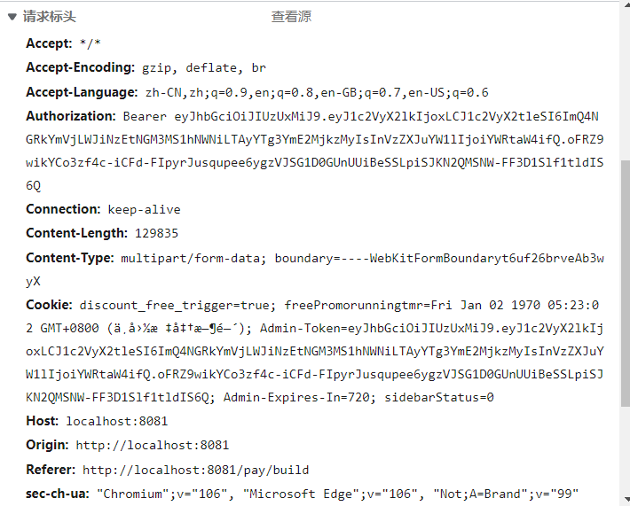
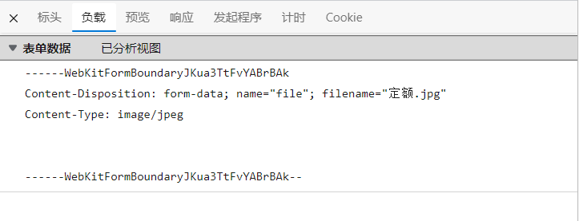

# Ruoyi框架之文件上传


<!--more-->

## 使用ElementUI自带的action

### Vue前端界面元素

```vue
<el-upload
           ref="upload"
           :limit="1"
           accept=".jpg, .png"
           :action="upload.url"
           :headers="upload.headers"
           :file-list="upload.fileList"
           :on-progress="handleFileUploadProgress"
           :on-success="handleFileSuccess"
           :auto-upload="true">
    <el-button slot="trigger" size="small" type="primary">选取文件</el-button>
    <el-button style="margin-left: 10px;" size="small" type="success" :loading="upload.isUploading" @click="submitUpload">上传到服务器</el-button>
    <div slot="tip" class="el-upload__tip">只能上传jpg/png文件，且不超过500kb</div>
</el-upload>
```

### 引入获取`token`

```js
import { getToken } from "@/utils/auth";
```

### Data相关数据

```js
// 上传参数
upload: {
  // 是否禁用上传
  isUploading: false,
  // 设置上传的请求头部
  headers: { Authorization: "Bearer " + getToken() },
  // 上传的地址
  url: process.env.VUE_APP_BASE_API + "/common/upload",
  // 上传的文件列表
  fileList: []
},
```

### 增加相关方法

```js
handleAddFile() {
      this.upload.fileList = [];
    },
    handleUpdateFile(row) {
      this.upload.fileList = [{ name: this.form.fileName, url: this.form.filePath }];
    },
    // 文件提交处理
    submitUpload() {
      this.$refs.upload.submit();
    },
    // 文件上传中处理
    handleFileUploadProgress(event, file, fileList) {
      this.upload.isUploading = true;
    },
    // 文件上传成功处理
    handleFileSuccess(response, file, fileList) {
      this.upload.isUploading = false;
      this.form.filePath = response.url;
      this.msgSuccess(response.msg);
    },
```

### 后端远程调用文件服务

```java
import com.ruoyi.common.core.constant.ServiceNameConstants;
import com.ruoyi.common.core.domain.R;
import com.ruoyi.pay.client.impl.RemoteFileFallbackFactory;
import com.ruoyi.system.api.domain.SysFile;
import com.ruoyi.system.api.factory.RemoteUserFallbackFactory;
import com.ruoyi.system.api.model.LoginUser;
import org.springframework.cloud.openfeign.FeignClient;
import org.springframework.http.MediaType;
import org.springframework.web.bind.annotation.GetMapping;
import org.springframework.web.bind.annotation.PathVariable;
import org.springframework.web.multipart.MultipartFile;

@FeignClient(contextId = "sysFileService", value = ServiceNameConstants.FILE_SERVICE, fallbackFactory = RemoteFileFallbackFactory.class)
public interface RemoteFileService
{
    /**
     * 通过上传文件
     *
     * @param file 文件
     * @return 结果
     */
    @GetMapping(value = "/upload",consumes = MediaType.MULTIPART_FORM_DATA_VALUE)
    public R<SysFile> upload(MultipartFile file);
}
```

### 远程调用降级处理

```java
import com.ruoyi.common.core.domain.R;
import com.ruoyi.pay.client.RemoteFileService;
import com.ruoyi.system.api.RemoteUserService;
import com.ruoyi.system.api.domain.SysFile;
import com.ruoyi.system.api.model.LoginUser;
import org.slf4j.Logger;
import org.slf4j.LoggerFactory;
import org.springframework.cloud.openfeign.FallbackFactory;
import org.springframework.stereotype.Component;
import org.springframework.web.multipart.MultipartFile;

@Component
public class RemoteFileFallbackFactory implements FallbackFactory<RemoteFileService>
{
    private static final Logger log = LoggerFactory.getLogger(RemoteFileFallbackFactory.class);

    @Override
    public RemoteFileService create(Throwable throwable)
    {
        log.error("文件服务调用失败:{}", throwable.getMessage());
        return new RemoteFileService()
        {
            @Override
            public R<SysFile> upload(MultipartFile file)
            {
                return R.fail("上传文件失败:" + throwable.getMessage());
            }
        };
    }
}
```

### 后端Controller

```java
/**
     * 文件上传请求
     */
    @RequiresPermissions("system:qrcodes:add_code")
    @Log(title = "【请填写功能名称】", businessType = BusinessType.INSERT)
    @PostMapping("/qrcode/upload")
    public R<SysFile> upload(MultipartFile file){
        R<SysFile> upload = remoteFileService.upload(file);
        return upload;
    }
```

### 后端debugger


### 前端请求





## 使用自定义http-request

​	不使用action定义文件上传接口，而是通过用户自定义方法实现对文件的上传，例如，更具不同的文件类型上传到不同的接口，相比较与以上方法灵活性更高。


### vue自定义http-request

```vue
<el-upload
            ref="upload_img"
            :limit="1"
            accept=".jpg, .png"
            :action="upload.url"
            :headers="upload.headers"
            :file-list="upload.fileList"
            :on-progress="handleFileUploadProgress"
            :on-success="handleFileSuccess"
            :http-request="uploadSectionFile"
            :auto-upload="true">
            <el-button slot="trigger" size="small" type="primary">选取文件</el-button>
            <el-button style="margin-left: 10px;" size="small" type="success" :loading="upload.isUploading" @click="submitUpload">上传到服务器</el-button>
            <div slot="tip" class="el-upload__tip">只能上传jpg/png文件，且不超过500kb</div>
          </el-upload>
```

### 自定义方法

```js
uploadSectionFile(params){
      // 自定义上传方法
      console.log(params)
      var that = this
      var file = params.file  //获取上传的文件
      let formData = new FormData();
      formData.append("file",params.file)
      console.log(formData.get("file"))
      var fileType = file.type   //获取文件类型
      var isImage = fileType.indexOf('image') != -1  // 判断是否是图片类型
      var file_url = that.$refs.upload_img.uploadFiles[0].url;
      // console.log(file,fileType,isImage,file_url,that.$refs.upload_img);
      var isLt2M = file.size / 1024 / 1024 < 10;
      if (!isLt2M) {  // 判断大小
        alert("上传图片的大小不能超过 2MB!");
        that.$refs.upload_img.uploadFiles = [];  //不符合就清空已选择的图片
        return;
      }
      if(!isImage){  // 文件格式
        alert("请选择图片文件！");
        that.$refs.upload_img.uploadFiles = [];   //不符合就清空已选择的图片
        return;
      }
      that.uploadFile(file);

    },
    uploadFile(file) {   // 上传的函数
      var that = this
      var formData = new FormData();
      formData.append("file", file);
      uploadQrcode(formData)
        .then(function (res) {
          console.log(res);
          if(res.code == 200){  //成功的话将数据插入data中
            that.upload.fileList[0]=res.data;
            // that.file_list[0]=res.data.data.img;
          }else{
            // 上传失败，清除已选择 内容 ，并提示失败原因
            that.$refs.upload_img.uploadFiles = [];
            that.$alert('图片上传异常，原因：'+res.data.data, '', {
              showConfirmButton: false,
              callback: action => {}
            });
          }
        })
    }
```

### 定义API接口

```js
export function uploadQrcode(formData) {
  return request({
    url: '/pay/qrcodes/qrcode/upload',
    method: 'post',
    headers: {
      'Content-Type': 'multipart/form-data', //设置请求头请求格式form
    },
    data: formData,

  })
}
```

### 请求




