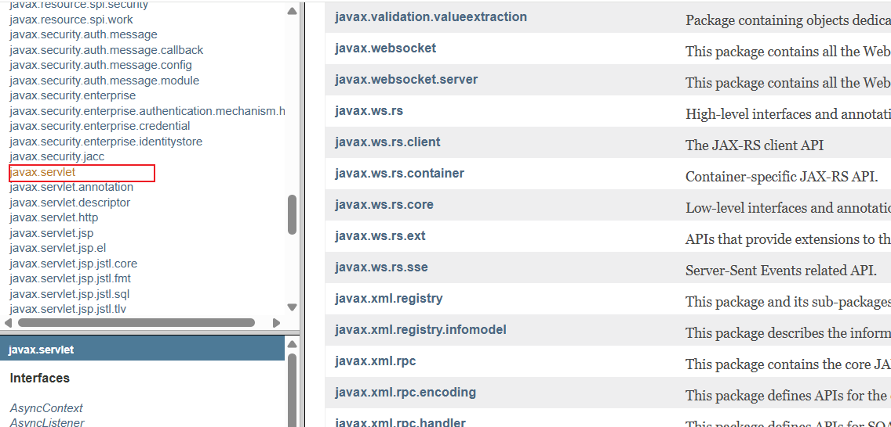
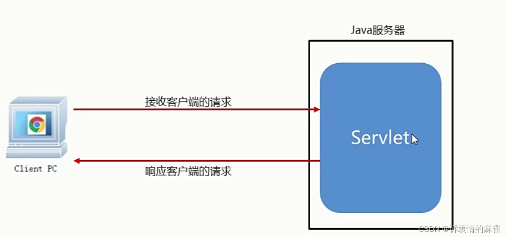
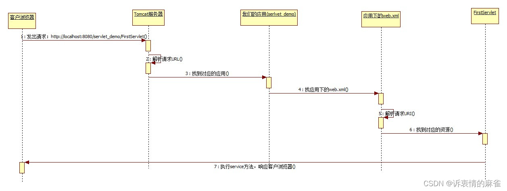
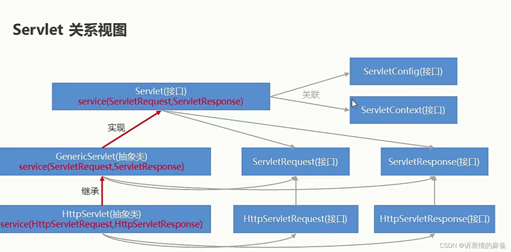

# Servlet


<!--more-->

# Servlet


# 0.学习目标

1. 理解servlet的执行过程
2. 掌握servlet的3种实现方式
3. 理解servlet的生命周期方法
4. 理解servletContext域的使用/学生管理系统的保存的功能


# 1 Servlet

## 1.1 Servlet概述

Servlet是SUN公司提供的一套规范，名称就叫Servlet规范，它也是JavaEE规范之一。我们可以像学习Java基础一样，通过API来学习Servlet。这里需要注意的是，在我们之前JDK的API中是没有Servlet规范的相关内容，需要使用JavaEE的API。目前在Oracle官网中的最新版本是[JavaEE8](https://www.oracle.com/technetwork/java/javaee/documentation/ee8-release-notes-3894362.html)，该网址中介绍了JavaEE8的一些新特性。当然，我们可以通过访问[官方API](https://javaee.github.io/javaee-spec/javadocs/)，学习和查阅里面的内容。

打开官方API网址，在左上部分找到javax.servlet包，在左下部分找到Servlet，如下图显示：



通过阅读API，我们得到如下信息：

第一：Servlet是一个运行在web服务端的java小程序

第二：它可以用于接收和响应客户端的请求

第三：要想实现Servlet功能，可以实现Servlet接口，继承GenericServlet或者HttpServlet

第四：每次请求都会执行service方法

第五：Servlet还支持配置

具体请看下图：




## 1.2 Servlet入门

### 1.2.1 Servlet编码步骤

#### 1）编码步骤

**第一步：前期准备-创建JavaWeb工程**

**第二步：编写一个普通类继承GenericServlet并重写service方法**

**第三步：在web.xml配置Servlet**

#### 2）测试

**在Tomcat中部署项目**

**在浏览器访问Servlet**

### 1.2.2 Servlet执行过程分析

我们通过浏览器发送请求，请求首先到达Tomcat服务器，由服务器解析请求URL，然后在部署的应用列表中找到我们的应用。接下来，在我们的应用中找应用里的web.xml配置文件，在web.xml中找到FirstServlet的配置，找到后执行service方法，最后由FirstServlet响应客户浏览器。整个过程如下图所示：



一句话总结执行过程：

浏览器——>Tomcat服务器——>我们的应用——>应用中的web.xml——>FirstServlet——>响应浏览器


### 1.2.3 Servlet类视图

在《Tomcat和Http协议》这天课程和刚才的入门案例中，我们都定义了自己的Servlet，实现的方式都是选择继承GenericServlet，在Servlet的API介绍中，它提出了我们除了继承GenericServlet外还可以继承HttpServlet，通过查阅servlet的类视图，我们看到GenericServlet还有一个子类HttpServlet。同时，在service方法中还有参数ServletRequest和ServletResponse，它们的关系如下图所示：


### 1.2.4 Servlet编写方式

#### 1）编写方式说明

我们在实现Servlet功能时，可以选择以下三种方式：

第一种：实现Servlet接口，接口中的方法必须全部实现。

​			  使用此种方式，表示接口中的所有方法在需求方面都有重写的必要。此种方式支持最大程度的自定义。

第二种：继承GenericServlet，service方法必须重写，其他方可根据需求，选择性重写。

​			  使用此种方式，表示只在接收和响应客户端请求这方面有重写的需求，而其他方法可根据实际需求选择性重写，使我们的开发Servlet变得简单。但是，此种方式是和HTTP协议无关的。

第三种：继承HttpServlet，它是javax.servlet.http包下的一个抽象类，是GenericServlet的子类。<b><font color='red'>如果我们选择继承HttpServlet时，只需要重写doGet和doPost方法，不要覆盖service方法。</font></b>

​				使用此种方式，表示我们的请求和响应需要和HTTP协议相关。也就是说，我们是通过HTTP协议来访问的。那么每次请求和响应都符合HTTP协议的规范。请求的方式就是HTTP协议所支持的方式（目前我们只知道GET和POST，而实际HTTP协议支持7种请求方式，GET POST PUT DELETE TRACE OPTIONS HEAD )。



#### 2）HttpServlet的使用细节

**第一步：在入门案例的工程中创建一个Servlet继承HttpServlet**

<font color='red'>注意：不要重写任何方法</font>，如下图所示：


**第二步：部署项目并测试访问**

当我们在地址栏输入ServletDemo2的访问URL时，出现了访问错误，状态码是405。提示信息是：方法不允许。

**第三步：分析原因** 

得出HttpServlet的使用结论：

​	 <b><font color='red'>我们继承了HttpServlet，需要重写里面的doGet和doPost方法来接收get方式和post方式的请求。</font></b>

为了实现代码的可重用性，我们只需要在doGet或者doPost方法中一个里面提供具体功能即可，而另外的那个方法只需要调用提供了功能的方法。

查看类的所有实现方法：commond+7

查看类的继承体系：control+H


#### 【小结：

##### servlet 实现的三种方式

```java
* servlet 实现的三种方式：
*      1. 实现servlet接口
*      2. 继承 GenericServlet
*      3. 继承 HttpServlet     (和前面区别： 是一个带有http协议的servlet)
```


## 1.3 Servlet使用细节

### 1.3.1 Servlet的生命周期(掌握)

对象的生命周期，就是对象从生到死的过程，即：出生——活着——死亡。用更偏向 于开发的官方说法就是对象创建到销毁的过程。

出生：请求第一次到达Servlet时，对象就创建出来，并且初始化成功。只出生一次，就放到内存中。

活着：服务器提供服务的整个过程中，该对象一直存在，每次只是执行service方法。

死亡：当服务停止时，或者服务器宕机时，对象消亡。

通过分析Servlet的生命周期我们发现，它的实例化和初始化只会在请求第一次到达Servlet时执行，而销毁只会在Tomcat服务器停止时执行，由此我们得出一个结论，Servlet对象只会创建一次，销毁一次。所以，Servlet对象只有一个实例。如果一个对象实例在应用中是唯一的存在，那么我们就说它是单实例的，即运用了单例模式。


#### 【小结:

> servlet的接口定义了5个方法：
> 其中常用：
>  service : 客户端发起的每次请求当前servlet都会访问到service方法！ （访问N次，执行N次） ---> 用于处理业务（处理用户的每次请求）
>    
> 生命周期方法：
>  init:  初始化  （只执行1次： 对象创建时）   --> 我们可以用来加载资源
>     destroy： 销毁 （只执行1次： 服务器关闭对象销毁时）  --> 我们可以释放资源，然后再销毁


### 1.3.2 Servlet的线程安全

由于Servlet运用了单例模式，即整个应用中只有一个实例对象，所以我们需要分析这个唯一的实例中的类成员是否线程安全。接下来，我们来看下面的的示例：

```java
/**
 * 演示Servlet的线程安全问题：
 *    示例需求：
 *       用两个浏览器模拟两条线程，携带一个username参数。
 * @author 黑马程序员
 * @Company http://www.itheima.com
 */
public class Servlet05 extends HttpServlet {

    private  String username;

    @Override
    protected void doPost(HttpServletRequest req, HttpServletResponse resp) throws ServletException, IOException {

          synchronized (this){
              username =  req.getParameter("username");

              try {
                  Thread.sleep(3000);
              } catch (InterruptedException e) {
                  e.printStackTrace();
              }
              PrintWriter writer = resp.getWriter();
              writer.print("username is："+username);
              writer.close();
          }


    }

    @Override
    protected void doGet(HttpServletRequest req, HttpServletResponse resp) throws ServletException, IOException {
        doPost(req,resp);
    }
}

```


通过上面的测试我们发现，在Servlet中定义了类成员之后，多个浏览器都会共享类成员的数据。其实每一个浏览器端发送请求，就代表是一个线程，那么多个浏览器就是多个线程，所以测试的结果说明了多个线程会共享Servlet类成员中的数据，其中任何一个线程修改了数据，都会影响其他线程。因此，我们可以认为Servlet它不是线程安全的。

分析产生这个问题的根本原因，其实就是因为Servlet是单例，单例对象的类成员只会随类实例化时初始化一次，之后的操作都是改变，而不会重新初始化。

解决这个问题也非常简单，就是在Servlet中定义类成员要慎重。如果类成员是共用的，并且只会在初始化时赋值，其余时间都是获取的话，那么是没问题。如果类成员并非共用，或者每次使用都有可能对其赋值，那么就要考虑线程安全问题了，把它定义到doGet或者doPost方法里面去就可以了。


#### 【小结：】

>  如何避免servlet线程安全问题？
>
>  ```
>  *      --servlet其实是单例的！
>  *      如果是单例对象， 是否存在数据安全问题？(线程安全问题？)
>  *
>  *      如何避免线程安全问题？
>  *              a. 不要在单例对象中，定义成员变量  --- 推荐
>  *              b. 加上锁机制（同步代码代码块）  --- 不建议的！
>  ```

【补充】：

### 1. 关于单例模式：

> **什么是单例：** 在程序运行过程中，不管获取或者访问该对象多少次，最终都是只创建一个对象；
>
> ​						我们今天使用的servlet就是单例模式的！（默认是懒汉）

>  **什么是多例:**   每次访问该对象，都是一个全新的对象，都是新初始化的一个！ （以前用的  new User()）;

**单例实现的两种方式：**


### 2.单例线程不安全，那么我们为什么还要使用？--- 如何避免线程问题？

> 我们的servlet等这些单例对象其实，线程都是存在安全问题的！  -->如何避免！
>
> 我们虽然可以通过上锁来解决，但是我们为了性能，不会上锁！
>
> 
>
> 所以，需要强调开发规范： 
>
> ​				在单例对象中，要谨慎使用成员变量！ 如果是没有必要， 建议不要使用；
>
> ​				只要在成员位置没有变量，那么单例模式数据也是安全的！
>
> 
>
> 为什么servlet被设计成单例呢？
>
> ​				为了性能！


