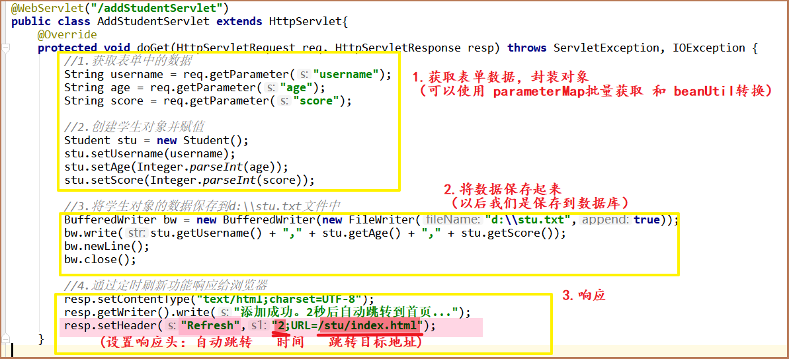
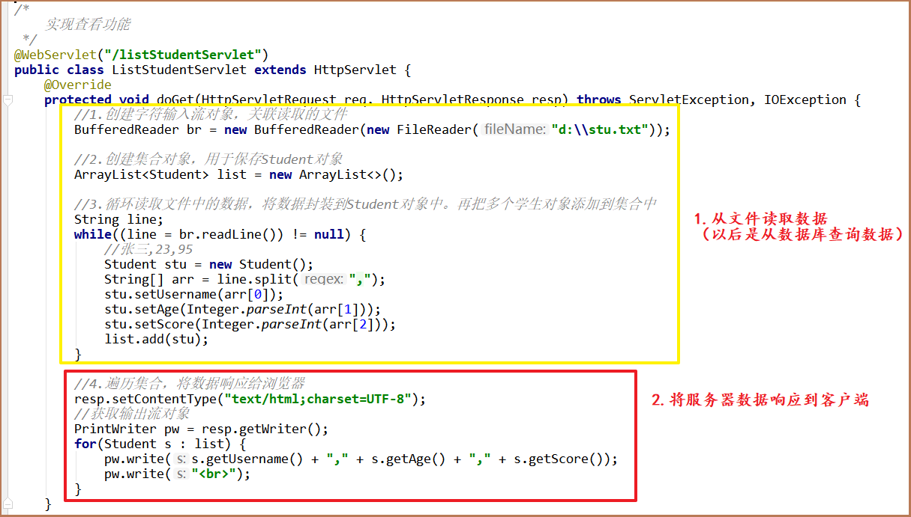
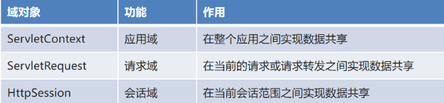
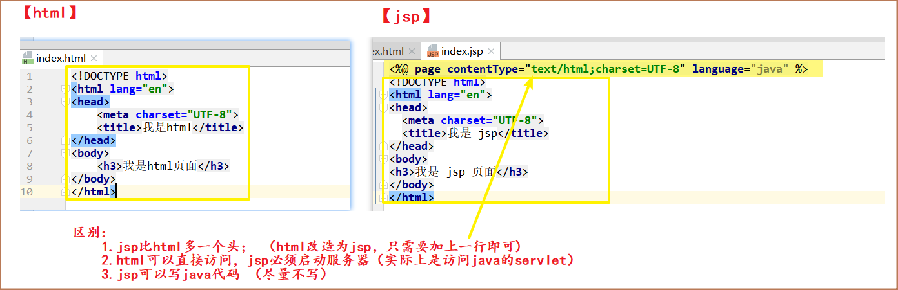
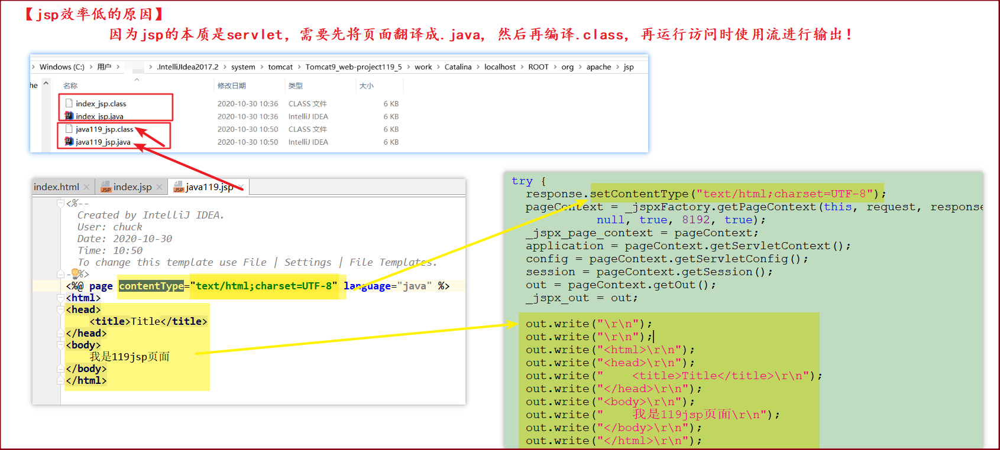
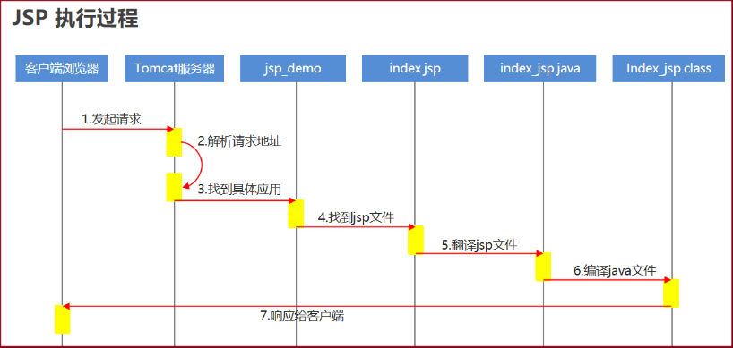
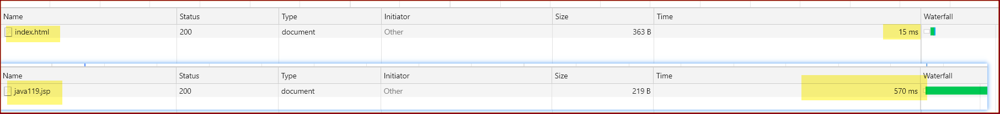
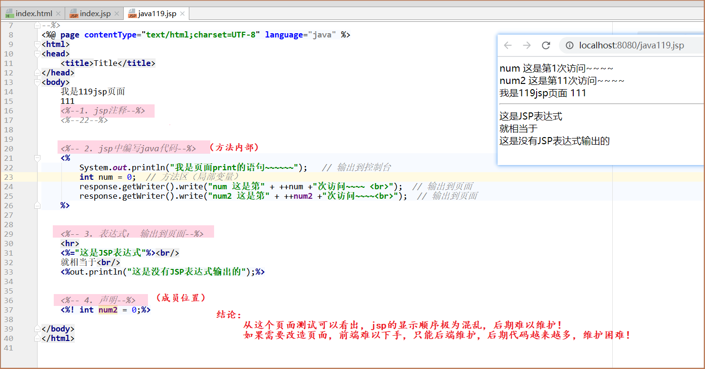
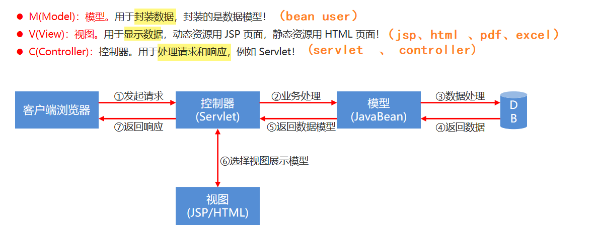

# session & jsp & mysql


<!--more-->

# 【会话技术session&jsp&mysql-随堂笔记】


# 〇.今日重点：


2. session： 服务器端会话技术
   - session是什么
   - session如何使用
   - session的作用范围
3. jsp: 动态页面 
   
- 了解即可
  
3. mysql:数据库

   数据库的安装

   数据库集成到idea

   数据库的crud

   


# 一.request&response综合案例关注点：

##### 客户端添加数据到服务器：




##### 服务器响应数据到客户端（浏览器）：



# 二.session：服务器端会话技术

​	

#### 1.session是什么:

>  ==本质也是采用客户端会话管理技术。 (session必须依赖于cookie  )==
>
> 只不过在客户端保存的是一个特殊标识，而共享的数据保存到了服务器端的内存对象中。 （JSESSIONID)
> 每次请求时，会将特殊标识带到服务器端，根据这个标识来找到对应的内存空间，从而实现数据共享！
> 是 Servlet 规范中四大域对象之一的会话域对象。


**作用：**可以实现数据共享



注意： 从大到小的顺序：  servletContext  > session > request

> 当前服务器有100个用户， 每个用户访问100次，  会分别产生多少个 servletContext  、 session 、request？


#### 2.session的获取：（掌握）

```java
  HttpSession session = request.getSession();
```


#### **3.常用方法：**（掌握）

```Java
// 域对象存取值：
session.setAttribute();
session.getAttribute();
session.removeAttribute();

//// 销毁session : 退出功能
session.invalidate();  

// 获取的是当前session对应的 JSESSIONID  --> 唯一的 （每个会话的id是唯一的）
session.getId(); 
```

# 三.JSP（次要）

#### 1.jsp的概念

> JSP全称是Java Server Page，它和Servlet一样，也是sun公司推出的一套开发动态web资源的技术，称为JSP/Servlet规范。
>
> JSP的本质其实就是一个Servlet。
>
> 
>
> 与html的区别： 可以在页面上也后台java代码！ 
>
>  **注意：**（虽然能写，但是我们应当尽量不写； 能在后台处理的逻辑，不要在页面处理！）


#### 2.jsp快速入门




#### 3.jsp的本质：

>  **jsp效率低下的原因**: (所以大型项目基本不用jsp，一些小型的后台系统会使用)






**效率对比：**




#### 4.jsp语法：





**JSP语法完整示例代码**

```jsp
<%@ page contentType="text/html;charset=UTF-8" language="java" %>
<html>
<head>
    <title>JSP语法</title>
</head>
<body>

<!--Java代码块-->
<% out.println("这是Java代码块");%>
<hr/>

<!--JSP表达式-->
<%="这是JSP表达式"%><br/>
就相当于<br/>
<%out.println("这是没有JSP表达式输出的");%>

<hr/>
<!--JSP声明-->
<%! String str = "声明语法格式";%>
<%=str%>

<hr/>

<%--JSP注释--%>
<!--HTML注释-->

</body>
</html>
```


#### 5.四大域对象对比：（理解域对象的名字和范围）


# 四.MVC模型的理解（重要）

> 把数据的封装、展示和业务处理，进行分工！




**Servlet：**擅长处理业务逻辑，不擅长输出显示界面。在web开发中多用于控制程序逻辑（流程）。所以我们称之为：控制器。

**JSP：**擅长显示界面，不擅长处理程序逻辑。在web开发中多用于展示动态界面。所以我们称之为：视图。


# 五、数据库的基本概念

#### 1.为什么要学数据库？

- 之前我们如果想将一些数据实现永久化存储，可以怎么做呢？没错。使用IO流的技术将数据保存到本地文件中
- 但是接下来我有这样一个需求：将下面的user.txt文件中的王五年龄修改为35

```txt
张三 23 男
李四 24 男
王五 25 女
赵六 26 女
周七 27 男
```

- 我们要如何实现呢？
  - 可以采用字符缓冲流，将每一行数据读取出来，封装为User对象。将多个User对象保存到集合中
  - 然后遍历集合，将王五对象的年龄修改为35,再重新将集合中的对象信息写回到文件中
- 这一套操作太麻烦了，而现在我们有一种更加方便的方式来完成这个需求了，这种方式就是数据库！

#### 2.什么是数据库？

- 用于存储和管理数据的仓库
- 英文单词为：DataBase，简称DB     （工种： DBA  数据库管理员）

#### 3.数据库的好处？

- 可以持久化存储数据
- 方便存储和管理数据
- 使用了统一的方式操作数据库 -- SQL

### 二、MySQL数据库的介绍和安装

#### 1.MySQL数据库介绍

- 小型的数据库
- 开源免费(6版本之前免费)
- 所属于Oracle公司


#### 2.MySQL数据库安装

---查看安装资料

> 1.在windows安装mysql服务器；
>
> 2.在windows安装mysql连接工具；（图形化界面）


### 三、SQL语句

#### 1.数据库、数据表、数据的关系介绍

- 数据库
  - 用于存储和管理数据的仓库
  - 一个库中可以包含多个数据表
- 数据表
  - 数据库最重要的组成部分之一
  - 它由纵向的列和横向的行组成(类似excel表格)
  - 可以指定列名、数据类型、约束等
  - 一个表中可以存储多条数据
- 数据
  - 想要永久化存储的数据


#### 2.SQL介绍

- 什么是SQL
  - Structured Query Language：结构化查询语言
  - 其实就是定义了操作所有关系型数据库的规则。每一种数据库操作的方式可能会存在一些不一样的地方，我们称为“方言”。
- SQL通用语法
  - SQL 语句可以单行或多行书写，以分号结尾。
  - 可使用空格和缩进来增强语句的可读性。
  - MySQL 数据库的 SQL 语句不区分大小写，关键字建议使用大写。
  - 数据库的注释：
    - 单行注释：-- 注释内容       #注释内容(mysql特有)
    - 多行注释：/* 注释内容 */
- SQL分类
  - DDL(Data Definition Language)数据定义语言
    - 用来定义数据库对象：数据库，表，列等。关键字：create, drop,alter 等
  - DML(Data Manipulation Language)数据操作语言
    - 用来对数据库中表的数据进行增删改。关键字：insert, delete, update 等
  - DQL(Data Query Language)数据查询语言
    - 用来查询数据库中表的记录(数据)。关键字：select, where 等
  - DCL(Data Control Language)数据控制语言(了解)
    - 用来定义数据库的访问权限和安全级别，及创建用户。关键字：GRANT， REVOKE 等

### 四.对库和表结构的操作（理解）

#### 3.DDL-操作数据库

- R(Retrieve)：查询

  - 查询所有数据库

  ```mysql
  -- 查询所有数据库
  SHOW DATABASES;
  ```

  

- C(Create)：创建

  - 创建数据库

  ```mysql
  -- 标准语法
  CREATE DATABASE 数据库名称;
  
  -- 创建db1数据库
  CREATE DATABASE db1;
  
  -- 创建一个已存在的数据库会报错
  -- 错误代码：1007  Can't create database 'db1'; database exists
  CREATE DATABASE db1;
  ```

  - 创建数据库(判断，如果不存在则创建)

  ```mysql
  -- 标准语法
  CREATE DATABASE IF NOT EXISTS 数据库名称;
  
  -- 创建数据库db2(判断，如果不存在则创建)
  CREATE DATABASE IF NOT EXISTS db2;
  ```

  - 创建数据库、并指定字符集

  ```mysql
  -- 标准语法
  CREATE DATABASE 数据库名称 CHARACTER SET 字符集名称;
  
  -- 创建数据库db3、并指定字符集utf8
  CREATE DATABASE db3 CHARACTER SET utf8;
  
  -- 查看db3数据库的字符集
  SHOW CREATE DATABASE db3;
  ```

  - 练习：创建db4数据库、如果不存在则创建，指定字符集为utf8

  ```mysql
  -- 创建db4数据库、如果不存在则创建，指定字符集为 utf8
  CREATE DATABASE IF NOT EXISTS db4 CHARACTER SET utf8;
  
  -- 查看db4数据库的字符集
  SHOW CREATE DATABASE db4;
  ```

  - 使用数据库

  ```mysql
  -- 标准语法
  USE 数据库名称；
  
  -- 使用db4数据库
  USE db4;
  ```


##### 【小结：库操作常用sql

> （需要记住的sql）

```sql
-- 1. 创建db4数据库、如果不存在则创建，指定字符集为 utf8
-- CREATE DATABASE IF NOT EXISTS 数据库名 CHARACTER SET 字符集名;
CREATE DATABASE IF NOT EXISTS db01 CHARACTER SET utf8;

-- 2.展示当前数据库下所有的表：  (还没建表的时候没有)
show tables;


-- 3. 删除数据库：  DROP DATABASE 数据库名
DROP DATABASE db03;
```


#### 4.DDL-操作数据表

- R(Retrieve)：查询

  - 查询数据库中所有的数据表

  ```mysql
  -- 使用mysql数据库
  USE mysql;
  
  -- 查询库中所有的表
  SHOW TABLES;
  ```

  - 查询表结构

  ```mysql
  -- 标准语法
  DESC 表名;
  
  -- 查询user表结构
  DESC user;
  ```

  - 查询表字符集

  ```mysql
  -- 标准语法
  SHOW TABLE STATUS FROM 库名 LIKE '表名';
  
  -- 查看mysql数据库中user表字符集
  SHOW TABLE STATUS FROM mysql LIKE 'user';
  ```

- C(Create)：创建

  - 创建数据表

    - 标准语法

    ```mysql
    CREATE TABLE 表名(
        列名1 数据类型1,
        列名2 数据类型2,
        ....
        列名n 数据类型n
    );
    -- 注意：最后一列，不需要加逗号
    ```

    - 数据类型

    ```mysql
    1. int：整数类型
    	* age int
    2. double:小数类型
    	* score double(5,2)
    	* price double
    3. date:日期，只包含年月日     yyyy-MM-dd
    4. datetime:日期，包含年月日时分秒	 yyyy-MM-dd HH:mm:ss
    5. timestamp:时间戳类型	包含年月日时分秒	 yyyy-MM-dd HH:mm:ss	
    	* 如果将来不给这个字段赋值，或赋值为null，则默认使用当前的系统时间，来自动赋值
    6. varchar：字符串
    	* name varchar(20):姓名最大20个字符
    	* zhangsan 8个字符  张三 2个字符*3
    ```

    - 创建数据表

    ```mysql
    -- 使用db3数据库
    USE db3;
    
    -- 创建一个product商品表
    CREATE TABLE product(
    	id INT,				-- 商品编号
    	NAME VARCHAR(30),	-- 商品名称
    	price DOUBLE,		-- 商品价格
    	stock INT,			-- 商品库存
    	insert_time DATE    -- 上架时间
    );
    ```


> 对库的操作： 都是database关键字；
>
> 对表结构的操作： 都是table关键字；
>
> 
>
> 上面的操作都是对数据库、数据表结构操作的sql语句，不涉及数据！
>
> 真正以后非常常用的sql是下面的对数据的crud（增删改查）！


### 五.对数据的操作（重要） -- 对数据的增删改查

#### 5.DML-INSERT语句

- 新增表数据语法

  - 新增格式1：给指定列添加数据

  ```mysql
  -- 标准语法
  INSERT INTO 表名(列名1,列名2,...) VALUES (值1,值2,...);
  
  -- 向product表添加一条数据
  INSERT INTO product(id,NAME,price,stock,insert_time) VALUES (1,'手机',1999,22,'2099-09-09');
  
  -- 向product表添加指定列数据
  INSERT INTO product (id,NAME,price) VALUES (2,'电脑',4999);
  
  -- 查看表中所有数据
  SELECT * FROM product;
  ```

  - 新增格式2：默认给全部列添加数据

  ```mysql
  -- 标准语法
  INSERT INTO 表名 VALUES (值1,值2,值3,...);
  
  -- 默认给全部列添加数据
  INSERT INTO product VALUES (3,'电视',2999,18,'2099-06-06');
  
  -- 查看表中所有数据
  SELECT * FROM product;
  ```

  - 新增格式3：批量添加数据

  ```mysql
  -- 默认添加所有列数据 标准语法
  INSERT INTO 表名 VALUES (值1,值2,值3,...),(值1,值2,值3,...),(值1,值2,值3,...);
  
  -- 批量添加数据
  INSERT INTO product VALUES (4,'冰箱',999,26,'2099-08-08'),(5,'洗衣机',1999,32,'2099-05-10');
  -- 查看表中所有数据
  SELECT * FROM product;
  
  
  -- 给指定列添加数据 标准语法
  INSERT INTO 表名(列名1,列名2,...) VALUES (值1,值2,...),(值1,值2,...),(值1,值2,...);
  
  -- 批量添加指定列数据
  INSERT INTO product (id,NAME,price) VALUES (6,'微波炉',499),(7,'电磁炉',899);
  -- 查看表中所有数据
  SELECT * FROM product;
  ```

- 注意事项

  - 列名和值的数量以及数据类型要对应
  - 除了数字类型，其他数据类型的数据都需要加引号(单引双引都可以，推荐单引)


#### 6.DML-UPDATE语句

- 修改表数据语法

```mysql
-- 标准语法
UPDATE 表名 SET 列名1 = 值1,列名2 = 值2,... [where 条件];

-- 修改手机的价格为3500
UPDATE product SET price=3500 WHERE NAME='手机';

-- 查看所有数据
SELECT * FROM product;

-- 修改电视的价格为1800、库存为36
UPDATE product SET price=1800,stock=36 WHERE NAME='电视';

-- 修改电磁炉的库存为10
UPDATE product SET stock=10 WHERE id=7;
```

- 注意事项
  - 修改语句中必须加条件
  - 如果不加条件，则将所有数据都修改


#### 7.DML-DELETE语句

- 删除表数据语法

```mysql
-- 标准语法
DELETE FROM 表名 [WHERE 条件];

-- 删除product表中的微波炉信息
DELETE FROM product WHERE NAME='微波炉';

-- 删除product表中库存为10的商品信息
DELETE FROM product WHERE stock=10;

-- 查看所有商品信息
SELECT * FROM product;
```

- 注意事项
  - 删除语句中必须加条件
  - 如果不加条件，则将所有数据删除


#### 8.DQL-单表查询

- 数据准备(直接复制执行即可)

```mysql
-- 创建db1数据库
CREATE DATABASE db1;

-- 使用db1数据库
USE db1;

-- 创建数据表
CREATE TABLE product(
	id INT,				-- 商品编号
	NAME VARCHAR(20),	-- 商品名称
	price DOUBLE,		-- 商品价格
	brand VARCHAR(10),	-- 商品品牌
	stock INT,			-- 商品库存
	insert_time DATE    -- 添加时间
);

-- 添加数据
INSERT INTO product VALUES (1,'华为手机',3999,'华为',23,'2088-03-10'),
(2,'小米手机',2999,'小米',30,'2088-05-15'),
(3,'苹果手机',5999,'苹果',18,'2088-08-20'),
(4,'华为电脑',6999,'华为',14,'2088-06-16'),
(5,'小米电脑',4999,'小米',26,'2088-07-08'),
(6,'苹果电脑',8999,'苹果',15,'2088-10-25'),
(7,'联想电脑',7999,'联想',NULL,'2088-11-11');
```

- 查询语法

```mysql
select
	字段列表
from
	表名列表
where
	条件列表
group by
	分组字段
having
	分组之后的条件
order by
	排序
limit
	分页限定
```


##### 查询全部

```mysql
-- 标准语法
SELECT * FROM 表名;

-- 查询product表所有数据
SELECT * FROM product;
```

- 查询部分

  - 多个字段查询

  ```mysql
  -- 标准语法
  SELECT 列名1,列名2,... FROM 表名;
  
  -- 查询名称、价格、品牌
  SELECT NAME,price,brand FROM product;
  ```

# 作业安排：

```sql
-- 1. 创建db4数据库、如果不存在则创建，指定字符集为 utf8
-- CREATE DATABASE IF NOT EXISTS 数据库名 CHARACTER SET 字符集名;

-- 2.展示当前数据库下所有的表：  

-- 3. 删除数据库：  DROP DATABASE 数据库名

-- 4.创建数据库中的表： 创建user表：  id, 姓名username(VARCHAR), 年龄age（int）, 性别gender(VARCHAR = string)，生日birthday（date）

-- 5. 新需求： 修改user2表username为uname, 新增一列 password.


-- 6. 删除表： -- 删除user2表

-- 7.insert插入数据：  在t_user表中插入一条王大锤的数据

-- 8.update修改数据： 修改王大锤的性别为女，年龄为22：


-- 9.delete删除数据：  删除名字叫王大锤的数据：

-- 10. 删除一批性别为女的用户信息：


-- ==========================================

-- 【select查询：】
--  1. 查询全表：   * 代表查询所有字段


--  2. 查询指定字段：  


--  3. 别名： 给字段起别名：    as,也可以省略


-- 4.去重查询： distinct：  ---查询所有用户的名，如果有重复的名字，只展示一个：


-- 5. 对列进行数学运算： 
		-- 查询用户信息，对年龄整体增加10岁：


		-- 对商品数据的价格打五折展示：


-- 6.条件查询： where 
		-- 查询所有的小米品牌的商品

		-- 查询商品价格 1000-5000之间的商品

		
		-- 查询商品价格 1000-5000之间的小米的商品


-------------------【day02】----------------------------------------
-------------------【day02】----------------------------------------
-------------------【day02】----------------------------------------

-- 7.模糊查询： like关键字 
		-- "%" ：代表匹配任意个数模糊匹配;   eg: '%小米%'  xxxx小米xxxx
		-- “_” : 代表模糊匹配一位;    eg： '王_'   王思聪x  王五√
			
		-- 查询商品中包含“智能”关键字的商品
		
		-- 查询用户名包含“徐”的用户：
	
		-- 查询用户名姓“徐”的用户：

		-- 查询用户名第二个字是'宝'的用户：
		
-- 8.排序查询： order by 默认升序， 后面加上 desc代表倒序
		-- 根据商品价格倒序排列：
		
		-- 将所有小米产品，进行价格升序排列：

--  9.聚合函数： 求和sum ,求平均值avg  ,最大值max ,最小值min , 计数count
		SELECT * FROM product ;
		-- 对所有的商品价格进行求和：
		
		-- 求出所有商品的平均价格；   求出user表中用户的平均年龄
		
		-- 最大年龄
		
		-- 最小年龄
		
		-- 计数： count 男性用户有多少个

		
-- 10.分组查询： group by  xxx列名  
--    分组函数group by 通常结合聚合函数(5个)一起使用, 不能跟随便写其他没有分组的列！
		SELECT * FROM product ;
		-- 查询商品表，对品牌进行分组：
		
		-- 查询商品表，对品牌进行分组, 再统计每个品牌的商品个数
		
		-- 查询用户表，对性别进行分组：
		
		-- 查询用户表，对性别进行分组, 统计男性女性分别多少人？


-- 11. 分页查询： limit 参数1,参数2;
--      select * from 表名 limit 0,10;    (参数1代表起始行的索引， 参数2代表每次查询多少条)
--      每次分页查询时，不同的页数只需要变更参数1 的值！ 参数1=（页码-1）*参数2；
		-- 查询product表， 展示第1页数据，每页展示5条：

		-- 查询product表， 展示第2页数据，每页展示5条：


```


# 预习


作业安排：

1. 使用cookie完成：存取值，存活时间设置，访问路径设置

2. 使用session存取数据练习

3. 默写出cookie和session的区别

4. 拓展作业: 

   > 尝试完成一个功能，用于判断用户是否登录：
   >
   > 如果用户已经登录，就让用户可以查询出用户需要的数据；
   >
   > 如果没有登录，就跳转到登录页面；


****


