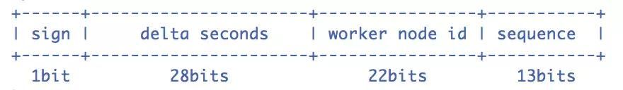
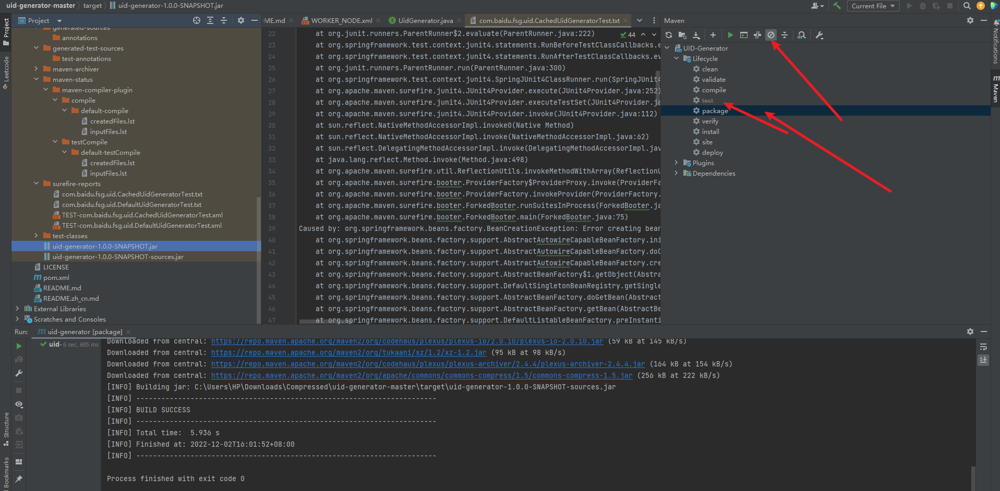
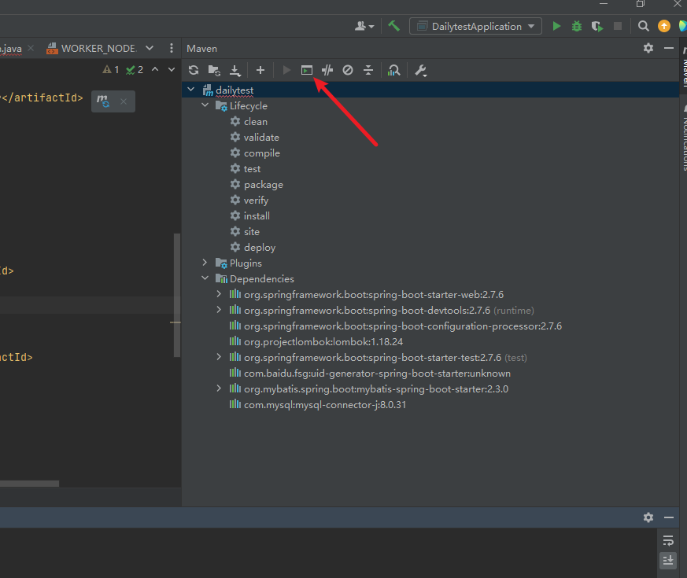
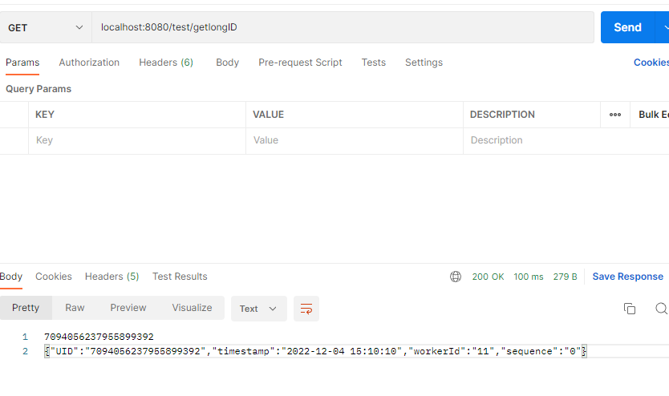

# springboot集成UidGenerator最佳指南


<!--more-->

### UidGenerator

#### 0概述

UidGenerator是百度开源的Java语言实现，基于Snowflake算法的唯一ID生成器。
它是[分布式](https://so.csdn.net/so/search?q=分布式&spm=1001.2101.3001.7020)的，并克服了雪花算法的并发限制。
[单个实例的QPS能超过6000000。](https://blog.csdn.net/qq_29917503/article/details/128039707)
需要的环境：JDK8+，MySQL（用于分配WorkerId）

但是百度对这些组成部分稍微调整了一下：



由上图可知，UidGenerator的时间部分只有28位，这就意味着UidGenerator默认只能承受8.5年（2^28-1/86400/365）
也可以根据你业务的需求，UidGenerator可以适当调整delta seconds、worker node id和sequence占用位数。

对于分布式的业务系统来说，SnowFlake算法的优缺点如下。

► 优点：

> 1）毫秒数在高位，自增序列在低位，整个ID都是趋势递增的；
>
> 2）不依赖数据库等第三方系统，以服务的方式部署，稳定性更高，生成ID的性能也是非常高的；
>
> 3）可以根据自身业务特性分配bit位，非常灵活。

► 缺点：

> 强依赖机器时钟，如果机器上时钟回拨，会导致发号重复或者服务会处于不可用状态。

##### UidGenerator改进后的SnowFlake算法

通过上节，我们知道了原版SnowFlake算法的基本构成。

具体是，原版SnowFlake算法核心组成：

原版SnowFlake算法各字段的具体意义是：

> 1）1位sign标识位；
>
> 2）41位时间戳；
>
> 3）10位workId（即5位数据中心id+5位工作机器id）；
>
> 4）12位自增序列。

而UidGenerator改进后的SnowFlake算法核心组成如下图：


简单来说，UidGenerator能保证“ 指定机器 & 同一时刻 & 某一并发序列 ”，是唯一，并据此生成一个64 bits的唯一ID（long），且默认采用上图字节分配方式。

与原版的snowflake算法不同，UidGenerator还支持自定义时间戳、工作机器id和序列号等各部分的位数，以应用于不同场景（详见源码实现）。

如上图所示，UidGenerator默认ID中各数据位的含义如下：

- 1）sign(1bit)： 固定1bit符号标识，即生成的UID为正数。
- 2）delta seconds (28 bits)： 当前时间，相对于时间基点"2016-05-20"的增量值，单位：秒，最多可支持约8.7年（注意：(a)这里的单位是秒，而不是毫秒！(b)注意这里的用词，是“最多”可支持8.7年，为什么是“最多”，后面会讲）。
- 3）worker id (22 bits)： 机器id，最多可支持约420w次机器启动。内置实现为在启动时由数据库分配，默认分配策略为用后即弃，后续可提供复用策略。
- 4）sequence (13 bits)： 每秒下的并发序列，13 bits可支持每秒8192个并发（注意下这个地方，默认支持qps最大为8192个）。

##### UidGenerator的具体代码实现分析

通过阅读UidGenerator的源码可知，UidGenerator的具体实现有两种选择，即 DefaultUidGenerator 和 CachedUidGenerator。我们分别来看看这两个具体代码实现的精妙之处。

###### **DefaultUidGenerator**

DefaultUidGenerator 的源码很清楚的说明了几个生成ID的关键位的实现逻辑。

1）delta seconds（28 bits）：

这个值是指当前时间与epoch时间的时间差，且单位为秒。epoch时间就是指集成DefaultUidGenerator生成分布式ID服务第一次上线的时间，可配置，也一定要根据你的上线时间进行配置，因为默认的epoch时间可是2016-09-20，不配置的话，会浪费好几年的可用时间。

2）worker id（22bits）：

接下来说一下DefaultUidGenerator是如何给worker id赋值的，搭建DefaultUidGenerator的话，需要创建一个表。

3）sequence（13bits）：

核心代码如下，几个实现的关键点：

> a. synchronized保证线程安全；
>
> b. 如果时间有任何的回拨，那么直接抛出异常；
>
> c. 如果当前时间和上一次是同一秒时间，那么sequence自增。如果同一秒内自增值超过2^13-1，那么就会自旋等待下一秒（getNextSecond）；
>
> d. 如果是新的一秒，那么sequence重新从0开始。


（ 上述源码节选自：DefaultUidGenerator 类中的 nextId 方法）

4）小结：

通过DefaultUidGenerator的实现可知，它对时钟回拨的处理比较简单粗暴。另外如果使用UidGenerator的DefaultUidGenerator方式生成分布式ID，一定要根据你的业务的情况和特点，调整各个字段占用的位数：

<!-- Specified bits & epoch as your demand. No specified the default value will be used -->

< propertyname= "timeBits"value= "29"/>

< propertyname= "workerBits"value= "21"/>

< propertyname= "seqBits"value= "13"/>

< propertyname= "epochStr"value= "2016-09-20"/> 

###### **CachedUidGenerator**

CachedUidGenerator是DefaultUidGenerator的重要改进实现。它的核心利用了RingBuffer，它本质上是一个数组，数组中每个项被称为slot。CachedUidGenerator设计了两个RingBuffer，一个保存唯一ID，一个保存flag。RingBuffer的尺寸是2^n，n必须是正整数。

以下是CachedUidGenerator中的RingBuffer原理示意图：


扩展知识：什么是RingBuffer？

> Ring Buffer的概念，其实来自于Linux内核（Maybe），是为解决某些特殊情况下的竞争问题提供了一种免锁的方法。这种特殊的情况就是当生产者和消费者都只有一个，而在其它情况下使用它也是必须要加锁的。
>
> 环形缓冲区通常有一个读指针和一个写指针。读指针指向环形缓冲区中可读的数据，写指针指向环形缓冲区中可写的缓冲区。通过移动读指针和写指针就可以实现缓冲区的数据读取和写入。在通常情况下，环形缓冲区的读用户仅仅会影响读指针，而写用户仅仅会影响写指针。如果仅仅有一个读用户和一个写用户，那么不需要添加互斥保护机制就可以保证数据的正确性。如果有多个读写用户访问环形缓冲区，那么必须添加互斥保护机制来确保多个用户互斥访问环形缓冲区。

Tail指针、Cursor指针用于环形数组上读写slot：

- Tail指针 表示Producer生产的最大序号(此序号从0开始，持续递增)。Tail不能超过Cursor，即生产者不能覆盖未消费的slot。当Tail已赶上curosr，此时可通过rejectedPutBufferHandler指定PutRejectPolicy
- Cursor指针 表示Consumer消费到的最小序号(序号序列与Producer序列相同)。Cursor不能超过Tail，即不能消费未生产的slot。当Cursor已赶上tail，此时可通过rejectedTakeBufferHandler指定TakeRejectPolicy

CachedUidGenerator采用了双RingBuffer，Uid-RingBuffer用于存储Uid、Flag-RingBuffer用于存储Uid状态(是否可填充、是否可消费)

由于数组元素在内存中是连续分配的，可最大程度利用CPU cache以提升性能。但同时会带来「伪共享」FalseSharing问题，为此在Tail、Cursor指针、Flag-RingBuffer中采用了CacheLine 补齐方式。

RingBuffer填充时机

- 初始化预填充 RingBuffer初始化时，预先填充满整个RingBuffer.
- 即时填充 Take消费时，即时检查剩余可用slot量(tail - cursor)，如小于设定阈值，则补全空闲slots。阈值可通过paddingFactor来进行配置，请参考Quick Start中CachedUidGenerator配置
- 周期填充 通过Schedule线程，定时补全空闲slots。可通过scheduleInterval配置，以应用定时填充功能，并指定Schedule时间间隔


更多具体的 CachedUidGenerator 的代码实现，有兴趣可以仔细读一读，也可以前往百度uid-generator工程的说明页看看具体的算法原理，这里就不再赘述。

简要的小结一下，CachedUidGenerator方式主要通过采取如下一些措施和方案规避了时钟回拨问题和增强唯一性：

- 1）自增列：CachedUidGenerator的workerId在实例每次重启时初始化，且就是数据库的自增ID，从而完美的实现每个实例获取到的workerId不会有任何冲突；
- 2）RingBuffer：CachedUidGenerator不再在每次取ID时都实时计算分布式ID，而是利用RingBuffer数据结构预先生成若干个分布式ID并保存；
- 

###### **小结一下**

CachedUidGenerator通过缓存的方式预先生成一批唯一ID列表，可以解决唯一ID获取时候的耗时。但这种方式也有不好点，一方面需要耗费内存来缓存这部分数据，另外如果访问量不大的情况下，提前生成的UID中的时间戳可能是很早之前的。而对于大部分的场景来说，DefaultUidGenerator 就可以满足相关的需求了，没必要来凑CachedUidGenerator这个热闹。

另外，关于UidGenerator比特位分配的建议：

> 对于并发数要求不高、期望长期使用的应用, 可增加timeBits位数, 减少seqBits位数. 例如节点采取用完即弃的WorkerIdAssigner策略, 重启频率为12次/天, 那么配置成{"workerBits":23,"timeBits":31,"seqBits":9}时, 可支持28个节点以整体并发量14400 UID/s的速度持续运行68年.
>
> 对于节点重启频率频繁、期望长期使用的应用, 可增加workerBits和timeBits位数, 减少seqBits位数. 例如节点采取用完即弃的WorkerIdAssigner策略, 重启频率为24*12次/天, 那么配置成{"workerBits":27,"timeBits":30,"seqBits":6}时, 可支持37个节点以整体并发量2400 UID/s的速度持续运行34年.

官方没有官方的jar包，所以使用需要自己打包，加入maven依赖

#### 打包

先去[仓库拉取代码](https://github.com/baidu/uid-generator)

拖进IDEA打包（需要先点击禁止按钮，跳过打包测试，否则会报错，因为这个包需要连接数据库创建对象）



#### 加入依赖

```shell
mvn install:install-file -Dfile=E:\work\jar\uid-generator-1.0.0-SNAPSHOT.jar -DgroupId=com.baidu.fsg -DartifactId=uid-generator -Dversion=1.0.0-SNAPSHOT -Dpackaging=jar
```

**-Dfile=** 后边填写你的jar包具体位置
**-DgroupId=** 后边对应pom中*groupId*中的名称
**-DartifactId=** 后边对应pom中artifactId中名称
**-Dversion=** 后边对应pom中version中名称

pom文件：

```xml
<name>UID-Generator</name>
<description>An unique id generator</description>
<groupId>com.baidu.fsg</groupId>
<artifactId>uid-generator</artifactId>
<version>1.0.0-SNAPSHOT</version>
```



也可以在全局安装jar包

pom加入依赖

```
<dependency>
    <groupId>com.baidu.fsg</groupId>
    <artifactId>uid-generator</artifactId>
    <version>1.0.0-SNAPSHOT</version>
</dependency>
```


#### 执行WORKER_NODE表脚本

```sql
DROP TABLE IF EXISTS WORKER_NODE;
CREATE TABLE WORKER_NODE
(
ID BIGINT NOT NULL AUTO_INCREMENT COMMENT 'auto increment id',
HOST_NAME VARCHAR(64) NOT NULL COMMENT 'host name',
PORT VARCHAR(64) NOT NULL COMMENT 'port',
TYPE INT NOT NULL COMMENT 'node type: CONTAINER(1), ACTUAL(2), FAKE(3)',
LAUNCH_DATE DATE NOT NULL COMMENT 'launch date',
MODIFIED TIMESTAMP NOT NULL COMMENT 'modified time',
CREATED TIMESTAMP NOT NULL COMMENT 'created time',
PRIMARY KEY(ID)
)
 COMMENT='DB WorkerID Assigner for UID Generator',ENGINE = INNODB;
```


#### maven中加入依赖

```xml
<dependency>
    <groupId>com.baidu.fsg</groupId>
    <artifactId>uid-generator</artifactId>
    <version>1.0.0-SNAPSHOT</version>
</dependency>
<dependency>
    <groupId>commons-lang</groupId>
    <artifactId>commons-lang</artifactId>
    <version>2.6</version>
</dependency>
```

#### 配置文件application.yml里引入自定义配置

```yml
# UidGenerator
# 初始时间, 默认:"2019-02-20"
uid:
  epochStr: 2020-05-08
  # 时间位, 默认:30
  timeBits: 41
  # 机器位, 默认:16
  workerBits: 10
  # 序列号, 默认:7
  seqBits: 12
  # 是否容忍时钟回拨, 默认:true
  enableBackward: true
  # RingBuffer size扩容参数, 可提高UID生成的吞吐量, 默认:3
  CachedUidGenerator:
    boostPower: 3
  # 指定何时向RingBuffer中填充UID, 取值为百分比(0, 100), 默认为50
    paddingFactor: 50
spring:
  datasource:
    driver-class-name: com.mysql.cj.jdbc.Driver
    url: jdbc:mysql://12.168.120.3:3307/hubu_test?serverTimezone=GMT%2B8&useSSL=true
    username: root
    password: 1234567
#mybatis-plus����mapperɨ�� �ص�
mybatis:
  mapper-locations: classpath:/mapper/**/*Mapper.xml,classpath:/mapper/WORKER_NODE.xml

```

#### resource目录创建mapper文件

**WORKER_NODE.xml**

```xml
<?xml version="1.0" encoding="UTF-8"?>
<!DOCTYPE mapper PUBLIC "-//mybatis.org//DTD Mapper 3.0//EN" "http://mybatis.org/dtd/mybatis-3-mapper.dtd">
<mapper namespace="com.baidu.fsg.uid.worker.dao.WorkerNodeDAO">
	<resultMap id="workerNodeRes"
			   type="com.baidu.fsg.uid.worker.entity.WorkerNodeEntity">
		<id column="ID" jdbcType="BIGINT" property="id" />
		<result column="HOST_NAME" jdbcType="VARCHAR" property="hostName" />
		<result column="PORT" jdbcType="VARCHAR" property="port" />
		<result column="TYPE" jdbcType="INTEGER" property="type" />
		<result column="LAUNCH_DATE" jdbcType="DATE" property="launchDate" />
		<result column="MODIFIED" jdbcType="TIMESTAMP" property="modified" />
		<result column="CREATED" jdbcType="TIMESTAMP" property="created" />
	</resultMap>

	<insert id="addWorkerNode" useGeneratedKeys="true" keyProperty="id"
		parameterType="com.baidu.fsg.uid.worker.entity.WorkerNodeEntity">
		INSERT INTO WORKER_NODE
		(HOST_NAME,
		PORT,
		TYPE,
		LAUNCH_DATE,
		MODIFIED,
		CREATED)
		VALUES (
		#{hostName},
		#{port},
		#{type},
		#{launchDate},
		NOW(),
		NOW())
	</insert>

	<select id="getWorkerNodeByHostPort" resultMap="workerNodeRes">
		SELECT
		ID,
		HOST_NAME,
		PORT,
		TYPE,
		LAUNCH_DATE,
		MODIFIED,
		CREATED
		FROM
		WORKER_NODE
		WHERE
		HOST_NAME = #{host} AND PORT = #{port}
	</select>
</mapper>
```

#### Uid配置类注入

```java
package com.jindong.dailytest.config;


import com.baidu.fsg.uid.buffer.RejectedPutBufferHandler;
import com.baidu.fsg.uid.buffer.RejectedTakeBufferHandler;
import com.baidu.fsg.uid.buffer.RingBuffer;
import com.baidu.fsg.uid.impl.CachedUidGenerator;
import com.baidu.fsg.uid.impl.DefaultUidGenerator;
import com.baidu.fsg.uid.worker.DisposableWorkerIdAssigner;
import org.springframework.beans.factory.annotation.Value;
import org.springframework.context.annotation.Bean;
import org.springframework.context.annotation.Configuration;

/**
 * 两种生成策略注入Bean
 *
 * @author Administrator
 */
@Configuration
public class UidGeneratorConfiguration {

    /**
     * RingBuffer size扩容参数, 可提高UID生成的吞吐量. -->
     * 默认:3， 原bufferSize=8192, 扩容后bufferSize= 8192 << 3 = 65536
     * CachedUidGenerator 参数{@link UidGeneratorConfiguration#cachedUidGenerator()}
     */
    private int boostPower = 3;
    /**
     * 指定何时向RingBuffer中填充UID, 取值为百分比(0, 100), 默认为50 -->
     * 举例: bufferSize=1024, paddingFactor=50 -> threshold=1024 * 50 / 100 = 512.
     * 当环上可用UID数量 < 512时, 将自动对RingBuffer进行填充补全
     */
    private int paddingFactor = 50;
    /**
     * 另外一种RingBuffer填充时机, 在Schedule线程中, 周期性检查填充
     * 默认:不配置此项, 即不实用Schedule线程. 如需使用, 请指定Schedule线程时间间隔, 单位:秒
     */
    private Long scheduleInterval;
    /**
     * 拒绝策略: 当环已满, 无法继续填充时 -->
     * 默认无需指定, 将丢弃Put操作, 仅日志记录. 如有特殊需求, 请实现RejectedPutBufferHandler接口(支持Lambda表达式)
     */
    private RejectedPutBufferHandler rejectedPutBufferHandler;
    /**
     * 拒绝策略: 当环已空, 无法继续获取时 -->
     * 默认无需指定, 将记录日志, 并抛出UidGenerateException异常. 如有特殊需求, 请实现RejectedTakeBufferHandler接口(支持Lambda表达式)
     */
    private RejectedTakeBufferHandler rejectedTakeBufferHandler;
    /**
     * 暂时不知道
     */
    private RingBuffer ringBuffer;

    @Bean(name = "cachedUidGenerator")
    public CachedUidGenerator cachedUidGenerator(){
        CachedUidGenerator cachedUidGenerator = new CachedUidGenerator();
        cachedUidGenerator.setWorkerIdAssigner(disposableWorkerIdAssigner());
        cachedUidGenerator.setTimeBits(timeBits);
        cachedUidGenerator.setWorkerBits(workerBits);
        cachedUidGenerator.setSeqBits(seqBits);
        cachedUidGenerator.setEpochStr(epochStr);
        cachedUidGenerator.setBoostPower(boostPower);
        return cachedUidGenerator;
    }

    @Bean(name = "disposableWorkerIdAssigner")
    public DisposableWorkerIdAssigner disposableWorkerIdAssigner(){
        return new DisposableWorkerIdAssigner();
    }


    /**
     * # 时间位, 默认:28
     */
    @Value("${uid.timeBits}")
    private int timeBits;
    /**
     * # 机器位, 默认:22
     */
    @Value("${uid.workerBits}")
    private int workerBits;
    /**
     * # 序列号, 默认:13
     */
    @Value("${uid.seqBits}")
    private int seqBits;
    /**
     * # 初始时间, 默认:"2016-05-20"
     */
    @Value("${uid.epochStr}")
    private String epochStr;

    @Bean(name = "defaultUidGenerator")
    public DefaultUidGenerator defaultUidGenerator(){
        DefaultUidGenerator defaultUidGenerator = new DefaultUidGenerator();
        defaultUidGenerator.setWorkerIdAssigner(disposableWorkerIdAssigner());
        defaultUidGenerator.setTimeBits(timeBits);
        defaultUidGenerator.setWorkerBits(workerBits);
        defaultUidGenerator.setSeqBits(seqBits);
        defaultUidGenerator.setEpochStr(epochStr);
        return defaultUidGenerator;
    }
}
```

#### IdGenerator.java工具类

这边我们使用`CachedUidGenerato`

```java
package com.jindong.dailytest.utils;

import com.baidu.fsg.uid.impl.CachedUidGenerator;
import org.springframework.beans.factory.annotation.Autowired;
import org.springframework.stereotype.Component;

import javax.annotation.Resource;

@Component
public class IdGenerator {
    @Resource(name = "cachedUidGenerator")
    private CachedUidGenerator cachedUidGenerator;

    /**
     * 获取uid
     *
     * @return
     */
    public long nextId() {
        return cachedUidGenerator.getUID();
    }

    /**
     * 格式化传入的uid，方便查看其实际含义
     *
     * @param uid
     * @return
     */
    public String parse(long uid) {
        return cachedUidGenerator.parseUID(uid);
    }
}
```

#### Defgenerator.java工具类

```java
package com.jindong.dailytest.utils;


import com.baidu.fsg.uid.impl.DefaultUidGenerator;
import org.springframework.stereotype.Component;

import javax.annotation.Resource;

/**
 * 默认的生成器策略
 *
 * @author Administrator
 */
@Component
public class DefGenerator {

    @Resource(name = "defaultUidGenerator")
    private DefaultUidGenerator defaultUidGenerator;

    /**
     * 获取uid
     *
     * @return
     */
    public long nextId() {
        return defaultUidGenerator.getUID();
    }

    /**
     * 格式化传入的uid，方便查看其实际含义
     *
     * @param uid
     * @return
     */
    public String parse(long uid) {
        return defaultUidGenerator.parseUID(uid);
    }
}
```

#### Springboot主类加包扫描

```java
@SpringBootApplication
@MapperScan({"com.baidu.fsg"})
public class DailytestApplication {

	public static void main(String[] args) {
		SpringApplication.run(DailytestApplication.class, args);
	}

}
```

#### 测试接口

```java
@RestController
@RequestMapping("test")
public class TestController {

    @Resource
    IdGenerator idGenerator;


    @RequestMapping("demo")
    public String index() {
        return "hello,world";
    }

    @RequestMapping("getlongID")
    public String longToString() {
        long l = idGenerator.nextId();
        String parse = idGenerator.parse(l);
        return l+"\n"+parse;
    }

}
```

#### 测试



