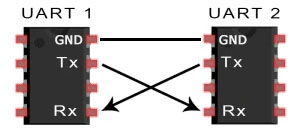
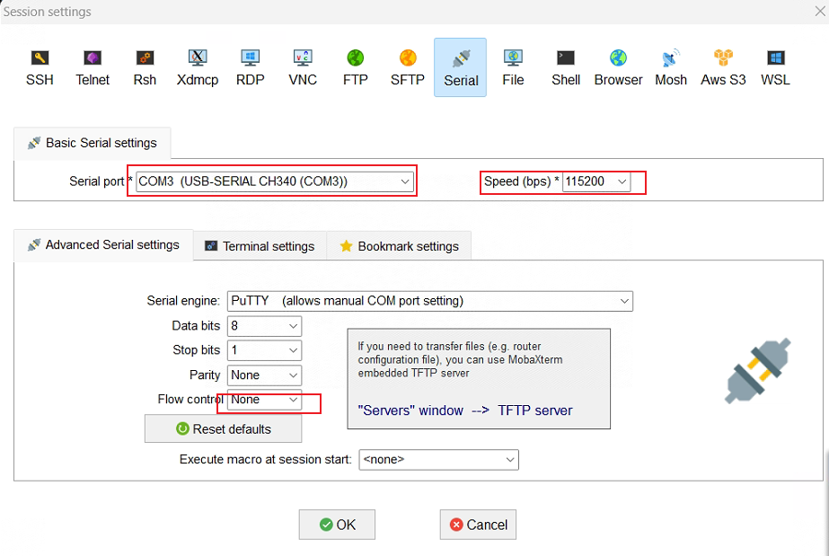

# UART串口调试

<!--more-->

### 通信接口介绍-UART（通用异步接收器发送器）

通用异步收发传输器（Universal Asynchronous Receiver/Transmitter），通常称作UART，是一种异步收发传输器，是电脑硬件的一部分。它将要传输的资料在串行通信与并行通信之间加以转换。作为把并行输入信号转成串行输出信号的芯片，UART通常被集成于其他通讯接口的连接上。

UART 允许两个硬件外围设备之间的异步串行通信。它们可以位于同一块电路板上（例如微控制器与电机或LED屏幕通信），也可以位于两个不同的设备之间（例如设备微控制器与PC通信）。它可以允许通过串行读取/写入设备。

在许多物联网设备中，板上的UART端口保持打开状态，任何人都可以通过串口连接和访问以获得shell，日志输出等。设备在通常情况下会带有一组引脚，当我们连接到微控制器UART RX和TX引脚时，便可用于发送和接收串行数据。

### UART引脚作用介绍：

 VCC：供电pin，一般是3.3v-5v，正极

GND：接地，负极

RXD：接收数据引脚

TXD：发送数据引脚

**连接方法**：开发板单独供电，连接开发板GND、RXD、TXD接口；常用模块USB转TTL模块，模块供电按要求调整

模块GND   -->  开发板GND

**模块RXD   -->  开发板TXD**

**模块TXD   -->  开发板RXD**

### 串口调试注意事项：

1、先连接好UART接口在给开发板通电，否则MobaXterm接收不到串口信息

2、MobaXterm连接信息配置：

3、如果发现控制台窗口不能输入命令，则切换一下Flow control ，多尝试几次

