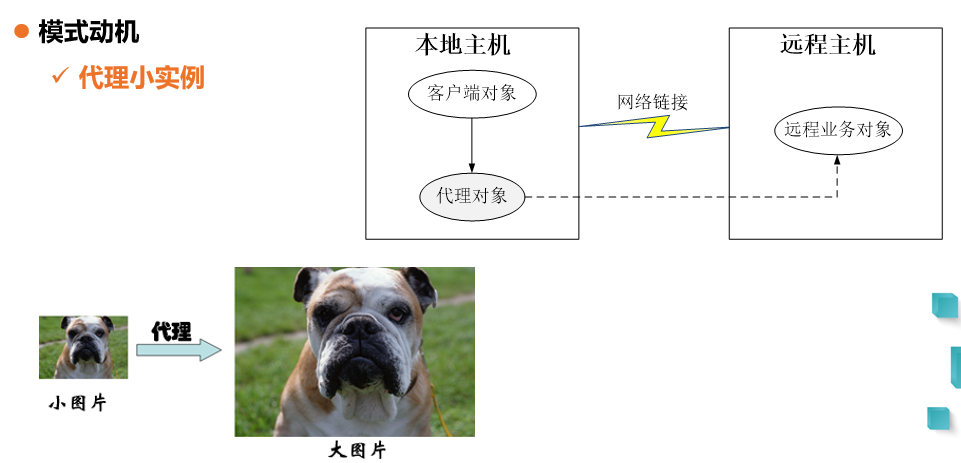
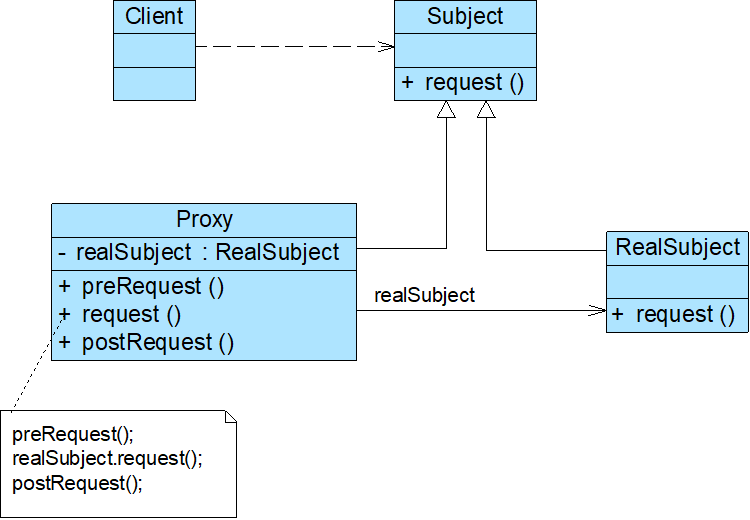
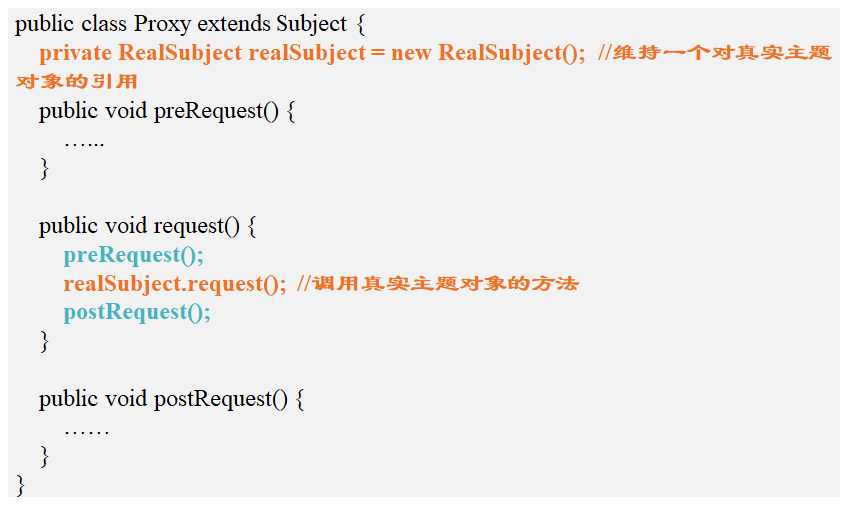

# 代理模式

<!--more-->

## 模式动机

- 通过引入一个新的对象（如小图片和远程代理对象）来实现对真实对象的操作，或者将新的对象作为真实对象的一个替身
- 引入代理对象来间接访问一个对象  **代理模式**

## 模式定义

- 代理模式(Proxy Pattern) ：给某一个对象提供一个代理，并由代理对象控制对原对象的引用
- 对象结构型模式
- 代理对象可以在客户端和目标对象之间起到中介的作用
- 通过代理对象去掉客户不能看到的内容和服务或者添加客户需要的额外的新服务

## 模式结构

代理模式代码实例

## 模式分析

- **远程代理(Remote Proxy)**：为一个位于不同的地址空间的对象提供一个本地的代理对象，这个不同的地址空间可以在同一台主机中，也可以在另一台主机中，远程代理又称为大使(Ambassador)
- **虚拟代理(Virtual Proxy)**：如果需要创建一个资源消耗较大的对象，先创建一个消耗相对较小的对象来表示，真实对象只在需要时才会被真正创建
- **保护代理(Protect Proxy)**：控制对一个对象的访问，可以给不同的用户提供不同级别的使用权限
- **缓冲代理(Cache Proxy)**：为某一个目标操作的结果提供临时的存储空间，以便多个客户端可以共享这些结果
- **智能引用代理(Smart Reference Proxy)**：当一个对象被引用时，提供一些额外的操作，例如将对象被调用的次数记录下来等

## 优点

- 能够协调调用者和被调用者，在一定程度上降低了系统的耦合度
- 客户端可以针对抽象主题角色进行编程，增加和更换代理类无须修改源代码，符合开闭原则，系统具有较好的灵活性和可扩展性
- 远程代理：可以将一些消耗资源较多的对象和操作移至性能更好的计算机上，提高了系统的整体运行效率
- 虚拟代理：通过一个消耗资源较少的对象来代表一个消耗资源较多的对象，可以在一定程度上节省系统的运行开销
- 缓冲代理：为某一个操作的结果提供临时的缓存存储空间，以便在后续使用中能够共享这些结果，优化系统性能，缩短执行时间
- 保护代理：可以控制对一个对象的访问权限，为不同用户提供不同级别的使用权限

## 缺点

- 由于在客户端和真实主题之间增加了代理对象，因此有些类型的代理模式可能会造成请求的处理速度变慢（例如**保护代理**）
- 实现代理模式需要额外的工作，而且有些代理模式的实现过程较为复杂（例如**远程代理**）
