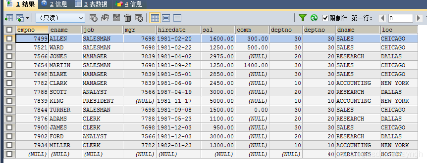

# 全外连接？Oracle!MySQL？

<!--more-->

首先，mysql本身是没有提供全外连接的，

MySql中多表查询只提供了内连接，左外连接与右外连接：
table_reference {[INNER] JOIN | {LEFT|RIGHT} [OUTER] JOIN} table_reference ON conditional_expr

1】INNER JOIN ON内连接（只写join时默认为内连接）
SELECT * FROM emp e JOIN dept d ON e.`deptno`=d.`deptno`;

2】外连接：在左外连接和右外连接时都会以一张表为基表，该表的内容会全部显示，然后加上两张表匹配的内容。如果基表的数据在另一张表没有记录。那么在相关联的结果集行中列显示为空值（NULL）。

2.1、左外连接：显示左表的全部记录
SELECT * FROM emp e LEFT JOIN dept d ON e.`deptno`=d.`deptno`;

2.2、右外连接：显示右表的全部记录
SELECT * FROM emp e RIGHT JOIN dept d ON e.`deptno`=d.`deptno`;

2.3、全外连接：左表和右表都不做限制，所有的记录都显示，两表不足的地方用null 填充；
也就是：
左外连接=左表全部记录+相关联结果
右外连接=右表全部记录+相关联结果
全外连接=左表全部记录+右表全部记录+相关联结果=左外连接+右外连接-相关联结果（即去重复)

那么在MYSQL中谁可以做到呢？
UNION
UNION 操作符用于合并两个或多个 SELECT 语句的结果集。
注释：默认地，UNION 操作符选取不同的值。如果允许重复的值，请使用 UNION ALL。

故实现全外连接可以使用：
SELECT * FROM emp e LEFT JOIN dept d ON e.`deptno`=d.`deptno`
UNION
SELECT * FROM emp e RIGHT JOIN dept d ON e.`deptno`=d.`deptno`;

注释：以上连接全为等值连接；Oracle中全外连接可以使用full join；请不要弄混。

