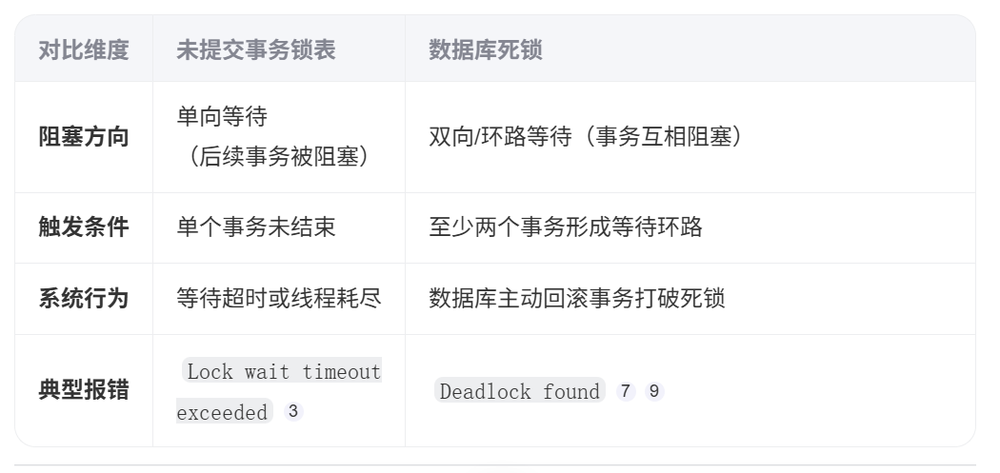
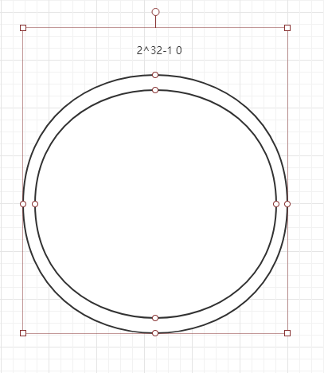
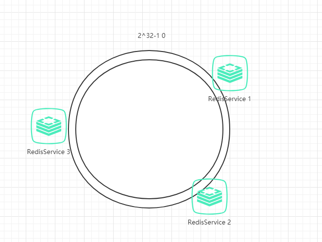
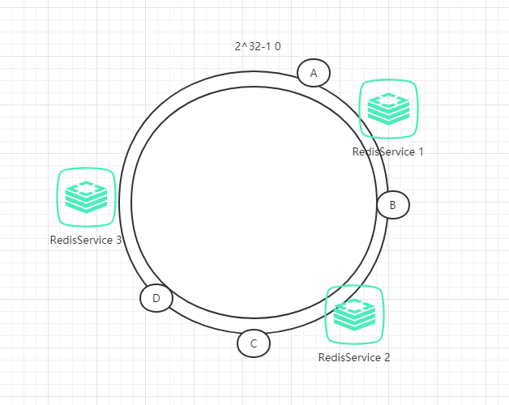
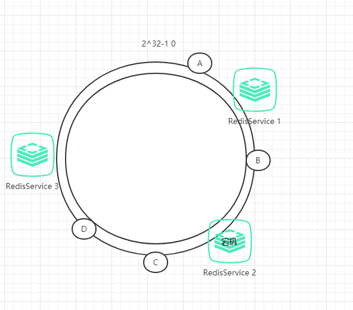
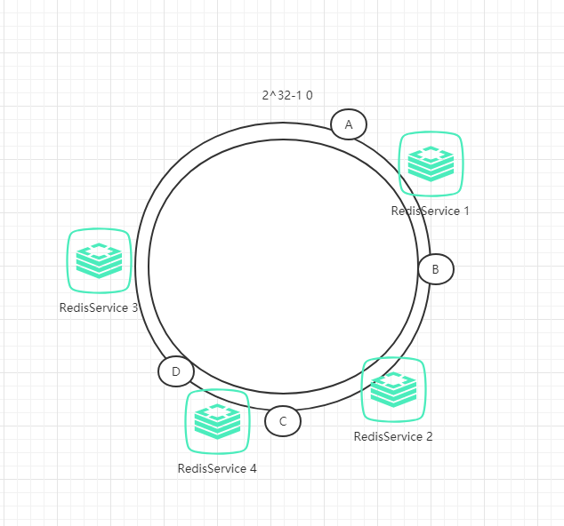
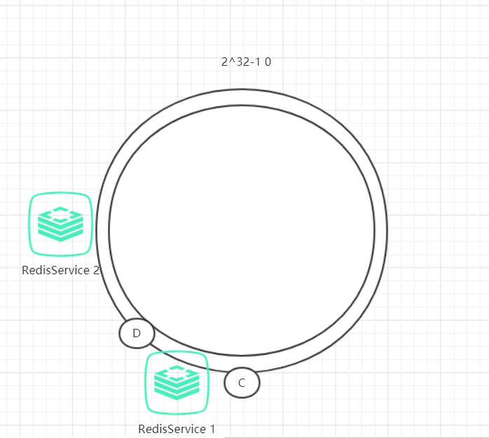
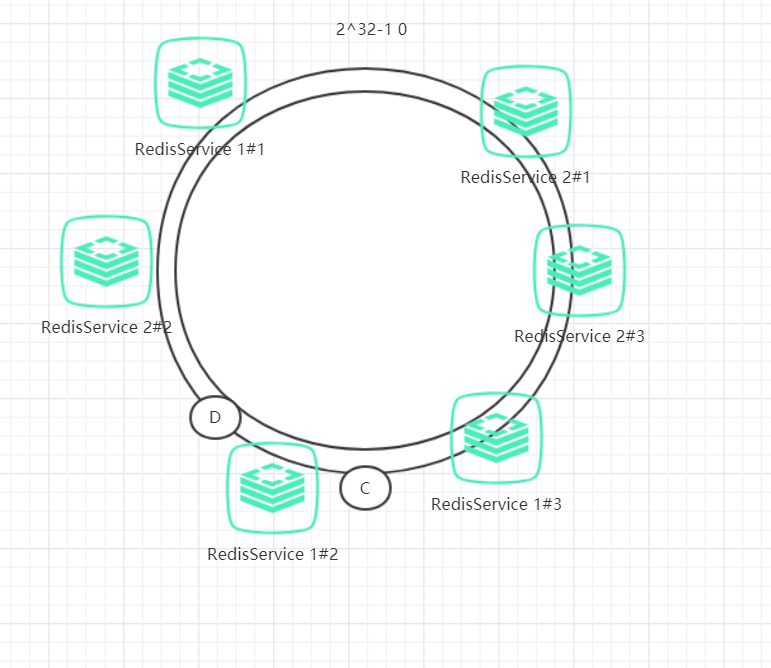

# 刘同学的面经(2025-6)


<!--more-->

## 京东零售-Java

### 具体说说jdk1.7和1.8的hashmap的线程不安全都有什么问题

**JDK 1.7 HashMap的线程不安全问题**
在JDK 1.7中，HashMap的线程不安全问题主要体现在扩容过程中。当HashMap进行扩容时，如果多个线程同时操作同一个HashMap，可能会导致以下问题：

1. 死循环：

当HashMap触发扩容时，如果两个线程A和B同时操作同一个链表，线程A可能在执行扩容函数transfer的过程中被挂起，而线程B则可能在此期间完成数据迁移。
当线程A恢复执行时，由于链表结构已经在线程B的操作下发生改变，线程A可能会按照旧的链表结构进行插入操作，从而导致链表形成环形结构。
这种环形链表结构会导致在后续访问HashMap时出现死循环。

2. 数据丢失：

在扩容过程中，如果链表形成环形结构，可能会导致某些元素在扩容后无法被正确访问，从而造成数据丢失。
此外，由于扩容操作涉及多个步骤和状态变化，如果线程在扩容过程中被中断或挂起，也可能导致数据不一致或丢失。
**JDK 1.8 HashMap的线程不安全问题**
在JDK 1.8中，HashMap对底层数据结构进行了优化，引入了红黑树来优化链表过长的问题。然而，线程不安全问题仍然存在，但表现形式有所不同：

1. 数据覆盖：

当多个线程同时执行put操作时，如果两个线程插入的键值对的哈希值相同（即发生哈希碰撞），则可能会导致数据覆盖。
具体来说，如果一个线程A在判断哈希值位置为null后还未写入数据时被挂起，而另一个线程B在该位置插入了数据并成功完成put操作，那么当线程A恢复执行并尝试写入数据时，就会覆盖线程B已经插入的数据。

2. size字段不一致：

HashMap中的size字段用于记录当前存储的键值对数量。在多线程环境下，多个线程同时操作put方法可能会导致size值不一致。
例如，两个线程同时增加size的值，可能会导致size的值大于实际存储的键值对数量，进而引发数据覆盖或其他不一致问题。
**解决方案**
为了避免HashMap的线程不安全问题，可以采取以下解决方案：

1. 使用Collections.synchronizedMap：

将HashMap包装成线程安全的Map。这通过在HashMap的所有方法上添加synchronized关键字来实现线程同步。

2. 使用ConcurrentHashMap：

ConcurrentHashMap是JDK提供的线程安全的HashMap实现。它采用分段锁或局部锁等机制来降低锁粒度，提高并发性能。

3. 手动加锁：

在使用HashMap的地方手动加锁。这可以通过使用synchronized关键字或其他同步机制来保护共享资源。

​	综上所述，JDK 1.7和JDK 1.8中的HashMap都存在线程不安全问题。在JDK 1.7中，问题主要体现在扩容过程中的死循环和数据丢失；而在JDK 1.8中，问题则主要表现为数据覆盖和size字段不一致。为了避免这些问题，可以使用线程安全的替代方案如ConcurrentHashMap或采取手动加锁等措施。

### hashmap链表转化成红黑树的过程以及红黑树转化成链表的过程

**链表转化成红黑树的过程**

**链表长度阈值**：当单个桶中的链表长度达到8时，该链表会被转换为红黑树。
**最小树化容量**：HashMap的总容量（桶数组大小）必须至少为64。如果容量小于64，即使链表长度达到8，也不会进行树化，而是会选择扩容。

**红黑树转化成链表**

**树形化的红黑树节点数量小于6**：当红黑树节点的数量减少到6或更少时，红黑树会被转换回链表。这是因为在少量节点的情况下，链表的插入和删除操作比红黑树更高效。

**最小树化容量**：这是一个辅助条件，用于确保只有在HashMap的容量（桶数组大小）足够大时，才会执行链表到红黑树的转换和反转换。默认情况下，这个值是64。但是，转回链表的主要依据还是节点数量。

### hashmap扩容机制原理

**扩容原理**

当HashMap中的元素数量超过容量与加载因子的乘积时，HashMap会进行扩容。扩容是通过创建一个新的Node数组，其容量是原数组的两倍，然后将原数组中的所有元素重新散列到新数组中。

在JDK1.7和JDK1.8中，HashMap的扩容机制有所不同。在JDK1.7中，扩容涉及重新计算每个元素的存储位置，并使用头插法将链表中的元素逆序插入到新数组中。这种方法可能会导致链表中的环形结构，在多线程环境下可能会引起死循环。

而在JDK1.8中，扩容过程中使用了尾插法，保持了链表的顺序，减少了环形链表的风险。此外，JDK1.8引入了红黑树，当链表长度超过一定阈值（默认为8）时，链表会转换为红黑树，以提高搜索效率。

**扩容过程**

当HashMap中的元素数量超过容量与加载因子的乘积时，HashMap会进行扩容。扩容是通过创建一个新的Node数组，其容量是原数组的两倍，然后将原数组中的所有元素重新散列到新数组中。

在JDK1.7和JDK1.8中，HashMap的扩容机制有所不同。在JDK1.7中，扩容涉及重新计算每个元素的存储位置，并使用头插法将链表中的元素逆序插入到新数组中。这种方法可能会导致链表中的环形结构，在多线程环境下可能会引起死循环。

而在JDK1.8中，扩容过程中使用了尾插法，保持了链表的顺序，减少了环形链表的风险。此外，JDK1.8引入了红黑树，当链表长度超过一定阈值（默认为8）时，链表会转换为红黑树，以提高搜索效率。

### 线程创建和cpu交互过程，线程的状态

线程的创建和CPU交互过程主要包括以下几个步骤：

1. ‌**创建线程对象**‌：可以通过继承`Thread`类或实现`Runnable`接口来创建线程对象。继承`Thread`类时，需要重写`run()`方法；实现`Runnable`接口时，需要实现`run()`方法，并通过`Thread`类的构造方法创建线程对象‌12。
2. ‌**调用`start()`方法**‌：通过调用线程对象的`start()`方法，线程进入就绪状态，等待CPU调度。`start()`方法会启动新线程，并调用`run()`方法‌12。
3. ‌**CPU调度**‌：当线程获得CPU时间片时，线程进入运行状态，开始执行其任务。如果线程执行完毕或时间片用完，线程会回到就绪状态，等待下一次调度‌34。
4. ‌**状态转换**‌：线程的状态包括新建、就绪、运行、阻塞和终止。状态之间的转换如下：
   - ‌**新建**‌：线程被创建但未启动。
   - ‌**就绪**‌：已启动，等待CPU调度。
   - ‌**运行**‌：正在CPU执行。
   - ‌**阻塞**‌：等待I/O完成、锁释放或其他条件满足。
   - ‌**终止**‌：执行完毕或异常退出‌34。

‌**线程的状态及其定义**‌：

- ‌**新建(New)**‌：线程被创建但未启动。
- ‌**就绪(Runnable)**‌：已启动，等待CPU调度。
- ‌**运行(Running)**‌：正在CPU执行。
- ‌**阻塞(Blocked/Waiting)**‌：等待I/O完成、锁释放或其他条件满足。
- ‌**终止(Terminated)**‌：执行完毕或异常退出‌34。

通过这些步骤和状态转换，线程与CPU进行有效的交互，完成任务的执行。

### 线程池参数怎么设置的，为什么

1. ‌**核心线程数（corePoolSize）**‌：核心线程数是指线程池中常驻的线程数量。对于CPU密集型任务，核心线程数通常设置为CPU核心数+1，因为计算过程中CPU一直处于高负载状态，过多的线程会导致线程上下文切换，降低性能。对于IO密集型任务，核心线程数可以设置为CPU核心数的2倍或更多，因为线程在I/O操作期间会被阻塞，需要更多的线程来提高CPU利用率‌12。
2. ‌**最大线程数（maximumPoolSize）**‌：最大线程数是线程池允许创建的最大线程数量。当任务队列已满且核心线程数已达到最大值时，线程池会创建新的线程直到达到最大线程数。最大线程数的设置需要根据业务需求和服务器资源来综合考虑‌13。
3. ‌**任务队列（workQueue）**‌：任务队列用于存放待执行的任务。对于需要快速响应的应用，可以使用无界队列（如LinkedBlockingQueue）来避免任务积压导致的延迟；对于需要控制并发数的应用，可以使用有界队列（如ArrayBlockingQueue）来限制队列长度，避免内存溢出‌23。
4. ‌**线程空闲存活时间（keepAliveTime）**‌：当线程池中的线程数量超过核心线程数时，多余的空闲线程在等待新任务到来之前会保持存活一段时间。这段时间过后，线程会被终止。设置合理的空闲存活时间可以减少资源浪费‌3。
5. ‌**拒绝策略（RejectedExecutionHandler）**‌：当线程池已满且任务队列也已满时，新任务会被拒绝。常见的拒绝策略包括：
   - ‌**AbortPolicy**‌：直接抛出异常，终止任务。
   - ‌**CallerRunsPolicy**‌：在新任务所在的线程中直接执行任务。
   - ‌**DiscardPolicy**‌：默默丢弃任务，不作处理。
   - ‌**DiscardOldestPolicy**‌：丢弃队列中最老的未处理任务，然后提交当前任务‌3。

‌**设置这些参数的原因**‌是为了优化系统性能和资源利用：

- ‌**核心线程数和最大线程数的合理设置**‌可以避免过多的线程创建和销毁，减少系统开销，提高系统稳定性。
- ‌**任务队列的选择**‌可以根据业务需求控制任务的积压情况，避免因任务积压导致的系统延迟。
- ‌**拒绝策略的选择**‌可以在系统过载时提供合理的错误处理机制，避免系统崩溃。

### mysql insert语句执行过程中 索引的变化

在MySQL数据库中，插入（INSERT）数据时，索引的变化主要体现在两个方面：一是插入操作的效率，二是索引对查询性能的影响。理解这些变化有助于优化数据库性能和查询效率。

**1. 插入操作对索引的影响**

当你在MySQL中插入数据时，如果表中存在索引（尤其是主键或唯一索引），MySQL需要确保新插入的数据不会违反索引的唯一性约束。这通常涉及以下几个步骤：

- **查找位置**：对于有索引的列，MySQL会先查找该列的索引来确定插入点的位置。
- **维护索引**：在找到插入位置后，MySQL需要更新索引以反映新的数据位置。对于非聚集索引（secondary indexes），这意味着更新索引页中的指针或值。
- **写入数据**：数据被写入数据页，然后是更新索引页。

**2. 性能影响**

- **插入速度**：对于聚集索引（通常是主键），插入操作相对较快，因为数据和索引是物理上连续存储的。但对于非聚集索引，每次插入都需要更新索引页，这可能会稍微减慢插入速度。
- **空间使用**：频繁的插入操作可能会导致索引页分裂，特别是在使用B-Tree索引时。这会增加磁盘I/O操作，因为需要读取、修改和写入多个页。
- **碎片化**：随着数据的不断插入和删除，索引可能会变得碎片化，这会影响查询性能。定期的优化操作（如`OPTIMIZE TABLE`）可以帮助减少碎片化。

**3. 优化策略**

- **批量插入**：尽可能使用批量插入（例如`INSERT INTO table_name VALUES (...), (...), ...;`）来减少磁盘I/O操作和提高效率。
- **选择合适的索引**：只在确实需要提高查询性能的列上创建索引。避免在经常更新的列上创建过多的索引，因为这会增加写操作的开销。
- **定期维护**：定期使用`OPTIMIZE TABLE`来减少碎片化，特别是在高更新频率的表上。
- **考虑分区**：对于非常大的表，考虑使用分区来管理数据，这可以帮助提高查询和维护操作的效率。

### 两个时间段，通过排序剪枝判断是否有重叠的部分

首先，将所有时间段按照开始时间从小到大进行排序。然后，遍历排序后的时间段列表，对于当前时间段，检查其结束时间是否大于前一个时间段的开始时间。如果存在这样的情况，说明当前时间段与前一个时间段有重叠。具体步骤如下：

1. ‌**排序**‌：将所有时间段按照开始时间从小到大进行排序。
2. ‌**遍历**‌：从第一个时间段开始，逐个检查后续时间段。
3. ‌**剪枝**‌：如果当前时间段的开始时间小于等于前一个时间段的结束时间，说明有重叠，返回重叠状态。
4. ‌**无重叠**‌：如果遍历完所有时间段都没有发现重叠，则说明没有重叠。

这种方法利用了排序后的时间段列表中，相邻时间段可能重叠的特性，通过剪枝（即提前终止检查）来优化性能。

## 字节番茄小说-Java

### 数据库底层死锁的原因

数据库底层死锁的主要原因‌包括以下四个必要条件：

- 互斥条件‌：资源必须以独占模式被访问，即一次只能被一个进程或线程占用‌
- ‌持有并等待条件‌：一个进程持有至少一个资源的同时，等待获取其他资源，而不释放已持有的资源‌
- 不可剥夺条件‌：已分配给进程的资源不能被强制回收，只能由持有资源的进程主动释放‌
- 循环等待条件‌：存在一个进程资源的申请序列，使得每个进程都在等待下一个进程所持有的资源，形成循环等待的环路‌

死锁的检测和解决策略
数据库管理系统提供了多种策略来检测和解决死锁：

- 自动检测并回滚事务‌：当检测到死锁时，系统会自动选择一个事务进行回滚，以解除死锁状态‌
- 预防策略‌：通过设定事务的锁顺序、避免长时间的事务、限制事务的并发数量等，以减少死锁发生的可能性‌
- ‌检测和解决策略‌：一旦系统检测到死锁发生，会立即采取措施，如中断一个或多个事务的执行，释放其锁定的资源，从而打破死锁状态‌



### redis限流为什么使用lua？ 为什么不用指令？

- 性能和原子性： Lua脚本可以在Redis服务器端原子性地执行多个命令，避免了多次网络通信的开销，提高了性能和原子性。相比之下，用Java或Python实现的限流算法需要多次与Redis进行通信，性能相对较低。

- 便捷性： Lua脚本可以直接在Redis服务器端执行，无需额外部署其他语言的运行环境，更加灵活和便捷。

- Redis支持： Redis天然支持Lua脚本，可以直接执行，不需要额外的配置和插件。而如果使用Java或Python，需要额外的库或框架来与Redis进行交互。

```lua
local key = KEYS[1] -- 获取传入lua脚本的第一个keys参数，用作存储令牌数目的键名
local limit = tonumber(ARGV[1]) -- 将传入lua脚本的第一个ARGV参数转换为整数，表示桶的容量
local current = tonumber(redis.call('get', key) or "0")
-- 通过Redis的GET命令获取当前令牌桶中的令牌数量，如果没有获取到则默认为0，并将其转换为整数。

if current + 1 > limit then -- 判断当前令牌桶中的令牌数量加1后是否超过阈值
    return 0 -- 超过表示请求被限流，返回0
else
    redis.call('INCR', key) -- 通过Redis的INCR命令将令牌桶中的数量加1，表示通过了一个请求
    redis.call('EXPIRE', key, ARGV[2]) -- 设置令牌桶的过期时间为ARGV 参数中指定的时间
 
    return 1  -- 返回1，表示通过限流检查
end
```


### redis 是计算密集还是cpu密集，为什么？

**Redis 主要是 CPU密集型 ，而不是 IO密集型** ‌。Redis的操作本质上是CPU密集型，而不是IO密集型。这是因为Redis在网络IO上使用 epoll 实现了一个IO多路复用的 reactor模型 ，epoll是非阻塞IO，避免了CPU阻塞在IO上，因此Redis的瓶颈不在于等待IO导致CPU利用率不高，不需要多个线程来屏蔽等待IO执行完成的时间‌。

**Redis的架构特点**

1. ‌**单线程架构**‌：Redis采用单线程架构，避免了线程切换带来的开销。单线程处理减少了线程争用带来的缓存失效问题，避免了频繁的缓存刷新，从而提升了性能‌。
2. ‌**IO多路复用**‌：Redis使用epoll等机制实现非阻塞IO，使得单线程在面对多个客户端连接时仍能保持高效处理‌。
3. ‌**数据结构和操作**‌：Redis支持丰富的数据结构，如string、list、hash、set、zset等。这些数据结构的时间复杂度较高时，可能会导致CPU占用大量时间进行运算，从而表现出CPU密集型的特性‌

### redis多路复用原理和多线程的区别

Redis的多路复用（I/O Multiplexing）和多线程（Multi-threading）是两种不同的并发处理机制，它们在Redis中扮演着互补但独立的角色，主要区别如下：

**🔄 一、多路复用原理（I/O Multiplexing）**

1. ‌**核心目标**‌
   解决单线程下‌**高并发连接**‌的问题，用单个线程同时监听并处理多个客户端请求36。
2. ‌**工作原理**‌
   - 通过系统调用（如`epoll`、`select`）监控多个网络连接的读写事件（如`READ`/`WRITE`事件）36。
   - 当某个连接有数据可读/写时，操作系统通知Redis主线程处理对应事件（如读取请求、发送响应），避免线程阻塞等待I/O910。
   - ‌**所有命令执行**‌仍由单线程顺序处理，保证原子性15。
3. ‌**优势**‌
   - 减少线程切换开销，避免多线程锁竞争511。
   - 高效管理数万并发连接（如`epoll`时间复杂度O(1)）69。

------

**⚙️ 二、多线程机制（Redis 6.0+）**

1. ‌**引入目的**‌
   解决‌**网络I/O吞吐瓶颈**‌（尤其是大流量场景），将耗时的网络读写任务并行化24。
2. ‌**分工设计**‌
   - ‌**主线程**‌：单线程执行命令逻辑（保证原子性）并分配I/O任务411。
   - ‌**I/O线程组**‌：负责`socket`读写（数据从内核态→用户态拷贝）、请求解析与响应发送12。
   - ‌**后台线程**‌：处理异步任务（如持久化、大Key删除）47。
3. ‌**工作流程**‌
   客户端请求 → 主线程通过多路复用接收 → 解析后的请求分发给I/O线程并行读写 → 主线程执行命令 → I/O线程发送响应412。

------

**🔍 三、核心区别总结**

| ‌**特性**‌       | ‌**多路复用**‌               | ‌**多线程**‌                             |
| -------------- | -------------------------- | -------------------------------------- |
| ‌**作用层面**‌   | 网络连接管理（事件驱动）36 | 网络I/O任务并行化24                    |
| ‌**线程模型**‌   | 单线程监听事件             | 主线程 + I/O工作线程组                 |
| ‌**关键目标**‌   | 高并发连接处理             | 提升网络吞吐量                         |
| ‌**数据安全性**‌ | 命令执行天然原子性512      | 命令仍由主线程串行执行，保持原子性1112 |
| ‌**版本依赖**‌   | 所有版本核心机制           | Redis 6.0+ 引入411                     |

------

💎 **四、协同关系**

- ‌**多路复用是基础**‌：主线程通过多路复用监听连接事件，再决定是否启用I/O线程处理网络数据112。
- ‌**多线程是优化**‌：针对网络I/O的瓶颈（如大流量下的数据拷贝耗时），通过多线程加速，但‌**不改变命令执行的单线程本质**‌411。

### 实现concurhashmap 自己写乐观锁和悲观锁怎么实现 cas是怎么实现的

### hashMap扩容的过程

### hashmap 扩容为什么是两倍

HashMap 扩容时容量加倍（如 16 → 32）的设计核心在于 ‌**利用位运算优化性能、保证哈希分布均匀及提升扩容效率**‌，具体原因如下：

------

**🔍 一、核心原因：优化索引计算与性能**

1. ‌**位运算取代取模，提升计算效率**‌

   - HashMap 通过 `(n-1) & hash` 计算索引（`n` 为数组长度），而非传统的 `hash % n`。
   - ‌**当 `n` 是 2 的幂次方时（如 16=10000），`n-1` 的二进制为全 1（如 15=1111）**‌。
     此时 `(n-1) & hash` 等价于 `hash % n`，但位运算（`&`）比取模（`%`）快 10 倍以上。
   - ‌**扩容为 2 倍能保证新容量仍是 2 的幂次方**‌，延续位运算优势。

   ‌**示例**‌：

   ```
   textCopy Code原容量 n=16 (二进制 10000), n-1=15 (1111)  
   hash=27 (二进制 11011) → 27 & 15 = 1011 (即索引 11)  
   扩容后 n=32 (100000), n-1=31 (11111) → 27 & 31 = 11011 (仍为 27，但实际索引需根据高位判断)
   ```

------

**⚙️ 二、减少哈希冲突，均匀分布元素**

1. ‌哈希分布更均匀
   - 当 `n` 为 2 的幂次方时，`n-1` 的二进制全 1 特性使得哈希值的低位能均匀映射到数组各位置。
   - 若容量非 2 的幂次方（如 15=1110），部分索引永远无法被映射（如末位为 1 的位置），导致哈希冲突概率增加。

------

**🚀 三、优化扩容时元素迁移效率（JDK 1.8+）**

1. ‌**元素新位置只需一次位判断**‌
   - 扩容后（newCap = oldCap << 1），元素的新位置仅有两种可能：
     - ‌**原位不变**‌（如原索引 13 → 新索引 13）
     - ‌**原位 + 原容量**‌（如原索引 13 → 新索引 13+16=29）。
   - ‌判断逻辑：检查哈希值新增的高位是 0 还是 1（即hash & oldCap）：
     - `=0` → 索引不变
     - `=1` → 索引 = 原索引 + `oldCap`。
2. ‌**优势**‌
   - ‌**无需重新计算哈希值**‌，迁移时间复杂度从 O(n) 降至 O(1)。
   - 只需遍历旧数组，按高位判断即可将元素拆分到新数组的两个位置。

------

**💎 四、为何不采用 1.5 倍或 2.5 倍？**

1. ‌失去位运算优化基础
   - 若扩容 1.5 倍（如 16→24），新容量不再是 2 的幂次方，无法用 `(n-1) & hash` 替代取模，性能下降。
2. ‌元素迁移效率降低
   - 非 2 倍扩容时，元素需重新计算哈希值并分配位置，迁移成本显著增加。

------

**📊 关键优势总结**

| ‌**特性**‌         | ‌**扩容 2 倍的优势**‌                 | ‌**非 2 倍扩容的问题**‌            |
| ---------------- | ----------------------------------- | -------------------------------- |
| ‌**索引计算**‌     | 位运算 `&` 替代取模 `%`，效率更高   | 依赖低速取模运算                 |
| ‌**哈希分布**‌     | `n-1` 全 1 保障均匀映射             | 部分索引空缺，冲突概率增加       |
| ‌**扩容迁移效率**‌ | 高位判断即可确定新位置，O(1) 复杂度 | 需重算哈希值，O(n) 复杂度        |
| ‌**容量对齐**‌     | 始终维持 2 的幂次方特性             | 破坏幂次方特性，后续操作效率降低 |

> 💡 ‌**结论**‌：HashMap 扩容 2 倍是性能（位运算）、空间（均匀分布）、迁移效率（高位判断）三重优化的工程权衡结果。

### java nio 原理 - （Java NIO 原理：非阻塞 I/O 的高性能架构）


Java NIO（New I/O）采用‌**事件驱动模型**‌解决传统阻塞 I/O 的并发瓶颈，核心是通过 ‌**Channel（通道）**‌、‌**Buffer（缓冲区）**‌ 和 ‌**Selector（选择器）**‌ 实现高效数据传输。其工作原理如下：

------

**🔄 一、核心组件协同流程**


graph LR;
A[客户端请求] --> B(Channel<br>双向数据通道)
B --> C{Selector<br>多路复用器}
C -->|监听事件| D[Buffer<br>数据缓冲区]
D --> E[业务线程<br>非阻塞处理]


1. ‌**Channel（通道）**‌

   - 替代传统 `InputStream`/`OutputStream`，支持‌**双向读写**‌（读/写可同时进行）。
   - 类型：`SocketChannel`（TCP）、`DatagramChannel`（UDP）、`FileChannel`（文件）。
   - ‌**非阻塞模式**‌：调用 `configureBlocking(false)` 后，读写操作无数据时立即返回，避免线程阻塞。

2. ‌**Buffer（缓冲区）**‌

   - 本质是‌**内存块数组**‌（如 `ByteBuffer`, `IntBuffer`），作为数据中转站。

   - ‌工作流程：

     ```
     javaCopy Codebuffer.flip();     // 切换读模式（写→读）
     buffer.get();      // 读取数据
     buffer.clear();    // 清空复用（读→写）
     ```

3. ‌**Selector（选择器）**‌

   - ‌**单线程管理多通道**‌：通过系统调用（`epoll`/`kqueue`）监听所有注册的 Channel 事件。
   - 事件类型：
     - `OP_READ`（数据可读）
     - `OP_WRITE`（通道可写）
     - `OP_CONNECT`（连接就绪）

------

**⚙ 二、事件驱动工作流程**

```
javaCopy Code// 伪代码示例
Selector selector = Selector.open();
SocketChannel channel = SocketChannel.open();
channel.configureBlocking(false);
channel.register(selector, SelectionKey.OP_READ); // 注册读事件

while (true) {
    int readyChannels = selector.select();     // 阻塞直到事件就绪
    Set<SelectionKey> keys = selector.selectedKeys();
    for (SelectionKey key : keys) {
        if (key.isReadable()) {
            SocketChannel ch = (SocketChannel) key.channel();
            ByteBuffer buffer = ByteBuffer.allocate(1024);
            ch.read(buffer);  // 非阻塞读取
            buffer.flip();
            // 处理数据...
        }
        keys.remove(key);
    }
}
```

1. ‌**事件注册**‌
   - Channel 向 Selector 注册关注的事件（如 `OP_READ`）。
2. ‌**事件监听**‌
   - `selector.select()` 调用底层 `epoll`，由操作系统通知就绪事件。
3. ‌**事件处理**‌
   - 遍历 `selectedKeys()` 处理就绪 Channel，单线程可处理数千连接。

------

**⚡️ 三、性能飞跃的关键设计**

| ‌**特性**‌     | ‌**传统阻塞 I/O**‌                  | ‌**Java NIO**‌                                   |
| ------------ | --------------------------------- | ---------------------------------------------- |
| ‌**线程模型**‌ | 1 连接 = 1 线程（线程切换开销大） | 单线程处理多连接（Selector 管理）              |
| ‌**I/O 行为**‌ | 读写阻塞线程直至完成              | 无数据时立即返回（`configureBlocking(false)`） |
| ‌**数据操作**‌ | 流式传输（单向）                  | 缓冲区批量读写（双向）                         |
| ‌**并发能力**‌ | 数百连接（线程数限制）            | 数万连接（C10K 问题解决方案）                  |

------

**💡 四、底层机制：多路复用（以 Linux 为例）**

1. ‌**`epoll` 核心优势**‌
   - ‌**事件通知机制**‌：仅返回就绪的 Channel 集合，无需遍历所有连接（时间复杂度 O(1)）。
   - ‌**零拷贝支持**‌：通过 `FileChannel.transferTo()` 实现内核态直接传输，避免用户态拷贝。
2. ‌**与 Redis 多路复用对比**‌
   - ‌**相似点**‌：均使用 `epoll` 实现单线程高并发。
   - ‌**差异点**‌：Redis 主线程处理所有逻辑，Java NIO 可将业务逻辑分发给工作线程池。

------

**🚀 五、适用场景**

- ‌**高并发服务器**‌：Web 服务器（Netty）、消息中间件（RocketMQ）。
- ‌**大文件传输**‌：零拷贝技术提升吞吐量。
- ‌**实时通信**‌：WebSocket、游戏服务器。

> 💡 ‌**注意事项**‌：
>
> - NIO 编程复杂度高（需处理拆包/粘包、异常恢复）。
> - 推荐使用 ‌**Netty**‌ 等框架简化开发，其基于 NIO 封装了稳定高性能的 API。

通过 ‌**Channel-Buffer-Selector 三角协作**‌，Java NIO 在同等资源下实现 10 倍于传统 I/O 的并发能力，成为高性能网络应用的基石。

## 百度-Java

### 百度一面

#### redis：一致性hash算法

一致哈希 是一种特殊的哈希算法。在使用一致哈希算法后，哈希表槽位数（大小）的改变平均只需要对 K/n 个关键字重新映射，其中K是关键字的数量， n是槽位数量。然而在传统的哈希表中，添加或删除一个槽位的几乎需要对所有关键字进行重新映射。

简单的说，一致性哈希是将整个哈希值空间组织成一个虚拟的圆环，如假设哈希函数H的值空间为0-2^32-1（哈希值是32位无符号整形），整个哈希空间环如下：



整个空间按顺时针方向组织，0和2^32-1在零点中方向重合。

接下来，把服务器按照IP或主机名作为关键字进行哈希，这样就能确定其在哈希环的位置。



然后，我们就可以使用哈希函数H计算值为key的数据在哈希环的具体位置h，根据h确定在环中的具体位置，从此位置沿顺时针滚动，遇到的第一台服务器就是其应该定位到的服务器。

例如我们有A、B、C、D四个数据对象，经过哈希计算后，在环空间上的位置如下：



根据一致性哈希算法，数据A会被定为到Server 1上，数据B被定为到Server 2上，而C、D被定为到Server 3上。

##### 容错性

假如RedisService2宕机了，那么会怎样呢？



那么，数据B对应的节点保存到RedisService3中。因此，其中一台宕机后，干扰的只有前面的数据（原数据被保存到顺时针的下一个服务器），而不会干扰到其他的数据。

##### 扩展性

下面考虑另一种情况，假如增加一台服务器Redis4，具体位置如下图所示：



原本数据C是保存到Redis3中，但由于增加了Redis4，数据C被保存到Redis4中。干扰的也只有Redis3而已，其他数据不会受到影响。

因此，一致性哈希算法对于节点的增减都只需重定位换空间的一小部分即可，具有较好的容错性和可扩展性

##### 虚拟节点

前面部分都是讲述到Redis节点较多和节点分布较为均衡的情况，如果节点较少就会出现节点分布不均衡造成数据倾斜问题。

例如，我们的的系统有两台Redis，分布的环位置如下图所示：



这会产生一种情况，Redis2的hash范围比Redis1的hash范围大，导致数据大部分都存储在Redis2中，数据存储不平衡。

为了解决这种数据存储不平衡的问题，一致性哈希算法引入了**虚拟节点机制**，即对每个节点计算多个哈希值，每个计算结果位置都放置在对应节点中，这些节点**称为虚拟节点**。

具体做法可以在服务器IP或主机名的后面增加编号来实现，例如上面的情况，可以为每个服务节点增加三个虚拟节点，于是可以分为 RedisService1#1、 RedisService1#2、 RedisService1#3、 RedisService2#1、 RedisService2#2、 RedisService2#3，具体位置如下图所示：



对于数据定位的hash算法仍然不变，只是增加了虚拟节点到实际节点的映射。例如，数据C保存到虚拟节点Redis1#2，实际上数据保存到Redis1中。这样，就能解决服务节点少时数据不平均的问题。在实际应用中，通常将虚拟节点数设置为**32甚至更大**，因此即使**很少的服务节点**也能做到相对**均匀的数据分布**。


#### redis lua脚本 如何避免限流失败，过期时间，自动续期

在 Redis 中使用 Lua 脚本实现限流时，为避免限流失败（例如并发问题、原子性破坏），需确保脚本的原子性和正确性。以下是具体实现方法和示例：


##### 1. 基于令牌桶算法的限流脚本

令牌桶算法允许突发流量，适合大多数场景。以下是一个原子性的 Lua 脚本实现：

```lua
-- KEYS[1]: 限流标识（如用户ID、IP）
-- ARGV[1]: 令牌桶容量（burst）
-- ARGV[2]: 令牌生成速率（replenish rate/秒）
-- ARGV[3]: 当前时间戳（毫秒）
-- ARGV[4]: 请求需要的令牌数（默认1）

local tokens_key = KEYS[1] .. ":tokens"
local timestamp_key = KEYS[1] .. ":timestamp"

-- 获取当前令牌数和最后更新时间
local tokens = tonumber(redis.call('get', tokens_key) or ARGV[1])
local last_tokens = tokens
local last_refreshed = tonumber(redis.call('get', timestamp_key) or 0)
local now = tonumber(ARGV[3])
local requested = tonumber(ARGV[4] or 1)
local rate = tonumber(ARGV[2])
local capacity = tonumber(ARGV[1])

-- 计算从上次更新到现在应生成的令牌数
local delta = math.max(0, (now - last_refreshed) / 1000)
local filled_tokens = math.min(capacity, tokens + (delta * rate))
local allowed = filled_tokens >= requested
local new_tokens = filled_tokens

-- 仅在允许请求或令牌数有变化时更新
if allowed then
  new_tokens = filled_tokens - requested
end

-- 原子性更新令牌数和时间戳
if last_tokens ~= new_tokens or (allowed and last_tokens == new_tokens) then
  redis.call('set', tokens_key, new_tokens)
  redis.call('set', timestamp_key, now)
  redis.call('pexpire', tokens_key, math.ceil((capacity / rate) * 1000))
  redis.call('pexpire', timestamp_key, math.ceil((capacity / rate) * 1000))
end

-- 返回结果：是否允许访问，剩余令牌数
return { allowed and 1 or 0, new_tokens }
```

##### 2. 基于固定窗口计数器的简化实现

适合严格限制请求频率的场景：

```lua
-- KEYS[1]: 限流标识
-- ARGV[1]: 时间窗口（秒）
-- ARGV[2]: 最大请求次数
-- ARGV[3]: 当前时间戳（秒）

local key = KEYS[1]
local window = tonumber(ARGV[1])
local max_requests = tonumber(ARGV[2])
local current_time = tonumber(ARGV[3])

-- 计算窗口开始时间
local start_time = current_time - window

-- 移除窗口外的请求记录
redis.call('zremrangebyscore', key, 0, start_time)

-- 获取当前窗口内的请求数
local count = redis.call('zcard', key)

-- 判断是否超出限制
local allowed = count < max_requests

-- 如果允许，则添加当前请求时间到有序集合
if allowed then
  redis.call('zadd', key, current_time, current_time)
  -- 设置过期时间，避免内存泄漏
  redis.call('expire', key, window)
end

-- 返回结果：是否允许访问，剩余次数
return { allowed and 1 or 0, max_requests - count }
```

##### 3. 关键注意事项

###### 3.1 原子性保障

- **单脚本执行**：Redis 保证 Lua 脚本执行的原子性，无需担心并发问题。
- **避免外部依赖**：脚本内不要调用可能阻塞的 Redis 命令（如 `KEYS`）。


###### 3.2 时间同步

- **使用 Redis 时间**：避免客户端时间与 Redis 服务器时间不一致，可改用 `redis.call('time')` 获取服务器时间：

  ```lua
  local current_time = redis.call('time')[1]  -- 获取秒级时间
  ```

###### 3.3 性能优化

- **批量处理**：对于需要频繁调用的限流场景，可将多个操作合并到一个脚本中。
- **缓存预热**：对热点 key 提前初始化，避免首次调用时的额外开销。


###### 3.4 错误处理

- **返回明确状态**：脚本返回 `{允许访问标志, 剩余令牌/次数}`，便于客户端处理。
- **异常处理**：在客户端代码中增加重试逻辑（如网络波动导致的执行失败）。


总结：

1. **限流机制**：
   - 使用令牌桶算法，支持突发流量和稳定速率控制
   - 通过 Lua 脚本保证令牌计算和状态更新的原子性
2. **过期时间管理**：
   - 初始过期时间防止冷数据占用内存
   - 动态续期延长热点数据生命周期
   - 最大过期时间避免无限期占用资源
3. **自动续期策略**：
   - 基于令牌使用率触发续期，避免频繁续期
   - 使用客户端 ID 实现续期权竞争，防止多个客户端同时续期
   - 后台线程定期检查并执行续期操作
4. **可靠性保障**：
   - 守护线程确保续期逻辑不影响主业务流程
   - Redis 过期机制确保异常情况下资源自动释放
   - 分布式环境下的续期权竞争通过 Lua 脚本原子性解决


#### 分布式锁 zk redis

##### **基于 Redis 的分布式锁**

**实现原理**

利用 Redis 的原子命令（如 `SET key value NX PX`）实现锁的抢占，通过过期时间避免死锁，使用 Lua 脚本保证释放锁的原子性。

**核心逻辑**：

- 加锁：通过 `NX`（仅当 key 不存在时设置）保证只有一个客户端能成功设置 key，`PX` 为锁设置过期时间（防止客户端崩溃后锁无法释放）。
- 解锁：通过 Lua 脚本先校验锁的持有者（避免误释放他人的锁），再删除 key，确保操作原子性。

 **优缺点**

- 优点：
  - 性能极高（Redis 单节点 QPS 可达 10W+），适合高并发场景；
  - 实现简单，依赖少，部署成本低。
- 缺点：
  - 一致性较弱：主从架构下，主节点宕机可能导致 “锁丢失”（从节点未同步锁信息）；
  - 过期时间难设置：若业务执行时间超过过期时间，可能导致锁提前释放。
- **适用场景**：高并发、短事务（如秒杀、接口限流），可容忍极少量锁失效的场景。

##### 基于 ZooKeeper 的分布式锁

**实现原理**

利用 ZooKeeper 的**临时顺序节点**和**Watcher 机制**实现公平锁：

**核心逻辑**：

- 加锁：客户端在指定路径下创建临时顺序节点（节点名含递增序号），序号最小的节点持有者获得锁；其他节点监听前一个节点的删除事件（等待锁释放）。
- 解锁：客户端删除自己的节点，触发下一个节点的 Watcher 事件，唤醒后续等待者。
- 自动释放：若客户端崩溃，临时节点会因会话超时自动删除，避免死锁。

**优缺点**

- 优点：
  - 强一致性：基于 ZooKeeper 的 ZAB 协议，锁的创建和释放具有强一致性，无锁丢失风险；
  - 公平性：通过顺序节点保证 “先来先服务”，避免饥饿问题；
  - 可靠性：临时节点自动释放，无需手动设置过期时间。
- 缺点：
  - 性能较低：依赖 ZooKeeper 集群的磁盘写入和网络通信，QPS 通常在 1000 左右；
  - 实现复杂：需处理 Watcher 事件和会话管理（通常依赖 Curator 框架简化）。
- **适用场景**：长事务、强一致性要求（如分布式事务、数据同步），或需要公平锁的场景。

##### 两种方式对比与总结

| 维度       | Redis 锁                 | ZooKeeper 锁             |
| ---------- | ------------------------ | ------------------------ |
| 一致性     | 最终一致性（可能丢失锁） | 强一致性（ZAB 协议保证） |
| 性能       | 高（适合高并发）         | 中（适合低并发长事务）   |
| 公平性     | 不保证（需额外设计）     | 保证（顺序节点天然公平） |
| 实现复杂度 | 简单（依赖原子命令）     | 复杂（依赖框架简化）     |
| 典型场景   | 秒杀、限流、高频短操作   | 分布式事务、数据同步     |

**总结**：分布式锁的核心是解决 “跨进程、跨机器的资源互斥”，Redis 锁侧重性能，ZooKeeper 锁侧重一致性，需根据业务的并发量、一致性要求和事务时长选择。


#### 网关 geteway、zuul分布式提高高可用，nginx

##### 一、核心组件的角色定位

- **Nginx**：高性能反向代理服务器，工作在 TCP/HTTP 层，主要负责 **入口流量转发、负载均衡、静态资源缓存、SSL 终结** 等，是系统的 “前端网关”。
- **Zuul/Spring Cloud Gateway**：API 网关（应用层网关），工作在应用层，基于业务逻辑实现 **动态路由、服务过滤（鉴权 / 限流）、负载均衡、熔断降级** 等，是微服务间的 “流量中枢”。

##### 二、两种网关的高可用实现方式

###### 1. Nginx 的高可用方案

Nginx 作为系统入口，其单点故障会导致整个系统不可用，核心是 **消除单点、保证转发连续性**。

- **（1）集群部署 + 主从切换**

  - 多实例部署：同时启动多个 Nginx 实例（至少 2 个），通过负载均衡器（如 F5）或 DNS 轮询将流量分发到不同实例，避免单实例压力过大或故障。
  - 主从热备（基于 Keepalived）：
    - 主节点（Master）处理流量，从节点（Backup）实时监控主节点状态；
    - 当主节点故障时，从节点通过 VRRP 协议抢占 VIP（虚拟 IP），自动接管流量，切换时间通常在 1-3 秒内。

- **（2）配置优化与容错**

  - 健康检查：通过ngx_http_upstream_module配置后端服务的健康检查（max_fails/fail_timeout），自动剔除故障节点。

    ```nginx
    upstream backend {
      server 10.0.0.1:8080 max_fails=3 fail_timeout=10s;  # 3次失败后标记为不可用，10秒后重试
      server 10.0.0.2:8080;
    }
    ```

  - 限流与降级：通过`ngx_http_limit_req_module`限制每秒请求数，避免流量洪峰压垮后端；对静态资源（如图片、JS）本地缓存，减少后端依赖。

  - 配置热更新：使用`nginx -s reload`实现配置变更不中断服务（新进程启动后，旧进程处理完现有请求再退出）。


###### 2. Zuul/Spring Cloud Gateway 的高可用方案

API 网关作为微服务的 “流量入口”，需保证 **服务路由的连续性、业务逻辑的稳定性**，核心是 **集群化 + 动态容错**。


- **（1）集群部署 + 服务发现**

  - 多实例部署：启动多个网关实例（如 3 个），注册到服务注册中心（Eureka/Nacos），通过注册中心的健康检查剔除故障实例。
  - 负载均衡：前端 Nginx 或服务注册中心（如 Ribbon）将流量分发到健康的网关实例，避免单实例过载。

- **（2）容错与熔断**

  - 熔断降级：集成 Hystrix（Zuul）或 Resilience4j（Gateway），当后端服务超时 / 异常时，快速返回降级响应（如默认数据），避免网关被拖垮。

    ```java
    // Gateway 熔断示例（application.yml）
    spring:
      cloud:
        gateway:
          routes:
            - id: user-service
              uri: lb://user-service
              predicates:
                - Path=/user/**filters:
                - name: CircuitBreaker
                  args:
                    name: userServiceCircuitBreaker
                    fallbackUri: forward:/fallback/user  # 降级路径
    ```

  - 限流控制：基于令牌桶 / 漏桶算法实现接口级限流（如 Gateway 的`RequestRateLimiter`过滤器），防止恶意请求冲击后端服务。

- **（3）动态配置与监控**

  - 动态路由：通过 Nacos/Apollo 配置中心实时更新路由规则，无需重启网关实例。
  - 监控告警：集成 Prometheus + Grafana 监控网关的 QPS、响应时间、错误率，结合告警机制（如 AlertManager）及时发现异常。

##### 三、联合架构：Nginx + 网关 实现端到端高可用

实际分布式系统中，通常将 Nginx 与 API 网关配合使用，形成 “多层高可用架构”：

```plaintext
用户请求 → DNS轮询 → Nginx集群（主从+Keepalived） → API网关集群（Gateway/Zuul） → 微服务集群
```

- 分层职责：
  - Nginx：负责 “粗粒度” 流量控制（SSL 终结、静态资源缓存、入口限流），将流量转发到 API 网关集群。
  - API 网关：负责 “细粒度” 业务逻辑（动态路由、鉴权、服务级限流熔断），将流量转发到具体微服务。
- 高可用保障：
  - 每层均为集群部署，避免单点故障；
  - 上层对下层进行健康检查（如 Nginx 检查网关，网关检查微服务），自动剔除故障节点；
  - 全链路监控（如 SkyWalking）跟踪流量路径，快速定位故障点。


##### 四、核心总结

1. **Nginx 高可用**：核心是 “集群部署 + 主从切换”，通过 Keepalived 实现 VIP 漂移，结合健康检查和限流保证入口稳定性。
2. **API 网关高可用**：核心是 “集群化 + 容错机制”，通过服务发现、熔断降级、动态配置应对微服务间的复杂交互。
3. **联合架构**：Nginx 作为 “前端屏障”，API 网关作为 “业务中枢”，分层协作实现端到端高可用，适合大规模分布式系统。


#### 分析性能问题思路

涵盖 **问题定义、数据收集、分层定位、优化验证** 四个核心步骤：

##### **明确问题：定义性能指标与场景**

核心性能指标：响应时间、吞吐量、资源利用率

场景划分：常态性能问题、突发性能问题

##### 数据收集：全链路指标采集

性能问题定位的核心是 “用数据说话”，需从 **基础设施、应用、中间件** 三层采集数据，常用数据如下：

基础设施层（服务层、容器）：CPU、内存、磁盘IO、网络

应用层（代码、虚拟机）：Java应用（JVM监控、线程分析、接口耗时）、日志与链路追踪（错误日志、分布式链路追踪）

##### 中间件层（数据库 / 缓存 / 消息队列）

数据库：慢日志查询、连接与锁

缓存redis：缓存策略

消息队列：队列堆积量

#### 找最高点算法 一个for

##### 一维数组的峰值查找

二分查找（O (log n) 最优解）

**二分逻辑**：

1. 取中间元素nums[mid]，比较其与右侧元素nums[mid+1]：
   - 若 `nums[mid] < nums[mid+1]`：右侧一定存在峰值（因为向右移动时，要么遇到更大的元素，要么到边界后成为峰值），因此搜索右半部分（`left = mid + 1`）。
   - 若 `nums[mid] > nums[mid+1]`：左侧一定存在峰值（同理），因此搜索左半部分（`right = mid`）。
2. 当 `left == right` 时，该位置即为峰值。

```java
public class FindPeakElement {
    public int findPeakElement(int[] nums) {
        int left = 0;
        int right = nums.length - 1;
        
        while (left < right) {
            int mid = left + (right - left) / 2; // 避免溢出
            if (nums[mid] < nums[mid + 1]) {
                // 右侧存在峰值，移动左指针
                left = mid + 1;
            } else {
                // 左侧存在峰值，移动右指针
                right = mid;
            }
        }
        return left; // 此时left == right，为峰值索引
    }
}
```

##### 二维网格的峰值查找

解题思路：二维二分查找（O (n log m) 或 O (m log n)）

- **核心观察**：二维峰值一定存在（可通过 “爬坡法” 证明：从任意点出发，向比当前值大的方向移动，最终必能到达峰值）。
- 优化思路：利用二维结构的有序性（无需严格有序，只需局部可比较），通过二分法减少搜索范围：
  1. 选取中间列 `midCol`，找到该列的最大值 `maxRow`（该元素在列上是峰值）。
  2. 比较该元素与左右相邻列的元素：
     - 若大于左右，则该元素是二维峰值。
     - 若左侧列存在更大元素，则峰值在左半部分（`right = midCol - 1`）。
     - 若右侧列存在更大元素，则峰值在右半部分（`left = midCol + 1`）。

#### 原地交换算法两个for


#### 链表倒数500，经典双指针。

##### 原理

通过两个指针（`fast` 快指针、`slow` 慢指针）实现一次遍历找到目标节点，避免先统计链表长度（第一次遍历）再定位（第二次遍历）的低效方式。

**步骤**：

1. **初始化**：`fast` 和 `slow` 均指向链表头节点 `head`。
2. **快指针先行**：让 `fast` 指针先向前移动 **500 步**（若链表长度不足 500，则直接返回 `null`）。
3. **双指针同步移动**：`fast` 和 `slow` 同时向前移动，直到 `fast` 到达链表尾部（`fast == null`）。
4. **结果**：此时 `slow` 指针指向的节点即为链表倒数第 500 个节点（因为 `fast` 比 `slow` 超前 500 步，`fast` 到尾时，`slow` 距尾恰好 500 步）。

#### ip范围的优化	 zset redis

#####  **IP 转长整型（Long）**

将 IPv4 地址（如 `192.168.1.1`）转换为无符号 32 位整数（范围：0~4,294,967,295），利用 ZSet 的分数（score）进行排序。

```java
// Java实现（IP → Long）
public static long ipToLong(String ipAddress) {
    String[] ipParts = ipAddress.split("\\.");
    long result = 0;
    for (int i = 0; i < 4; i++) {
        result = result << 8 | Integer.parseInt(ipParts[i]);
    }
    return result;
}

// 示例：192.168.1.1 → 3232235777
```

##### **IP 范围查询**

将 IP 范围（如 `192.168.1.0/24`）转换为起始值和结束值的数值区间，利用 ZSet 的`ZRANGEBYSCORE`命令查询。

`ZRANGEBYSCORE ips 3232235776 3232236031`

##### **ZSet:有序集合数据结构**

1. **成员唯一性**‌：集合中的成员（member）不可重复，但关联的分数（score）可以重复‌6
2. ‌**自动排序**‌：根据分数从小到大排序，分数相同时按字典序排序‌1
3. ‌**高效操作**‌：添加、删除和查找的时间复杂度均为 O(logn)‌

### 百度二面

#### 字符串反转 有多少方法

1、双指针原地交换

2、新建数组反向填充

3、递归法

4、new StringBuilder(s).reverse().toString()

5、异或交换

#### 快速排序

```java
public class QuickSort {

    public static void sort(int[] arr) {
        if (arr == null || arr.length == 0) {
            return;
        }
        quickSort(arr, 0, arr.length - 1);
    }

    private static void quickSort(int[] arr, int left, int right) {
        if (left < right) {
            int pivotIndex = partition(arr, left, right);
            quickSort(arr, left, pivotIndex - 1);
            quickSort(arr, pivotIndex + 1, right);
        }
    }

    private static int partition(int[] arr, int left, int right) {
        // 基准值 不变
        int pivot = arr[right];
        // 基准下标
        int i = left - 1;
        // 循环数组
        for (int j = left; j < right; j++) {
            if (arr[j] <= pivot) {
                i++;
                swap(arr, i, j);
            }
        }
        // 交换基准值到正确位置
        swap(arr, i + 1, right);
        return i + 1;
    }

    private static void swap(int[] arr, int i, int j) {
        int temp = arr[i];
        arr[i] = arr[j];
        arr[j] = temp;
    }

    public static void main(String[] args) {
        int[] arr = {5, 3, 8, 4, 2};
        sort(arr);
        System.out.print("排序后的数组: ");
        for (int num : arr) {
            System.out.print(num + " ");
        }
    }
}    

// 这个快速排序实现包含以下部分：
// sort 方法：对外提供的排序接口，处理边界情况
// quickSort 方法：递归进行分区排序
// partition 方法：选择基准值并进行分区
// swap 方法：交换数组中两个元素的位置
// main 方法：测试示例，创建一个数组并调用排序方法
// 算法的时间复杂度平均为 O (n log n)，最坏情况下为 O (n²)。空间复杂度为 O (log n)。

```


#### 字符串常量池 创建了几个对象 

##### String a = "abc"

**常量池不存在"abc"时**：创建1个String对象并存入常量池，然后将引用赋给变量`a`

**常量池已存在"abc"时**：不会创建新对象，直接复用常量池中的对象并引用赋值‌

##### String a = new String("abc")

最多 ‌**2个**‌（1个常量池对象 + 1个堆对象）‌

#### 集合stream解决问题 	时间内（filter），金额最大 前五，（limit），映射为一个属性（map）

```java
// 2. 筛选金额最大的前五个记录，并映射为金额属性
List<Integer> topAmounts = records.stream()
    .filter(record -> !record.getTime().isBefore(startTime) && 
                     !record.getTime().isAfter(endTime))
    .sorted(Comparator.comparing(Record::getAmount).reversed())
    .limit(5)
    .map(Record::getAmount)
    .collect(Collectors.toList());
```

#### 线程池参数 根据什么配置

##### 一、核心参数设置依据

1. ‌**核心线程数（corePoolSize）**‌
   - ‌**CPU密集型任务**‌：建议设为CPU核数+1（避免单线程阻塞影响吞吐量）‌
   - ‌**I/O密集型任务**‌（如数据库操作）：设为CPU核数的2~3倍（因线程在等待I/O时会空闲）‌
2. ‌**最大线程数（maximumPoolSize）**‌
   - 需大于核心线程数，通常不超过CPU核数的5~8倍（避免频繁线程切换开销）‌
   - 结合业务流量高峰期预估（如电商需预留更多线程应对突发流量）‌
3. ‌**空闲线程存活时间（keepAliveTime）**‌
   - ‌**突发流量场景**‌（如秒杀）：设为10~20秒（快速回收临时线程）‌
   - ‌**平稳流量场景**‌：设为30~60秒（减少线程频繁创建/销毁）‌

##### 二、动态调优技巧

- ‌**避免重启服务**‌：通过配置中心（如Nacos、Apollo）动态调整参数，结合监控告警（如DTP组件）实时优化‌
- ‌**监控指标**‌：观察CPU、内存、磁盘、网络使用率，调整线程数以平衡资源消耗与吞吐量‌

##### 三、其他关键参数

1. ‌任务队列
   - 无界队列适合任务量稳定的场景，有界队列需配合拒绝策略防止OOM‌
2. ‌拒绝策略
   - 根据业务容忍度选择（如`AbortPolicy`抛异常，`CallerRunsPolicy`由提交线程执行）‌

#### 如何创建线程 

##### Runnable 

```java
class MyRunnable implements Runnable {
    @Override
    public void run() {
        System.out.println("线程正在运行");
    }
}

public class Main {
    public static void main(String[] args) {
        Thread t = new Thread(new MyRunnable());
        t.start();  // 启动线程
    }
}
```


##### Callable和Future （可以返回结果）

```java
import java.util.concurrent.Callable;
import java.util.concurrent.FutureTask;

class MyCallable implements Callable<String> {
    @Override
    public String call() throws Exception {
        return "线程返回的结果";
    }
}

public class Main {
    public static void main(String[] args) throws Exception {
        FutureTask<String> task = new FutureTask<>(new MyCallable());
        Thread t = new Thread(task);
        t.start();
        String result = task.get();  // 获取线程返回的结果
        System.out.println(result);
    }
}
```


##### Thread 

```java
class MyThread extends Thread {
    @Override
    public void run() {
        System.out.println("线程正在运行");
    }
}

public class Main {
    public static void main(String[] args) {
        MyThread t = new MyThread();
        t.start();  // 启动线程
    }
}
```


##### CompletableFuture 

CompletableFuture是Java 8引入的异步编程工具，它改进了传统的Future模式，提供了更灵活、更强大的异步编程能力‌

**1. 创建异步任务**

- ‌**supplyAsync()**‌：执行有返回值的异步任务
- ‌**runAsync()**‌：执行无返回值的异步任务
- ‌**completedFuture()**‌：创建已完成的Future‌1

**2. 结果处理**

- ‌**thenApply()**‌：对结果进行转换处理
- ‌**thenAccept()**‌：消费结果但不返回新值
- ‌**thenRun()**‌：结果处理后执行Runnable‌4

**3. 组合多个Future**

- ‌**thenCompose()**‌：将两个Future串联执行
- ‌**thenCombine()**‌：合并两个Future的结果
- ‌**allOf()**‌：等待所有Future完成
- ‌**anyOf()**‌：等待任意一个Future完成‌1

4. **异常处理**

- ‌**exceptionally()**‌：处理链式调用中的异常
- ‌**handle()**‌：同时处理结果和异常
- ‌**whenComplete()**‌：记录结果或异常但不修改‌6

5. **实用方法**

- ‌**complete()**‌：手动完成Future
- ‌**completeExceptionally()**‌：手动以异常完成Future
- ‌**getNow()**‌：立即获取结果或默认值
- ‌**join()**‌：阻塞获取结果‌4

##### 线程池

```java
import java.util.concurrent.ExecutorService;
import java.util.concurrent.Executors;

public class Main {
    public static void main(String[] args) {
        ExecutorService executor = Executors.newFixedThreadPool(5);
        executor.submit(() -> {
            System.out.println("线程池中的线程正在运行");
        });
        executor.shutdown();  // 关闭线程池
    }
}


import java.util.concurrent.ArrayBlockingQueue;
import java.util.concurrent.ThreadPoolExecutor;
import java.util.concurrent.TimeUnit;

public class CustomThreadPoolExample {
    public static void main(String[] args) {
        // 自定义线程池配置
        ThreadPoolExecutor executor = new ThreadPoolExecutor(
            5, // 核心线程数
            10, // 最大线程数
            60, // 空闲线程存活时间
            TimeUnit.SECONDS,
            new ArrayBlockingQueue<>(100) // 任务队列
        );
        
        for (int i = 0; i < 20; i++) {
            executor.submit(() -> {
                System.out.println("任务由" + Thread.currentThread().getName() + "执行");
            });
        }
        
        executor.shutdown(); // 关闭线程池
    }
}
```

##### Lambda表达式

```java
public class Main {
    public static void main(String[] args) {
        Thread t = new Thread(() -> {
            System.out.println("线程正在运行");
        });
        t.start();  // 启动线程
    }
}
```


#### thredlocal 

ThreadLocal是Java中用于管理线程局部变量的类，它为每个线程提供独立的变量副本，解决多线程并发访问共享资源时的线程安全问题‌。

##### 核心原理

1. ‌**线程隔离机制**‌：每个线程内部维护一个ThreadLocalMap结构，以ThreadLocal实例为键、变量副本为值‌
2. ‌**独立存储**‌：不同线程访问同一个ThreadLocal变量时，实际获取的是各自线程内的独立副本‌
3. ‌**避免同步**‌：通过隔离线程间的变量存储，避免了同步锁带来的性能损耗‌

##### 主要特点

- 从JDK 1.2引入，在JDK 5.0中增加了泛型支持‌
- 通常声明为private static类型，用于关联线程和线程上下文‌
- 核心方法包括set()、get()、remove()和initialValue()‌

##### 使用场景

1. ‌**数据库连接管理**‌：如Hibernate会话管理‌
2. ‌**事务上下文传递**‌：Spring框架中的事务管理‌
3. ‌**线程状态跟踪**‌：跟踪特定线程的执行状态‌
4. ‌**多数据源切换**‌：不同线程使用不同数据源‌

#### synchronized 和 ReentrantLock 区别, 什么时候使用

##### 核心区别分析

1. ‌**实现机制差异**‌
   - synchronized是Java内置关键字，基于JVM的monitorenter/monitorexit指令实现‌
   - ReentrantLock是JDK层面的类，基于AQS(AbstractQueuedSynchronizer)框架实现‌
2. ‌**锁特性对比**‌
   - ‌**可重入性**‌：两者都支持可重入，同一线程可多次获取同一把锁‌
   - ‌**公平性**‌：synchronized仅支持非公平锁，ReentrantLock可通过构造参数选择公平/非公平模式‌
   - ‌**中断响应**‌：synchronized不可中断，ReentrantLock支持lockInterruptibly()响应中断‌
3. ‌**使用方式区别**‌
   - synchronized自动加锁/释放锁，ReentrantLock需手动调用lock()/unlock()‌
   - synchronized可修饰方法和代码块，ReentrantLock只能用于代码块‌
   - ReentrantLock提供tryLock()尝试获取锁，可设置超时时间‌
4. ‌**性能与监控**‌
   - synchronized在JDK1.6后性能优化明显，与ReentrantLock差距不大‌
   - ReentrantLock可通过isLocked()判断锁状态，synchronized无法直接判断‌

##### 适用场景建议

1. ‌**优先使用synchronized的情况**‌
   - 简单的同步需求，如单方法级别的线程安全控制‌
   - 需要简洁代码风格，避免手动锁管理带来的复杂性‌
   - 对性能要求不高且锁竞争不激烈的场景‌
2. ‌**选择ReentrantLock的场景**‌
   - 需要实现公平锁机制的业务场景‌
   - 需要可中断的锁获取操作，避免死锁风险‌
   - 需要尝试获取锁(tryLock)或带超时的锁获取‌
   - 需要绑定多个条件变量(Condition)的复杂同步逻辑‌

##### 最佳实践提示

1. ‌**锁释放注意事项**‌
   - synchronized在异常时会自动释放锁‌
   - ReentrantLock必须在finally块中手动释放锁，否则可能导致死锁‌
2. ‌**性能考量**‌
   - 高并发场景下，ReentrantLock的灵活性可能带来更好性能‌
   - 简单场景下synchronized的JVM优化通常表现更优‌
3. ‌**代码可维护性**‌
   - synchronized代码更简洁，适合团队协作开发‌
   - ReentrantLock提供更细粒度的控制，适合复杂并发逻辑‌

#### jvm 垃圾处理器

cms和g1
cms有几个阶段，g1
他们的区别

#### redis：lua 脚本为什么用于限流 nginx

#### 分布式锁两种方式怎么实现的

#### mysql 执行计划的参数 index性能为什么不好（走了全部索引）

##### 执行计划参数解读

1. ‌**type列**‌：显示访问类型，从最优到最差依次为：system > const > eq_ref > ref > range > index > ALL‌4。出现index或ALL通常表示性能问题‌。
2. ‌**key_len列**‌：表示索引使用的字节数，可判断是否充分利用了复合索引‌。
3. ‌**rows列**‌：预估需要检查的行数，数值越大性能越差‌。

##### 优化建议

1. ‌**创建覆盖索引**‌：确保查询涉及的列都包含在索引中‌。例如为`SELECT user_id, username FROM users WHERE email='...'`创建`(email, username)`复合索引‌2。
2. ‌**优化复合索引顺序**‌：将高选择性列放在复合索引左侧‌。
3. ‌**避免索引失效写法**‌：不使用函数操作索引列、注意类型匹配、避免OR条件等‌。
4. ‌**定期维护索引**‌：大数据量下索引可能失效，需要定期重建‌。

##### 性能监控方法

1. ‌**使用EXPLAIN分析**‌：查看MySQL如何选择索引，识别不合理的索引选择‌。
2. ‌**开启慢查询日志**‌：设置阈值(如3秒)捕获慢SQL‌。
3. ‌**对比不同环境执行计划**‌：分析数据量差异对索引选择的影响‌

#### 什么是跨域，怎么解决跨域，nginx和gateway怎么设置？

##### 什么是跨域

跨域(Cross-Origin)是指浏览器出于安全考虑，限制从一个源(协议+域名+端口)加载的文档或脚本与来自另一个源的资源进行交互。两个URL被认为是不同源，只要协议、域名或端口任意一个不相同‌12。

‌**同源策略(Same-Origin Policy)**‌是浏览器实现的安全机制，防止恶意网站通过一个域的网页访问另一个域的敏感数据。如果没有同源策略，恶意网页可能会读取另一个网页的敏感信息，如用户输入的密码、银行账号等‌1。

##### 跨域请求流程

1. 浏览器发送跨域请求时，会自动在请求头中添加Origin字段，标明请求来源
2. 服务器根据配置决定是否允许该来源的请求
3. 如果允许，服务器在响应头中添加Access-Control-Allow-Origin等CORS相关头信息
4. 浏览器检查响应头，决定是否让前端JavaScript获取响应内容‌

**nginx**

```config
server {
    listen 80;
    server_name api.example.com;
    
    location / {
        # 简单请求头配置
        add_header 'Access-Control-Allow-Origin' '*';
        add_header 'Access-Control-Allow-Methods' 'GET, POST, OPTIONS';
        add_header 'Access-Control-Allow-Headers' 'DNT,User-Agent,X-Requested-With,If-Modified-Since,Cache-Control,Content-Type,Range,Authorization';
        
        # 处理预检请求(OPTIONS)
        if ($request_method = 'OPTIONS') {
            add_header 'Access-Control-Max-Age' 1728000; # 缓存20天
            add_header 'Content-Type' 'text/plain; charset=utf-8';
            add_header 'Content-Length' 0;
            return 204;
        }
        
        proxy_pass http://backend_service;
    }
}


//========================================
map $http_origin $cors_origin {
    default "";
    "~*" $http_origin;
}

server {
    location / {
        add_header Access-Control-Allow-Origin $cors_origin always;
        add_header Vary Origin always;
        # 其他配置...
    }
}
```

#### Springboot常用的注解

#### zab和raft区别

ZAB(ZooKeeper Atomic Broadcast)是专为ZooKeeper设计的原子广播协议，专注于高吞吐量的顺序一致性‌。Raft则是为通用分布式系统设计的共识算法，强调可理解性和易实现性‌

##### 核心机制对比

######  选举机制差异

| 特性     | Raft                                        | ZAB                                                       |
| -------- | ------------------------------------------- | --------------------------------------------------------- |
| 触发条件 | Follower在随机超时后转为Candidate发起选举‌   | 基于Fast Leader Election(FLE)，优先选择ZXID最大的节点‌     |
| 投票规则 | 比较日志的Term和Index，需获得半数以上投票‌   | 优先选择ZXID最大的候选者，ZXID相同时选server_id更大的节点‌ |
| 角色转换 | 明确区分Leader、Follower、Candidate三种角色‌ | 选举后进入恢复阶段确保日志同步‌                            |

###### 日志处理差异

| 特性     | Raft                               | ZAB                                    |
| -------- | ---------------------------------- | -------------------------------------- |
| 日志标识 | 使用Term + Index标识日志‌           | 使用ZXID(高32位epoch，低32位计数器)‌    |
| 提交方式 | Leader提交后通知Followers‌          | 两阶段提交(先提案，Follower ACK后提交)‌ |
| 日志同步 | Leader强制覆盖不一致的Follower日志‌ | Follower必须与Leader日志完全一致‌       |

##### 协议阶段与性能特点

1. ‌**协议阶段**‌：
   - Raft：统一任期(Term)下的选举+日志复制‌
   - ZAB：分离的选举(Fast Leader Election)和广播(Atomic Broadcast)阶段‌
2. ‌**性能表现**‌：
   - 选举速度：ZAB的Fast Leader Election通常比Raft更快‌
   - 吞吐量：ZAB专为高吞吐设计，适合ZooKeeper场景‌
   - 稳定性：ZAB协议最稳定，Raft居中‌

##### 适用场景对比

1. ‌**ZAB适用场景**‌：
   - ZooKeeper的配置管理、分布式锁、命名服务‌
   - 需要严格顺序一致性的高吞吐消息广播‌
2. ‌**Raft适用场景**‌：
   - 通用分布式系统如etcd、Consul的键值存储‌
   - 需要快速开发共识模块的场景‌

##### 相同点总结

1. 都采用quorum(多数派投票)机制确定系统一致性‌
2. 都由Leader发起写操作‌
3. 都使用心跳检测存活性‌
4. Leader选举都采用先到先得的投票方式

## 滴滴-Java

### 滴滴一面

### java base hasmap扩容为什么是两倍

​	充分散列
​	位移问题向高位移动

### jvm cms和g1

### redis 为什么速度快 

### mysql inodb

### B+树和b树、和红黑树

### acid是什么

### 怎么实现的持久性

### 滴滴二面

算法简单
第一列顺序，第二列倒叙排序

自己挖坑提到单调栈
要求实现，说java有，糊弄过去了

pb级别文件排序（多路归并），描述归并排序


mysql
select * from tbl where a=1
select * from tbl where b=2 and a=1
select * from tbl where c=3 and b=2 and a=1


abc联合索引
哪个走联合索引
第二个和第三个一定不走吗
第一个什么情况不走索引

redis
redis项目做什么
做分布式锁做注意什么
设计方案

## 高德-Java

sql优化手段
activiti比flowable等框架好在哪


设计一个系统
1高并发，不能重复 幂等问题
2一致性?高可用?吞吐量？不记得了，面完应该直接写的
3熔断限流 重试次数，死信队列，lua脚本限制

消息的库表需要什么字段

## 京东物流-Java

### 京东物流一面

#### 加载过程，类加载到静态方法区

在Java中，类的加载过程涉及到Java虚拟机（JVM）的类加载器（Class Loader）机制。这个过程大致可以分为以下几个阶段：

1. **加载（Loading）**：

   这一阶段主要是将类的字节码从不同的来源（如文件系统、网络等）加载到JVM中。

   类加载器（如Bootstrap ClassLoader, Extension ClassLoader, System ClassLoader或自定义类加载器）负责查找并加载类的二进制数据。

2. **链接（Linking）**：

   - **验证（Verification）**：确保被加载的类的正确性，例如检查字节码的格式是否正确，是否符合Java语言规范。
   - **准备（Preparation）**：为类的静态变量分配内存，并设置默认初始值（如int类型变量默认为0，对象引用默认为null）。
   - **解析（Resolution）**：将类、接口、字段和方法的符号引用转换为直接引用。这一步骤可能在初始化之前完成，也可能在初始化时完成。

3. **初始化（Initialization）**：

   执行类中的静态初始化器和静态初始化块。这是Java代码执行的最后一步，此时静态变量被赋予正确的值，静态代码块被执行。

4. **使用（Using）**：

   - 程序通过创建类的实例或使用类的静态变量和方法来使用类。

5. **卸载（Unloading）**：

   - 当类不再被使用时，JVM会卸载这个类。这通常发生在类的Class对象没有在任何地方被引用时。

值得注意的是，在Java中，静态方法区（也称为方法区或Metaspace，在Java 8及之后版本中称为Metaspace而非永久代PermGen）是用来存储每个类的结构信息，如运行时常量池（Runtime Constant Pool）、字段和方法数据、构造函数和普通方法的字节码内容等。它与类的加载和链接阶段密切相关，但不直接涉及初始化过程。

** 静态方法区与类加载过程的关系：**

- **方法区** 主要存储了类的元数据信息，包括类的字段信息、方法信息、常量池等。这些信息在类加载的链接阶段就已经准备好了。
- **初始化** 主要涉及的是执行类的静态代码块和静态变量的初始化，这部分是在加载和链接之后进行的。

因此，可以说静态方法区是存储了类的元数据的地方，而类的初始化过程则是在这些元数据基础上进行的。两者共同构成了Java中类的完整生命周期的一部分。

#### java线程池底层机制

#### spring事务失效 的情况

Spring 事务失效是指使用 `@Transactional` 注解时，事务行为未按预期执行（如未回滚），常见于以下 8 种场景，其失效原理与解决方案如下：

------

**🔧 一、Spring 事务失效的 8 种核心场景**

| ‌**场景**‌                        | ‌**失效原因**‌                                                 | ‌**解决方案**‌                                                 |
| ------------------------------- | ------------------------------------------------------------ | ------------------------------------------------------------ |
| ‌**1. 非 public 方法**‌           | Spring 动态代理仅拦截 `public` 方法，私有/包级方法无法被代理增强事务 | 将事务方法设为 `public`                                      |
| ‌**2. 自调用（内部调用）**‌       | 类内方法通过 `this` 调用事务方法，绕过代理对象               | 通过代理对象调用（如 `AopContext.currentProxy()`）或拆分到不同 Bean |
| ‌**3. 异常处理不当**‌             | • 默认仅回滚 `RuntimeException` 和 `Error` • 捕获异常未抛出，Spring 无法感知 | 配置 `@Transactional(rollbackFor = Exception.class)` 或在 catch 中抛出 `RuntimeException`56 |
| ‌**4. 多线程调用**‌               | 子线程与父线程事务上下文隔离，数据库连接不同                 | 避免多线程操作，或使用分布式事务管理器                       |
| ‌**5. 数据库引擎不支持**‌         | 如 MySQL 的 MyISAM 引擎不支持事务                            | 改用 InnoDB 等支持事务的引擎                                 |
| ‌**6. 方法被 final/static 修饰**‌ | 代理类无法重写 final 方法；static 方法不属于实例，无法被代理 | 移除 final/static 修饰符                                     |
| ‌**7. 未被 Spring 管理**‌         | 类未标注 `@Component` 等注解，Spring 无法创建代理            | 确保 Bean 被 Spring 容器扫描                                 |
| ‌**8. 错误的事务传播机制**‌       | 如配置 `Propagation.NOT_SUPPORTED`（以非事务运行）           | 调整传播行为（如默认 `REQUIRED`）                            |

------

**⚙️ 二、事务传播机制（Propagation）与事务边界**

Spring 通过传播机制控制事务边界，常见类型如下：

| ‌**传播类型**‌         | ‌**行为描述**‌                                                 | ‌**典型场景**‌                         |
| -------------------- | ------------------------------------------------------------ | ------------------------------------ |
| ‌**REQUIRED**‌（默认） | 当前有事务则加入，无事务则新建                               | 多数业务场景（如订单扣库存）         |
| ‌**REQUIRES_NEW**‌     | 挂起当前事务，始终新建独立事务（新事务回滚不影响原事务）     | 日志记录、独立操作（如发送短信）     |
| ‌**NESTED**‌           | 在当前事务内嵌套子事务（子事务回滚不影响主事务，主事务回滚则子事务一同回滚） | 复杂业务分步骤执行（如订单拆分支付） |
| ‌**SUPPORTS**‌         | 有事务则加入，无事务则以非事务方式运行                       | 查询方法兼容有无事务上下文           |

> ⚠️ ‌**失效案例**‌：若方法需独立事务却误配 `SUPPORTS`，事务将不生效。

------

**💡 三、事务管理方式对比（声明式 vs 编程式）**

| ‌**特性**‌     | ‌**声明式事务（@Transactional）**‌ | ‌**编程式事务（TransactionTemplate）**‌         |
| ------------ | -------------------------------- | --------------------------------------------- |
| ‌**实现原理**‌ | 基于 AOP 动态代理封装事务逻辑    | 需手动编写事务代码（如 `template.execute()`） |
| ‌**灵活性**‌   | 注解配置简单，但复杂逻辑受限     | 精细控制事务边界，适合多步骤非原子操作        |
| ‌**适用场景**‌ | 大多数标准业务场景               | 需动态判断回滚条件、多数据源混合操作          |

> ‌**关键建议**‌：
>
> - 优先用声明式事务，保持代码简洁；
> - 传播机制配置需结合业务语义，避免 `NOT_SUPPORTED`/`NEVER` 误用；
> - 多线程或跨微服务调用需引入分布式事务（如 Seata）


start的机制

#### mysql 最左前匹配

MySQL 的最左前缀匹配(Leftmost Prefix Matching)是 B+树索引的核心特性，指复合索引按照从左到右的顺序进行匹配的规则。

**一、最左前缀匹配的本质**

当你在 MySQL 中创建复合索引时，例如：

```
sqlCopy Code


CREATE INDEX idx_name_age ON users(name, age, gender);
```

这个索引会按照 `name → age → gender` 的顺序构建 B+树，查询时必须从最左边的列开始使用才能生效。

**二、有效使用最左前缀的查询示例**

| 查询条件                               | 是否使用索引 | 原因             |
| -------------------------------------- | ------------ | ---------------- |
| `WHERE name = '张三'`                  | ✅ 完全使用   | 从最左列开始     |
| `WHERE name = '李四' AND age = 25`     | ✅ 完全使用   | 按顺序使用前两列 |
| `WHERE age = 30`                       | ❌ 不使用     | 缺少最左列       |
| `WHERE name = '王五' AND gender = 'M'` | ⚠️ 部分使用   | 只用到 name 列   |

**三、特殊情况的处理**

1. ‌**LIKE 模糊查询**‌：

   ```
   sqlCopy Code-- 可以使用索引
   WHERE name LIKE '张%'
   
   -- 不能使用索引
   WHERE name LIKE '%张'
   ```

2. ‌**范围查询后的列失效**‌：

   ```
   sqlCopy Code-- age 和 gender 无法使用索引
   WHERE name = '张三' AND age > 20 AND gender = 'M'
   ```

**四、优化建议**

1. 将选择性高的列放在索引左侧
2. 避免在索引列上使用函数或计算
3. 合理设计查询语句，确保从最左列开始使用

理解最左前缀匹配原理可以帮助你设计更高效的索引结构，提升查询性能。

#### sql优化 索引

#### redis分布式通信

#### 复制是三个sync

直接复制，断点复制，宕机复制断点

#### 底层是gossip协议，反熵和流言模式

#### 事务 spring start原理

### 京东物流二面

#### 低代码架构

#### 流程架构

#### mq重试

数据量多

压力大的部分


## 百度搜索-c++

c++
共享指针
内存分配
new对象过程


操作系统
页缓存 tlb
cpu缓存

ai
rag底层流程

spring
好在哪
依赖注入、控制反转属于什么设计模式

子序列最大 贪心做的
反转链表 用c++
内存池 太长没做


## 飞书-Java

java
抽象类、普通类 、接口的区别

反射的原理
还有什么方式动态实现

用过什么锁
sync、reen、分布式锁
不同情况用什么

redis
项目使用
序列化方式？？？？

争论mq的push和pull

设计定时任务调度+高并发

算法
三数之和 

