# 千峰实训


## 一、实训规划

#### 1.1 项目

- 项目名称：《小米商城后台管理系统》
- 项目功能要求：
  - 管理员登录
  - 商品类别管理
  - 商品信息管理
    - 文件上传
    - 分页

#### 1.2 课程规划

| 时间 | 内容                                                         |
| ---- | ------------------------------------------------------------ |
| Day1 | Java语法复习（补充必要的知识点）、数据库复习（MySQL安装配置，SQL） |
| Day2 | JDBC数据库编程（DAO\DTO模式、CRUD操作封装）----完成项目的数据库设计 |
| Day3 | 前端（HTML\CSS复习，JavaScript，前端框架Layui）----完成项目的页面设计 |
| Day4 | Servlet复习，JSP（Java Server Page），JSTL                   |
| Day5 | 完成管理员登录功能、商品类别添加功能                         |
| Day6 | 完成商品类别列表、删除类别、修改类别功能                     |
| Day7 | 完成商品添加（文件上传）、商品列表、商品详情  （商品修改、删除商品自行完成） |
| Day8 | 项目部署、项目验收                                           |

#### 1.3 软件的基本结构

> 如果要去完成一个项目，首先就要了解一个项目的结构，从项目的结构中分析所需的技术，然后补充相应的技术，以完成项目的开发。

| 软件结构                                  |
| ----------------------------------------- |
| 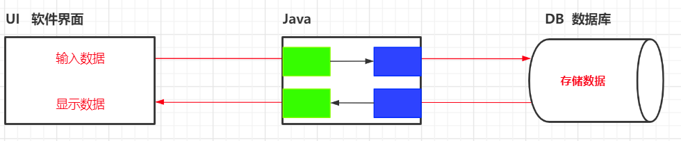 |

#### 1.4 软件开发流程

- 明确项目的需求
- 项目功能设计
  - 完成数据库设计
  - 完成流程设计
  - 完成UI界面
- 项目功能实现
  - 编码
  - 运行(功能测试)
- 项目测试（专业测试人员）
- 项目交付（项目部署）

## 二、Java语言的复习

#### 2.1 Java概述

> Java是一种面向对象的服务器编程语言

- Java出现于1991年，正式发布于1995年
- Java语言的摇篮：SUN
- Java语言之父：James·Gosling  高斯林
- Java语言的技术架构（Java语言可以干什么？）  2002开始占据编程语言排行榜第一
  - J2ME 传统手机上的软件（嵌入式编程）
  - JavaSE   AWT/swing   PC桌面程序 （百里挑一）
  - JavaEE  企业级应用（B/S）、互联网应用——解决三高问题
  - Android-SDK  手机应用（Android） （百里有一）

#### 2.2 编译和解释

> 编程语言都是由字母、数字、符号组成，然而计算机只能识别机器语言（二进制），因此我们写好的程序源文件在计算机OS上执行必须要经过一个转换的过程，转换的方式有2种：编译和解释

###### 编译

源文件先经过产生一个中间文件（可执行文件），计算机OS执行这个可执行文件

###### 解释

源文件不会提前编译产生中间文件，计算机每次执行程序时都会再次进行动态的转换

###### Java语言是一种编译解释型语言

> Java语言如何实现跨平台：
>
> Java源文件经过编译之后产生的字节码文件与操作系统无关，而是面向JVM运行的，因此无论是什么样的OS，只要能够安装JVM，就能执行Java程序

| Java语言的编译解释执行过程：              |
| ----------------------------------------- |
| 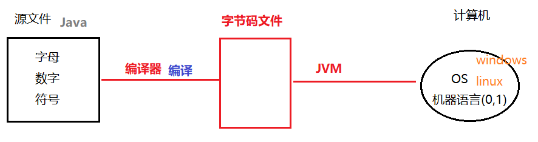 |

#### 2.3 JDK安装及环境变量配置

###### 2.3.1 下载

64位链接：https://pan.baidu.com/s/1oiBEHPa4i0N94G4Br7agdQ   提取码：052g 
32位链接：https://pan.baidu.com/s/1zytJsPyGCkmjp5cJbk6Hiw    提取码：atpm

###### 2.3.2 安装

安装及环境变量配置视频链接：https://pan.baidu.com/s/1oDMk6u4ju9nPorB7-FjfxQ 提取码：zdww 

- 傻瓜式安装 （默认安装在：）

  | 安装目录如下                              |
  | ----------------------------------------- |
  | 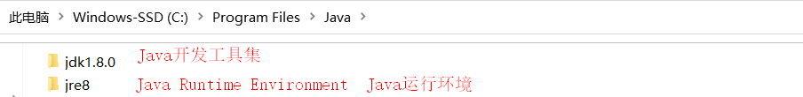 |

###### 2.3.3 配置环境变量

> 配置环境变量，就是将JDK的bin目录路径配置到操作系统，以便于在CMD命令行窗口中输入指令时能够找到JDK的工具文件。

- 最简洁的配置方式：

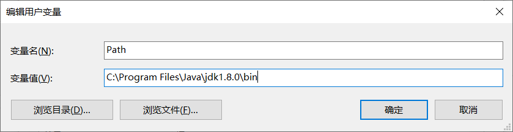

#### 2.4 IDE集成开发环境

###### 2.4.1 记事本开发流程

- 编辑源文件：

  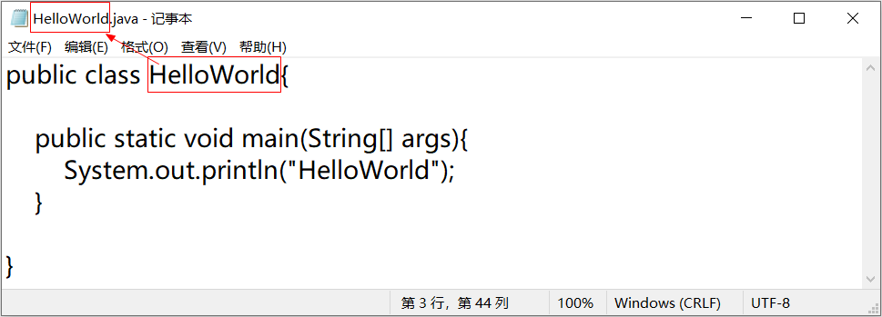

- 编译运行

  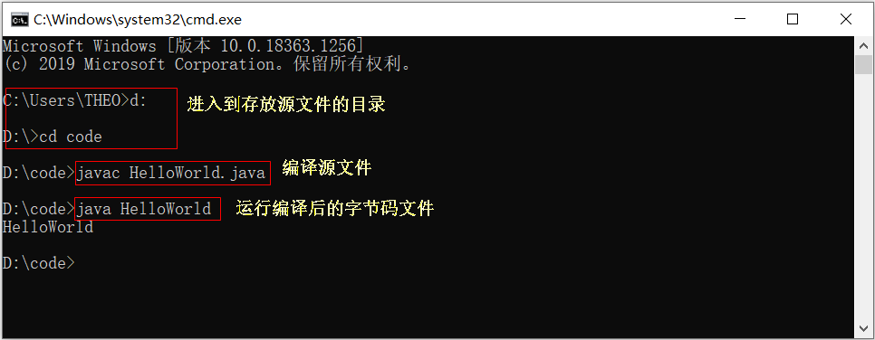

###### 2.4.2 IDE工具

> 使用记事本做开发：第一开发效率低；第二没有错误异常提示、错误率高；项目中的多个文件不便于管理。

- eclipse
- IDEA

###### 2.4.3 下载安装IDEA

- IDEA2019.2+破解链接：https://pan.baidu.com/s/1cBrRz8Mns_yQQwna4QHGzg   提取码：v0z6

- 傻瓜式安装：选择界面风格（Dark,Light）

###### 2.4.4 IDEA基本使用

> 代码写在方法中，方法创建在类中，类定义在包中，包创建在项目中

- 创建项目（基本Java项目）

  | 启动IDEA创建Java项目                      |
  | ----------------------------------------- |
  | 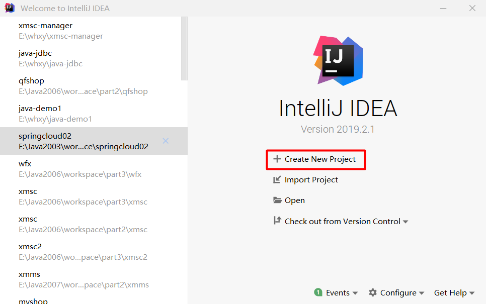 |
  | 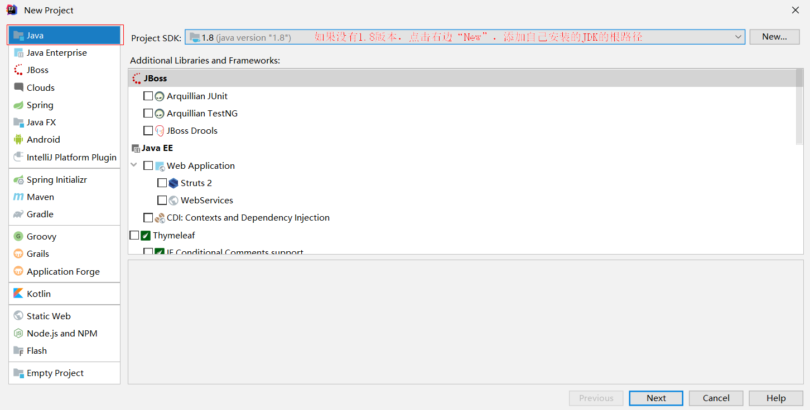 |
  | 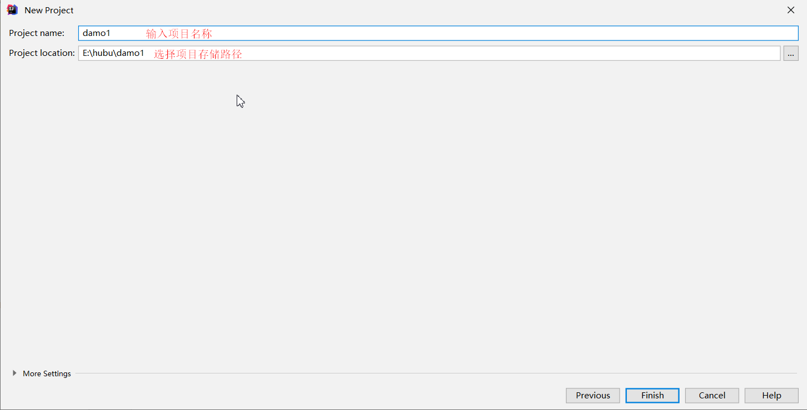 |

#### 2.5 编程规范

> 代码的质量和优雅型处理考察功能完成情况、还会考察代码编写规范
>
> 可读性——让别人看起容易懂、看着舒服
>
> 语法规则（法律）：必须遵守的，不遵守代码不能运行  
>
> 编程规范（道德）：需要遵守但是也可以不遵守  

###### 2.5.1 包名的命名规范

- 包名中所有字符小写
- 采用域后缀名倒置的形式命名
  - 千锋   www.qfedu.com
  - 湖大   www.hubu.edu.cn
- 包名结构：域后缀名.单位名称.模块名/项目组代号/项目名.包自己的名字
- 包名能够体现包的作用（有语义性）

###### 2.5.2 类名的命名规范

- 见名知意：选取能够表达类的作用的英文单词组成
- 驼峰式命名：类名首字母大写，如果包含多个单词，每个单词首字母都大写
- 类名可以包含字母、数字、$和_，但是不能以数字开头
- 类名可以使用中文，但是不提倡使用

#### 2.6 Java基础知识

###### 2.6.1 基础部分

- 基础语法：变量、标识符、关键字、运算符、流程控制
- 面向对象：`类与对象、方法定义与方法调用`、特征(抽象、封装、继承、多态 )
- 异常处理：try、catch、自定义异常
- 数组：数组定义及创建、数组遍历、排序（冒泡、快排、插入、选择）、二分法查找
- 常用类：String、Math、Date、DateFormat、Calendar、封装类（8个）
- 集合：ArrayList  集合家族Collection   \   Map家族

###### 2.6.2 高级部分

- IO流
- 网络编程
- 多线程
- AWT/Swing

#### 2.7 类、属性、方法

###### 2.7.1 类

> 属性和方法要定义在类中
>
> 类的定义语法

```java
[public] class <ClassName>{
    
}
```

- []包含的内容表示可有可无
- <>包含的内容必须有，但是可以改变

###### 2.7.2 方法

> 方法，就是能够完成特定功能代码块

```java
[<public|protected|private>] [static] <return_type> <methodName>([<argsList>]){
    
}
```

参数和返回值

```java
package cn.edu.hubu.demo.dao;

public class ClassA {

    /**
     * 无参数无返回值的方法：打印乘法口诀
     */
    public void printCFKJ(){
        for (int i = 1; i <=9 ; i++) {
            for (int j = 1; j <=i ; j++) {
                System.out.print(i+"*"+j+"="+i*j + "\t");
            }
            System.out.println();
        }
    }

    /**
     * 有参数有返回值的方法：获取一个指定范围内的随机数
     */
    public int getRandomNum(int a,int b){
        double d = Math.random();       // 0.45238947178923478
        double d2 = d*(b-a)+a;          // d2   [0,b-a)  ---  [a,b)
        int num = (int)Math.round(d2);  //[a,b]
        return num;
    }

}
```

###### 2.7.3 对象创建及方法调用

```java
package cn.edu.hubu.demo.dao;

public class ClassB {
    public static void main(String[] args) {
        //打印乘法口诀
        //调用ClassA中的printCFKJ方法
        //1.对象的创建：如果我们要调用某个类中的方法，需要先创建这个类的对象
        //  通过new关键字调用构造器创建对象
        ClassA a = new ClassA();

        //2.通过创建的对象调用类中的方法
        a.printCFKJ();
        int m = a.getRandomNum(10,30);
        System.out.println(m);
    }
}
```

Java基础参考视频：https://www.bilibili.com/video/BV1tQ4y1N7oh

## 三、数据库设计

> SQLServer
>
> Oracle (收钱)
>
> MySQL

#### 3.1 MySQL的安装和配置

###### 3.1.1 MySQL版本

- MySQL 5.x    v5.6    v5.7
- MySQL 8.x

- 下载：MySQL5.6链接：https://pan.baidu.com/s/1Sk37sP66WJsnYrIiKxkelg   提取码：3t1m 

###### 3.1.2 MySQL安装

- 傻瓜式安装
- 端口：3306
- 设置密码（root）：admin123

###### 3.1.3 安装数据库管理工具——Navicat

> MySQL是以服务的形式运行在OS中，没有提供可视化的窗口界面，只提供了一个DOS命令窗口用于进行指令操作；为了便于开发过程中对数据库的操作，我们需要安装一个数据库管理的视图工具——DBMS


- 傻瓜式安装

- 配置Navicat连接到MySQL数据库

  | Navicat连接到MySQL数据库                  |
  | ----------------------------------------- |
  | 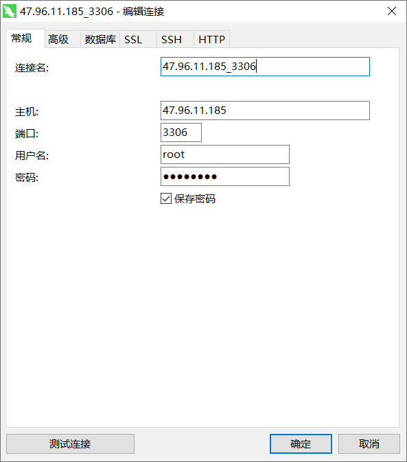 |

#### 3.2 SQL复习

> 我们可以通过SQL指令完成对数据库的各种操作：建库建表、数据的增删查改等等
>
> SQL 结构化查询语言——就是一种数据库可以“听懂”的语言

###### 3.2.1 SQL分类

- 根据SQL语句的作用，我们可以将SQL语句分为四类：
  - DDL  数据定义语言 ——建库、建表、索引、视图、存储过程、触发器
  - DML 数据操纵语言 ——对数据表中的数据进行增删改操作（insert\delete\update）
  - DQL 数据查询语言 ——对数据表中的数据进行查询操作（select）
  - DCL 数据控制语言 ——完成事务管理等操作（begin、commit、rollback）

###### 3.2.2 DDL（建库建表）

> 数据是存储在数据表中的，数据表是创建在数据库中

- 数据库管理

  ```sql
  -- 创建数据库
  create database db_ytao;
  
  -- 使用数据库
  use db_ytao;
  
  -- 删除数据库
  drop database db_ytao;
  ```

- 数据表管理

  ```sql
  -- 创建数据表
  -- 学生信息表：学号、姓名、性别、年龄、手机、QQ、个性签名
  -- 字符串  char定长   varchar可变
  create table tb_students(
  	stu_num char(15) primary key,
  	stu_name varchar(20) not null,
  	stu_gender char(2) not null,
  	stu_age int not null,
  	stu_tel char(11) not null unique,
  	stu_qq varchar(11) not null unique,
  	stu_desc varchar(200)
  );
  ```

###### 3.2.3 DML

- 添加操作

  ```sql
  -- 学生信息表中添加一条数据(在表名后的括号中列出字段名)
  insert into tb_students(stu_num,stu_name,stu_gender,stu_age,stu_tel,stu_qq,stu_desc)
  values('201801010101001','王二狗','男',21,'13030303300','123456','哥只是一个传说');
  
  insert into tb_articles(article_id,article_title,article_content) 
  values(12,'Java学习心得','2021.01.09日开始学习Java...');
  ```

- 删除操作

  ```sql
  -- delete from table 会删除数据表中所有的数据，需要通过where来限定删除条件
  delete from tb_articles where article_id=>13;
  ```

- 修改语句

  ```sql
  -- 修改学号为201801010101001的学生的名字和年龄
  update tb_students set stu_name='王小狗',stu_age=18 where stu_num='201801010101001';
  ```

###### 3.2.4 DQL

- 查询操作

  ```sql
  -- 显示指定列
  select stu_num,stu_name,stu_gender from tb_students;
  select stu_num,stu_name,stu_gender,stu_age,stu_tel,stu_qq,stu_desc from tb_students;
  select * from tb_students;
  
  -- 条件筛选查询
  select * from tb_students where stu_gender='女';
  
  -- order  by 对查询结果进行排序
  select * from tb_students order by stu_age desc
  
  -- group by分组查询: select 关键字后的字段只能是被分组字段和聚合函数（count\sum\max\min\avg）
  select stu_gender,count(1) from tb_students group by stu_gender;
  -- having 分组筛选
  select stu_age,count(1) from tb_students group by stu_age having stu_age>=20;
  
  -- 学生信息表有9个学生，4条记录为1页，可以分为3页 
  -- 第1页   1-4
  select * from tb_students limit 0,4;
  -- 第2页   5-8
  select * from tb_students limit 4,4;
  -- 第3页   9
  select * from tb_students limit 8,4;
  -- 第n页
  select * from tb_students limit (n-1)*4,4;
  
  -- 每页显示pageSize条，查询第pageNum页
  select * from tb_students limit (pageNum-1)*pageSize,pageSize;
  ```

#### 3.3 软件开发流程

###### 3.3.1 软件项目的开发流程

> 软件工程——软件开发生命周期
>
> - 问题定义：甲方提出项目需求（业务需求）
> - 可行性分析：从技术、经济、社会因素综合评估这个项目能不能做、要不要做
> - 需求分析：需求采集—需求分析
> - 概要设计：项目业务流程、数据库设计、UI设计
> - 详细设计：设计具体功能的实现流程
> - 编码
> - 测试
> - 交付：交项目（项目部署实施）、付款

###### 3.3.2 《小米商城后台管理系统》项目的功能需求

| 电商系统项目结构                          |
| ----------------------------------------- |
| 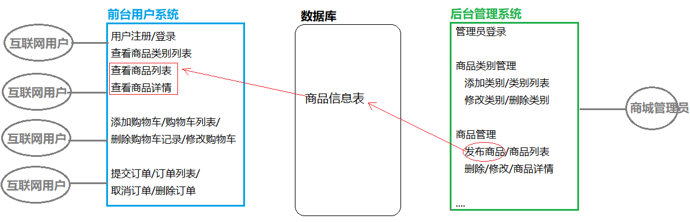 |

- 管理员登录

  > 管理员要使用正确的账号和密码进行登录之后才能使用这个管理系统

- 商品类别管理

  > 通过管理系统，能够动态完成添加商品类别、商品类别列表、修改类别及删除类别等操作

- 商品管理

  > 通过管理系统，可以动态完成商品发布、商品列表（分页）、修改商品信息、删除商品信息（下架）

- 用户管理
- 订单管理
- 售后服务

#### 3.4  《小米商城后台管理系统》数据库设计

###### **3.4.1.分析数据实体**

| **根据项目的功能确定要存储的数据对象**    |
| ----------------------------------------- |
| 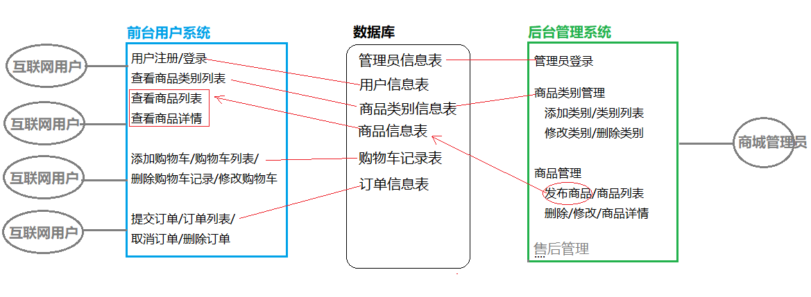 |

- 管理员
- 用户
- 类别
- 商品
- 购物车
- 订单

###### 3.4.2 提取实体数据项

> 根据甲方的业务需求及项目的功能需求分析每个数据实体的属性

- 管理员（管理员编号/工号，管理员账号，管理员密码，管理员姓名，管理员头像，管理员电话）
- 用户（用户ID，账号/手机，密码，性别、年龄....）
- 类别（类别ID，类别名称，类别描述）
- 商品（商品编号，商品名称，商品图片，商品价格，商品库存，商品说明，图文详情）
- 购物车（购物车ID，用户ID，商品ID，数量，日期）
- 订单(订单ID，用户ID，订单日期，订单状态，....）
- 商品快照表（....）

| 购物车和订单数据关系                      |
| ----------------------------------------- |
| 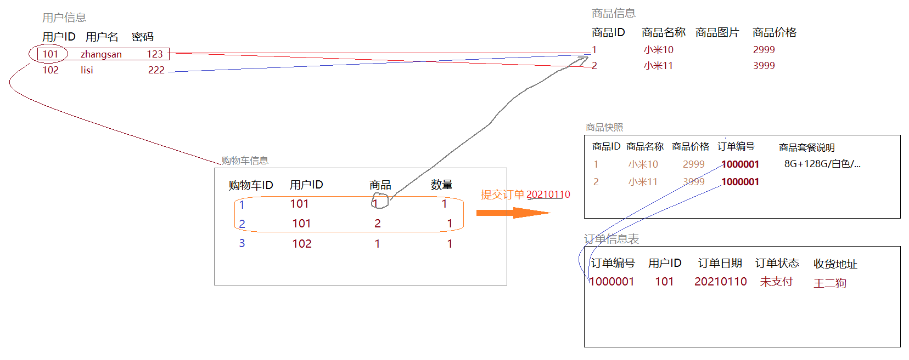 |

###### **3.4.3 规范实体数据项**

> 使用数据库设计范式检查数据项是否合理——数据库设计三范式

`第一范式：数据表中的字段不可再分`

> 傻子都不可能创建出不满足第一范式的表格，目前现有的数据库都不支持如下结构的创建

| 第一范式反例：                            |
| ----------------------------------------- |
| 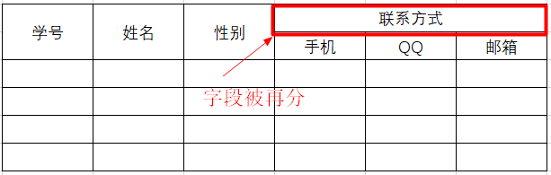 |

`第二范式：不存在非关键字段对关键字段的部分函数依赖`

| 第二范式案例：                            |
| ----------------------------------------- |
| 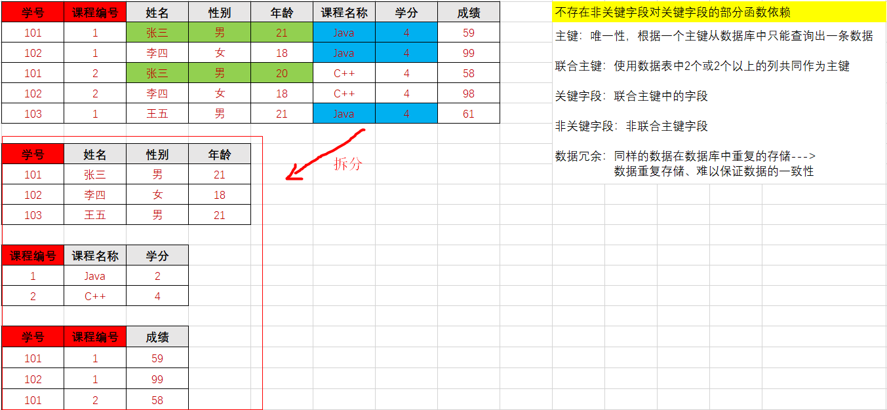 |

`第三范式：不存在非关键字段之间的传递依赖`

| 第三范式案例：                            |
| ----------------------------------------- |
| 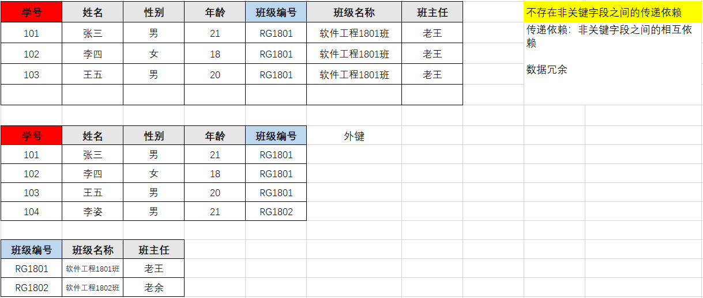 |

###### 3.4.4 绘制实体关系图（E-R）

> 通过E-R图例，分析实体和实体之间的关系（一对一、一对多、多对一、多对多）
>
> 在企业开发中通常是通过PD进行数据库建模

| 实体关系图                                |
| ----------------------------------------- |
| 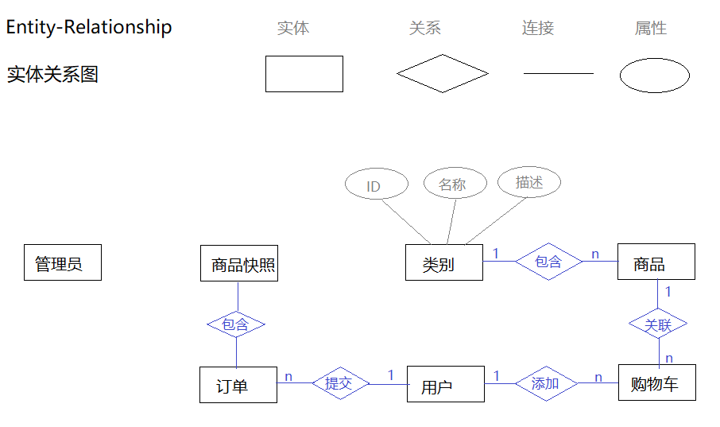 |

###### 3.4.5 数据表设计（三线图）

>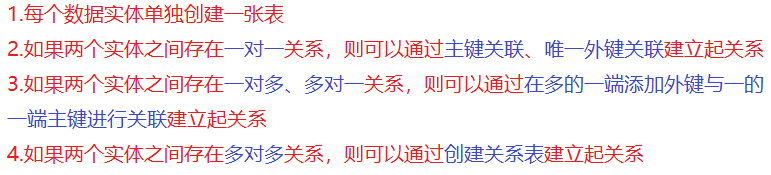

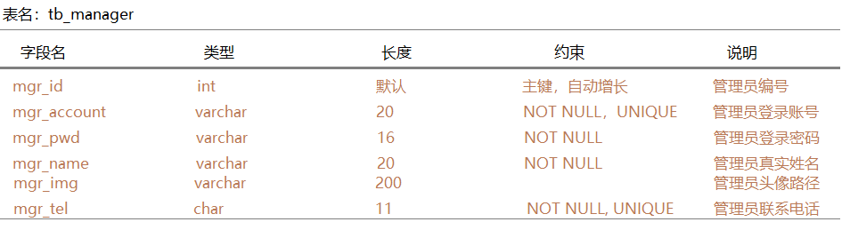

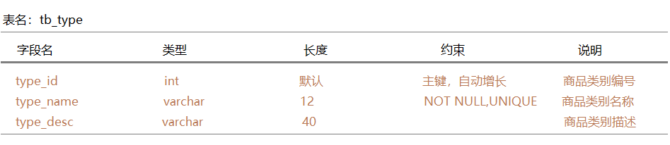

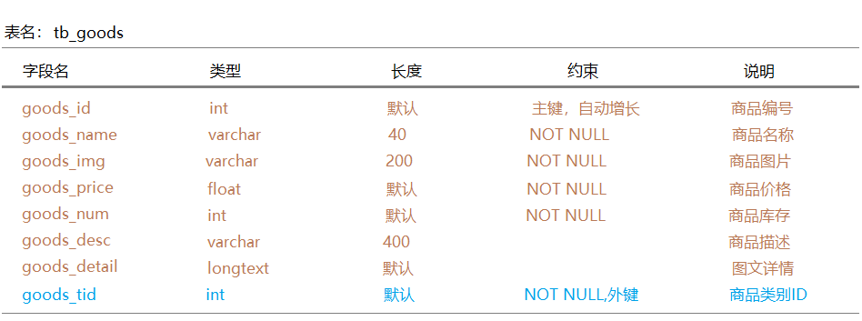

###### 3.4.6 建库建表（SQL）

大家根据三线图自行完成

## 四、数据库编程

> 使用Java代码完成对数据库、数据表中的数据的访问——JDBC

#### 4.1 JDBC的步骤

| JDBC操作数据库7个步骤                     |
| ----------------------------------------- |
| 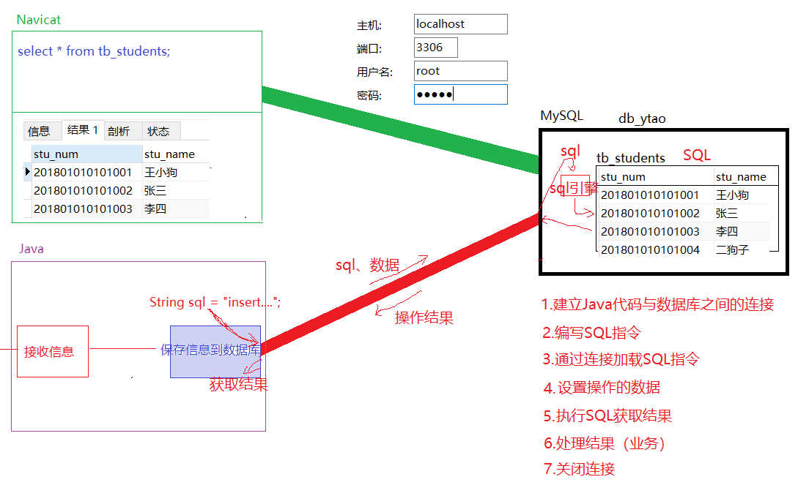 |

#### 4.2 JDBC实现：添加操作

> 案例：使用Java代码向db_ytao数据库的tb_students表中添加一条学生信息

###### 4.2.1 建立数据库连接

- 将数据库连接驱动文件添加到项目中
  - 选择Java项目名---右键---New Directory---lib
  - 将mysql-connector-java-5.1.47.jar文件拷贝并粘贴到创建的lib文件夹
  - 选择lib中的mysql-connector-java-5.1.47.jar文件---右键---Add as Library--OK
- 加载驱动
- 获取连接

| 创建连接                                  |
| ----------------------------------------- |
| 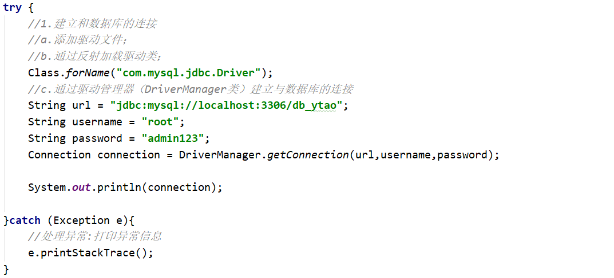 |

###### 4.2.2 JDBC操作代码（2-7步）

|                                           |
| ----------------------------------------- |
| 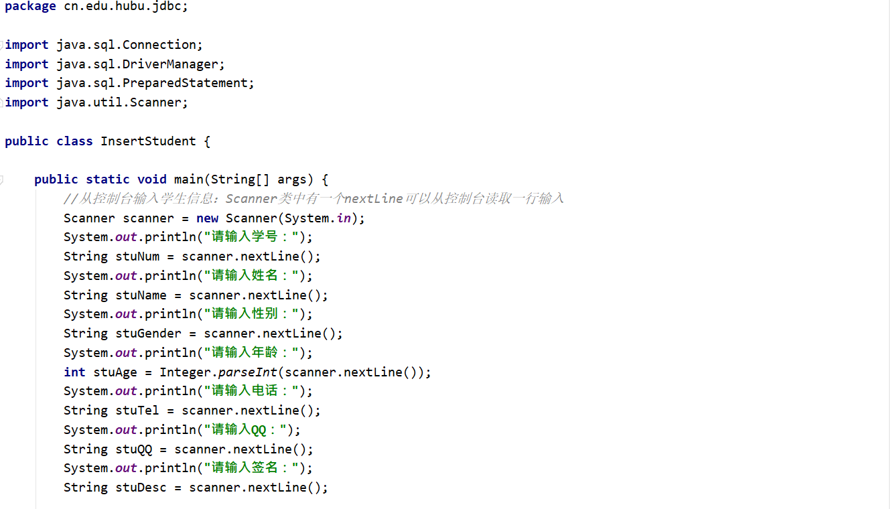 |
| 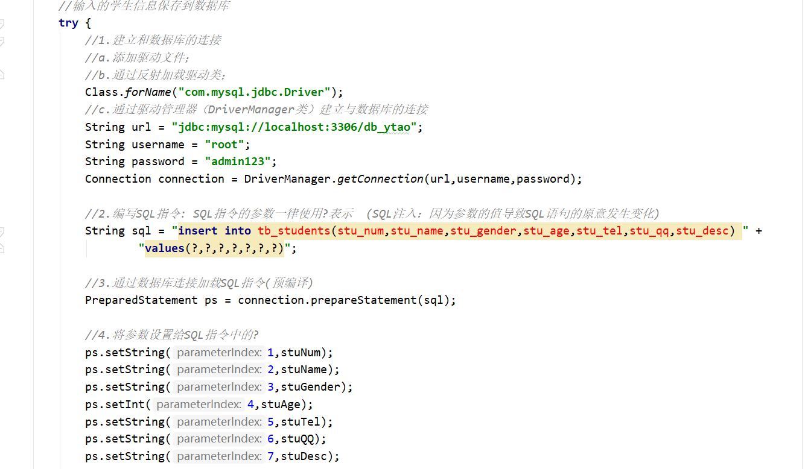 |
| 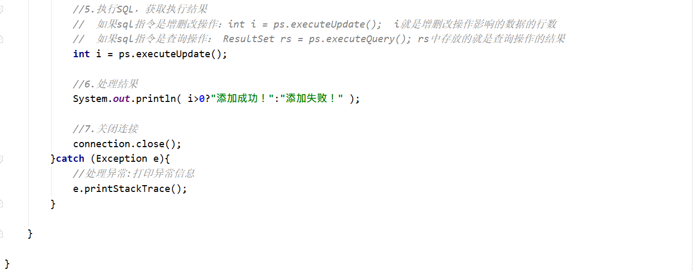 |

#### 2021.01.11晚上练习任务

###### 1.复习今天的笔记，掌握软件的开发流程及数据库设计规范，完成小米商城数据表的创建

###### 2.总结JDBC操作步骤，完成学生信息的添加操作（课堂案例）

###### 3.完成学生信息的删除操作（根据输入的学号删除一条学生信息）

###### 4.完成学生信息的修改操作（根据学号修改学生的姓名、性别、...）

#### 4.3 JDBC实现：删除操作

- 代码如下：

  ```java
  package cn.edu.hubu.jdbc;
  
  import java.sql.Connection;
  import java.sql.DriverManager;
  import java.sql.PreparedStatement;
  import java.util.Scanner;
  
  
  public class DeleteStudent {
  
      public static void main(String[] args) {
          Scanner scanner = new Scanner(System.in);
          System.out.println("请输入要删除的学生学号：");
          String stuNum = scanner.nextLine();
          try {
              //如果这句代码需要进行异常处理，将鼠标放在红色提示后面：ALT+ENTER
              Class.forName("com.mysql.jdbc.Driver");
              //数据库连接字符串
              String url = "jdbc:mysql://localhost:3306/db_ytao?characterEncoding=utf-8";
              String username = "root";
              String password = "admin123";
              //在IDEA如果调用的方法有返回值，可以在方法调用完成之后，直接.var回车自动定义接收返回值的变量
              Connection connection = DriverManager.getConnection(url, username, password);
  
              String sql = "delete from tb_students where stu_num=?";
              PreparedStatement ps = connection.prepareStatement(sql);
              ps.setString(1,stuNum);
              int i = ps.executeUpdate();
              System.out.println(i>0?"删除成功！":"删除失败！");
              connection.close();
          } catch (Exception e) {
              e.printStackTrace();
          }
  
      }
  
  }
  ```

#### 4.4 JDBC操作：修改操作

- 代码如下

  ```java
  package cn.edu.hubu.jdbc;
  
  import java.sql.Connection;
  import java.sql.DriverManager;
  import java.sql.PreparedStatement;
  import java.util.Scanner;
  
  public class UpdateStudent {
  
      public static void main(String[] args) {
          Scanner scanner = new Scanner(System.in);
          System.out.println("请输入要修改的学生学号：");
          String stuNum = scanner.nextLine();
          System.out.println("请输入新姓名：");
          String stuName = scanner.nextLine();
          System.out.println("请输入新性别：");
          String stuGender = scanner.nextLine();
          System.out.println("请输入新年龄：");
          String stuAge = scanner.nextLine();
          System.out.println("请输入新电话：");
          String stuTel = scanner.nextLine();
          System.out.println("请输入新QQ：");
          String stuQQ = scanner.nextLine();
          System.out.println("请输入新签名：");
          String stuDesc = scanner.nextLine();
  
          try {
              Class.forName("com.mysql.jdbc.Driver");
              String url = "jdbc:mysql://localhost:3306/db_ytao?characterEncoding=utf-8";
              String username = "root";
              String password = "admin123";
              Connection connection = DriverManager.getConnection(url, username, password);
  
              String sql = "update tb_students set stu_name=?,stu_gender=?,stu_age=?,stu_tel=?,stu_qq=?,stu_desc=? where stu_num=?";
              PreparedStatement ps = connection.prepareStatement(sql);
              ps.setString(1,stuName);
              ps.setString(2,stuGender);
              ps.setString(3,stuAge);
              ps.setString(4,stuTel);
              ps.setString(5,stuQQ);
              ps.setString(6,stuDesc);
              ps.setString(7,stuNum);
  
              int i = ps.executeUpdate();
              System.out.println(i>0?"修改成功！":"修改失败！");
              connection.close();
          } catch (Exception e) {
              e.printStackTrace();
          }
  
      }
  
  }
  ```

#### 4.5 DBUtil工具类封装

> 每一个JDBC操作都必须先创建数据库的连接，我们可以将创建连接的工作单独定义成一个方法来实现，在具体的JDBC操作中只需调用此方法就可以完成创建连接的工作

| DBUtil封装                                |
| ----------------------------------------- |
| 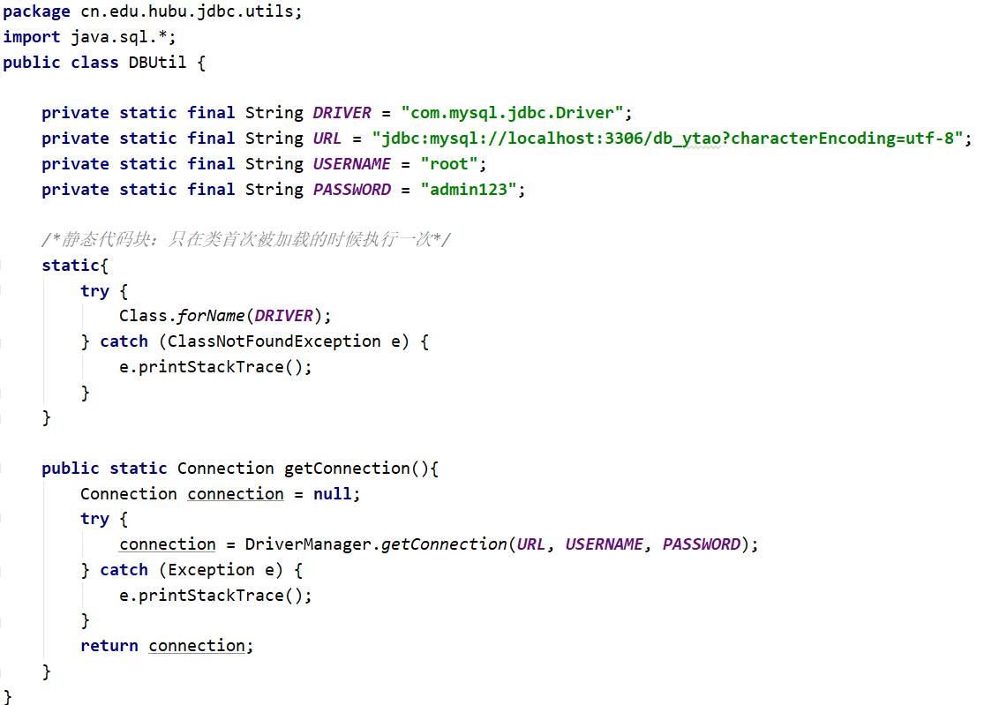 |

#### 4.6 DAO封装

> 为了提供数据库JDBC操作的复用性，我们将能够实现特定数据库操作的代码单独定义成一个方法；
>
> 我们将对于一张表的不同的JDBC操作的方法定义在同一个类中，这个类我们称之为DAO类；
>
> DAO(Data Access Object)数据访问对象
>
> 当我们需要对张数据表进行操作的时候，我们只需调用对应DAO类中的方法

#### 4.7 DTO封装

> DTO (Data Transfer Object)数据传输对象

```java
/**
 * DTO类：用来为JDBC操作传递数据的（一个DTO类的对象可以存放数据表中的一条数据）
 * DTO类的创建规范：
 * 1.DTO类中属性的个数和类型要与对应的数据表保持一致（Student --- tb_students ）
 * 2.提供无参构造器：右键---Generate---Constructor---点击select None按钮
 * 3.提供全参构造器：右键---Generate---Constructor--- 选择所有属性 ---点击OK按钮
 * 4.提供所有属性的get和set方法：右键---Generate---Getter and Setter---选择所有属性 ---点击OK按钮
 */
public class Student {

    private String stuNum;
    private String stuName;
    private String stuGender;
    private int stuAge;
    private String stuTel;
    private String stuQQ;
    private String stuDesc;
	//无参构造器
  	//全参构造器
    //所有属性的get和set方法
}
```

#### 4.8 JDBC操作：查询操作

- 根据ID查询一条记录

  ```java
  //根据学号查询一个学生信息
  public Student queryStudent(String stuNum){
      Student student = null;
      try{
          //根据学号查询学生信息，将查询到学生信息的7个值存储到student对象中
          Connection connection = DBUtil.getConnection();
          String sql = "select * from tb_students where stu_num=?";
          PreparedStatement ps = connection.prepareStatement(sql);
          ps.setString(1,stuNum);
          ResultSet rs = ps.executeQuery();
          //从rs中取出查询的结果，存放在student对象中
          if(rs.next()){
              String stuNum1 = rs.getString("stu_num");
              String stuName = rs.getString("stu_name");
              String stuGender = rs.getString("stu_gender");
              int stuAge = rs.getInt("stu_age");
              String stuTel = rs.getString("stu_tel");
              String stuQQ = rs.getString("stu_qq");
              String stuDesc = rs.getString("stu_desc");
              student = new Student(stuNum1,stuName,stuGender,stuAge,stuTel,stuQQ,stuDesc);
          }
          connection.close();
      }catch (Exception e){
          e.printStackTrace();
      }
      return student;
  }
  ```

- 查询多条记录

  ```java
  public List<Student> listStudents(){
      List<Student> list = new ArrayList<>();
      try {
          Connection connection = DBUtil.getConnection();
          String sql = "select * from tb_students";
          PreparedStatement ps = connection.prepareStatement(sql);
          ResultSet rs = ps.executeQuery();
          while(rs.next()){
              String stuNum = rs.getString("stu_num");
              String stuName = rs.getString("stu_name");
              String stuGender = rs.getString("stu_gender");
              int stuAge = rs.getInt("stu_age");
              String stuTel = rs.getString("stu_tel");
              String stuQQ = rs.getString("stu_qq");
              String stuDesc = rs.getString("stu_desc");
          Student student = new Student(stuNum,stuName,stuGender,stuAge,stuTel,stuQQ,stuDesc);
              list.add(student);
          }
          connection.close();
      } catch (SQLException e) {
          e.printStackTrace();
      }
      return list;
  }
  ```

#### 4.9 JDBC操作：分页查询

| 根据页码查询数据                          |
| ----------------------------------------- |
| 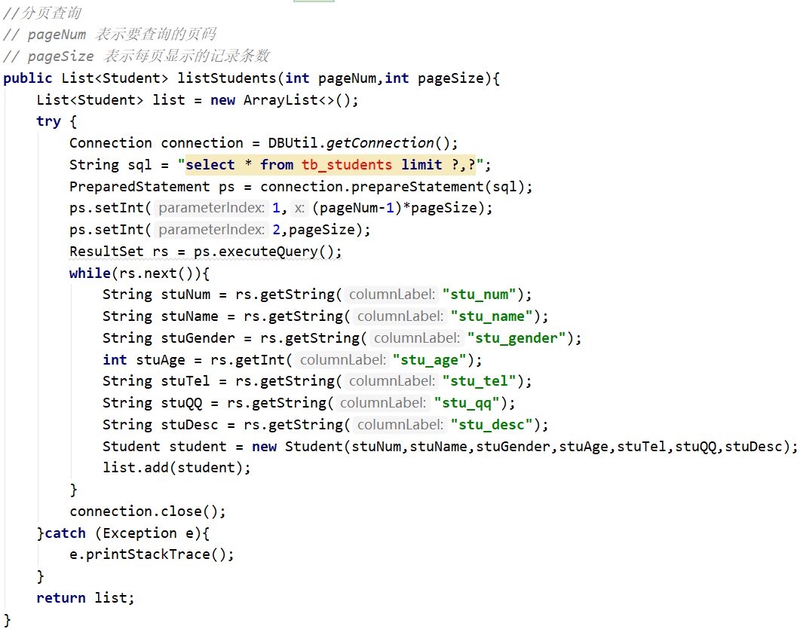 |

| 查询总记录数                              |
| ----------------------------------------- |
| 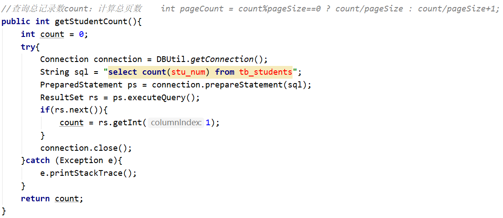 |

| 测试分页查询                              |
| ----------------------------------------- |
| 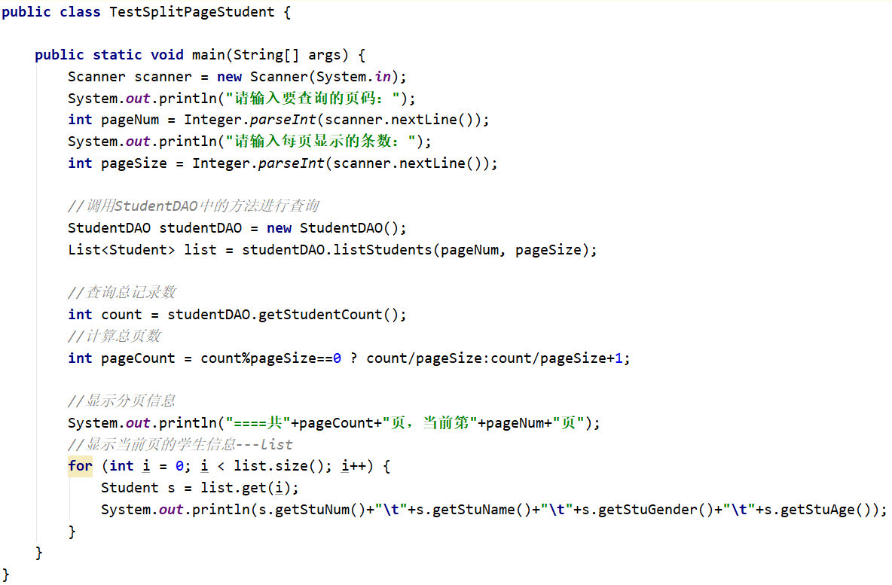 |

#### 4.10 JDBC操作关闭连接的规范

###### 4.10.1 Java中异常处理过程

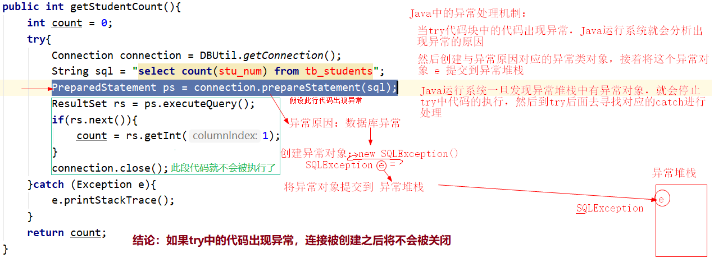

###### 4.10.2 连接关闭规范

- 在JDBC操作中连接的关闭规范

  ```java
  public int getStudentCount() {
      int count = 0;
      Connection connection = null;
      PreparedStatement ps = null;
      ResultSet rs = null;
      try {
          connection = DBUtil.getConnection();
          String sql = "select count(stu_num) from tb_students";
          ps = connection.prepareStatement(sql);
          rs = ps.executeQuery();
          if (rs.next()) {
              count = rs.getInt(1);
          }
      } catch (Exception e) {
          e.printStackTrace();
      } finally {
          //finally是跟在try/catch最后的代码块
          try {
              if(rs!=null){
                  rs.close();
              }
              if(ps!=null){
                  ps.close();
              }
              if (connection != null) {
                  connection.close();
              }
          } catch (SQLException e) {
              e.printStackTrace();
          }
      }
      return count;
  }
  ```

- DBUtil封装连接关闭的方法

  | DBUtil                                    |
  | ----------------------------------------- |
  | 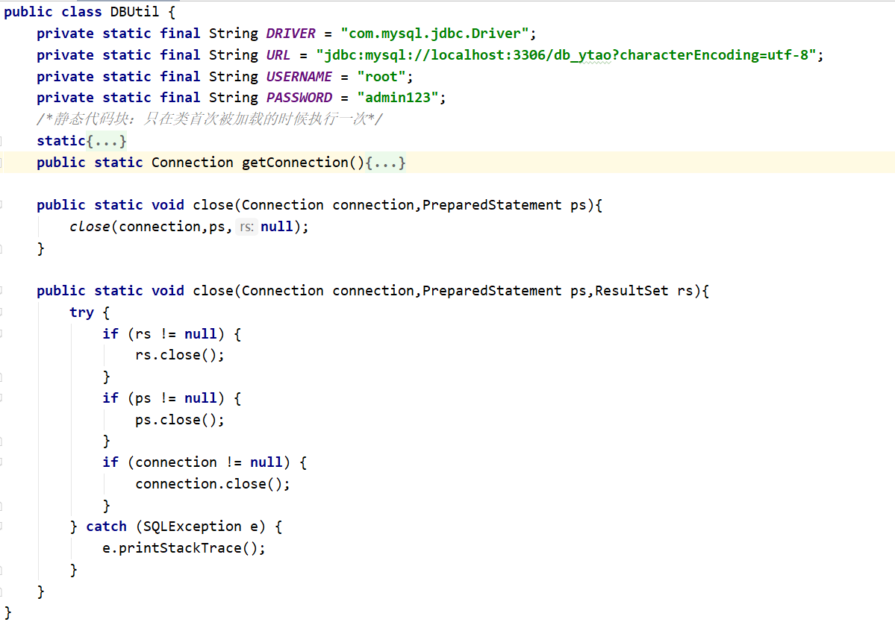 |

- DAO中的JDBC操作直接调用DBUtil方法关闭连接

  | StudentDAO                                |
  | ----------------------------------------- |
  | 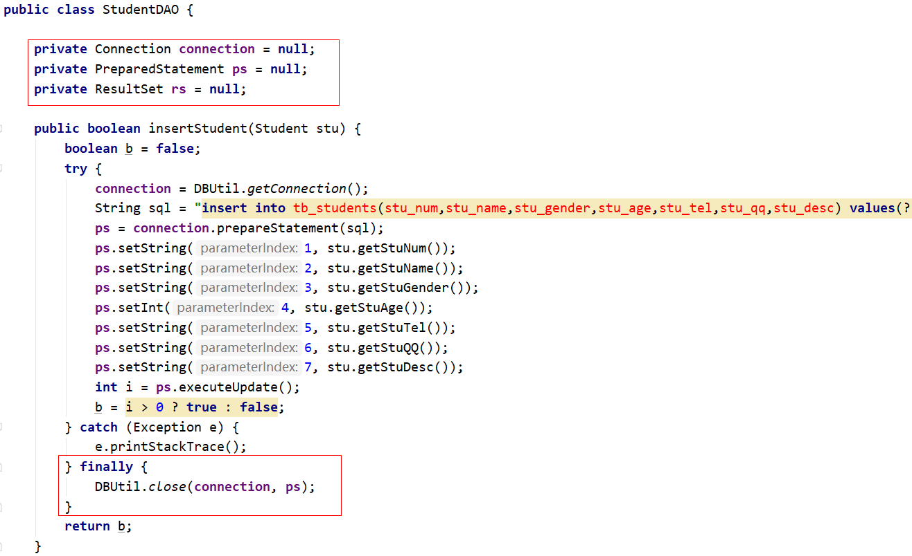 |

## 五、网页设计

####  5.1 B/S 和 C/S 项目架构方式

- B/S (Browser-Server) 基于浏览器和服务器的架构模式

  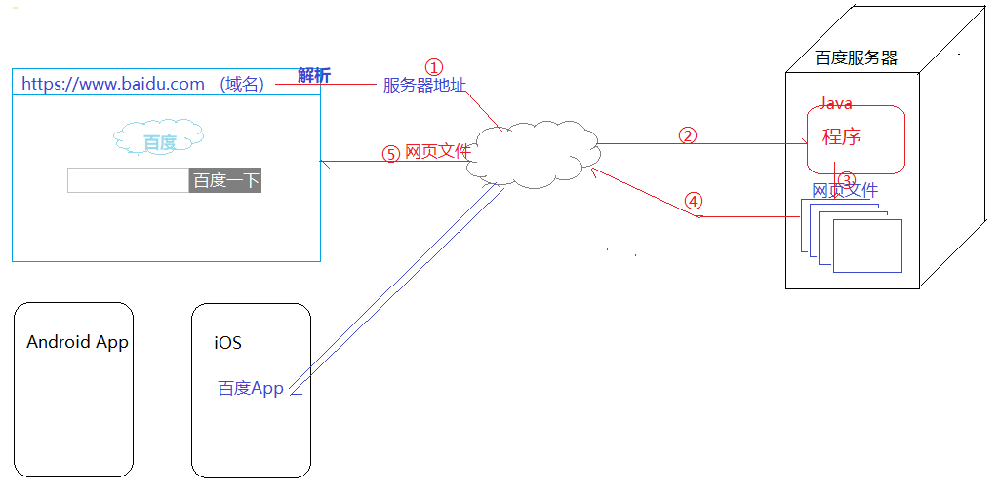

- C/S (Client-Server) 基于客户端和服务器的架构模式，专用客户端模式（QQ）

  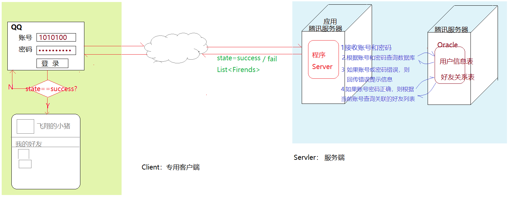

#### 5.2 网页设计介绍

> 网页就是`存储在服务器、可以通过网络传输到用户、并通过浏览器展示出特定视图页面的`文件

###### 5.2.1 网页文件特点

- 后缀名为.html或者.htm

- 可以通过浏览器显示出界面

- 网页文件基本结构：标签

  ```html
  <!DOCTYPE html>
  <html>
      <head>
           <meta charset="utf-8"/>
           <title>登录页面</title>
      </head>
      <body>
  
      </body>
  </html>
  ```

###### 5.2.2 网页三要素

- HTML 超文本标记语言，决定了网页的结构（显示的内容）
- CSS 层叠样式表，决定了网页中视图的显示效果
- JavaScript 脚本语言，决定了网页中动态效果及功能

```html
<!DOCTYPE html>
<html>
    <head>
         <meta charset="utf-8"/>
         <title>登录页面</title>
    </head>
    <body>
        <input type="button" style="width:100px;height:25px" value="点我呀" onclick="test()"/>
        <script type="text/javascript">
            function test(){
                alert("从前有座山");
            }
        </script>
    </body>
</html>
```

#### 5.3 HTML常用标签

###### 5.3.1 显示标签

> 将文本、图片、声音、视频等在网页中进行显示和播放

```html
<!--文本-->
<label style="color:red; font-size:15px; font-family:黑体">文本内容</label>

<!--图片-->


<!--声音-->
<audio controls src="song/001.mp3" autoplay loop="-1"></audio>

<!--视频-->
<video controls src="mv/001.mp4" autoplay loop="-1"></video>
```

###### 5.3.2 输入标签

> 在网页中提供输入视图（文本输入框、密码输入框等）以便用户可以在页面中输入数据

```html
<!--文本输入框--><input type="text"/>
<!--密码输入框--><input type="password"/>
<!--文件选择框--><input type="file"/>

<!--单选按钮: 必须提供value属性，必须提供name属性并且同一组选项name属性必须相同-->
<input type="radio" value="M" name=”gender“/>男
<input type="radio" value="F"  name=”gender“/>女
<!--复选框：同单选按钮-->
<input type="checkbox" value="t" name="hobby"/>旅游

<!--普通按钮：默认按钮上没有文字，需要通过value属性指定按钮上的文字-->
<input type="button" value="普通按钮"/>
<!--提交按钮--><input type="submit"/>
<!--重置按钮--><input type="reset"/>
<!--图片按钮: 作用其实是一个提交按钮，通过src属性指定按钮图片-->
<input type="image" src="img/btn.jpg"/>

<!--颜色选择框--><input type="color"/>
<!--日期输入框--><input type="date"/>
<!--数字输入框--><input type="number"/>

<!--下拉菜单：选项option标签必须提供value属性-->
<select>
    <option value="深圳">深圳</option>
    <option value="WH">武汉</option>
</select>
<!--文本域:多行输入框-->
<textarea></textarea>
```

###### 5.3.3 布局标签

> 布局标签，就是对网页中的元素进行排版

```html
<!-- 换行 --><br/>

<!-- 水平分割线 --> <hr/>

<!-- 段落 --><p></p>

<!-- 字段域 -->
<fieldset>
	<legend>字段域标题</legend>
</fieldset>

<!-- 列表 -->
<ul>
    <li></li>
    <li></li>
</ul>

<ol>
    <li></li>
    <li></li>
</ol>

<!-- 表格 -->
<table>
    <caption>表格标题</caption>
    <tr>
    	<td></td>
        <td></td>
        <td></td>
    </tr>
    <tr>
    	<td></td>
        <td></td>
        <td></td>
    </tr>
</table>

<!-- div+css: 绝对布局、相对布局、浮动布局 -->
<div style="postition:absolute|relative|float; left:10px ; top:10px">
    
</div>
```

###### 5.3.4 页面框架

> 页面框架，实现同一个网页中动态展示多个网页

```html
<!--frameset-->
<!--iframe--->
```

| 页面框架案例：                            |
| ----------------------------------------- |
| 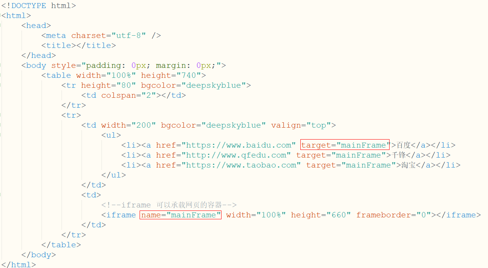 |
|  |


#### 2021年1月11日 练习任务

###### JDBC练习

1. 创建一个图书信息表： tb_books
2. 新建一个Java项目：jdbc-bims
3. 在项目中添加  mysql驱动文件
4. 在项目中创建"cn.edu.hubu.bims.utils"包，完成DBUtil类
5. 在项目中创建"cn.edu.hubu.bims.dto"包，创建Boot类
6. 在项目中创建"cn.edu.hubu.bims.dao"包，创建BookDAO类，完成如下操作：
   - 添加图书信息
   - 根据图书编号删除图书信息
   - 根据图书编号修改图书信息
   - 根据图书编号查询一个图书信息
   - 分页查询图书信息
   - 查询图书信息总记录数

#### 5.4 CSS样式总结

###### 5.4.1 CSS基本语法

- 几乎所有的HTML标签都可以添加style属性来设置元素的显示样式

  ```html
  
  ```

- 如果在同一个网页中，有多个HTML标签具有相同的样式，我们可以直接将样式定义在style标签中；在style标签定义样式常用的有三种选择器：

  ```html
  <!DOCTYPE html>
  <html>
  	<head>
  		<meta charset="UTF-8">
  		<title></title>
  		<style type="text/css">
  			/*如果我们将样式定义在style标签中，常用的有三种选择器：*/
  			/*1.标签选择器:使用标签的名字作为样式名称
  			img{
  				width:200px;
  				height:100px;
  			}
  			*/
  			
  			/*2.类选择器：对网页中"class=样式名"的标签有效*/
  			.style1{
  				width:200px;
  				height:100px;
  			}
  			/*3.id选择器：对网页中"id=样式名"的标签有效*/
  			#img2{
  				border-radius: 10px;
  			}
  		</style>
  	</head>
  	<body>
  		
  		
  		
  		
  		<textarea class="style1"></textarea>
  	</body>
  </html>
  ```

- 在一个HTML标签中的class属性可以引用style中定义的多种样式

  ```html
  <!DOCTYPE html>
  <html>
  	<head>
  		<meta charset="UTF-8">
  		<title></title>
  		<style type="text/css">
  			.style1{
  				width:200px;
  				height:100px;
  			}	
  			.style2{
  				border-radius: 50px;
  			}
  		</style>
  	</head>
  	<body>
  		
  	</body>
  </html>
  ```

- 如果一个标签引用多个样式时，在多个样式中出现了样式属性值的冲突——就近一致

- 如果多个网页中需要使用相同的样式，我们可以把公用的样式单独定义在一个css文件中，然后在需要使用样式的HTML文档中引用这个css文件即可

  | 样式文件                                  |
| ----------------------------------------- |
  | 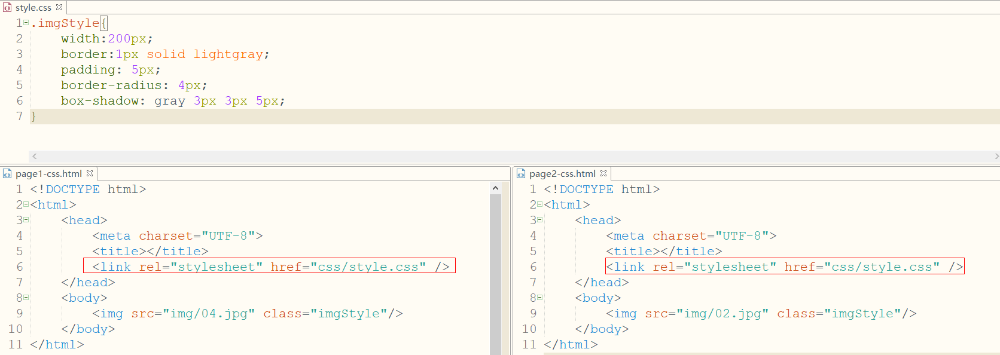 |

###### 5.4.2 CSS常用样式

> 盒子模型：尺寸、背景、边框、外边距、内边距、字体、文本
>
> 高级样式：2D/3D  过渡  动画

```html
<!DOCTYPE html>
<html>
	<head>
		<meta charset="UTF-8">
		<title></title>
		<style type="text/css">
			/*尺寸样式*/
			.sizeStyle{
				width:400px;
				height: 200px;
			}
			
			/*边框样式*/
			.borderStyle{
				border:1px dotted deeppink;
				/*border-width: 1px;
				border-style: dotted;
				border-color: deeppink;*/
				border-radius: 0px 50px;
				box-shadow: red 3px 3px 5px;
			}
			
			/*背景样式*/
			.backgroundStyle{
				/*background-color: orange;*/
				/*background-image: url(img/01.jpg);*/
				background: url(img/bg.bmp);
				/*background-position: -50px -30px; 设置背景图片的偏移*/
				/*background-repeat:repeat; 设置背景图片的平铺方式*/
			}
			
			/*外边距*/
			.marginStyle{
				/*margin-top: 50px;*/
				/*margin-left: 100px;*/
				margin: 50px;
			}
			
			/*内边距*/
			.paddingStyle{
				/*padding-top: 30px;*/
				/*padding-left: 50px;*/
				padding: 20px;
			}
			
			/*字体样式*/
			.fontStyle{
				color:deeppink;
				font-size: 25px;
				font-family: "comic sans ms";
				font-weight: bold;
			}
			
			/*文本样式*/
			.textStyle{
				text-align: center;
				text-decoration: none;
				text-shadow: deepskyblue 3px 3px 2px;
			}
			
		</style>
	</head>
	<body>
		
		<div class="sizeStyle borderStyle backgroundStyle 
			marginStyle paddingStyle fontStyle textStyle">
			HelloWorld
		</div>
		
	</body>
</html>
```

###### 5.4.3 2D/3D变形和动画

```html
<!DOCTYPE html>
<html>
	<head>
		<meta charset="UTF-8">
		<title></title>
		<style type="text/css">
			body{
				margin: 0px;
				padding: 0px;
			}
			
			.imgStyle{
				/*2D3D转换*/
				/*transform: translate(100px,50px); 设置元素的位置偏移*/
				/*transform: scale(2); 保持元素中心点不变进行放大和缩小*/
				/*transform: skew(30deg); 拉伸*/
				/*transform: rotate(45deg); 旋转*/
				/*transform:  translate(200px,100px) rotate(45deg);*/
				/*引用动画*/
				width: 200px; 
				height: 200px; 
				border-radius: 50%; 
				animation: ergouzi 2s linear infinite;
			}
			
			
			/*定义动画*/
			@keyframes ergouzi{
				0%{
					transform: rotate(0deg);
				}
				100%{
					transform: rotate(360deg);
				}
			}
			
		</style>
	</head>
	<body>
		
	</body>
</html>
```

#### 5.5 JavaScript 

> JavaScript ,是一种基于对象的、事件驱动型的脚本语言

###### 5.5.1 JavaScript简介

- JavaScript 和Java语言没有直接的关系，是由Netscape设计开发的一种浏览器语言，前身叫做LiveScript，后来因为和sun公司合作后更名为Javascript
- JavaScript 是基于对象：不能和Java一样创建类，但是JavaScript 提供了一些内置对象，这些对象可以调用预定义方法
- JavaScript 是运行在浏览器中的，通过网页中的事件（键盘按键、点击鼠标等）触发执行
- JavaScript 在网页中主要用来：
  - 动态修改HTML标签属性、样式属性
  - 动态增删HTML文档中标签（DOM操作）
  - 可以对用户在页面输入的数据进行格式的检查（数据校验）
  - 可以和服务器进行交互（异步交互）

###### 5.5.2 JavaScript基本语法

- JavaScript 代码哪里？
  - JavaScript需要写Script标签，script标签可以写在HTML文件的任何位置（通常写在body标签的最后一部分）
  - 我们也可以将js代码写在单独js文件中，然后在HTML文件中通过script标签引用js文件（特别注意：如果一个script标签用来引用js文件，则不能在这个标签自定义JavaScript 代码）

- JavaScript方法的定义语法：

  ```javascript
  //1. Javascript方法没有访问权限，直接使用function关键字定义方法
  //2. Javascript方法不需要声明返回类型（如果有返回值，直接通过return关键字返回即可）
  //3. Javascript方法如果需要参数，直接指定参数的个数即可，无需指定返回类型
  // Javascript是弱类型语言，所有的变量都是var类型
  function changeImg(a,b){
      var i = 5;
      var j = "abc";
      return 5;
  }
  ```

###### 5.5.3 JavaScript方法的触发—事件

> 事件，就是网页文件中发生的动作（鼠标、键盘）

```html
<!DOCTYPE html>
<html>
	<head>
		<meta charset="UTF-8">
		<title></title>
	</head>
	<body>
		
		<button onclick="changeImg()">测试</button>
		
		<script type="text/javascript">
			function changeImg(){
				alert("Hello");
			}
		</script>
	</body>
</html>
```

###### 5.5.4 JavaScript获取HTML文档中的元素（标签）

>document是js的一个内置对象（可以直接使用），表示当前html文档，我们在js中可以通过document对象来获取HTML文档中的元素

```javascript
//1.根据标签名获取HTML文档中的元素
var arr1 = document.getElementsByTagName("img");

//2.根据标签name属性的值获取HTML文档中的元素
var arr2 = document.getElementsByName("aaa");

//3.根据标签的class属性值获取HTML文档中的元素
var arr3 = document.getElementsByClassName("bbb");

//4.根据标签的ID属性值获取某个特定的元素
var e = document.getElementById("img1");
```

###### 5.5.5 修改HTML标签的属性和样式

```html
<!DOCTYPE html>
<html>
	<head>
		<meta charset="UTF-8">
		<title></title>
	</head>
	<body>
		
		<div name="aaa" class="bbb"></div>
		
		<button onclick="changeImg()">测试</button>
		
		<script type="text/javascript">
			function changeImg(){

				//根据ID获取图片标签
				var e = document.getElementById("img1");
				
				//切换img标签显示的图片，就是要改变img标签(e)的src属性
				//修改元素的属性：
				e.src = "img/02.jpg";
				e.width = 300;
				
				//修改元素的样式：
				e.style.border="1px green solid";
				e.style.padding="5px";
				e.style.borderRadius="3px";
			}
		</script>
	</body>
</html>
```

###### 5.5.6  动态增删页面中的元素

```html
<!DOCTYPE html>
<html>
	<head>
		<meta charset="UTF-8">
		<title></title>
	</head>
	<body>
		<div id="container" style="width: 300px; height: 200px; border: 1px red solid;">
			
		</div>
		
		<button onclick="test()">测试</button>
		
		<script type="text/javascript">
			function test(){
				//1.删除HTML元素
				var img = document.getElementById("img1");
				img.remove();
				
				//2.创建新的HTML元素（网页中没有的）
				var selectTag = document.createElement("select"); //<select></select>
				
				var optionTag1 = document.createElement("option");// <option></option>
				//设置标签里面的文本
				optionTag1.innerHTML = "武汉";  //<option>武汉</option>
				optionTag1.value = "WH";//<option value="WH">武汉</option>
				
				//3.插入元素
				selectTag.appendChild(optionTag1);
				var div = document.getElementById("container");
				div.appendChild(selectTag);
			}
		</script>
	</body>
</html>
```

###### 5.5.7 数据校验（项目中要用）

###### 5.5.8 异步交互（AJAX）

#### 5.6 CSS框架——Bootstrap

> 将一些通用的CSS样式单独定义在一个CSS文件中，当网页中要使用这个样式的时候我们只需引用这个CSS文件即可
>
> CSS框架——包含了很多预定义样式的css文件
>
> - Bootstrap
> - Layui
> - ElementUI(vue)

###### 5.6.1 Bootstrap基本使用

- 下载Bootstrap https://v3.bootcss.com/

- 解压bootstrap-3.3.7-dist之后，将`css/bootstrap.css`拷贝并粘贴到我们的项目中（css目录）

- 在HTML网页中通过link标签引用bootstrap.css，即可使用其中定义的样式

  | bootstrap使用案例                         |
  | ----------------------------------------- |
  | 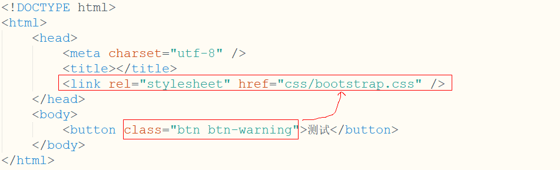 |

###### 5.6.2 Bootstrap全局CSS样式

> 学习前端框架最好的笔记就是官方文档  （https://v3.bootcss.com/）

- 表格

  - `.table` 基础表格样式
  -  `.table-striped`条纹状表格
  - `.table-bordered`带边框表格
  - `.table-hover`鼠标悬停
  - `.table-condensed`紧缩型表格

  | 表格实例：                                |
  | ----------------------------------------- |
  | 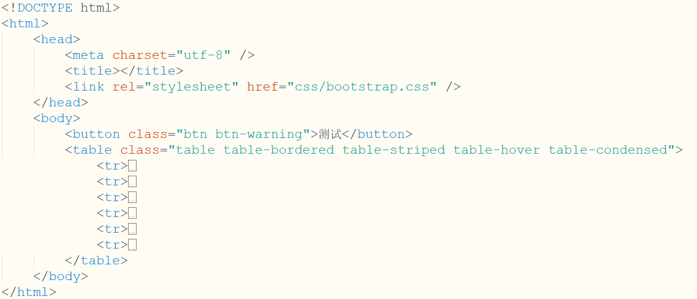 |

- 表单

  | 表单案例：登录界面                        |
  | ----------------------------------------- |
  | 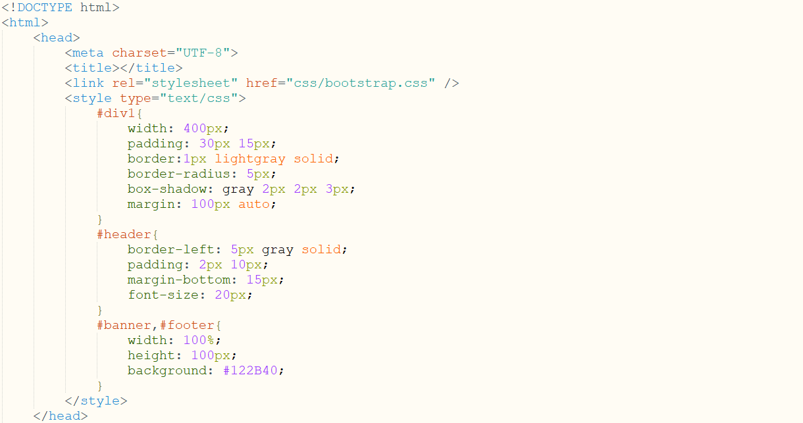 |
  | 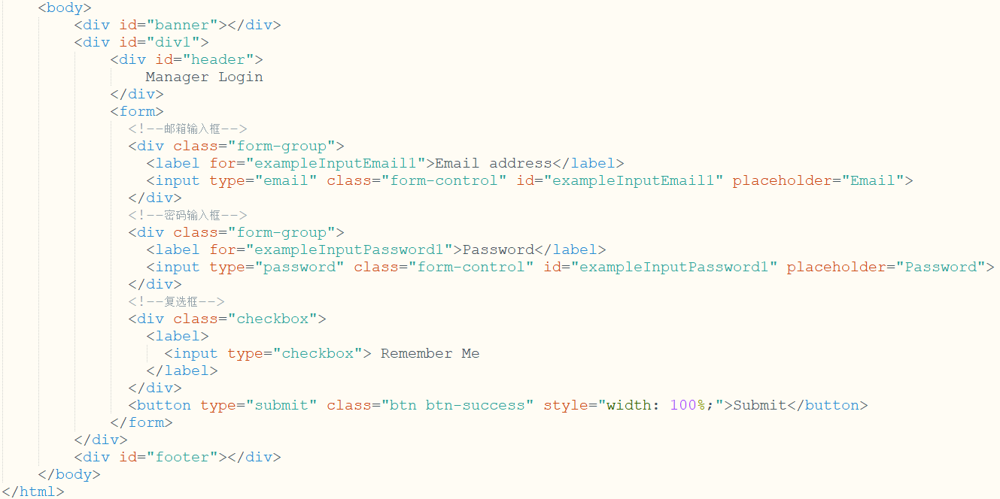 |

- 按钮

  - 7钟样式
  - 4个尺寸

- 图片

  ```html
  	
  	
  	
  ```

###### 5.6.3 Bootstrap组件

> 如果只使用bootstrap的全局样式，只用引入bootstrap.css即可；但是如果要使用组件、JS插件则需要同时引入bootstrap.js、jquery.js以及字体文件。结构如下：
>
> 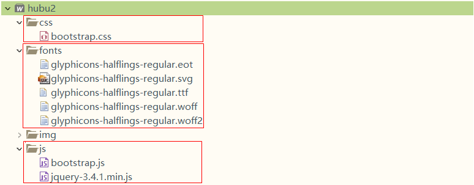
>
> 在html文件中同时引入bootstrap.css,jquery.js以及bootstrap.css，而且jquery.js要放在bootstrap.js之前
>
> 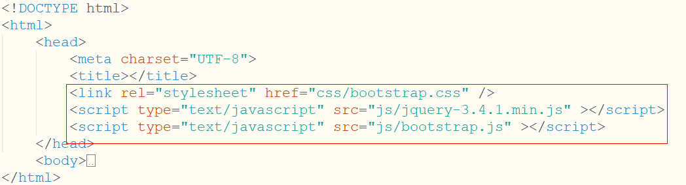

- 字体图标（需要将bootstrap解压之后的fonts文件夹一并放入web项目）

  ```html
  <span class="glyphicon glyphicon-user" aria-hidden="true" style="font-size: 100px;"></span>
  ```

- 按钮式下拉菜单

  > - 鼠标点击按钮的时候出现下拉菜单，也就是说要对点击事件进行响应——JavaScript，需要将bootstrap解压之后的js文件夹中的bootstrap.js文件引入到web项目，同时在HTML网页中也引用这个js文件
  >
  > - bootstrap.js文件需要依赖于jQuery，因此我们需要将jquery.js文件也添加到项目，引用到此HTML页面

###### 5.6.4 Bootstrap的JS插件

| 轮播图案例                                |
| ----------------------------------------- |
| 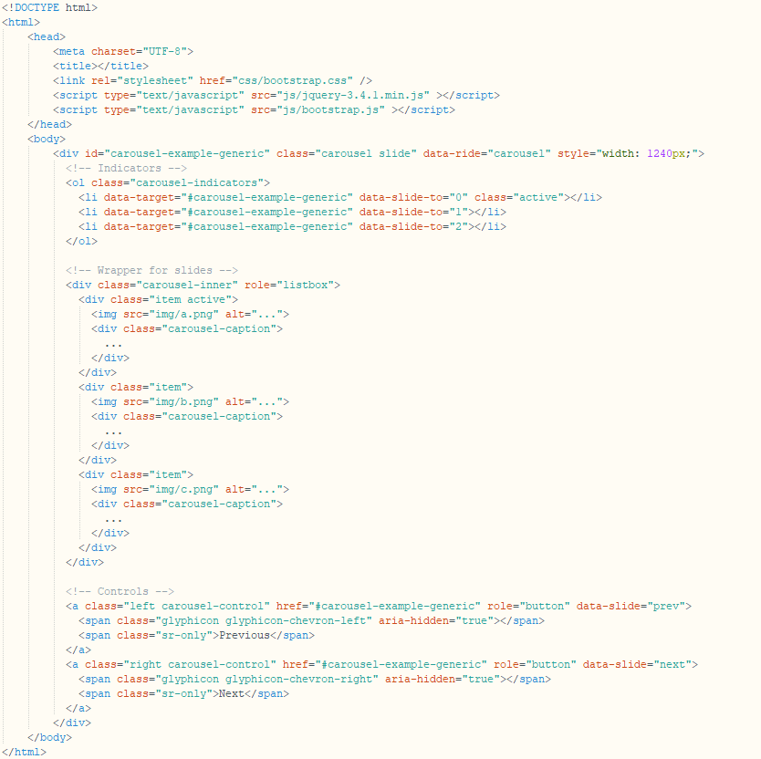 |

#### 5.7 CSS框架——LayUI

###### 5.7.1 Layui基本使用

- 下载：https://www.layui.com/

- 将解压之后的目录中layui文件夹直接拷贝粘贴到web项目

  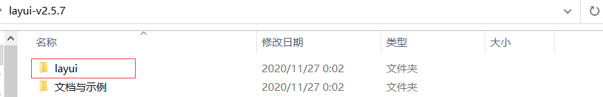

- 在HTML网页中引入 `layui/css/layui.css`文件和`layui/layui.all.js`文件

  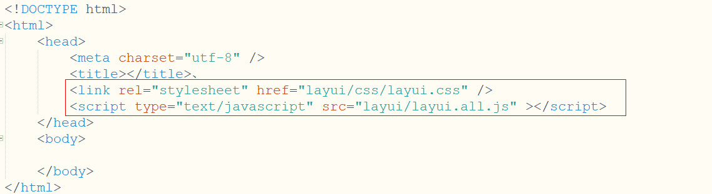

###### 5.7.2 页面元素（样式）

###### 5.7.3 内置模块（组件）

###### 5.7.4 示例

> Layui提供了多种网页设计的示例，可供我们直接使用

## 六、web服务器

> 当我们完成了网页的设计之后，如何能够让我们的网页能够被互联网用户访问呢？
>
> 我们需要借助于web服务器软件来提供web项目的网络访问；

#### 6.1 web服务器介绍

>web服务器软件：用来管理web项目、能够接收HTTP协议请求的软件

| Tomcat访问过程                            |
| ----------------------------------------- |
| 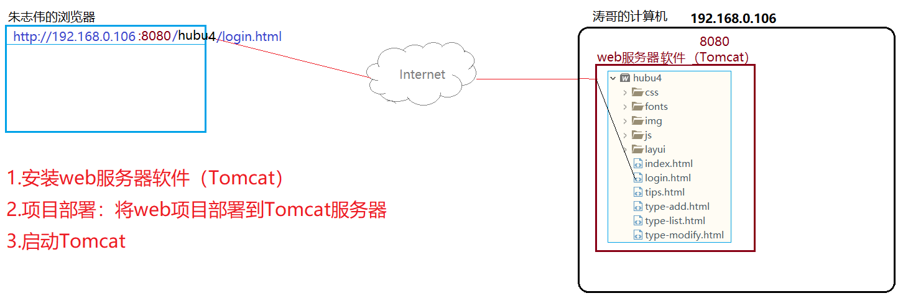 |

#### 6.2 安装Tomcat

###### 6.2.1 下载安装JDK

- Tomcat需要依赖JDK

###### 6.2.2 下载安装Tomcat

- 下载：http://tomcat.apache.org (群文件下载)

- 安装：注意如果没有默认加载jre路径，需要手动选择

  | tomcat安装选择JRE                         |
  | ----------------------------------------- |
  | 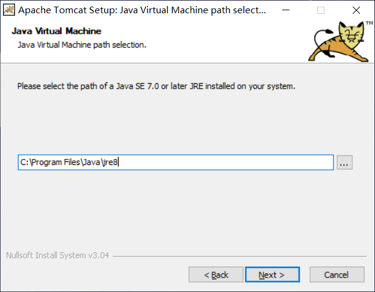 |

- 安装之后，默认在`C:\Program Files\Apache Software Foundation\Tomcat 8.5`

  | Tomcat目录结构                            |
  | ----------------------------------------- |
  | 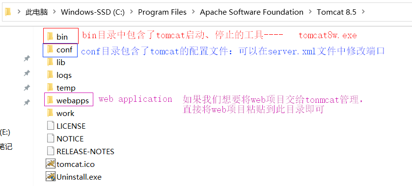 |

#### 6.3 web项目部署

> web项目部署：就是将web项目拷贝粘贴到Tomcat的webapps目录

| web项目部署                               |
| ----------------------------------------- |
| 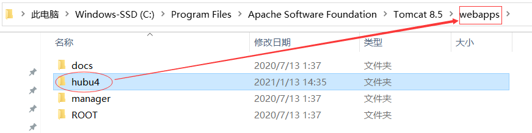 |

#### 6.4 启动Tomcat

| 启动服务器                                |
| ----------------------------------------- |
| 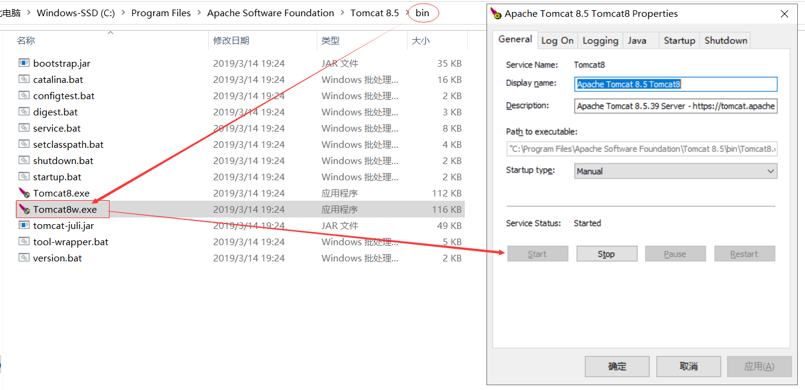 |

#### 6.5 在浏览器中访问Tomcat中的项目

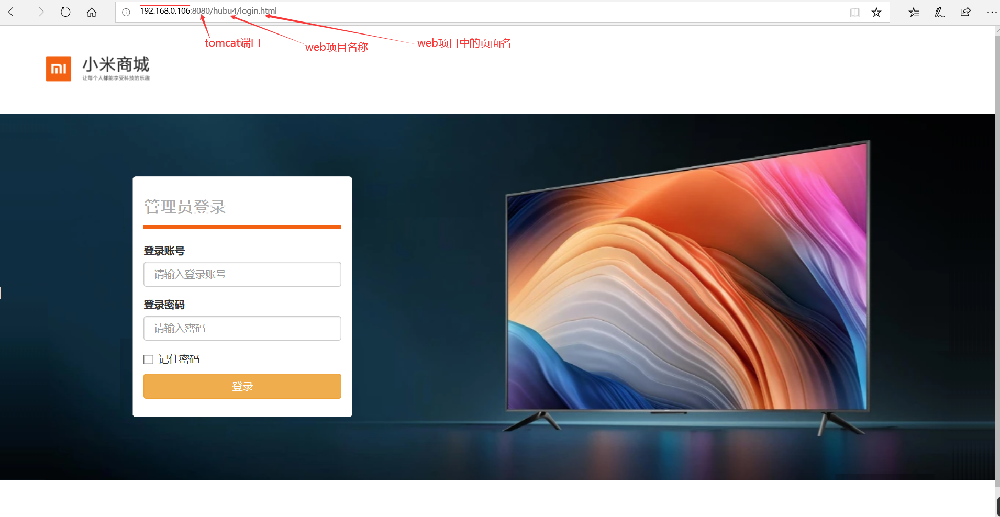

#### 6.6 云主机

> 由于我们使用的网络都是非商用IP，因此如果我们把项目部署在本地（自己的计算机），只能同一个局域网内可访问，如何实现互联网访问呢？
>
> - 购买商用IP
> - 使用内网穿透（需要本地计算机服务器同时启动）
> - 使用云主机

| 项目上云                                  |
| ----------------------------------------- |
| 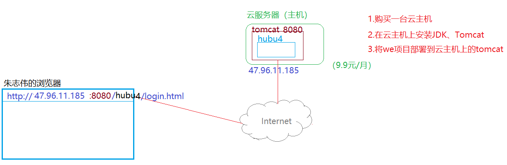 |


