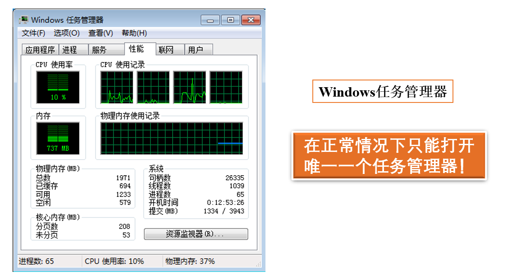
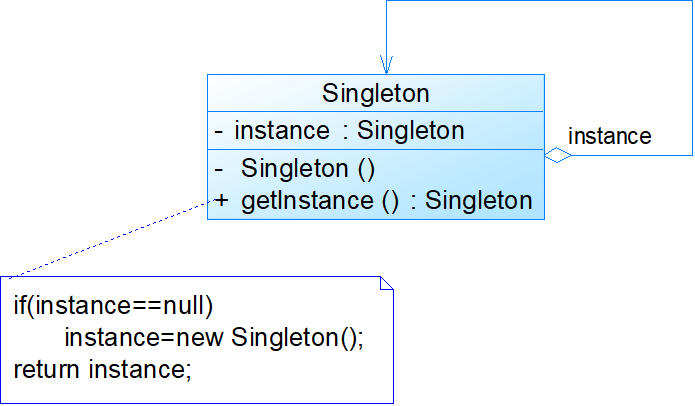
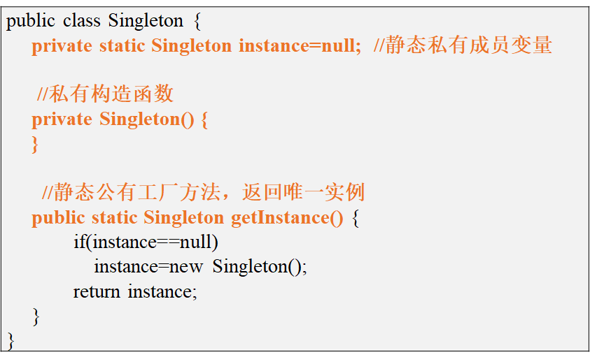
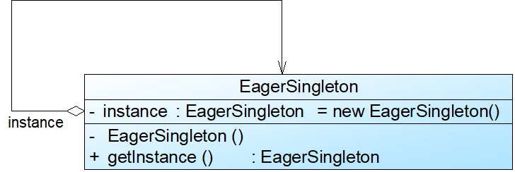
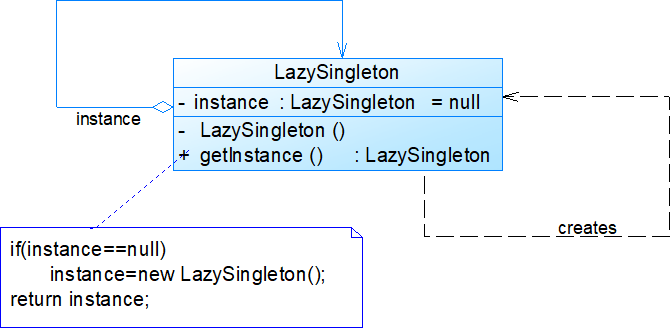
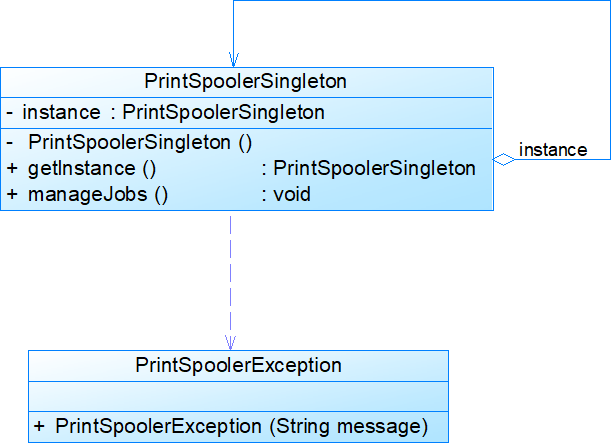
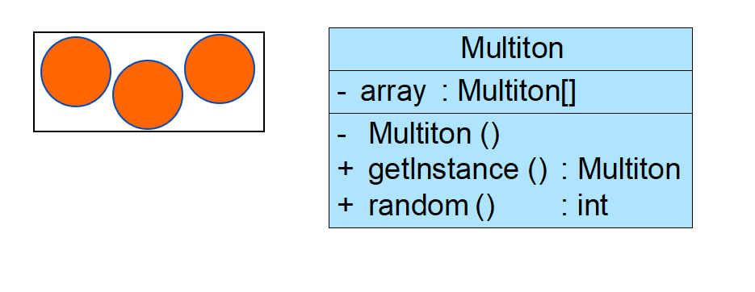

# 单例模式


<!--more-->

## 模式动机



- 如何确保一个类只有一个实例并且这个实例易于被访问？
- 让类自身负责创建和保存它的唯一实例，并保证不能创建其他实例，并且提供一个访问该实例的方法

## 模式定义

- 单例模式(Singleton Pattern)：确保某一个类只有一个实例，而且自行实例化并向整个系统提供这个实例，这个类称为单例类，它提供全局访问的方法。

- 单例模式的要点有三个：

1. 某个类只能有一个实例
2. 必须自行创建这个实例
3. 必须自行向整个系统提供这个实例

- 单例模式是一种对象创建型模式

## 模式结构



## 模式分析

单例模式的实现

- 私有构造函数
- 静态私有成员变量（自身类型）
- 静态公有的工厂方法



### 饿汉式单例类(Eager Singleton)



代码实现：

```java
public class EagerSingleton {
	private static final EagerSingleton instance = new EagerSingleton();
    private EagerSingleton(){
        
    }
	public static EagerSingleton getInstance() {
        return instance;
    }
}
```

### 懒汉式单例类



延时加载：

```java
public class LazySingleton {
	private static LazySingletom instance = null;
	private IazySingleton( i}
	public static LazySingleton getInstanceO {
		if (instance == null){
			instance = new LazMSingleton();
        }
		return instance;
    }
}
```

多个线程同时访问将导致创建多个单例对象!怎么办?	instance = new LazMSingleton();	需要较长时间

synchronized锁方法：

```java
public class LazySingleton {
	private static LazySingletom instance = null;
	private IazySingleton( i}
	synchronized public static LazySingleton getInstanceO {
		if (instance == null){
			instance = new LazMSingleton();
        }
		return instance;
    }
}
```

synchronized锁代码段

```java
if (instance == null){
	synchronized(LazMSingleton.class){
        instance = new LazMSingleton();
    }
}
return instance;
```

### Double-Check Locking双重检查锁定

```java
public class LazySingleton {
	private volatile static LazySingletom instance = null;
	private IazySingleton( i}
	public static LazySingleton getInstanceO {
		//第一重判断
		if (instance == null){
			//锁定代码块
			synchronized(LazMSingleton.class){
                //第二重判断
        		if(instance == null){
        			instance = new LazMSingleton();
        		}
    		}
        }
		return instance;
    }
}
```

## 饿汉式单例类与懒汉式单例类的比较

- 饿汉式单例类：无须考虑多个线程同时访问的问题；调用速度和反应时间优于懒汉式单例；资源利用效率不及懒汉式单例；系统加载时间可能会比较长
- 懒汉式单例类：实现了延迟加载；必须处理好多个线程同时访问的问题；需通过双重检查锁定等机制进行控制，将导致系统性能受到一定影响

```java
//Initialization on Demand Holder
public class Singleton {
    private Singleton() {
    }

    //静态内部类
    private static class HolderClass {
        private final static Singleton instance = new Singleton();
    }

    public static Singleton getInstance() {
        return HolderClass.instance;
    }

    public static void main(String args[]) {
        Singleton s1, s2;
        s1 = Singleton.getInstance();
        s2 = Singleton.getInstance();
        System.out.println(s1 == s2);
    }
}
```

控制台输出true

## 模式实例

在操作系统中，打印池(Print Spooler)是一个用于管理打印任务的应用程序，通过打印池用户可以删除、中止或者改变打印任务的优先级，在一个系统中只允许运行一个打印池对象，如果重复创建打印池则抛出异常。现使用单例模式来模拟实现打印池的设计。



自定义异常类

```java
public class PrintSpoolerException extends Exception {
    public PrintSpoolerException(String message){
        super(message);
    }
}
```

单例类

```java
public class PrintSpoolerSingleton {
    private static PrintSpoolerSingleton instance=null;
    private PrintSpoolerSingleton(){}
    public static PrintSpoolerSingleton getInstance() throws PrintSpoolerException {
        if(instance==null){
            System.out.println("创建打印池");
            instance=new PrintSpoolerSingleton();
        }
        else{
            throw new PrintSpoolerException("打印池正在工作中");
        }
        return instance;
    }
    public void manageJobs(){
        System.out.println("管理打印任务");
    }
}
```

客户端类：

```java
public class Client {
    public static void main(String args[]){
        PrintSpoolerSingleton ps1,ps2;
        try{
            ps1=PrintSpoolerSingleton.getInstance();
            ps1.manageJobs();
        }catch (PrintSpoolerException e){
            System.out.println(e.getMessage());
        }
        System.out.println("----------------");
        try{
            ps2=PrintSpoolerSingleton.getInstance();
            ps2.manageJobs();
        }catch (PrintSpoolerException e){
            System.out.println(e.getMessage());
        }
    }
}
```

结果：

```shell
创建打印池
管理打印任务
----------------
打印池正在工作中

Process finished with exit code 0
```

## 优点

- 提供了对唯一实例的受控访问
- 可以节约系统资源，提高系统的性能
- 允许可变数目的实例（多例类）



## 缺点

- 扩展困难（缺少抽象层）
- 单例类的职责过重
- 由于自动垃圾回收机制，可能会导致共享的单例对象的状态丢失

## 应用场景

- 系统只需要一个实例对象，或者因为资源消耗太大而只允许创建一个对象
- 客户调用类的单个实例只允许使用一个公共访问点，除了该公共访问点，不能通过其他途径访问该实例

