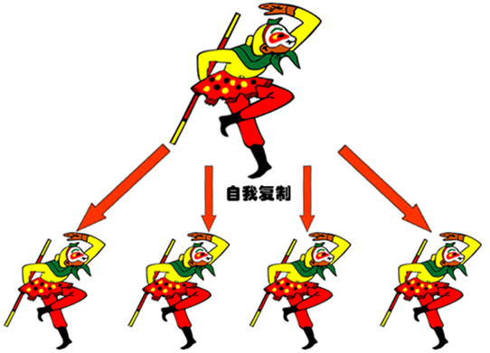
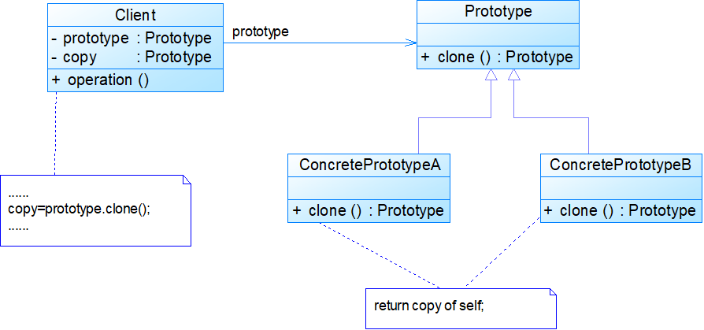
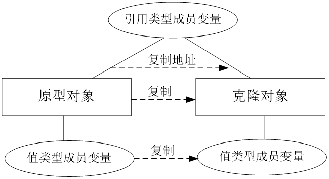
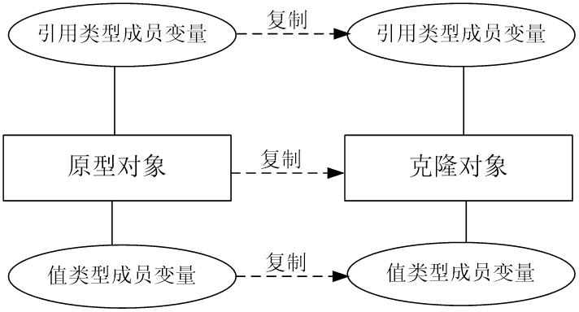
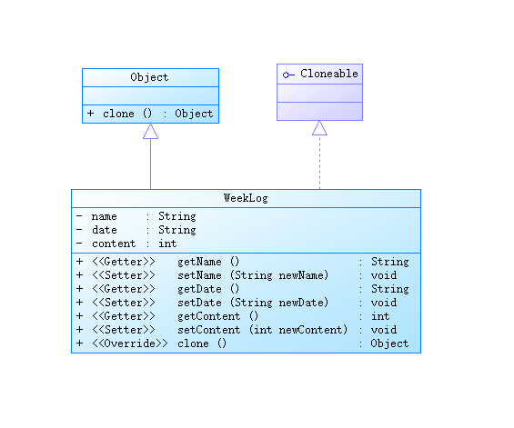
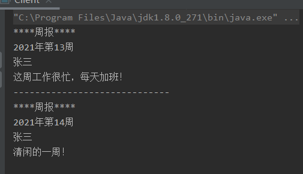

# 原型模式


<!--more-->

## 模式动机



- 复制一个对象，从而克隆出多个与原型对象一模一样的对象——**原型模式**
- 有些对象的创建过程较为复杂，而且需要频繁创建
- 通过给出一个原型对象来指明所要创建的对象的类型，然后用复制这个原型对象的办法创建出更多同类型的对象

## 模式定义

- 原型模式(Prototype Pattern)：原型模式是一种对象创建型模式，用原型实例指定创建对象的种类，并且通过复制这些原型创建新的对象。
- 原型模式允许通过一个原型对象创建一个或多个同类型的其他对象，而无须知道任何创建的细节



## 模式分析


- 所有的Java类都继承自java.lang.Object，而Object类提供一个clone()方法，可以将一个Java对象复制一份
- 在Java中可以直接使用Object提供的clone()方法来实现对象的克隆（浅克隆）
- 能够实现克隆的Java类必须实现一个标识接口Cloneable，表示这个Java类支持复制
- 如果一个类没有实现这个接口但是调用了clone()方法，Java编译器将抛出一个CloneNotSupportedException异常

浅克隆(Shallow Clone)：当原型对象被复制时，只复制它本身和其中包含的值类型的成员变量，而引用类型的成员变量并没有复制



深克隆(Deep Clone)：除了对象本身被复制外，对象所包含的所有成员变量也将被复制



## 优点

- 简化对象的创建过程，通过复制一个已有实例可以提高新实例的创建效率
- 扩展性较好
- 简化创建结构，原型模式中产品的复制是通过封装在原型类中的克隆方法实现的，无须专门的工厂类来创建产品
- 可以使用深克隆的方式保存对象的状态，以便在需要的时候使用，可辅助实现撤销操作

## 缺点

- 需要为每一个类配备一个克隆方法，而且该克隆方法位于一个类的内部，当对已有的类进行改造时，需要修改源代码，违背了开闭原则
- 在实现深克隆时需要编写较为复杂的代码，而且当对象之间存在多重的嵌套引用时，为了实现深克隆，每一层对象对应的类都必须支持深克隆，实现起来可能会比较麻烦

## 应用场景

- 创建新对象成本较大，新对象可以通过复制已有对象来获得，如果是相似对象，则可以对其成员变量稍作修改
- 系统要保存对象的状态，而对象的状态变化很小
- 需要避免使用分层次的工厂类来创建分层次的对象

## 应用实例

1.在某OA系统中，用户可以创建工作周报，由于某些岗位每周工作存在重复性，因此可以通过复制原有工作周报并进行局部修改来快速新建工作周报。现使用原型模式来实现该功能，绘制类图并编程实现。周报内容包括姓名、日期、内容。



代码：

```java
//工作周报：具体原型类
class WeekLog implements Cloneable{
    private String name;
    private String date;
    private String content;

    /*
    Getter and Setter
     */
    public String getName() {
        return name;
    }

    public void setName(String name) {
        this.name = name;
    }

    public String getDate() {
        return date;
    }

    public void setDate(String date) {
        this.date = date;
    }

    public String getContent() {
        return content;
    }

    public void setContent(String content) {
        this.content = content;
    }

    //克隆方法clone,此处使用Java语言提供的浅克隆机制
    public Object clone(){
        Object obj = null;
        try {
            obj = super.clone();
            return obj;
        }catch (CloneNotSupportedException e){
            System.out.println("不能复制");
            return null;
        }
    }
}


```

client:

```java
class Client{
    public static void main(String[] args) {
        WeekLog log_previous = new WeekLog();
        log_previous.setName("张三");
        log_previous.setDate("2021年第13周");
        log_previous.setContent("这周工作很忙，每天加班！");

        System.out.println("****周报****");
        System.out.println(log_previous.getDate());
        System.out.println(log_previous.getName());
        System.out.println(log_previous.getContent());
        System.out.println("-----------------------------");

        WeekLog log_now;
        log_now = (WeekLog) log_previous.clone();
        log_now.setDate("2021年第14周");
        log_now.setContent("清闲的一周！");
        System.out.println("****周报****");
        System.out.println(log_now.getDate());
        System.out.println(log_now.getName());
        System.out.println(log_now.getContent());
    }
}


```

结果：


