# 多租户系统概念简介


<!--more-->

什么是多租户？举个例子：马云、马化腾和刘强东三个人去租房子，他们因为家里经济困难所以勤工俭学，三个人决定合租一套三室一厅的房子，虽然每个人有自己的房间，但是家里的水电、厨房、卫生间和热水器都是大家一起公用的。隐私性肯定是没有单独自己租房子来的高。

## 写作目的

本文写作的目的是探索XaaS（IaaS、PaaS和SaaS）三种模式的概念及区别？多租户是什么？多租户可以用来干什么？有哪些租户隔离方案？这些方案的适用场景有哪些，它们各有什么优缺点？带着这些疑问，我们最后看下如何具体实现一个多租户系统。

## XaaS（一切即服务）

在讲解多租户之前，我们先来了解一下云计算的三种主要模式：IaaS、PaaS和SaaS。

- IaaS(Infrastructure as a Service)，基础设施即服务。提供基于云的虚拟化计算和存储服务。
- PaaS(Platform as a Service)，平台即服务。除了提供基础设施以外，PaaS还提供了基于云的操作系统、数据库和开发工具。
- SaaS(Software as a Service)，软件即服务。在PaaS的基础之上，SaaS可以为任何能够联网的设备提供软件服务。

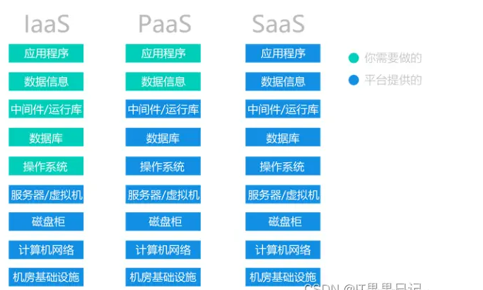

### IaaS（基础架构即服务）

IaaS通过即用即付的方式为用户提供网络、存储和计算等基础设施资源。用户只需要购买和配置应用程序及系统所需的资源，然后自己负责部署、维护和开发应用程序。可以把IaaS简单理解为基于云的虚拟化硬件服务提供商，购买了IaaS的服务你就拥有了能随时随地联网的服务器。

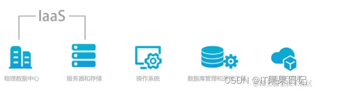

### PaaS（平台即服务）

当用户购买了“硬件资源”之后，当然是想要在自己的硬件设备上安装操作系统、中间件和开发工具。PaaS可以为用户提供安装操作系统、中间件和开发工具的一站式运维服务，用户需要考虑的只是编写代码和测试应用程序。用户开发完应用程序以后，PaaS会负责应用程序后续的生命周期如构建、部署、托管以及更新。

在控制成本方面，PaaS也是非常灵活的。用户可以根据应用的客户体量和使用效期来决定购买合适的资源。

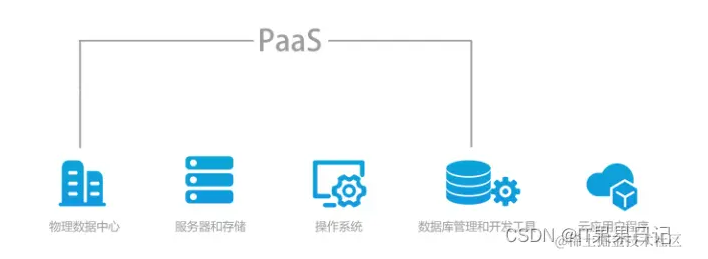

### SaaS（软件即服务）

SaaS近几年一直是产品的风口行业。但是早在上世纪90年代，软件就作为一种服务来销售，用户按月缴纳费用，当时将这种模式称作按需服务（on-demand），它是SaaS模式的雏形。

SaaS最早的实践者一般认为是Salesforce的CEO兼创始人马克·贝尼奥夫(Marc Benioff)。他认为“一定有一种方式，让购买软件更加方便和便宜”。用户只需要订阅和付费，不需要经历漫长的开发、安装和维护周期。并且在现在这个高度信息化的时代，多端访问和数据同步已经是很多用户的刚需，用户希望无论何时何地都可以通过浏览器或者手机访问自己的应用。

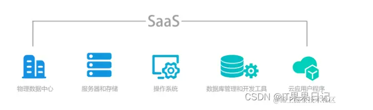

关于SaaS的演进过程，这里打个比方。30年前，家家户户炒菜洗澡的气都装在煤气罐里，煤气用完了就通知煤气工人来回收并换一罐煤气。这个煤气罐就可以理解为以前的私有化部署服务。这种模式需要定时维护更新。

20年前，家家户户住上了商品房，换煤气罐上下楼太不方便，人们使用天然气直接从天然气公司订购每月缴费，按需购买，天然气公司集中供气并管理各家天然气管道。这种模式不再是私有化服务，节约了用户的使用成本和天然气公司的管理成本。我们可以将这种模式称之为“供气即服务”。

10年前，移动互联网兴起，人们不再需要去天然气公司上门缴费。手机上动动手指头，然后带着天然气卡去物业圈存即可。这就使得“供气即服务”的信息化得到进一步加强。

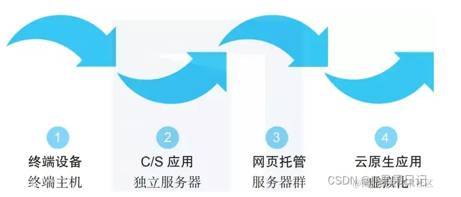

SaaS模式可以简单理解为用户授权，将IT设备、软件和运维统统外包给SaaS服务提供商。用户以租户的形式使用SaaS厂商提供的服务。

SaaS厂商一般不会自己去做IaaS，但SaaS和PaaS之间的定义还存在争论。PaaS除了提供操作系统开发工具以外，还可以向SaaS提供公共工具，如组织架构、权限管理和计费等。对于初创期的中小企业不具备这样的技术能力。大多数SaaS厂商的侧重点应在于应用的业务实现，而不是平台的技术能力。

#### 小结

|          | IaaS                                        | PaaS                                           | SaaS                                                     |
| -------- | ------------------------------------------- | ---------------------------------------------- | -------------------------------------------------------- |
| 名称含义 | 基础架构即服务(Infrastructure as a Service) | 平台即服务(Platform as a Service)              | 软件即服务(Software as a Service)                        |
| 平台提供 | 虚拟化的硬件计算、存储                      | 虚拟化的硬件计算、存储操作系统、管理和开发工具 | 虚拟化的硬件计算、存储操作系统、管理和开发工具云应用程序 |
| 用户实现 | 操作系统、管理和开发工具云应用程序          | 云应用程序                                     | /                                                        |
| 用户群体 | * IT运营商                                  |                                                |                                                          |

- DevOps团队
- 系统和数据库管理员
- 全栈开发人员 | * 有开发能力但考虑运维成本的企业
- 开发人员或程序员           | 没有开发能力的企业                             | | 优点   | * 可以灵活扩展资源
- 节省成本                       | * 技术门槛低
- 快速开发。可配置的框架和工具
- 管理简单。可伸缩的资源 | * 没有技术门槛
- 快速部署，管理简单
- 收费模式灵活，适用于中小企业 | | 缺点   | * 无法控制基础设施
- 技术门槛高
- 不可控的安全级别，可能存在安全漏洞  | * 灵活性降低。
- 依赖于厂商的可靠性和稳定性               | * 不可控的安全级别，可能存在安全漏洞
- 灵活性有限。无法定制需求    | | 适用场景 | 适合对计算资源要求灵活、可扩展的企业                      | 适合快速部署，专注于开发的企业                        | 适合无技术，需要控制成本按需购买，定制功能要求不多的中小企业        | | 具体案例 | AWS、阿里云、华为云等                            | 京东云擎JAE、百度BAE、新浪SAE                    | 企业微信、钉钉                               |

前面花了大段篇幅讲解了关于XaaS特别是SaaS模式的概念及演进过程，目的是想告诉大家SaaS的概念是在什么样的历史背景下演变而来的。下面我们从SaaS单租户和多租户两种架构开始讲解。

## 单租户

在单租户的架构里，每个租户都有自己的一套服务器、基础设施和数据库，租户之间从硬件到软件都是完全隔离的。租户可以根据自己的需要做一些定制化的需求。

举个栗子，马云、马化腾和刘强东三个人去租房子，他们各自租了一间房，房间的水电、厨房、热水器等等都是各自一套，相互之间没有共用。

在外租过房子的童鞋都知道，自己单租房间的缺点是成本更高，优点则是只用考虑个人的租房需求来找房子，一个人住隐私安全性也更高。

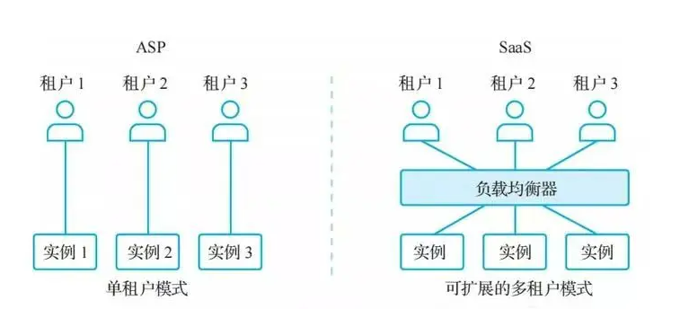

## 多租户

在多租户的架构里，多个租户共享相同的服务器、基础设施，数据库可以是共享的也可以是隔离的，由于多租户必定在用户规模上比单租户来的大，所以多租户一般会有多个实例，共用一套实例代码。租户之间的数据隔离往往采用逻辑隔离的方式，即在代码和数据库层面隔离，所以安全性远没有单租户来的高。

还是举上面的栗子，马云、马化腾和刘强东三个人去租房子，他们因为家里经济困难所以勤工俭学，三个人决定合租一套三室一厅的房子，虽然每个人有自己的房间，但是家里的水电、厨房、卫生间和热水器都是大家一起公用的。隐私性肯定是没有单独自己租房子来的高。

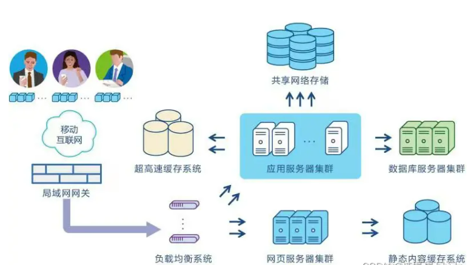

总结一下单租户和多租户的差异，有如下几点：

- 安全性和成本不同。单租户拥有独立的软硬件环境，数据库只存储单租户的数据；多租户则共享资源。
- 备份和还原的复杂度不同。单租户数据备份和还原简单；多租户因为公用一个数据库甚至公用一个表，所以备份和还原时都有可能影响到其他的租户。
- 定制灵活度不同。单租户适合为每个租户量身定制不同的功能，扩展灵活的高；多租户为了节约成本，也考虑到开发难度，更多的以通用配置为主，尽可能将各租户的功能抽象出来共享使用。
- 系统升级策略不同。单租户需要对每个租户单独升级，升级时间依各租户自己的需求而定；多租户只需要升级一次，但是为了不影响租户的使用，一般会在深夜升级系统。

所以单租户适合用在对安全管控、法律合规要求更高的中大型企业，且这些企业的需求相对更加复杂，所以更适合定制化开发；而多租户更适合对安全没有太高要求，但是希望控制成本，应用的需求相对通用简单的中小微企业。

由于多租户的架构成本更少，开发和运维的复杂度更低，所以多租户更适合企业向外复制自己的产品，也是目前比较主流的SaaS架构。但是这并不代表单租户模式没有用武之地，医院、警务、政法委、银行等对安全隐私要求更高的环境，单租户是必然的选择。

本文后面主要是以介绍多租户的实现为主。而多租户意味着要在云端集中式管理多个用户，这里的用户主要指的是面向企业或者政府，当然也有面向个人的场景。所以，要做到在同一套程序下，满足多个不同用户群体的使用，最关键的就是保证用户间数据的隔离性。

### 隔离方案

多租户在数据隔离存储方案上，一般有三种实施方案：

- 独立数据库
- 共享数据库、独立Schema
- 共享数据库、共享Schema、共享表

#### 独立数据库

每个租户使用独立的数据库，这种方案类似于传统的部署，其区别在于多租户的实现是将每个租户的数据库都统一管理起来。这种一租户一数据库的方案优缺点都很明显：

**优点**

- 数据隔离性好，安全级别高；
- 数据库表不需要额外的字段来区分租户；
- 需求扩展独立性好，不影响其他租户的使用；
- 出现故障时，恢复数据简单。

**缺点**

- 增加了数据库的安装数量和安装成本；
- 支持租户的数量有限；
- 跨租户统计数据较困难；
- 新增租户需要重启服务。

**应用场景**

适用于定价高，安全级别要求高的租户。例如，银行、医院等对数据隔离性有严格要求的租户。这些租户的特点是租户较少，数据规模大，数据隔离性强。

#### 共享数据库、独立Schema

每个租户共享同一个数据库，但使用的是不同的Schema。像Oracle和PgSql都支持一个数据库下多个Schema。

**优点**

- 数据隔离性较好。为每个租户提供了一定程度上的逻辑隔离；
- 相较于独立数据库方案，可以支持的租户数量更多；
- 安装成本相对较低。

**缺点**

- 跨租户统计数据较困难；
- 各个租户的数据库sql需要带上Schema名称。

**应用场景**

适用于数据规模中等，租户数量中等的项目。

#### 共享数据库、共享Schema、共享表

每个租户共享同一个数据库，同一个Schema，甚至是同一张表。每个表里都有一个tenant_id字段用来区分表里的记录是来自于哪一个租户。这种多租户方案是三个方案里隔离级别最低但是共享程度最高的一个。

**优点**

- 安装成本最低；
- 支持的租户数量最多；
- 添加租户不需要重启服务；
- 跨租户统计较容易。

**缺点**

- 安全性最差，隔离级别最低；
- 维护成本最高。其成本体现在表设计需要额外字段，sql代码需要额外查询条件，故障后数据恢复需要额外操作；
- 每个租户的数据量规模不宜较大。

**应用场景**

适用于低成本，租户数量多，租户数据量小，对安全性和隔离级别要求低的产品。例如一些To C的产品。

#### 小结

了解了不同的多租户隔离方案以后，我们大致的明白了想要实现多租户，就应该在数据的安全性、成本、开发量以及租户的规模等因素入手，找出它们的平衡点。实际的产品功能更多，产品架构设计要考虑的因素更多，可能还会出现多种设计方案的结合使用。

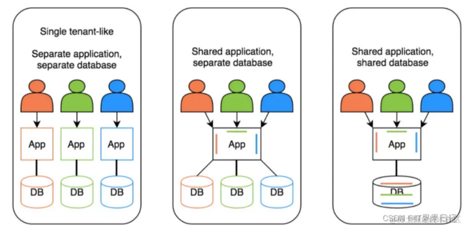

- **成本**。
  - 隔离性越高，成本越高；
  - 共享性越高，成本越低；
- **安全**。
  - 隔离性越高，安全级别越高；
  - 共享性越高，安全性越低；
- **数据规模**。在不考虑成本和安全因素的情况下：
  - 租户数量越多，越倾向于共享；
  - 单个租户的数据量越多，越倾向于隔离；
  - 单个租户同时在线人数越多，越倾向于隔离；
  - 对数据备份和恢复的要求越多，越倾向于隔离；
- **技术要求**。
  - 隔离性越高，技术要求越低；
  - 共享性越高，技术要求越高；

| 对比维度             | 独立数据库 | 共享数据库、独立schema | 共享数据库、共享数据架构 |
| -------------------- | ---------- | ---------------------- | ------------------------ |
| 开发成本             | 低         | 一般                   | 高                       |
| 运维成本             | 高         | 一般                   | 低                       |
| 隔离性/安全性        | 高         | 一般                   | 低                       |
| 租户间交互能力       | 低         | 一般                   | 高                       |
| 定制化空间           | 高         | 一般                   | 低                       |
| 可支持的最大租户数量 | 低         | 一般                   | 高                       |

### 实践

前面讲了这么长的理论知识，下面我们实现一个共享表的多租户小示例。后面如果有时间我也会写一个通过ShardingJdbc实现的示例，大家可以先关注我，文章发布出来可以第一时间学习。

#### Mybatis-Plus实现

首先要导入maven依赖。

```XML
XML复制代码<dependency>
    <groupId>com.baomidou</groupId>
    <artifactId>mybatis-plus-boot-starter</artifactId>
    <version>3.4.1</version>
</dependency>
```

配置 mybatis 拦截器，并设置租户拦截器 MyTenantLineHandler

```java
java复制代码@Configuration
public class MyBatisConfig {
  @Bean
  public MybatisPlusInterceptor mybatisPlusInterceptor() {
    MybatisPlusInterceptor interceptor = new MybatisPlusInterceptor();
    interceptor.addInnerInterceptor(new TenantLineInnerInterceptor(new MyTenantLineHandler()));
    return interceptor;
  }
}
```

租户拦截器 MyTenantLineHandler 代码。实现 mybatis 自带的租户 Handler，实现 getTenantId() 方法，mybatis 执行sql 时会通过此方法将得到的租户id条件插入到sql里。

```java
java复制代码public class MyTenantLineHandler implements TenantLineHandler {
    @Override
    public Expression getTenantId() {
        return new StringValue(TenantContext.getCurrentTenant());
    }

    @Override
    public String getTenantIdColumn() {
        //这里对应的是数据库的列名
        return "tenant_id";
    }

    @Override
    public boolean ignoreTable(String tableName) {
        //如果那些表不需要做租户隔离的，在这里配置
        return false;
    }
}
```

租户上下文代码。租户上下文会保存当前请求线程里从请求头获取的租户id。

```java
java复制代码public class TenantContext {
    private static String tenantId = null;

    private static final ThreadLocal<String> currentTenant = new InheritableThreadLocal<>();

    public static String getCurrentTenant() {
        return currentTenant.get();
    }

    public static void setCurrentTenant(String tenantId) {
        currentTenant.set(tenantId);
    }

    public static void clear() {
        currentTenant.remove();
    }
}
```

配置过滤器，过滤器负责将请求头传过来的租户id放入租户上下文。

```java
java复制代码@Order(1)
public class TenantFilter implements Filter {
    @Override
    public void doFilter(ServletRequest servletRequest, ServletResponse servletResponse, FilterChain filterChain) throws IOException, ServletException {
        TenantContext.setCurrentTenant(getHeaderOrParam(servletRequest));
        filterChain.doFilter(servletRequest, servletResponse);
    }

    private String getHeaderOrParam(ServletRequest request) {
        HttpServletRequest httpRequest = (HttpServletRequest) request;
        return httpRequest.getHeader("tenant_id");
    }
}
```

添加过滤器规则

```java
java复制代码@Configuration
public class FilterConfig {
    @Bean
    public FilterRegistrationBean registrationBean() {
        FilterRegistrationBean reg = new FilterRegistrationBean(new TenantFilter());
        reg.addUrlPatterns("/tenant/*");
        return reg;
    }
}
```

创建两张表，并插入数据。每张表都需要带有租户id字段，这里我们取名是 tenant_id，和 MyTenantLineHandler 的 getTenantIdColumn() 方法设置的一样。

```sql
sql复制代码-- 公司表
CREATE TABLE `company` (
  `id` int(20) NOT NULL AUTO_INCREMENT COMMENT '主键ID',
  `tenant_id` varchar(60) NOT NULL COMMENT '租户ID',
  `company_name` varchar(30) DEFAULT NULL COMMENT '公司',
  PRIMARY KEY (`id`)
) ENGINE=InnoDB AUTO_INCREMENT=1 DEFAULT CHARSET=utf8mb4;

INSERT INTO `tenant`.`company`(`id`, `tenant_id`, `company_name`) VALUES (1, '00001', '腾讯');
INSERT INTO `tenant`.`company`(`id`, `tenant_id`, `company_name`) VALUES (2, '00002', '阿里');

-- 员工表
CREATE TABLE `staff` (
  `id` int(20) NOT NULL AUTO_INCREMENT COMMENT '主键ID',
  `tenant_id` varchar(60) NOT NULL COMMENT '租户ID',
  `staff_id` varchar(60) NOT NULL COMMENT '员工id',
  `staff_name` varchar(30) DEFAULT NULL COMMENT '员工名称',
  PRIMARY KEY (`id`)
) ENGINE=InnoDB AUTO_INCREMENT=1 DEFAULT CHARSET=utf8mb4;

INSERT INTO `tenant`.`staff`(`id`, `tenant_id`, `staff_id`, `staff_name`) VALUES (1, '00001', '1', '马化腾');
INSERT INTO `tenant`.`staff`(`id`, `tenant_id`, `staff_id`, `staff_name`) VALUES (2, '00001', '2', '张小龙');
INSERT INTO `tenant`.`staff`(`id`, `tenant_id`, `staff_id`, `staff_name`) VALUES (3, '00002', '1', '马云');
INSERT INTO `tenant`.`staff`(`id`, `tenant_id`, `staff_id`, `staff_name`) VALUES (4, '00002', '2', '蔡崇信');
```

公司表数据，如图所示

| id   | tenant_id | company_name |
| ---- | --------- | ------------ |
| 1    | 00001     | 腾讯         |
| 2    | 00002     | 阿里         |

员工表数据，如图所示

| id   | tenant_id | staff_id | staff_name |
| ---- | --------- | -------- | ---------- |
| 1    | 00001     | 1        | 马化腾     |
| 2    | 00001     | 2        | 张小龙     |
| 3    | 00002     | 1        | 马云       |
| 4    | 00002     | 2        | 蔡崇信     |

我们现在写一个Mapper用来查询员工信息。

```java
java复制代码public interface StaffMapper extends BaseMapper<Staff> {
    List<Staff> findStaff(@Param("staffName") String staffName);
}
```

sql如下。公司表通过租户id关联员工表。可以通过员工姓名查询。

```XML
XML复制代码<select id="findStaff" resultMap="BaseResultMap">
    select b.*, a.company_name
    from company a
    join staff b on a.tenant_id = b.tenant_id
    <where>
        <if test="staffName != null and staffName != ''">
            and b.staff_name = #{staffName}
        </if>
    </where>
</select>
```

现在我们可以发送请求，并带上请求头。

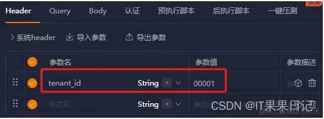

返回结果如下。可见已经按照我们预期的只查询出来了腾讯这家公司的员工信息，和我们在请求头里传递的租户id保持一致。

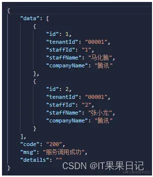

我们把sql日志打印出来看一下。和我们自己原始的sql比较一下发现，最终的sql不仅在 where 条件里加入了 “a.tenant_id = '00001'” 这个条件，还在关联表时on关键字后加了一个 “AND b.tenant_id = '00001' ” 条件。

```sql
sql复制代码SELECT
    b.*,
    a.company_name 
FROM
    company a
JOIN staff b ON a.tenant_id = b.tenant_id AND b.tenant_id = '00001' 
WHERE
    a.tenant_id = '00001'
```

##### 分页

分页查询是我们经常会用到的一个场景，由于之前初始的数据太少，不方便看到分页的效果，所以我们造多增加几个员工信息，sql如下。

```sql
sql复制代码INSERT INTO `tenant`.`staff`(`id`, `tenant_id`, `staff_id`, `staff_name`) VALUES (5, '00001', '5', '腾讯员工5');
INSERT INTO `tenant`.`staff`(`id`, `tenant_id`, `staff_id`, `staff_name`) VALUES (6, '00001', '6', '腾讯员工6');
INSERT INTO `tenant`.`staff`(`id`, `tenant_id`, `staff_id`, `staff_name`) VALUES (7, '00001', '7', '腾讯员工7');
INSERT INTO `tenant`.`staff`(`id`, `tenant_id`, `staff_id`, `staff_name`) VALUES (8, '00001', '8', '腾讯员工8');
INSERT INTO `tenant`.`staff`(`id`, `tenant_id`, `staff_id`, `staff_name`) VALUES (9, '00001', '9', '腾讯员工9');
INSERT INTO `tenant`.`staff`(`id`, `tenant_id`, `staff_id`, `staff_name`) VALUES (10, '00001', '10', '腾讯员工10');
```

现在腾讯公司发展壮大以后，员工数量加了好几倍，如图所示。

| id   | tenant_id | staff_id | staff_name |
| ---- | --------- | -------- | ---------- |
| 1    | 00001     | 1        | 马化腾     |
| 2    | 00001     | 2        | 张小龙     |
| 3    | 00002     | 1        | 马云       |
| 4    | 00002     | 2        | 蔡崇信     |
| 5    | 00001     | 5        | 腾讯员工5  |
| 6    |           |          |            |
| 7    |           |          |            |
| 8    |           |          |            |
| 9    |           |          |            |
| 10   |           |          | 腾讯员工10 |

pom文件里我们需要加上分页插件的依赖。

```XML
XML复制代码<dependency>
   <groupId>com.github.pagehelper</groupId>
   <artifactId>pagehelper-spring-boot-starter</artifactId>
   <version>1.2.13</version>
</dependency>
```

在 mybatis 拦截器配置里加上分页的拦截器。这里需要避开一个坑，拦截器的配置顺序必须是租户拦截器在前面，分页拦截器在后面。

```java
java复制代码@Configuration
public class MyBatisConfig {
    @Bean
    public MybatisPlusInterceptor mybatisPlusInterceptor() {
        MybatisPlusInterceptor interceptor = new MybatisPlusInterceptor();
        interceptor.addInnerInterceptor(new TenantLineInnerInterceptor(new MyTenantLineHandler()));
        interceptor.addInnerInterceptor(new PaginationInnerInterceptor());
        return interceptor;
    }
}
```

Service层的代码添加分页的逻辑。可以看到我们现在要查询第1页的数据，每页5条数据，根据 id 倒序。

```java
java复制代码@Service
public class StaffServiceImpl extends ServiceImpl<StaffMapper, Staff> implements StaffService {
    @Override
    public List<Staff> findStaff(String staffName) {
        try (Page<Staff> pg = PageHelper.startPage(1, 5, "id desc")) {
            List<Staff> list = getBaseMapper().findStaff(staffName);
            PageInfo<Staff> pageInfo = new PageInfo<>(list);
            return pageInfo.getList();
        }
    }
}
```

查询结果如下

```javascript
javascript复制代码{
    "data": [
        {
            "id": 10,
            "tenantId": "00001",
            "staffId": "10",
            "staffName": "腾讯员工10",
            "companyName": "腾讯"
        },
        {
            "id": 9,
            "tenantId": "00001",
            "staffId": "9",
            "staffName": "腾讯员工9",
            "companyName": "腾讯"
        },
        {
            "id": 8,
            "tenantId": "00001",
            "staffId": "8",
            "staffName": "腾讯员工8",
            "companyName": "腾讯"
        },
        {
            "id": 7,
            "tenantId": "00001",
            "staffId": "7",
            "staffName": "腾讯员工7",
            "companyName": "腾讯"
        },
        {
            "id": 6,
            "tenantId": "00001",
            "staffId": "6",
            "staffName": "腾讯员工6",
            "companyName": "腾讯"
        }
    ],
    "code": "200",
    "msg": "服务调用成功",
    "details": ""
}
```

打印sql看下，多了 “ORDER BY id DESC ” 和 “LIMIT 5”

```sql
sql复制代码SELECT
    b.*,
    a.company_name 
FROM
    company a
JOIN staff b ON a.tenant_id = b.tenant_id AND b.tenant_id = '00001' 
WHERE
    a.tenant_id = '00001' 
ORDER BY id DESC 
LIMIT 5
```

##### 插入

插入数据时，同样不需要在参数里传入租户id，Service代码如下。

```java
java复制代码@Override
public boolean saveStaff(Staff staff) {
    staff.setStaffId(IdUtil.simpleUUID());
    return save(staff);
}
```

postman传参如图。我们并没有在参数体里传租户id，而是和查询时一样将租户id放在了请求头。

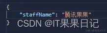

腾讯又增加了一名叫“腾讯果果”的员工。

| id   | tenant_id | staff_id | staff_name |
| ---- | --------- | -------- | ---------- |
| 1    | 00001     | 1        | 马化腾     |
| 2    | 00001     | 2        | 张小龙     |
| 3    | 00002     | 1        | 马云       |
| 4    | 00002     | 2        | 蔡崇信     |
| 5    | 00001     | 5        | 腾讯员工5  |
| 6    |           |          |            |
| 7    |           |          |            |
| 8    |           |          |            |
| 9    |           |          |            |
| 10   |           |          | 腾讯员工10 |
| 11   | 00001     | 11       | 腾讯果果   |

打印sql日志如下。

```sql
sql复制代码INSERT INTO staff ( staff_id, staff_name, tenant_id )
VALUES
    ( 'd743a712a0ca40e79632492aa86389ff', '腾讯果果', '00001' )
```

更新

Service层代码如下。

```java
java复制代码@Override
public boolean updateStaff(Staff staff) {
    return updateById(staff);
}
```

postman传参如图。我们把插入时新加入的腾讯员工“腾讯果果”改名成“腾讯大石榴”。

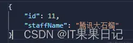

此时报了一个错误提示

> java.lang.NoSuchMethodError: net.sf.jsqlparser.statement.update.Update.getTable()Lnet/sf/jsqlparser/schema/Table;

如图所示。

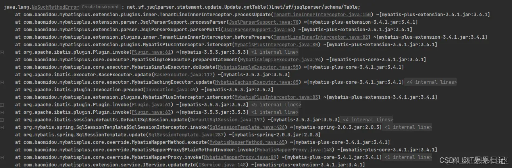

这是由于分页插件pagehelper-spring-boot-starter和mybatis-plus的包有冲突导致的，我们可以将分页插件的maven依赖添加一个排除。

```XML
XML复制代码<dependency>
   <groupId>com.github.pagehelper</groupId>
   <artifactId>pagehelper-spring-boot-starter</artifactId>
   <version>1.2.13</version>
   <exclusions>
      <exclusion>
         <artifactId>jsqlparser</artifactId>
         <groupId>com.github.jsqlparser</groupId>
      </exclusion>
   </exclusions>
</dependency>
```

再试一次更新接口，返回成功。

| id   | tenant_id | staff_id | staff_name |
| ---- | --------- | -------- | ---------- |
| 1    | 00001     | 1        | 马化腾     |
| 2    | 00001     | 2        | 张小龙     |
| 3    | 00002     | 1        | 马云       |
| 4    | 00002     | 2        | 蔡崇信     |
| 5    | 00001     | 5        | 腾讯员工5  |
| 6    |           |          |            |
| 7    |           |          |            |
| 8    |           |          |            |
| 9    |           |          |            |
| 10   |           |          | 腾讯员工10 |
| 11   | 00001     | 11       | 腾讯大石榴 |

打印日志看下。同样是自动加上了租户条件“tenant_id = '00001'”

```sql
sql复制代码UPDATE staff 
SET staff_name = '腾讯大石榴' 
WHERE
    tenant_id = '00001' 
    AND id = 11
```

## 总结

- XaaS（IaaS、PaaS和SaaS）三种模式的概念及区别？
- 多租户是什么？
- 多租户可以用来干什么？
- 有哪些租户隔离方案？
- 这些方案的适用场景有哪些，它们各有什么优缺点？

**XaaS（IaaS、PaaS和SaaS）三种模式的概念及区别？**

> IaaS（Infrastructure as a Service），中文名叫基础架构即服务。通过即用即付的方式为用户提供网络、存储和计算等基础设施资源。IaaS可以节约用户成本，也更加灵活易扩展，适合全栈开发者。
>
> PaaS（Platform as a Service），中文名叫平台即服务。除了为用户提供基础设施资源，PaaS还可以为用户提供操作系统、中间件和开发工具等。PaaS适合有一定开发能力但运维成本有限的用户。
>
> SaaS（Software as a Service），中文名叫软件即服务。SaaS模式可以简单理解为用户授权，将IT设备、软件和运维统统外包给SaaS服务提供商。用户以租户的形式使用SaaS厂商提供的服务。SaaS适合没有开发能力，想要快速部署的用户。

**多租户是什么？**

> 在多租户的架构里，多个租户共享相同的服务器、基础设施，数据库可以是共享的也可以是隔离的，由于多租户必定在用户规模上比单租户来的大，所以多租户一般会有多个实例，共用一套实例代码。租户之间的数据隔离往往采用逻辑隔离的方式，即在代码和数据库层面隔离，所以安全性远没有单租户来的高。

**多租户可以用来干什么？**

> 多租户可以让用户买到便宜并且部署快速、方便的软件服务。

**有哪些租户隔离方案？**

> 独立数据库
>
> 共享数据库、独立Schema
>
> 共享数据库、共享Schema、共享表

**这些方案的适用场景有哪些，它们各有什么优缺点？**

| 对比维度             | 独立数据库 | 共享数据库、独立schema | 共享数据库、共享数据架构 |
| -------------------- | ---------- | ---------------------- | ------------------------ |
| 开发成本             | 低         | 一般                   | 高                       |
| 运维成本             | 高         | 一般                   | 低                       |
| 隔离性/安全性        | 高         | 一般                   | 低                       |
| 租户间交互能力       | 低         | 一般                   | 高                       |
| 定制化空间           | 高         | 一般                   | 低                       |
| 可支持的最大租户数量 | 低         | 一般                   | 高                       |


作者：IT果果日记
链接：https://juejin.cn/post/7321049383569948681
来源：稀土掘金
著作权归作者所有。商业转载请联系作者获得授权，非商业转载请注明出处。
