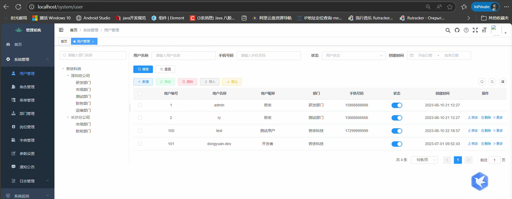
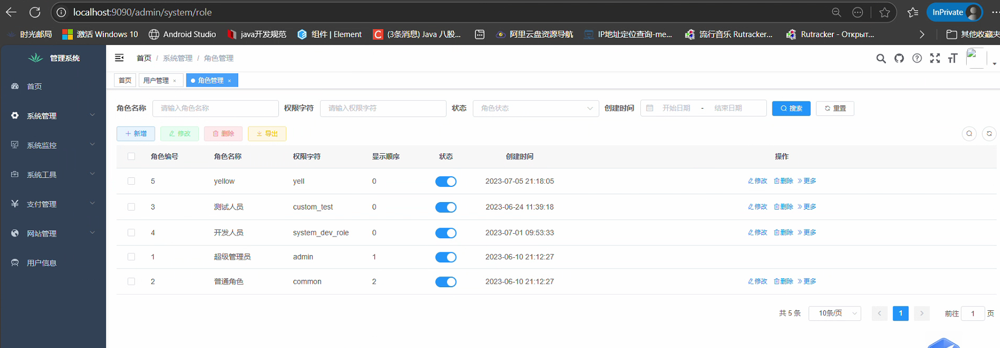

# 如何把vue项目部署在admin路径下前端访问


<!--more-->

## 部署一个vue项目通过/根路径访问

### 前端项目配置

#### ‌**修改`publicPath`**

在`vue.config.js`中设置基础路径为`/admin/`（对应部署路径）：

```js
module.exports = {
  publicPath: process.env.NODE_ENV === 'production' ? '/' : '/'
};
```

#### **配置路由基础路径**‌

在`src/router/index.js`中设置`base`属性：

```js
const router = new VueRouter({
  mode: 'history',
  base: process.env.BASE_URL, // 确保与publicPath一致  如果是根路径， 可以去掉该属性
});
```

#### 构建项目

```
npm run build  # 或 yarn build
```

### 服务器部署

#### **配置Nginx**

```config
server {
            listen       80;
            server_name  localhost;

    		location / {
                root   /home/ruoyi/projects/ruoyi/;   # 该目录为上传dist的目录
    			try_files $uri $uri/ /index.html;
                index  index.html index.htm;
            }

    		location /prod-api/{
    			proxy_set_header Host $http_host;
    			proxy_set_header X-Real-IP $remote_addr;
    			proxy_set_header REMOTE-HOST $remote_addr;
    			proxy_set_header X-Forwarded-For $proxy_add_x_forwarded_for;
    			proxy_pass http://ruoyi-admin-single:8081/;
    		}

            error_page   500 502 503 504  /50x.html;
            location = /50x.html {
                root   html;
            }
        }
```



## 部署一个vue项目通过子路径/admin访问

### 前端项目配置

#### ‌**修改`publicPath`**

在`vue.config.js`中设置基础路径为`/admin/`（对应部署路径）：

```js
module.exports = {
  publicPath: process.env.NODE_ENV === 'production' ? '/admin/' : '/'
};
```

#### **配置路由基础路径**‌

在`src/router/index.js`中设置`base`属性：

```js
const router = new VueRouter({
  mode: 'history',
  base: process.env.BASE_URL, // 确保与publicPath一致
});
```

#### 构建项目

```
npm run build  # 或 yarn build
```

### 服务器部署

#### **配置Nginx**

```config
server {
        listen       9090;
        server_name  localhost;

		# 配置/admin路径指向打包后的项目
		location /admin/ {
            alias   /home/ruoyi/projects/admin/;	# 上传的dist重命名后的目录
			try_files $uri $uri/ /admin/index.html;		# 解决history模式刷新404 !!!!!非常重要
            index  index.html index.htm;
        }

		location /prod-api/{
			proxy_set_header Host $http_host;
			proxy_set_header X-Real-IP $remote_addr;
			proxy_set_header REMOTE-HOST $remote_addr;
			proxy_set_header X-Forwarded-For $proxy_add_x_forwarded_for;
			proxy_pass http://ruoyi-admin-single:8081/;
		}

        error_page   500 502 503 504  /50x.html;
        location = /50x.html {
            root   html;
        }
    }
```


