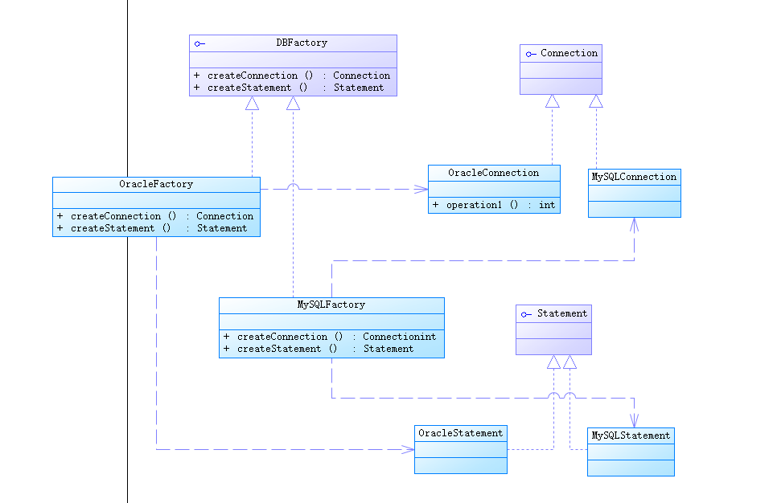
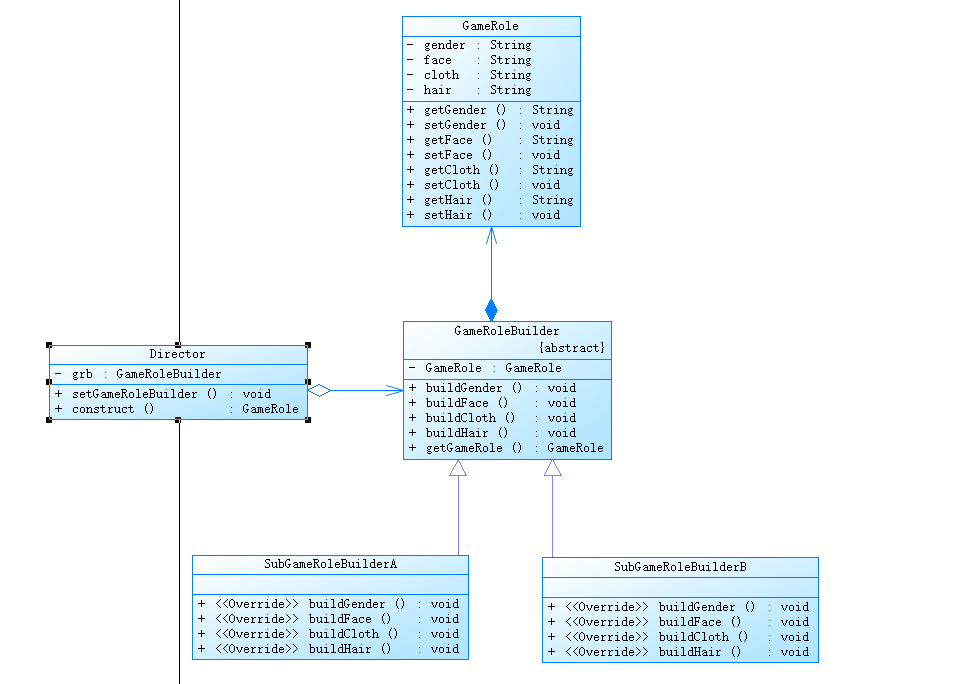

# 实验三---抽象工厂模式、建造者模式


<!--more-->

### 问题一：抽象工厂模式

某系统为了改进数据库操作的性能，自定义数据库连接对象Connection和语句对象Statement,可针对不同类型的数据库提供不同的连接对象和语句对象，如提供Oracle或MySQL专用连接类和语句类，而且用户可以通过配置文件等方式根据实际需要动态更换系统数据库。使用抽象工厂模式设计该系统。要求绘制类图并编程实现。

**类图**



代码实现：

抽象Connection接口：

```java
public interface Connection {
}
```

具体实现类：

```java
public class OracleConnection implements Connection {
}
```

```java
public class MySQLConnection implements Connection {
}
```

抽象Statement接口：

```java
public interface Statement {
}
```

具体实现类：

```java
public class MySQLStatement implements Statement {
}
```

```java
public class OracleStatement implements Statement {
}
```

抽象工厂类接口：

```java
public interface Factory {
    Connection createConnecttion();
    Statement createStatement();
}
```

具体工厂实现类：

```java
public class MySQLFactory implements Factory {
    @Override
    public Connection createConnecttion() {
        System.out.println("正在创建MySQLConnection");
        return new MySQLConnection();
    }

    @Override
    public Statement createStatement() {
        System.out.println("正在创建MySQLStatement");
        return new MySQLStatement();
    }
}
```

```java
public class OracleFactory implements Factory {
    @Override
    public Connection createConnecttion() {
        System.out.println("正在创建OracleConnection");
        return new OracleConnection();
    }

    @Override
    public Statement createStatement() {
        System.out.println("正在创建OracleStatement");
        return new OracleStatement();
    }
}
```

辅助代码：

```java
public class XMLUtil {
    public static Object getType(){
        try{
            DocumentBuilderFactory documentBuilderFactory=DocumentBuilderFactory.newInstance();
            DocumentBuilder documentBuilder=documentBuilderFactory.newDocumentBuilder();
            Document document;
            document= documentBuilder.parse(new File("config.xml"));

            NodeList nodeList=document.getElementsByTagName("type");
            Node classNode=nodeList.item(0).getFirstChild();
            String string=classNode.getNodeValue().trim();
            Class c=Class.forName("cn.hubu.www."+string);
            Object obj=c.newInstance();
            return obj;

        }catch (Exception e) {
            e.printStackTrace();
            return null;
        }
    }
}
```

client客户端：

```java
public class Client {
    public static void main(String args[]) {

        try {
            Connection connection;
            Statement statement;
            Factory factory= (Factory) XMLUtil.getType();
            connection=factory.createConnecttion();
            System.out.println(connection.getClass());
            statement = factory.createStatement();
            System.out.println(statement.getClass());
        } catch (Exception e) {
            e.printStackTrace();
        }
    }
}
```

运行结果：

```
正在创建MySQLConnection
class cn.hubu.www.MySQLConnection
正在创建MySQLStatement
class cn.hubu.www.MySQLStatement
```

### 问题二：建造者模式

建造者模式实验：某游戏软件中人物角色包括多种类型，不同类型的人物角色，其性别、脸型、服装、发型等外部特性有所差异，使用建造者模式创建人物角色对象，要求绘制类图并编程实现。



代码如下：

人物角色GameRole类：

```java
public class GameRole {
    private String gender;
    private String face;
    private String cloth;
    private String hair;

    @Override
    public String toString() {
        return "GameRole{" +
                "gender='" + gender + '\'' +
                ", face='" + face + '\'' +
                ", cloth='" + cloth + '\'' +
                ", hair='" + hair + '\'' +
                '}';
    }

    public String getGender() {
        return this.gender;
    }

    public void setGender(String gender) {
        this.gender = gender;
    }

    public String getFace() {
        return face;
    }

    public void setFace(String face) {
        this.face = face;
    }

    public String getCloth() {
        return cloth;
    }

    public void setCloth(String cloth) {
        this.cloth = cloth;
    }

    public String getHair() {
        return hair;
    }

    public void setHair(String hair) {
        this.hair = hair;
    }
}
```

抽象建造者类：

```java
public abstract class GameRoleBuilder {
    protected GameRole gameRole=new GameRole();

    public abstract void buildGender();
    public abstract void buildFace();
    public abstract void builCloth();
    public abstract void buildHair();

    public GameRole getGameRole(){
        return this.gameRole;
    }

}
```

具体建造者类SubGameRoleBuilderA：

```java
public class SubGameRoleBuilderA extends GameRoleBuilder {
    @Override
    public void buildGender() {
        gameRole.setGender("男");
    }

    @Override
    public void buildFace() {
        gameRole.setFace("英俊帅气");
    }

    @Override
    public void builCloth() {
        gameRole.setCloth("李宁服饰");
    }

    @Override
    public void buildHair() {
        gameRole.setHair("黑色");
    }
}
```

具体建造者类SubGameRoleBuilderB：

```java
public class SubGameRoleBuilderB extends GameRoleBuilder {
    @Override
    public void buildGender() { gameRole.setGender("女"); }

    @Override
    public void buildFace() {
        gameRole.setFace("瓜子脸");
    }

    @Override
    public void builCloth() {
        gameRole.setCloth("JK");
    }

    @Override
    public void buildHair() {
        gameRole.setHair("黄色");
    }
}
```

指挥者Director类：

```java
public class Director {
    private GameRoleBuilder gameRoleBuilder;

    public void setGameRoleBuilder(GameRoleBuilder gameRoleBuilder){
        this.gameRoleBuilder=gameRoleBuilder;
    }

    public GameRole construct(){
        gameRoleBuilder.buildGender();
        gameRoleBuilder.buildFace();
        gameRoleBuilder.builCloth();
        gameRoleBuilder.buildHair();
        return gameRoleBuilder.getGameRole();
    }
}
```

辅助代码与之前类似、、、、、

客户端：

```java
public class Client {
    public static void main(String args[]) {

        try {
            GameRoleBuilder gameRoleBuilder= (GameRoleBuilder) XMLUtil.getType();
            Director director=new Director();
            director.setGameRoleBuilder(gameRoleBuilder);
            GameRole gameRole=director.construct();
            System.out.println(gameRole.toString());
        } catch (Exception e) {
            e.printStackTrace();
        }
    }
}
```

运行结果：

```
GameRole{gender='女', face='瓜子脸', cloth='JK', hair='黄色'}

Process finished with exit code 0
```


### 区别：

​		抽象工厂模式比建造者模式的尺度要大，它关注产品整体，而建造者模式关注构建过程，因此建造者模式可以很容易地构建出一个崭新的产品，只要导演类能够提供具体的工艺流程。也正因为如此，两者的应用场景截然不同，如果希望屏蔽对象的创建过程，只提供一个封装良好的对象，则可以选择抽象工厂方法模式。而建造者模式可以用在构件的装配方面，如通过装配不同的组件或者相同组件的不同顺序，可以产生出一个新的对象，它可以产生一个非常灵活的架构，方便地扩展和维护系统。
