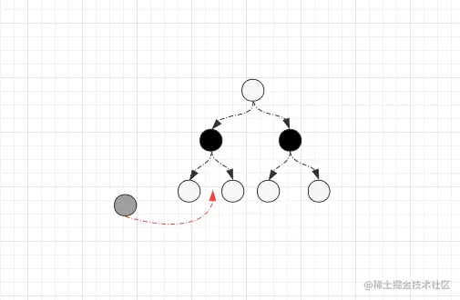
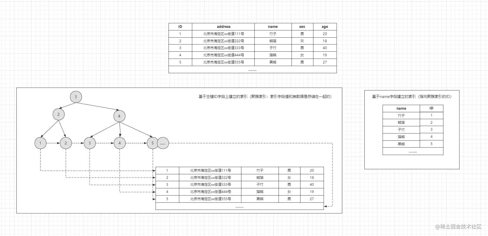
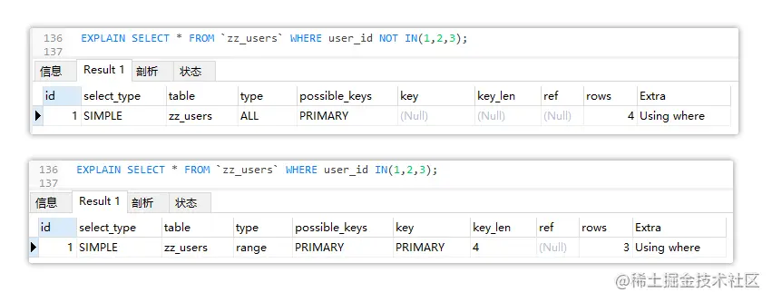

# 建立索引的正确姿势与使用索引的最佳指南


<!--more--><!--more-->

# (五)MySQL索引应用篇：建立索引的正确姿势与使用索引的最佳指南！

## 引言

  数据库索引，绝对是`MySQL`的核心功能之一，如果没有索引机制的数据库，那数据的检索效率绝对是令人无法接受的，毕竟没有索引的表数据，就如同一个普通的文本文件存储在磁盘中。在[《索引上篇》](https://juejin.cn/post/7147609139974242317)中，我们对于`MySQL`提供的索引机制，从引入，到创建、使用、分类、管理....等进行了全面阐述，相信经过上一篇的讲解后，大家对`MySQL`索引机制建立了系统化的认知，而本篇则会以上篇为基础，对索引机制进一步加深掌握。

  不过在上篇中虽对数据库索引机制有了完善认知，但还不够，因为上篇仅是单纯的认知阶段，能否真正的在实际项目中运用好索引机制，还需要具备丰富的经验以及一些原则与方法论，比如下述一些关于索引的问题：

- 索引虽然能给`MySQL`检索数据的效率带来质的飞跃，但加入索引未带来新问题吗？
- 既然索引能够提升查询性能，那是不是为表中每个字段建立索引，性能会更好？
- 一张数据表中，那些类型的字段不适合建立索引呢？又是因为什么原因呢？
- 表中会存在大量的字段，但其中那些字段建立索引才能够最大的性能收益呢？
- `MySQL`提供的索引种类也不少，一个字段上建立什么类型的索引才最好呢？
- 当表中存在多个索引时，一条查询`SQL`有多条路径可走，此时走哪条索引最好？
- `.......`

对于这些问题，如果仅靠上篇索引的知识，相信是很难回答具体的，那在本篇中，则重点讲解索引应用相关的方式方法，例如各索引优劣分析、建立索引的原则、使用索引的指南以及索引失效与索引优化等内容。

## 一、MySQL各索引的优劣分析

  首先来聊聊索引机制带来的利害关系，有句古话曾说过：**“凡事有利必有弊”**，而`MySQL`的索引机制也不例外，引入索引机制后，能够给数据库带来的优势很明显：

- ①整个数据库中，数据表的查询速度直线提升，数据量越大时效果越明显。
- ②通过创建唯一索引，可以确保数据表中的数据唯一性，无需额外建立唯一约束。
- ③在使用分组和排序时，同样可以显著减少`SQL`查询的分组和排序的时间。
- ④连表查询时，基于主外键字段上建立索引，可以带来十分明显的性能提升。
- ⑤索引默认是`B+Tree`有序结构，基于索引字段做范围查询时，效率会明显提高。
- ⑥从`MySQL`整体架构而言，减少了查询`SQL`的执行时间，提高了数据库整体吞吐量。

看着上面一条又一条的好处，似乎感觉索引好处很大啊，对于这点确实毋庸置疑，但只有好处吗？`No`，同时也会带来一系列弊端，如：

- ①建立索引会生成本地磁盘文件，需要额外的空间存储索引数据，磁盘占用率会变高。
- ②写入数据时，需要额外维护索引结构，增、删、改数据时，都需要额外操作索引。
- ③写入数据时维护索引需要额外的时间开销，执行写`SQL`时效率会降低，性能会下降。

当然，但对数据库整体来说，索引带来的优势会大于劣势。不过也正由于索引存在弊端，因此索引不是越多越好，合理建立索引才是最佳选择。

> 在上篇聊过，`MySQL`的索引也会分为多种类型，每个类型的索引多多少少都存在一些弊端，接下来聊聊其他类型的索引。

### 1.1、主键索引存在的陷阱

  相信大家数据库的表中，主键一般都是使用自增`ID`，但这是为什么呢？有人可能会回答自增`ID`不会重复，确保了主键唯一性。这样也确实没错，但不会重复的又不仅仅只有自增`ID`，比如我使用随机的`UUID`也不会重复，为何不使用`UUID`呢？这是由于索引存在一个陷阱！

> 众所周知，一张表中大多数情况下，会将主键索引以聚簇的形式存在磁盘中，上篇文章也聊到过，聚簇索引在存储数据时，表数据和索引数据是一起存放的。同时，`MySQL`默认的索引结构是`B+Tree`，也就代表着索引节点的数据是有序的。

此时结合上面给出的一些信息，主键索引是聚簇索引，表数据和索引数据在一块、索引结构是有序的，那再反推前面给出的疑惑，为何不使用`UUID`呢？因为`UUID`是无序的，如果使用`UUID`作为主键，那么每当插入一条新数据，都有可能破坏原本的树结构，如下：

比如上图中的灰色节点，是一条新插入的数据，此时经过计算后，应该排第二个位置，那就代表着后面的三个节点需要移动，然后给灰色节点挪出一个位置存储，从而确保索引的有序性。

> 这里只是伪逻辑，目的是用于举例演示，实际上`B+`树索引结构不长这样，在《索引原理篇》会重新说一下这个点的。

由于主键索引是聚簇索引，因此上述案例中，当后续节点需要挪动时，也就代表着还需要挪动表数据，如果是偶尔需要移动还行，但如果主键字段值无序，那代表着几乎每次插入都有可能导致树结构要调整。

> 但使用自增`ID`就不会有这个问题，所有新插入的数据都会放到最后。

因此大家数据表的主键，最好选用带顺序性的值，否则有可能掉入主键索引的“陷阱”中。

### 1.2、联合索引存在的矛盾

  为了多条件查询时的效率更高，一般都会同时对多个字段建立联合索引，但之前也聊到过，联合索引存在一个致命的问题，比如在用户表中，通过`id、name、age`三个字段建立一个联合索引，此时来了一条查询`SQL`，如下：

```sql
SELECT * FROM `zz_user` WHERE name = "竹子" AND age = "18";
```

而这条`SQL`语句是无法使用联合索引的，为什么呢？因为查询条件中，未包含联合索引的第一个字段，想要使用联合索引，那么查询条件中必须包含索引的第一个字段，如下：

```sql
SELECT * FROM `zz_user` WHERE name = "竹子" AND id = 6;
```

上面这条`SQL`才是能命中多列索引的语句，因此在建立索引时也需要考虑这个问题，确保建立出的联合索引能够命中率够高。

### 1.3、前缀索引存在的弊端

  前缀索引的特点是短小精悍，我们可以利用一个字段的前`N`个字符创建索引，以这种形式创建的索引也被称之为前缀索引，相较于使用一个完整字段创建索引，前缀索引能够更加节省存储空间，当数据越多时，带来的优势越明显。

> 不过前缀索引虽然带来了节省空间的好处，但也正由于其索引节点中，未存储一个字段的完整值，所以`MySQL`也无法通过前缀索引来完成`ORDER BY、GROUP BY`等分组排序工作，同时也无法完成覆盖扫描等操作。

### 1.4、全文索引存在的硬伤

  之前做模糊查询时，通常都会使用`like%`语法，不过这种方式虽然能够实现效果，但随着表越来越大，数据越来越多时，其性能会出现明显下降，而全文索引的推出则能够完美解决该问题，可以利用全文索引代替`like%`语法实现模糊查询，它的性能会比`like%`快上`N`倍。

> 全文索引虽然可以实现模糊查询，但也存在一系列硬伤，一起来看看。

①由于全文索引是基于分词实现的，所以对一个字段建立全文索引后，`MySQL`会对该字段做分词处理，这些分词结果也会被存储在全文索引中，因此全文索引的文件会额外的大！

②由于全文索引对每个字段值都会做分词，因此当修改字段值后，分词是需要时间的，所以修改字段数据后不会立马自动更新全文索引，此时需要咱们写存储过程，并调用它手动更新全文索引中的数据。

③除开上述两点外，全文索引最大的硬伤在于对中文支持不够友好，类似于英文可以直接通过符号、空格来分词，但中文呢？一个词语来形容就是博大精深，无法精准的对一段文字做分词，因此全文索引在检索中文时，存在些许精准度问题。

> 因此如果你项目规模较大，通常再引入`ElasticSearch、Solr、MeiliSearch`等搜索引擎是一个更佳的选择。

### 1.5、唯一索引存在的快慢问题

  唯一索引有个很大的好处，就是查询数据时会比普通索引效率更高，因为基于普通索引的字段查询数据，例如：

```sql
SELECT * FROM TABLE_XX WHERE COLUMN_XX = "XX";
```

假设`COLUMN_XX`字段上建立了一个普通索引，此时基于这个字段查询数据时，当查询到一条`COLUMN_XX = "XX"`的数据后，此时会继续走完整个索引树，因为可能会存在多条字段值相同的数据。

> 但如果`COLUMN_XX`字段上建立的是唯一索引，当找到一条数据后就会立马停下检索，因此本身建立唯一索引的字段值就具备唯一性。

因此唯一索引查询数据时，会比普通索引快上一截，但插入数据时就不同了，因为要确保数据不重复，所以插入前会检查一遍表中是否存在相同的数据。但普通索引则不需要考虑这个问题，因此普通索引的数据插入会快一些。

### 1.6、哈希索引的致命问题

  哈希索引，也就是数据结构为`Hash`类型的索引，不过估计大家接触的比较少，毕竟创建索引时都默认用的`B+`树结构。但要比起查询速度，哈希索引绝对是`MySQL`中当之无愧的魁首！因为采用哈希结构的索引，会以哈希表的形式存储索引字段值，当基于该字段查询数据时，只需要经过一次哈希计算就可获取到数据。

> 但哈希结构的致命问题在于无序，也就是无法基于哈希索引的字段做排序、分组等工作。

因此如果你确定一个表中，不会做排序这类的工作，那可以适当选用哈希结构作为索引的数据结构，它会给你带来意想不到的性能收益~

## 二、建立索引的正确姿势

  经过上述一系列分析后，简单讲明了每种索引类型存在的缺陷问题，但这跟我们本篇有啥关系呢？其实关系很大，因为只有当你了解了每种索引存在的劣势，才能更好的考虑并设计出合理的索引，而不是一股脑的盲目创建索引。

> 那么在创建索引时，咱们应当遵守那些原理原则，才能创建出合理的索引呢？

在实际项目场景中，当`SQL`查询性能较慢时，我们常常会有一个疑惑：**表中哪个字段建立一个索引能带来最大的性能收益呢**？一般来说，判断字段是否要添加的索引的依据，是看这个字段是否被经常当做查询条件使用，但也不能光依靠这一个依据来判断，比如用户表中的性别字段，就会经常被用做查询条件，但如果对性别字段建立一个索引，那对查询的性能提升并不大，因为性别就两个值：男/女（不包含泰国在内），那对其建立索引，索引文件中就只会有两个索引节点，大致情况如下：

这种情况下，为性别建立一个索引，带来的性能收益显然不是太大。同时，上图中给出的案例，也不是索引真正的样子，如果表中存在主键索引或聚簇索引，对其他字段建立的索引，都是次级索引，也被称为辅助索引，其节点上的值，存储的并非一条完整的行数据，而是指向聚簇索引的索引字段值。

> 如果基于辅助索引查询数据，最终数据会以何种方式被检索出来，这里就牵扯到`MySQL`中的一个新概念，也就是`SQL`执行时的回表问题。

### 2.1、索引查询时的回表问题

  什么叫做回表呢？意思就是指一条`SQL`语句在`MySQL`内部，要经过两次查询过程才能获取到数据。这是跟索引机制有关的，先来看看索引在`MySQL`内部真正的面貌：

在上图用户表中，基于`ID`字段先建立了一个主键索引，然后又基于`name`字段建立了一个普通索引，此时`MySQL`默认会选用主键索引作为聚簇索引，将表数据和主键索引存在同一个文件中，也就是主键索引的每个索引节点，都直接对应着行数据。而基于`name`字段建立的索引，其索引节点存放的则是指向聚簇索引的`ID`值。

> 在这种情况下，假设有一条下述`SQL`，其内部查询过程是啥样的呢？

```sql
SELECT * FROM `zz_user` WHERE name = "子竹";
复制代码
```

首先会走`name`字段的索引，然后找到对应的`ID`值，然后再基于查询到的`ID`值，再走`ID`字段的主键索引，最终得到一整条行数据并返回。

> 在这个案例中，一条查询`SQL`经历了两次查询才获取到数据，这个过程则被称之为回表。

回表动作会导致额外的查询开销，因此尽量可以基于主键做查询，如果实在需要使用非主键字段查询，那么尽量要写明查询的结果字段，而并非使用`*`。

> 当然，实际情况中建立联合索引，利用索引覆盖特性，从而避免使用辅助索引，这样也能够消除回表动作，但关于这点后面再聊，先来说说建立索引需要遵循的一些原则。

### 2.2、建立索引时需要遵守的原则

  前面说过一点，当建立索引仅考虑一个字段是否被经常用于查询是不够的，往往一个合适的索引需要更为细致与长远的思考，例如使用多个字段建立是否会更好？创建其他类型的索引性能是否会更佳？下面我们就一起来看看建立索引时，需要遵守的一些原则：

- ①经常频繁用作查询条件的字段应酌情考虑为其创建索引。
- ②表的主外键或连表字段，必须建立索引，因为能很大程度提升连表查询的性能。
- ③建立索引的字段，一般值的区分性要足够高，这样才能提高索引的检索效率。
- ④建立索引的字段，值不应该过长，如果较长的字段要建立索引，可以选择前缀索引。
- ⑤建立联合索引，应当遵循最左前缀原则，将多个字段之间按优先级顺序组合。
- ⑥经常根据范围取值、排序、分组的字段应建立索引，因为索引有序，能加快排序时间。
- ⑦对于唯一索引，如果确认不会利用该字段排序，那可以将结构改为`Hash`结构。
- ⑧尽量使用联合索引代替单值索引，联合索引比多个单值索引查询效率要高。

同时，除开上述一些建立索引的原则外，在建立索引时还需有些注意点：

- ❶值经常会增删改的字段，不合适建立索引，因为每次改变后需维护索引结构。
- ❷一个字段存在大量的重复值时，不适合建立索引，比如之前举例的性别字段。
- ❸索引不能参与计算，因此经常带函数查询的字段，并不适合建立索引。
- ❹一张表中的索引数量并不是越多越好，一般控制在`3`，最多不能超过`5`。
- ❺建立联合索引时，一定要考虑优先级，查询频率最高的字段应当放首位。
- ❻当表的数据较少，不应当建立索引，因为数据量不大时，维护索引反而开销更大。
- ❼索引的字段值无序时，不推荐建立索引，因为会造成页分裂，尤其是主键索引。

对于索引机制，在建立时应当参考上述给出的意见，这每一条原则都是从实际经验中总结出来的，前面八条不一定要全面思考，但后面七条注意点，一定要牢记，如若你的索引符合后面七条中的描述，那一定要更改索引。

> 对于每一条建议是为什么，在后面的《索引原理篇》讲完之后大家就会彻底理解，这里就不展开叙述了，接下来重点聊一下联合索引，以及它的最左前缀原则。

### 2.3、联合索引的最左前缀原则

  首先在讲最左前缀原则之前，先看看上述给出的一条原则：

- ⑧尽量使用联合索引代替单值索引，联合索引比多个单值索引查询效率要高。

对于这一点是为什么呢？举个栗子理解，比如此时基于`X、Y、Z`字段建立了一个联合索引，实际上也相当于建立了三个索引：`X`、`X、Y`、`X、Y、Z`，因此只要查询中使用了这三组字段，都可以让联合索引生效。

> 但如若查询中这三个字段不以`AND`形式出现，而是单独作为查询条件出现，那单值索引性能会好一些，但三个不同的索引，维护的代价也会高一些。

其实联合索引的最左前缀原则，道理很简单的，就是组成联合索引的多个列，越靠左边优先级越高，同时也只有`SQL`查询条件中，包含了最左的字段，才能使用联合索引，例如：

```sql
-- 基于上面的哪个X、Y、Z联合索引
SELECT * FROM tb WHERE Y = "..." AND Z = "...";
复制代码
```

上面这条`SQL`就显然并不会使用联合索引，因为不符合最左前缀原则，最左侧的`X`字段未曾被使用。也正由于`MySQL`在使用联合索引时会遵循最左前缀原则，所以才在前面建立索引的建议中给出了一条：

- ❺建立联合索引时，一定要考虑优先级，查询频率最高的字段应当放首位。

因为将查询频率越高的字段放首位，就代表着查询时命中索引的几率越大。同时，`MySQL`的最左前缀原则，才匹配到范围查询时会停止匹配，比如`>、<、between、like`这类范围条件，并不会继续使用联合索引，举个栗子：

```sql
SELECT * FROM tb WHERE X="..." AND Y > "..." AND Z="...";
复制代码
```

当执行时，虽然上述`SQL`使用到`X、Y、Z`作为查询条件，但由于`Y`字段是`>`范围查询，因此这里只能使用`X`索引，而不能使用`X、Y`或`X、Y、Z`索引。

> 对于一条查询`SQL`是否用到了索引，或者一条查询`SQL`到底用了那个索引，其实可以通过`MySQL`自带的`explain`工具分析（后续讲解）。

最后再来一个简单的栗子，加深一下对于联合索引的认知：

```sql
select * from user where name = '竹子';
select * from user where name = '竹子' and age = 18;

A. create index index_name on user(name);
   create index index_name on user(age);

B. create index index_name on user(name,age);
复制代码
```

比如上述这个案例中，对于这两条`SQL`选第一种方式创建索引，还是第二种呢？答案是`B`，因为两条`sql`完全能够利用到第二个创建的联合索引。

```sql
select * from user where name = '竹子' and age = 18;
select * from user where  age = 18 and name = '竹子';
复制代码
```

同时选`B`建立联合索引后，如上两条`SQL`都会利用到上面创建的联合索引，`SQL`是否走索引查询跟`where`后的条件顺序无关，因为`MySQL`优化器会优化，对`SQL`查询条件进行重排序。

## 三、索引失效与使用索引的正确姿势

  相信这一点大家看了有些懵，啥叫使用索引的正确姿势？索引不是`MySQL`执行`SQL`时自动选择的吗？我们只能建立索引，怎么使用啊？其实这里是指我们编写`SQL`时，要注意的点，毕竟`MySQL`查询时到底使不使用索引，这完全取决于你编写的`SQL`。

> 但很多小伙伴在平时写`SQL`的时候，一般只追求实现业务功能，只要能够查询出相应的数据即可，压根不会过度考虑这条`SQL`应用到索引，那么这里就是给出一些经验之谈，讲清楚几点写`SQL`时的方法论。

  其实索引本身是一把双刃剑，用的好能够给我们带来异乎寻常的查询效率，用的不好则反而会带来额外的磁盘占用及写入操作时的维护开销。因此大家一定要切记，既然选择建了索引，那一定要利用它，否则还不如干脆别建，既能节省磁盘空间，又能提升写入效率。

### 3.1、索引失效的那些事儿

  想要用好索引，那一定要先搞清楚那些情况会导致索引失效，弄明白这些事项之后，在写`SQL`的时候刻意避开，那你写出来的`SQL`十有八九是会用到索引的，那么在数据库中那些情况下会导致索引失效呢？下面一起来聊一聊，但单纯的讲概念会有种纸上谈兵的感觉，因此下面简单的举个案例，然后来说明索引失效的一些情况。

```sql
SELECT * FROM `zz_users`;
+---------+-----------+----------+----------+---------------------+
| user_id | user_name | user_sex | password | register_time       |
+---------+-----------+----------+----------+---------------------+
|       1 | 熊猫      | 女       | 6666     | 2022-08-14 15:22:01 |
|       2 | 竹子      | 男       | 1234     | 2022-09-14 16:17:44 |
|       3 | 子竹      | 男       | 4321     | 2022-09-16 07:42:21 |
+---------+-----------+----------+----------+---------------------+

ALTER TABLE `zz_users` ADD PRIMARY KEY `p_user_id`(`user_id`);
ALTER TABLE `zz_users` ADD KEY `unite_index`(`user_name`,`user_sex`,`password`);
复制代码
```

此时对这张用户表，分别创建两个索引，第一个是基于`user_id`创建的主键索引，第二个是使用`user_name、user_sex、password`三个字段创建的联合索引。

> 但想要查看一条`SQL`是否使用了索引，需要用到一个自带的分析工具`ExPlain`，下面简单介绍一下。

#### 3.1.1、执行分析工具 - ExPlain

这里就对`explain`工具做一个简单介绍，后续《SQL优化篇》会详细讲解这个工具，先来看看这个工具/命令的作用，当在一条`SQL`前加上`explain`命令，执行这条`SQL`后会列出所有的执行方案：

```sql
EXPLAIN SELECT * FROM `zz_users`;
+----+-------------+----------+------+---------------+------+---------+------+------+-------+
| id | select_type | table    | type | possible_keys | key  | key_len | ref  | rows | Extra |
+----+-------------+----------+------+---------------+------+---------+------+------+-------+
|  1 | SIMPLE      | zz_users | ALL  | NULL          | NULL | NULL    | NULL |    3 |       |
+----+-------------+----------+------+---------------+------+---------+------+------+-------+
复制代码
```

- `id`：这是执行计划的`ID`值，这个值越大，表示执行的优先级越高。

- ```
  select_type
  ```

  ：当前查询语句的类型，有如下几个值：

  - `simple`：简单查询。
  - `primary`：复杂查询的外层查询。
  - `subquery`：包含在查询语句中的子查询。
  - `derived`：包含在`FROM`中的子查询。

- `table`：表示当前这个执行计划是基于那张表执行的。

- ```
  type
  ```

  ：当前执行计划查询的类型，有几种情况：

  - `all`：表示走了全表查询，未命中索引或索引失效。
  - `system`：表示要查询的表中仅有一条数据。
  - `const`：表示当前`SQL`语句的查询条件中，可以命中索引查询。
  - `range`：表示当前查询操作是查某个区间。
  - `eq_ref`：表示目前在做多表关联查询。
  - `ref`：表示目前使用了普通索引查询。
  - `index`：表示目前`SQL`使用了辅助索引查询。

- `possible_keys`：执行`SQL`时，优化器可能会选择的索引（最后执行不一定用）。

- `key`：查询语句执行时，用到的索引名字。

- `key_len`：这里表示索引字段使用的字节数。

- `ref`：这里显示使用了那种查询的类型。

- `rows`：当前查询语句可能会扫描多少行数据才能检索出结果。

- ```
  Extra
  ```

  ：这里是记录着额外的一些索引使用信息，有几种状态：

  - `using index`：表示目前使用了覆盖索引查询（稍后讲）。
  - `using where`：表示使用了`where`子句查询，通常表示没使用索引。
  - `using index condition`：表示查询条件使用到了联合索引的前面几个字段。
  - `using temporary`：表示使用了临时表处理查询结果。
  - `using filesort`：表示以索引字段之外的方式进行排序，效率较低。
  - `select tables optimized away`：表示在索引字段上使用了聚合函数。

对于上述这么多的字段，其实目前不需要完全弄懂，本文只需要记住里面的`type`字段即可，`all`表示走全表扫描，`const、ref...`表示通过索引查询。

> 下面一起来聊一聊索引失效的一些场景。

#### 3.1.2、查询中带有OR会导致索引失效

```sql
EXPLAIN SELECT * FROM `zz_users` WHERE user_id = 1 OR user_name = "熊猫";
复制代码
```

例如上述这条`SQL`，其中既包含了主键索引的字段，又包含了联合索引的第一个字段，按理来说是会走索引查询的对吗？但看看执行结果：

从结果中可看到`type=ALL`，显然并未使用索引来查询，也就代表着，虽然所有查询条件都包含了索引字段，但由于使用了`OR`，最终导致索引失效。

#### 3.1.3、模糊查询中like以%开头导致索引失效

众所周知，使用`like`关键字做模糊查询时，是可以使用索引的，那来看看下述这条`SQL`：

```sql
EXPLAIN SELECT * FROM `zz_users` WHERE user_name LIKE "%熊";
复制代码
```

在这条`SQL`中以联合索引中的第一个字段作为了查询条件，此时会使用索引吗？看看结果：

结果中显示依旧走了全表扫描，并未使用索引，但`like`不以`%`开头，实际上是不会导致索引失效的，例如：

在这里以`%`结尾，其实可以使用联合索引来检索数据，并不会导致索引失效。

#### 3.1.4、字符类型查询时不带引号导致索引失效

```sql
-- 先插入一条user_name = 1111 的数据
INSERT INTO `zz_users` VALUES(4,"1111","男","4321","2022-09-17 23:48:29");

EXPLAIN SELECT * FROM `zz_users` WHERE user_name = 111;
复制代码
```

上述这条`SQL`按理来说是没有半点问题的，目前是符合联合索引的最左匹配原则的，但来看看结果：

从结果中很明显的可以看出，由于`user_name`是字符串类型的，因此查询时没带引号，竟然直接未使用索引，导致了索引失效（上面也放了对比图，大家可以仔细看看区别)。

#### 3.1.5、索引字段参与计算导致索引失效

```sql
EXPLAIN SELECT * FROM `zz_users` WHERE user_id - 1 = 1;
复制代码
```

上面这条`SQL`看着估计有些懵，但实际上很简单，就是查询`ID=2`的数据，理论上因为查询条件中使用了主键字段，应该会使用主键索引，但结果呢？

由于索引字段参与了计算，所以此时又导致了索引失效，因此大家要切记，千万不要让索引字段在`SQL`中参与计算，也包括使用一些聚合函数时也会导致索引失效，其根本原因就在于索引字段参与了计算导致的。

> 这里的运算也包括`+、-、*、/、!.....`等一系列涉及字段计算的逻辑。

#### 3.1.6、字段被用于函数计算导致索引失效

```sql
EXPLAIN SELECT * FROM `zz_users` WHERE SUBSTRING(user_name,0,1) = "竹子";
复制代码
```

上述中，我们使用`SUBSTRING`函数对`user_name`字段进行了截取，然后再用于条件查询，此时看看执行结果：

很显然，并未使用索引查询，这也是意料之中的事情，毕竟这一条和`3.1.5`的原因大致相同，索引字段参与计算导致失效。

#### 3.1.7、违背最左前缀原则导致索引失效

```sql
EXPLAIN SELECT * FROM `zz_users` WHERE `user_sex` = "男" AND `password` = "1234";
复制代码
```

上述这条`SQL`中，显然用到了联合索引中的性别和密码字段，此时再看看结果：

由于违背了联合索引的最左前缀原则，因为没使用最左边的`user_name`字段，因此也导致索引失效，从而走了全表查询。

#### 3.1.8、不同字段值对比导致索引失效

从一张表中查询出一些值，然后根据这些值去其他表中筛选数据，这个业务也是实际项目中较为常见的场景，下面为了简单实现，就简单用姓名和性别模拟一下字段对比的场景：

```sql
EXPLAIN SELECT * FROM `zz_users` WHERE user_name = user_sex;
复制代码
```

按理来说，因为`user_name`属于联合索引的第一个字段，所以上述这条`SQL`中规中矩，理论上会走索引的，但看看结果：

显然，这个场景也会导致索引无法使用，因此之后也要切记这点。

#### 3.1.9、反向范围操作导致索引失效

一般来说，如果`SQL`属于正向范围查询，例如`>、<、between、like、in...`等操作时，索引是可以正常生效的，但如果`SQL`执行的是反向范围操作，例如`NOT IN、NOT LIKE、IS NOT NULL、!=、<>...`等操作时，就会出现问题，例如：

```sql
EXPLAIN SELECT * FROM `zz_users` WHERE user_id NOT IN(1,2,3);
复制代码
```

上述`SQL`的意思很简单，也就是查询`user_id`不是`1,2,3`的数据，这里是基于主键索引字段`user_id`查询的，但会走索引吗？来看看结果：

结果也很明显，使用`NOT`关键字做反向范围查询时，并不会走索引，索引此时失效了，但是做正向范围查询时，索引依旧有效。

> 对于这一点，其实大家可以慢慢实验，并非所有的正向范围操作都会走索引，例如`IS NULL`就不会走，它的反向操作：`IS NOT NULL`同样不会走。

#### 3.1.10、索引失效小结

在`MySQL`中还有一种特殊情况会导致索引失效，也就是当走索引扫描的行数超过表行数的`30%`时，`MySQL`会默认放弃索引查询，转而使用全表扫描的方式检索数据，因此这种情况下走索引的顺序磁盘`IO`，反而不一定有全表的随机磁盘`IO`快。

> 还有一点要牢记：关于索引是否会失效，实际上也跟索引的数据结构、`MySQL`的版本、存储引擎的不同有关，例如一条`SQL`语句在`B+Tree`索引中会导致索引失效，但在哈希索引中却不会（好比`IS NULL/IS NOT NULL`），这种情况在不同版本、不同引擎中都有可能会体现出来。

但到目前为止，大致上已经将`MySQL`中会导致索引失效的几种情况罗列说明了，接下来一起看看使用索引的正确姿势！

### 3.2、使用索引的正确姿势

  其实到这里，对于如何使用索引才是正确的呢？总结如下：

- ①查询`SQL`中尽量不要使用`OR`关键字，可以使用多`SQL`或子查询代替。
- ②模糊查询尽量不要以`%`开头，如果实在要实现这个功能可以建立全文索引。
- ③编写`SQL`时一定要注意字段的数据类型，否则`MySQL`的隐式转换会导致索引失效。
- ④一定不要在编写`SQL`时让索引字段执行计算工作，尽量将计算工作放在客户端中完成。
- ⑤对于索引字段尽量不要使用计算类函数，一定要使用时请记得将函数计算放在`=`后面。
- ⑥多条件的查询`SQL`一定要使用联合索引中的第一个字段，否则会打破最左匹配原则。
- ⑦对于需要对比多个字段的查询业务时，可以拆分为连表查询，使用临时表代替。
- ⑧在`SQL`中不要使用反范围性的查询条件，大部分反范围性、不等性查询都会让索引失效。
- ⑨`.......`

实际上无非就是根据前面给出的索引失效情况，尽量让自己编写的`SQL`不会导致索引失效即可，写出来的`SQL`能走索引查询，那就能在很大程度上提升数据检索的效率。

> 不过这些也属于`SQL`优化的内容，因此更多、更具体的`SQL`编写准则，会在之后的《SQL调优篇》详细讲解。

接下来再重点讲几个较重要的内容，既索引覆盖、索引下推、`Multi-Range Read`机制、索引跳跃式扫描机制。

#### 3.2.1、索引覆盖

在之前聊到过，由于表中只能存在一个聚簇索引，一般都为主键索引，而建立的其他索引都为辅助索引，包括联合索引也例外，最终索引节点上存储的都是指向主键索引的值，拿前面的用户表为例：

```sql
SELECT * FROM `zz_users` WHERE `user_name`="竹子" AND `user_sex`="男";
复制代码
```

虽然这条`SQL`会走联合索引查询，但是基于联合索引查询出来的值仅是一个指向主键索引的`ID`，然后会拿着这个`ID`再去主键索引中查一遍，这个过程之前聊过，被称为回表过程。

> 那么回表问题无法解决吗？必须得经过两次查询才能得到数据吗？答案并非如此。

比如假设此时只需要`user_name、user_sex、password`这三个字段的信息，此时`SQL`语句可以更改为如下情况：

```sql
SELECT 
    `user_name`,`user_sex`,`password`
FROM 
    `zz_users` 
WHERE 
    `user_name` = "竹子" AND `user_sex` = "男";
复制代码
```

此时将`SQL`更改为查询所需的列后，就不会发生回表现象，`Why`？再这里很多小伙伴可能会疑惑，这是什么道理啊？因为此时所需的`user_name、user_sex、password`三个字段数据，在联合索引中完全包含，因此可以直接通过联合索引获取到数据。

> 但如果查询时用`*`，因为联合索引中不具备完整的一行数据，只能再次转向聚簇索引中获取完整的行数据，因此到这里大家应该也明白了为什么查询数据时，不能用`*`的原因，这是因为会导致索引覆盖失效，造成回表问题。

当然，再来提一点比较有意思的事情，先看`SQL`：

```sql
EXPLAIN SELECT 
    `user_name`,`user_sex`
FROM 
    `zz_users`
WHERE 
    `password` = "1234" AND `user_sex` = "男";
复制代码
```

比如上述这条`SQL`，显然是不符合联合索引的最左前缀匹配原则的，但来看看执行结果：

这个结果是不是很令你惊讶，通过`EXPLAIN`分析的结果显示，这条`SQL`竟然使用了索引，这是什么原因呢？也是因为索引覆盖。

> 一句话概述：就是要查询的列，在使用的索引中已经包含，被所使用的索引覆盖，这种情况称之为索引覆盖。

#### 3.2.2、索引下推

索引下推是`MySQL5.6`版本以后引入的一种优化机制，还是以之前的用户表为例，先来看一条`SQL`语句：

```sql
INSERT INTO `zz_users` VALUES(5,"竹竹","女","8888","2022-09-20 22:17:21");

SELECT * FROM `zz_users` WHERE `user_name` LIKE "竹%" AND `user_sex`="男";
复制代码
```

首先为了更加直观的讲清楚索引下推，因此先再向用户表中增加一条数据。然后再来看看后面的查询`SQL`，这条`SQL`会使用联合索引吗？答案是会的，但只能部分使用，因为联合索引的每个节点信息大致如下：

```json
{
    ["熊猫","女","6666"] : 1,
    ["竹子","男","1234"] : 2,
    ["子竹","男","4321"] : 3,
    ["1111","男","4321"] : 4,
    ["竹竹","女","8888"] : 5
}
复制代码
```

由于前面使用的是模糊查询，但`%`在结尾，因此可以使用`竹`这个字作为条件在联合索引中查询，整个查询过程如下：

- ①利用联合索引中的`user_name`字段找出「竹子、竹竹」两个索引节点。
- ②返回索引节点存储的值「`2、5`」给`Server`层，然后去逐一做回表扫描。
- ③在`Server`层中根据`user_sex="男"`这个条件逐条判断，最终筛选到「竹子」这条数据。

有人或许会疑惑，为什么`user_sex="男"`这个条件不在联合索引中处理呢？因为前面是模糊查询，所以拼接起来是这样的：`竹x男`，由于这个`x`是未知的，因此无法根据最左前缀原则去匹配数据，最终这里只能使用联合索引中`user_name`字段的一部分，后续的`user_sex="男"`还需要回到`Server`层处理。

> 那什么又叫做索引下推呢？也就是将`Server`层筛选数据的工作，下推到引擎层处理。

以前面的案例来讲解，`MySQL5.6`加入索引下推机制后，其执行过程是什么样子的呢？

- ①利用联合索引中的`user_name`字段找出「竹子、竹竹」两个索引节点。
- ②根据`user_sex="男"`这个条件在索引节点中逐个判断，从而得到「竹子」这个节点。
- ③最终将「竹子」这个节点对应的「`2`」返回给`Server`层，然后聚簇索引中回表拿数据。

相较于没有索引下推之前，原本需要做「`2、5`」两次回表查询，但在拥有索引下推之后，仅需做「`2`」一次回表查询。

> 索引下推在`MySQL5.6`版本之后是默认开启的，可以通过命令`set optimizer_switch='index_condition_pushdown=off|on';`命令来手动管理。

#### 3.2.3、MRR(Multi-Range Read)机制

`Multi-Range Read`简称为`MRR`机制，这也是和索引下推一同在`MySQL5.6`版本中引入的性能优化措施，那什么叫做`MRR`优化呢？

> 一般来说，在实际业务中我们应当尽量通过索引覆盖的特性，减少回表操作以降低`IO`次数，但在很多时候往往又不得不做回表才能查询到数据，但回表显然会导致产生大量磁盘`IO`，同时更严重的一点是：还会产生大量的离散`IO`，下面举个例子来理解。

```sql
SELECT * FROM `zz_student_score` WHERE `score` BETWEEN 0 AND 59;
复制代码
```

上述这条`SQL`所做的工作很简单，就是在学生成绩表中查询所有成绩未及格的学生信息，假设成绩字段上存在一个普通索引，那思考一下，这条`SQL`的执行流程是什么样的呢？

- ①先在成绩字段的索引上找到`0`分的节点，然后拿着`ID`去回表得到成绩零分的学生信息。
- ②再次回到成绩索引，继续找到所有`1`分的节点，继续回表得到`1`分的学生信息。
- ③再次回到成绩索引，继续找到所有`2`分的节点......
- ④周而复始，不断重复这个过程，直到将`0~59`分的所有学生信息全部拿到为止。

那此时假设此时成绩`0~5`分的表数据，位于磁盘空间的`page_01`页上，而成绩为`5~10`分的数据，位于磁盘空间的`page_02`页上，成绩为`10~15`分的数据，又位于磁盘空间的`page_01`页上。此时回表查询时就会导致在`page_01、page_02`两页空间上来回切换，但`0~5、10~15`分的数据完全可以合并，然后读一次`page_01`就可以了，既能减少`IO`次数，同时还避免了离散`IO`。

> 而`MRR`机制就主要是解决这个问题的，针对于辅助索引的回表查询，减少离散`IO`，并且将随机`IO`转换为顺序`IO`，从而提高查询效率。

那`MRR`机制具体是怎么做的呢？`MRR`机制中，对于辅助索引中查询出的`ID`，会将其放到缓冲区的`read_rnd_buffer`中，然后等全部的索引检索工作完成后，或者缓冲区中的数据达到`read_rnd_buffer_size`大小时，此时`MySQL`会对缓冲区中的数据排序，从而得到一个有序的`ID`集合：`rest_sort`，最终再根据顺序`IO`去聚簇/主键索引中回表查询数据。

> ```
> SET @@optimizer_switch='mrr=on|off,mrr_cost_based=on|off';
> ```

可以通过上述这条命令开启或关闭`MRR`机制，`MySQL5.6`及以后的版本是默认开启的。

#### 3.2.4、Index Skip Scan索引跳跃式扫描

在讲联合索引时，咱们提到过最左前缀匹配原则，也就是`SQL`的查询条件中必须要包含联合索引的第一个字段，这样才能命中联合索引查询，但实际上这条规则也并不是`100%`遵循的。因为在`MySQL8.x`版本中加入了一个新的优化机制，也就是索引跳跃式扫描，这种机制使得咱们即使查询条件中，没有使用联合索引的第一个字段，也依旧可以使用联合索引，看起来就像跳过了联合索引中的第一个字段一样，这也是跳跃扫描的名称由来。

> 但跳跃扫描究竟是怎么实现的呢？上个栗子快速理解一下。

比如此时通过`(A、B、C)`三个列建立了一个联合索引，此时有如下一条`SQL`：

```sql
SELECT * FROM `tb_xx` WHERE B = `xxx` AND C = `xxx`;
复制代码
```

按理来说，这条`SQL`既不符合最左前缀原则，也不具备使用索引覆盖的条件，因此绝对是不会走联合索引查询的，但思考一个问题，这条`SQL`中都已经使用了联合索引中的两个字段，结果还不能使用索引，这似乎有点亏啊对不？因此`MySQL8.x`推出了跳跃扫描机制，但跳跃扫描并不是真正的“跳过了”第一个字段，而是优化器为你重构了`SQL`，比如上述这条`SQL`则会重构成如下情况：

```sql
SELECT * FROM `tb_xx` WHERE B = `xxx` AND C = `xxx`
UNION ALL
SELECT * FROM `tb_xx` WHERE B = `xxx` AND C = `xxx` AND A = "yyy"
......
SELECT * FROM `tb_xx` WHERE B = `xxx` AND C = `xxx` AND A = "zzz";
复制代码
```

其实也就是`MySQL`优化器会自动对联合索引中的第一个字段的值去重，然后基于去重后的值全部拼接起来查一遍，一句话来概述就是：**虽然你没用第一个字段，但我给你加上去，今天这个联合索引你就得用，不用也得给我用**。

> 当然，如果熟悉`Oracle`数据库的小伙伴应该知道，跳跃扫描机制在`Oracle`中早就有了，但为什么`MySQL8.0`版本才推出这个机制呢？还记得咱们在[《MySQL架构篇》](https://juejin.cn/post/7143614079532269598#heading-1)中的闲谈嘛？`MySQL`几经转手后，最终归到了`Oracle`旗下，因此跳跃扫描机制仅是`Oracle`公司：从`Oracle`搬到了“自己的`MySQL`”上而已。

但是跳跃扫描机制也有很多限制，比如多表联查时无法触发、`SQL`条件中有分组操作也无法触发、`SQL`中用了`DISTINCT`去重也无法触发.....，总之有很多限制条件，具体的可以参考[《MySQL官网8.0-跳跃扫描》](https://link.juejin.cn/?target=https%3A%2F%2Fdev.mysql.com%2Fdoc%2Frefman%2F8.0%2Fen%2Frange-optimization.html)。

> 其实这个跳跃性扫描机制，只有在唯一性较差的情况下，才能发挥出不错的效果，如果你联合索引的第一个字段，是一个值具备唯一性的字段，那去重一次再拼接，几乎就等价于走一次全表。

*最后，可以通过通过`set @@optimizer_switch = 'skip_scan=off|on';`命令来选择开启或关闭跳跃式扫描机制。当然，该参数仅限`MySQL8.0`以上的版本，如果在此之下的版本暂时就不用考虑了。*

## 四、索引应用篇总结

  至此，`MySQL`索引应用篇，也就是索引中篇就结束了，相信大家认真看完本篇之后，对于索引的掌握性、熟练程度绝对会更上一层楼，因为本章中从索引的优劣分析，到建立索引的原则、索引失效的情景、使用索引的正确姿势、`MySQL`对于索引的优化机制等各方面，对索引进行了进一步阐述。

> 经历中、上两篇的阐述后，对于`MySQL`索引这个大体系已经建立出了完整的认知，下一篇就是《索引原理篇》啦，在中、上两篇中抛出了很多疑惑，都留在了索引原理篇中去分析，因为只有当你真正搞懂了索引的底层实现，才能更好的理解一些前面给出的建议、定论及概念。

当然，如果你认为我的文章对你有帮助，那可以动动发财的小手，点上一个免费的小赞赞~，点赞量足够多可加快《索引原理篇》的解锁进度，更文速度完全取决于诸位的点赞数量！当然，就算不给赞，《索引原理篇》也不会缺席噢！最后再给出两条关于索引的查询命令：

- `show status like '%Handler_read%';`查看当前会话的索引使用情况。
- `show global status like 'Handler_read%';`：查询全局索引使用情况。

这两条命令在之后的《SQL调优篇》中会用到的，这些命令中的信息对于调优会有不小的参考价值，当然，对于详细的分析在后续的篇章中再详细讲解咯！

