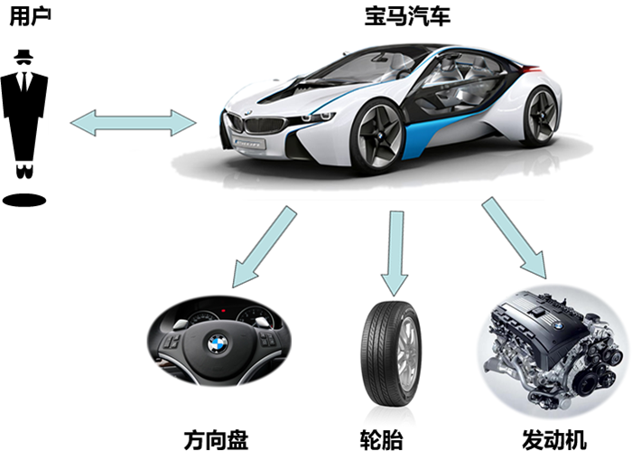
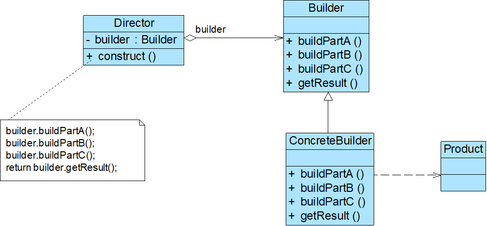
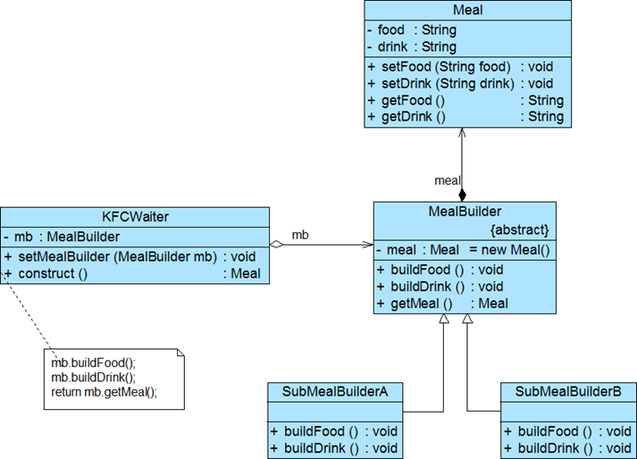

# 建造者模式


<!--more-->

## 模式动机



## 模式定义

- 建造者模式(Builder Pattern)：将一个复杂对象的构建与它的表示分离，使得同样的构建过程可以创建不同的表示。
- 建造者模式是一步一步创建一个复杂的对象，它允许用户只通过指定复杂对象的类型和内容就可以构建它们，用户不需要知道内部的具体构建细节。建造者模式属于对象创建型模式。


## 模式分析

将客户端与包含多个部件的复杂对象的创建过程分离，客户端无须知道复杂对象的内部组成部分与装配方式，只需要知道所需建造者的类型即可

关注如何逐步创建一个复杂的对象，不同的建造者定义了不同的创建过程



## 代码示例

建造者模式可以用于描述KFC如何创建套餐：套餐是一个复杂对象，它一般包含主食（如汉堡、鸡肉卷等）和饮料（如果汁、可乐等）等组成部分，不同的套餐有不同的组成部分，而KFC的服务员可以根据顾客的要求，一步一步装配这些组成部分，构造一份完整的套餐，然后返回给顾客。





产品类Meal：

```java
public class Meal {
    private String food;
    private String drink;

    public String getFood() {
        return food;
    }

    public void setFood(String food) {
        this.food = food;
    }

    public String getDrink() {
        return drink;
    }

    public void setDrink(String drink) {
        this.drink = drink;
    }
}
```

抽象建造者类MealBuilder:

```java
public abstract class MealBuilder {
    protected Meal meal=new Meal();

    public abstract void buildFood();
    public abstract void buildDrink();
    public Meal getMeal(){
        return this.meal;
    }
}
```

具体建造者类（A套餐）

```java
public class SubMealBuilderA extends MealBuilder {
    @Override
    public void buildFood() {
        meal.setFood("一个鸡腿");
    }

    @Override
    public void buildDrink() {
        meal.setDrink("一杯可乐");
    }
}
```

具体建造者类（B套餐）

```java
public class SubMealBuilderB extends MealBuilder {
    @Override
    public void buildFood() {
        meal.setFood("一个鸡肉卷");
    }

    @Override
    public void buildDrink() {
        meal.setDrink("一杯果汁");
    }
}
```

指挥者类（KFCWaiter）

```java
public class KFCWaiter {
    private MealBuilder mealBuilder;
    public void setMealBuilder(MealBuilder mealBuilder){
        this.mealBuilder=mealBuilder;
    }
    public Meal construct(){
        mealBuilder.buildFood();
        mealBuilder.buildDrink();
        return mealBuilder.getMeal();
    }
}
```

辅助代码与前面类似。。。。。。

客户端类：

```java
public class Client {
    public static void main(String args[]) {

        try {
            MealBuilder mealBuilder= (MealBuilder) XMLUtilTV.getType();
            KFCWaiter kfcWaiter=new KFCWaiter();
            kfcWaiter.setMealBuilder(mealBuilder);
            Meal meal = kfcWaiter.construct();
            System.out.println("套餐组成");
            System.out.println(meal.getFood());
            System.out.println(meal.getDrink());

        } catch (Exception e) {
            e.printStackTrace();
        }
    }
}
```


## 优点

- 客户端不必知道产品内部组成的细节，将产品本身与产品的创建过程解耦，使得相同的创建过程可以创建不同的产品对象
- 每一个具体建造者都相对独立，与其他的具体建造者无关，因此可以很方便地替换具体建造者或增加新的具体建造者，扩展方便，符合开闭原则
- 可以更加精细地控制产品的创建过程

## 缺点

- 建造者模式所创建的产品一般具有较多的共同点，其组成部分相似，如果产品之间的差异性很大，不适合使用建造者模式，因此其使用范围受到一定的限制
- 如果产品的内部变化复杂，可能会需要定义很多具体建造者类来实现这种变化，导致系统变得很庞大，增加了系统的理解难度和运行成本

## 应用场景

- 需要生成的产品对象有复杂的内部结构，这些产品对象通常包含多个成员变量
- 需要生成的产品对象的属性相互依赖，需要指定其生成顺序
- 对象的创建过程独立于创建该对象的类。在建造者模式中通过引入了指挥者类，将创建过程封装在指挥者类中，而不在建造者类和客户类中
- 隔离复杂对象的创建和使用，并使得相同的创建过程可以创建不同的产品

