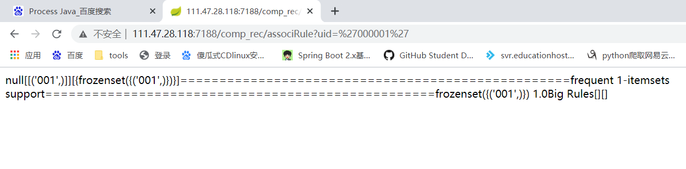

# 微服务compose+Dockerfile部署


<!--more-->

## 单个微服务部署应用环境：

- Java：8
- python3(pymysql、pandas、numpy、sklearn)

## 主代码功能：

​	利用Java与前端交互，Java调用python文件以线程的方式在本地执行，Java也有一个python的依赖，但是可定制读不高，python库支持不完全。

## 解决思路：

​	Java利用Process运行外部运行python命令以绝对路径运行py文件，做到java的jar包与python文件解耦，同时，python文件中用到的MySQL环境参数以环境变量获得。

## Java代码：

```java
@GetMapping("/associRule")
    @ApiOperation("使用关联规则推荐比赛")
    public String test(String uid){
        Process proc;
        String line = null;
        try {
            String[] args1 = new String[] { "python",
                    "/data/comp_reco_AssociRule.py",uid};
            //python.exe处为你系统中python的安装位置；python.py为想要执行的python文件位置；test为想要传的参数
            //proc = Runtime.getRuntime().exec("python.exe python.py ");// 执行py文件 不传参数
            proc=Runtime.getRuntime().exec(args1);
            //用输入输出流来截取结果
            BufferedReader in = new BufferedReader(new InputStreamReader(proc.getInputStream(),"gbk"));

            String temp=null;
            while ((temp = in.readLine()) != null) {
                line+=temp;
            }
            in.close();
            proc.waitFor();
        } catch (IOException e) {
            e.printStackTrace();
        } catch (InterruptedException e) {
            e.printStackTrace();
        }
        return line;
    }
```

## python部分代码：

```python
# 主要展示获取环境变量
if __name__ == "__main__":
    import os
    hostserver=os.environ.get('DATASOURCE_HOST')
    username=os.environ.get('DATASOURCE_USERNAME')
    pwd=os.environ.get('DATASOURCE_PASSWORD')
    import pandas as pd
    import pymysql
    conn = pymysql.connect(host=hostserver, port=3306, user=username, passwd=pwd,charset="utf8")
```

## dockerfile:

docker环境要求，Java与python环境，挂载必要的目录，各部分解耦，方便修改代码：

```dockerfile
#Dockerfile_comp_rec

# NOTE: this docker file is used to build runtime environment.
# The project is a python app which contains a java jar lib.

FROM python:3
MAINTAINER yangpf <cherishpf@163.com>

# COPY ./requirements.txt /usr/local/src/requirements.txt

RUN set -eux; \
    apt-get update; \
    apt-get install -y --no-install-recommends \
        bzip2 \
        unzip \
        xz-utils \
        \
# utilities for keeping Debian and OpenJDK CA certificates in sync
        ca-certificates p11-kit \
#       \
# java.lang.UnsatisfiedLinkError: /usr/local/openjdk-11/lib/libfontmanager.so: libfreetype.so.6: cannot open shared object file: No such file or directory
# java.lang.NoClassDefFoundError: Could not initialize class sun.awt.X11FontManager
# https://github.com/docker-library/openjdk/pull/235#issuecomment-424466077
        fontconfig libfreetype6 \
    ; \
    rm -rf /var/lib/apt/lists/*

# Default to UTF-8 file.encoding
ENV LANG C.UTF-8

ENV JAVA_HOME /usr/local/openjdk-8
ENV PATH $JAVA_HOME/bin:$PATH

# backwards compatibility shim
RUN { echo '#/bin/sh'; echo 'echo "$JAVA_HOME"'; } > /usr/local/bin/docker-java-home && chmod +x /usr/local/bin/docker-java-home && [ "$JAVA_HOME" = "$(docker-java-home)" ]

# https://adoptopenjdk.net/upstream.html
# >
# > What are these binaries?
# >
# > These binaries are built by Red Hat on their infrastructure on behalf of the OpenJDK jdk8u and jdk11u projects. The binaries are created from the unmodified source code at OpenJDK. Although no formal support agreement is provided, please report any bugs you may find to https://bugs.java.com/.
# >
ENV JAVA_VERSION 8u252
ENV JAVA_BASE_URL https://github.com/AdoptOpenJDK/openjdk8-upstream-binaries/releases/download/jdk8u252-b09/OpenJDK8U-jre_
ENV JAVA_URL_VERSION 8u252b09
# https://github.com/docker-library/openjdk/issues/320#issuecomment-494050246
# >
# > I am the OpenJDK 8 and 11 Updates OpenJDK project lead.
# > ...
# > While it is true that the OpenJDK Governing Board has not sanctioned those releases, they (or rather we, since I am a member) didn't sanction Oracle's OpenJDK releases either. As far as I am aware, the lead of an OpenJDK project is entitled to release binary builds, and there is clearly a need for them.
# >

RUN set -eux; \
    \
    dpkgArch="$(dpkg --print-architecture)"; \
    case "$dpkgArch" in \
        amd64) upstreamArch='x64' ;; \
        arm64) upstreamArch='aarch64' ;; \
        *) echo >&2 "error: unsupported architecture: $dpkgArch" ;; \
    esac; \
    \
    wget -O openjdk.tgz.asc "${JAVA_BASE_URL}${upstreamArch}_linux_${JAVA_URL_VERSION}.tar.gz.sign"; \
    wget -O openjdk.tgz "${JAVA_BASE_URL}${upstreamArch}_linux_${JAVA_URL_VERSION}.tar.gz" --progress=dot:giga; \
    \
    export GNUPGHOME="$(mktemp -d)"; \
# TODO find a good link for users to verify this key is right (https://mail.openjdk.java.net/pipermail/jdk-updates-dev/2019-April/000951.html is one of the only mentions of it I can find); perhaps a note added to https://adoptopenjdk.net/upstream.html would make sense?
# no-self-sigs-only: https://salsa.debian.org/debian/gnupg2/commit/c93ca04a53569916308b369c8b218dad5ae8fe07
    gpg --batch --keyserver ha.pool.sks-keyservers.net --keyserver-options no-self-sigs-only --recv-keys CA5F11C6CE22644D42C6AC4492EF8D39DC13168F; \
# also verify that key was signed by Andrew Haley (the OpenJDK 8 and 11 Updates OpenJDK project lead)
# (https://github.com/docker-library/openjdk/pull/322#discussion_r286839190)
    gpg --batch --keyserver ha.pool.sks-keyservers.net --recv-keys EAC843EBD3EFDB98CC772FADA5CD6035332FA671; \
    gpg --batch --list-sigs --keyid-format 0xLONG CA5F11C6CE22644D42C6AC4492EF8D39DC13168F \
        | tee /dev/stderr \
        | grep '0xA5CD6035332FA671' \
        | grep 'Andrew Haley'; \
    gpg --batch --verify openjdk.tgz.asc openjdk.tgz; \
    gpgconf --kill all; \
    rm -rf "$GNUPGHOME"; \
    \
    mkdir -p "$JAVA_HOME"; \
    tar --extract \
        --file openjdk.tgz \
        --directory "$JAVA_HOME" \
        --strip-components 1 \
        --no-same-owner \
    ; \
    rm openjdk.tgz*; \
    \
# TODO strip "demo" and "man" folders?
    \
# update "cacerts" bundle to use Debian's CA certificates (and make sure it stays up-to-date with changes to Debian's store)
# see https://github.com/docker-library/openjdk/issues/327
#     http://rabexc.org/posts/certificates-not-working-java#comment-4099504075
#     https://salsa.debian.org/java-team/ca-certificates-java/blob/3e51a84e9104823319abeb31f880580e46f45a98/debian/jks-keystore.hook.in
#     https://git.alpinelinux.org/aports/tree/community/java-cacerts/APKBUILD?id=761af65f38b4570093461e6546dcf6b179d2b624#n29
    { \
        echo '#!/usr/bin/env bash'; \
        echo 'set -Eeuo pipefail'; \
        echo 'if ! [ -d "$JAVA_HOME" ]; then echo >&2 "error: missing JAVA_HOME environment variable"; exit 1; fi'; \
# 8-jdk uses "$JAVA_HOME/jre/lib/security/cacerts" and 8-jre and 11+ uses "$JAVA_HOME/lib/security/cacerts" directly (no "jre" directory)
        echo 'cacertsFile=; for f in "$JAVA_HOME/lib/security/cacerts" "$JAVA_HOME/jre/lib/security/cacerts"; do if [ -e "$f" ]; then cacertsFile="$f"; break; fi; done'; \
        echo 'if [ -z "$cacertsFile" ] || ! [ -f "$cacertsFile" ]; then echo >&2 "error: failed to find cacerts file in $JAVA_HOME"; exit 1; fi'; \
        echo 'trust extract --overwrite --format=java-cacerts --filter=ca-anchors --purpose=server-auth "$cacertsFile"'; \
    } > /etc/ca-certificates/update.d/docker-openjdk; \
    chmod +x /etc/ca-certificates/update.d/docker-openjdk; \
    /etc/ca-certificates/update.d/docker-openjdk; \
    \
# https://github.com/docker-library/openjdk/issues/331#issuecomment-498834472
    find "$JAVA_HOME/lib" -name '*.so' -exec dirname '{}' ';' | sort -u > /etc/ld.so.conf.d/docker-openjdk.conf; \
    ldconfig; \
    \
# basic smoke test
    java -version

# RUN pip install --no-cache-dir -r /usr/local/src/requirements.txt  -i https://pypi.tuna.tsinghua.edu.cn/simple
RUN pip install pandas  -i https://pypi.tuna.tsinghua.edu.cn/simple
RUN pip install pymysql --no-cache-dir -i https://pypi.tuna.tsinghua.edu.cn/simple
RUN pip install numpy --no-cache-dir -i https://pypi.tuna.tsinghua.edu.cn/simple

RUN pip install sklearn --no-cache-dir -i https://pypi.tuna.tsinghua.edu.cn/simple

# If you're reading this and have any feedback on how this image could be
# improved, please open an issue or a pull request so we can discuss it!
#
# https://github.com/docker-library/openjdk/issues
```

## compose脚本，需要加入微服务网络，环境文件：

```yml
version: '3'
networks:
  dockercompose_sc-net:
    external: true
services:
  #人员信息服务
  comp_rec:
    build:
      context: ./Dockerfiles
      dockerfile: Dockerfile_comp_rec
    container_name: sc-comp_rec
    restart: always
    networks:
      - "dockercompose_sc-net"
    ports:
      - 5000:9007
    volumes:
      - "/home/hubu/dockerfiles/comp_rec:/data"

    command: ["java", "-jar", "/data/comp_rec.jar"]
    env_file: .env
```

## .env文件（主要存代码中用到的变量，以环境变量进入容器）

```
DATASOURCE_DBTYPE=sc-mysql
DATASOURCE_HOST=mysql
DATASOURCE_PORT=3306
DATASOURCE_USERNAME=root
DATASOURCE_PASSWORD=root123
DATASOURCE_DRIVER=com.mysql.jdbc.Driver
```

## 启动停止单个服务命令：

```shell
docker-compose -f docker-compose_comp_rec.yml up -d
docker-compose -f docker-compose_comp_rec.yml down 
```

接口测试：


