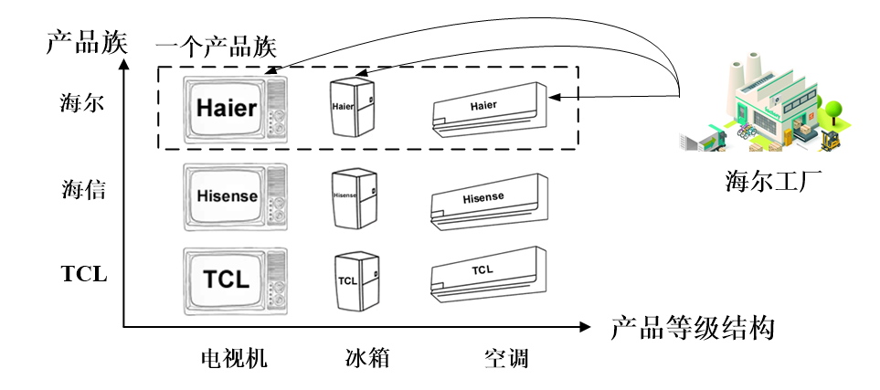
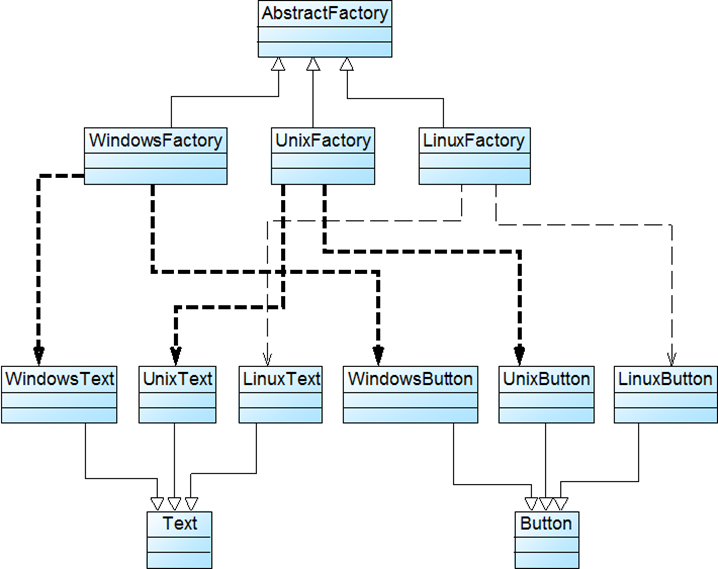
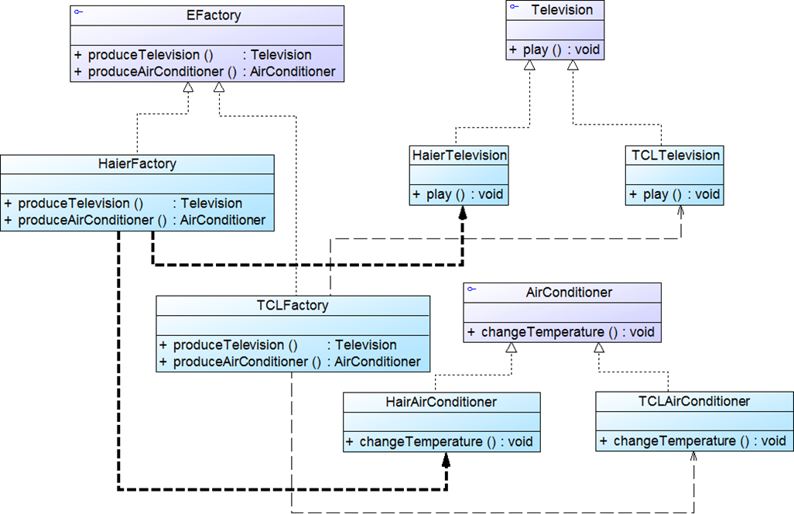

# 抽象工厂模式


<!--more-->

## 模式动机

**产品等级结构：**产品等级结构即产品的继承结构，例如一个抽象类是电视机，其子类有海尔电视机、海信电视机、TCL电视机，则抽象电视机与具体品牌的电视机之间构成了一个产品等级结构，抽象电视机是父类，而具体品牌的电视机是其子类。

**产品族：**在抽象工厂模式中，产品族是指由同一个工厂生产的，位于不同产品等级结构中的一组产品，例如海尔电器工厂生产的海尔电视机、海尔电冰箱，海尔电视机位于电视机产品等级结构中，海尔电冰箱位于电冰箱产品等级结构中。



## 模式定义

抽象工厂模式(Abstract Factory Pattern)：提供一个创建一系列相关或相互依赖对象的接口，而无须指定它们具体的类。抽象工厂模式又称为Kit模式，属于对象创建型模式。



## 模式分析


## 代码示例

一个电器工厂可以产生多种类型的电器，如海尔工厂可以生产海尔电视机、海尔空调等，TCL工厂可以生产TCL电视机、TCL空调等，相同品牌的电器构成一个产品族，而相同类型的电器构成了一个产品等级结构，现使用抽象工厂模式模拟该场景。





抽象产品接口：

```java
public interface TV {
    public void play();
}
```

具体产品类：

```java
public class HairTV implements TV {
    @Override
    public void play() {
        System.out.println("海尔电视播放中、、、、、");
    }
}
```

```java
public class HisenseTV implements TV {
    @Override
    public void play() {
        System.out.println("海信电视播放中、、、");
    }
}
```

抽象工厂类：

```java
public interface Factory {
    TV produceTV();
    AirCondition produceAC();
}
```

具体工厂类:

```java
public class HairFactory implements Factory {

    @Override
    public TV produceTV() {
        System.out.println("海尔工厂生产海尔电视机。");
        return new HairTV();
    }

    @Override
    public AirCondition produceAC() {
        System.out.println("海尔工厂生产海尔空调。");
        return new HairAirCondition();
    }
}
```

```java
public class HisenseFactory implements Factory {

    @Override
    public TV produceTV() {
        System.out.println("海信电视机工厂生产海信电视机。");
        return new HisenseTV();
    }

    @Override
    public AirCondition produceAC() {
        System.out.println("海信没有空调");
        return null;
    }
}
```

```
public class TCLFactory implements Factory {
    @Override
    public TV produceTV() {
        System.out.println("TCL工厂类正在生产电视");
        return new TCLTV();
    }

    @Override
    public AirCondition produceAC() {
        System.out.println("CL工厂类正在生产空调");
        return new TCLAirCondition();
    }
}
```

产品族抽象类：

```java
public interface AirCondition {
    void changeTemp();
}
```

具体实现类：

```java
public class TCLAirCondition implements AirCondition {
    @Override
    public void changeTemp() {
        System.out.println("TC课堂正在调节温度");
    }
}
```

```java
public class HairAirCondition implements AirCondition {
    @Override
    public void changeTemp() {
        System.out.println("海尔空调正在调节温度");
    }
}
```

辅助工具类：

```java
public class XMLUtilTV {
    public static Object getType(){
        try{
            DocumentBuilderFactory documentBuilderFactory=DocumentBuilderFactory.newInstance();
            DocumentBuilder documentBuilder=documentBuilderFactory.newDocumentBuilder();
            Document document;
            document= documentBuilder.parse(new File("config.xml"));

            NodeList nodeList=document.getElementsByTagName("type");
            Node classNode=nodeList.item(0).getFirstChild();
            String string=classNode.getNodeValue().trim();
            System.out.println(string);
            Class c=Class.forName("io.hubu8.com."+string);
            Object obj=c.newInstance();
            return obj;

        }catch (Exception e) {
            e.printStackTrace();
            return null;
        }
    }
}
```

xml文件：

```xml
<?xml version="1.0" encoding="ISO-8859-1"?>

<config>
    <type>HairFactory</type>
</config>
```

客户端：

```java
public class Client {
    public static void main(String args[]) {

        try {
            TV tv;
            AirCondition airCondition;
            Factory factory=(Factory) XMLUtilTV.getType();
            tv=factory.produceTV();
            tv.play();
            airCondition=factory.produceAC();
            airCondition.changeTemp();
        } catch (Exception e) {
            e.printStackTrace();
        }
    }
}
```

```shell
TCLFactory
TCL工厂类正在生产电视
TCL电视正在播放中、、、
CL工厂类正在生产空调
TC课堂正在调节温度
```


## 优点

- 隔离了具体类的生成，使得客户端并不需要知道什么被创建
- 当一个产品族中的多个对象被设计成一起工作时，它能够保证客户端始终只使用同一个产品族中的对象
- 增加新的产品族很方便，无须修改已有系统，符合开闭原则

## 缺点

- 增加新的产品等级结构麻烦，需要对原有系统进行较大的修改，甚至需要修改抽象层代码，这显然会带来较大的不便，违背了开闭原则


## 应用场景

- 一个系统不应当依赖于产品类实例如何被创建、组合和表达的细节
- 系统中有多于一个的产品族，但每次只使用其中某一产品族
- 属于同一个产品族的产品将在一起使用，这一约束必须在系统的设计中体现出来
- 产品等级结构稳定，在设计完成之后不会向系统中增加新的产品等级结构或者删除已有的产品等级结构

