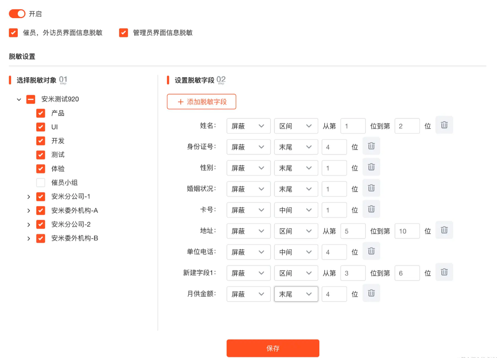

# 数据脱敏实现：想在哪脱就在哪脱，想脱谁就脱谁！！！


<!--more-->

## 1.背景

在当下互联网高速发展的时代下，涉及到用户的隐私数据安全越发重要，一旦泄露将造成不可估量的后果。所以现在的业务系统开发中都会对用户隐私数据加密之后存储落库，同时还要求后端返回数据给前台之前进行数据脱敏。所谓脱敏处理其实就是将数据进行混淆隐藏，如将用户的手机号脱敏展示为`178****5939，采用 * 进行隐藏，以免泄露个人隐私信息。其实我之前就总结过相关联的功能实现：[《实现数据加密存储、模糊匹配和脱敏》](https://link.juejin.cn?target=https%3A%2F%2Fmp.weixin.qq.com%2Fs%3F__biz%3DMzg5MDY1NzI0MQ%3D%3D%26mid%3D2247486100%26idx%3D1%26sn%3Df024472b7ab30f789e30914b384b44d2%26chksm%3Dcfd80a22f8af8334eacef32b903256b85de9b4078ef55b6c62882cffc8535d394dcfcb2f4785%26token%3D481635886%26lang%3Dzh_CN%23rd) 但是强调一下今天这里并不是重复再讲一遍，而是在之前总结的基础上进行延伸拓展，重点在于标题里的：**动态灵活可配置**。那什么是动态灵活可配置呢？且听我娓娓道来。

那是一个惬意的下午时光，我听着歌，敲着一手代码......，突然间产品就来到我桌前，打断了我短暂的文思泉涌高光时刻，企图给我安排一个折磨的活，打开了奶茶app，暗示没有一杯奶茶解决不了的需求。是的最后这活我接了，也就是我们今天所要讲的数据脱敏由之前的前端脱敏改为后端，当然脱敏功能本身并不复杂难实现，那为啥说它是折磨人的活呢？普通的脱敏功能大概是这样的，也就是脱敏上面所说的用户固定隐私数据：`姓名、手机号、身份证号、地址、身份证...等`，但是我们的系统需求要求不只是前面的字段，还需要支持其他字段，一句话生动形象地总结概括就是**客户想脱啥就脱啥，想在哪脱就在哪脱**，包括我们系统支持的自定义字段，都可以通过配置进行脱敏，如下图所示：



由图可知，这个脱敏需求功能涉及到以下几点：

① 哪些字段可以脱敏是可配置的，脱敏规则也是可配置的，比如说什么开头、中间、结尾，区间啥的。

② 脱敏设计到组织架构过滤，也就是说需要实现某个部门下的用户看到的数据是脱敏的，某个部门下的用户看到的数据是不脱敏的。这感觉就像后端接口功能菜单权限检验，判断当前用户是否有调用某个功能菜单接口的权限。

③ 涉及到角色的判断，某些角色需要脱敏(小喽啰不给看，防止把客户数据卖了~)，而某些角色不需要(管理员随便看，随便卖~)。

这里我们暂且不讨论脱敏功能这么设计是否合理，反正产品是这样要求实现的，按照上面的列出来的点感觉也还好，也不至于上升到折磨的程度，折磨的是系统的历史原因，要脱敏的字段信息遍布都整个业务系统表单，每个表单的接口数据有冗余的有共用的，这就意味着每个页面表单接口都需要去梳理一遍。同时脱敏字段还涉及到编辑更新功能，而且之前的更新接口都是一个表单整体提交，这就导致一个脱敏字段没有修改，但是前端把脱敏数据传回后端来，又是一个一个去适配啊~~~，难顶。闹骚发完了，言归正传我们接下来看看是如何优雅地实现这个难顶的功能需求。

## 2.实现思路

所谓”优雅“，就是多写一行代码都算我输.....，所以在接口`controller`层返回之前一个一个地进行脱敏操作是不可取的，重复的工作量太多。思来想去，肯定是需要通过切面思想去解决，也就是通过对接口返回的`VO类`需要脱敏的字段使用注解打上标识，然后切面统一逻辑处理，这时候想到之前总结的接口响应结果结构统一封装返回：`@ControllerAdvice`， 不清楚的可跳转：[《Spring Boot如何优雅实现结果统一封装和异常统一处理》](https://link.juejin.cn?target=https%3A%2F%2Fmp.weixin.qq.com%2Fs%3F__biz%3DMzg5MDY1NzI0MQ%3D%3D%26mid%3D2247486185%26idx%3D1%26sn%3D43b44a937a481d0b6539aad487f5014f%26chksm%3Dcfd80a5ff8af834950e923cb2cc8a9ab5caf206c578fea0f95a03309eb9a9ea25ba6e1994d24%26token%3D481635886%26lang%3Dzh_CN%23rd)自行查看，但我们发现使用`@ControllerAdvice`意味着每次调接口都需要我们自己去反射类获取注解判断字段是否需要脱敏，当返回对象比较复杂，需要递归去反射，性能一下子就会降低。反射这个东西确实是框架的灵魂，但是在业务接口中用多了也的确对性能有一定影响，所以再三斟酌于是换种了中思路，我们想到了平时使用的`@JsonFormat`，跟我们现在的需求功能场景很类似，通过自定义注解跟字段解析器，对字段进行自定义解析。

```java
  @JsonFormat(pattern = "yyyy-MM-dd")
  private Date recycleDate;
```

这样就可以把字段`recycleDate`转换为日期格式，不需要我们单独代码处理，这就是优雅！！！按照这个思路，我们首先需要定义一个注解进行脱敏字段标注：

```java
@Retention(RetentionPolicy.RUNTIME)
@JacksonAnnotationsInside
@JsonSerialize(using = MaskSerializer.class)
public @interface MaskField {

    /**
     * 脱敏类型
     * @return
     */
    MaskEnum value();
}
```

这个注解很简单，只有一个默认属性`value()`指定字段的脱敏枚举类型`MaskEnum`

`@Retention(RetentionPolicy.RUNTIME)：`运行时生效。

`@Target(ElementType.FIELD)：`可用在字段上。

`@JacksonAnnotationsInside：`此注解可以点进去看一下是一个元注解，主要是用户打包其他注解一起使用。

`@JsonSerialize(using = MaskSerializer.class)`：该注解的作用就是可自定义序列化，可以用在注解上，方法上，字段上，类上，运行时生效等等，根据提供的序列化类里面的重写方法实现自定义序列化。关于`MaskSerializer`就是我们自定义序列化实现脱敏的核心实现所在，后面会详细分析。从注解定义可以，我们给脱敏字段使用注解打标识时，需要指定该字段脱敏类型是什么，所以接下来我们还需要定义脱敏类型枚举类，我们系统大概分为两类：系统字段如(姓名，手机号，身份证号.....等等)，**自定义字段(婚姻状况，月供金额这些额外信息，会存储在数据库一个JSON字段里**)。

```java
public enum MaskEnum {
    /**
     * 中文名
     */
    NAME,
    /**
     * 身份证号
     */
    ID_CARD,
    /**
     * 手机号
     */
    MOBILE,
    /**
     * 地址
     */
    ADDRESS,
    /**
     * 电子邮件
     */
    EMAIL,
    /**
     * 银行卡
     */
    BANK_CARD,

    /**
     * 自定义字段
     */
    CUSTOM_FIELD
}

```

注解和脱敏类型我们都定义好，看样子万事俱备只欠东风啦，我们只需要接下来自定义实现序列化解析器完成脱敏即可，但是你可能忘了文章开头一直强调的：**动态灵活**，我们的脱敏配置信息不是固定的，而是动态配置保存的，这就意味着一个接口的某个字段上一次调用还需要脱敏，紧接着脱敏配置被改了，再调接口该字段就不再需要脱敏，要求我们做到动态的同时还要保证实时性。这如同需要判断功能菜单权限那样通过切面实现判断是否需要脱敏，将脱敏配置信息上下文贯穿整次请求，这里我们在登录认证的过滤器中实现，因为脱敏配置涉及到角色、组织架构，自然是要登录之后才能进行是否需要脱敏判断。

```java
@Component
@Slf4j
public class AuthFilter implements Filter {

  @Autowired private StringRedisTemplate stringRedisTemplate;

  
  
  @Override
  public void doFilter( ServletRequest servletRequest, ServletResponse servletResponse, FilterChain filterChain)
       
       //登录认证逻辑
       // ........
     
      // 登录验证通过之后，就可以登录用户的公司id，设置脱敏配置上下文
      String rule = stringRedisTemplate.opsForValue().get(KeyCache.ORG_DESENSITIZATION_SETTING + company.getId());
      if (StringUtils.isNotBlank(rule)) {
        MaskSetting maskSetting = JSON.parseObject(rule, MaskSetting.class);
        Boolean isMask = false;
        Boolean enable = maskSetting.getEnable() == null ? false : maskSetting.getEnable();
        // 1.先判断脱敏总开关
        if (enable) {
          // 脱敏的组织架构
          List<Long> depTeamIds = maskSetting.getDepTeamIds();
          Boolean userLevelSwitch = maskSetting.getUserLevelSwitch();
          Boolean adminLevelSwitch = maskSetting.getAdminLevelSwitch();
          // 2.脱敏权限角色判断， 如果登录人是坐席或者外访员
          if (Objects.nonNull(roleId) && (UserUtils.isChairMan() || UserUtils.isVisitor())) {
            // 判断催员属于部门是否脱敏
            if (userLevelSwitch && !CollectionUtils.isEmpty(depTeamIds) &&
                    (depTeamIds.contains(userSession.getDepId()) || depTeamIds.contains(userSession.getTeamId()))) {
              isMask = true;
            }
          } else if (Objects.nonNull(roleId) && adminLevelSwitch) {
            // 其余一律按管理员处理
            isMask = true;
          }
        }
        MaskContextHolder.setMask(isMask);
        if (isMask) {
          MaskContextHolder.setMaskSetting(maskSetting);
        }
      }
      filterChain.doFilter(servletRequest, servletResponse);
    } finally {
      MaskContextHolder.clear();
    }
  }

}
```

可以看到我们在过滤器filter中等登录验证校验通过之后，再进行脱敏配置的上下文设置，这里我们是直接在缓存redis中获取登录用户对应公司的脱敏信息配置，脱敏配置在我们SaaS系统是以公司维度配置的，也就是配置了脱敏信息那么对这个公司整体用户都有效果，**而且我们在配置脱敏信息保存落库的同时也会同步保存redis**，我们每次调接口都需要设置脱敏信息上下文，如果这些信息都从数据库获取(由于之前的设计脱敏配置信息要查3张表...)，性能自然是吃不消的，所以我们需要从缓存redis中取脱敏配置，当然上面的实现不太完善，因为直接从redis中取有可能缓存缺失这时候就拿不到脱敏配置了，所以我们需要有一个兜底实现，在缓存中获取不到再去数据库中查询，取到之后设置上下文的同时更新缓存redis，这样下次我们再从redis中就能获取到了，这个兜底实现很简单，可自行实现哦，接下来看看定义的缓存脱敏配置信息：

```java
public class MaskContextHolder {

    /**
     * 当前请求线程上下文：脱敏配置
     */
    private static final ThreadLocal<MaskSetting> maskSettingHolder = new ThreadLocal<>();

    /**
     * 当前请求线程上下文：是否脱敏标识
     */
    private static final ThreadLocal<Boolean> mask = new ThreadLocal<>();


    /**
     * 设置脱敏妹子
     * @param ms
     */
    public static void setMaskSetting(MaskSetting ms) {
        maskSettingHolder.set(ms);
    }

    /**
     * 获取脱敏配置
     * @return
     */
    public static MaskSetting getMaskSetting() {
        return maskSettingHolder.get();
    }


    public static void setMask(Boolean isMask) {
        mask.set(isMask);
    }

    public static Boolean getMask() {
        return mask.get() == null ? Boolean.FALSE : mask.get();
    }


    /**
     * 清除
     */
    public static void clear() {
        maskSettingHolder.remove();
        mask.remove();
    }
}
```

```java
@Data
public class MaskSetting implements Serializable {

    /**
     * 脱敏总开关
     */
    private Boolean enable;

    /**
     * 坐席，外访员界面信息脱敏
     */
    private Boolean userLevelSwitch;

    /**
     * 管理员界面信息脱敏
     */
    private Boolean adminLevelSwitch;

    /**
     * 绑定的需要脱敏的小组或部门id
     */
    private List<Long> depTeamIds;

    /**
     * 脱敏规则
     */
    private List<DesensitizationRuleCreate> rules;
    
}
```

脱敏规则：`DesensitizationRuleCreate`:

```java
@ApiModel(description = "脱敏规则")
@Data
public class DesensitizationRuleCreate {

    @ApiModelProperty(value = "字段英文名称")
    @NotEmpty
    private String name;
    @ApiModelProperty(value = "0：隐藏，1：显示")
    @NotNull
    private Integer type;
    @ApiModelProperty(value = "规则：开头:0 中间:1 末尾: -1 全部: 2 区间：3")
    @NotNull
    private Integer scope;
    @ApiModelProperty(value = "位数")
    private Integer count;
    @ApiModelProperty(value = "开始位数")
    private Integer start;
    @ApiModelProperty(value = "结束位数")
    private Integer end;

}
```

完成脱敏信息上下文设置之后，接下来就是真正自定义实现序列化解析器完成脱敏的时刻啦，话不多说，先看看实现类：

```java
public class MaskSerializer<T> extends JsonSerializer<T> implements ContextualSerializer{

    /**
     * 脱敏类型
     */
    private MaskEnum type;

    private static List<String> ADDRESS = Lists.newArrayList("address", "house_address", "company_address",
            "native_address", "bill_path", "other_address");


    @Override
    public void serialize(T t, JsonGenerator jsonGenerator, SerializerProvider serializerProvider) throws IOException {
        if (Objects.isNull(t)) {
            jsonGenerator.writeObject(t);
            return;
        }
        Boolean isMask = MaskContextHolder.getMask();
        if (!isMask) {
            jsonGenerator.writeObject(t);
            return;
        }
        MaskSetting maskSetting = MaskContextHolder.getMaskSetting();
        List<DesensitizationRuleCreate> rules = maskSetting.getRules();
        if (CollectionUtils.isEmpty(rules)) {
            jsonGenerator.writeObject(t);
            return;
        }
        switch (this.type) {
            case NAME: {
                String s = (String)t;
                DesensitizationRuleCreate rule = rules.stream()
                        .filter(r -> Objects.equals(r.getName(), "name"))
                        .findFirst()
                        .orElse(null);
                jsonGenerator.writeString(MaskUtils.commonMask(s, rule));
                break;
            }
            case ID_CARD: {
                String s = (String)t;
                DesensitizationRuleCreate rule = rules.stream()
                        .filter(r -> Objects.equals(r.getName(), "idCard"))
                        .findFirst()
                        .orElse(null);
                jsonGenerator.writeString(MaskUtils.commonMask(s, rule));
                break;
            }
            case MOBILE: {
                String s = (String)t;
                DesensitizationRuleCreate rule = rules.stream()
                        .filter(r -> Objects.equals(r.getName(), "mobile"))
                        .findFirst()
                        .orElse(null);
                jsonGenerator.writeString(MaskUtils.commonMask(s, rule));
                break;
            }
            case ADDRESS: {
                String s = (String)t;
                DesensitizationRuleCreate rule = rules.stream()
                        .filter(r -> Objects.equals(r.getName(), "address"))
                        .findFirst()
                        .orElse(null);
                jsonGenerator.writeString(MaskUtils.commonMask(s, rule));
                break;
            }
            
            // 自定义字段，是一个<String, String> map
            case CUSTOM_FIELD: {
                // 自定义字段逻辑
                Map<String, String> map = (Map)t;
                map.forEach((k,v) -> {
                    String maskKey = k;
                    // 特殊自定义字段处理
                    if (k.contains("|")) {
                        maskKey = k.substring(0, k.indexOf("|"));
                    }
                    // 一个地址脱敏需要脱敏多个 如：家庭地址，公司地址等
                    if (ADDRESS.contains(k)) {
                        maskKey = "address";
                    }
                    DesensitizationRuleCreate rule = null;
                    // 匹配规则
                    for (DesensitizationRuleCreate r : rules) {
                        if (Objects.equals(r.getName(), maskKey)) {
                            rule = r;
                            break;
                        }
                    }
                    // 脱敏工具类脱敏
                    String maskText = MaskUtils.commonMask(v, rule);
                    map.put(k, maskText);
                });
                jsonGenerator.writeObject(map);
                break;
            }
        }
    }

    /**
    * 统一判断返回的vo类的哪些字段需要脱敏
    * 这里也是通过反射判断字段是否打上自己标识，但是这个方法只会执行一次，
    * 也就是接口第一次调用会执行，后面就不需要执行，因为这些Spring考虑到这些打注解标识解析就不会再变，没别要每次都来解析浪费性能
    */
    @Override
    public JsonSerializer <?> createContextual(SerializerProvider serializerProvider, BeanProperty beanProperty) throws JsonMappingException {
        // 为空直接跳过
        if (beanProperty == null) {
            return serializerProvider.findNullValueSerializer(beanProperty);
        }
        // 非String类直接跳过
        if (Objects.equals(beanProperty.getType().getRawClass(), String.class) || Objects.equals(beanProperty.getType().getRawClass(), Map.class)) {
            MaskField maskField = beanProperty.getAnnotation(MaskField.class);
            if (maskField == null) {
                maskField = beanProperty.getContextAnnotation(MaskField.class);
            }
            if (maskField != null) {
                // 如果能得到注解，就将注解的 value 传入 MaskSerialize
                return new MaskSerializer(maskField.value());
            }
        }
        return serializerProvider.findValueSerializer(beanProperty.getType(), beanProperty);
    }


    public MaskSerializer() {}

    public MaskSerializer(final MaskEnum type) {
        this.type = type;
    }
}
```

`JsonSerializer`可以实现的附加接口以获取回调，该回调可用于创建序列化程序的上下文实例以用于处理支持类型的属性。这对于可以通过注释配置的序列化程序很有用，或者应该根据正在序列化的属性类型而具有不同的行为

`#createContextual()`可以获得字段的类型以及注解，**该方法只会在第一次序列化字段时调用（因为字段的上下文信息在运行期不会改变），所以不用担心影响性能。**

最后来看看脱敏工具类实现，流行的`Hutool`工具包实现了脱敏，先引入依赖：

```
<dependency>
    <groupId>cn.hutool</groupId>
    <artifactId>hutool-all</artifactId>
    <version>5.8.16</version>
</dependency>
```

现阶段最新版本的Hutool支持的脱敏数据类型如下，基本覆盖了常见的敏感信息：`用户id、中文姓名、身份证号、座机号、手机号、地址、电子邮件、密码 、中国大陆车牌、银行卡`

**注意** ：Hutool 脱敏是通过*来代替敏感信息的，具体实现是在StrUtil.hide方法中，如果我们想要自定义隐藏符号，则可以把Hutool的源码拷出来，重新实现即可。

但是根据上文介绍我们脱敏规则是自定义的，所以我们需要得自己实现一个脱敏工具类`MaskUtils`:

```java
@Slf4j
public class MaskUtils {


    /**
     * [中文姓名] 只显示第一个汉字，其他隐藏为2个星号<例子：李**>
     */
    public static String chineseName(final String fullName) {
        if (StringUtils.isBlank(fullName)) {
            return "";
        }
        final String name = StringUtils.left(fullName, 1);
        return StringUtils.rightPad(name, StringUtils.length(fullName), "*");
    }

    /**
     * [中文姓名] 只显示第一个汉字，其他隐藏为2个星号<例子：李**>
     */
    public static String chineseName(final String familyName, final String givenName) {
        if (StringUtils.isBlank(familyName) || StringUtils.isBlank(givenName)) {
            return "";
        }
        return chineseName(familyName + givenName);
    }

    /**
     * [身份证号] 显示最后四位，其他隐藏。共计18位或者15位。<例子：420**********5762>
     */
    public static String idCardNum(final String id) {
        if (StringUtils.isBlank(id)) {
            return "";
        }

        return StringUtils.left(id, 3).concat(StringUtils
                .removeStart(StringUtils.leftPad(StringUtils.right(id, 4), StringUtils.length(id), "*"),
                        "***"));
    }

    /**
     * [固定电话] 后四位，其他隐藏<例子：****1234>
     */
    public static String fixedPhone(final String num) {
        if (StringUtils.isBlank(num)) {
            return "";
        }
        return StringUtils.leftPad(StringUtils.right(num, 4), StringUtils.length(num), "*");
    }

    /**
     * [手机号码] 前三位，后四位，其他隐藏<例子:138******1234>
     */
    public static String mobilePhone(final String num) {
        if (StringUtils.isBlank(num)) {
            return "";
        }
        return StringUtils.left(num, 3).concat(StringUtils
                .removeStart(StringUtils.leftPad(StringUtils.right(num, 4), StringUtils.length(num), "*"),
                        "***"));

    }

    /**
     * [地址] 只显示到地区，不显示详细地址；我们要对个人信息增强保护<例子：北京市海淀区****>
     *
     * @param sensitiveSize 敏感信息长度
     */
    public static String address(final String address, final int sensitiveSize) {
        if (StringUtils.isBlank(address)) {
            return "";
        }
        final int length = StringUtils.length(address);
        return StringUtils.rightPad(StringUtils.left(address, length - sensitiveSize), length, "*");
    }

    /**
     * [电子邮箱] 邮箱前缀仅显示第一个字母，前缀其他隐藏，用星号代替，@及后面的地址显示<例子:g**@163.com>
     */
    public static String email(final String email) {
        if (StringUtils.isBlank(email)) {
            return "";
        }
        final int index = StringUtils.indexOf(email, "@");
        if (index <= 1) {
            return email;
        } else {
            return StringUtils.rightPad(StringUtils.left(email, 1), index, "*")
                    .concat(StringUtils.mid(email, index, StringUtils.length(email)));
        }
    }

    /**
     * [银行卡号] 前六位，后四位，其他用星号隐藏每位1个星号<例子:6222600**********1234>
     */
    public static String bankCard(final String cardNum) {
        if (StringUtils.isBlank(cardNum)) {
            return "";
        }
        return StringUtils.left(cardNum, 6).concat(StringUtils.removeStart(
                StringUtils.leftPad(StringUtils.right(cardNum, 4), StringUtils.length(cardNum), "*"),
                "******"));
    }

    /**
     * [api秘钥] 前3位，后3位，其他用星号隐藏每位1个星号<例子:Aj3**********8Kl>
     */
    public static String apiSecret(final String cardNum) {
        if (StringUtils.isBlank(cardNum)) {
            return "";
        }
        return StringUtils.left(cardNum, 3).concat(StringUtils.removeStart(
                StringUtils.leftPad(StringUtils.right(cardNum, 3), StringUtils.length(cardNum), "*"),
                "******"));
    }

    public static String commonMask(String text, DesensitizationRuleCreate rule) {
        if (StringUtils.isBlank(text) || Objects.isNull(rule)) {
            return text;
        }
        int length = text.length();
        // 0：隐藏，1：显示
        Integer type = rule.getType();
        // 开头:0 中间:1 末尾: -1 全部: 2 区间：3
        Integer scope = rule.getScope();
        Integer count = rule.getCount();
        Integer start = rule.getStart();
        Integer end = rule.getEnd();

        try {
            StringBuilder ms = new StringBuilder();
            // 开头count位
            if (scope == 0) {
                for (int i = 0; i < length; i++) {
                    if (i < count) {
                        if (type == 0) ms.append("*");
                        if (type == 1) ms.append(text.charAt(i));
                    } else {
                        if (type == 0) ms.append(text.charAt(i));
                        if (type == 1) ms.append("*");
                    }
                }
            }
            if (scope == 1) {
                // 中间count位
                int mid = length/2;
                int left = mid - count/2;
                left = left < 0 ? 0 : left;
                int right = mid + count/2 - (count%2==0? 1: 0);
                for (int i = 0; i < length; i++) {
                    if (i >= left && i <= right) {
                        if (type == 0) ms.append("*");
                        if (type == 1) ms.append(text.charAt(i));
                    } else {
                        if (type == 0) ms.append(text.charAt(i));
                        if (type == 1) ms.append("*");
                    }
                }
            }
            if (scope == -1) {
                // 末尾屏蔽count位
                int n = length - count;
                n = n < 0 ? 0 : n;
                for (int i = 0 ; i < length; i++) {
                    if (i >= n) {
                        if (type == 0) ms.append("*");
                        if (type == 1) ms.append(text.charAt(i));
                    } else {
                        if (type == 0) ms.append(text.charAt(i));
                        if (type == 1) ms.append("*");
                    }
                }
            }
            if (scope == 2) {
                // 全部
                for (int i = 0; i < length; i++) {
                    if (type == 0) ms.append("*");
                    if (type == 1) ms.append(text.charAt(i));
                }
            }
            if (scope == 3) {
                // 区间
                for (int i = 0; i < length; i++) {
                    if (i >= start -1  && i <= end - 1) {
                        if (type == 0) ms.append("*");
                        if (type == 1) ms.append(text.charAt(i));
                    } else {
                        if (type == 0) ms.append(text.charAt(i));
                        if (type == 1) ms.append("*");
                    }
                }
            }
            return ms.toString();
        } catch (Exception e) {
           log.error("脱敏转换失败：", e);
        }
        return text;
    }

    public static void main(String[] args) {
        String text = "17816875939";
        DesensitizationRuleCreate rule = new DesensitizationRuleCreate();
        rule.setType(0);
        rule.setScope(1);
        rule.setCount(8);
        String s = commonMask(text, rule);
        System.out.println(s);

    }


}
```

**使用示例**：对某个接口的VO类字段进行脱敏打上注解：

```java
@Data
public class CaseInfoVO extends Base {
  private static final long serialVersionUID = -3251366134027639518L;


  @ApiModelProperty(value = "姓名")
  @MaskField(MaskEnum.NAME)
  private String name;

  @ApiModelProperty(value = "身份证号码")
  @MaskField(MaskEnum.ID_CARD)
  private String idCard;

  @ApiModelProperty(value = "电话号码")
  @MaskField(MaskEnum.MOBILE)
  private String mobile;
  
  @ApiModelProperty(value = "自定义字段")
  @MaskField(MaskEnum.CUSTOM_FIELD)
  private Map<String, String> fields;
  
  ......
  
}  
```

掉接口的响应结果如下：

```json
{
    "status": 200,
    "message": "success",
    "data": {
        "id": 11592359,
        "name": "郑**",
        "idCard": "33010219601031****",
        "mobile": "*******0030",
        "fields": {
            "company_phone": "10922220040",
            "penalty_date": "2023-05-30",
            "amount_paid": "51.00",
            "capital": "129.00",
            "occupation": "职业030",
            "late_fee": "44.00",
            "nation": "壮*",
            "age": "*3",
            "contacts": "*******0040"
        },
        
        ......
    },
    "success": true
}
```

## 3.总结

以上全部就是本期关于数据脱敏知识点的总结介绍啦。 首先介绍了数据脱敏需求的背景、概念和重要性，紧接着我们逐步探讨实现方案，权衡利弊了相关实现选择，最终选择`Spring Boot`的自带的`jackson`自定义序列化实现，它的实现原来其实就是在json进行序列化渲染给前端时，进行脱敏，这样可以有效降低性能损耗，并且也不会侵入系统业务层逻辑这样可以保证我们的业务逻辑不会因为数据脱敏出现逻辑错误。与此同时也强调了**动态灵活可配置**的脱敏信息配置，我们通过拦截器实现脱敏信息上下文设置，在上面思路我们进行代码实现剖析和实操，借助于`Hutool`工具类提供的脱敏功能，完美实现了字段脱敏。


作者：Shepherd

链接：https://juejin.cn/post/7329141961092186164

来源：稀土掘金

著作权归作者所有。商业转载请联系作者获得授权，非商业转载请注明出处。
