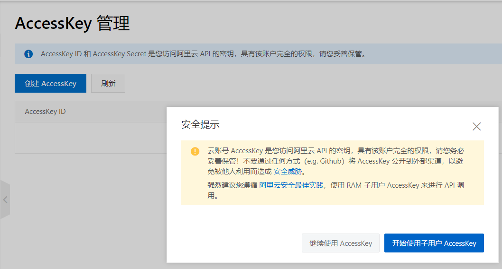
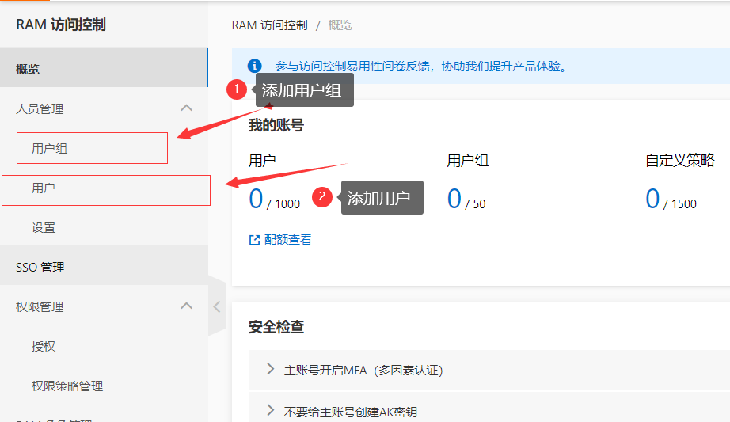
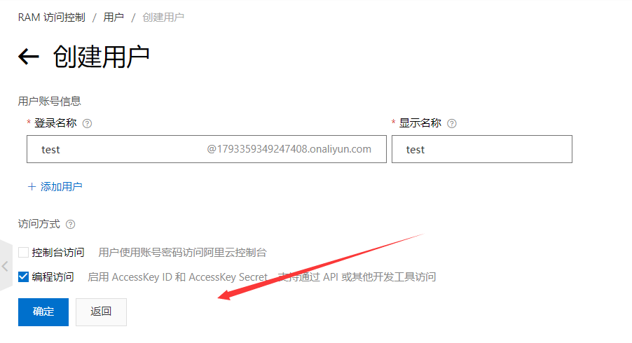
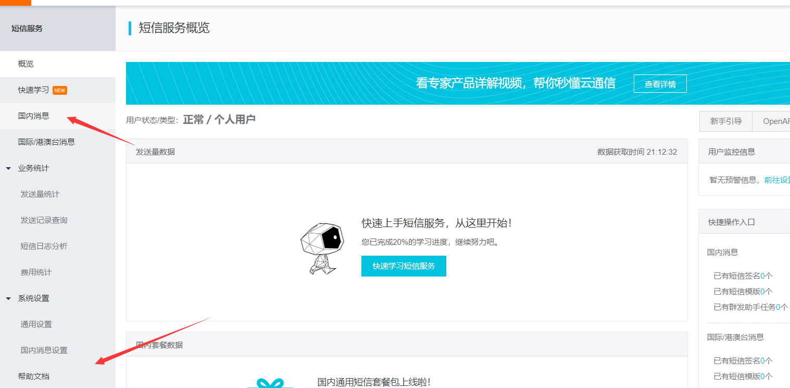
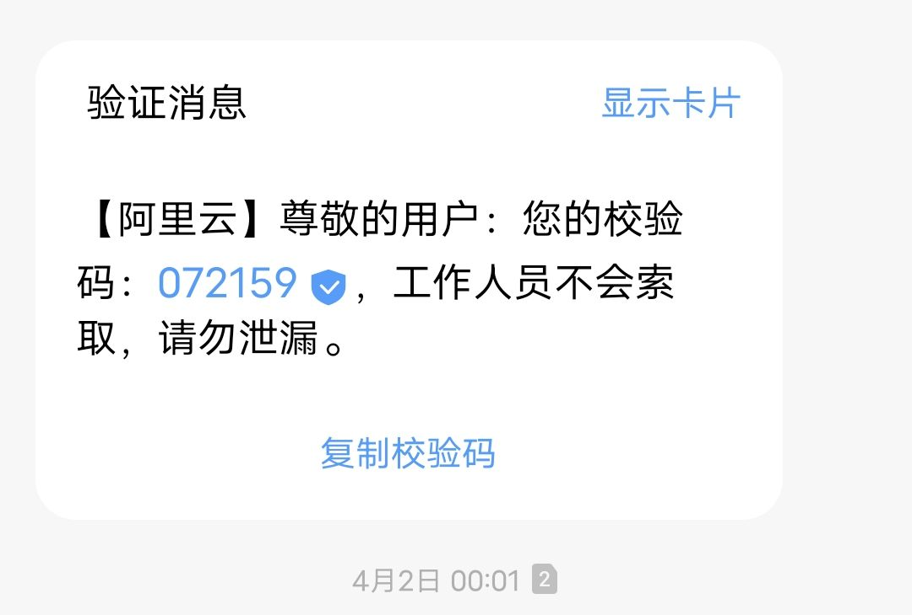

# 短信验证码实现


<!--more-->

# 阿里云短信服务



1、添加用户组和相关权限



2、创建一个用户、获取相应的Acessce Key

**要将这个账户保存下来**，只显示一次，如果被泄露马上禁用生成新的，后面需要用到



# 开通阿里云短信服务

[帮助指南](https://help.aliyun.com/product/44282.html?spm=5176.8911205.0.0.55601cbeHlxslv)

1、开通短信服务，找到短信控制台面板



2、添加短信模板、添加签名（中括号里面的名称）



# 编写代码测试

在pom文件中添加如下依赖

```xml
<dependency>
            <groupId>com.aliyun</groupId>
            <artifactId>aliyun-java-sdk-core</artifactId>
            <version>4.5.16</version>
        </dependency>

        <dependency>
            <groupId>com.alibaba</groupId>
            <artifactId>fastjson</artifactId>
            <version>1.2.62</version>
        </dependency>

        <dependency>
            <groupId>org.springframework.boot</groupId>
            <artifactId>spring-boot-starter-data-redis</artifactId>
        </dependency>
```

2、编写服务与服务实现：

```java
package com.example.democompose.Service.Impl;

import com.alibaba.fastjson.JSONObject;
import com.aliyuncs.CommonRequest;
import com.aliyuncs.CommonResponse;
import com.aliyuncs.DefaultAcsClient;
import com.aliyuncs.IAcsClient;
import com.aliyuncs.exceptions.ClientException;
import com.aliyuncs.exceptions.ServerException;
import com.aliyuncs.http.MethodType;
import com.aliyuncs.profile.DefaultProfile;
import com.example.democompose.Service.SendSms;
import org.springframework.stereotype.Service;
import java.util.HashMap;
import java.util.Map;

@Service
public class SendSmsImpl implements SendSms {
    @Override
    public boolean send(String phoneNum, String templateCode, Map<String, Object> map) {
        DefaultProfile profile = DefaultProfile.getProfile("cn-qingdao", "accessKeyIdxxxxxx", "accessKeySecretxxxxxxx");
        IAcsClient client = new DefaultAcsClient(profile);

        CommonRequest request = new CommonRequest();
        request.setSysMethod(MethodType.POST);
        request.setSysDomain("dysmsapi.aliyuncs.com");
        request.setSysVersion("2017-05-25");
        request.setSysAction("SendSms");
        request.putQueryParameter("PhoneNumbers", phoneNum);
        request.putQueryParameter("SignName", "东猿叔");
        request.putQueryParameter("TemplateCode", templateCode);


        request.putQueryParameter("TemplateParam", JSONObject.toJSONString(map));
        try {
            CommonResponse response = client.getCommonResponse(request);
            System.out.println(response.getData());
            return response.getHttpResponse().isSuccess();
        } catch (ServerException e) {
            e.printStackTrace();
        } catch (ClientException e) {
            e.printStackTrace();
        }
        return false;
    }
}

```

3、controller调用：

```java
package com.example.democompose.Controller;

import com.aliyuncs.utils.StringUtils;
import com.example.democompose.Service.SendSms;
import org.springframework.beans.factory.annotation.Autowired;
import org.springframework.data.redis.core.RedisTemplate;
import org.springframework.web.bind.annotation.CrossOrigin;
import org.springframework.web.bind.annotation.GetMapping;
import org.springframework.web.bind.annotation.PathVariable;
import org.springframework.web.bind.annotation.RestController;
import java.util.HashMap;
import java.util.UUID;
import java.util.concurrent.TimeUnit;

@RestController
@CrossOrigin
public class SendSmsController {
    @Autowired
    private SendSms sendSms;

    @Autowired
    private RedisTemplate redisTemplate;

    @GetMapping("/send/{phone}")
    public String code(@PathVariable("phone")String phone){
        String code=(String) redisTemplate.opsForValue().get(phone);
        if(!StringUtils.isEmpty(code)){
            return phone+":"+code+"已经存在，还没有过期";
        }
        code = UUID.randomUUID().toString().substring(0, 4);
        HashMap<String,Object> param=new HashMap<>();
        param.put("code",code);
        boolean isSend = sendSms.send(phone, "SMS_215116099", param);
        if(isSend){
            redisTemplate.opsForValue().set(phone,code,5, TimeUnit.MINUTES);
            return phone+":"+code+"发送成功";
        }else{
            return phone+":"+code+"发送失败";
        }
    }
}

```


